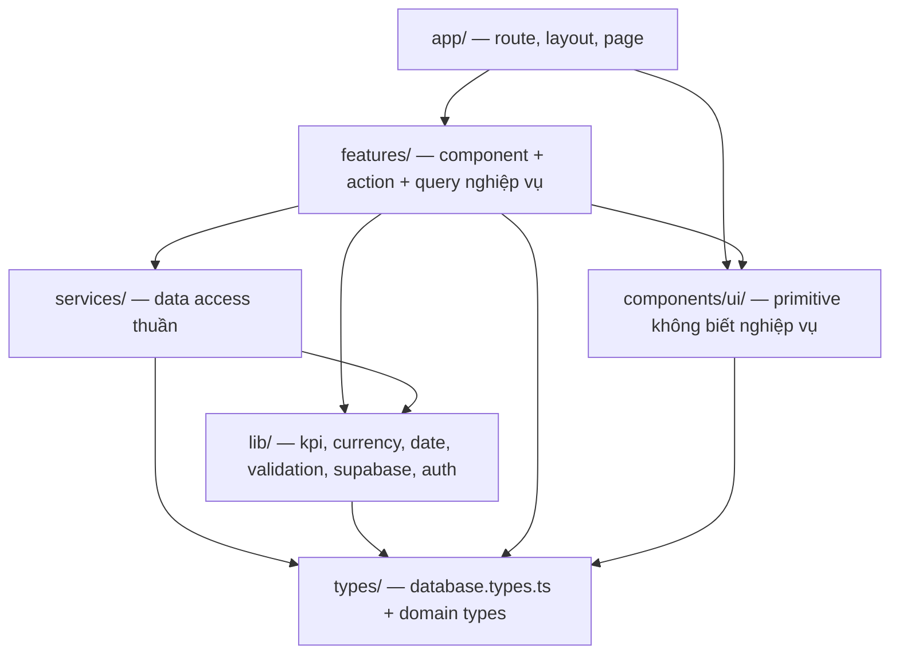

# AGENTS.md — Engineering Rules cho BikeForce
> Status: ACTIVE | Phase: 1 (đã hoàn tất) | Last updated: 2026-08-07
> Nguồn sự thật cấp trên: BIKEFORCE_MASTER_SPEC.md → docs/11-decisions.md → tài liệu này

> `CLAUDE.md` trả lời **"đọc gì, làm theo quy trình nào"**. File này trả lời **"viết code thế nào"**.
> Đọc file này **trước khi gõ dòng code đầu tiên** của bất kỳ phase nào từ Phase 1 trở đi.
>
> **Cập nhật 2026-08-07 (sau Phase 1):** repository **đã có source code**. Những phần dưới đây đã được triển khai thật và phải tuân theo, không còn là đề xuất: §1 cấu trúc thư mục, §2 TypeScript (`strict` + `noUncheckedIndexedAccess`, `no-explicit-any` mức `error`), §6 ba Supabase client, §10 design token và primitive UI. Phần còn lại (§5 `services/`, §7 RLS, §8 Server Action, §9 thân hàm `lib/kpi|currency|date`, §11 test) **vẫn là hợp đồng cho code sắp viết** — chưa có dòng nào.

---

## 1. ARCHITECTURE — LAYERING

### 1.1 Chiều phụ thuộc



Mũi tên = "được phép import". **Không có mũi tên ngược.**

### 1.2 Ai được import gì

| Tầng | ĐƯỢC import | KHÔNG được import |
|---|---|---|
| `app/` | `features/`, `components/ui/`, `lib/`, `types/` | `services/` trực tiếp trong page phức tạp — đi qua `features/*/queries.ts`. Ngoại lệ: RSC đơn giản có thể gọi `services/` trực tiếp, nhưng không được tự viết query inline |
| `features/<X>/` | `components/ui/`, `lib/`, `services/`, `types/`, `features/<X>/` (nội bộ), **`features/auth/` (ngoại lệ duy nhất — DEC-036)** | `features/<Y>/` khác — dùng chung thì nâng lên `lib/` hoặc `components/ui/` |
| `components/ui/` | `lib/` (chỉ helper thuần như `cn`), `types/` | `services/`, `features/`, `lib/supabase/*` — primitive **không biết gì về nghiệp vụ và dữ liệu** |
| `lib/` | `types/`, `lib/` khác | `app/`, `features/`, `components/`, `services/` |
| `services/` | `lib/` (kiểu, helper), `types/` | `app/`, `features/`, `components/` |
| `types/` | — | tất cả |

**Ngoại lệ `features/auth/` (DEC-036, Phase 4).** Guard quyền phải chạm `services/profiles`, mà `lib/` bị cấm import `services/` — nên nó không thể nâng lên `lib/`. Vì vậy `features/auth/queries.ts` (`requireProfile`, `requireRole`, `authorizeSalesWrite`) là **thứ duy nhất** một feature khác được phép import từ một feature khác. Không mở rộng ngoại lệ này cho bất kỳ feature nào khác mà không có DEC mới.

**Hook React dùng chung** đặt ở `lib/hooks/` (DEC-035) — chỉ hook **thuần**: không `services/`, không `lib/supabase/*`, không nghiệp vụ. Hiện có `use-report-draft.ts`.

### 1.3 Hai luật cứng, không có ngoại lệ

1. **Business logic không bao giờ nằm trong component.** Không có công thức `%`, không có phép so sánh ngưỡng KPI, không có `Intl.NumberFormat`, không có tính ngày trong file `.tsx`. Tất cả nằm ở `lib/`.
2. **Data access không bao giờ nằm trong component.** Không có `supabase.from(...)` trong file `.tsx`. Truy vấn nằm ở `services/`; component nhận dữ liệu đã typed.

Vi phạm 1 trong 2 luật này là lý do đủ để **từ chối** một thay đổi, kể cả khi code chạy đúng.

### 1.4 Đọc và ghi

- **Đọc dữ liệu** → Server Component gọi `services/` với `lib/supabase/server.ts` client. Không `useEffect` + fetch.
- **Ghi dữ liệu** → Server Action: `Zod parse` → `auth check` → `role check` → `ownership check` → `services/` → `revalidatePath`.
- **Không xây REST API riêng cho CRUD báo cáo** (DEC-003). Route Handler chỉ tồn tại cho `GET /api/reports/[id]/share-image`.

---

## 2. TYPESCRIPT

- `strict: true` bắt buộc, kèm `noUncheckedIndexedAccess`. Không nới lỏng `tsconfig.json` để cho code chạy.
- **`any` bị cấm** (NFR-012, ESLint `no-explicit-any` mức `error`). Không biết kiểu thì dùng `unknown` rồi thu hẹp bằng type guard hoặc Zod.
- **Không `!` (non-null assertion) nếu không có comment ngay trên dòng đó** giải thích vì sao chắc chắn không null. Ưu tiên narrowing thật thay vì `!`.
- **Dùng kiểu generate từ database**, không tự gõ lại shape của bảng:
  ```ts
  import type { Database } from '@/types/database.types';
  type DailyReportRow = Database['public']['Tables']['daily_reports']['Row'];
  type DailyReportInsert = Database['public']['Tables']['daily_reports']['Insert'];
  type ReportStatus = Database['public']['Enums']['report_status'];
  ```
- **Kết quả Server Action là discriminated union**, không phải object mơ hồ:
  ```ts
  export type ActionResult<T = void> =
    | { ok: true; data: T }
    | { ok: false; code: 'VALIDATION' | 'UNAUTHORIZED' | 'FORBIDDEN' | 'CONFLICT' | 'NOT_FOUND' | 'UNKNOWN';
        message: string; fieldErrors?: Record<string, string[]> };
  ```
  Client phân nhánh bằng `if (!result.ok)`. Không throw xuyên biên giới Server Action để báo lỗi nghiệp vụ.
- Không `as` để ép kiểu qua mặt compiler. `as const` cho literal thì được.
- Không `enum` của TypeScript — dùng union type hoặc enum của Postgres đã generate.
- Không dùng `React.FC`. Khai báo props bằng `type Props = {...}` ngay trên component.

---

## 3. NAMING CONVENTIONS

| Đối tượng | Quy ước | Ví dụ |
|---|---|---|
| File / thư mục | `kebab-case` | `morning-report-form.tsx`, `features/report-share/` |
| React component | `PascalCase` | `MorningReportForm`, `DailyReportShareCard`, `AchievementBadge` |
| Hook | `useX`, file `use-x.ts` | `useReportDraft` trong `use-report-draft.ts` |
| Server Action | `verbNoun` | `saveMorningReport`, `completeEveningReport`, `createSalesAccount`, `toggleSalesActive` |
| Service function | `verbNoun` mô tả dữ liệu | `getTodayReport`, `listReportsByMonth`, `getTeamDailySummary` |
| DB table / column / function | `snake_case` | `daily_reports`, `target_sales_quantity`, `vn_today()` |
| DB enum value | `SCREAMING_SNAKE_CASE` | `MORNING_SUBMITTED`, `COMPLETED`, `ADMIN`, `SALES` |
| Zod schema | `xxxSchema` | `morningReportSchema`, `eveningReportSchema`, `createSalesSchema` |
| Type / interface | `PascalCase`, không tiền tố `I` | `AchievementResult`, `ActionResult`, `ReportListFilters` |
| Constant | `SCREAMING_SNAKE_CASE` | `MAX_REVENUE_VND`, `PAGE_SIZE` |
| CSS token | `--color-*` theo `docs/05` | `--color-primary`, `--color-input-border` |

- Tên biến bằng tiếng Anh. Chuỗi hiển thị cho người dùng bằng tiếng Việt.
- Không viết tắt mơ hồ: `targetRevenue` chứ không `tgtRev`; `salesId` chứ không `sid`.

---

## 4. COMPONENT

- **Server Component là mặc định.** Không thêm `'use client'` theo phản xạ.
- `'use client'` chỉ khi thật sự cần: state form, event handler, `navigator.share`, `localStorage`, toast, animation. **Đẩy `'use client'` xuống sâu nhất có thể** — tách phần tương tác thành component con, giữ page và layout ở phía server.
- **Một file xuất đúng một component.** Sub-component chỉ dùng nội bộ thì để cùng file nhưng không export.
- **Không component dài quá ~200 dòng.** Vượt ngưỡng là dấu hiệu phải tách: form → field group; danh sách → row component; trang → section.
- Component `components/ui/` là primitive **không biết nghiệp vụ**: không import `services/`, không import `lib/supabase/*`, không nhận `DailyReportRow` làm prop. Nhận props nguyên thuỷ và `children`.
- Component `features/` được biết nghiệp vụ, nhận typed domain data đã chuẩn bị sẵn từ server.
- Không truyền `supabase client` xuống component. Không truyền secret xuống component.
- Mỗi route group có `loading.tsx`, `error.tsx`, `not-found.tsx`. Mọi danh sách có empty state (icon + câu hướng dẫn + CTA), mọi thao tác >300ms có skeleton.
- Ảnh 9:16 dùng **component riêng** `features/report-share/DailyReportShareCard.tsx`, chia sẻ chung một "view model" với UI để số liệu không lệch. **Không screenshot cả trang.**

---

## 5. DATA ACCESS (`services/`)

- **Mỗi hàm trong `services/` nhận `supabase client` làm tham số, không bao giờ tự tạo client bên trong.** Tầng gọi quyết định chạy dưới client nào; service chỉ biết truy vấn.
  ```ts
  // services/reports.ts
  export async function getTodayReport(
    supabase: SupabaseClient<Database>,
    salesId: string,
    today: string,
  ): Promise<DailyReportRow | null> { /* ... */ }
  ```
  Nhờ vậy service test được với client của user thật trong RLS test.
- **Không bao giờ `select('*')`.** Liệt kê tường minh cột cần dùng (NFR-002). `select('*')` kéo cột thừa, phá index-only scan và làm rò dữ liệu ngoài ý muốn khi schema mở rộng.
- **Mọi truy vấn danh sách phải phân trang** bằng `.range(from, to)` kèm `count: 'exact'` hoặc `'planned'`, và có `PAGE_SIZE` từ constant. Không có endpoint nào trả "tất cả báo cáo".
- **Filter và sort thực hiện server-side** (FR-026). Không tải hết rồi lọc trong JS.
- Truy vấn phải bám index đã thiết kế trong `docs/02-database-design.md` (`uq_daily_reports_sales_date`, `idx_daily_reports_date_status`, `idx_daily_reports_sales_date_desc`, `idx_profiles_role_active`). Thêm truy vấn mới mà không có index phù hợp → phải thêm index trong cùng migration hoặc ghi `ISSUE-xxx`.
- Tránh N+1: cần tên Sales thì `select` kèm quan hệ trong một câu, không loop gọi `getProfile`.
- Service trả **typed data hoặc `null`**, không trả `PostgrestResponse` thô lên trên.
- Service **không** format tiền, **không** tính `%`, **không** dựng chuỗi ngày hiển thị. Đó là việc của `lib/` và tầng UI.
- Aggregate cho Admin (AF-05, AF-06) làm bằng SQL/RPC, không kéo hàng nghìn row về Node để cộng.

---

## 6. SUPABASE — BA CLIENT, BA MỤC ĐÍCH, KHÔNG DÙNG LẪN

| File | Cách tạo | Được dùng ở | Chỉ dùng cho |
|---|---|---|---|
| `lib/supabase/client.ts` | `createBrowserClient` + anon key | Client Component | Auth UI phía trình duyệt. **Chịu RLS.** Realtime không dùng ở v1 |
| `lib/supabase/server.ts` | `createServerClient` + `cookies()` + anon key | Server Component, Server Action, Route Handler, `middleware.ts` | **Đường dữ liệu chính.** Đọc/ghi `profiles` và `daily_reports`. **Chịu RLS** |
| `lib/supabase/admin.ts` | service role key + `import 'server-only'` | Server Action quản lý tài khoản (UC-17, UC-18, UC-19) | **Chỉ** `auth.admin.createUser` / `auth.admin.updateUserById` |

- **Tuyệt đối không dùng service-role client để đọc hay ghi `daily_reports`, hay để lấy dữ liệu cho bất kỳ báo cáo/dashboard/analytics nào** (DEC-005). Service role bỏ qua RLS — dùng nó cho report data là tự vô hiệu hoá toàn bộ mô hình bảo mật.
- `lib/supabase/admin.ts` phải mở đầu bằng `import 'server-only';`. Nếu file này lọt vào client bundle, build phải fail.
- Không tạo client Supabase ad-hoc ở nơi khác. Chỉ 3 file trên, **cộng đúng một ngoại lệ đã ghi nhận**: `middleware.ts` tự tạo client bằng `createServerClient` ngay trong file, vì client của `lib/supabase/server.ts` dùng `cookies()` từ `next/headers` — thứ **không tồn tại** trong ngữ cảnh middleware. Middleware phải đọc cookie từ `request` và ghi cookie mới vào `response`, hai đối tượng chỉ có ở đó. Ngoại lệ này vẫn dùng **anon key** và vẫn chịu RLS.
- `middleware.ts` refresh session cookie và guard route/role. Đây là **UX + defense-in-depth**, không phải biên giới bảo mật (DEC-004).
- **`service_role` KHÔNG có quyền DML trên `profiles` và `daily_reports`** (DEC-031) — `rolbypassrls` không vượt qua `GRANT`. Nghĩa là DEC-005 được **database ép**, không chỉ là kỷ luật code. Đừng cấp thêm quyền cho `service_role` để "cho tiện"; có test khoá lại và nó sẽ đỏ.
- Schema chỉ đổi bằng migration trong `supabase/migrations/`, đẩy bằng `supabase db push`. **Không sửa schema bằng tay trên Supabase Dashboard.** Migration chỉ tiến tới; muốn lùi thì viết migration mới.
- Sau mỗi lần đổi schema: `supabase gen types typescript --linked > types/database.types.ts` rồi commit.

---

## 7. RLS

- **Mọi bảng trong schema `public` đều bật RLS**, deny-by-default (NFR-004).
- Migration tạo bảng mới **phải chứa trong cùng file**: `create table` + `alter table ... enable row level security` + `alter table ... force row level security` + **policy tường minh cho từng operation cần cấp**. Không tách sang migration sau, không để "làm nốt ở bước sau".
- Operation không được cấp policy thì **không cấp** — ví dụ `DELETE` trên `daily_reports` không có policy nào (BR-013 — APPROVED, OQ-13 trả lời "không xoá"), `INSERT` trên `profiles` không cấp cho `authenticated`.
- **Không bao giờ `disable row level security` để một query chạy được.** Query không chạy nghĩa là policy sai hoặc thiết kế sai — sửa policy hoặc sửa truy vấn, không hạ hàng rào.
- Helper `public.is_admin()` phải là `stable security definer set search_path = public, pg_temp`, nếu không policy trên `profiles` tự truy vấn `profiles` sẽ **infinite recursion** (DEC-006).
- Trong policy luôn viết dạng bọc `select`: `(select public.is_admin())`, `(select auth.uid())` — Postgres nâng thành InitPlan và đánh giá một lần cho cả câu lệnh thay vì mỗi row (ISSUE-005).
- Thay đổi policy **phải** kèm cập nhật `docs/02-database-design.md` và `docs/06-auth-permissions.md`, cộng test RLS tương ứng.
- Không dựa vào việc ẩn nút/menu ở frontend làm bảo mật.

---

## 8. SECURITY

- **Mọi Server Action validate input bằng Zod trước khi làm bất cứ việc gì khác** (NFR-006, FR-004). `safeParse`, trả `{ ok: false, code: 'VALIDATION', fieldErrors }`, không throw.
- **Mọi Server Action tự kiểm tra lại phía server: `auth` → `role` → `ownership`.** Không tin rằng middleware hay layout đã chặn. Defense in depth là bắt buộc, không phải tuỳ chọn.
- **Không bao giờ nhận `sales_id` từ client.** `sales_id` luôn lấy từ session server-side (`auth.uid()`). Nếu một payload chứa `sales_id`, đó là bug bảo mật — bỏ trường đó khỏi schema Zod.
- Tương tự: không nhận `role`, `is_active`, `status`, `report_date` từ client như dữ liệu tin cậy. `report_date` lấy từ `getVietnamToday()` server-side (BR-005, BR-021).
- Truy cập theo `id` (ví dụ `/sales/reports/[id]`) phải để RLS quyết định; kết quả rỗng → `notFound()`. Không tự lọc bằng `if (row.sales_id !== user.id)` **thay cho** RLS — chỉ dùng thêm, không dùng thay.
- **Không biến môi trường bí mật nào mang prefix `NEXT_PUBLIC_`.** Public-safe: `NEXT_PUBLIC_SUPABASE_URL`, `NEXT_PUBLIC_SUPABASE_ANON_KEY`, `NEXT_PUBLIC_SITE_URL`. Bí mật: `SUPABASE_SERVICE_ROLE_KEY` (server-only).
- `.env.example` chỉ chứa **tên biến + placeholder**, không giá trị thật. `.env*` nằm trong `.gitignore`.
- CI có bước grep client bundle để chắc chắn service role key không rò rỉ (NFR-005).
- Lỗi phía server ghi log đầy đủ ở server; client chỉ nhận message an toàn, không stack trace, không chi tiết SQL (NFR-014).
- Không `dangerouslySetInnerHTML`. Ghi chú cuối ngày là plain text, render bằng text node.
- Route handler ảnh trả `Cache-Control: private, no-store`.

---

## 9. BUSINESS LOGIC — CHỈ Ở `lib/`, KHÔNG NHÂN BẢN

Bốn cái tên sau là **canonical**. Không đặt tên khác, không viết bản sao, không inline lại công thức ở bất kỳ đâu:

| Hàm | File | Trách nhiệm |
|---|---|---|
| `calculateAchievement(target, actual)` | `lib/kpi.ts` | Trả `AchievementResult = { percent: number \| null; status: AchievementStatus; display: string }` |
| `getAchievementStatus(pct)` | `lib/kpi.ts` | `'EXCEEDED' \| 'NEAR' \| 'MISSED' \| 'PENDING'` |
| `formatCurrencyVND(value)` | `lib/currency.ts` | `125000000` → `125.000.000 ₫` bằng `Intl.NumberFormat('vi-VN', { style:'currency', currency:'VND', maximumFractionDigits:0 })` |
| `getVietnamToday()` | `lib/date.ts` | `YYYY-MM-DD` theo `Asia/Ho_Chi_Minh`, dùng `Intl.DateTimeFormat('en-CA', { timeZone: 'Asia/Ho_Chi_Minh' })` |

Đi kèm: `parseCurrencyInput()` (`lib/currency.ts`); `formatVietnamDate()`, `isValidVietnamDate()` và **nhóm 5 hàm tháng** (`getVietnamMonthRange` — trả `null` khi sai định dạng theo **DEC-040**, `getVietnamCurrentMonth`, `formatVietnamMonth`, `shiftVietnamMonth`, `resolveVietnamMonth`) ở `lib/date.ts`; `kpiMetricRow()` và `KPI_METRIC_ROWS` (`lib/reports/metric-rows.ts` — nguồn **duy nhất** của “4 chỉ tiêu là gì”); `buildTrendChart()` (`lib/reports/trend-chart.ts`).

Quy tắc:

- Component, service, Server Action, route handler ảnh — tất cả **gọi** các hàm này, không tự tính.
- `achievement = actual / target × 100`; cho phép **> 100%**, **không clamp** (BR-004). Làm tròn 1 chữ số thập phân chỉ ở tầng hiển thị (BR-014).
- **Không bao giờ để `NaN` hay `Infinity` lọt ra UI.** `display` của `AchievementResult` là chuỗi đã sẵn sàng render (`'80,0%'`, `'125,0%'`, `'—'`).
- Trường hợp `target = 0` đi theo `BR-015`, **đã APPROVED** (OQ-11): `actual = 0` → `100,0%`; `actual > 0` → `percent = null` và hiển thị **số vượt tuyệt đối** có dấu cộng + đơn vị (`+3 xe`, `+2 điểm`, `+5 khách`, `+3.000.000 ₫`), nhãn "Vượt kế hoạch"; khi tổng hợp của Admin thì **loại dòng này khỏi mẫu số**. Ghi chú cũ comment rằng rule chưa APPROVED.
- **Achievement không persist vào DB** (BR-011, DEC-007). Không thêm cột `%`, không cache vào bảng.
- Tiền lưu `bigint` VND; format chỉ ở tầng hiển thị (BR-010, DEC-008).
- **Không dùng `new Date()` để suy ra ngày nghiệp vụ.** Chỉ `getVietnamToday()`. Không thêm dependency timezone (DEC-009).
- Zod schema tập trung ở `lib/validation/`, dùng chung cho client form và Server Action — một nguồn, không hai bản.
- **Chuỗi thông báo dùng chung cũng ở `lib/`**, không ở `features/*/actions.ts`: `lib/auth/messages.ts`, `lib/reports/messages.ts`, `lib/account/messages.ts`, `lib/admin/messages.ts`.

> ⛔ **LUẬT CỨNG — file `'use server'` CHỈ được export async function và `export type`** (DEC-045).
> Export một object hằng số làm Next ném lỗi **lúc chạy**: *A "use server" file can only export
> async functions, found object.* Nguy hiểm ở chỗ `next build`, `tsc --noEmit`, `eslint` và toàn bộ
> unit test **đều xanh** — chỉ người dùng mở đúng trang đó mới thấy. Việc này đã xảy ra thật và làm
> hỏng toàn bộ UC-17 (ISSUE-016); chỉ bộ E2E của Phase 11 bắt được.
>
> **Hệ quả bắt buộc cho testing:** bộ E2E phải chạm **ít nhất một Server Action của mỗi feature**.
> Thêm feature mới có Server Action mà không có bài E2E chạm tới nó là để lại một lỗ hổng cùng loại.

---

## 10. UI — RÀNG BUỘC RÚT RA TỪ `ui-ux-pro-max`

Chi tiết đầy đủ ở `docs/05-ui-ux-design.md`. Đây là phần bắt buộc khi code:

**Touch & input**
- Touch target tối thiểu **44×44px** (`touch-target-size`); khoảng cách giữa các target ≥ 8px (`touch-spacing`).
- Input tối thiểu **`min-h-[48px]`** và **`text-base` (16px)** — dưới 16px iOS tự zoom (`readable-font-size`).
- **Label luôn hiển thị**, không dùng placeholder thay label (`input-labels`).
- Trường số: `inputMode="numeric"` + `pattern="[0-9]*"` + `enterKeyHint` phù hợp (`input-type-keyboard`).
- `touch-action: manipulation` để bỏ tap delay.

**Layout & responsive**
- Mobile-first từ **375px**; breakpoint 375 / 768 / 1024 / 1440 (`breakpoint-consistency`).
- **Không cuộn ngang, tuyệt đối** (`horizontal-scroll` bị cấm). Bảng so sánh trên mobile render 4 card, chỉ dùng `<table>` từ 768px (DEC-019).
- `min-h-dvh` thay `100vh` (`viewport-units`). Sticky CTA bar có `pb-[env(safe-area-inset-bottom)]`; danh sách có `pb-20` để không bị bottom nav che (`fixed-element-offset`).
- Spacing theo nhịp 4/8px: `4 8 12 16 24 32 48 64`.
- Bottom nav ≤ 5 mục, **icon và label cùng lúc**; sidebar từ 1024px; không hiển thị đồng thời (DEC-018).
- Không bao giờ disable zoom trong `viewport meta`.

**Màu & icon**
- Chỉ dùng **semantic token** (`--color-primary`, `--color-foreground`, `--color-input-border`, `--color-success`, `--color-warning`, `--color-destructive`, `--color-ring`…). **Không hardcode hex trong component.** Ngoại lệ duy nhất: thẻ share 9:16 dùng bảng hex dark cố định vì Satori.
- Viền của control tương tác dùng `--color-input-border`, **không** dùng `--color-border` (border chỉ là dải trang trí, 1.23:1).
- Trạng thái **không bao giờ chỉ bằng màu** (`color-not-only`): badge luôn có icon + text (`TrendingUp` / `Minus` / `TrendingDown` / `Clock`).
- **Icon dùng `lucide-react`, không dùng emoji** (`no-emoji-icons`).
- Không dark mode ở v1 (DEC-016).

**Motion**
- Chỉ animate `transform` và `opacity` (`transform-performance`). Thời lượng **150–300ms** (`duration-timing`); dự án dùng 150–200ms.
- Tôn trọng `prefers-reduced-motion: reduce` — tắt hoặc rút ngắn về gần 0 (`reduced-motion`).
- Không GSAP, không thư viện animation (DEC-015).

**Form & feedback**
- Validate on blur, không validate từng phím (`inline-validation`). Lỗi đặt **ngay dưới field** với `role="alert"` (`error-placement`, `aria-live-errors`).
- Autofocus field lỗi đầu tiên; nhiều lỗi thì có error summary.
- Nút submit disable + spinner khi đang gửi (`loading-buttons`), chống double submit.
- Save fail: **giữ nguyên form data**, hiển thị lỗi rõ, không reset (Master Spec §12).
- Cảnh báo khi rời trang có thay đổi chưa lưu (`sheet-dismiss-confirm`).
- Skeleton cho chờ > 300ms; empty state có icon + hướng dẫn + CTA; error state có nút "Thử lại".

**A11y**
- WCAG 2.2 AA toàn bộ: text ≥ 4.5:1, UI component ≥ 3:1 (NFR-007).
- Heading tuần tự, có skip link, focus ring rõ (2px, offset 2px), focus chuyển đúng khi đổi route.
- Số liệu dùng `font-variant-numeric: tabular-nums` (`number-tabular`).
- Ưu tiên xuống dòng hơn cắt chữ (`truncation-strategy`).

---

## 11. TESTING

Chi tiết ở `docs/08-testing-strategy.md`. Điều kiện tối thiểu để **đóng một phase**:

| Phase | Bắt buộc phải có test trước khi đóng |
|---|---|
| Phase 2 — Database & Auth | ✅ **ĐÃ XONG 2026-08-07 — 80/80 PASS.** Integration: persist báo cáo, vi phạm `UNIQUE(sales_id, report_date)`, CHECK `ck_completed_requires_actuals`, trigger chặn `COMPLETED → MORNING_SUBMITTED`, trigger chặn Sales tự đổi `role`. **RLS test bằng JWT thật của salesA / salesB / admin**: salesA đọc report salesB → 0 rows; salesA update report salesB → 0 rows affected; salesA insert với `sales_id = salesB` → bị từ chối; salesA delete → bị từ chối; admin đọc tất cả → có dữ liệu; user inactive → bị chặn. Chạy bằng `npm run test:db` (cần `npm run db:start`) |
| Phase 3 / 4 — Morning & Evening Report | Unit cho Zod schema: từ chối số âm, `NaN`, `Infinity`, chuỗi rác, ngày tương lai. E2E luồng lưu và mở lại |
| Phase 5 — KPI Engine | Unit `calculateAchievement`: `target=0 & actual=0`, `target=0 & actual>0`, `actual>target`, `actual<target`, `actual=target`, `actual=null`. `getAchievementStatus` tại biên 79.99 / 80 / 99.99 / 100. `formatCurrencyVND` với 0 / 1000 / 125000000 / 99999999999. `parseCurrencyInput`. `getVietnamToday` mock 16:59Z và 17:01Z phải ra hai ngày khác nhau; 23:30 VN và 00:30 VN |
| Phase 6 — Image Export | Edge case thẻ 9:16: tên 40+ ký tự, tuyến 300 ký tự, ghi chú 1000 ký tự, doanh thu 12 chữ số, achievement 4 chữ số, `—` khi `target=0`, dấu tiếng Việt đầy đủ. Security: `GET /api/reports/<id-của-salesB>/share-image` từ salesA → 403/404 |
| Phase 7–10 — History, Admin | E2E Sales: Login → Today → Morning → Save → Reopen → Evening → Save → Comparison → Export. E2E Admin: Login → Dashboard → Reports → Filter tháng → Filter Sales → Detail |
| Phase 11 — Testing & Security | E2E security: salesA truy cập trực tiếp `/sales/reports/<id-của-salesB>` → 404/redirect. A11y `@axe-core/playwright` trên `/login`, `/sales/today`, `/sales/today/morning`, `/admin` → 0 violation mức serious/critical |

Quy tắc chung:

- E2E chạy 3 project Playwright: `mobile-375`, `desktop-1440`, `zalo-like` (userAgent webview).
- **RLS test bằng client Supabase trực tiếp, không qua UI.** UI pass không chứng minh RLS đúng.
- DB/RLS test chạy trên **Supabase local qua Supabase CLI**, không bao giờ test trên project production (DEC-022).
- Coverage mục tiêu: `lib/**` ≥ 90%, tổng thể ≥ 60%. Không đặt 100% để tránh test rác.
- Bug được fix **phải** có test tái hiện trước khi đóng `ISSUE-xxx`.
- **Không được ghi bất kỳ trạng thái test/build nào là PASS nếu chưa thực sự chạy và thấy kết quả.**

---

## 12. DOCUMENTATION

### 12.1 Ma trận cập nhật (Master Spec §62)

| Nếu thay đổi… | Bắt buộc cập nhật |
|---|---|
| Business rule | `docs/01-business-analysis.md` + `docs/11-decisions.md` |
| Database | `docs/02-database-design.md` |
| Workflow | `docs/03-workflow.md` |
| Architecture | `docs/04-system-architecture.md` |
| UI structure | `docs/05-ui-ux-design.md` |
| Permission | `docs/06-auth-permissions.md` |
| API / data flow | `docs/07-api-data-flow.md` |
| Testing | `docs/08-testing-strategy.md` |
| Deployment | `docs/09-deployment.md` |
| Bug mới | `docs/12-known-issues.md` |
| **Hoàn thành task** | `WORKLOG.md` + `PROJECT_CHECKLIST.md` + `SESSION_CHECKPOINT.md` |

### 12.2 Quy tắc

- **Một task chưa DONE cho tới khi docs + `PROJECT_CHECKLIST.md` + `WORKLOG.md` + `SESSION_CHECKPOINT.md` đã được cập nhật.** Code chạy được không phải là DONE (Master Spec §63).
- Dùng đúng hệ ID sẵn có: `UC-xx`, `FR-xxx`, `NFR-xxx`, `BR-xxx`, `OQ-xx`, `DEC-xxx`, `ISSUE-xxx`, `AF-xx`. **Không đánh số lại, không tạo ID mới ngoài dãy đang có.**
- Quyết định kỹ thuật mới → thêm `DEC-xxx` với đủ `Date / Decision / Reason / Alternatives / Impact / Status`. Đổi một quyết định `APPROVED` mà không cập nhật log là vi phạm.
- Bug mới → thêm `ISSUE-xxx` với đủ `Severity / Status / Module / Description / Expected / Actual / Root Cause / Fix / Verification`. **Không xoá issue sau khi fix** — chỉ đổi `Status` sang `CLOSED`.
- Tài liệu chưa đủ thông tin vì đang chờ người dùng → giữ `Status: DRAFT` và có mục `## OPEN QUESTIONS`. Không xoá file.
- Prose tiếng Việt, định danh kỹ thuật tiếng Anh. Không viết secret thật vào docs, chỉ placeholder.

---

## 13. GIT

- Repository **đã được khởi tạo ở Phase 0** (DEC-028 điều chỉnh mốc của DEC-027) trên nhánh `main`, remote `origin` = `https://github.com/LeDuyKhangZz/BikeForce-Bicycle-Sales-Management.git`. `.gitignore` đã có và chặn `.env*` (mở ngoại lệ `.env.example`), `node_modules/`, `.next/`, `coverage/`, `playwright-report/`, `test-results/`.
- Commit theo phong cách conventional commit:
  ```
  feat(morning-report): thêm form cam kết đầu ngày
  fix(kpi): xử lý target=0 theo BR-015
  chore(deps): pin phiên bản sau smoke test DEC-002
  docs(02): cập nhật RLS policy sau khi chốt OQ-04
  test(rls): thêm case salesA đọc report salesB
  refactor(services): tách query danh sách báo cáo Admin
  ```
  Scope nên trùng tên feature/thư mục. Body nêu `BR-xxx` / `DEC-xxx` / `ISSUE-xxx` liên quan khi có.
- **Không bao giờ commit `.env`, `.env.local`, `.env.production`** hay bất kỳ file nào chứa key thật. Chỉ commit `.env.example` với placeholder.
- **`types/database.types.ts` là file generate.** Không sửa tay. Không commit sau khi đổi schema mà chưa chạy lại `supabase gen types typescript --linked`. File types lệch schema là nguồn lỗi runtime im lặng.
- Không commit `node_modules/`, `.next/`, artifact test, hay file ảnh export.
- Không force-push nhánh chung. Không rewrite lịch sử đã chia sẻ.
- Migration đã push thì **không sửa file cũ** — viết migration mới.

---

## 14. TRƯỚC KHI MỞ PR / KẾT THÚC TASK

Chạy hết, không bỏ mục nào:

- [ ] `npm run build` chạy sạch — và **chỉ ghi kết quả thật, không ghi PASS nếu chưa chạy**.
- [ ] `tsc --noEmit` sạch, không `any`, không `!` thiếu comment.
- [ ] `npm run lint` sạch, không disable rule để cho qua.
- [ ] Unit/integration/E2E liên quan đã chạy và pass.
- [ ] Nếu đụng dữ liệu: RLS test đã chạy, và không có policy nào bị nới lỏng.
- [ ] Nếu đụng UI: đã kiểm tra ở 375px, không cuộn ngang, touch target ≥ 44px, input ≥ 48px, focus ring rõ.
- [ ] Không có `select('*')`, không có danh sách thiếu phân trang.
- [ ] Không có `supabase.from(...)` hay công thức KPI trong file `.tsx`.
- [ ] Không có secret mới, không biến bí mật nào mang prefix `NEXT_PUBLIC_`.
- [ ] Không đổi `BR-xxx` đang `APPROVED` mà không có xác nhận của người dùng và `DEC-xxx` mới.
- [ ] `types/database.types.ts` đã regenerate nếu schema đổi.
- [ ] Docs liên quan đã cập nhật theo ma trận §12.1.
- [ ] `PROJECT_CHECKLIST.md`, `WORKLOG.md`, `SESSION_CHECKPOINT.md` đã cập nhật; `Next Exact Steps` đủ cụ thể để session sau gõ được ngay.

---

## OPEN QUESTIONS

Danh sách đầy đủ ở `docs/01-business-analysis.md §OPEN QUESTIONS`. Những câu ảnh hưởng trực tiếp tới các quy tắc kỹ thuật trong file này:

| ID | Câu hỏi rút gọn | Đề xuất mặc định | Ảnh hưởng tới quy tắc nào |
|---|---|---|---|
| OQ-04 | Hoàn tất báo cáo cuối ngày rồi có được sửa không? | Khoá ngay khi `COMPLETED` | §7 RLS `reports_update_own_open`, trigger, §11 test |
| OQ-05 | Admin có được sửa báo cáo của Sales không? | Không trong v1 | §7 RLS policy admin, nhu cầu audit log AF-12 |
| OQ-11 | Khi `target = 0` thì % hiển thị thế nào? | `actual=0` → 100%; `actual>0` → `—` + "Vượt kế hoạch" | §9 `calculateAchievement`, §11 unit test Phase 5 |
| OQ-12 | Nhập trễ / nhập bù / giờ cắt? | Chỉ đúng ngày hôm nay theo giờ VN | §7 RLS INSERT/UPDATE, §8 `report_date` server-side |
| OQ-13 | Xoá báo cáo: có/không, soft hay hard? | v1 không xoá | §7 không cấp policy `DELETE` |
| OQ-01 / OQ-02 | Cấu trúc trường "viếng thăm" mục tiêu và thực đạt | Mỗi bên một cột integer bắt buộc + một cột text optional | §2 kiểu generate, §5 cột `select`, §9 công thức dòng "Viếng thăm" |

Các business rule tương ứng — `BR-013`, `BR-015`, `BR-019`, `BR-020`, `BR-021`, `BR-024` — **đã `APPROVED`** ngày 2026-08-07 (DEC-025, DEC-026). Được phép implement thẳng theo chúng, và theo Master Spec §71 **không được tự ý thay đổi**. Ghi chú cũ: implement theo đề xuất mặc định là được, nhưng **phải comment rõ trong code là rule chưa APPROVED**, và không được viết migration Phase 2 trước khi 9 câu BLOCKING có câu trả lời (ISSUE-001).
