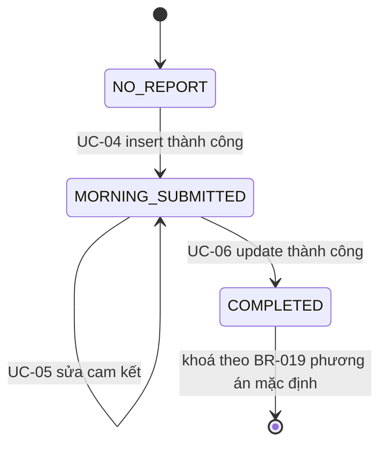
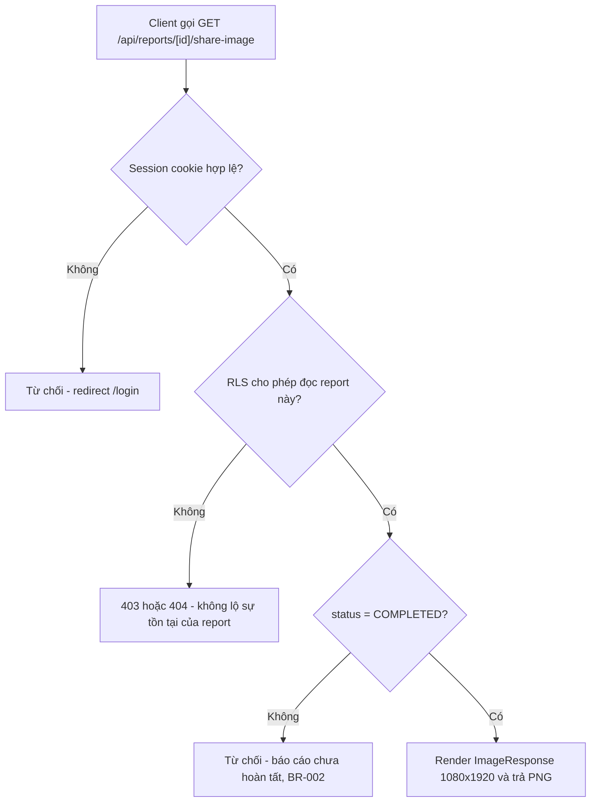

# 01 — Business Analysis (Phân tích nghiệp vụ)
> Status: DRAFT | Phase: 0 | Last updated: 2026-08-07
> Nguồn sự thật cấp trên: BIKEFORCE_MASTER_SPEC.md → docs/11-decisions.md → tài liệu này

---

## 0. CÁCH ĐỌC TÀI LIỆU NÀY

Đây là tài liệu nghiệp vụ gốc của BikeForce v1. Mọi tài liệu Phase 0 khác (`docs/02` … `docs/12`) đều dẫn chiếu về các định danh được định nghĩa ở đây.

| Tiền tố | Ý nghĩa | Định nghĩa tại |
|---|---|---|
| `UC-xx` | Use case | §5 tài liệu này |
| `FR-xxx` | Functional requirement | §6 tài liệu này |
| `NFR-xxx` | Non-functional requirement | §7 tài liệu này |
| `BR-xxx` | Business rule | §8 tài liệu này |
| `AF-xx` | Admin feature proposal | §12 tài liệu này |
| `OQ-xx` | Open question | §16 tài liệu này — **danh sách đầy đủ duy nhất** |
| `DEC-xxx` | Decision | `docs/11-decisions.md` (tóm tắt ở §15) |
| `ISSUE-xxx` | Known issue / risk | `docs/12-known-issues.md` |

**Trạng thái thực tế của repository tại thời điểm viết:** repository chỉ chứa `BIKEFORCE_MASTER_SPEC.md`, `PROMPT_FIRST_SESSION.md`, `PROMPT_NEXT_SESSION.md` và thư mục `docs/`. **Chưa có bất kỳ dòng source code nào**, chưa có `package.json`, chưa phải git repository. Vì vậy mọi tên file, tên hàm, tên bảng, tên cột trong tài liệu này đều là **đề xuất, chưa triển khai**. Không có build/typecheck/lint/test nào đã chạy — trạng thái test là `N/A`.

---

## 1. MỤC TIÊU HỆ THỐNG

BikeForce là ứng dụng nội bộ giúp đội ngũ Sales xe đạp **cam kết KPI đầu ngày**, **nhập kết quả thực tế cuối ngày**, và **tự động đối chiếu cam kết với thực đạt** thành một báo cáo ngày duy nhất. Sau khi báo cáo được lưu thành công lên Supabase, Sales xuất ảnh PNG tỷ lệ 9:16 (1080×1920) để gửi Zalo. Admin theo dõi toàn đội theo ngày/tháng, biết ai đã/chưa báo cáo, và quản lý tài khoản Sales. Phạm vi v1 chỉ là **Daily Sales Performance Reporting** — không CRM, không kho, không POS, không đơn hàng, không danh mục sản phẩm.

### 1.1 Mục tiêu nghiệp vụ chi tiết

| # | Mục tiêu | Đo bằng |
|---|---|---|
| G-1 | Chuẩn hoá việc cam kết KPI đầu ngày của từng Sales thành dữ liệu có cấu trúc, thay cho tin nhắn tự do | 1 row `daily_reports` / Sales / ngày (BR-001) |
| G-2 | Ghi nhận kết quả thực tế cuối ngày trên đúng bản ghi buổi sáng, không tách rời | `status = COMPLETED` trên cùng row (BR-007, BR-008) |
| G-3 | Tự động tính % hoàn thành cho 4 chỉ tiêu, không phụ thuộc tính tay | `lib/kpi.calculateAchievement()` (BR-004, BR-011, BR-014) |
| G-4 | Sản phẩm đầu ra là một ảnh 9:16 gửi được ngay lên Zalo, **chỉ sau khi dữ liệu đã lưu** | BR-002, FR-017, FR-018 |
| G-5 | Admin nhìn được tình hình toàn đội trong ngày mà không cần hỏi từng người | AF-01, AF-02, FR-024, FR-033 |
| G-6 | Vận hành tài khoản Sales không cần vào Supabase Dashboard | AF-07, UC-17…UC-19 |
| G-7 | Chạy trọn trong hạn mức Vercel Free + Supabase Free | NFR-013 |

### 1.2 Success criteria (theo Master Spec §70)

- **Sales:** login trên điện thoại → tạo Morning Report → lưu Supabase → cuối ngày mở lại → nhập actual → save → tính % đúng → nút export **enable sau khi save thành công** → tạo PNG 9:16 đọc được trên Zalo → lịch sử vẫn thấy báo cáo.
- **Admin:** login → dashboard toàn đội → thấy ai đã/chưa báo cáo → tổng target/actual → filter tháng → filter Sales → report detail → sales performance.
- **Security:** Sales A không truy cập được báo cáo của Sales B qua UI, URL, direct request, hay Supabase query.

---

## 2. SCOPE

### 2.1 IN SCOPE — MUST HAVE (MVP v1)

Theo Master Spec §39 MUST HAVE, ánh xạ sang FR/UC của tài liệu này:

- Đăng nhập / đăng xuất / duy trì session bằng Supabase Auth — FR-001…FR-003, UC-01, UC-02.
- Hai role `ADMIN` / `SALES`, enforce ở UI + route + server + RLS — FR-004, §4.
- Xử lý tài khoản `is_active = false` — FR-005, BR-009.
- Không self-registration; chỉ Admin tạo tài khoản — FR-006, BR-012.
- Dashboard Sales hôm nay với đúng một CTA chính theo trạng thái — FR-007, UC-03.
- Báo cáo đầu ngày (Morning Report) — FR-008…FR-012, UC-04, UC-05.
- Báo cáo cuối ngày (Evening Report) có hiển thị lại cam kết sáng — FR-013…FR-015, UC-06.
- KPI engine tính % hoàn thành 4 chỉ tiêu — FR-016, UC-07, BR-004, BR-011, BR-014.
- Save trước — Export sau — FR-017, BR-002, §11.
- Xuất ảnh PNG 9:16 (1080×1920) từ component riêng — FR-018, FR-019, UC-08.
- Lịch sử báo cáo của chính mình + filter tháng + phân trang — FR-021, FR-022, UC-09, UC-10.
- Đổi mật khẩu / hồ sơ cá nhân — FR-023, UC-11.
- Admin dashboard 12 chỉ số bắt buộc (Master Spec §16) — FR-024, AF-01, UC-12.
- Admin reports list + filter ngày/khoảng ngày/tháng/Sales/status + search, **server-side** — FR-025, FR-026, AF-03, UC-13.
- Admin report detail — FR-027, AF-04, UC-14.
- Admin monthly analytics — FR-028, AF-05, UC-15.
- Admin sales performance table — FR-029, AF-06, UC-16.
- Admin sales management: tạo / sửa / bật-tắt `is_active` — FR-030…FR-032, AF-07, UC-17…UC-19.
- Supabase RLS deny-by-default trên mọi bảng — NFR-004, BR-003.
- Mobile-first, sẵn sàng deploy Vercel — NFR-001, NFR-009.

### 2.2 IN SCOPE — SHOULD HAVE (làm nếu còn thời gian, không chặn MVP)

- FR-020 Web Share API với fallback tải file — UC-08.
- FR-033 Cảnh báo Sales chưa báo cáo — AF-02, UC-20.
- FR-034 Export CSV danh sách đang filter — AF-09, UC-21.
- FR-035 Draft cục bộ (localStorage) — UC-04, UC-06.
- FR-036 PWA manifest + Add to Home Screen — DEC-024.
- FR-037 Biểu đồ trend theo ngày trong tháng — AF-08, UC-15.

### 2.3 OUT OF SCOPE (v1) — không tự thêm vào MVP

Theo Master Spec §39 LATER, **tuyệt đối không tự triển khai** trong v1:

| Hạng mục bị loại | Ghi chú |
|---|---|
| CRM lớn (pipeline, lead, opportunity) | Ngoài phạm vi Daily Sales Performance Reporting |
| Warehouse / inventory (quản lý kho) | Không có bảng tồn kho, không trừ kho |
| POS (bán hàng tại điểm) | Không có giao dịch, không có thanh toán |
| Accounting (kế toán) | `target_revenue` / `actual_revenue` là số liệu báo cáo, **không** là bút toán |
| Delivery management (giao hàng) | Không theo dõi vận đơn |
| Product catalog phức tạp | Không có SKU / model xe — xem OQ-10 |
| GPS tracking | Không định vị Sales; "tuyến" là text do Sales tự nhập |
| Dealer CRM (quản lý đại lý) | Không có bảng `dealers`; "điểm viếng thăm" chỉ là **số đếm** — xem OQ-01 |

**Các hạng mục khác cũng nằm ngoài v1** (đã có quyết định hoặc đang chờ OQ):

| Hạng mục | Lý do / tham chiếu |
|---|---|
| Đơn hàng, danh mục sản phẩm | Brief §2 + OQ-10 (đề xuất: không) |
| Tích hợp API Zalo | Zalo chỉ là kênh nhận file PNG, không tích hợp lập trình (§3 Actors) |
| Lưu ảnh lên Supabase Storage | DEC-021 — stream trực tiếp, không lưu |
| Service worker / offline sync | DEC-024 — v1 chỉ manifest + Add to Home Screen |
| Dark mode toàn app | DEC-016 — chỉ thẻ share 9:16 là dark cố định |
| Role thứ 3 (team leader / supervisor) | OQ-16 (đề xuất: không) |
| Team / khu vực / vùng cho Sales | OQ-15 (đề xuất: không) |
| Audit log thay đổi báo cáo | AF-12 — chỉ cần nếu OQ-04/OQ-05 cho phép sửa sau khi hoàn tất |
| Nhắc nhở tự động qua Zalo/email | AF-13 — cần cron + tích hợp ngoài, vượt Vercel Free (NFR-013) |
| Bảng danh mục tuyến (`routes`) | AF-14 — phụ thuộc OQ-07 |
| Ngày nghỉ / nghỉ phép | AF-15 — phụ thuộc OQ-08 |
| Admin giao KPI trước cho Sales | AF-11 — phụ thuộc OQ-09 |
| Ranking / leaderboard | AF-10 — SHOULD, có rủi ro văn hoá đội |
| Xoá báo cáo (hard/soft delete) | BR-013 PROPOSED — chờ OQ-13 |
| i18n / đa ngôn ngữ | Ứng dụng nội bộ, chỉ tiếng Việt |

### 2.4 Ranh giới scope cần nhớ khi implement

- BikeForce **không** là nguồn sự thật về doanh thu của công ty. Số liệu do Sales tự khai; hệ thống không đối soát với ERP/kế toán. Định nghĩa "doanh thu" đang chờ OQ-14 (đề xuất: giá trị đơn hàng chốt trong ngày).
- BikeForce **không** đo thời gian làm việc, không chấm công, không định vị. "Chưa báo cáo" chỉ nghĩa là *không có row `daily_reports` cho ngày đó*, không kết luận Sales nghỉ hay không đi thị trường (OQ-08 → ISSUE-006).

---

## 3. ACTORS

| Actor | Loại | Mô tả |
|---|---|---|
| Sales | Primary human | NV kinh doanh xe đạp, dùng điện thoại ngoài thị trường. Tạo/hoàn thành báo cáo của chính mình, xem lịch sử của chính mình, xuất ảnh. |
| Admin | Primary human | Quản lý kinh doanh. Theo dõi toàn đội, quản lý tài khoản Sales. Không tạo báo cáo thay Sales (đề xuất — xem OQ-05). |
| Supabase Auth | External system | Identity provider: session, JWT, password. |
| Supabase Postgres + RLS | External system | Lưu trữ và là **biên giới bảo mật thật sự**. |
| Vercel | External system | Host Next.js, chạy Server Actions + Route Handlers. |
| Zalo | External system | Kênh phân phối ảnh báo cáo (nhận file PNG, không tích hợp API). |

Không có role Manager/Supervisor trong v1 (OQ-16). Không có self-registration (BR-012, FR-006).

**Đặc điểm ngữ cảnh sử dụng cần thiết kế theo (ảnh hưởng NFR-001, NFR-008, NFR-009):** Sales thao tác **một tay, ngoài trời, mạng 4G không ổn định, có thể trong Zalo in-app webview**. Admin thao tác chủ yếu trên desktop nhưng phải dùng được trên điện thoại.

---

## 4. ROLES

Chỉ có **2** role trong v1 (Master Spec §5), lưu ở `profiles.role` kiểu enum `public.user_role`:

| Role | Enum value | Ai tạo | Ghi chú |
|---|---|---|---|
| Admin | `ADMIN` | Admin đầu tiên tạo thủ công một lần bằng Supabase Dashboard + SQL (runbook, không code UI) | Không giới hạn số Admin, nhưng v1 không có UI đổi role |
| Sales | `SALES` | Admin tạo qua UC-17 | Mặc định `role = 'SALES'`, `is_active = true` |

### 4.1 Ma trận quyền ở mức nghiệp vụ

Ma trận kỹ thuật đầy đủ (policy, middleware, layout) nằm ở `docs/06-auth-permissions.md`. Ở mức nghiệp vụ:

| Năng lực | Admin | Sales | Ràng buộc |
|---|---|---|---|
| Xem báo cáo của chính mình | Có | Có | BR-003 |
| Xem báo cáo của người khác | Có (toàn bộ) | **Không** | BR-003, NFR-004 |
| Tạo báo cáo đầu ngày | **Không** (đề xuất) | Có | BR-020 — PROPOSED, OQ-05 |
| Hoàn thành báo cáo cuối ngày | **Không** (đề xuất) | Có | BR-020 — PROPOSED, OQ-05 |
| Sửa nội dung số liệu báo cáo của Sales | **Không** (đề xuất) | Chỉ của mình, chỉ khi `MORNING_SUBMITTED` | BR-019/BR-020 — PROPOSED, OQ-04/OQ-05 |
| Xoá báo cáo | **Không** | **Không** | BR-013 — PROPOSED, OQ-13 |
| Xuất ảnh 9:16 | Có (báo cáo bất kỳ, đã `COMPLETED`) | Có (báo cáo của mình, đã `COMPLETED`) | BR-002, BR-022 |
| Tạo / sửa hồ sơ Sales | Có | **Không** | FR-030, FR-031 |
| Bật / tắt `is_active` | Có | **Không** | FR-032, BR-009 |
| Đổi mật khẩu của chính mình | Có | Có | FR-023 |
| Đổi `role` / `email` / `id` của chính mình | **Không** | **Không** | Trigger `guard_profile_self_update()` chặn |

### 4.2 Nguyên tắc enforce (Master Spec §5)

Role phải được enforce ở **4 tầng**, và **ẩn nút/menu ở frontend không phải là security**:

1. **UI** — chỉ để UX (không hiển thị thứ người dùng không dùng được).
2. **Route** — `middleware.ts` refresh session + chặn theo role.
3. **Server** — mỗi Server Action / Route Handler tự kiểm tra auth + role + Zod (NFR-006).
4. **Supabase RLS** — biên giới bảo mật thật sự (DEC-004, NFR-004).

---

## 5. USE CASES

| ID | Use case | Actor | Ràng buộc chính |
|---|---|---|---|
| UC-01 | Đăng nhập | Sales, Admin | FR-001, FR-005, BR-009 |
| UC-02 | Đăng xuất | Sales, Admin | FR-003 |
| UC-03 | Xem dashboard hôm nay | Sales | FR-007; ngày theo BR-005 |
| UC-04 | Tạo báo cáo đầu ngày | Sales | FR-008…FR-011; BR-001, BR-005, BR-006, BR-016, BR-021 |
| UC-05 | Sửa báo cáo đầu ngày (trước khi hoàn tất) | Sales | FR-012; BR-019 (PROPOSED, OQ-04) |
| UC-06 | Hoàn thành báo cáo cuối ngày | Sales | FR-013…FR-015; BR-007, BR-008 |
| UC-07 | Xem đối chiếu cam kết / thực đạt | Sales, Admin | FR-016; BR-004, BR-011, BR-014, BR-015, BR-023 |
| UC-08 | Xuất ảnh báo cáo 9:16 | Sales | FR-017…FR-020; **BR-002**, BR-022 |
| UC-09 | Xem lịch sử báo cáo của chính mình | Sales | FR-021; BR-003; NFR-002 |
| UC-10 | Xem chi tiết một báo cáo của chính mình | Sales | FR-022; BR-003 |
| UC-11 | Đổi mật khẩu / xem hồ sơ cá nhân | Sales, Admin | FR-023; trigger `guard_profile_self_update()` |
| UC-12 | Xem dashboard tổng quan toàn đội (hôm nay) | Admin | FR-024; AF-01 |
| UC-13 | Xem danh sách toàn bộ báo cáo + filter/search | Admin | FR-025, FR-026; AF-03; NFR-002 |
| UC-14 | Xem chi tiết báo cáo của một Sales bất kỳ | Admin | FR-027; AF-04 |
| UC-15 | Xem analytics theo tháng | Admin | FR-028, FR-037; AF-05, AF-08 |
| UC-16 | Xem bảng hiệu suất theo từng Sales | Admin | FR-029; AF-06; BR-024 (PROPOSED, OQ-17) |
| UC-17 | Tạo tài khoản Sales | Admin | FR-030; BR-012, BR-025; service role server-side |
| UC-18 | Sửa hồ sơ Sales | Admin | FR-031; BR-025 |
| UC-19 | Kích hoạt / vô hiệu hoá tài khoản Sales | Admin | FR-032; BR-009 |
| UC-20 | Xem cảnh báo Sales chưa báo cáo | Admin | FR-033; AF-02; ISSUE-006 (OQ-08) |
| UC-21 | Export CSV danh sách báo cáo | Admin (SHOULD HAVE) | FR-034; AF-09 |

### 5.1 Vòng đời trạng thái báo cáo (BR-008)



`NO_REPORT` **không** là giá trị enum trong database — nó là trạng thái "chưa có row cho `(sales_id, report_date)`". Enum `public.report_status` chỉ có đúng 2 giá trị `MORNING_SUBMITTED` và `COMPLETED` (DEC-020). Không có `DRAFT`, không có `LOCKED`.

Sơ đồ sequence đầy đủ (bao gồm failure flow) nằm ở `docs/03-workflow.md`.

---

## 6. FUNCTIONAL REQUIREMENTS

Priority: **M** = MUST (MVP), **S** = SHOULD, **L** = LATER.

| ID | Requirement | Pri | UC |
|---|---|---|---|
| FR-001 | Đăng nhập bằng email + mật khẩu qua Supabase Auth | M | UC-01 |
| FR-002 | Duy trì session qua reload/tab, tự refresh token trong middleware | M | UC-01 |
| FR-003 | Đăng xuất, xoá session cookie | M | UC-02 |
| FR-004 | Chặn truy cập route theo role ở middleware + layout server-side | M | — |
| FR-005 | Tài khoản `is_active = false` không đăng nhập/không truy cập được; hiển thị thông báo rõ | M | UC-01 |
| FR-006 | Không có self-registration; chỉ Admin tạo tài khoản | M | UC-17 |
| FR-007 | Dashboard Sales hiển thị tên, ngày VN, trạng thái báo cáo hôm nay và đúng 1 CTA chính theo trạng thái | M | UC-03 |
| FR-008 | Tạo báo cáo đầu ngày: tuyến, mục tiêu viếng thăm, mục tiêu doanh số, mục tiêu doanh thu, SL khách hàng dự kiến | M | UC-04 |
| FR-009 | Họ tên tự lấy từ profile, không cho nhập lại | M | UC-04 |
| FR-010 | `report_date` mặc định = ngày hiện tại theo `Asia/Ho_Chi_Minh` | M | UC-04 |
| FR-011 | Chặn tạo trùng báo cáo cùng ngày ở cả client, server và database | M | UC-04 |
| FR-012 | Sửa báo cáo đầu ngày khi status = `MORNING_SUBMITTED` (phạm vi chính xác: OQ-04) | M | UC-05 |
| FR-013 | Form cuối ngày hiển thị lại cam kết sáng để đối chiếu trực tiếp | M | UC-06 |
| FR-014 | Nhập thực đạt: đã viếng thăm, doanh số, doanh thu, SL khách hàng, ghi chú (optional) | M | UC-06 |
| FR-015 | Lưu thành công → status `COMPLETED`, ghi `evening_submitted_at` | M | UC-06 |
| FR-016 | Tính % hoàn thành cho 4 chỉ tiêu, cho phép >100%, không NaN/Infinity | M | UC-07 |
| FR-017 | Nút "Xuất ảnh" chỉ enable khi báo cáo đã persist với status `COMPLETED` | M | UC-08 |
| FR-018 | Sinh PNG 1080×1920 từ component riêng, không screenshot cả trang | M | UC-08 |
| FR-019 | Tên file `BikeForce_Report_<Ho-Ten>_<YYYY-MM-DD>.png` | M | UC-08 |
| FR-020 | Chia sẻ trực tiếp qua Web Share API khi có, fallback tải file | S | UC-08 |
| FR-021 | Lịch sử báo cáo của chính mình, filter theo tháng, phân trang | M | UC-09 |
| FR-022 | Trang chi tiết báo cáo của chính mình | M | UC-10 |
| FR-023 | Đổi mật khẩu | M | UC-11 |
| FR-024 | Admin dashboard: 12 chỉ số bắt buộc theo Master Spec §16 | M | UC-12 |
| FR-025 | Admin xem danh sách báo cáo với filter ngày / khoảng ngày / tháng / Sales / status + search tên | M | UC-13 |
| FR-026 | Filter và phân trang thực hiện server-side | M | UC-13 |
| FR-027 | Admin xem chi tiết báo cáo bất kỳ | M | UC-14 |
| FR-028 | Admin analytics theo tháng: tổng target vs actual cho 4 chỉ tiêu + % | M | UC-15 |
| FR-029 | Bảng hiệu suất theo Sales: tổng doanh số, doanh thu, viếng thăm, achievement TB, số ngày đạt KPI | M | UC-16 |
| FR-030 | Admin tạo tài khoản Sales (email, mật khẩu tạm, họ tên, phone, mã NV) | M | UC-17 |
| FR-031 | Admin sửa hồ sơ Sales | M | UC-18 |
| FR-032 | Admin bật/tắt `is_active` | M | UC-19 |
| FR-033 | Cảnh báo: Sales chưa báo cáo sáng / đã sáng chưa hoàn tất cuối ngày | S | UC-20 |
| FR-034 | Export CSV danh sách báo cáo đang filter | S | UC-21 |
| FR-035 | Draft cục bộ (localStorage) khôi phục khi mất mạng/đóng tab | S | UC-04, UC-06 |
| FR-036 | PWA manifest + Add to Home Screen | S | — |
| FR-037 | Biểu đồ trend theo ngày trong tháng | S | UC-15 |

---

## 7. NON-FUNCTIONAL REQUIREMENTS

| ID | Loại | Yêu cầu | Cách đo |
|---|---|---|---|
| NFR-001 | Performance | LCP < 2.5s trên 4G, mobile mid-range | Lighthouse mobile ≥ 90 |
| NFR-002 | Performance | Mọi truy vấn list phải dùng index và phân trang; không `select *` toàn bảng | `EXPLAIN ANALYZE` trong test |
| NFR-003 | Performance | Thư viện sinh ảnh không nằm trong initial bundle | bundle analyzer |
| NFR-004 | Security | RLS bật trên mọi bảng public; deny-by-default | RLS test suite |
| NFR-005 | Security | Service role key chỉ server-side, không có trong client bundle | grep bundle trong CI |
| NFR-006 | Security | Mọi Server Action tự kiểm tra auth + role + validate Zod | code review + test |
| NFR-007 | Accessibility | WCAG 2.2 AA toàn bộ; text ≥ 4.5:1, UI component ≥ 3:1 | axe + bảng contrast đã đo |
| NFR-008 | Usability | Hoàn tất báo cáo sáng ≤ 60 giây, ≤ 6 lần chạm | usability walkthrough |
| NFR-009 | Compatibility | Chrome/Safari mobile 2 phiên bản gần nhất + **Zalo in-app browser** | manual matrix |
| NFR-010 | Reliability | Save thất bại không mất dữ liệu form; có retry | E2E offline test |
| NFR-011 | Correctness | Ngày nghiệp vụ luôn theo `Asia/Ho_Chi_Minh`, kể cả 23:00–01:00 | unit test biên |
| NFR-012 | Maintainability | TypeScript strict, `any` bị cấm bởi lint; logic KPI chỉ tồn tại 1 nơi | tsc + eslint |
| NFR-013 | Cost | Chạy được trong hạn mức Vercel Free + Supabase Free | không cron/queue/storage |
| NFR-014 | Observability | Lỗi Server Action ghi log server, client chỉ nhận message an toàn | code review |
| NFR-015 | Scale | Thiết kế đúng cho 50 Sales × 365 ngày ≈ 18k rows/năm | index plan |

> Tất cả cột "Cách đo" ở trên là **kế hoạch đo**, chưa được thực hiện. Không có kết quả Lighthouse / axe / EXPLAIN nào tồn tại ở thời điểm này.

---

## 8. BUSINESS RULES

Danh sách canonical. **Không đổi số, không tái đánh số.** Cột `Status` phân biệt rõ rule đã chốt và rule đang chờ trả lời OQ.

| ID | Rule | Enforced at | Status |
|---|---|---|---|
| BR-001 | Mỗi Sales có tối đa **một** báo cáo cho một ngày nghiệp vụ | DB `UNIQUE(sales_id, report_date)` + server + UI | APPROVED (Spec §11) |
| BR-002 | Chỉ được xuất ảnh **sau khi** báo cáo lưu thành công và status = `COMPLETED` | server (route handler kiểm tra status) + UI | APPROVED (Spec §12) |
| BR-003 | Sales không đọc được báo cáo của Sales khác | RLS + server | APPROVED (Spec §24) |
| BR-004 | Achievement được phép > 100%, **không clamp** | `lib/kpi` | APPROVED (Spec §9) |
| BR-005 | `report_date` là ngày nghiệp vụ tại `Asia/Ho_Chi_Minh`, không phải UTC | server + DB `vn_today()` | APPROVED (Spec §27) |
| BR-006 | Doanh số & SL khách & điểm viếng thăm là **integer ≥ 0**; doanh thu là **bigint VND ≥ 0** | Zod + DB CHECK | APPROVED (Spec §7,§8,§25) |
| BR-007 | Không thể nhập báo cáo cuối ngày nếu chưa có báo cáo đầu ngày cùng ngày | server + DB CHECK trạng thái | APPROVED (suy ra từ Spec §8) |
| BR-008 | Vòng đời trạng thái: `(none) → MORNING_SUBMITTED → COMPLETED`. Không nhảy bước, không quay lui | server + DB trigger | APPROVED (Spec §10) |
| BR-009 | Tài khoản `is_active = false` không đăng nhập và không thao tác được | middleware + RLS | APPROVED (Spec §6) |
| BR-010 | Tiền lưu dạng số nguyên VND; **không** lưu chuỗi đã format | DB `bigint` | APPROVED (Spec §26) |
| BR-011 | Achievement **không được persist**, luôn tính runtime từ target/actual | architecture | APPROVED (Spec §23) |
| BR-012 | Chỉ Admin tạo tài khoản; không có self-registration | server + Supabase settings | APPROVED (Spec §6) — xác nhận lại ở OQ-06 |
| BR-013 | Không xoá cứng dữ liệu báo cáo trong v1 | không cấp DELETE policy | PROPOSED — OQ-13 |
| BR-014 | Công thức: `achievement = actual / target × 100`, làm tròn 1 chữ số thập phân khi hiển thị | `lib/kpi` | APPROVED (Spec §9) |
| BR-015 | Khi `target = 0`: `actual = 0` → coi là **100%** (đạt cam kết); `actual > 0` → hiển thị `—` kèm nhãn "Vượt kế hoạch", **không** hiển thị `∞`/`NaN` | `lib/kpi` | **PROPOSED — OQ-11 (blocking)** |
| BR-016 | Không tạo/sửa báo cáo cho ngày trong tương lai | server + DB CHECK | APPROVED (technical safety) |
| BR-017 | Doanh thu có trần hợp lý 100.000.000.000 VND để chặn lỗi gõ phím | Zod + DB CHECK | APPROVED (technical) |
| BR-018 | Ghi chú cuối ngày là optional, tối đa 1000 ký tự | Zod + DB CHECK | APPROVED (technical) |
| BR-019 | Sales chỉ sửa được báo cáo của chính mình, và chỉ khi status = `MORNING_SUBMITTED` | RLS + server | **PROPOSED — OQ-04 (blocking)** |
| BR-020 | Admin không tạo/sửa nội dung số liệu báo cáo của Sales trong v1 | không cấp UPDATE policy cho admin trên cột số liệu | **PROPOSED — OQ-05 (blocking)** |
| BR-021 | Báo cáo sáng chỉ được tạo cho **đúng ngày hôm nay** (VN); không nhập bù ngày cũ | server + RLS | **PROPOSED — OQ-12 (blocking)** |
| BR-022 | Admin cũng được xuất ảnh báo cáo của Sales (dùng lại đúng route) | route handler | APPROVED (technical, low risk) |
| BR-023 | Trạng thái hiển thị achievement: ≥100% "Vượt mục tiêu", 80–99.99% "Gần đạt", <80% "Chưa đạt", chưa có actual → "Chờ số liệu" | `lib/kpi` `getAchievementStatus()` | APPROVED (technical) |
| BR-024 | "Ngày đạt KPI" = ngày có **cả 4** chỉ tiêu ≥ 100% | `lib/kpi` | PROPOSED — OQ-17 (non-blocking) |
| BR-025 | Email của profile phải khớp email trong `auth.users`, unique toàn hệ thống | DB unique + trigger | APPROVED (technical) |

### 8.1 Logic tập trung bắt buộc (Master Spec §9)

Công thức KPI, format tiền và ngày nghiệp vụ **chỉ tồn tại ở đúng một nơi** (NFR-012, BR-011). Không component nào được tự viết lại:

| Module (đề xuất, chưa triển khai) | Hàm | Trách nhiệm |
|---|---|---|
| `lib/kpi.ts` | `calculateAchievement(target: number, actual: number \| null): AchievementResult` | BR-004, BR-014, BR-015 |
| `lib/kpi.ts` | `getAchievementStatus(pct: number \| null): 'EXCEEDED' \| 'NEAR' \| 'MISSED' \| 'PENDING'` | BR-023 |
| `lib/currency.ts` | `formatCurrencyVND(value: number): string` → `125000000` ⇒ `125.000.000 ₫` | BR-010 |
| `lib/currency.ts` | `parseCurrencyInput(raw: string): number \| null` | BR-006, BR-010 |
| `lib/date.ts` | `getVietnamToday(): string` → `YYYY-MM-DD` | BR-005, NFR-011 |
| `lib/date.ts` | `formatVietnamDate(date: string): string` → `Thứ Sáu, 07/08/2026` | Hiển thị |
| `lib/date.ts` | `getVietnamMonthRange(yyyyMM: string): { from: string; to: string }` | FR-021, FR-028 |

`AchievementResult = { percent: number | null; status: AchievementStatus; display: string }`. `percent: null` **chỉ** xảy ra ở trường hợp `target = 0 && actual > 0` (BR-015); `display` là chuỗi đã format sẵn (`'80,0%'` / `'125,0%'` / `'—'`).

---

## 9. MORNING FLOW — Báo cáo đầu ngày

**Use cases:** UC-01 → UC-03 → UC-04 (→ UC-05 nếu sửa).
**Tiền điều kiện:** Sales đã đăng nhập, `profiles.is_active = true`, `role = 'SALES'`, chưa có row `daily_reports` cho `(auth.uid(), vn_today())`.
**Hậu điều kiện thành công:** tồn tại đúng 1 row với `status = 'MORNING_SUBMITTED'`, `morning_submitted_at` đã ghi, mọi cột `actual_*` và `evening_submitted_at` là `NULL`.

### 9.1 Happy path

1. **Mở app.** `middleware.ts` refresh session cookie (FR-002). Nếu chưa đăng nhập → `/login`.
2. **Kiểm tra tài khoản.** Nếu `is_active = false` → chặn ngay, hiển thị thông báo rõ ràng, đăng xuất (FR-005, BR-009).
3. **Điều hướng theo role.** `/` redirect: `SALES` → `/sales/today`, `ADMIN` → `/admin` (FR-004).
4. **Server Component đọc báo cáo hôm nay.** Truy vấn `daily_reports` theo `sales_id = auth.uid()` và `report_date = vn_today()`, dùng index `uq_daily_reports_sales_date` (NFR-002).
5. **Render dashboard** (FR-007): họ tên từ `profiles.full_name` (FR-009), ngày hiển thị bằng `formatVietnamDate()` (BR-005), trạng thái báo cáo, và **đúng một CTA chính**:
   - chưa có row → `Tạo báo cáo đầu ngày` → `/sales/today/morning`;
   - `MORNING_SUBMITTED` → `Hoàn thành báo cáo cuối ngày` → `/sales/today/evening`;
   - `COMPLETED` → `Xem báo cáo hôm nay` + `Xuất ảnh`.
6. **Mở form đầu ngày** `/sales/today/morning`. Các field (FR-008):
   - Họ và tên — **readonly**, lấy từ profile, không cho nhập (FR-009);
   - Ngày báo cáo — **readonly**, `= getVietnamToday()` (FR-010, BR-005);
   - Tuyến ghé thăm (`planned_route`) — bắt buộc;
   - Mục đích chuyến đi (`visit_purpose`) — optional (OQ-01);
   - Mục tiêu điểm viếng thăm (`target_visit_points`) — bắt buộc (OQ-01);
   - Mục tiêu doanh số (`target_sales_quantity`) — bắt buộc, đơn vị **chiếc xe** (OQ-03);
   - Mục tiêu doanh thu (`target_revenue`) — bắt buộc, đơn vị **VND** (OQ-03);
   - Mục tiêu SL khách hàng (`target_customer_visits`) — bắt buộc.
7. **Validation phía client** chạy `on blur`, không chạy theo từng ký tự; lỗi hiện ngay dưới field với `role="alert"` (§13).
8. **Draft cục bộ.** Mỗi thay đổi ghi vào `localStorage` (FR-035); rời trang khi form dirty thì cảnh báo.
9. **Submit.** Nút chuyển `disabled` + spinner ngay lập tức để chặn double-submit (Master Spec §30).
10. **Server Action `saveMorningReport` (đề xuất, chưa triển khai)** thực hiện đúng thứ tự:
    1. lấy user từ session server-side;
    2. kiểm tra `role = 'SALES'` và `is_active = true` (NFR-006);
    3. `zod.safeParse` toàn bộ payload;
    4. **bỏ qua mọi `sales_id`, `report_date`, `status` do client gửi** — server tự gán `sales_id = auth.uid()`, `report_date = getVietnamToday()`, `status = 'MORNING_SUBMITTED'`;
    5. `insert` qua Supabase server client (chịu RLS).
11. **Database chốt chặn cuối:** RLS `reports_insert_own_today` (`sales_id = auth.uid()`, `is_active_sales()`, `report_date = vn_today()`, `status = 'MORNING_SUBMITTED'`), `UNIQUE(sales_id, report_date)` (BR-001), `ck_report_not_future` (BR-016), các CHECK biên giá trị (BR-006, BR-017).
12. **Thành công.** `revalidatePath('/sales/today')`, toast "Đã lưu báo cáo đầu ngày", xoá draft localStorage, quay về dashboard với CTA đổi thành `Hoàn thành báo cáo cuối ngày`.

### 9.2 Failure branches

| # | Tình huống | Hành vi mong đợi |
|---|---|---|
| MF-F1 | Client validation fail | Không gọi server. Hiện error summary + autofocus field lỗi đầu tiên. Giữ nguyên dữ liệu đã nhập. |
| MF-F2 | Zod server fail (client bị sửa / bypass) | Trả về field errors, HTTP không rò chi tiết nội bộ, log server (NFR-014). Form giữ nguyên. |
| MF-F3 | Trùng báo cáo — vi phạm `uq_daily_reports_sales_date` (Postgres `23505`) | Thông báo "Bạn đã có báo cáo cho hôm nay" + link tới báo cáo đó. **Không** tạo row thứ hai (BR-001, FR-011). |
| MF-F4 | RLS từ chối insert (sai `sales_id`, `report_date ≠ vn_today()`, tài khoản inactive) | Message an toàn "Không thể lưu báo cáo", chi tiết chỉ ở log server. Không tiết lộ chính sách. |
| MF-F5 | Mất mạng / timeout | Giữ nguyên toàn bộ form + draft, hiện nút "Thử lại". **Không reset form** (NFR-010, Master Spec §12). |
| MF-F6 | Session hết hạn khi submit | Redirect `/login`; draft localStorage được giữ; sau khi đăng nhập lại quay về đúng form và khôi phục draft (FR-035). |
| MF-F7 | Tài khoản bị deactivate giữa phiên | Server Action từ chối, đăng xuất, hiển thị lý do (BR-009, FR-005). |
| MF-F8 | Sales cố tạo báo cáo cho ngày khác hôm nay | Bị chặn ở server + RLS + CHECK. Đây là **phương án mặc định của BR-021, đang chờ OQ-12**. |

### 9.3 Sửa báo cáo đầu ngày (UC-05)

- Cho phép **chỉ khi** `status = 'MORNING_SUBMITTED'` (FR-012, BR-019).
- Thực hiện bằng `update` qua policy `reports_update_own_open`; `sales_id` và `report_date` bị trigger `guard_report_transition()` chặn không cho đổi.
- **Phạm vi chính xác được phép sửa (những cột nào, đến khi nào) chưa chốt — chờ OQ-04.** Phương án mặc định: sửa tự do mọi cột `target_*`, `planned_route`, `visit_purpose` cho tới khi báo cáo chuyển sang `COMPLETED`, sau đó khoá vĩnh viễn.

---

## 10. EVENING FLOW — Báo cáo cuối ngày

**Use cases:** UC-03 → UC-06 → UC-07 (→ UC-08).
**Tiền điều kiện:** tồn tại row `daily_reports` của chính Sales cho `vn_today()` với `status = 'MORNING_SUBMITTED'` (BR-007).
**Hậu điều kiện thành công:** cùng row đó có `status = 'COMPLETED'`, đủ 4 cột `actual_*` không NULL, `evening_submitted_at` đã ghi (BR-008, `ck_completed_requires_actuals`).

### 10.1 Happy path

1. **Vào `/sales/today`.** CTA hiện `Hoàn thành báo cáo cuối ngày`.
2. **Server đọc lại báo cáo hôm nay** và kiểm tra `status = 'MORNING_SUBMITTED'`. Nếu chưa có báo cáo sáng → chặn, điều hướng về form sáng (BR-007).
3. **Mở `/sales/today/evening`.** Form **bắt buộc hiển thị lại cam kết sáng ngay cạnh ô nhập** để đối chiếu trực tiếp (FR-013) — đây là yêu cầu nghiệp vụ, không phải trang trí.
4. **Nhập thực đạt** (FR-014):
   - Tuyến thực tế đã đi (`actual_route`) — optional (OQ-02);
   - Đã viếng thăm (`actual_visit_points`) — bắt buộc (OQ-02);
   - Doanh số bán được (`actual_sales_quantity`) — bắt buộc;
   - Doanh thu thu được (`actual_revenue`) — bắt buộc, VND;
   - SL khách hàng đã ghé (`actual_customer_visits`) — bắt buộc;
   - Ghi chú cuối ngày (`evening_note`) — optional, ≤ 1000 ký tự (BR-018).
5. **Validation client** giống §9 bước 7; thêm ràng buộc biên theo BR-006/BR-017.
6. **Submit** → disable nút + spinner (chống double-submit).
7. **Server Action `completeEveningReport` (đề xuất, chưa triển khai):** auth → role/`is_active` → Zod → đọc lại row hiện tại → xác nhận `status = 'MORNING_SUBMITTED'` → `update` đặt các `actual_*`, `evening_note`, `evening_submitted_at = now()`, `status = 'COMPLETED'`.
8. **Database chốt chặn:** policy `reports_update_own_open` (`USING status = 'MORNING_SUBMITTED'`), trigger `guard_report_transition()` chặn `COMPLETED → MORNING_SUBMITTED` và chặn đổi `sales_id`/`report_date`, CHECK `ck_completed_requires_actuals`.
9. **Thành công.** Server trả về row đã persist. UI hiện bảng đối chiếu (UC-07) tính bằng `calculateAchievement()` cho 4 chỉ tiêu (FR-016) và **lúc này mới enable nút Xuất ảnh** (§11).
10. **Xuất ảnh (UC-08).** Client gọi `GET /api/reports/[id]/share-image`; nhận blob PNG 1080×1920; nếu `navigator.canShare({ files })` khả dụng thì mở share sheet (Zalo nằm trong đó), ngược lại tạo `<a download>` với tên file `BikeForce_Report_<Ho-Ten>_<YYYY-MM-DD>.png` (FR-019, FR-020, DEC-011).

### 10.2 Failure branches

| # | Tình huống | Hành vi mong đợi |
|---|---|---|
| EF-F1 | Chưa có báo cáo sáng nhưng vào thẳng `/sales/today/evening` | Chặn ở server, điều hướng sang form sáng kèm giải thích (BR-007). |
| EF-F2 | Báo cáo đã `COMPLETED` rồi, submit lại | `USING` của `reports_update_own_open` không còn khớp → 0 rows affected. UI hiện "Báo cáo hôm nay đã hoàn tất" và chuyển sang chế độ xem (BR-008, BR-019). |
| EF-F3 | Zod fail (số âm, NaN, Infinity, vượt trần) | Trả field errors, giữ form (Master Spec §25, BR-006, BR-017). |
| EF-F4 | Vi phạm `ck_completed_requires_actuals` (thiếu 1 trong 4 actual) | Update bị DB từ chối; UI báo thiếu trường bắt buộc. Đây là lưới an toàn cuối, lỗi này lẽ ra đã bị Zod chặn trước. |
| EF-F5 | Mất mạng giữa chừng | Giữ form + draft, nút "Thử lại". **Không** enable Xuất ảnh (BR-002). |
| EF-F6 | Save thành công nhưng sinh ảnh lỗi | Dữ liệu **vẫn đã lưu**. UI báo "Đã lưu báo cáo — tạo ảnh thất bại", cho thử lại xuất ảnh độc lập. Không rollback báo cáo. |
| EF-F7 | Session hết hạn khi submit | Như MF-F6. Draft giữ nguyên. |
| EF-F8 | Tài khoản bị deactivate giữa phiên | Từ chối, đăng xuất (BR-009). |
| EF-F9 | Đổi ngày (qua nửa đêm VN) trong lúc form đang mở | Xem edge case #2 và #3 ở §14. |

---

## 11. SAVE / EXPORT RULE — BR-002 (quy tắc bắt buộc)

### 11.1 Phát biểu dạng máy trạng thái

> **Trạng thái `enabled` của nút "Xuất ảnh báo cáo" là một hàm thuần của trạng thái ĐÃ ĐƯỢC PERSIST do server trả về, và chỉ của nó.**
> Cụ thể: `exportEnabled = (persistedReport !== null) AND (persistedReport.status === 'COMPLETED')`, trong đó `persistedReport` là bản ghi đọc từ database — hoặc do Server Component fetch, hoặc do Server Action trả về sau khi ghi thành công.
> Nút **không bao giờ** được suy ra từ trạng thái form phía client: không từ `form.isValid`, không từ "đã điền đủ 4 ô", không từ `isDirty === false`, không từ cờ lạc quan (optimistic) đặt trước khi server xác nhận.

```ts
// Đề xuất, chưa triển khai. Nguồn duy nhất quyết định enable.
const exportEnabled =
  persistedReport !== null &&
  persistedReport.status === 'COMPLETED' &&
  persistedReport.evening_submitted_at !== null;

// SAI — tuyệt đối không dùng bất kỳ dạng nào dưới đây:
// const exportEnabled = form.formState.isValid;
// const exportEnabled = allFourActualsFilled(formValues);
// const exportEnabled = optimisticallySaved;
```

### 11.2 Chuỗi bắt buộc (Master Spec §12)

1. Sales nhập báo cáo cuối ngày.
2. Nhấn `Lưu báo cáo`.
3. Validate (client → server Zod).
4. Persist lên Supabase.
5. Supabase trả success **và trả về row đã ghi**.
6. UI hiển thị đã lưu thành công.
7. **Lúc này** `Xuất ảnh báo cáo` mới chuyển sang enabled.

Nếu save thất bại ở bất kỳ bước nào: **không cho export**, giữ nguyên form data, hiển thị lỗi rõ ràng, **không reset form**.

### 11.3 Enforcement 2 tầng (UI không phải security)

Việc disable nút chỉ là UX. Chốt chặn thật nằm ở **route handler** — kể cả khi người dùng gọi thẳng URL:



- Quyền đọc do **RLS** quyết định (`reports_select_own_or_admin`), không do tham số URL — nhờ đó BR-003 và BR-022 được thoả cùng lúc: Sales chỉ lấy được ảnh của mình, Admin lấy được của bất kỳ ai.
- Response header: `Content-Disposition: attachment; filename="BikeForce_Report_Nguyen-Van-A_2026-08-07.png"` và `Cache-Control: private, no-store`.
- Ảnh **không** lưu lên Supabase Storage (DEC-021) — stream trực tiếp, sinh lại mỗi lần gọi.

---

## 12. ADMIN FLOW

### 12.1 Nhịp làm việc hằng ngày của Admin

1. **Đăng nhập** (UC-01) → redirect `/admin`.
2. **Xem tổng quan hôm nay** (UC-12, AF-01, FR-024) — 12 chỉ số bắt buộc theo Master Spec §16:
   1. Tổng số Sales active
   2. Số Sales đã báo cáo sáng hôm nay
   3. Số Sales đã hoàn thành báo cáo cuối ngày
   4. Số Sales chưa báo cáo
   5. Tổng target sales quantity
   6. Tổng actual sales quantity
   7. % đạt doanh số
   8. Tổng target revenue
   9. Tổng actual revenue
   10. % đạt doanh thu
   11. Tổng target customer visits
   12. Tổng actual customer visits

   Mọi chỉ số dạng `%` đều tính runtime bằng `lib/kpi` (BR-011) và tuân BR-015 khi mẫu số bằng 0.
3. **Xem cảnh báo** (UC-20, AF-02, FR-033): nhóm "chưa báo cáo sáng" và nhóm "đã báo cáo sáng nhưng chưa hoàn tất cuối ngày". Hai truy vấn lọc trên `idx_daily_reports_date_status`. **Cảnh báo hiện tại không phân biệt người nghỉ phép** — xem OQ-08 / ISSUE-006.
4. **Đi sâu vào từng báo cáo** (UC-13 → UC-14, AF-03/AF-04, FR-025…FR-027): danh sách có filter ngày / khoảng ngày / tháng / Sales / status + search theo tên, **filter và phân trang chạy server-side** (FR-026, NFR-002). Mobile hiển thị dạng card, desktop dạng `<table>`.
5. **Xuất CSV** danh sách đang filter khi cần gửi cấp trên (UC-21, AF-09, FR-034 — SHOULD).

### 12.2 Nhịp cuối tháng

6. **Monthly analytics** (UC-15, AF-05, FR-028): chọn tháng → tổng target vs actual cho cả 4 chỉ tiêu + % đạt. Trend theo ngày là SHOULD (AF-08, FR-037).
7. **Sales performance table** (UC-16, AF-06, FR-029): theo từng Sales — tổng doanh số, tổng doanh thu, tổng viếng thăm, achievement trung bình, **số ngày đạt KPI**. Định nghĩa "ngày đạt KPI" hiện là BR-024 (cả 4 chỉ tiêu ≥ 100%) và **đang chờ OQ-17**.

### 12.3 Quản lý tài khoản Sales (AF-07)

**UC-17 — Tạo tài khoản Sales (FR-030):**

1. Admin vào `/admin/sales/new`.
2. Nhập: email, mật khẩu tạm, họ tên, phone (optional), mã nhân viên (optional).
3. Zod validate; kiểm tra trùng email / trùng `employee_code` trước khi gọi Auth.
4. Server Action dùng `lib/supabase/admin.ts` (service role key, `import 'server-only'`) gọi `auth.admin.createUser`, truyền `full_name` / `phone` / `employee_code` / `role` qua user metadata. **Service role tuyệt đối không dùng để đọc/ghi `daily_reports`** (DEC-005, NFR-005).
5. Trigger `handle_new_user()` tạo row `profiles` tương ứng (BR-025).
6. Admin bàn giao mật khẩu tạm cho Sales qua kênh nội bộ. Sales tự đổi mật khẩu ở UC-11. **Không có self-registration** (BR-012, FR-006) — signup phải được tắt ở cấu hình Supabase Auth.

**UC-18 — Sửa hồ sơ Sales (FR-031):** cập nhật `full_name`, `phone`, `employee_code` qua policy `profiles_update_admin`. Đổi email phải đi qua `auth.admin.updateUserById` để `profiles.email` và `auth.users.email` không lệch nhau (BR-025).

**UC-19 — Kích hoạt / vô hiệu hoá (FR-032):** đặt `is_active`. Khi `false`: tài khoản không đăng nhập được, mọi thao tác bị chặn ở middleware + RLS (BR-009). **Không xoá tài khoản, không xoá báo cáo cũ** — FK `daily_reports.sales_id → profiles(id)` dùng `ON DELETE RESTRICT` và v1 không cấp DELETE policy (BR-013, chờ OQ-13).

### 12.4 Bảng đề xuất tính năng Admin (format Master Spec §69)

| # | Feature | Business Value | Complexity | MVP | Reason |
|---|---|---|---|---|---|
| AF-01 | Today Overview (12 chỉ số Spec §16) | Biết ngay tình hình toàn đội trong ngày | Low | **Yes** | Bắt buộc theo Master Spec §16 |
| AF-02 | Missing Report Alerts (chưa sáng / chưa cuối ngày) | Đốc thúc đúng người, đúng lúc — giá trị vận hành cao nhất | Low | **Yes** | Chỉ là 2 truy vấn lọc trên dữ liệu đã có; Spec §21 |
| AF-03 | Reports list + filter ngày/khoảng/tháng/Sales/status + search | Điều tra và đối soát | Medium | **Yes** | Spec §17; cần server-side filter + pagination |
| AF-04 | Report detail (đối chiếu đầy đủ) | Xem xét từng ngày của từng người | Low | **Yes** | Spec §17 |
| AF-05 | Monthly Analytics (target vs actual 4 chỉ tiêu) | Đánh giá tháng | Low | **Yes** | Spec §18 |
| AF-06 | Sales Performance table (tổng + achievement TB + ngày đạt KPI) | So sánh năng lực đội | Medium | **Yes** | Spec §19; tính bằng aggregate SQL |
| AF-07 | Sales Management (list/create/edit/activate) | Vận hành tài khoản không cần vào Supabase | Medium | **Yes** | Spec §20; cần service role server-side |
| AF-08 | Trend chart theo ngày trong tháng | Nhìn xu hướng, phát hiện tuần yếu | Medium | No (SHOULD) | Cần thư viện chart; giá trị thật nhưng không chặn MVP |
| AF-09 | Export CSV danh sách đang filter | Gửi báo cáo lên cấp trên | Low | No (SHOULD) | CSV thuần không cần dependency; Excel thì cần → roadmap |
| AF-10 | Ranking / leaderboard Sales | Tạo động lực | Low | No (SHOULD) | Chỉ là sort của AF-06; rủi ro tác dụng phụ về văn hoá đội → cần Admin bật/tắt |
| AF-11 | Admin đặt KPI trước cho Sales | Chuyển từ tự cam kết sang giao chỉ tiêu | High | No | **Phụ thuộc OQ-09** — đổi cả schema và permission |
| AF-12 | Audit log thay đổi báo cáo | Truy vết khi có tranh chấp số liệu | Medium | No (LATER) | Chỉ cần khi OQ-04/OQ-05 cho phép sửa sau khi hoàn tất |
| AF-13 | Nhắc nhở qua Zalo/email tự động | Giảm việc đốc thúc thủ công | High | No (LATER) | Cần cron + tích hợp ngoài, vượt Vercel Free |
| AF-14 | Quản lý danh mục Tuyến (route master data) | Chuẩn hoá dữ liệu tuyến để thống kê | Medium | No | **Phụ thuộc OQ-07** |
| AF-15 | Quản lý ngày nghỉ / không đi thị trường | Không tính oan Sales nghỉ phép vào "chưa báo cáo" | Medium | No | **Phụ thuộc OQ-08** |

---

## 13. VALIDATION

### 13.1 Nguyên tắc (Master Spec §25)

- **Client validation** chỉ để UX: chạy `on blur` (không theo từng ký tự), lỗi hiển thị ngay dưới field, `role="alert"`, autofocus field lỗi đầu tiên, có error summary khi nhiều lỗi.
- **Server validation** là bắt buộc và độc lập: mọi Server Action tự `zod.safeParse` payload, **không tin bất cứ giá trị nào từ client** (NFR-006).
- **Database constraint** là lưới an toàn cuối cùng: CHECK, UNIQUE, FK, trigger. Một rule quan trọng phải xuất hiện ở **cả ba tầng** khi khả thi.
- Dùng **chung một Zod schema** giữa client và server (`lib/validation`) để không lệch định nghĩa (NFR-012).
- Tuyệt đối không cho lọt: số âm, `NaN`, `Infinity`, ngày không hợp lệ, doanh thu không hợp lệ, báo cáo trùng ngày.
- Các cột do server quản lý (`id`, `sales_id`, `report_date`, `status`, `*_submitted_at`, `created_at`, `updated_at`) **không nằm trong schema nhận từ client**; nếu client gửi lên thì bị bỏ qua (strip), không phải "ghi đè có kiểm tra".

### 13.2 Bảng validation — `public.daily_reports`

| Field | Type | Required | Min / Max | Client rule (Zod) | Server rule | DB constraint |
|---|---|---|---|---|---|---|
| `id` | uuid | — (server) | — | không có trong schema client | server không nhận từ client | PK, `default gen_random_uuid()` |
| `sales_id` | uuid | — (server) | — | không có trong schema client | gán `= auth.uid()` sau khi xác thực | `NOT NULL`, FK → `profiles(id)` `ON DELETE RESTRICT`; RLS `WITH CHECK sales_id = (select auth.uid())` |
| `report_date` | date | — (server) | ≤ hôm nay (VN) | hiển thị readonly, không submit | gán `= getVietnamToday()` | `NOT NULL`; `ck_report_not_future`; RLS INSERT `report_date = public.vn_today()`; `UNIQUE(sales_id, report_date)` |
| `status` | `report_status` | — (server) | enum 2 giá trị | không có trong schema client | server gán `MORNING_SUBMITTED` khi insert, `COMPLETED` khi hoàn tất | `NOT NULL DEFAULT 'MORNING_SUBMITTED'`; enum; trigger `guard_report_transition()` |
| `planned_route` | text | **Có** (sáng) | 1..300 sau `btrim` | `z.string().trim().min(1).max(300)` | parse lại cùng schema; `btrim` trước khi ghi | `NOT NULL`, CHECK length 1..300 |
| `visit_purpose` | text | Không | ≤ 300 | `z.string().trim().max(300).optional()`; chuỗi rỗng → `null` | chuỗi rỗng chuẩn hoá về `null` | `NULL` cho phép, CHECK length ≤ 300 |
| `target_visit_points` | integer | **Có** (sáng) | 0..1000 | `z.coerce.number().int().finite().min(0).max(1000)` | parse lại; từ chối `NaN`/`Infinity` | `NOT NULL`, CHECK 0..1000 |
| `target_sales_quantity` | integer | **Có** (sáng) | 0..10000 | `z.coerce.number().int().finite().min(0).max(10000)` | parse lại | `NOT NULL`, CHECK 0..10000 |
| `target_revenue` | bigint | **Có** (sáng) | 0..100000000000 | `z.coerce.number().int().finite().min(0).max(100_000_000_000)`; input đã qua `parseCurrencyInput()` | parse lại; lưu số nguyên VND, không lưu chuỗi format | `NOT NULL`, CHECK 0..100000000000 (BR-010, BR-017) |
| `target_customer_visits` | integer | **Có** (sáng) | 0..1000 | `z.coerce.number().int().finite().min(0).max(1000)` | parse lại | `NOT NULL`, CHECK 0..1000 |
| `morning_submitted_at` | timestamptz | — (server) | — | không có trong schema client | không nhận từ client | `NOT NULL DEFAULT now()` |
| `actual_route` | text | Không | ≤ 300 | `z.string().trim().max(300).optional()` | rỗng → `null` | `NULL` cho phép, CHECK length ≤ 300 |
| `actual_visit_points` | integer | **Có** (cuối ngày) | 0..1000 | `z.coerce.number().int().finite().min(0).max(1000)` | bắt buộc khi chuyển `COMPLETED` | `NULL` cho phép ở `MORNING_SUBMITTED`; CHECK 0..1000; bắt buộc bởi `ck_completed_requires_actuals` |
| `actual_sales_quantity` | integer | **Có** (cuối ngày) | 0..10000 | `z.coerce.number().int().finite().min(0).max(10000)` | như trên | như trên, CHECK 0..10000 |
| `actual_revenue` | bigint | **Có** (cuối ngày) | 0..100000000000 | `z.coerce.number().int().finite().min(0).max(100_000_000_000)` | như trên | như trên, CHECK 0..100000000000 |
| `actual_customer_visits` | integer | **Có** (cuối ngày) | 0..1000 | `z.coerce.number().int().finite().min(0).max(1000)` | như trên | như trên, CHECK 0..1000 |
| `evening_note` | text | Không | ≤ 1000 | `z.string().trim().max(1000).optional()`; đếm ký tự hiển thị realtime | rỗng → `null` | `NULL` cho phép, CHECK length ≤ 1000 (BR-018) |
| `evening_submitted_at` | timestamptz | — (server) | — | không có trong schema client | gán `now()` khi chuyển `COMPLETED` | `NULL` khi `MORNING_SUBMITTED` (`ck_morning_has_no_evening_ts`); bắt buộc khi `COMPLETED` |
| `created_at` | timestamptz | — (server) | — | — | — | `NOT NULL DEFAULT now()` |
| `updated_at` | timestamptz | — (server) | — | — | — | `NOT NULL DEFAULT now()`, trigger `set_updated_at()` |

### 13.3 Bảng validation — đăng nhập (UC-01) và hồ sơ (UC-11, UC-17, UC-18)

| Field | Type | Required | Min / Max | Client rule (Zod) | Server rule | DB constraint |
|---|---|---|---|---|---|---|
| `email` (login) | text | Có | ≤ 254 (RFC 5321) | `z.string().trim().toLowerCase().email()` | Supabase Auth xác thực; lỗi sai email/mật khẩu trả **cùng một message chung** để không dò được tài khoản | — (thuộc `auth.users`) |
| `password` (login) | text | Có | theo chính sách Supabase Auth | `z.string().min(<theo chính sách>)` | Supabase Auth | — |
| — kiểm tra `is_active` | boolean | — | — | — | sau khi Auth thành công, đọc `profiles.is_active`; `false` → đăng xuất + thông báo rõ (FR-005) | `profiles.is_active NOT NULL DEFAULT true` |
| `full_name` | text | Có | 1..100 sau `btrim` | `z.string().trim().min(1).max(100)` | parse lại; chỉ Admin sửa của người khác | `NOT NULL`, CHECK length 1..100 |
| `email` (profile) | citext | Có | ≤ 254 | `z.string().trim().toLowerCase().email()` | đổi email phải qua `auth.admin.updateUserById` để không lệch `auth.users` | `NOT NULL`, `UNIQUE`, trigger đồng bộ (BR-025) |
| `phone` | text | Không | 8..15 ký tự, chỉ `0-9`, `+`, khoảng trắng | `z.string().trim().regex(/^[0-9+ ]{8,15}$/).optional()` | rỗng → `null` | `NULL` cho phép, CHECK `~ '^[0-9+ ]{8,15}$'` khi không null |
| `employee_code` | text | Không | không rỗng khi có giá trị | `z.string().trim().min(1).optional()` | rỗng → `null`; bắt lỗi trùng (`23505`) và trả message rõ ràng | `NULL` cho phép, `UNIQUE` khi không null |
| `role` | `user_role` | — (server) | enum 2 giá trị | không có trong form self-service | chỉ Admin đặt lúc tạo tài khoản; v1 không có UI đổi role | `NOT NULL DEFAULT 'SALES'`; trigger `guard_profile_self_update()` chặn non-admin đổi |
| `is_active` | boolean | — (Admin) | — | toggle chỉ hiện với Admin | chỉ Admin, qua `profiles_update_admin` | `NOT NULL DEFAULT true`; trigger chặn non-admin đổi |
| `password` mới (UC-11) | text | Có | theo chính sách Supabase Auth | `z.string().min(<theo chính sách>)`; trường xác nhận phải khớp | gọi API đổi mật khẩu của Supabase Auth cho **chính user đang đăng nhập** | — |
| `password` tạm (UC-17) | text | Có | theo chính sách Supabase Auth | như trên | truyền vào `auth.admin.createUser`; không log, không hiển thị lại sau khi đóng dialog | — |

> **GIẢ ĐỊNH KỸ THUẬT — chưa có OQ tương ứng:** brief và Master Spec **không quy định chính sách độ mạnh mật khẩu**. Đề xuất tạm dùng chính sách mặc định của Supabase Auth và **chốt lại ở Phase 2 khi cấu hình Auth** (liên quan OQ-06 về cấu hình tài khoản), rồi ghi vào `docs/11-decisions.md`. Không tự đặt con số ở tài liệu này.
> Tương tự, **định dạng/độ dài `employee_code`** chưa được quy định — v1 chỉ ràng buộc "không rỗng và duy nhất"; nếu công ty có quy tắc mã NV thì bổ sung regex ở Phase 2.

### 13.4 Quy tắc nhập số và tiền

- Mọi ô số dùng `inputMode="numeric"` + `pattern="[0-9]*"` để gọi bàn phím số trên di động.
- Ô doanh thu: người dùng gõ số thuần; khi `blur` hiển thị dạng phân tách nghìn; **giá trị gửi lên server luôn là số nguyên** qua `parseCurrencyInput()` (BR-010).
- `parseCurrencyInput()` phải chấp nhận cả `125000000` và `125.000.000`, và trả `null` cho chuỗi rác — `null` bị Zod từ chối, không được ngầm hoá thành `0`.
- Hiển thị tiền luôn qua `formatCurrencyVND()` với `Intl.NumberFormat('vi-VN')` (Master Spec §26). Không tự nối chuỗi.

---

## 14. EDGE CASES

Danh sách hành vi mong đợi cho các tình huống biên. Đây là **đầu vào trực tiếp cho `docs/08-testing-strategy.md`**; chưa có test nào được viết hay chạy.

| # | Tình huống | Hành vi mong đợi |
|---|---|---|
| 1 | Sales lưu báo cáo lúc **23:59 giờ VN** và Sales khác lưu lúc **00:01 giờ VN** | Hai báo cáo thuộc **hai ngày nghiệp vụ khác nhau**. `report_date` lấy từ `getVietnamToday()` / `vn_today()`, không phải `new Date().toISOString().slice(0,10)` (UTC). Unit test phải mock mốc `16:59Z` và `17:01Z` → ra 2 ngày khác nhau (BR-005, NFR-011). |
| 2 | Form đang mở lúc 23:58, Sales bấm Lưu lúc 00:01 (**đổi ngày khi form đang mở**) | Server tính lại `report_date = vn_today()` tại thời điểm xử lý, **không dùng ngày mà client render lúc mở form**. Báo cáo được ghi cho ngày mới. UI phải hiển thị lại ngày thực tế đã lưu và cảnh báo "Ngày báo cáo đã chuyển sang <ngày mới>" thay vì im lặng. |
| 3 | Form **cuối ngày** đang mở lúc 23:58, submit lúc 00:01 | Báo cáo hôm qua đã chuyển sang ngày mới về mặt `vn_today()` nhưng **row cần update vẫn là row hôm qua** (định danh bằng `id`, không bằng ngày). Update vẫn phải thành công vì `reports_update_own_open` không ràng buộc `report_date = vn_today()`. Nếu OQ-12 chốt phương án chặt hơn (chỉ sửa trong ngày), hành vi này phải đổi. |
| 4 | **Hai tab** cùng mở form sáng và cùng submit | Tab thứ nhất insert thành công. Tab thứ hai vi phạm `uq_daily_reports_sales_date` → Postgres `23505` → UI hiện "Bạn đã có báo cáo cho hôm nay" + link tới báo cáo, **không** tạo row thứ hai (BR-001, FR-011). |
| 5 | **Double-submit** do bấm nhanh 2 lần / mạng chậm | Nút chuyển `disabled` + spinner ngay khi bấm (Master Spec §30). Nếu request thứ hai vẫn lọt: sáng → chặn bởi UNIQUE; cuối ngày → request thứ hai thấy `status` đã là `COMPLETED`, `USING` của policy không khớp, 0 rows affected, UI hiện trạng thái đã hoàn tất thay vì báo lỗi đỏ. |
| 6 | **Mất mạng giữa chừng** khi submit | Form **không reset**, draft localStorage giữ nguyên (FR-035), hiện lỗi rõ + nút "Thử lại". Nút Xuất ảnh vẫn disabled (BR-002, NFR-010). |
| 7 | **`target = 0` và `actual = 0`** | Hiển thị **100%**, status `EXCEEDED` (đạt cam kết). Không `NaN`, không `∞`. Đây là BR-015 — **PROPOSED, chờ OQ-11**. |
| 8 | **`target = 0` và `actual > 0`** | `percent = null`, `display = '—'`, kèm nhãn "Vượt kế hoạch". Không `∞`. Ở tổng hợp Admin, dòng này không được kéo trung bình thành `NaN`. BR-015 — **PROPOSED, chờ OQ-11**. |
| 9 | **`actual` vượt `target` nhiều lần** (target 8, actual 100 → 1250,0%) | Hiển thị đúng `1250,0%`, **không clamp về 100%** (BR-004). Thẻ ảnh 9:16 phải chứa nổi chuỗi 4 chữ số phần nguyên mà không tràn/cắt chữ. |
| 10 | **Doanh thu 12 chữ số** (ví dụ `100000000000` = trần BR-017) | Lưu đúng ở `bigint`. Hiển thị `100.000.000.000 ₫`. Trên thẻ 9:16 phải giảm cỡ chữ hoặc xuống dòng, không tràn khung. Giá trị vượt trần bị Zod + CHECK từ chối kèm message dễ hiểu, không phải lỗi DB thô. |
| 11 | **Họ tên rất dài** (40+ ký tự, tối đa 100 theo CHECK) | UI **wrap** chứ không `truncate` ở trang chi tiết. Trên thẻ 9:16 giới hạn số dòng an toàn. Tên file PNG: dấu tiếng Việt được chuyển sang dạng không dấu, khoảng trắng thành `-`, loại bỏ ký tự không hợp lệ cho filesystem, giữ đúng khuôn `BikeForce_Report_<Ho-Ten>_<YYYY-MM-DD>.png` (FR-019). |
| 12 | **Ghi chú đúng 1000 ký tự** | Lưu được. UI có bộ đếm ký tự; ký tự thứ 1001 bị chặn ở client, và bị Zod + CHECK từ chối nếu lọt (BR-018). Trên thẻ 9:16 ghi chú bị cắt an toàn theo số dòng, không đẩy vỡ layout. |
| 13 | **Tuyến 300 ký tự** (biên trên của `planned_route`) | Lưu được; hiển thị wrap; thẻ 9:16 cắt an toàn theo dòng. 301 ký tự bị từ chối ở cả 3 tầng. |
| 14 | **Tài khoản bị Admin deactivate giữa phiên đang đăng nhập** | Lần thao tác kế tiếp bị chặn: middleware/layout phát hiện `is_active = false` → đăng xuất + thông báo rõ lý do; RLS cũng chặn vì `is_active_sales()` trả false (BR-009, FR-005). Không được để Sales tiếp tục ghi dữ liệu chỉ vì cookie còn hạn. |
| 15 | **Session hết hạn đúng lúc bấm Lưu** | Server Action từ chối vì không có user hợp lệ. Client redirect `/login`, **giữ draft localStorage**; sau khi đăng nhập lại quay về đúng form và khôi phục dữ liệu đã nhập (FR-035, NFR-010). |
| 16 | **Sales A mở URL `/sales/reports/<id-của-Sales-B>`** | RLS `reports_select_own_or_admin` trả **0 rows** → trang render `not-found` (404). Không được trả 403 kèm thông tin xác nhận báo cáo tồn tại (BR-003, Master Spec §70). |
| 17 | **Sales gọi thẳng `GET /api/reports/<id>/share-image` với report chưa `COMPLETED`** | Route handler kiểm tra `status` **sau khi** RLS đã cho đọc → từ chối vì chưa hoàn tất (BR-002). Không sinh ảnh, không rò dữ liệu một phần. Nếu `id` là của Sales khác → 403/404 như case #16. |
| 18 | **Admin xem tháng không có báo cáo nào** | Tất cả tổng = 0; **không** chia cho 0 khi tính `%` (áp BR-015). UI hiện empty state có icon + câu hướng dẫn + hành động (đổi tháng), không phải bảng trống hay `NaN%`. |
| 19 | **Sales chưa từng có báo cáo nào** (tài khoản mới) | `/sales/history` hiện empty state với CTA "Tạo báo cáo đầu ngày". `/sales/today` hiện CTA tạo mới. Không hiển thị lỗi, không hiển thị `0%` gây hiểu nhầm là chưa đạt. |
| 20 | **Trùng `employee_code` khi tạo/sửa Sales** | Kiểm tra trước khi gọi Auth; nếu vẫn lọt thì bắt `23505` trên `UNIQUE` và trả message "Mã nhân viên đã tồn tại", gắn lỗi vào đúng field. Không tạo tài khoản Auth mồ côi. |
| 21 | **Email đã tồn tại khi tạo Sales** | `auth.admin.createUser` trả lỗi trùng → message "Email đã được sử dụng", gắn vào field email. Không tạo `profiles` row. Nếu Auth user đã tạo nhưng trigger `handle_new_user()` fail thì phải phát hiện được và xử lý ở Phase 10 (không để tài khoản có Auth mà không có profile). |
| 22 | **Đồng hồ máy client sai** (lệch múi giờ hoặc lệch ngày) | **Không có ảnh hưởng nghiệp vụ.** `report_date` do server và DB quyết định (`getVietnamToday()` / `vn_today()`); giá trị ngày do client gửi bị bỏ qua. UI có thể hiển thị sai tạm thời cho tới lần fetch kế tiếp, nhưng dữ liệu ghi xuống luôn đúng (BR-005, NFR-011). |
| 23 | **Client gửi số âm / `NaN` / `Infinity` / chuỗi rác** (devtools, curl, sửa bundle) | Zod ở **server** từ chối trước khi chạm DB; nếu vẫn lọt thì CHECK constraint từ chối. Response là message an toàn, chi tiết chỉ ghi log server (NFR-006, NFR-014, BR-006). `Infinity`/`NaN` không được ngầm hoá thành `0`. |
| 24 | **Sales cố nhập bù báo cáo cho hôm qua** | Bị chặn: RLS INSERT yêu cầu `report_date = vn_today()`. Đây là phương án mặc định của BR-021, **đang chờ OQ-12**. UI không được cho chọn ngày quá khứ trước khi OQ-12 có câu trả lời. |
| 25 | **Client gửi `report_date` trong tương lai** | Bị chặn ở server (gán lại) + RLS + `ck_report_not_future` (BR-016). |
| 26 | **Sales vào thẳng `/sales/today/evening` khi chưa có báo cáo sáng** | Server kiểm tra và điều hướng sang form sáng kèm giải thích. DB cũng không cho `COMPLETED` mà thiếu bước `MORNING_SUBMITTED` (BR-007, BR-008). |
| 27 | **Sales cố sửa báo cáo đã `COMPLETED`** | `USING` của `reports_update_own_open` không khớp → 0 rows affected; trigger `guard_report_transition()` chặn `COMPLETED → MORNING_SUBMITTED`. UI chuyển sang chế độ chỉ đọc. Đây là BR-019 phương án mặc định, **chờ OQ-04**. |
| 28 | **Zalo in-app webview không hỗ trợ Web Share API hoặc chặn download** | `navigator.canShare({ files })` trả false → fallback `<a download>` (FR-020, DEC-011). Nếu webview vẫn chặn tải, hiển thị hướng dẫn mở bằng trình duyệt ngoài. Rủi ro này đã ghi nhận ở **ISSUE-003**, phải test tay trên thiết bị thật ở Phase 6. |
| 29 | **Thẻ ảnh 9:16 với dấu tiếng Việt đầy đủ** (`ừ ẫ ợ ỹ đ`) | Font nhúng phải có subset `vietnamese`; không được rơi về font fallback làm mất dấu. Nếu Satori dựng không nổi layout thì chuyển sang fallback `html-to-image` **và ghi thành DEC mới**, không sửa lén (ISSUE-002, DEC-010). |
| 30 | **Admin cố xoá Sales đang có báo cáo** | Không có UI xoá trong v1. FK `ON DELETE RESTRICT` chặn ở DB; cách vận hành đúng là `is_active = false` (UC-19, BR-009, BR-013 chờ OQ-13). |

---

## 15. APPROVED DECISIONS

Log đầy đủ (Date / Decision / Reason / Alternatives / Impact / Status theo Master Spec §55) nằm ở `docs/11-decisions.md`. Bảng dưới đây là **tóm tắt trạng thái**: tất cả `Date = 2026-08-07`.

**Tổng: 30 quyết định — 26 APPROVED, 4 PROPOSED.**

| ID | Nội dung (rút gọn) | Status |
|---|---|---|
| DEC-001 | Next.js 16.3 App Router + TypeScript strict + Tailwind v4 + Supabase, deploy Vercel Free | APPROVED |
| DEC-002 | Pin phiên bản chính xác sau smoke test Phase 1; TypeScript 7 phải kiểm chứng, vỡ thì lùi TypeScript 5.x LTS | APPROVED |
| DEC-003 | Server Components để đọc + Server Actions để ghi; không xây REST API riêng cho CRUD báo cáo | APPROVED |
| DEC-004 | RLS là biên giới bảo mật thật; middleware/layout chỉ là defense-in-depth và UX | APPROVED |
| DEC-005 | Service role key chỉ dùng cho `auth.admin.*`, không bao giờ để đọc/ghi báo cáo | APPROVED |
| DEC-006 | `is_admin()` là `SECURITY DEFINER`, gọi dạng `(select public.is_admin())` trong policy | APPROVED |
| DEC-007 | Achievement không persist, tính runtime trong `lib/kpi` | APPROVED |
| DEC-008 | Tiền lưu `bigint` VND; format chỉ ở tầng hiển thị bằng `Intl.NumberFormat('vi-VN')` | APPROVED |
| DEC-009 | Ngày nghiệp vụ bằng `Intl.DateTimeFormat('en-CA', { timeZone: 'Asia/Ho_Chi_Minh' })`, không thêm dependency timezone | APPROVED |
| DEC-010 | Ảnh 9:16 sinh **server-side** bằng `ImageResponse`/Satori; fallback `html-to-image` đã ghi nhận | APPROVED (technical, có thể user veto) |
| DEC-011 | Phân phối ảnh qua Web Share API với fallback `<a download>` | APPROVED |
| DEC-012 | Design system: Swiss Modernism 2.0 + Executive Dashboard KPI + Flat interaction; override kết quả "Exaggerated Minimalism" của công cụ | APPROVED |
| DEC-013 | Font chỉ Inter (latin + vietnamese) + `tabular-nums` | APPROVED |
| DEC-014 | Bảng màu điều chỉnh theo contrast đã đo | APPROVED |
| DEC-015 | Không dùng GSAP; motion chỉ transform/opacity 150–200ms bằng CSS | APPROVED |
| DEC-016 | Không dark mode ở v1 (trừ thẻ share vốn dark cố định) | APPROVED |
| DEC-017 | Route `/login` thay vì `/auth/login` như ví dụ Master Spec §49 | APPROVED |
| DEC-018 | Bottom nav ≤5 mục ở mobile, sidebar từ 1024px; không hiển thị đồng thời | APPROVED |
| DEC-019 | Bảng so sánh ở mobile render dạng 4 card, chỉ dùng `<table>` từ 768px | APPROVED |
| DEC-020 | Chỉ 2 trạng thái `MORNING_SUBMITTED` / `COMPLETED`; không thêm `DRAFT`/`LOCKED` | APPROVED |
| DEC-021 | Không dùng Supabase Storage cho ảnh báo cáo | APPROVED |
| DEC-022 | Test DB/RLS chạy trên Supabase local qua Supabase CLI, không test trên production | APPROVED |
| DEC-023 | Cấu trúc thư mục `app/ components/ features/ lib/ services/ types/ supabase/ docs/` | APPROVED |
| DEC-024 | PWA chỉ manifest + Add to Home Screen; không service worker/offline sync ở v1 | APPROVED |
| DEC-025 | BR-015 (`target = 0`) đang **PROPOSED**, chờ OQ-11 | **PROPOSED** |
| DEC-026 | BR-019 / BR-020 / BR-021 / BR-013 (sửa sau hoàn tất, admin sửa, nhập bù, xoá) đang **PROPOSED**, chờ OQ-04 / OQ-05 / OQ-12 / OQ-13 | **PROPOSED** |
| DEC-027 | Khởi tạo git repository kèm `.gitignore` chuẩn Next.js chặn `.env*` | APPROVED |
| DEC-028 | Remote GitHub `LeDuyKhangZz/BikeForce-Bicycle-Sales-Management`; người dùng đã cấp **quyền push đứng** — push sau mỗi lần code xong, không hỏi lại. Git được init ngay ở Phase 0 (điều chỉnh mốc của DEC-027) | APPROVED |
| DEC-029 | "Mục tiêu / Đã viếng thăm" mô hình hoá thành **cả hai**: cột số (`target_visit_points` / `actual_visit_points`) + cột text (`visit_purpose` / `actual_route`) — **PROPOSED**, chờ OQ-01 / OQ-02 | **PROPOSED** |
| DEC-030 | v1 không có ngày nghỉ, không có team/vùng, không có role thứ ba, không có SKU/đại lý/đơn hàng; KPI do Sales tự cam kết — **PROPOSED**, chờ OQ-08 / OQ-09 / OQ-10 / OQ-15 / OQ-16 | **PROPOSED** |

**Hệ quả nghiệp vụ cần nhớ:** 5 business rule đang ở trạng thái PROPOSED (BR-013, BR-015, BR-019, BR-020, BR-021) đều gắn trực tiếp với DEC-025/DEC-026, và phạm vi schema còn phụ thuộc DEC-029/DEC-030. **Không được coi chúng là đã chốt** khi viết migration hay policy.

---

## OPEN QUESTIONS

> **Đây là DANH SÁCH ĐẦY ĐỦ DUY NHẤT của toàn dự án.** Mọi tài liệu khác (`docs/02` … `docs/12`, `CLAUDE.md`, `AGENTS.md`) chỉ liệt kê các `OQ-xx` liên quan trực tiếp tới nó và **trỏ ngược về mục này**. Không được tạo `OQ` mới ở tài liệu khác.

Mức độ: `BLOCKING` = phải trả lời **trước khi** viết migration ở Phase 2. `NON-BLOCKING` = triển khai theo đề xuất mặc định, đổi sau vẫn rẻ.

| ID | Câu hỏi | Mức | Đề xuất mặc định | Ảnh hưởng |
|---|---|---|---|---|
| OQ-01 | "Mục tiêu viếng thăm" là **số điểm/đại lý** (đếm được) hay **mục đích chuyến đi** (văn bản)? | **BLOCKING** | Cả hai: `target_visit_points` (integer, bắt buộc — để tính được dòng "Viếng thăm" trong bảng đối chiếu) + `visit_purpose` (text, optional) | Cột DB, form, bảng so sánh, thẻ ảnh 9:16 |
| OQ-02 | "Đã viếng thăm" là **con số** hay **danh sách/tuyến thực tế đã đi**? | **BLOCKING** | Cả hai: `actual_visit_points` (integer, bắt buộc) + `actual_route` (text, optional) | Cột DB, form cuối ngày, công thức % |
| OQ-03 | Xác nhận: **Doanh số = số lượng xe (cái)**, **Doanh thu = tiền VND**? | BLOCKING (xác nhận) | Đúng như hiểu hiện tại | Kiểu dữ liệu, đơn vị, nhãn UI |
| OQ-04 | Sales **hoàn tất** báo cáo cuối ngày rồi có được sửa không? (a) không bao giờ (b) sửa trong ngày hôm đó (c) sửa đến khi Admin khoá | **BLOCKING** | (a) Khoá ngay khi `COMPLETED` — đơn giản, chống sửa số liệu sau khi đã gửi Zalo | RLS UPDATE policy, trigger, UI, nhu cầu audit log |
| OQ-05 | **Admin** có được sửa báo cáo của Sales không? | **BLOCKING** | Không trong v1. Nếu sai số liệu, Admin liên hệ Sales; nếu buộc phải sửa thì cần audit log (AF-12) | RLS policy admin, audit log, UI |
| OQ-06 | Xác nhận **Admin tạo tài khoản**, Sales **không** tự đăng ký? | NON-BLOCKING | Đúng — tắt signup ở Supabase | Cấu hình Auth, UC-17 |
| OQ-07 | **Tuyến** nhập tự do hay Admin cấu hình danh sách sẵn? | NON-BLOCKING | v1 nhập tự do + gợi ý 5 tuyến gần nhất của chính Sales. Nếu cần thống kê theo tuyến thì phải có bảng `routes` (AF-14) | Bảng mới, form, khả năng thống kê |
| OQ-08 | Có khái niệm **ngày nghỉ / nghỉ phép / không đi thị trường** không? | **BLOCKING** | v1 không có. Admin dashboard chỉ đếm ngày làm việc thực tế và không phân biệt nghỉ phép | Cột/bảng mới, logic "chưa báo cáo", tỷ lệ tuân thủ |
| OQ-09 | KPI là **Sales tự cam kết sáng** hay **Admin giao chỉ tiêu trước**? | **BLOCKING** | Sales tự cam kết (đúng Master Spec §7) | Nếu Admin giao: cần bảng `targets` riêng, permission mới, đổi cả workflow — AF-11 |
| OQ-10 | v1 có cần **SKU / model xe / đại lý / đơn hàng** không? | NON-BLOCKING | Không. Chỉ tổng số lượng và tổng tiền | Toàn bộ mô hình dữ liệu |
| OQ-11 | Khi **target = 0** thì % hoàn thành hiển thị thế nào? | **BLOCKING** | `actual=0` → **100%** (đạt cam kết); `actual>0` → hiển thị `—` + nhãn "Vượt kế hoạch". Tuyệt đối không `NaN`/`∞` | `lib/kpi`, mọi chỗ hiển thị %, tổng hợp Admin |
| OQ-12 | **Nhập trễ / nhập bù**: Sales có được tạo báo cáo sáng vào buổi chiều không? Có được nhập bù ngày hôm qua không? Có giờ cắt (cut-off) không? | **BLOCKING** | Chỉ được tạo/sửa cho **đúng ngày hôm nay** theo giờ VN, không giới hạn giờ trong ngày, không nhập bù | RLS INSERT/UPDATE policy, CHECK constraint, alerts |
| OQ-13 | **Xoá báo cáo**: Admin có được xoá không? Soft delete hay hard delete? | **BLOCKING** | v1 không xoá. Nếu cần thì soft delete (`deleted_at`) + chỉ Admin | Cột mới, mọi truy vấn phải lọc, RLS |
| OQ-14 | "Doanh thu" là **tiền đã thu thực tế** hay **giá trị đơn hàng ghi nhận**? | NON-BLOCKING | Giá trị đơn hàng chốt trong ngày | Chỉ ảnh hưởng định nghĩa + nhãn UI/tooltip |
| OQ-15 | Sales có chia **khu vực / team / vùng** không? | NON-BLOCKING | v1 không. Thêm cột `team` nullable sau này rất rẻ | Cột profiles, filter Admin, nhóm số liệu |
| OQ-16 | Ngoài Admin và Sales, có cần role thứ 3 (ví dụ Trưởng nhóm chỉ xem team mình) không? | NON-BLOCKING | Không trong v1 | Enum role, RLS, navigation |
| OQ-17 | "**Ngày đạt KPI**" định nghĩa là đạt **cả 4** chỉ tiêu, hay chỉ cần đạt **doanh thu**? | NON-BLOCKING | Cả 4 chỉ tiêu ≥ 100% | `lib/kpi`, bảng hiệu suất AF-06 |

### Tóm tắt mức độ chặn

- **9 câu ở mức BLOCKING:** OQ-01, OQ-02, OQ-04, OQ-05, OQ-08, OQ-09, OQ-11, OQ-12, OQ-13.
- **1 câu BLOCKING dạng xác nhận:** OQ-03 — chỉ cần người dùng xác nhận lại cách hiểu hiện tại, không cần quyết định mới.
- **7 câu NON-BLOCKING:** OQ-06, OQ-07, OQ-10, OQ-14, OQ-15, OQ-16, OQ-17 — triển khai theo đề xuất mặc định.

> **Phase 1 không được chốt schema, và Phase 2 không được viết migration, cho tới khi 9 câu BLOCKING ở trên được trả lời** — rủi ro này đã ghi nhận là **ISSUE-001 (P1, OPEN)** trong `docs/12-known-issues.md`.

### Business rule bị treo theo từng OQ

| OQ | Business rule đang PROPOSED | Nếu câu trả lời khác đề xuất thì phải sửa |
|---|---|---|
| OQ-04 | BR-019 | RLS `reports_update_own_open`, trigger `guard_report_transition()`, UI chế độ chỉ đọc, có thể phải thêm AF-12 audit log (ISSUE-007) |
| OQ-05 | BR-020 | Thêm UPDATE policy cho Admin trên cột số liệu, bắt buộc kèm audit log (AF-12, ISSUE-007), sửa `docs/06` |
| OQ-11 | BR-015 | `lib/kpi.calculateAchievement()`, mọi chỗ hiển thị `%`, tổng hợp Admin, thẻ ảnh 9:16 |
| OQ-12 | BR-021 | RLS INSERT/UPDATE, `ck_report_not_future`, UI chọn ngày, logic cảnh báo AF-02 |
| OQ-13 | BR-013 | Thêm cột `deleted_at`, mọi truy vấn phải lọc, thêm DELETE/soft-delete policy |
| OQ-17 | BR-024 | `lib/kpi`, cột "số ngày đạt KPI" ở bảng hiệu suất AF-06 |
| OQ-08 | — | Logic "chưa báo cáo" của AF-02 hiện có thể báo động giả cho người nghỉ phép (ISSUE-006) |
| OQ-01 / OQ-02 | — | Cột `target_visit_points` / `visit_purpose` / `actual_visit_points` / `actual_route` trong `daily_reports` |
| OQ-09 | — | Nếu Admin giao chỉ tiêu: cần bảng `targets`, đổi toàn bộ morning flow (AF-11) |

---

## LIÊN KẾT SANG TÀI LIỆU KHÁC

| Nội dung | Tài liệu |
|---|---|
| Schema, ERD, constraint, index, RLS policy chi tiết | `docs/02-database-design.md` |
| Sequence diagram end-to-end + failure flow đầy đủ | `docs/03-workflow.md` |
| Architecture diagram, ranh giới client/server, secret handling | `docs/04-system-architecture.md` |
| Design system, typography, màu đã đo contrast, page inventory | `docs/05-ui-ux-design.md` |
| Permission matrix kỹ thuật, auth flow, session expiration | `docs/06-auth-permissions.md` |
| Server Actions / Route Handlers: input, validation, error | `docs/07-api-data-flow.md` |
| Test case cho §14 Edge Cases | `docs/08-testing-strategy.md` |
| Supabase + Vercel setup, migrations, env vars | `docs/09-deployment.md` |
| Roadmap ngoài MVP (AF-08 … AF-15 và các mục khác) | `docs/10-future-roadmap.md` |
| Decision log đầy đủ (DEC-001 … DEC-030) | `docs/11-decisions.md` |
| Rủi ro đã biết (ISSUE-001 … ISSUE-007) | `docs/12-known-issues.md` |
