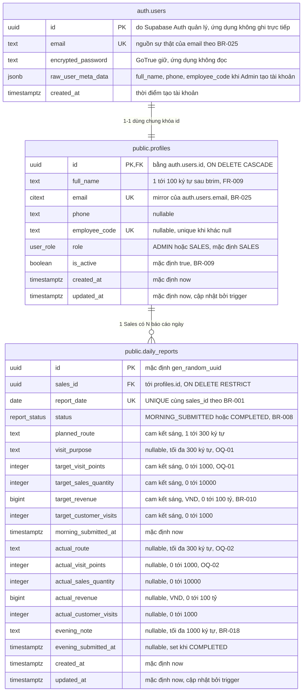
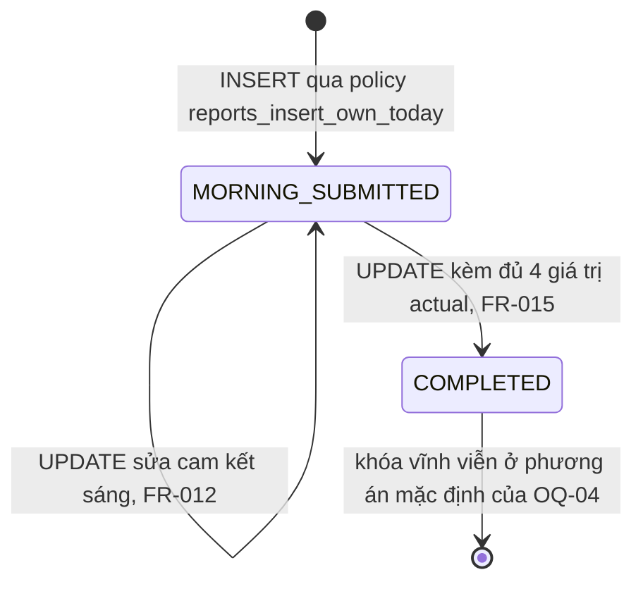

# 02 — Database Design

> Status: ACTIVE | Phase: 2 (schema đã chạy thật) | Last updated: 2026-08-07
> Nguồn sự thật cấp trên: BIKEFORCE_MASTER_SPEC.md → docs/11-decisions.md → tài liệu này

---

## 0. Trạng thái thực thi — đọc trước

| Hạng mục | Trạng thái thật (cập nhật Phase 2, 2026-08-07) |
|---|---|
| Supabase project **local** | ✅ **Đã chạy** — Supabase CLI 2.111.0 + Docker, Postgres **17.6.1.156** |
| Supabase project **cloud** | ⏳ **Người dùng đang tạo** (region Singapore) — runbook ở `docs/09-deployment.md` |
| `supabase/migrations/*.sql` | ✅ **Đã tồn tại**: `0001_init_enums_profiles.sql` … `0005_indexes.sql` |
| Migration đã chạy | ✅ **Cả 5 file apply thành công** bằng `supabase db reset` |
| `supabase/seed.sql` | ✅ Đã có, chạy được — 4 tài khoản + 22 báo cáo mẫu. **LOCAL ONLY** |
| `types/database.types.ts` | ✅ **Generate thật** từ schema (259 dòng), không còn là placeholder |
| Integration + RLS test | ✅ **66/66 PASS** (`npm run test:db`) |
| Build / typecheck / lint | ✅ exit 0 / exit 0 / exit 0 (0 error, 0 warning) |

**SQL trong tài liệu này KHÔNG còn là đề xuất** — nó đã chạy trên Postgres thật và có bộ test khoá lại. Ba điểm dưới đây khác so với bản đề xuất Phase 0 và **bản trong `supabase/migrations/` mới là bản có thẩm quyền**:

1. **`citext` cài vào schema `extensions`**, nên kiểu cột là `extensions.citext` (§7.1). Đã kiểm chứng operator `=` resolve được dưới role `authenticated`.
2. **`enable` + `force row level security` nằm ngay trong migration tạo bảng** (`0001`, `0002`), không phải ở `0004` — nhờ vậy không có thời điểm nào bảng tồn tại mà chưa bật RLS. `0004` chỉ chứa **policy**, vì policy phụ thuộc các hàm của `0003`.
3. **`service_role` không được cấp DML** trên cả hai bảng — xem `DEC-031` và §11 CẢNH BÁO 4 đã cập nhật.

---

## 1. Phạm vi và nguyên tắc thiết kế

Phạm vi v1 chỉ là **Daily Sales Performance Reporting**: không CRM, không kho, không POS, không đơn hàng, không danh mục sản phẩm (OQ-10, DEC-030). Vì vậy mô hình dữ liệu cố ý **chỉ có 2 bảng nghiệp vụ**.

Năm nguyên tắc chi phối mọi quyết định bên dưới:

1. **RLS là biên giới bảo mật thật sự** (DEC-004, NFR-004). Middleware và layout guard chỉ là defense-in-depth và UX. Mọi bảng `public` đều `enable row level security` và **deny-by-default** — không có policy nghĩa là không ai đọc được.
2. **Giá trị dẫn xuất không bao giờ được persist** (BR-011, DEC-007). Database chỉ lưu số thô; mọi `%`, mọi tổng hợp, mọi badge đều tính ở runtime.
3. **Ngày nghiệp vụ là `date` theo `Asia/Ho_Chi_Minh`**, không phải `timestamptz` (BR-005, DEC-009, NFR-011).
4. **Tiền là `bigint` VND**, không float, không chuỗi đã format (BR-006, BR-010, DEC-008).
5. **Ràng buộc nghiệp vụ phải nằm ở database**, không chỉ ở form. Frontend validate để UX tốt; DB validate để dữ liệu không hỏng (Master Spec §25).

Quy ước đặt tên dùng xuyên suốt (thuần kỹ thuật, không phải business rule):

| Tiền tố | Dùng cho |
|---|---|
| `uq_` | UNIQUE constraint / unique index |
| `ck_` | CHECK constraint |
| `idx_` | index phục vụ hiệu năng |
| `trg_` | trigger |
| `fk_` | foreign key (khi đặt tên tường minh) |

---

## 2. ERD



> Ghi chú đọc ERD: `auth.users` là bảng do Supabase Auth (GoTrue) sở hữu. Ứng dụng **không** ghi trực tiếp vào nó; chỉ `auth.admin.createUser` / `auth.admin.updateUserById` chạm tới, và duy nhất qua `lib/supabase/admin.ts` (DEC-005). `PK_FK` ở `profiles.id` nghĩa là cột này vừa là PRIMARY KEY vừa là FOREIGN KEY.

### 2.1 Vòng đời `status` — chính là thứ database phải ép



Không có `DRAFT`, không có `LOCKED` (DEC-020). Không có đường quay lui `COMPLETED → MORNING_SUBMITTED` (BR-008, chặn bởi `guard_report_transition()`).

---

## 3. Relationships và cardinality

| Quan hệ | Cardinality | Cột khóa | ON DELETE | Vì sao |
|---|---|---|---|---|
| `auth.users` → `public.profiles` | 1 : 1 (bắt buộc) | `profiles.id = auth.users.id` | `CASCADE` | Profile không thể tồn tại nếu không có identity. Dùng chung khóa thay vì thêm `user_id` riêng để không bao giờ có 2 profile cho 1 user, và để `auth.uid()` so sánh trực tiếp với `profiles.id` trong policy — không phải join. |
| `public.profiles` → `public.daily_reports` | 1 : N (0 hoặc nhiều) | `daily_reports.sales_id → profiles.id` | `RESTRICT` | Một Sales có 0..N báo cáo; mỗi báo cáo thuộc đúng 1 Sales. `RESTRICT` để không bao giờ mất lịch sử báo cáo vì thao tác xoá tài khoản (BR-013) — xem §12.4. |

Ràng buộc bổ sung do `uq_daily_reports_sales_date UNIQUE (sales_id, report_date)`: quan hệ 1:N bị thu hẹp thành **1 Sales : tối đa 1 báo cáo cho mỗi ngày nghiệp vụ** (BR-001).

Vì `daily_reports.sales_id` tham chiếu `profiles(id)` mà `profiles.id` lại bằng `auth.users.id`, nên `sales_id = (select auth.uid())` trong policy là so sánh **trực tiếp**, không cần subquery join — đây là lý do kỹ thuật quan trọng nhất của việc dùng chung khóa.

---

## 4. Enums

| Enum | Giá trị | Vì sao là enum, không phải text/lookup table |
|---|---|---|
| `public.user_role` | `'ADMIN'`, `'SALES'` | Tập giá trị đóng, do code quyết định, không phải dữ liệu người dùng nhập. Enum cho Postgres ép giá trị ở tầng type, chỉ tốn 4 byte, và làm `types/database.types.ts` sinh ra union type chính xác thay vì `string`. Không có role thứ ba trong v1 (OQ-16, DEC-030). |
| `public.report_status` | `'MORNING_SUBMITTED'`, `'COMPLETED'` | Chỉ 2 trạng thái (DEC-020). Lookup table sẽ thêm một JOIN vào **mọi** truy vấn báo cáo mà không đổi lại được gì. |

**Cạm bẫy vận hành của enum (ghi lại để Phase 2 không vấp):**

- Thêm giá trị mới phải dùng `alter type ... add value`, và giá trị mới **không dùng được trong cùng transaction** đã thêm nó ở nhiều phiên bản Postgres. Migration thêm enum value phải đứng riêng một file.
- **Không xoá được** một giá trị enum. Nếu OQ-04 dẫn tới nhu cầu `LOCKED`, đó là `add value`, không phải sửa.
- Thứ tự khai báo quyết định thứ tự sort. Ở đây `MORNING_SUBMITTED` < `COMPLETED`, tình cờ đúng thứ tự vòng đời — thuận tiện nhưng **không được dựa vào** để viết logic; luôn so sánh bằng `=`.

---

## 5. Bảng `public.profiles`

Một dòng cho mỗi tài khoản (cả Admin và Sales). Được tạo tự động bởi trigger `handle_new_user()` khi có dòng mới trong `auth.users`.

| Column | Type | Null | Default | Constraint | Ý nghĩa |
|---|---|:--:|---|---|---|
| `id` | `uuid` | NO | — | **PK**; **FK** → `auth.users(id)` `ON DELETE CASCADE` | Định danh tài khoản, **dùng chung** với Supabase Auth. Đây là giá trị mà `auth.uid()` trả về. |
| `full_name` | `text` | NO | — | `ck_profiles_full_name_len`: `char_length(btrim(full_name)) between 1 and 100` | Họ tên hiển thị. Nguồn duy nhất cho tên trên báo cáo và trên thẻ ảnh 9:16 (FR-009 — Sales không nhập lại tên). |
| `email` | `citext` | NO | — | `uq_profiles_email` **UNIQUE** | Mirror của `auth.users.email` (BR-025). `citext` để `A@x.vn` và `a@x.vn` không thể cùng tồn tại. |
| `phone` | `text` | YES | `null` | `ck_profiles_phone_format`: `phone is null or phone ~ '^[0-9+ ]{8,15}$'` | Số liên hệ nội bộ. Optional vì Master Spec §20 không bắt buộc. |
| `employee_code` | `text` | YES | `null` | `uq_profiles_employee_code` **UNIQUE (partial, `where employee_code is not null`)** | Mã nhân viên nội bộ. Hiện lên thẻ ảnh 9:16. Nhiều dòng `null` được phép; hai dòng cùng mã thì không. |
| `role` | `public.user_role` | NO | `'SALES'` | — | Phân quyền. Chỉ đổi được bởi Admin hoặc service role (`guard_profile_self_update()` chặn tự nâng quyền). |
| `is_active` | `boolean` | NO | `true` | — | BR-009. `false` = không đăng nhập được, không thao tác được. **Đây là cơ chế "nghỉ việc"** thay cho xoá tài khoản. |
| `created_at` | `timestamptz` | NO | `now()` | — | Audit. |
| `updated_at` | `timestamptz` | NO | `now()` | trigger `trg_profiles_set_updated_at` | Audit. Không tin giá trị client gửi lên — trigger luôn ghi đè. |

**Chưa có cột nào cho team/khu vực** (OQ-15) và **không có cột `deleted_at`** (OQ-13). Xem §16.

---

## 6. Bảng `public.daily_reports`

Một dòng cho mỗi (Sales × ngày nghiệp vụ). Dòng được **tạo** bởi báo cáo đầu ngày và **cập nhật tại chỗ** bởi báo cáo cuối ngày — không bao giờ có 2 dòng cho một ngày.

| Column | Type | Null | Default | Constraint | Ý nghĩa |
|---|---|:--:|---|---|---|
| `id` | `uuid` | NO | `gen_random_uuid()` | **PK** | Khóa chính. UUID thay vì `bigserial` để id xuất hiện trong URL `/sales/reports/[id]` không tiết lộ số lượng báo cáo và không đoán tuần tự được (giảm bề mặt IDOR — RLS vẫn là lớp chặn thật). |
| `sales_id` | `uuid` | NO | — | **FK** → `profiles(id)` `ON DELETE RESTRICT` | Chủ sở hữu báo cáo. Bằng `auth.uid()` của người tạo. Bất biến sau khi tạo (`guard_report_transition()`). |
| `report_date` | `date` | NO | — | thành phần của `uq_daily_reports_sales_date`; `ck_report_not_future` | Ngày nghiệp vụ tại `Asia/Ho_Chi_Minh` (BR-005). **Không phải** ngày UTC, **không phải** thời điểm. |
| `status` | `public.report_status` | NO | `'MORNING_SUBMITTED'` | `ck_completed_requires_actuals`, `ck_morning_has_no_evening_ts` | Trạng thái vòng đời (BR-008). |
| `planned_route` | `text` | NO | — | `ck_planned_route_len`: `char_length(btrim(planned_route)) between 1 and 300` | Tuyến dự kiến, nhập tự do trong v1 (OQ-07). Ví dụ "Quận 1 → Quận 3", "Đại lý khu vực Tây Ninh". |
| `visit_purpose` | `text` | YES | `null` | `ck_visit_purpose_len`: `visit_purpose is null or char_length(visit_purpose) <= 300` | Mục đích chuyến đi (định tính). Tồn tại vì OQ-01 chưa được trả lời — xem DEC-029. |
| `target_visit_points` | `integer` | NO | — | `ck_target_visit_points`: `between 0 and 1000` | Số điểm/đại lý **mục tiêu** (định lượng). Là cột nuôi dòng "Viếng thăm" trong bảng đối chiếu (Master Spec §9). OQ-01. |
| `target_sales_quantity` | `integer` | NO | — | `ck_target_sales_quantity`: `between 0 and 10000` | Doanh số mục tiêu = **số lượng xe/sản phẩm** (OQ-03), integer ≥ 0 (BR-006). |
| `target_revenue` | `bigint` | NO | — | `ck_target_revenue`: `between 0 and 100000000000` | Doanh thu mục tiêu, **VND nguyên** (BR-010). Trần 100 tỷ theo BR-017 để chặn lỗi gõ thừa số 0. |
| `target_customer_visits` | `integer` | NO | — | `ck_target_customer_visits`: `between 0 and 1000` | Số **khách hàng** dự kiến gặp. Khác `target_visit_points` (điểm/đại lý) — hai chỉ tiêu riêng đúng theo Master Spec §7. |
| `morning_submitted_at` | `timestamptz` | NO | `now()` | — | Thời điểm thật (UTC bên trong) khi cam kết sáng được ghi. Dùng cho audit, không dùng cho ngày nghiệp vụ. |
| `actual_route` | `text` | YES | `null` | `ck_actual_route_len`: `actual_route is null or char_length(actual_route) <= 300` | Tuyến/danh sách địa điểm **thực tế** đã đi. OQ-02, DEC-029. |
| `actual_visit_points` | `integer` | YES | `null` | `ck_actual_visit_points`: `actual_visit_points is null or between 0 and 1000` | Số điểm/đại lý **thực tế** đã ghé. `null` = chưa nhập cuối ngày. OQ-02. |
| `actual_sales_quantity` | `integer` | YES | `null` | `ck_actual_sales_quantity`: `... between 0 and 10000` | Doanh số thực đạt. |
| `actual_revenue` | `bigint` | YES | `null` | `ck_actual_revenue`: `... between 0 and 100000000000` | Doanh thu thực thu, VND nguyên. Định nghĩa "giá trị đơn hàng chốt trong ngày" (OQ-14, non-blocking). |
| `actual_customer_visits` | `integer` | YES | `null` | `ck_actual_customer_visits`: `... between 0 and 1000` | Số khách hàng thực tế đã ghé thăm. |
| `evening_note` | `text` | YES | `null` | `ck_evening_note_len`: `evening_note is null or char_length(evening_note) <= 1000` | Ghi chú cuối ngày, optional (BR-018): lý do chưa đạt, khách hẹn lại, thông tin cạnh tranh. |
| `evening_submitted_at` | `timestamptz` | YES | `null` | thành phần của `ck_completed_requires_actuals` và `ck_morning_has_no_evening_ts` | Thời điểm hoàn tất báo cáo (FR-015). `null` khi còn `MORNING_SUBMITTED`. |
| `created_at` | `timestamptz` | NO | `now()` | — | Audit. Trùng ý nghĩa với `morning_submitted_at` ở v1 nhưng giữ riêng: `created_at` là sự thật kỹ thuật của dòng, `morning_submitted_at` là sự thật nghiệp vụ và sẽ khác nhau nếu OQ-09 chuyển sang mô hình Admin giao KPI trước (AF-11). |
| `updated_at` | `timestamptz` | NO | `now()` | trigger `trg_daily_reports_set_updated_at` | Audit. |

### 6.1 Vì sao khối `actual_*` là nullable

`null` ở đây mang đúng một nghĩa: **"chưa tới cuối ngày, chưa có số liệu"**. Nó không phải "bằng 0". Phân biệt này là bắt buộc vì:

- `calculateAchievement(target, actual)` nhận `actual: number | null` và trả `status = 'PENDING'` khi `actual === null` (BR-023 "Chờ số liệu"). Nếu default về 0, mọi báo cáo buổi sáng sẽ hiển thị "Chưa đạt 0%" — sai nghiệp vụ.
- Admin dashboard đếm "Số Sales đã hoàn thành báo cáo cuối ngày" bằng `status`, còn tổng `sum(actual_revenue)` bỏ qua `null` một cách tự nhiên (Postgres `sum` bỏ qua NULL). Nếu là 0 thì tổng vẫn đúng nhưng `avg` và "số ngày đạt KPI" sẽ sai.
- Ràng buộc `ck_completed_requires_actuals` biến tính nullable đó thành ràng buộc **chặt** đúng lúc: khi `status = 'COMPLETED'`, cả 4 cột actual và `evening_submitted_at` **bắt buộc** khác `null`. Nói cách khác nullable chỉ hợp lệ trong đúng một trạng thái.

### 6.2 Constraint tổng hợp

| Tên | Loại | Biểu thức | Business rule |
|---|---|---|---|
| `daily_reports_pkey` | PK | `(id)` | — |
| `uq_daily_reports_sales_date` | UNIQUE | `(sales_id, report_date)` | **BR-001** — một Sales tối đa một báo cáo mỗi ngày. Enforce ở DB, không chỉ frontend (FR-011). |
| FK `sales_id` | FK | → `profiles(id)` `ON DELETE RESTRICT` | BR-013 |
| `ck_report_not_future` | CHECK | `report_date <= (now() at time zone 'Asia/Ho_Chi_Minh')::date` | **BR-016** |
| `ck_completed_requires_actuals` | CHECK | `status <> 'COMPLETED' OR (actual_visit_points IS NOT NULL AND actual_sales_quantity IS NOT NULL AND actual_revenue IS NOT NULL AND actual_customer_visits IS NOT NULL AND evening_submitted_at IS NOT NULL)` | **BR-007, BR-008** |
| `ck_morning_has_no_evening_ts` | CHECK | `status <> 'MORNING_SUBMITTED' OR evening_submitted_at IS NULL` | BR-008 — chống dữ liệu "nửa vời" |
| `ck_*_len` (4) | CHECK | giới hạn độ dài text | BR-018 và giới hạn kỹ thuật của thẻ ảnh 9:16 |
| `ck_target_*` / `ck_actual_*` (8) | CHECK | biên `0..1000`, `0..10000`, `0..100000000000` | **BR-006, BR-017** — chặn số âm, chặn lỗi gõ phím |

**Lưu ý kỹ thuật về `ck_report_not_future`:** `now()` là hàm `STABLE`, không `IMMUTABLE`. Postgres **cho phép** dùng nó trong CHECK nhưng cảnh báo rằng dump/restore có thể thất bại nếu điều kiện không còn đúng lúc restore. Trong trường hợp cụ thể này việc đó **không xảy ra**, vì điều kiện chỉ cấm *tương lai*: một dòng có `report_date` trong quá khứ sẽ mãi mãi thoả `report_date <= today`. Ghi lại lập luận này để Phase 2 không "sửa cho an toàn" một cách vô ích. Ràng buộc này cũng cố ý **không** gọi `public.vn_today()` vì hàm đó được tạo ở migration `0003`, sau `0002`.

---

## 7. SQL DDL — ĐÃ TRIỂN KHAI VÀ ĐÃ CHẠY THẬT

> ✅ **Đã chạy** trên Supabase local (Postgres 17.6.1.156) ngày 2026-08-07, cả 5 file apply thành công.
> ⚠ **Bản có thẩm quyền là các file trong `supabase/migrations/`**, không phải các khối SQL dưới đây. Mục này giữ lại để giải thích **vì sao** từng ràng buộc tồn tại; nếu hai bên lệch nhau thì file migration đúng, và tài liệu phải được sửa cho khớp (`CLAUDE.md §9`).
> Ba khác biệt đã biết so với bản đề xuất Phase 0 được liệt kê ở §0.
> Đẩy lên cloud bằng `supabase db push` — **không** sửa schema bằng tay trên Dashboard. Migration chỉ tiến tới; muốn lùi phải viết migration mới.

### 7.1 `supabase/migrations/0001_init_enums_profiles.sql`

```sql
-- =============================================================================
-- BikeForce 0001 — enums + public.profiles
-- ĐỀ XUẤT (Phase 0). Chưa chạy trên bất kỳ database nào.
-- =============================================================================

-- citext để email không phân biệt hoa/thường (BR-025).
-- LƯU Ý PHASE 2: Supabase khuyến nghị cài extension vào schema `extensions`.
-- Nếu cài vào `extensions`, phải khai kiểu là `extensions.citext` hoặc đảm bảo
-- `extensions` nằm trong search_path của role `authenticated`.
create extension if not exists citext;

create type public.user_role     as enum ('ADMIN', 'SALES');
create type public.report_status as enum ('MORNING_SUBMITTED', 'COMPLETED');

create table public.profiles (
  id            uuid        primary key
                            references auth.users (id) on delete cascade,
  full_name     text        not null,
  email         citext      not null,
  phone         text,
  employee_code text,
  role          public.user_role not null default 'SALES',
  is_active     boolean     not null default true,
  created_at    timestamptz not null default now(),
  updated_at    timestamptz not null default now(),

  constraint uq_profiles_email
    unique (email),
  constraint ck_profiles_full_name_len
    check (char_length(btrim(full_name)) between 1 and 100),
  constraint ck_profiles_phone_format
    check (phone is null or phone ~ '^[0-9+ ]{8,15}$')
);

-- UNIQUE khi khác null. Partial unique index thay vì UNIQUE constraint để ý định
-- "nhiều dòng null là hợp lệ" được viết ra tường minh, không phụ thuộc người đọc
-- có nhớ quy tắc NULL-distinct của Postgres hay không.
-- Đặt ở 0001 (không phải 0005) vì đây là ràng buộc toàn vẹn, không phải index hiệu năng.
create unique index uq_profiles_employee_code
  on public.profiles (employee_code)
  where employee_code is not null;

comment on table  public.profiles              is 'Hồ sơ người dùng, 1-1 với auth.users. Không có self-registration (BR-012).';
comment on column public.profiles.is_active    is 'BR-009. false = không đăng nhập/thao tác được. Đây là cơ chế nghỉ việc thay cho xoá tài khoản.';
comment on column public.profiles.email        is 'BR-025. Mirror của auth.users.email.';

-- Deny-by-default ở tầng GRANT, độc lập với RLS.
-- Supabase mặc định cấp quyền rộng cho anon/authenticated trên schema public,
-- nên phải thu hồi tường minh.
revoke all on table public.profiles from anon;
revoke all on table public.profiles from authenticated;
grant  select, update on table public.profiles to authenticated;
-- Cố ý KHÔNG cấp INSERT (chỉ trigger handle_new_user tạo profile)
-- và KHÔNG cấp DELETE (BR-013).
```

### 7.2 `supabase/migrations/0002_daily_reports.sql`

```sql
-- =============================================================================
-- BikeForce 0002 — public.daily_reports
-- ĐỀ XUẤT (Phase 0). Chưa chạy trên bất kỳ database nào.
-- =============================================================================

create table public.daily_reports (
  id          uuid        primary key default gen_random_uuid(),
  sales_id    uuid        not null
                          references public.profiles (id) on delete restrict,
  report_date date        not null,
  status      public.report_status not null default 'MORNING_SUBMITTED',

  -- ---- Cam kết đầu ngày (UC-04, FR-008) --------------------------------------
  planned_route          text        not null,
  visit_purpose          text,                    -- OQ-01
  target_visit_points    integer     not null,    -- OQ-01
  target_sales_quantity  integer     not null,
  target_revenue         bigint      not null,    -- VND nguyên, BR-010
  target_customer_visits integer     not null,
  morning_submitted_at   timestamptz not null default now(),

  -- ---- Thực đạt cuối ngày (UC-06, FR-014) ------------------------------------
  actual_route           text,                    -- OQ-02
  actual_visit_points    integer,                 -- OQ-02
  actual_sales_quantity  integer,
  actual_revenue         bigint,                  -- VND nguyên
  actual_customer_visits integer,
  evening_note           text,
  evening_submitted_at   timestamptz,

  created_at timestamptz not null default now(),
  updated_at timestamptz not null default now(),

  -- ---- BR-001: một Sales, một ngày, một báo cáo ------------------------------
  constraint uq_daily_reports_sales_date unique (sales_id, report_date),

  -- ---- BR-006 / BR-017: biên số học ------------------------------------------
  constraint ck_target_visit_points
    check (target_visit_points between 0 and 1000),
  constraint ck_target_sales_quantity
    check (target_sales_quantity between 0 and 10000),
  constraint ck_target_revenue
    check (target_revenue between 0 and 100000000000),
  constraint ck_target_customer_visits
    check (target_customer_visits between 0 and 1000),
  constraint ck_actual_visit_points
    check (actual_visit_points is null or actual_visit_points between 0 and 1000),
  constraint ck_actual_sales_quantity
    check (actual_sales_quantity is null or actual_sales_quantity between 0 and 10000),
  constraint ck_actual_revenue
    check (actual_revenue is null or actual_revenue between 0 and 100000000000),
  constraint ck_actual_customer_visits
    check (actual_customer_visits is null or actual_customer_visits between 0 and 1000),

  -- ---- BR-018 + giới hạn layout thẻ ảnh 9:16 ---------------------------------
  constraint ck_planned_route_len
    check (char_length(btrim(planned_route)) between 1 and 300),
  constraint ck_visit_purpose_len
    check (visit_purpose is null or char_length(visit_purpose) <= 300),
  constraint ck_actual_route_len
    check (actual_route is null or char_length(actual_route) <= 300),
  constraint ck_evening_note_len
    check (evening_note is null or char_length(evening_note) <= 1000),

  -- ---- BR-016: không báo cáo cho ngày tương lai ------------------------------
  -- now() là STABLE chứ không IMMUTABLE. An toàn ở đây vì điều kiện chỉ cấm
  -- tương lai: dòng cũ luôn tiếp tục thoả sau khi restore.
  constraint ck_report_not_future
    check (report_date <= (now() at time zone 'Asia/Ho_Chi_Minh')::date),

  -- ---- BR-007 / BR-008: COMPLETED phải có đủ số liệu -------------------------
  constraint ck_completed_requires_actuals
    check (
      status <> 'COMPLETED'
      or (
            actual_visit_points    is not null
        and actual_sales_quantity  is not null
        and actual_revenue         is not null
        and actual_customer_visits is not null
        and evening_submitted_at   is not null
      )
    ),

  -- ---- BR-008: MORNING_SUBMITTED không được có dấu thời gian cuối ngày -------
  constraint ck_morning_has_no_evening_ts
    check (status <> 'MORNING_SUBMITTED' or evening_submitted_at is null)
);

comment on table  public.daily_reports is
  'Một dòng cho mỗi (Sales x ngày nghiệp vụ VN). Cam kết sáng và thực đạt tối nằm chung một dòng — xem docs/02-database-design.md §12.1.';
comment on column public.daily_reports.report_date is
  'BR-005. Ngày nghiệp vụ tại Asia/Ho_Chi_Minh, KHÔNG phải ngày UTC.';
comment on column public.daily_reports.target_revenue is
  'BR-010. VND dạng số nguyên. Không bao giờ lưu chuỗi đã format.';

revoke all on table public.daily_reports from anon;
revoke all on table public.daily_reports from authenticated;
grant  select, insert, update on table public.daily_reports to authenticated;
-- Cố ý KHÔNG cấp DELETE (BR-013). Thiếu GRANT là lớp chặn thứ hai bên cạnh
-- việc không có DELETE policy.
```

### 7.3 `supabase/migrations/0003_functions_triggers.sql`

```sql
-- =============================================================================
-- BikeForce 0003 — functions + triggers
-- ĐỀ XUẤT (Phase 0). Chưa chạy trên bất kỳ database nào.
-- =============================================================================

-- ----------------------------------------------------------------------------
-- vn_today() — ngày nghiệp vụ VN, dùng trong RLS policy (BR-005)
-- ----------------------------------------------------------------------------
create or replace function public.vn_today()
returns date
language sql
stable
set search_path = pg_catalog, public
as $$
  select (now() at time zone 'Asia/Ho_Chi_Minh')::date;
$$;

comment on function public.vn_today() is
  'BR-005. Bản DB của lib/date.ts getVietnamToday(). Hai nơi phải luôn cho cùng kết quả — có test biên ở Phase 11.';

-- ----------------------------------------------------------------------------
-- set_updated_at() — không tin updated_at do client gửi lên
-- ----------------------------------------------------------------------------
create or replace function public.set_updated_at()
returns trigger
language plpgsql
set search_path = pg_catalog, public
as $$
begin
  new.updated_at := now();
  return new;
end;
$$;

create trigger trg_profiles_set_updated_at
  before update on public.profiles
  for each row execute function public.set_updated_at();

create trigger trg_daily_reports_set_updated_at
  before update on public.daily_reports
  for each row execute function public.set_updated_at();

-- ----------------------------------------------------------------------------
-- is_admin() / is_active_sales() — dùng trong policy
-- SECURITY DEFINER là bắt buộc: xem §11 "Cạm bẫy đã biết" (DEC-006).
-- ----------------------------------------------------------------------------
create or replace function public.is_admin()
returns boolean
language sql
stable
security definer
set search_path = public, pg_temp
as $$
  select exists (
    select 1
    from public.profiles p
    where p.id = auth.uid()
      and p.role = 'ADMIN'
      and p.is_active
  );
$$;

create or replace function public.is_active_sales()
returns boolean
language sql
stable
security definer
set search_path = public, pg_temp
as $$
  select exists (
    select 1
    from public.profiles p
    where p.id = auth.uid()
      and p.role = 'SALES'
      and p.is_active
  );
$$;

-- Hàm SECURITY DEFINER không được để EXECUTE mở cho PUBLIC.
revoke execute on function public.is_admin()        from public;
revoke execute on function public.is_active_sales() from public;
grant  execute on function public.is_admin()        to authenticated;
grant  execute on function public.is_active_sales() to authenticated;
grant  execute on function public.vn_today()        to authenticated;

-- ----------------------------------------------------------------------------
-- handle_new_user() — tạo profile khi Admin tạo tài khoản (UC-17, FR-030)
-- ----------------------------------------------------------------------------
create or replace function public.handle_new_user()
returns trigger
language plpgsql
security definer
set search_path = public, pg_temp
as $$
declare
  v_full_name     text;
  v_phone         text;
  v_employee_code text;
begin
  v_full_name := nullif(btrim(coalesce(new.raw_user_meta_data ->> 'full_name', '')), '');

  if v_full_name is null then
    raise exception
      'handle_new_user: raw_user_meta_data.full_name là bắt buộc khi tạo tài khoản (UC-17/FR-030)'
      using errcode = '23514';
  end if;

  v_phone         := nullif(btrim(coalesce(new.raw_user_meta_data ->> 'phone', '')), '');
  v_employee_code := nullif(btrim(coalesce(new.raw_user_meta_data ->> 'employee_code', '')), '');

  -- role KHÔNG lấy từ metadata: user_metadata do client sửa được qua
  -- auth.updateUser(), lấy từ đó là mở đường tự nâng quyền.
  -- Mọi tài khoản mới đều là SALES. Admin đầu tiên được nâng quyền một lần duy
  -- nhất bằng SQL editor theo runbook ở docs/09-deployment.md.
  insert into public.profiles (id, full_name, email, phone, employee_code)
  values (new.id, v_full_name, new.email, v_phone, v_employee_code)
  on conflict (id) do nothing;

  return new;
end;
$$;

create trigger on_auth_user_created
  after insert on auth.users
  for each row execute function public.handle_new_user();

-- ----------------------------------------------------------------------------
-- guard_profile_self_update() — chặn tự nâng quyền (BR-009, BR-012, BR-025)
-- SECURITY INVOKER (mặc định): hàm không cần quyền cao hơn người gọi.
-- ----------------------------------------------------------------------------
create or replace function public.guard_profile_self_update()
returns trigger
language plpgsql
set search_path = pg_catalog, public
as $$
begin
  if new.id is distinct from old.id then
    raise exception 'profiles.id là bất biến' using errcode = '42501';
  end if;

  -- Không có JWT nghĩa là service role hoặc migration đang chạy: bỏ qua.
  if (select auth.uid()) is null then
    return new;
  end if;

  if (select public.is_admin()) then
    return new;
  end if;

  if new.role      is distinct from old.role
  or new.is_active is distinct from old.is_active
  or new.email     is distinct from old.email then
    raise exception
      'Không được tự thay đổi role/is_active/email trên hồ sơ của mình'
      using errcode = '42501';
  end if;

  return new;
end;
$$;

create trigger trg_profiles_guard_self_update
  before update on public.profiles
  for each row execute function public.guard_profile_self_update();

-- ----------------------------------------------------------------------------
-- guard_report_transition() — BR-008
-- ----------------------------------------------------------------------------
create or replace function public.guard_report_transition()
returns trigger
language plpgsql
set search_path = pg_catalog, public
as $$
begin
  if new.id is distinct from old.id then
    raise exception 'daily_reports.id là bất biến' using errcode = '42501';
  end if;

  if new.sales_id is distinct from old.sales_id then
    raise exception 'Không được chuyển báo cáo sang Sales khác (BR-003)'
      using errcode = '42501';
  end if;

  if new.report_date is distinct from old.report_date then
    raise exception 'Không được đổi report_date của báo cáo đã tạo (BR-001)'
      using errcode = '42501';
  end if;

  if old.status = 'COMPLETED' and new.status = 'MORNING_SUBMITTED' then
    raise exception 'Không được quay lui COMPLETED -> MORNING_SUBMITTED (BR-008)'
      using errcode = '42501';
  end if;

  return new;
end;
$$;

create trigger trg_daily_reports_guard_transition
  before update on public.daily_reports
  for each row execute function public.guard_report_transition();

revoke execute on function public.set_updated_at()             from public;
revoke execute on function public.handle_new_user()            from public;
revoke execute on function public.guard_profile_self_update()  from public;
revoke execute on function public.guard_report_transition()    from public;
```

**Ghi chú có chủ đích về `evening_submitted_at`:** trigger **không** tự đóng dấu thời gian khi `status` chuyển sang `COMPLETED`. Server Action phải set tường minh (FR-015), và `ck_completed_requires_actuals` đã chặn trường hợp quên. Lý do không auto-stamp: giữ trigger chỉ làm đúng việc "cấm", để test đọc được ý định và để không có hai nơi cùng ghi một cột.

### 7.4 `supabase/migrations/0004_rls_policies.sql`

```sql
-- =============================================================================
-- BikeForce 0004 — Row Level Security
-- ĐỀ XUẤT (Phase 0). Chưa chạy trên bất kỳ database nào.
-- RLS là biên giới bảo mật thật sự (DEC-004, NFR-004).
-- =============================================================================

alter table public.profiles       enable row level security;
alter table public.profiles       force  row level security;
alter table public.daily_reports  enable row level security;
alter table public.daily_reports  force  row level security;

-- !! ĐỌC §11 TRƯỚC KHI CHẠY: `force row level security` khiến chính chủ sở hữu
-- bảng cũng chịu policy, và điều đó có thể làm hỏng handle_new_user() cũng như
-- làm quay lại đệ quy của is_admin(). Phải xác minh trên Supabase local trước.

-- ----------------------------------------------------------------------------
-- profiles
-- ----------------------------------------------------------------------------
create policy profiles_select_self_or_admin
  on public.profiles
  for select
  to authenticated
  using (
    id = (select auth.uid())
    or (select public.is_admin())
  );

create policy profiles_update_self
  on public.profiles
  for update
  to authenticated
  using      (id = (select auth.uid()))
  with check (id = (select auth.uid()));

create policy profiles_update_admin
  on public.profiles
  for update
  to authenticated
  using      ((select public.is_admin()))
  with check ((select public.is_admin()));

-- Cố ý KHÔNG có policy INSERT: profile chỉ sinh ra từ trigger handle_new_user()
-- hoặc từ service role. Cố ý KHÔNG có policy DELETE.

-- ----------------------------------------------------------------------------
-- daily_reports
-- ----------------------------------------------------------------------------
create policy reports_select_own_or_admin
  on public.daily_reports
  for select
  to authenticated
  using (
    sales_id = (select auth.uid())
    or (select public.is_admin())
  );

create policy reports_insert_own_today
  on public.daily_reports
  for insert
  to authenticated
  with check (
    sales_id    = (select auth.uid())
    and (select public.is_active_sales())
    and report_date = public.vn_today()
    and status  = 'MORNING_SUBMITTED'
  );

create policy reports_update_own_open
  on public.daily_reports
  for update
  to authenticated
  using (
    sales_id = (select auth.uid())
    and (select public.is_active_sales())
    and status = 'MORNING_SUBMITTED'
  )
  with check (sales_id = (select auth.uid()));

-- Cố ý KHÔNG có policy DELETE (BR-013), và cũng không có UPDATE cho Admin
-- (BR-020, APPROVED theo OQ-05: Admin KHÔNG sửa số liệu báo cáo).
```

### 7.5 `supabase/migrations/0005_indexes.sql`

```sql
-- =============================================================================
-- BikeForce 0005 — index hiệu năng
-- ĐỀ XUẤT (Phase 0). Chưa chạy trên bất kỳ database nào.
-- Index toàn vẹn (uq_*) đã nằm ở 0001/0002 cùng bảng.
-- =============================================================================

create index idx_daily_reports_date_status
  on public.daily_reports (report_date desc, status);

create index idx_daily_reports_sales_date_desc
  on public.daily_reports (sales_id, report_date desc);

create index idx_profiles_role_active
  on public.profiles (role, is_active)
  where role = 'SALES';

-- idx_profiles_full_name_trgm: HOÃN, không tạo ở v1.
-- Cần `create extension pg_trgm` + GIN index. Với <= 200 Sales thì `ilike` trên
-- vài trăm dòng nhanh hơn chi phí bảo trì index. Đưa vào docs/10-future-roadmap.md.
-- create extension if not exists pg_trgm;
-- create index idx_profiles_full_name_trgm
--   on public.profiles using gin (full_name gin_trgm_ops);

analyze public.profiles;
analyze public.daily_reports;
```

### 7.6 `supabase/seed.sql` — chỉ dùng local

Nội dung: 1 Admin + 3 Sales + khoảng 20 báo cáo mẫu trải trên 30 ngày, đủ để lịch sử có phân trang, có ngày `MORNING_SUBMITTED` chưa hoàn tất (test alert AF-02), có ngày vượt 100% và ngày dưới 80% (test badge BR-023), có một ngày `target = 0` (test BR-015/OQ-11), có tên đầy đủ dấu tiếng Việt và một ghi chú 1000 ký tự (test thẻ ảnh 9:16).

**Không seed lên production.** Seed chạy qua `supabase db reset` trên môi trường local. Tài khoản mẫu dùng mật khẩu placeholder trong `.env.example` (ví dụ `SEED_PASSWORD=<đặt-khi-chạy-local>`), tuyệt đối không ghi mật khẩu thật vào repo.

### 7.7 Sinh type cho TypeScript

```bash
supabase gen types typescript --linked > types/database.types.ts
```

Chạy lại **mỗi lần** schema đổi và commit kết quả. `types/database.types.ts` là hợp đồng giữa DB và ứng dụng; nếu nó lệch, `tsc` sẽ không bắt được lỗi cột (NFR-012).

---

## 8. Row Level Security — bảng policy

RLS ở trạng thái **deny-by-default**: bật RLS mà không có policy nào khớp thì câu lệnh trả về 0 dòng (với SELECT/UPDATE) hoặc bị từ chối (với INSERT). Mọi policy đều giới hạn `to authenticated` — role `anon` không có bất kỳ đường nào chạm vào hai bảng này.

### 8.1 `public.profiles`

| Op | Policy | USING / WITH CHECK | Hệ quả |
|---|---|---|---|
| SELECT | `profiles_select_self_or_admin` | `id = (select auth.uid()) OR (select public.is_admin())` | Sales chỉ thấy hồ sơ của chính mình. Admin thấy toàn bộ (cần cho UC-16, UC-18, dropdown filter UC-13). |
| INSERT | *(không cấp)* | — | Không có self-registration (BR-012, FR-006). Profile chỉ do trigger `handle_new_user()` hoặc service role tạo. |
| UPDATE | `profiles_update_self` | USING `id = (select auth.uid())` · WITH CHECK `id = (select auth.uid())` | Sales sửa được hồ sơ của mình (UC-11). Các cột nhạy cảm `role` / `is_active` / `email` bị `guard_profile_self_update()` chặn ở tầng trigger. |
| UPDATE | `profiles_update_admin` | USING và WITH CHECK đều là `(select public.is_admin())` | Admin sửa hồ sơ Sales (UC-18) và bật/tắt `is_active` (UC-19, FR-032). |
| DELETE | *(không cấp)* | — | Không xoá tài khoản; dùng `is_active = false`. |

### 8.2 `public.daily_reports`

| Op | Policy | USING / WITH CHECK | Hệ quả |
|---|---|---|---|
| SELECT | `reports_select_own_or_admin` | `sales_id = (select auth.uid()) OR (select public.is_admin())` | **BR-003** — Sales không bao giờ đọc được báo cáo của Sales khác, kể cả khi đoán đúng `id` trong URL (chống IDOR). Admin đọc toàn bộ (UC-12..UC-16). |
| INSERT | `reports_insert_own_today` | WITH CHECK `sales_id = (select auth.uid()) AND (select public.is_active_sales()) AND report_date = public.vn_today() AND status = 'MORNING_SUBMITTED'` | Bốn điều kiện tương ứng bốn rule: không tạo hộ người khác (BR-003); tài khoản phải active (BR-009); đúng ngày hôm nay, không nhập bù (BR-021/OQ-12); phải bắt đầu từ trạng thái sáng (BR-008). |
| UPDATE | `reports_update_own_open` | USING `sales_id = (select auth.uid()) AND (select public.is_active_sales()) AND status = 'MORNING_SUBMITTED'` · WITH CHECK `sales_id = (select auth.uid())` | Sửa cam kết sáng (FR-012) và hoàn tất cuối ngày (FR-015). |
| DELETE | *(không cấp)* | — | **BR-013** — không xoá cứng dữ liệu báo cáo trong v1. |

**Cơ chế tự khoá cần hiểu chính xác:** trong PostgreSQL, mệnh đề `USING` của policy UPDATE được đánh giá trên **dòng cũ (OLD)**, còn `WITH CHECK` trên **dòng mới (NEW)**. Do đó `reports_update_own_open` cho phép đúng một lần chuyển `MORNING_SUBMITTED → COMPLETED`: lúc đó `OLD.status` vẫn là `MORNING_SUBMITTED` nên `USING` khớp. Sau khi đã `COMPLETED`, mọi UPDATE tiếp theo có `OLD.status = 'COMPLETED'` nên `USING` không khớp và câu lệnh trả về **0 rows affected** — báo cáo tự khoá. Đây đúng là phương án mặc định (a) của OQ-04 và là cách phát biểu BR-019 ở tầng database. **Nếu OQ-04 trả lời (b) hoặc (c), chính policy này phải được viết lại** — xem §16.

**Ba điểm nữa về RLS phải ghi lại:**

- Nhiều policy `permissive` cùng loại được **OR** với nhau. Admin sửa hồ sơ người khác: `profiles_update_self` trượt, `profiles_update_admin` khớp → được phép. Hệ quả ngược lại cũng đúng và nguy hiểm: **không thể "trừ bớt" quyền bằng cách thêm policy** — một policy quá rộng sẽ mở toang bảng. Vì vậy giữ số policy tối thiểu và mỗi policy phải tự đủ chặt.
- `auth.uid()` trả `null` khi không có JWT hợp lệ. Khi đó mọi biểu thức `id = null` cho `null` (không phải `true`) nên toàn bộ policy trượt → deny. Đây là hành vi mong muốn, và test RLS phải khẳng định nó (Phase 11).
- UPDATE cần cả quyền SELECT nếu câu lệnh có `where`. `reports_select_own_or_admin` đã bao phủ, nên không cần policy phụ.

---

## 9. Triggers và functions

| Đối tượng | Loại | Gắn ở đâu | Nhiệm vụ | Business rule |
|---|---|---|---|---|
| `public.vn_today()` | function `stable` | — | Trả ngày nghiệp vụ VN; dùng trong policy INSERT | BR-005 |
| `public.is_admin()` | function `stable security definer` | — | Có phải Admin đang active không | BR-003, DEC-006 |
| `public.is_active_sales()` | function `stable security definer` | — | Có phải Sales đang active không | BR-009 |
| `public.set_updated_at()` | trigger fn | `trg_profiles_set_updated_at`, `trg_daily_reports_set_updated_at` — BEFORE UPDATE | Ghi đè `updated_at = now()`, không tin client | audit |
| `public.handle_new_user()` | trigger fn `security definer` | `on_auth_user_created` — AFTER INSERT ON `auth.users` | Tạo dòng `profiles` từ `raw_user_meta_data`; ép `role` mặc định `SALES` | BR-012, BR-025, FR-030 |
| `public.guard_profile_self_update()` | trigger fn | `trg_profiles_guard_self_update` — BEFORE UPDATE ON `profiles` | Chặn non-admin đổi `role` / `is_active` / `email`; chặn mọi ai đổi `id` | BR-009, BR-012, BR-025 |
| `public.guard_report_transition()` | trigger fn | `trg_daily_reports_guard_transition` — BEFORE UPDATE ON `daily_reports` | Chặn đổi `id` / `sales_id` / `report_date`; chặn `COMPLETED → MORNING_SUBMITTED` | BR-001, BR-003, BR-008 |

**Vì sao cần cả trigger lẫn policy cho `profiles`?** RLS làm việc ở mức **dòng**, không ở mức **cột**. `profiles_update_self` cho Sales sửa dòng của mình, nhưng RLS không phân biệt "sửa `phone`" với "sửa `role` thành `ADMIN`". PostgreSQL có `GRANT UPDATE (cột)` nhưng nó không kết hợp gọn với mô hình "chính chủ hoặc admin" ở đây. Trigger `BEFORE UPDATE` so sánh `OLD` với `NEW` là cách phát biểu trực tiếp nhất và test được. Đây là điểm mà bỏ qua sẽ thành lỗ hổng leo thang đặc quyền.

**Điểm chưa khép kín, ghi nhận cho Phase 2 (không phải business rule mới):** BR-025 yêu cầu `profiles.email` luôn khớp `auth.users.email`. Trigger `handle_new_user()` chỉ bảo đảm điều đó **tại thời điểm tạo**. Nếu Admin đổi email qua `auth.admin.updateUserById` (UC-18), Server Action phải cập nhật `profiles.email` trong cùng luồng. Một trigger `AFTER UPDATE ON auth.users` sẽ chặt hơn nhưng không nằm trong thiết kế đã chốt — phải quyết ở Phase 2 và ghi thành DEC mới, không sửa lén.

---

## 10. Indexes — mỗi index phục vụ truy vấn nào và vì sao

| Index | Định nghĩa | Truy vấn được phục vụ | Vì sao cần |
|---|---|---|---|
| `daily_reports_pkey` | PK `(id)` | `/sales/reports/[id]`, `/admin/reports/[id]`, `GET /api/reports/[id]/share-image` | Tra một báo cáo theo id. Bắt buộc và tự có. |
| `uq_daily_reports_sales_date` | UNIQUE `(sales_id, report_date)` | `select ... where sales_id = $1 and report_date = public.vn_today()` (UC-03/FR-007 "báo cáo hôm nay"); và anti-join `not exists` của cảnh báo chưa báo cáo (FR-033/AF-02) | Vừa là ràng buộc **BR-001** vừa là index nóng nhất hệ thống: mỗi lần Sales mở `/sales/today` đều chạy đúng truy vấn này. Cũng chính nó biến FR-011 từ "kiểm tra ở frontend" thành bất khả xâm phạm. |
| `idx_daily_reports_date_status` | `(report_date desc, status)` | `where report_date = public.vn_today()` (12 chỉ số Admin dashboard, FR-024/UC-12); `where report_date = ... and status = 'MORNING_SUBMITTED'` (alert "đã sáng chưa hoàn tất", AF-02); `where report_date between $1 and $2` (analytics tháng FR-028, filter khoảng ngày FR-025) | Cột dẫn đầu là `report_date` vì **mọi** màn hình Admin đều lọc theo ngày trước tiên. `desc` khớp với `order by report_date desc` mặc định của danh sách báo cáo. `status` đứng sau để lọc thêm mà không cần đọc heap. |
| `idx_daily_reports_sales_date_desc` | `(sales_id, report_date desc)` | `where sales_id = $1 order by report_date desc limit 20 offset $2` (lịch sử của Sales, FR-021/UC-09); `where sales_id = $1 and report_date between $2 and $3` (hiệu suất một Sales, UC-16/AF-06, trang `/admin/sales/[id]`) | Phục vụ phân trang server-side mà không phải sort (NFR-002). **Ghi nhận trung thực:** index này có khả năng **dư thừa** vì `uq_daily_reports_sales_date` cũng là B-tree trên `(sales_id, report_date)` và Postgres đọc ngược được để phục vụ `desc`. Brief §9 liệt kê nó nên giữ lại trong đề xuất, **nhưng Phase 11 phải chạy `EXPLAIN ANALYZE` để xác minh**; nếu dư thừa thì drop bằng một migration mới. Chưa đo — không được khẳng định. |
| `idx_profiles_role_active` | `(role, is_active) where role = 'SALES'` | `select count(*) from profiles where role='SALES' and is_active` (chỉ số 1 của Admin dashboard); `select id, full_name from profiles where role='SALES' and is_active order by full_name` (dropdown filter UC-13, bảng hiệu suất UC-16, vế trái của anti-join alert) | Partial index chỉ chứa Sales nên nhỏ, không phải quét dòng Admin. **Ghi nhận:** vì mệnh đề `where role = 'SALES'` đã cố định `role`, cột dẫn đầu `role` gần như không đóng góp — `(is_active) where role = 'SALES'` là đủ. Giữ đúng định nghĩa của brief §9 và đưa quan sát này vào phần cần đo ở Phase 11. |
| `uq_profiles_email` | UNIQUE `(email)` | Kiểm tra trùng email khi Admin tạo tài khoản (UC-17) | **BR-025**. `citext` nên so sánh không phân biệt hoa thường. |
| `uq_profiles_employee_code` | UNIQUE partial `(employee_code) where employee_code is not null` | Kiểm tra trùng mã NV khi tạo/sửa hồ sơ (UC-17, UC-18) | Cho phép nhiều dòng `null`, cấm hai mã giống nhau. |
| `idx_profiles_full_name_trgm` | **HOÃN** — GIN `pg_trgm` trên `full_name` | Search tên ở `/admin/reports` (FR-025) | Với ≤ 200 Sales, `ilike '%x%'` trên vài trăm dòng nhanh hơn chi phí bảo trì một GIN index. Đưa vào `docs/10-future-roadmap.md`, chỉ tạo khi số Sales vượt ~200. |

### 10.1 Ba truy vấn nóng — viết ra để index có thể kiểm chứng

**(a) Dashboard Sales — có báo cáo hôm nay chưa (UC-03):** dùng `uq_daily_reports_sales_date`, đọc tối đa 1 dòng.

```sql
select id, status, target_visit_points, target_sales_quantity,
       target_revenue, target_customer_visits, planned_route
from public.daily_reports
where sales_id = auth.uid()
  and report_date = public.vn_today();
```

**(b) 12 chỉ số Admin dashboard (FR-024/UC-12)** — một truy vấn duy nhất trên `daily_reports` (≤ 50 dòng/ngày) cộng một `count` trên `profiles`. Không có N+1:

```sql
select
  count(*)                                        as reported_today,
  count(*) filter (where status = 'COMPLETED')    as completed_today,
  sum(target_sales_quantity)                      as total_target_qty,
  sum(actual_sales_quantity)                      as total_actual_qty,
  sum(target_revenue)                             as total_target_revenue,
  sum(actual_revenue)                             as total_actual_revenue,
  sum(target_customer_visits)                     as total_target_visits,
  sum(actual_customer_visits)                     as total_actual_visits
from public.daily_reports
where report_date = public.vn_today();
```

Ba chỉ số còn lại — tổng Sales active, số Sales **chưa** báo cáo, và ba giá trị `%` — đều là **derived**, xem §12.

**(c) Sales chưa báo cáo hôm nay (FR-033/AF-02)** — anti-join, dùng `idx_profiles_role_active` cho vế ngoài và `uq_daily_reports_sales_date` cho `not exists`:

```sql
select p.id, p.full_name, p.employee_code
from public.profiles p
where p.role = 'SALES'
  and p.is_active
  and not exists (
    select 1
    from public.daily_reports r
    where r.sales_id = p.id
      and r.report_date = public.vn_today()
  )
order by p.full_name;
```

### 10.2 Lưu ý về kiểu trả về của `sum(bigint)`

Postgres trả `numeric` cho `sum(bigint)`. PostgREST/`supabase-js` serialize `numeric` thành số JSON, nên phải kiểm tra ngưỡng an toàn của JavaScript: `Number.MAX_SAFE_INTEGER` = 9.007×10¹⁵. Tổng doanh thu một tháng của cả đội ở kịch bản cực đoan nhất theo trần BR-017 là 50 × 31 × 10¹¹ ≈ 1.55×10¹⁴ — vẫn dưới ngưỡng khoảng 58 lần. Giá trị đơn lẻ (≤ 10¹¹) thì càng an toàn. Kết luận: **không cần đọc dạng chuỗi ở v1**, nhưng phải có một unit test khẳng định ngưỡng này để nếu ai đó nâng trần BR-017 thì test đỏ ngay.

---

## 11. Cạm bẫy đã biết — ĐỌC TRƯỚC KHI VIẾT MIGRATION PHASE 2

> ### CẢNH BÁO 1 — `is_admin()` và đệ quy vô hạn của RLS
>
> **Cái bẫy:** policy trên `profiles` cần biết user hiện tại có phải Admin không. Thông tin đó nằm trong **chính bảng `profiles`**. Nếu viết trực tiếp `exists (select 1 from profiles where id = auth.uid() and role = 'ADMIN')` vào policy, thì truy vấn con đó **cũng chịu RLS**, nên chính policy đang được đánh giá lại được kích hoạt → PostgreSQL báo:
>
> ```text
> ERROR:  42P17: infinite recursion detected in policy for relation "profiles"
> ```
>
> **Cách chặn (DEC-006):** tách thành hàm `public.is_admin()` khai báo `SECURITY DEFINER`. Hàm chạy dưới quyền **owner của hàm**, không phải quyền người gọi, nên truy vấn `profiles` bên trong không đi qua policy của người gọi và vòng lặp bị cắt.
>
> **Bắt buộc đi kèm:** `SET search_path = public, pg_temp`. Thiếu nó, một schema giả nằm trước `public` trong `search_path` có thể chiếm quyền hàm `SECURITY DEFINER` — đây là lỗ hổng leo thang đặc quyền kinh điển, không phải chi tiết trang trí.

> ### CẢNH BÁO 2 — `force row level security` có thể làm CẢNH BÁO 1 quay lại, và có thể làm hỏng việc tạo tài khoản
>
> `ALTER TABLE ... FORCE ROW LEVEL SECURITY` khiến **chính chủ sở hữu bảng** cũng phải chịu policy. Chỉ thuộc tính `BYPASSRLS` của role (hoặc superuser) mới vượt qua được FORCE.
>
> Hệ quả cụ thể cần kiểm chứng, **không được giả định**:
>
> 1. Nếu `is_admin()` do chính owner của `profiles` sở hữu và role đó **không** có `BYPASSRLS`, thì `SECURITY DEFINER` **không còn cứu được** — đệ quy `42P17` quay lại.
> 2. Nghiêm trọng hơn: `handle_new_user()` là `SECURITY DEFINER` và **INSERT vào `profiles`**. Bảng `profiles` **cố ý không có policy INSERT** nào. Dưới FORCE RLS, insert đó sẽ bị từ chối → **`auth.admin.createUser` thất bại → UC-17 vỡ hoàn toàn**.
>
> **Việc phải làm ở đầu Phase 2 (không được bỏ qua), trên Supabase local:**
>
> ```sql
> select rolname, rolsuper, rolbypassrls
> from pg_roles
> where rolname in ('postgres', 'supabase_admin', 'authenticated', 'anon', 'service_role');
> ```
>
> rồi chạy thật hai kịch bản: (i) `select public.is_admin()` dưới JWT của một user thường; (ii) tạo một user bằng Auth Admin API và xác nhận dòng `profiles` được sinh ra.
>
> **Hai lối thoát đã cân nhắc sẵn, chọn một và ghi thành phần tiếp nối của DEC-006:**
>
> - **(A)** Bỏ `force row level security` riêng cho `profiles`, giữ `enable`. Chi phí thực tế thấp: FORCE chỉ ảnh hưởng **owner**, mà owner không phải là role mà PostgREST dùng — đường dữ liệu của ứng dụng luôn là `authenticated`/`anon` và vẫn bị `enable` chặn đầy đủ.
> - **(B)** Đưa `role` vào custom JWT claim qua Auth Hook và bỏ hẳn truy vấn `profiles` trong policy. Nhanh hơn nữa, nhưng claim bị "cũ" cho tới khi token refresh — **nguy hiểm ngay sau khi Admin deactivate một tài khoản** (BR-009), nên phải kèm chính sách JWT expiry ngắn. Đây cũng là mitigation ghi ở ISSUE-005.
>
> ### ✅ KẾT LUẬN PHASE 2 — RỦI RO KHÔNG XẢY RA, KHÔNG DÙNG LỐI THOÁT NÀO
>
> Đã chạy thật đúng hai kịch bản mà cảnh báo này yêu cầu (2026-08-07, Postgres 17.6.1.156):
>
> ```text
>     rolname          | rolsuper | rolbypassrls
> ---------------------+----------+--------------
>  anon                | f        | f
>  authenticated       | f        | f
>  postgres            | f        | t     ← owner của profiles VÀ của 7 function
>  service_role        | f        | t
>  supabase_admin      | t        | t
>  supabase_auth_admin | f        | f
> ```
>
> Vì `postgres` **có `rolbypassrls`**, `FORCE` không áp lên nó. Hệ quả: `is_admin()` không đệ quy, và `handle_new_user()` INSERT được vào `profiles` dù bảng **không có INSERT policy nào**. Cả hai đã được khoá bằng test tự động (`tests/integration/db-functions.test.ts`, `tests/integration/daily-reports.constraints.test.ts`).
>
> **Giữ nguyên `enable` + `force` trên cả hai bảng.** Lối thoát (A) và (B) **không được dùng**, nhưng vẫn giữ nguyên trong tài liệu làm phương án dự phòng nếu Supabase đổi quyền của role `postgres`. Chi tiết đầy đủ: `docs/11 § DEC-006 — KẾT LUẬN PHASE 2`.

> ### CẢNH BÁO 3 — `(select public.is_admin())` chứ không phải `public.is_admin()`
>
> Trong policy phải viết `(select public.is_admin())`, có dấu ngoặc và có `select`.
>
> **Vì sao:** một truy vấn con vô hướng **không tương quan** (không tham chiếu cột của dòng đang xét) được PostgreSQL nâng thành **InitPlan** — đánh giá **một lần cho cả câu lệnh**. Viết trần `public.is_admin()` thì biểu thức trở thành một phần của qualifier trên từng dòng và bị gọi **một lần cho mỗi dòng**.
>
> Với Admin quét một tháng dữ liệu (khoảng 1.550 dòng), khác biệt là **1 lần** tra `profiles` so với **1.550 lần**. Với toàn bộ một năm (≈18.250 dòng) thì là 18.250 lần. Cùng lý do và cùng cách viết áp dụng cho `(select auth.uid())`.
>
> **Cách kiểm chứng ở Phase 11 (NFR-002):** chạy `EXPLAIN ANALYZE` và tìm dòng `InitPlan 1 (returns $0)` trong plan. Nếu không thấy InitPlan, cách viết đã sai. *Chưa chạy — đây là việc phải làm, không phải kết quả đã có.*

> ### CẢNH BÁO 4 — bốn cái bẫy nhỏ hơn nhưng vẫn đủ gây sự cố
>
> - **`service_role` vẫn đi vòng qua RLS — nhưng KHÔNG đi vòng qua GRANT.**
>   `service_role` có `BYPASSRLS`, nên `force row level security` **không** chặn được nó. Đây chính xác là lý do DEC-005 giới hạn service key chỉ cho `auth.admin.*`.
>   **✅ ĐÍNH CHÍNH PHASE 2 (DEC-031):** câu gốc ở đây từng viết *"không có cơ chế database nào cứu được nếu kỷ luật này bị phá"* — **điều đó SAI**. `rolbypassrls` và `GRANT` là hai cơ chế độc lập: bỏ qua policy không có nghĩa là bỏ qua quyền bảng. Vì `0001`/`0002` chỉ `grant` DML cho `authenticated`, `service_role` **không có `select/insert/update/delete`** trên `profiles` và `daily_reports`, và nhận thẳng `42501 permission denied for table` nếu thử. DEC-005 vì vậy **được database ép**, không chỉ dựa vào code review. Đã đo bằng `information_schema.role_table_grants` và khoá bằng test `tests/integration/db-functions.test.ts`. Bước grep bundle trong CI (NFR-005) vẫn giữ, vì nó chặn một rủi ro khác: **rò rỉ key**, không phải lạm dụng key.
> - **Bảng quên bật RLS là bảng công khai.** Trên Supabase, một bảng trong schema `public` mà không `enable row level security` sẽ đọc/ghi được qua PostgREST bằng anon key. Test NFR-004 phải khẳng định `relrowsecurity = true` cho **mọi** bảng trong `public`, chứ không chỉ cho hai bảng đã biết.
> - **RLS không phân biệt cột.** Xem §9 — đó là lý do `guard_profile_self_update()` tồn tại. Đừng gỡ trigger đó vì "policy đã đủ rồi".
> - **`citext` và schema `extensions`.** Supabase khuyến nghị cài extension vào schema `extensions`. Nếu `citext` nằm ở đó, kiểu cột phải viết `extensions.citext` hoặc `extensions` phải nằm trong `search_path`. Phương án dự phòng nếu vướng: `email text` + `create unique index on profiles (lower(email))`, tương đương về mặt nghiệp vụ — nếu phải dùng, ghi thành DEC mới.

---

## 12. Persisted vs Derived at runtime

Đây là mục Master Spec §46 yêu cầu tường minh, và là hệ quả trực tiếp của **BR-011**.

### 12.1 Quy tắc

> **BR-011 — Achievement không bao giờ được persist.** Không có cột `achievement_pct`, không có generated column, không có materialized view lưu sẵn `%`, không có cột `is_kpi_day`. Mọi phần trăm được tính tại runtime từ `target_*` và `actual_*` bằng đúng một nơi: `lib/kpi.ts` → `calculateAchievement()` (DEC-007, NFR-012).

Ba lý do, xếp theo mức độ nghiêm trọng:

1. **Lệch dữ liệu là chuyện chắc chắn xảy ra, không phải rủi ro.** Nếu `%` được lưu, thì mỗi lần `actual_revenue` đổi mà quên tính lại là một dòng dữ liệu nói dối. Với FR-012 (sửa cam kết sáng) thì đường sửa đó có thật.
2. **Công thức có nhánh không phải là số.** BR-015 (`target = 0` và `actual > 0`) trả `percent = null` và hiển thị số vượt tuyệt đối (`+3 xe`) chứ không phải một con số phần trăm — một cột `numeric` không biểu diễn được điều đó. Persist một `%` là đóng băng một quy tắc chưa được duyệt vào 18.000 dòng dữ liệu, và khi OQ-11 có câu trả lời thì phải backfill toàn bộ.
3. **`%` không phải một con số duy nhất.** `AchievementResult` gồm `percent: number | null`, `status`, và `display` (chuỗi đã format `'80,0%'` / `'125,0%'` / `'—'`). Làm tròn 1 chữ số (BR-014) là quy tắc **hiển thị**; lưu nó vào DB là trộn tầng trình bày vào tầng dữ liệu.

Generated column cũng bị loại vì cùng lý do 2 và 3: nhánh `target = 0 && actual > 0 → hiển thị '—'` là quy tắc hiển thị, không biểu diễn được bằng một số.

### 12.2 PERSISTED — dữ liệu thô nằm trong database

| Nhóm | Cột |
|---|---|
| Định danh và quan hệ | `profiles.id`, `daily_reports.id`, `daily_reports.sales_id` |
| Ngày nghiệp vụ | `daily_reports.report_date` |
| Trạng thái vòng đời | `daily_reports.status` |
| Cam kết đầu ngày (thô) | `planned_route`, `visit_purpose`, `target_visit_points`, `target_sales_quantity`, `target_revenue`, `target_customer_visits` |
| Thực đạt cuối ngày (thô) | `actual_route`, `actual_visit_points`, `actual_sales_quantity`, `actual_revenue`, `actual_customer_visits`, `evening_note` |
| Dấu thời gian | `morning_submitted_at`, `evening_submitted_at`, `created_at`, `updated_at` (cả hai bảng) |
| Hồ sơ | `full_name`, `email`, `phone`, `employee_code`, `role`, `is_active` |

Tất cả đều là **sự kiện hoặc số liệu do người dùng nhập**, không suy ra được từ dữ liệu khác.

### 12.3 DERIVED AT RUNTIME — không có cột nào cho những thứ dưới đây

| Giá trị dẫn xuất | Tính từ | Tính ở đâu | Rule / FR |
|---|---|---|---|
| `%` hoàn thành **Viếng thăm** | `actual_visit_points / target_visit_points × 100` | `lib/kpi.ts` `calculateAchievement()` | BR-004, BR-014, FR-016 |
| `%` hoàn thành **Doanh số** | `actual_sales_quantity / target_sales_quantity × 100` | như trên | BR-014, FR-016 |
| `%` hoàn thành **Doanh thu** | `actual_revenue / target_revenue × 100` | như trên | BR-014, FR-016 |
| `%` hoàn thành **Khách hàng** | `actual_customer_visits / target_customer_visits × 100` | như trên | BR-014, FR-016 |
| Chuỗi hiển thị `'80,0%'` / `'125,0%'` / `'—'` | `AchievementResult.display` | `lib/kpi.ts` | BR-014, BR-015 (OQ-11) |
| **Badge trạng thái** `EXCEEDED` / `NEAR` / `MISSED` / `PENDING` ("Vượt mục tiêu" / "Gần đạt" / "Chưa đạt" / "Chờ số liệu") | ngưỡng 100 / 80 / <80 / `actual is null` | `lib/kpi.ts` `getAchievementStatus()` | BR-023 |
| Số Sales **chưa báo cáo** hôm nay | `count(active sales)` − `count(reports today)`, hoặc anti-join §10.1(c) | truy vấn SQL, không lưu | FR-024, FR-033, AF-02 |
| **Tổng toàn đội** target/actual của 4 chỉ tiêu (ngày) | `sum()` trên `daily_reports where report_date = vn_today()` | truy vấn SQL | FR-024, UC-12 |
| **3 giá trị `%` trên Admin dashboard** (đạt doanh số / doanh thu / khách hàng) | tổng actual / tổng target | `lib/kpi.ts` từ kết quả SQL | FR-024, BR-011 |
| **Tổng tháng** target vs actual của 4 chỉ tiêu | `sum()` trên khoảng `getVietnamMonthRange()` | truy vấn SQL | FR-028, UC-15 |
| **Achievement trung bình** của một Sales | trung bình các `%` ngày trong khoảng | `lib/kpi.ts` | FR-029, UC-16 |
| **"Ngày đạt KPI"** (số ngày cả 4 chỉ tiêu ≥ 100%) | so từng dòng rồi đếm | `lib/kpi.ts` | BR-024, OQ-17 |
| **Ranking / leaderboard** Sales | sort của bảng hiệu suất AF-06 | tầng ứng dụng | AF-10 (SHOULD, chưa làm) |
| **`full_name`, `employee_code` trên một báo cáo** và trên thẻ ảnh 9:16 | JOIN `daily_reports → profiles` | truy vấn SQL | FR-009 |
| **Ngày hiển thị** `Thứ Sáu, 07/08/2026` | `formatVietnamDate(report_date)` | `lib/date.ts` | — |
| **Tiền hiển thị** `125.000.000 ₫` | `formatCurrencyVND(bigint)` | `lib/currency.ts` | BR-010, DEC-008 |
| **Ngày nghiệp vụ hôm nay** | `Intl.DateTimeFormat('en-CA', { timeZone: 'Asia/Ho_Chi_Minh' })` / `public.vn_today()` | `lib/date.ts` / DB | BR-005, DEC-009 |
| **CTA nào hiện trên `/sales/today`** | suy từ `status` của báo cáo hôm nay | Server Component | FR-007 |
| **Nút "Xuất ảnh" có enable không** | `status = 'COMPLETED'` **và** đã persist | route handler + UI | BR-002, FR-017 |
| **Tên file PNG** `BikeForce_Report_<Ho-Ten>_<YYYY-MM-DD>.png` | `full_name` + `report_date` | route handler | FR-019 |

**Điều quan trọng nhất của bảng này:** cột "Tính ở đâu" **không bao giờ được có hai giá trị cho cùng một hàng**. Nếu một component tự viết lại `actual / target * 100`, đó là vi phạm NFR-012 và phải bị chặn ở code review.

---

## 13. Lý do thiết kế

### 13.1 Vì sao **một bảng `daily_reports` rộng** thay vì tách `morning_reports` + `evening_reports`

Phương án tách trông "chuẩn hoá" hơn nhưng thua trên bốn điểm cụ thể:

1. **Quan hệ luôn là 1:1 và có thứ tự bắt buộc.** BR-007 nói không thể có báo cáo cuối ngày nếu chưa có đầu ngày. Nếu tách bảng, quan hệ giữa hai bảng là 1:0..1 và PostgreSQL **không có cách khai báo "đúng một dòng"** ở phía tuỳ chọn — phải bù bằng trigger. Trong khi ở mô hình một bảng, cùng ràng buộc đó được viết bằng **một CHECK duy nhất trên một dòng**: `ck_completed_requires_actuals`. CHECK trong phạm vi một dòng là loại ràng buộc mạnh nhất và rẻ nhất mà Postgres cung cấp.
2. **BR-001 chỉ cần khai báo một lần.** `UNIQUE (sales_id, report_date)` nằm trên đúng một bảng. Nếu tách, phải lặp UNIQUE ở cả hai bảng, và vẫn phải thêm FK hoặc trigger để chặn "evening của ngày X gắn vào morning của ngày Y".
3. **RLS nhân đôi.** Hai bảng = hai bộ policy phải giữ đồng bộ. Quan trọng hơn: mỗi câu lệnh sẽ gọi `is_admin()` thêm một lần nữa, làm nặng thêm đúng chỗ mà ISSUE-005 đã cảnh báo. Nhân đôi bề mặt policy cũng là nhân đôi khả năng để sót một lỗ hổng.
4. **Mọi màn hình đều cần cả hai nửa cùng lúc.** Bảng đối chiếu (UC-07), form cuối ngày hiển thị lại cam kết sáng (FR-013), thẻ ảnh 9:16 (UC-08), danh sách Admin (UC-13), analytics tháng (UC-15) — không có màn hình nào chỉ cần một nửa. Tách bảng nghĩa là **JOIN trong 100% truy vấn** để đổi lấy 0% lợi ích.

Chi phí của mô hình rộng là 8 cột nullable — và chi phí đó đã được `ck_completed_requires_actuals` trung hoà: nullable chỉ hợp lệ khi `status = 'MORNING_SUBMITTED'`. Về vật lý, 20 cột với dòng dưới 1KB nằm gọn trong một page, không phát sinh TOAST cho các trường text ngắn.

**Khi nào thì việc tách trở nên đúng:**

- **OQ-09 đổi sang "Admin giao chỉ tiêu trước" (AF-11).** Khi đó `target_*` có vòng đời riêng — được tạo bởi người khác, ở thời điểm khác, có thể trước nhiều ngày — và một bảng `targets` riêng là mô hình đúng, không phải tối ưu hoá.
- **OQ-04 trả lời (b)/(c) và phát sinh nhu cầu audit log theo từng lần nộp (AF-12, ISSUE-007).** Lịch sử nhiều phiên bản của một báo cáo cần bảng `report_revisions` riêng — nhưng đó là **thêm** bảng lịch sử, không phải tách dòng hiện tại.
- **OQ-10 đổi và cần chi tiết theo SKU/đại lý.** Khi đó xuất hiện quan hệ 1:N thật, và bảng con là bắt buộc.
- **Khối evening phình quá khoảng 30 cột**, tới mức một dòng vượt kích thước page và Postgres bắt đầu TOAST thường xuyên.

Trong cả bốn trường hợp, tách bảng là **migration mới**, không phải lý do để làm sẵn từ bây giờ.

### 13.2 Vì sao `bigint` cho VND

- **VND không có đơn vị nhỏ hơn 1 đồng** trong nghiệp vụ này (BR-006). Số nguyên là biểu diễn **chính xác tuyệt đối**, không phải xấp xỉ.
- **`float`/`double` bị cấm cho tiền.** Sai số nhị phân tích luỹ qua `sum()` trên hàng nghìn dòng, và hai lần chạy cùng một aggregate có thể ra hai kết quả khác nhau tuỳ thứ tự cộng. Với báo cáo doanh thu thì đó là lỗi không chấp nhận được.
- **`numeric(20,0)` cũng đúng nhưng thừa.** `numeric` lưu dạng thập phân biến độ dài, tốn bộ nhớ và chậm hơn ở `sum()`/`order by`, để đổi lấy phần thập phân mà VND không dùng.
- **Không tràn.** Trần BR-017 là 10¹¹; `bigint` chứa tới 9.22×10¹⁸. Toàn bộ doanh thu một năm ở kịch bản cực đoan là 18.250 × 10¹¹ ≈ 1.8×10¹⁵, vẫn dưới ngưỡng ~5.000 lần. Ngoài ra `sum(bigint)` trả `numeric` nên bản thân phép cộng cũng không tràn.
- **Không lưu chuỗi đã format** (BR-010, Master Spec §26). `"125.000.000 ₫"` không cộng được, không so sánh được, không đặt CHECK được, và phụ thuộc locale. Format chỉ xảy ra ở tầng hiển thị qua `formatCurrencyVND()`.
- **An toàn khi qua JSON** — xem §10.2.

### 13.3 Vì sao `report_date` là `date`, không phải `timestamptz`

- **Nó là một ngày nghiệp vụ, không phải một thời điểm.** `timestamptz` lưu một điểm trên trục thời gian; muốn dùng nó làm "ngày" thì phải quy ước "đầu ngày ở múi giờ nào" và mang quy ước đó vào **mọi** truy vấn. Ở gần nửa đêm giờ VN (bài test biên bắt buộc của NFR-011 và Master Spec §27) sai lệch một ngày là chắc chắn nếu quy ước bị bỏ sót một lần.
- **BR-001 chỉ đúng khi không có phần giờ.** `UNIQUE (sales_id, report_date)` với `timestamptz` sẽ cho phép hai báo cáo cùng ngày chỉ vì chúng lệch nhau vài giây — tức là quy tắc quan trọng nhất của hệ thống sẽ **không được enforce**.
- **Index dùng được trực tiếp.** Filter `where report_date between $1 and $2` (FR-025) và `group by` theo tháng (FR-028) là so sánh `date` thuần trên B-tree. Với `timestamptz`, mọi truy vấn phải bọc `(col at time zone 'Asia/Ho_Chi_Minh')::date`, làm biểu thức không sargable và buộc phải tạo expression index để bù.
- **Không mất thông tin.** Thời điểm thật vẫn được lưu đầy đủ ở `morning_submitted_at` và `evening_submitted_at` (đều `timestamptz`). Hai loại thời gian được tách bạch đúng vai trò: `date` cho nghiệp vụ, `timestamptz` cho audit.
- **Chuyển đổi múi giờ tập trung ở đúng hai nơi:** `public.vn_today()` phía DB và `getVietnamToday()` phía app (DEC-009). Bất kỳ nơi thứ ba nào tự chuyển múi giờ đều là bug tiềm ẩn.

### 13.4 Vì sao `ON DELETE RESTRICT` trên `sales_id`

- **`CASCADE` sẽ âm thầm xoá toàn bộ lịch sử báo cáo** khi một profile bị xoá. Điều đó vi phạm BR-013 và làm sai lệch mọi số liệu tháng đã được báo cáo lên cấp trên — một thao tác nhấn nhầm, mất dữ liệu vận hành không phục hồi được.
- **`SET NULL` không dùng được** vì `sales_id` là `NOT NULL`, và một báo cáo vô chủ cũng vô nghĩa: nó không xác định được ai đã cam kết.
- **`RESTRICT` biến "nghỉ việc" thành `is_active = false`** (FR-032, UC-19) — đúng nghiệp vụ, giữ nguyên lịch sử, và tài khoản vẫn bị chặn đăng nhập theo BR-009.
- **Hiệu ứng dây chuyền là một tính năng, không phải tác dụng phụ.** `profiles.id → auth.users(id)` là `ON DELETE CASCADE`. Nếu ai đó xoá một dòng `auth.users`, Postgres sẽ cố CASCADE xuống `profiles`, và `RESTRICT` ở `daily_reports` sẽ **chặn cả transaction đó**. Kết quả: **không thể xoá nhầm một tài khoản còn báo cáo**, kể cả từ Supabase Dashboard. Runbook ở `docs/09-deployment.md` phải ghi rõ: "vô hiệu hoá, không xoá". Nếu thật sự cần xoá một tài khoản chưa từng báo cáo, CASCADE vẫn chạy bình thường vì `RESTRICT` không có gì để chặn.
- Nếu OQ-13 sau này cho phép soft delete báo cáo, `RESTRICT` vẫn giữ nguyên — soft delete không xoá dòng nên không đụng tới FK.

### 13.5 Vài lựa chọn nhỏ hơn, ghi lại để không phải tranh luận lại

| Lựa chọn | Lý do |
|---|---|
| `uuid` cho `daily_reports.id` thay vì `bigserial` | Id xuất hiện trong URL `/sales/reports/[id]` và trong `GET /api/reports/[id]/share-image`. Id tuần tự để lộ số lượng báo cáo và cho phép dò tuần tự. RLS mới là lớp chặn thật (BR-003), nhưng không có lý do gì phải phát tán thông tin miễn phí. |
| `profiles.id` dùng chung khoá với `auth.users.id`, không thêm `user_id` | Cho phép `sales_id = (select auth.uid())` là so sánh trực tiếp trong policy, không JOIN. Đây là lựa chọn ảnh hưởng hiệu năng RLS lớn nhất trong toàn bộ schema. |
| `citext` cho email | Chặn `A@x.vn` và `a@x.vn` cùng tồn tại ngay ở tầng UNIQUE, không phụ thuộc việc mọi chỗ đều nhớ `lower()`. |
| Enum thay vì lookup table | Xem §4. |
| `updated_at` do trigger ghi, không nhận từ client | Client có thể gửi bất kỳ giá trị nào; cột audit mà tin client thì vô dụng. |
| Không có `deleted_at` ở v1 | OQ-13 chưa trả lời. Thêm một cột nullable sau này là migration rẻ; gỡ một cột đã có dữ liệu thì không. |
| Không có `team` / `region` ở v1 | OQ-15, DEC-030. Cùng lý do trên. |

---

## 14. Ước lượng dung lượng và vì sao v1 không cần partition/materialized view

### 14.1 Con số

Cơ sở: **NFR-015 — 50 Sales × 365 ngày ≈ 18.000 dòng/năm** (chính xác 18.250 nếu mọi Sales báo cáo mọi ngày, tức là **cận trên**; thực tế thấp hơn vì cuối tuần và nghỉ phép — mà nghỉ phép hiện chưa được mô hình hoá, xem OQ-08/ISSUE-006).

Ước lượng **bậc độ lớn**, chưa đo thực tế (chưa có database):

| Thành phần | Ước tính |
|---|---|
| Phần cố định của một dòng `daily_reports` (2 uuid, 1 date, 1 enum, 6 integer, 2 bigint, 4 timestamptz) | ~112 byte |
| Phần text trung bình (`planned_route` ~40, `visit_purpose` ~40, `actual_route` ~40, `evening_note` ~120, kèm header varlena) | ~250 byte |
| Tuple header + null bitmap + alignment | ~30 byte |
| **Một dòng** | **~400–500 byte** |
| Heap `daily_reports` một năm | 18.250 × ~500 B ≈ **~9 MB** |
| Ba index trên `daily_reports` | ≈ **~2 MB/năm** |
| `profiles` (50 dòng) | không đáng kể |
| **Tổng một năm** | **≈ 11–12 MB** |
| **Tổng năm năm** | **≈ 55–60 MB** |

Hạn mức database của Supabase Free là 500 MB. Kết luận: dự án dùng khoảng **2%** hạn mức sau một năm và khoảng **12%** sau năm năm — hoàn toàn nằm trong NFR-013.

### 14.2 Kích thước của truy vấn lớn nhất

| Truy vấn | Số dòng phải đọc |
|---|---|
| Dashboard Sales hôm nay (UC-03) | 1 |
| Admin dashboard hôm nay (UC-12, 12 chỉ số) | ≤ 50 |
| Lịch sử một tháng của một Sales (UC-09) | ≤ 31 |
| Analytics tháng toàn đội (UC-15) | ≤ 50 × 31 = **1.550** |
| Quét toàn bộ một năm (không có màn hình nào làm việc này) | 18.250 |

Truy vấn nặng nhất mà người dùng thật sự chạm tới đọc **1.550 dòng** — kích thước mà PostgreSQL xử lý bằng một index scan trong khoảng vài mili-giây, và thậm chí một seq scan toàn bảng một năm cũng dưới 10 ms trên phần cứng hiện đại.

### 14.3 Vì sao **không** partition ở v1

- Partitioning bắt đầu có lợi khi bảng đạt cỡ **hàng chục triệu dòng** hoặc khi cần `drop partition` để xoá dữ liệu cũ theo lô. Ở đây là 18 nghìn dòng/năm và **không bao giờ xoá** (BR-013). Cả hai điều kiện đều không thoả.
- Partition theo `report_date` sẽ **phá vỡ ràng buộc quan trọng nhất**: PRIMARY KEY và UNIQUE trên bảng partitioned bắt buộc phải chứa partition key. `uq_daily_reports_sales_date` đã chứa `report_date` nên may mắn vẫn hợp lệ, nhưng `daily_reports_pkey` trên `(id)` thì **không** — phải đổi thành `(id, report_date)`, kéo theo mọi FK và mọi truy vấn theo id đều phải thêm ngày. Đây là chi phí lớn để đổi lấy con số không.
- Partition còn nhân bản mọi policy RLS và mọi index lên từng partition, làm phức tạp đúng phần dễ sai nhất của hệ thống.

### 14.4 Vì sao **không** materialized view ở v1

- **Không có gì để tăng tốc.** Aggregate lớn nhất là 1.550 dòng (§14.2).
- **MV cần refresh, mà refresh cần cron — NFR-013 cấm cron** (phải chạy trong hạn mức Vercel Free + Supabase Free, không cron/queue/storage).
- **MV sẽ hiển thị số sai.** Sales sửa cam kết sáng lúc 10h (FR-012) và hoàn tất lúc 18h; một MV refresh theo lịch sẽ cho Admin xem số cũ mà không có dấu hiệu nào báo là cũ. Với một dashboard vận hành dùng để đốc thúc người thật, sai số im lặng còn tệ hơn chậm.
- **MV mâu thuẫn với BR-011.** Materialize một bảng `%` chính là persist giá trị dẫn xuất, chỉ khoác tên khác.

### 14.5 Ngưỡng kích hoạt lại (viết sẵn để sau này không phải đoán)

Chỉ xem xét lại khi **đo được** một trong các điều sau, không phải khi "cảm thấy chậm":

1. Số Sales active vượt ~500, **hoặc** lịch sử vượt 3 năm, **và**
2. p95 thời gian phản hồi của `/admin/analytics` hoặc `/admin/reports` vượt ngưỡng NFR-001, đo bằng `EXPLAIN ANALYZE` theo NFR-002.

Thứ tự xử lý khi đó: (1) kiểm tra lại kế hoạch truy vấn và index hiện có; (2) cân nhắc index bổ sung (ví dụ BRIN trên `report_date` — rất rẻ với dữ liệu chèn theo thứ tự thời gian); (3) chỉ khi hai bước trên không đủ mới tính tới bảng tổng hợp có refresh chủ động. **Đo trước, tối ưu sau** (NFR-002).

---

## 15. Truy vết Business Rule → Database artifact

| Rule | Được ép ở đâu trong schema này |
|---|---|
| BR-001 | `uq_daily_reports_sales_date UNIQUE (sales_id, report_date)` |
| BR-002 | Không ở DB — route handler kiểm tra `status = 'COMPLETED'` trước khi render PNG (FR-017) |
| BR-003 | Policy `reports_select_own_or_admin`; `guard_report_transition()` chặn đổi `sales_id` |
| BR-004 | Không ép ở DB (đúng ý đồ) — `%` không được lưu, không clamp ở `lib/kpi.ts` |
| BR-005 | Kiểu `date` của `report_date`; `public.vn_today()`; `ck_report_not_future` |
| BR-006 | `ck_target_*` / `ck_actual_*`, kiểu `integer` và `bigint` |
| BR-007 | `ck_completed_requires_actuals` |
| BR-008 | `report_status` enum; `ck_completed_requires_actuals`; `ck_morning_has_no_evening_ts`; `guard_report_transition()`; policy `reports_insert_own_today` (`status = 'MORNING_SUBMITTED'`) |
| BR-009 | `profiles.is_active`; `is_admin()` và `is_active_sales()` đều yêu cầu `is_active`; `guard_profile_self_update()` |
| BR-010 | `bigint` cho `target_revenue` / `actual_revenue` |
| BR-011 | **Sự vắng mặt** của mọi cột `%` — xem §12 |
| BR-012 | Không có policy INSERT trên `profiles`; không cấp INSERT cho `authenticated`; `handle_new_user()` ép `role = 'SALES'` |
| BR-013 | Không có policy DELETE; không cấp DELETE cho `authenticated`; FK `ON DELETE RESTRICT`; **không** có cột `deleted_at` — **APPROVED** (OQ-13) |
| BR-014 | `lib/kpi.ts`, không ở DB |
| BR-015 | `lib/kpi.ts`, không ở DB — **APPROVED** (OQ-11): `target=0 & actual>0` → `percent = null` + số vượt tuyệt đối |
| BR-016 | `ck_report_not_future` |
| BR-017 | `ck_target_revenue`, `ck_actual_revenue` (trần 100.000.000.000) |
| BR-018 | `ck_evening_note_len` |
| BR-019 | Policy `reports_update_own_open` (`status = 'MORNING_SUBMITTED'` trong USING — chính điều kiện này là cơ chế khoá vĩnh viễn) — **APPROVED** (OQ-04) |
| BR-020 | **Sự vắng mặt** của policy UPDATE cho Admin trên `daily_reports` — **APPROVED** (OQ-05) |
| BR-021 | Policy `reports_insert_own_today` (`report_date = public.vn_today()`) — **APPROVED** (OQ-12) |
| BR-022 | Policy `reports_select_own_or_admin` cho Admin đọc; route handler dùng lại |
| BR-023 | `lib/kpi.ts` `getAchievementStatus()`, không ở DB |
| BR-024 | `lib/kpi.ts`, không ở DB — **APPROVED** (OQ-17): cả 4 chỉ tiêu ≥ 100% |
| BR-025 | `uq_profiles_email`; `handle_new_user()` copy email; `guard_profile_self_update()` chặn Sales đổi email. **Chưa khép kín cho luồng Admin đổi email — xem §9.** |

### 15.1 Kiểm thử schema bắt buộc trước khi coi Phase 2 là xong

Chạy trên **Supabase local qua Supabase CLI**, không chạy trên production (DEC-022). Chưa có test nào được viết hay chạy:

- Integration: persist sáng → tối thành công; vi phạm `uq_daily_reports_sales_date` ném lỗi; vi phạm `ck_completed_requires_actuals` ném lỗi; trigger chặn `COMPLETED → MORNING_SUBMITTED`; trigger chặn Sales tự đổi `role`.
- RLS bằng **JWT thật của 3 user** (`salesA`, `salesB`, `admin`), gọi trực tiếp bằng Supabase client chứ không qua UI: `salesA` select report của `salesB` → **0 rows**; `salesA` update report của `salesB` → **0 rows affected**; `salesA` insert với `sales_id = salesB` → **bị từ chối**; `salesA` delete → **bị từ chối**; `admin` select tất cả → có dữ liệu; user `is_active = false` → bị chặn.
- Bổ sung theo §11: khẳng định `relrowsecurity = true` cho **mọi** bảng trong schema `public`; khẳng định `EXPLAIN` cho một truy vấn của Admin có `InitPlan`; khẳng định `auth.admin.createUser` thật sự sinh được dòng `profiles`.

---

## OPEN QUESTIONS

Danh sách đầy đủ và ngữ cảnh nghiệp vụ nằm ở `docs/01-business-analysis.md §OPEN QUESTIONS`. Dưới đây chỉ là các câu **ảnh hưởng trực tiếp tới schema**, kèm cột/policy chính xác sẽ phải đổi.

| ID | Câu hỏi rút gọn | Mức | Đề xuất mặc định | Cột / policy bị ảnh hưởng chính xác |
|---|---|---|---|---|
| **OQ-01** | "Mục tiêu viếng thăm" là **số điểm/đại lý** hay **mục đích chuyến đi**? | BLOCKING | Cả hai: `target_visit_points` (integer NOT NULL) + `visit_purpose` (text NULL) — DEC-029 | Nếu chỉ là văn bản → **drop** `daily_reports.target_visit_points` và `ck_target_visit_points`; **drop** `actual_visit_points` khỏi `ck_completed_requires_actuals`; dòng "Viếng thăm" biến mất khỏi bảng đối chiếu (§9 Master Spec), khỏi thẻ ảnh 9:16 và khỏi BR-024 (còn 3 chỉ tiêu). Nếu chỉ là số → **drop** `visit_purpose` + `ck_visit_purpose_len`. |
| **OQ-02** | "Đã viếng thăm" là **con số** hay **danh sách/tuyến thực tế**? | BLOCKING | Cả hai: `actual_visit_points` (integer NULL) + `actual_route` (text NULL) — DEC-029 | Nếu chỉ là văn bản → **drop** `actual_visit_points` + `ck_actual_visit_points`, và **gỡ** `actual_visit_points IS NOT NULL` khỏi `ck_completed_requires_actuals`. Nếu chỉ là số → **drop** `actual_route` + `ck_actual_route_len`. |
| **OQ-04** | Sales **hoàn tất** rồi có được sửa không? (a) không bao giờ (b) sửa trong ngày (c) sửa đến khi Admin khoá | BLOCKING | (a) Khoá ngay khi `COMPLETED` | Policy **`reports_update_own_open`**, cụ thể mệnh đề `status = 'MORNING_SUBMITTED'` trong `USING`. (b) → thay bằng `report_date = public.vn_today()` và bỏ điều kiện status; `guard_report_transition()` phải cho phép cập nhật lại dòng `COMPLETED`. (c) → cần **cột khoá mới** trên `daily_reports` + policy UPDATE cho Admin + bảng audit log (AF-12, ISSUE-007). |
| **OQ-05** | **Admin** có được sửa báo cáo của Sales không? | BLOCKING | Không trong v1 (BR-020) | Hiện **không tồn tại** policy UPDATE nào cho Admin trên `daily_reports` — đó chính là cách BR-020 được ép. Nếu "có" → thêm policy `reports_update_admin`; sửa `guard_report_transition()` để định nghĩa Admin có được đi ngược trạng thái không; **bắt buộc** thêm bảng `report_audit_log` trước khi bật (ISSUE-007). |
| **OQ-08** | Có khái niệm **ngày nghỉ / không đi thị trường** không? | BLOCKING | v1 không có (DEC-030) | Hiện **không có cột nào** cho việc này. Nếu "có" → hoặc bảng mới (ví dụ `non_working_days(sales_id, date, reason)` kèm RLS riêng), hoặc một giá trị enum `status` mới. Kéo theo: truy vấn anti-join ở §10.1(c) phải loại trừ ngày nghỉ, chỉ số "Sales chưa báo cáo" (FR-024) và mọi tỷ lệ tuân thủ phải tính lại. Đây là nguyên nhân của ISSUE-006. |
| **OQ-09** | KPI là **Sales tự cam kết sáng** hay **Admin giao trước**? | BLOCKING | Sales tự cam kết (DEC-030) | **Thay đổi schema lớn nhất trong danh sách.** Nếu Admin giao → 6 cột `planned_route`, `visit_purpose`, `target_visit_points`, `target_sales_quantity`, `target_revenue`, `target_customer_visits` chuyển sang bảng `targets` mới (khoá `(sales_id, target_date)`, RLS riêng: Admin ghi, Sales chỉ đọc); `daily_reports` chỉ còn khối actual + FK tới `targets`; policy **`reports_insert_own_today`** phải viết lại hoàn toàn vì Sales không còn là người tạo target. Xem AF-11. |
| **OQ-12** | **Nhập trễ / nhập bù**: có được tạo báo cáo cho ngày cũ không? Có cut-off giờ không? | BLOCKING | Chỉ đúng ngày hôm nay theo giờ VN, không giới hạn giờ trong ngày, không nhập bù (BR-021) | Policy **`reports_insert_own_today`** (`report_date = public.vn_today()`), CHECK **`ck_report_not_future`**, và policy **`reports_update_own_open`**. Nếu cho nhập bù N ngày → `report_date >= public.vn_today() - N` trong WITH CHECK. Nếu có cut-off giờ → policy phải so sánh **giờ**, và `public.vn_today()` không còn đủ; cần thêm một hàm trả timestamp VN. |
| **OQ-13** | **Xoá báo cáo**: Admin có được xoá không? Soft hay hard delete? | BLOCKING | v1 không xoá (BR-013) | Hiện **không có policy DELETE** và **không GRANT DELETE** cho `authenticated`. Nếu soft delete → thêm cột `deleted_at timestamptz null`; **mọi** SELECT phải thêm `where deleted_at is null`; `idx_daily_reports_date_status` phải đổi thành partial index; `uq_daily_reports_sales_date` phải xem lại (xoá rồi tạo lại cùng ngày sẽ vi phạm UNIQUE nếu dòng cũ còn nằm đó); cần policy UPDATE riêng cho Admin để set `deleted_at`. Nếu hard delete → thêm policy DELETE + `grant delete`, và phải cân nhắc lại `ON DELETE RESTRICT`. |
| **OQ-15** | Sales có chia **khu vực / team / vùng** không? | NON-BLOCKING | v1 không (DEC-030) | Thêm `profiles.team text null` + index `idx_profiles_team`; filter và `group by` mới ở `/admin/reports` và `/admin/analytics`. Nếu OQ-16 đồng thời sinh role thứ ba (trưởng nhóm) thì `reports_select_own_or_admin` phải thêm nhánh "cùng team" — khi đó `is_admin()` không còn đủ và cần thêm một hàm helper tương tự. |

Ngoài chín câu trên, hai câu sau tuy không đổi cột nào nhưng **chặn việc chốt schema**: **OQ-03** (xác nhận doanh số = số lượng xe, doanh thu = tiền VND — quyết định kiểu `integer` vs `bigint` của bốn cột) và **OQ-11** (`target = 0` hiển thị thế nào — quyết định `lib/kpi.ts`, và là lý do thứ hai khiến `%` không được persist, §12.1).

---

*Hết tài liệu. Mọi thay đổi schema sau này phải đi kèm một entry `DEC-xxx` trong `docs/11-decisions.md` và một migration mới — migration chỉ tiến tới, muốn lùi phải viết migration mới.*

---

## CẬP NHẬT PHASE 8–11 (2026-08-10) — migration 0006 và 0007, kèm kết quả `EXPLAIN` thật

> Mục này **bổ sung**, không thay thế phần thiết kế ở trên. Schema bảng, constraint, trigger và RLS policy của Phase 2 **không đổi một dòng nào** — hai migration mới chỉ thêm **hàm đọc**.

### A. `0006_admin_aggregates.sql` — bốn hàm tổng hợp cho Admin

| Hàm | Tham số | Trả về | Phục vụ |
|---|---|---|---|
| `admin_today_overview(p_date)` | ngày nghiệp vụ | 1 dòng × 12 cột | 12 chỉ số dashboard — FR-024, UC-12, AF-01 |
| `admin_missing_report_alerts(p_date)` | ngày nghiệp vụ | n dòng (`id`, `full_name`, `employee_code`, `alert_kind`) | Cảnh báo chưa báo cáo — FR-033, UC-20, AF-02 |
| `admin_monthly_summary(p_from, p_to)` | khoảng ngày | 1 dòng × 10 cột | Tổng target vs actual tháng — FR-028, UC-15, AF-05 |
| `admin_sales_performance(p_from, p_to)` | khoảng ngày | 1 dòng / Sales | Bảng hiệu suất + số ngày đạt KPI — FR-029, UC-16, AF-06 |

### B. `0007_admin_daily_trend.sql` — chuỗi số liệu theo ngày

| Hàm | Trả về | Phục vụ |
|---|---|---|
| `admin_daily_trend(p_from, p_to)` | ≤ 31 dòng, mỗi ngày 1 dòng × 10 cột | Biểu đồ trend — FR-037, AF-08 (DEC-044) |

### C. Năm luật chung của cả năm hàm — đọc trước khi thêm hàm thứ sáu

1. **`security invoker`, KHÔNG `security definer`.** `definer` sẽ chạy vượt RLS — đúng thứ DEC-004 cấm. Ngoại lệ duy nhất của dự án vẫn là `is_admin()` (DEC-006), vì nó bắt buộc phải `definer` để policy trên `profiles` không tự đệ quy.
2. **Guard `(select public.is_admin())` dạng InitPlan**, không gọi trần. Xem kết quả đo ở §E.
3. **Chỉ `grant execute` cho `authenticated`.** `anon` không gọi được hàm nào. `revoke ... from public` viết tường minh trước mỗi `grant`.
4. **Trả về SỐ THÔ, không bao giờ trả `%`.** BR-011 + DEC-007 cấm persist phần trăm, và `lib/kpi.ts` là nguồn duy nhất của công thức. Hàm SQL chỉ cộng và đếm.
5. **`coalesce(..., 0)` ở mọi cột số.** Tập rỗng phải cho `0` chứ không `null` — giao diện không bao giờ được nhận `null` ở ô số (tinh thần BR-015).

### D. Hai quyết định về ý nghĩa dữ liệu, dễ bị "sửa nhầm" ở phase sau

- **`admin_monthly_summary`, `admin_sales_performance` và `admin_daily_trend` chỉ cộng báo cáo `COMPLETED`.** Một tháng đang dở không được lấy cam kết sáng của hôm nay cộng vào cột "thực đạt" rồi kết luận cả đội chưa đạt.
- **`admin_daily_trend` chỉ trả ngày CÓ báo cáo hoàn tất**, cố ý không `generate_series` cả tháng. v1 không có khái niệm ngày nghỉ (OQ-08 → "không", DEC-030, ISSUE-006 CLOSED), nên một cột 0 cho Chủ nhật là **số liệu bịa**.
- **`admin_today_overview` chỉ tính Sales đang `is_active`.** Người đã nghỉ việc không kéo tổng của đội xuống, và cũng không được đếm vào mẫu số.
- **`admin_sales_performance` trả cả Sales chưa có báo cáo nào** (left join). Một người vắng mặt cả tháng là thông tin quan trọng nhất của bảng đó, không phải thứ để giấu đi.
- **BR-024 cài thẳng trong SQL** dưới dạng `actual >= target` cho cả bốn chỉ tiêu. Viết vậy để **không có phép chia nào** — nên không có đường nào sinh `NaN`/`Infinity`, và `target = 0` tự động coi là đạt đúng theo BR-015.

### E. Kết quả `EXPLAIN ANALYZE` — trả lời ba câu hỏi bỏ ngỏ từ `0005_indexes.sql`

Đo ngày **2026-08-10** trên Postgres 17.6 local với **2.700 dòng** `daily_reports` tổng hợp (bộ test `tests/integration/indexes.test.ts`, 14 bài, chạy trong `npm test`).

| Câu hỏi bỏ ngỏ ở 0005 | Kết luận đo được |
|---|---|
| `idx_daily_reports_sales_date_desc` có dư thừa so với `uq_daily_reports_sales_date` không? | **KHÔNG dư thừa.** Truy vấn lịch sử FR-021 chọn `Index Scan using idx_daily_reports_sales_date_desc`, **không có node `Sort`**. **Không drop index này.** |
| `idx_profiles_role_active` có cột dẫn đầu `role` vô dụng không? | Index **phủ được** truy vấn (kiểm bằng `enable_seqscan = off`). Ở quy mô vài chục dòng, planner chọn `Seq Scan` là **hợp lý** — không được kết luận "index hỏng" từ điều đó. |
| `is_admin()` có bị gọi mỗi dòng không (ISSUE-005)? | **KHÔNG.** Postgres nâng `(select public.is_admin())` thành **InitPlan**, `actual rows=1 loops=1` — đánh giá đúng một lần cho cả câu lệnh. **ISSUE-005 → CLOSED.** |

Kế hoạch thật của Admin đọc danh sách một tháng, chạy **dưới vai `authenticated`** (bắt buộc — role `postgres` có `rolbypassrls` nên policy không tham gia kế hoạch):

```text
Limit (actual rows=20 loops=1)
  InitPlan 1
    ->  Result (actual rows=1 loops=1)
  InitPlan 2
    ->  Result (actual rows=1 loops=1)
  ->  Index Scan using idx_daily_reports_date_status on daily_reports (actual rows=20 loops=1)
        Index Cond: ((report_date >= '2017-03-01') AND (report_date <= '2017-03-31'))
        Filter: ((sales_id = (InitPlan 1).col1) OR (InitPlan 2).col1)
```

**Không có index mới nào được thêm ở Phase 7–11.** Ba index của `0005` phủ đủ mọi truy vấn list của FR-021, FR-025, FR-028, FR-029 và FR-037.

### F. Trạng thái đẩy lên cloud

| Migration | Local | Cloud `rnmywhwanpxmipqducqu` |
|---|---|---|
| `0001` … `0005` | ✅ đã apply | ✅ đã `db push` (2026-08-07) |
| `0006_admin_aggregates.sql` | ✅ đã apply | ⏳ **CHƯA push** — xem `docs/09 §12` |
| `0007_admin_daily_trend.sql` | ✅ đã apply | ⏳ **CHƯA push** — xem `docs/09 §12` |
