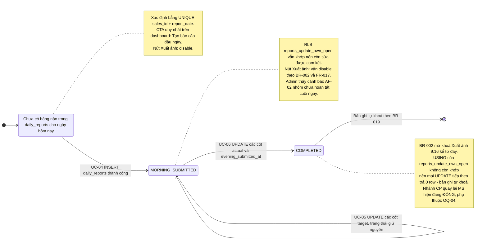
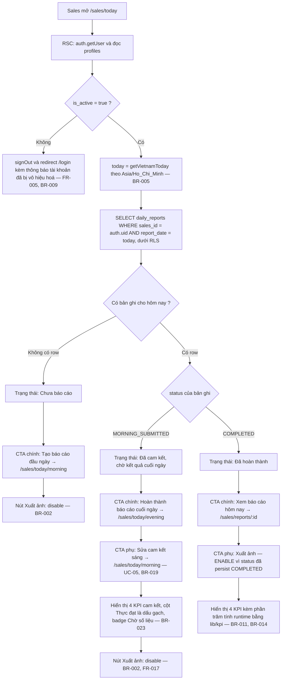
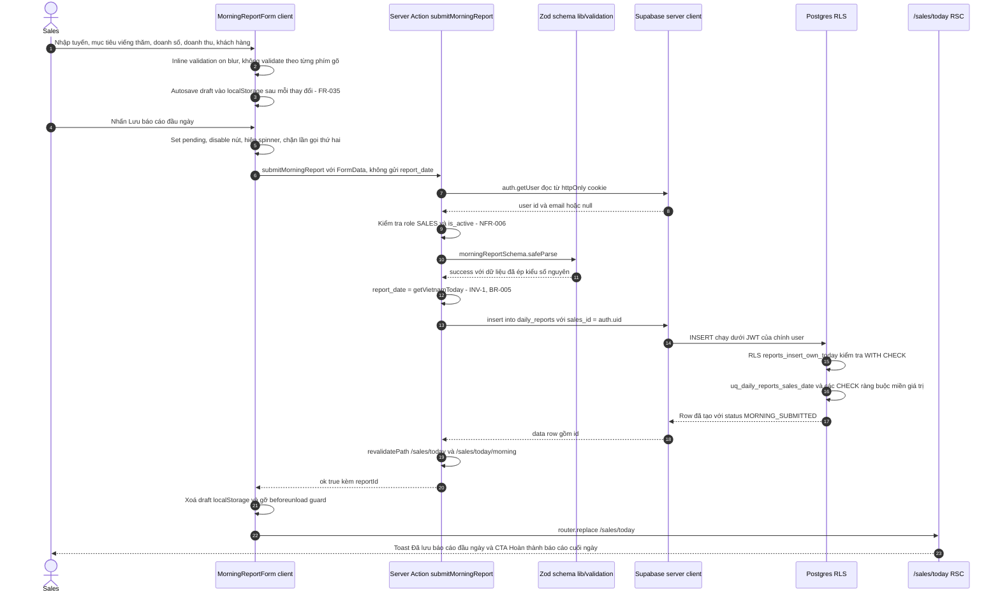
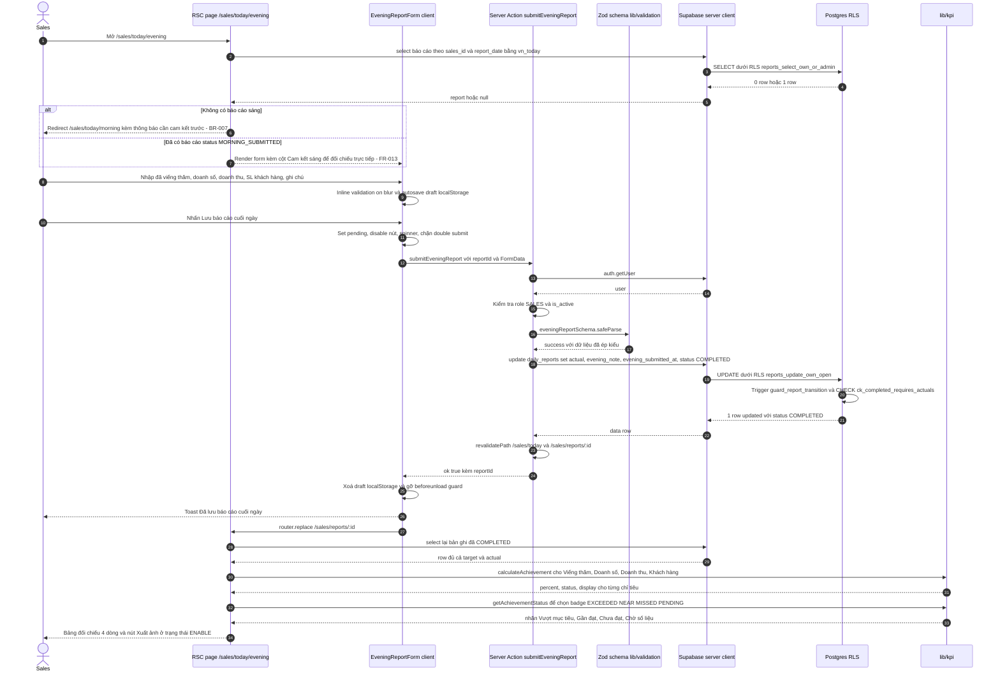
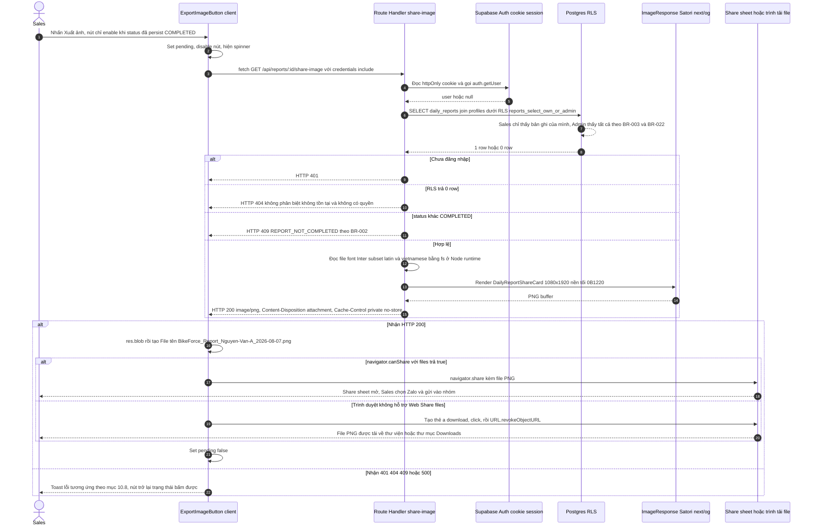
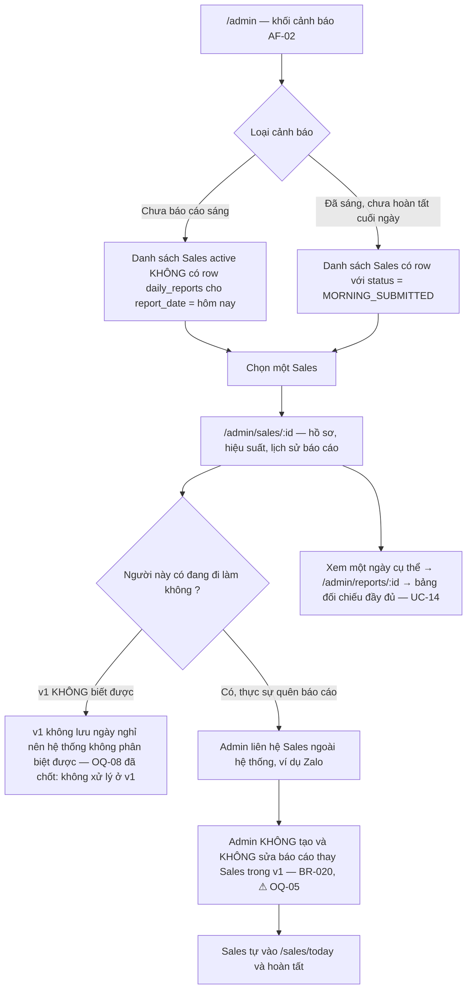

# 03 — Workflow nghiệp vụ end-to-end
> Status: DRAFT | Phase: 0 | Last updated: 2026-08-07
> Nguồn sự thật cấp trên: BIKEFORCE_MASTER_SPEC.md → docs/11-decisions.md → tài liệu này

---

## 0. Phạm vi, quy ước đọc và cảnh báo trạng thái

### 0.1 Tài liệu này trả lời gì

Master Spec §47 yêu cầu `docs/03-workflow.md` phải có **end-to-end workflow** *và* **failure flow** (validation error, network error, duplicate, permission, export fail). Tài liệu này mô tả:

- Vòng đời trạng thái của một báo cáo ngày (§1).
- Luồng thành công của Sales: đăng nhập → dashboard → báo cáo sáng → báo cáo cuối ngày → đối chiếu → xuất ảnh (§2–§8).
- Luồng của Admin: tổng quan hôm nay, điều tra Sales chưa báo cáo, lọc báo cáo, tạo/vô hiệu hoá tài khoản (§9).
- **Failure flows** đầy đủ (§10) — mỗi luồng ghi rõ *trigger / hệ thống làm gì / người dùng thấy gì / dữ liệu form ra sao / cách khôi phục*.
- Concurrency và race condition (§11).
- Truy vết workflow ↔ UC/FR/BR (§12) và OPEN QUESTIONS (§13).

### 0.2 Cảnh báo trạng thái dự án (bắt buộc đọc trước)

> Tại thời điểm 2026-08-07, repository **chưa có source code** — chỉ có 3 file markdown. Không có build, không có typecheck, không có lint, không có test nào đã được chạy.
> Mọi **tên Server Action, tên component, tên Zod schema, tên hàm service** xuất hiện trong tài liệu này là **đề xuất, chưa triển khai**. Tên route, tên bảng, tên cột, tên RLS policy, tên hàm `lib/*` là **đã chốt** trong `docs/02-database-design.md` và `docs/04-system-architecture.md`.
> Các nhánh phụ thuộc OPEN QUESTION được đánh dấu rõ bằng `⚠ OQ-xx` ngay tại chỗ.

### 0.3 Quy ước ký hiệu

| Ký hiệu | Nghĩa |
|---|---|
| `→` | Bước kế tiếp trong text step-list (đúng phong cách Master Spec §47) |
| **RSC** | React Server Component — chỉ **đọc** dữ liệu (DEC-003) |
| **Server Action** | Đường **ghi** duy nhất cho báo cáo (DEC-003); không có REST API cho CRUD |
| **Route Handler** | Chỉ tồn tại một cái: `GET /api/reports/[id]/share-image` |
| **RLS** | Row Level Security — biên giới bảo mật thật sự (DEC-004) |
| `⚠ OQ-xx` | Nhánh workflow sẽ thay đổi nếu OPEN QUESTION được trả lời khác đề xuất mặc định |

### 0.4 Bốn bất biến áp dụng cho MỌI luồng dưới đây

| # | Bất biến | Nguồn |
|---|---|---|
| INV-1 | `report_date` **luôn** do server tính bằng `getVietnamToday()` / `public.vn_today()`. Client **không bao giờ** được gửi `report_date` lên. | BR-005, NFR-011, DEC-009 |
| INV-2 | Achievement **không bao giờ** được lưu vào DB; luôn tính runtime bằng `lib/kpi.calculateAchievement()`. | BR-011, DEC-007 |
| INV-3 | Nút "Xuất ảnh" chỉ enable khi báo cáo **đã persist** với `status = 'COMPLETED'`, không phải khi form "trông có vẻ đầy đủ". | BR-002, FR-017, Master Spec §12 |
| INV-4 | Mọi thất bại ở mọi bước đều **giữ nguyên dữ liệu form** và **không reset form**. | Master Spec §12, §30, NFR-010 |

---

## 1. Vòng đời báo cáo (report lifecycle)

### 1.1 State diagram



### 1.2 Bảng chuyển trạng thái (canonical)

| Từ | Đến | Kích hoạt bởi | Thao tác DB | Chốt chặn | UC / BR |
|---|---|---|---|---|---|
| *(không có bản ghi)* | `MORNING_SUBMITTED` | Sales lưu báo cáo đầu ngày | `INSERT` | RLS `reports_insert_own_today` (`sales_id = auth.uid()`, `is_active_sales()`, `report_date = vn_today()`, `status = 'MORNING_SUBMITTED'`) + `uq_daily_reports_sales_date` + `ck_report_not_future` | UC-04, BR-001, BR-005, BR-016, BR-021 |
| `MORNING_SUBMITTED` | `MORNING_SUBMITTED` | Sales sửa cam kết sáng | `UPDATE` các cột `target_*`, `planned_route`, `visit_purpose` | RLS `reports_update_own_open` (USING yêu cầu `status = 'MORNING_SUBMITTED'`) + trigger `guard_report_transition()` chặn đổi `sales_id`/`report_date` | UC-05, FR-012, BR-019 ⚠ OQ-04 |
| `MORNING_SUBMITTED` | `COMPLETED` | Sales lưu báo cáo cuối ngày | `UPDATE` các cột `actual_*`, `evening_note`, `evening_submitted_at`, `status` | RLS `reports_update_own_open` + `ck_completed_requires_actuals` + `ck_morning_has_no_evening_ts` | UC-06, FR-015, BR-007, BR-008 |
| `COMPLETED` | `COMPLETED` | — | Mọi `UPDATE` khớp **0 row** vì USING không còn thoả | RLS là lớp chặn chính, trigger `guard_report_transition()` là lớp phụ | BR-019 ⚠ OQ-04 |
| `COMPLETED` | `MORNING_SUBMITTED` | **Không tồn tại trong v1** | — | Trigger `guard_report_transition()` chặn tường minh | BR-008, DEC-020 |
| bất kỳ | *(xoá)* | **Không tồn tại trong v1** | Không cấp policy `DELETE` | BR-013 ⚠ OQ-13 | — |

**Không có `DRAFT`, không có `LOCKED`** (DEC-020). Bản nháp chưa gửi chỉ tồn tại trong `localStorage` phía client (FR-035) và **không** phải một trạng thái của DB — server luôn là source of truth (Master Spec §30).

### 1.3 Text step-list — vòng đời rút gọn

```text
(chưa có bản ghi)
→ Sales lưu báo cáo đầu ngày
→ Validate client
→ Validate server bằng Zod
→ INSERT dưới RLS
→ MORNING_SUBMITTED
→ Sales lưu báo cáo cuối ngày
→ Validate client
→ Validate server bằng Zod
→ UPDATE dưới RLS
→ COMPLETED
→ Tính achievement runtime bằng lib/kpi
→ Enable Xuất ảnh 9:16
→ Bản ghi khoá
```

---

## 2. Luồng A — Đăng nhập và định tuyến theo role (UC-01, UC-02)

### 2.1 Text step-list

```text
Mở app
→ middleware.ts refresh session cookie
→ Chưa có session
→ Redirect /login
→ Nhập email + mật khẩu
→ signInWithPassword qua Supabase Auth
→ Đọc profiles để lấy role và is_active
→ is_active = false → chặn, hiện thông báo (FR-005, BR-009)
→ role = SALES → redirect /sales/today
→ role = ADMIN → redirect /admin
```

### 2.2 Chi tiết bắt buộc

| Bước | Ràng buộc |
|---|---|
| Session | `@supabase/ssr` lưu session trong **httpOnly cookie**; `middleware.ts` refresh token mỗi request để session sống qua reload/tab (FR-002). |
| Guard | Hai lớp: `middleware.ts` (route + role) **và** `layout.tsx` server-side của từng route group `(sales)` / `(admin)` (FR-004, DEC-004). Ẩn nút ở client **không** được coi là bảo mật (Master Spec §5). |
| Inactive | `is_active = false` → không đăng nhập được và không thao tác được; thông báo phải rõ ràng bằng tiếng Việt, không phải lỗi kỹ thuật (FR-005). Chi tiết vị trí đặt kiểm tra `is_active` xem `docs/06-auth-permissions.md`. |
| Đã đăng nhập mà vào `/login` | Redirect về dashboard theo role (§12 brief — page map). |
| Đăng xuất (UC-02) | `signOut()` → xoá session cookie → redirect `/login`. **Không** xoá draft `localStorage` (xem §10.6). |
| Không có self-registration | `/login` **không** có link "Đăng ký"; signup bị tắt ở cấu hình Supabase (FR-006, BR-012). |

---

## 3. Luồng B — Dashboard "Hôm nay" của Sales (UC-03, FR-007)

Dashboard hiển thị **đúng một CTA chính** theo trạng thái báo cáo hôm nay. Đây là điểm quyết định trung tâm của toàn bộ trải nghiệm Sales.

### 3.1 Flowchart quyết định CTA



### 3.2 Ba trạng thái dashboard — đặc tả UI

| Trạng thái DB | Nhãn trạng thái | CTA chính | CTA phụ | Nút Xuất ảnh | Nguồn |
|---|---|---|---|---|---|
| Không có row | `Chưa báo cáo` | **Tạo báo cáo đầu ngày** | — | Disable | FR-007, Master Spec §14 |
| `MORNING_SUBMITTED` | `Đã cam kết` | **Hoàn thành báo cáo cuối ngày** | Sửa cam kết sáng ⚠ OQ-04 | Disable | FR-007, FR-012 |
| `COMPLETED` | `Đã hoàn thành` | **Xem báo cáo hôm nay** | **Xuất ảnh** | **Enable** | FR-007, FR-017, BR-002 |

**Quy tắc CTA:** không bao giờ hiển thị đồng thời hai CTA chính. `bottom-nav-limit` giữ nav 3 mục (Hôm nay / Lịch sử / Tài khoản); CTA chính nằm trong sticky action bar có `pb-[env(safe-area-inset-bottom)]`.

**Empty state khi chưa có báo cáo:** icon Lucide + câu hướng dẫn + CTA — không được để màn hình trắng (`empty-states`, Master Spec §33).

---

## 4. Luồng C — Báo cáo đầu ngày, happy path (UC-04)

### 4.1 Text step-list

```text
Login
→ Today Dashboard
→ Chưa có báo cáo hôm nay
→ Nhấn Tạo báo cáo đầu ngày
→ /sales/today/morning
→ Họ tên tự lấy từ profile, không cho sửa (FR-009)
→ Ngày báo cáo hiển thị theo Asia/Ho_Chi_Minh, không cho sửa (FR-010, BR-005)
→ Nhập tuyến, mục tiêu viếng thăm, mục tiêu doanh số, mục tiêu doanh thu, SL khách hàng
→ Validate client
→ Nhấn Lưu báo cáo đầu ngày
→ Validate server bằng Zod
→ Kiểm tra auth + role + is_active
→ INSERT dưới RLS
→ MORNING_SUBMITTED
→ revalidatePath
→ Toast thành công
→ Quay về /sales/today với CTA Hoàn thành báo cáo cuối ngày
```

### 4.2 Sequence diagram



### 4.3 Ràng buộc dữ liệu tại luồng này

| Trường | Kiểu | Ràng buộc | Nguồn |
|---|---|---|---|
| `planned_route` | text | bắt buộc, 1..300 ký tự sau `btrim` | FR-008 |
| `visit_purpose` | text | optional, ≤ 300 ký tự | ⚠ OQ-01 |
| `target_visit_points` | integer | bắt buộc, 0..1000 | BR-006, ⚠ OQ-01 |
| `target_sales_quantity` | integer | bắt buộc, 0..10000 | BR-006, ⚠ OQ-03 |
| `target_revenue` | bigint VND | bắt buộc, 0..100.000.000.000 | BR-006, BR-010, BR-017 |
| `target_customer_visits` | integer | bắt buộc, 0..1000 | BR-006 |
| `full_name` | — | **không** có trong form, lấy từ `profiles` khi hiển thị | FR-009 |
| `report_date` | date | **không** có trong form, server tính | INV-1, FR-010 |

**Nhập số:** mọi field số dùng `inputMode="numeric"` + `pattern="[0-9]*"`; doanh thu format nghìn khi blur nhưng gửi lên là **số nguyên** đã qua `parseCurrencyInput()` — DB không bao giờ nhận chuỗi đã format (BR-010, Master Spec §26).

### 4.4 Luồng D — Sửa báo cáo đầu ngày (UC-05, FR-012)

```text
/sales/today
→ status = MORNING_SUBMITTED
→ Nhấn Sửa cam kết sáng
→ /sales/today/morning
→ RSC phát hiện đã có bản ghi hôm nay → render form ở chế độ SỬA, không phải TẠO
→ Prefill toàn bộ giá trị target hiện tại
→ Sales chỉnh sửa
→ Validate client
→ Nhấn Lưu thay đổi
→ Validate server bằng Zod
→ UPDATE chỉ các cột target, planned_route, visit_purpose
→ RLS reports_update_own_open yêu cầu status = MORNING_SUBMITTED
→ Vẫn MORNING_SUBMITTED
→ revalidatePath
→ Toast Đã cập nhật cam kết
```

**Điểm phải nhớ:** RSC của `/sales/today/morning` **luôn** query báo cáo hôm nay trước khi render. Đây là lớp chống trùng thứ nhất trong ba lớp của FR-011 (xem §10.3). Nếu đã `COMPLETED`, route này chuyển hướng về `/sales/reports/[id]` kèm thông báo báo cáo đã khoá ⚠ OQ-04.

---

## 5. Luồng E — Báo cáo cuối ngày, tính achievement, bật export (UC-06, UC-07)

> ✅ **PHẦN NHẬP THỰC ĐẠT ĐÃ TRIỂN KHAI (Phase 4, 2026-08-07).** Ba điểm bản chạy thật đi khác sơ đồ bên dưới — sơ đồ giữ nguyên làm bản thiết kế gốc, ba điểm này là bản đính chính:
>
> 1. **Điều hướng sau khi lưu do SERVER phát ra**, không phải `router.replace` ở client như bước 27 của §5.2: `saveEveningReport` kết thúc bằng `redirect('/sales/today?saved=evening')`. Lý do là một lỗi đã đo thật — **ISSUE-014**, sửa theo **DEC-037**.
> 2. **Đích đến là `/sales/today`, không phải `/sales/reports/[id]`** — route chi tiết báo cáo là FR-022, **Phase 7**, chưa tồn tại.
> 3. **Bảng đối chiếu và `lib/kpi` (bước 30–34) là PHASE 5**, chưa chạy ở Phase 4. Màn hình cuối ngày chỉ NHẬP số; không có một phép chia `%` nào trong `features/report-evening/`, vì `calculateAchievement()` còn chờ chốt ISSUE-008.
>
> Một điểm nữa **đúng như thiết kế và đã kiểm chứng**: khi chưa có cam kết sáng, `/sales/today/evening` đưa thẳng về `/sales/today/morning` (BR-007), chứ không về `/sales/today`.

### 5.1 Text step-list (đúng mẫu Master Spec §47)

```text
Open Today Report
→ /sales/today/evening
→ RSC nạp báo cáo hôm nay
→ Không có báo cáo sáng → redirect /sales/today/morning (BR-007)
→ View Commitment: hiển thị lại 4 cam kết sáng để đối chiếu (FR-013)
→ Enter Actual: đã viếng thăm, doanh số, doanh thu, SL khách hàng, ghi chú
→ Validate client
→ Save
→ Validate server bằng Zod
→ UPDATE dưới RLS
→ COMPLETED + ghi evening_submitted_at (FR-015)
→ Calculate Achievement runtime bằng lib/kpi (BR-011, BR-014)
→ Enable Export (FR-017, BR-002)
```

### 5.2 Sequence diagram



### 5.3 Bảng đối chiếu — quy tắc tính (UC-07, FR-016)

| Dòng | Target | Actual | Công thức |
|---|---|---|---|
| Viếng thăm | `target_visit_points` | `actual_visit_points` | `actual / target × 100` |
| Doanh số | `target_sales_quantity` | `actual_sales_quantity` | như trên |
| Doanh thu | `target_revenue` | `actual_revenue` | như trên |
| Khách hàng | `target_customer_visits` | `actual_customer_visits` | như trên |

- Cho phép **> 100%**, tuyệt đối **không clamp** (BR-004).
- Làm tròn **1 chữ số thập phân** khi hiển thị (BR-014), ví dụ `80,0%` / `125,0%`.
- **Không bao giờ** xuất hiện `NaN` hay `Infinity` (Master Spec §9).
- `target = 0` và `actual = 0` → **`100,0%`**; `target = 0` và `actual > 0` → hiển thị **số vượt tuyệt đối** có dấu cộng và đơn vị (`+3 xe`, `+3.000.000 ₫`) kèm nhãn "Vượt kế hoạch", `percent = null` (BR-015 — **APPROVED**, OQ-11 đã trả lời).
- Badge trạng thái: ≥100% `Vượt mục tiêu`, 80–99.99% `Gần đạt`, <80% `Chưa đạt`, chưa có actual `Chờ số liệu` (BR-023). Mỗi badge có **icon + text**, không dùng màu đơn thuần.
- Toàn bộ công thức chỉ tồn tại trong `lib/kpi.ts`; **không component nào được tự tính lại** (NFR-012, Master Spec §9).

### 5.4 Vì sao "Enable Export" là bước riêng biệt

Master Spec §12 là business rule bắt buộc: nút Export **không** được enable chỉ vì form trông đầy đủ. Chuỗi điều kiện enable:

```text
Server Action trả ok = true
→ Bản ghi đã persist trên Supabase
→ RSC đọc LẠI bản ghi từ DB
→ status đọc được = COMPLETED
→ Lúc này mới render nút Xuất ảnh ở trạng thái enable
```

Ngay cả khi client bị sửa để bật nút sớm, Route Handler vẫn kiểm tra `status` lần nữa và trả HTTP 409 (§10.8a). Đây là hai lớp độc lập cho cùng một BR-002.

---

## 6. Luồng F — Xuất ảnh báo cáo 9:16 (UC-08, FR-018..FR-020)

### 6.1 Text step-list

```text
/sales/reports/:id với status = COMPLETED
→ Nhấn Xuất ảnh
→ Client fetch GET /api/reports/:id/share-image kèm cookie session
→ Route Handler đọc session, xác thực người dùng
→ Đọc report qua Supabase server client, RLS tự lọc
→ RLS trả 0 row → 404 (không lộ sự tồn tại của bản ghi)
→ status khác COMPLETED → 409 (BR-002)
→ Hợp lệ → đọc file font Inter có dấu tiếng Việt bằng fs
→ Render ImageResponse 1080×1920 từ DailyReportShareCard
→ Trả PNG kèm Content-Disposition attachment và Cache-Control private no-store
→ Client nhận blob
→ navigator.canShare files = true → navigator.share → share sheet có Zalo
→ Không hỗ trợ → tạo thẻ a download → tải file về máy
→ Tên file BikeForce_Report_Nguyen-Van-A_2026-08-07.png (FR-019)
```

### 6.2 Sequence diagram



### 6.3 Ràng buộc kỹ thuật phải tôn trọng

| Ràng buộc | Lý do | Nguồn |
|---|---|---|
| Sinh ảnh **server-side** bằng `ImageResponse`/Satori, không capture DOM | Zalo in-app webview + Safari iOS làm vỡ `foreignObject`/canvas; Tailwind v4 phát sinh `oklch()` mà thư viện capture xử lý không ổn định; server-side cho kích thước tất định 1080×1920 và không thêm JS vào bundle | DEC-010, NFR-003 |
| Font phải là file `.ttf`/`.woff` **có bộ dấu tiếng Việt** nhúng trong repo | Không nhúng font thì chữ có dấu bị fallback hoặc mất dấu | DEC-010, ISSUE-002 |
| Satori chỉ hỗ trợ tập con CSS: flexbox, **không grid**, mỗi phần tử nhiều con phải `display:flex` | Giới hạn của thư viện | ISSUE-002 |
| Ảnh **không** lưu lên Supabase Storage, stream thẳng rồi bỏ | Tiết kiệm hạn mức Free, không phát sinh vòng đời file | DEC-021, NFR-013 |
| `Cache-Control: private, no-store` | Ảnh chứa dữ liệu kinh doanh của cá nhân | NFR-004 |
| Admin dùng **đúng route này** để xuất ảnh báo cáo của Sales | Không nhân đôi logic | BR-022 |

**Edge case bắt buộc kiểm tra ở Phase 6:** tên 40+ ký tự, tuyến 300 ký tự, ghi chú 1000 ký tự, doanh thu 12 chữ số, achievement 4 chữ số (`1250,0%`), `—` khi `target = 0`, và đầy đủ dấu tiếng Việt (ừ ẫ ợ ỹ đ).

---

## 7. Luồng G — Lịch sử và chi tiết báo cáo của Sales (UC-09, UC-10)

```text
/sales/history
→ Mặc định lọc tháng hiện tại theo Asia/Ho_Chi_Minh
→ getVietnamMonthRange trả from và to
→ Query server-side dùng index idx_daily_reports_sales_date_desc, có phân trang (FR-021, NFR-002)
→ RLS reports_select_own_or_admin đảm bảo chỉ thấy báo cáo của chính mình (BR-003)
→ Danh sách hiển thị ngày, trạng thái, doanh số, doanh thu, phần trăm hoàn thành
→ Tháng không có báo cáo → empty state có icon + câu hướng dẫn + CTA (Master Spec §33)
→ Chọn một dòng
→ /sales/reports/:id
→ Bảng đối chiếu 4 chỉ tiêu tính runtime bằng lib/kpi
→ status = COMPLETED → nút Xuất ảnh enable
→ status = MORNING_SUBMITTED → nút Xuất ảnh disable kèm giải thích lý do
```

**Bố cục theo màn hình:** dưới 768px hiển thị **4 card dòng** thay cho bảng (cấm cuộn ngang, DEC-019); từ 768px trở lên mới dùng `<table>` thật.

---

## 8. Bảng tổng hợp luồng Sales (một trang)

| # | Luồng | Route | UC | Kết quả trạng thái |
|---|---|---|---|---|
| A | Đăng nhập / đăng xuất | `/login` | UC-01, UC-02 | — |
| B | Dashboard hôm nay | `/sales/today` | UC-03 | (chỉ đọc) |
| C | Tạo báo cáo đầu ngày | `/sales/today/morning` | UC-04 | → `MORNING_SUBMITTED` |
| D | Sửa cam kết sáng | `/sales/today/morning` | UC-05 | giữ `MORNING_SUBMITTED` |
| E | Hoàn thành cuối ngày | `/sales/today/evening` | UC-06, UC-07 | → `COMPLETED` |
| F | Xuất ảnh 9:16 | `/api/reports/[id]/share-image` | UC-08 | (không đổi trạng thái) |
| G | Lịch sử + chi tiết | `/sales/history`, `/sales/reports/[id]` | UC-09, UC-10 | (chỉ đọc) |
| H | Hồ sơ + đổi mật khẩu | `/sales/account` | UC-11 | (không chạm `daily_reports`) |

---

## 9. Workflows của Admin

### 9.1 Xem tổng quan hôm nay (UC-12, AF-01, AF-02)

```text
Login với role ADMIN
→ Redirect /admin
→ today = vn_today theo Asia/Ho_Chi_Minh
→ Query 1: đếm profiles WHERE role = SALES AND is_active = true  → dùng idx_profiles_role_active
→ Query 2: aggregate daily_reports WHERE report_date = today     → dùng idx_daily_reports_date_status
→ Tính 12 chỉ số bắt buộc theo Master Spec §16
→ Render 4–6 KPI card lớn theo phong cách Executive Dashboard
→ Render 2 khối cảnh báo AF-02
→ Chưa có báo cáo nào hôm nay → empty state, KHÔNG hiển thị 0% gây hiểu nhầm
```

**12 chỉ số bắt buộc (Master Spec §16, FR-024):** tổng Sales active · số đã báo cáo sáng · số đã hoàn thành cuối ngày · số chưa báo cáo · tổng target sales quantity · tổng actual sales quantity · % đạt doanh số · tổng target revenue · tổng actual revenue · % đạt doanh thu · tổng target customer visits · tổng actual customer visits.

Mọi `%` ở đây cũng đi qua `lib/kpi` — không viết lại công thức trong query hay component (BR-011, BR-014, NFR-012).

### 9.2 Điều tra một Sales chưa báo cáo (UC-20, UC-14, AF-02)



**Ràng buộc quan trọng:** Admin **chỉ đọc** số liệu báo cáo. Không có UPDATE policy cho Admin trên các cột số liệu (BR-020). Nếu số sai, quy trình v1 là Admin liên hệ Sales — và vì báo cáo đã `COMPLETED` bị khoá (BR-019), trường hợp này hiện **không có đường sửa** ⚠ **OQ-04 + OQ-05 (cả hai blocking)**. Nếu một trong hai được mở, phải bổ sung audit log AF-12 trước (ISSUE-007).

### 9.3 Lọc báo cáo theo tháng + Sales (UC-13, FR-025, FR-026, AF-03)

```text
/admin/reports
→ Mặc định: tháng hiện tại, tất cả Sales, tất cả status
→ Admin chọn tháng 2026-07
→ getVietnamMonthRange('2026-07') → { from: '2026-07-01', to: '2026-07-31' }
→ Admin chọn Sales trong dropdown (nạp từ profiles WHERE role = SALES)
→ Đẩy filter lên URL searchParams: ?month=2026-07&salesId=...&status=...&page=1
→ RSC đọc searchParams và query SERVER-SIDE (FR-026, NFR-002)
→ WHERE report_date BETWEEN from AND to AND sales_id = ... AND status = ...
→ Dùng idx_daily_reports_sales_date_desc, có LIMIT/OFFSET, không select toàn bảng
→ Render: mobile là card, từ 768px là table có aria-sort
→ Không có kết quả → empty state riêng cho "tháng này chưa có báo cáo"
→ Nhấn Xuất CSV → tải file theo đúng filter đang áp dụng (FR-034, AF-09, SHOULD HAVE)
→ Chọn một dòng → /admin/reports/:id (UC-14)
```

**Vì sao filter nằm trên URL:** để nút Back của trình duyệt hoạt động đúng, để chia sẻ link kết quả lọc, và để giữ nguyên trạng thái khi quay lại từ trang chi tiết (`back-behavior`, `state-preservation`).

### 9.4 Tạo tài khoản Sales mới (UC-17, FR-030, AF-07)

```text
/admin/sales
→ Nhấn Thêm Sales
→ /admin/sales/new
→ Nhập email, mật khẩu tạm, họ tên, số điện thoại, mã nhân viên
→ Validate client bằng Zod
→ Submit Server Action
→ Kiểm tra auth + role = ADMIN (NFR-006)
→ Validate server bằng cùng Zod schema
→ Gọi lib/supabase/admin.ts với SERVICE ROLE KEY, chỉ server-side (DEC-005, NFR-005)
→ auth.admin.createUser với raw_user_meta_data chứa full_name, phone, employee_code, role = SALES
→ Trigger handle_new_user tạo hàng tương ứng trong public.profiles (SECURITY DEFINER)
→ Email trùng → lỗi từ Supabase Auth → thông báo "Email này đã được sử dụng"
→ employee_code trùng → vi phạm UNIQUE → thông báo tương ứng
→ Thành công → revalidatePath /admin/sales
→ Hiển thị mật khẩu tạm MỘT LẦN để Admin gửi cho Sales
→ Sales đăng nhập lần đầu và tự đổi mật khẩu tại /sales/account (UC-11, FR-023)
```

**Ràng buộc tuyệt đối:** `SUPABASE_SERVICE_ROLE_KEY` chỉ dùng cho `auth.admin.*`. **Không bao giờ** dùng service role để đọc/ghi `daily_reports` — mọi truy cập báo cáo phải chạy dưới RLS (DEC-005). `lib/supabase/admin.ts` phải có `import 'server-only'` ở đầu file. Không có self-registration (BR-012, FR-006 ⚠ OQ-06).

### 9.5 Vô hiệu hoá tài khoản (UC-19, FR-032, BR-009)

```text
/admin/sales/:id
→ Nhấn Vô hiệu hoá tài khoản
→ Confirmation dialog nêu rõ hậu quả: người này sẽ không đăng nhập và không thao tác được
→ Xác nhận
→ Server Action kiểm tra auth + role = ADMIN
→ UPDATE profiles SET is_active = false WHERE id = :id
→ RLS profiles_update_admin cho phép; trigger guard_profile_self_update chặn non-admin làm việc này
→ revalidatePath /admin/sales và /admin
→ Toast Đã vô hiệu hoá tài khoản
→ Sales đó vẫn còn session cookie hợp lệ cho tới request điều hướng kế tiếp → xem §10.6
→ Kích hoạt lại: cùng luồng, đặt is_active = true
```

**Không xoá tài khoản.** `daily_reports.sales_id` có FK `ON DELETE RESTRICT` nên xoá profile có báo cáo sẽ bị chặn ở DB; v1 chỉ có bật/tắt `is_active`. Báo cáo cũ của người bị vô hiệu hoá **vẫn hiển thị** trong `/admin/reports` để không mất dữ liệu lịch sử.

---

## 10. FAILURE FLOWS

> Master Spec §47 bắt buộc phần này. Master Spec §12 và §30 bắt buộc: **mọi** thất bại phải giữ dữ liệu form và **không** reset form. Mỗi mục dưới đây ghi đủ 5 phần: **Trigger / Hệ thống làm gì / Người dùng thấy gì / Dữ liệu form ra sao / Cách khôi phục**.

### 10.0 Bảng tổng hợp

| # | Tình huống | Mã trả về | Form bị reset? | Cho export? |
|---|---|---|---|---|
| 10.1 | Validation error phía client | không gửi request | **Không** | Không |
| 10.2 | Validation error phía server | `VALIDATION` | **Không** | Không |
| 10.3 | Trùng báo cáo trong ngày | `DUPLICATE` (Postgres `23505`) | **Không** | Không |
| 10.4 | Mạng lỗi / timeout | `NETWORK` (client tự phân loại) | **Không** | Không |
| 10.5 | Session hết hạn giữa lúc submit | `UNAUTHENTICATED` | **Không** | Không |
| 10.6 | Tài khoản bị vô hiệu hoá giữa phiên | `ACCOUNT_DISABLED` | **Không** | Không |
| 10.7 | Permission denied / RLS trả 0 row | `NOT_FOUND` hoặc `FORBIDDEN` (`42501`) | **Không** | Không |
| 10.8 | Xuất ảnh thất bại | `409` / `500` / fallback download | **Không** | — |
| 10.9 | Lỗi 500 không xác định | `UNKNOWN` | **Không** | Không |

---

### 10.1 Validation error phía client

**Trigger.** Sales rời khỏi một field (`blur`) với giá trị không hợp lệ, hoặc nhấn nút Lưu khi vẫn còn field không hợp lệ. Các trường hợp cụ thể: bỏ trống trường bắt buộc; số âm; `NaN`; ký tự rác trong ô số; tuyến vượt 300 ký tự; ghi chú vượt 1000 ký tự (BR-018); doanh thu vượt trần 100.000.000.000 VND (BR-017); doanh số vượt 10000 hoặc số điểm viếng thăm vượt 1000 (BR-006).

**Hệ thống làm gì.** Chạy **cùng một Zod schema** với server (`lib/validation`) ngay trên client — không phát sinh bất kỳ request nào. Áp dụng `inline-validation` (kiểm tra khi blur, **không** theo từng phím gõ để không nhấp nháy khi đang gõ). Nếu có ≥2 lỗi thì render thêm một `error-summary` ở đầu form. `focus-management`: tự đưa con trỏ về field lỗi **đầu tiên**. Draft `localStorage` vẫn tiếp tục được ghi bình thường.

**Người dùng thấy gì.** Thông báo tiếng Việt cụ thể **ngay bên dưới field** (`error-placement`), 14px, bọc trong phần tử có `role="alert"` để screen reader đọc lên (`aria-live-errors`). Viền field chuyển sang `--color-destructive` `#B91C1C`, kèm icon — không dùng màu đơn thuần làm tín hiệu (`color-not-only`). Ví dụ: *"Mục tiêu doanh thu phải là số nguyên từ 0 đến 100.000.000.000"*. Nút Lưu **không** bị disable vì lý do validation (chỉ disable khi đang gửi) để người dùng luôn hiểu vì sao không đi tiếp được.

**Dữ liệu form ra sao.** **Giữ nguyên 100%.** Không có field nào bị xoá, không có field nào bị "sửa hộ". Draft trong `localStorage` không đổi.

**Cách khôi phục.** Sửa field lỗi → validation chạy lại khi blur → thông báo biến mất → nhấn Lưu lại. Không cần tải lại trang.

---

### 10.2 Validation error phía server (client đã bị sửa hoặc lệch phiên bản)

**Trigger.** Payload không hợp lệ vẫn tới được Server Action. Ba nguyên nhân thực tế: (a) người dùng chỉnh DOM/JS bằng devtools hoặc gửi request thủ công; (b) extension trình duyệt can thiệp form; (c) tab đang mở dùng bundle client **cũ** trong khi server đã deploy schema mới — client validate theo luật cũ, server từ chối theo luật mới.

**Hệ thống làm gì.** Server Action **luôn** chạy `schema.safeParse()` bất kể client đã validate hay chưa (NFR-006 — mọi Server Action tự kiểm tra auth + role + Zod). Khi fail: **không** ghi bất cứ thứ gì xuống DB, **không** `throw` (throw sẽ kích hoạt `error.tsx` và làm mất form), mà `return { ok: false, code: 'VALIDATION', fieldErrors }`. Ghi log phía server gồm user id, tên action, timestamp và lỗi (NFR-014); client chỉ nhận thông điệp an toàn, không nhận stack, không nhận tên bảng/cột nội bộ.

**Người dùng thấy gì.** Cùng giao diện lỗi như §10.1 (thông báo dưới từng field), cộng thêm một toast *"Dữ liệu không hợp lệ, vui lòng kiểm tra lại."* Không hiển thị thuật ngữ kỹ thuật.

**Dữ liệu form ra sao.** **Giữ nguyên.** Form dùng `useActionState` để state (bao gồm giá trị người dùng đã nhập) sống qua vòng gọi Server Action. Không `router.refresh()`, không `redirect()` trong nhánh lỗi.

**Cách khôi phục.** Sửa theo thông báo rồi gửi lại. Nếu người dùng khẳng định dữ liệu đúng mà vẫn lỗi lặp lại → nghi ngờ nguyên nhân (c): hướng dẫn tải lại trang để nhận bundle client mới, draft `localStorage` sẽ khôi phục nội dung đã gõ.

---

### 10.3 Duplicate report — vi phạm `UNIQUE(sales_id, report_date)`, Postgres `23505`

**Trigger.** Cùng một Sales cố tạo báo cáo thứ hai cho cùng một ngày nghiệp vụ. Kịch bản thật: mở form ở hai tab/hai thiết bị rồi submit cả hai; nhấn Back về `/sales/today/morning` sau khi đã lưu rồi submit lại; double-tap lọt qua guard client; thử lại thủ công sau một lần timeout mà thực ra lần đầu đã ghi thành công (§10.4).

**Hệ thống làm gì.** Ba lớp chống trùng theo FR-011:

1. **UI/RSC** — `/sales/today/morning` luôn query báo cáo hôm nay trước khi render; nếu đã có, form render ở chế độ **sửa** (UC-05) thay vì **tạo**, nên đường tạo trùng thường không xuất hiện.
2. **Server** — Server Action kiểm tra sự tồn tại trước khi `INSERT`.
3. **Database** — `uq_daily_reports_sales_date` là chốt chặn cuối, ném `23505` kể cả khi hai request chạy đồng thời vượt qua lớp 2.

Server Action bắt **riêng** mã `23505` (không để nó rơi vào nhánh lỗi chung), truy vấn lại để lấy `id` của bản ghi đã tồn tại, rồi trả `{ ok: false, code: 'DUPLICATE', reportId }`.

**Người dùng thấy gì.** Toast/banner: *"Bạn đã có báo cáo cho hôm nay."* kèm nút **"Mở báo cáo hôm nay"**. Tuyệt đối **không** hiển thị `23505`, không hiển thị tên constraint, không hiển thị lỗi 500 chung chung.

**Dữ liệu form ra sao.** **Giữ nguyên trên màn hình.** Người dùng cần nhìn thấy số vừa gõ để tự đối chiếu với bản ghi đã tồn tại trước khi quyết định. Nếu bấm "Mở báo cáo hôm nay" khi form đang dirty, `sheet-dismiss-confirm` hỏi xác nhận trước khi rời trang.

**Cách khôi phục.** Bấm "Mở báo cáo hôm nay" → chuyển sang bản ghi thật (form sửa cam kết nếu còn `MORNING_SUBMITTED`, hoặc trang chi tiết nếu đã `COMPLETED`). **Hạn chế đã biết của v1:** hệ thống **không** tự merge số vừa nhập vào bản ghi đã tồn tại; người dùng phải nhập lại thủ công. Ghi nhận là đánh đổi có chủ ý để tránh ghi đè dữ liệu ngoài ý muốn.

---

### 10.4 Network error / timeout

**Trigger.** Mất sóng giữa đường, 4G chập chờn, DNS lỗi, cold start của Vercel, hoặc request treo quá ngưỡng chờ. Về mặt lập trình: `fetch` reject, promise của Server Action reject, hoặc quá thời gian chờ do client tự đặt.

**Hệ thống làm gì.** Client bọc lời gọi trong `try/catch` và **phân biệt lỗi mạng với lỗi nghiệp vụ** — hai loại này có thông điệp và cách khôi phục khác nhau. **Không tự động retry ngầm** đối với thao tác ghi: một `INSERT` lặp lại âm thầm có thể tạo bản ghi thứ hai; retry phải do người dùng chủ động bấm. `UNIQUE(sales_id, report_date)` là lưới an toàn cuối nếu retry trùng (→ §10.3). Nút Lưu **phải** thoát khỏi trạng thái spinner — không được kẹt vĩnh viễn (NFR-010).

**Người dùng thấy gì.** Toast lỗi: *"Không gửi được báo cáo. Kiểm tra kết nối và thử lại."* kèm nút **"Thử lại"**. Kèm dòng trấn an: *"Dữ liệu bạn nhập chưa bị mất."*

**Dữ liệu form ra sao.** **Giữ nguyên trên màn hình** và **đã được lưu vào `localStorage`** từ trước bởi `form-autosave` (FR-035). Nghĩa là kể cả khi trình duyệt bị hệ điều hành kill hoặc pin cạn, mở lại app vẫn khôi phục được.

**Cách khôi phục.**
1. Bấm "Thử lại" — đường phổ biến nhất.
2. Nếu app bị đóng: mở lại `/sales/today/morning` (hoặc `/evening`) → banner *"Có bản nháp chưa gửi"* + nút **"Khôi phục bản nháp"** → nội dung được nạp lại → bấm Lưu.
3. **Trường hợp không rõ kết quả** (request có thể đã tới server nhưng phản hồi bị mất): tải lại `/sales/today`. Nếu dashboard đã hiển thị `Đã cam kết` thì lần lưu đầu **đã thành công** — không cần gửi lại. Nếu vẫn `Chưa báo cáo` thì gửi lại; nếu lần gửi lại chạm phải bản ghi đã có, hệ thống sẽ đi vào §10.3 chứ không tạo trùng.

---

### 10.5 Session hết hạn ngay lúc submit

**Trigger.** JWT hết hạn và `middleware.ts` không refresh được: refresh token đã bị thu hồi, người dùng đã đăng xuất ở thiết bị khác, hoặc mật khẩu vừa bị đổi. Đặc biệt dễ xảy ra khi Sales mở form buổi sáng rồi để máy trong túi cả ngày mới bấm Lưu.

**Hệ thống làm gì.** Server Action gọi `auth.getUser()`; kết quả `null` → `return { ok: false, code: 'UNAUTHENTICATED' }`. **Cố ý không dùng `redirect()` trong Server Action** ở nhánh này: redirect sẽ thay trang và xoá sạch form. Client nhận mã này thì **ghi draft vào `localStorage` ngay lập tức** rồi mới hiển thị modal.

**Người dùng thấy gì.** Modal: *"Phiên đăng nhập đã hết hạn. Dữ liệu bạn nhập đã được lưu tạm trên máy."* với một nút **"Đăng nhập lại"** dẫn tới `/login` kèm tham số quay về đúng route đang dở.

**Dữ liệu form ra sao.** **Giữ nguyên trên màn hình phía sau modal** và đã được ghi vào `localStorage` trước khi modal xuất hiện.

**Cách khôi phục.** Đăng nhập lại → hệ thống đưa về đúng `/sales/today/morning` hoặc `/sales/today/evening` → banner khôi phục bản nháp → kiểm tra lại số liệu → bấm Lưu. Nếu trong thời gian đó ngày nghiệp vụ VN đã sang ngày mới, `report_date` sẽ được server tính lại tại thời điểm submit (INV-1) — xem §11.3 về mốc nửa đêm.

---

### 10.6 Tài khoản bị vô hiệu hoá giữa phiên làm việc

**Trigger.** Admin đặt `is_active = false` (UC-19) trong khi Sales đang mở form và chưa bấm Lưu.

**Hệ thống làm gì.** Session cookie của Supabase Auth **không** tự huỷ khi một cột trong `public.profiles` thay đổi, nên phải chặn ở ba lớp độc lập:

1. **Điều hướng kế tiếp** — `middleware.ts` / `layout.tsx` server-side đọc profile, thấy `is_active = false` → `signOut()` → redirect `/login` kèm thông báo (FR-005, BR-009).
2. **Submit trước khi kịp điều hướng** — Server Action tự kiểm tra `is_active` → `return { ok: false, code: 'ACCOUNT_DISABLED' }`.
3. **Lưới an toàn cuối** — RLS `reports_insert_own_today` và `reports_update_own_open` đều gọi `public.is_active_sales()`, nên ngay cả khi hai lớp trên bị bỏ sót, database vẫn từ chối.

**Người dùng thấy gì.** Thông báo dứt khoát bằng tiếng Việt: *"Tài khoản của bạn đã bị vô hiệu hoá. Vui lòng liên hệ quản trị viên."* Không hiện lỗi kỹ thuật, không hiện mã lỗi Postgres.

**Dữ liệu form ra sao.** **Giữ nguyên trên màn hình, không reset.** Khi buộc phải `signOut`, hệ thống xoá session cookie nhưng **không** xoá draft `localStorage` — để nếu tài khoản được bật lại thì công sức nhập liệu không mất. Draft nằm trên thiết bị của chính người dùng nên không phát sinh rủi ro rò rỉ chéo.

**Cách khôi phục.** **Không có đường tự khôi phục.** Chỉ Admin bật lại `is_active` (UC-19, FR-032). Sau khi được bật lại, người dùng đăng nhập → mở lại route đang dở → khôi phục bản nháp → Lưu. Nếu đã sang ngày mới thì áp dụng ⚠ **OQ-12** (mặc định: không cho nhập bù ngày cũ, BR-021).

---

### 10.7 Permission denied / RLS trả về 0 row

**Trigger.** Bốn kịch bản: (a) Sales A mở trực tiếp `/sales/reports/<id-của-Sales-B>` — IDOR; (b) Sales A gọi `GET /api/reports/<id-của-Sales-B>/share-image`; (c) Sales gọi route `/admin/*`; (d) Sales A cố `UPDATE` bản ghi của Sales B bằng request thủ công.

**Hệ thống làm gì.** Phân biệt rõ hai cơ chế:

| Thao tác | RLS làm gì | Ứng dụng làm gì |
|---|---|---|
| `SELECT` bản ghi người khác | `reports_select_own_or_admin` khiến hàng **không tồn tại** với user đó → trả **0 row** | RSC gọi `notFound()` → render `not-found.tsx` của route group |
| `UPDATE` bản ghi người khác | `USING` không khớp → **0 row affected**, không phải exception | Server Action coi là `NOT_FOUND`; **không** trả thông điệp "bạn không có quyền" vì như vậy là xác nhận bản ghi tồn tại |
| `INSERT` với `sales_id` của người khác | `WITH CHECK` fail → Postgres `42501` insufficient_privilege | Server Action trả `code: 'FORBIDDEN'`, ghi log server đầy đủ |
| Truy cập `/admin/*` với role SALES | — | `middleware.ts` + `layout.tsx` chặn, redirect `/sales/today` |

**Người dùng thấy gì.** Với route trang: trang 404 *"Không tìm thấy báo cáo"* kèm nút quay về "Hôm nay" / "Lịch sử". Với Route Handler ảnh: HTTP **404**. Chọn 404 làm mặc định thay vì 403 để không tiết lộ sự tồn tại của bản ghi; bộ test bảo mật ở `docs/08-testing-strategy.md` chấp nhận **403 hoặc 404**, miễn là **không** trả dữ liệu.

**Dữ liệu form ra sao.** Nếu lỗi phát sinh trong lúc submit (kịch bản (d)), form **giữ nguyên**, chỉ hiện toast *"Không thực hiện được thao tác này."* Không reset, không điều hướng ngầm.

**Cách khôi phục.** Quay về danh sách hợp lệ của chính mình. v1 **không có** cơ chế "xin quyền". Mọi lần chạm vào nhánh này đều được ghi log phía server để phát hiện dò tìm ID (NFR-014).

---

### 10.8 Export ảnh thất bại

Chia thành ba trường hợp riêng biệt vì cách khôi phục hoàn toàn khác nhau.

#### 10.8a — Báo cáo chưa `COMPLETED`

**Trigger.** Route Handler được gọi cho một báo cáo còn `MORNING_SUBMITTED`: tab cũ giữ trạng thái lỗi thời, deep link được chia sẻ lại, hoặc client bị sửa để bật nút sớm.

**Hệ thống làm gì.** Sau khi RLS trả về row, Route Handler kiểm tra `status !== 'COMPLETED'` → trả **HTTP 409** kèm `{ error: 'REPORT_NOT_COMPLETED' }` và **không** khởi tạo `ImageResponse` (BR-002, FR-017). Đây là lớp thực thi thứ hai, độc lập với việc bật/tắt nút ở UI.

**Người dùng thấy gì.** Toast: *"Cần hoàn thành báo cáo cuối ngày trước khi xuất ảnh."* kèm nút **"Hoàn thành báo cáo cuối ngày"** dẫn tới `/sales/today/evening`.

**Dữ liệu form ra sao.** Nếu người dùng đang đứng ở form cuối ngày và bấm Xuất ảnh quá sớm, **form giữ nguyên toàn bộ số đã nhập, không reset**. Trang chi tiết báo cáo không có form nên không có gì để mất.

**Cách khôi phục.** Hoàn tất UC-06 → status chuyển `COMPLETED` → nút Xuất ảnh enable → thử lại.

#### 10.8b — Lỗi sinh ảnh: font hỏng, thiếu glyph, Satori không dựng được layout

**Trigger.** File font không đọc được bằng `fs`; font thiếu glyph tiếng Việt khiến chữ mất dấu; layout dùng CSS mà Satori không hỗ trợ (`grid`, hoặc phần tử nhiều con thiếu `display:flex`); nội dung quá dài làm vỡ khung. Đây là rủi ro đã được ghi nhận từ Phase 0 — **ISSUE-002**.

**Hệ thống làm gì.** Bọc toàn bộ phần render trong `try/catch`. Ghi log đầy đủ (stack, `reportId`, độ dài các trường text) phía server. Trả **HTTP 500** kèm `{ error: 'IMAGE_RENDER_FAILED' }` — **không** trả stack ra client (NFR-014). Báo cáo trong DB **không bị đụng đến**: thất bại khi xuất ảnh không bao giờ làm hỏng dữ liệu, vì luồng này chỉ đọc.

**Người dùng thấy gì.** Toast: *"Không tạo được ảnh báo cáo. Vui lòng thử lại hoặc báo quản trị viên."* kèm nút **"Thử lại"**, và một dòng trấn an quan trọng: *"Báo cáo của bạn vẫn được lưu đầy đủ trên hệ thống."*

**Dữ liệu form ra sao.** Không có form ở bước này; **không có dữ liệu nào bị mất hay bị reset**. Bản ghi `daily_reports` giữ nguyên `COMPLETED`.

**Cách khôi phục.** Thử lại (lỗi nhất thời như cold start có thể tự hết). Nếu lỗi lặp lại có hệ thống → mở ISSUE mới trong `docs/12-known-issues.md` theo format Spec §56, gắn với ISSUE-002. Đường lùi kỹ thuật đã được ghi nhận sẵn: chuyển sang `html-to-image` client-side với `next/dynamic({ ssr:false })`, chờ `document.fonts.ready`, và dùng bảng màu hex thuần cho thẻ share — **chỉ được kích hoạt sau khi ghi một DEC mới**, không sửa lén (DEC-010).

#### 10.8c — Web Share API không hỗ trợ, hoặc người dùng huỷ share sheet

**Trigger.** `navigator.share` không tồn tại (phần lớn desktop); `navigator.canShare({ files })` trả `false` (một số webview không cho chia sẻ file); hoặc người dùng mở share sheet rồi bấm huỷ → promise reject với `AbortError`.

**Hệ thống làm gì.** Đây **không phải lỗi**, mà là nhánh fallback đã thiết kế sẵn (FR-020, DEC-011). Không hỗ trợ → tạo `<a download>` với tên file theo FR-019 (`BikeForce_Report_<Ho-Ten>_<YYYY-MM-DD>.png`), click bằng script, rồi `URL.revokeObjectURL()` để giải phóng bộ nhớ. Với `AbortError` do người dùng chủ động huỷ → **nuốt im lặng**, không hiện toast lỗi (báo lỗi khi người dùng cố ý huỷ là phản trải nghiệm).

**Người dùng thấy gì.** Nhánh fallback: file PNG được tải về, kèm toast hướng dẫn *"Đã tải ảnh về máy. Mở Zalo và gửi ảnh từ thư viện."* Nhánh huỷ: không có gì thay đổi, nút trở lại trạng thái bấm được. **Rủi ro chưa kiểm chứng:** trong Zalo in-app webview, hành vi tải file đính kèm chưa được xác nhận trên thiết bị thật — **ISSUE-003**, phải test tay ở Phase 6 (NFR-009).

**Dữ liệu form ra sao.** Không liên quan tới form; **không có gì bị reset**.

**Cách khôi phục.** Không mất mát gì. Có thể bấm Xuất ảnh lại bao nhiêu lần tuỳ ý vì ảnh được sinh mới mỗi lần và **không** lưu trên server (DEC-021).

---

### 10.9 Lỗi 500 không xác định

**Trigger.** Exception không lường trước ở Server Action, RSC hoặc Route Handler: Supabase gián đoạn, biến môi trường thiếu/sai sau deploy, lỗi lập trình chưa bị test bắt được.

**Hệ thống làm gì.** Server Action bọc toàn bộ thân hàm trong `try/catch`; ghi `console.error` phía server kèm đủ thông tin truy vết (user id, tên action, timestamp, đối tượng lỗi) để tra trên log của Vercel; trả về `{ ok: false, code: 'UNKNOWN' }` với **một thông điệp chung, an toàn** (NFR-014). RSC nếu ném lỗi sẽ rơi vào `error.tsx` của route group tương ứng — file này bắt buộc phải tồn tại cho cả `(sales)` và `(admin)` và phải có nút gọi `reset()`.

**Người dùng thấy gì.** *"Đã có lỗi xảy ra. Dữ liệu bạn nhập chưa bị mất."* kèm nút **"Thử lại"**. Tuyệt đối không hiển thị stack trace, câu SQL, tên bảng/cột, hay bất kỳ mã lỗi Postgres nào.

**Dữ liệu form ra sao.** **Giữ nguyên** — đây là lý do nhánh lỗi trả về giá trị thay vì `throw`: `throw` sẽ đẩy sang error boundary và thay cả cây UI, làm mất toàn bộ nội dung đang nhập. Draft `localStorage` vẫn còn nguyên.

**Cách khôi phục.** Bấm "Thử lại". Nếu tiếp diễn: người dùng chụp màn hình gửi Admin; Admin/dev đối chiếu log Vercel theo timestamp; ghi thành ISSUE mới trong `docs/12-known-issues.md` đúng format Spec §56 với `Status: OPEN` và `Severity` phù hợp.

---

## 11. Concurrency và race conditions

### 11.1 Hai tab cùng mở một form

**Kịch bản.** Sales mở `/sales/today/morning` ở tab A và tab B. Tab A submit thành công. Tab B vẫn tin rằng hôm nay chưa có báo cáo.

**Điều gì xảy ra.** Tab B submit → Server Action kiểm tra tồn tại (hoặc DB ném `23505` nếu hai request gần như đồng thời) → đi vào §10.3, hiển thị *"Bạn đã có báo cáo cho hôm nay"* + nút mở bản ghi. **Không** tạo bản ghi trùng, **không** ghi đè bản ghi của tab A.

**Vấn đề phụ — draft `localStorage` dùng chung giữa các tab.** Hai tab ghi vào cùng một key sẽ đè lẫn nhau. **Đề xuất, chưa triển khai:** key dạng `bikeforce:draft:<form>:<sales_id>:<report_date>` và lưu kèm `updatedAt`; khi khôi phục thì so `updatedAt` và **hỏi người dùng** trước khi ghi đè nội dung đang có trên màn hình.

**Đồng bộ giữa các tab.** v1 **không** dùng Supabase Realtime (`lib/supabase/client.ts` chỉ phục vụ auth UI). `revalidatePath()` chỉ làm mới cache của chính request đã gọi nó — tab còn lại chỉ cập nhật khi được focus/reload. Đây là đánh đổi có chủ ý: chi phí thấp, và luồng §10.3 đã xử lý an toàn hậu quả.

### 11.2 Double submit

**Kịch bản.** Nhấn nút Lưu hai lần rất nhanh; hoặc nhấn Enter trong ô input rồi click nút; hoặc mạng chậm khiến người dùng tưởng nút không ăn.

**Bốn lớp bảo vệ (Master Spec §30 yêu cầu tường minh "prevent double submit"):**

1. **UI** — `loading-buttons`: nút bị `disabled` và hiện spinner ngay khi bắt đầu gửi, dựa trên trạng thái pending của `useActionState`/`useFormStatus`.
2. **Client logic** — một cờ ref đồng bộ chặn lời gọi thứ hai kể cả trong khoảng thời gian React chưa kịp re-render.
3. **Database, luồng sáng** — `UNIQUE(sales_id, report_date)` khiến lần `INSERT` thứ hai chắc chắn thất bại với `23505` → §10.3. Đây là bảo đảm duy nhất đúng cả khi hai request chạy song song trên hai instance serverless khác nhau.
4. **Database, luồng cuối ngày — idempotent theo thiết kế.** `UPDATE` đi qua RLS `reports_update_own_open`, mà `USING` yêu cầu `status = 'MORNING_SUBMITTED'`. Lần submit thứ hai vì thế khớp **0 row**. Server Action **không** được coi 0 row là lỗi ngay: phải `SELECT` lại bản ghi; nếu bản ghi đã ở `COMPLETED` **và** `evening_submitted_at` đã có thì coi như **thành công** và trả về bình thường — người dùng không bị doạ bằng thông báo lỗi cho một thao tác thực chất đã thành công.

### 11.3 Race giữa báo cáo sáng và báo cáo cuối ngày

**Kịch bản 1 — sửa cam kết sáng trong khi đang nhập cuối ngày.** Tab A đang mở `/sales/today/evening` (hiển thị cam kết sáng để đối chiếu). Tab B mở form sửa cam kết (UC-05) và lưu target mới. Sau đó tab A submit.

- **Không có lost update:** Server Action cuối ngày **chỉ** ghi `actual_*`, `evening_note`, `evening_submitted_at`, `status`. Nó **không bao giờ** đụng vào các cột `target_*`. Vì vậy giá trị target mới của tab B được giữ nguyên.
- **Có sai lệch hiển thị:** tab A đang hiển thị target **cũ** trong cột "Cam kết sáng". Sau khi lưu, hệ thống điều hướng sang `/sales/reports/:id` và trang này **đọc lại từ DB**, nên bảng đối chiếu cuối cùng và ảnh 9:16 luôn dùng target **mới nhất**. Số hiển thị trong lúc nhập có thể lệch, số được lưu và số xuất ra ảnh thì không.

**Kịch bản 2 — thứ tự ngược lại.** Tab A submit cuối ngày trước → status thành `COMPLETED`. Sau đó tab B bấm lưu sửa cam kết sáng → RLS `reports_update_own_open` yêu cầu `status = 'MORNING_SUBMITTED'` nên khớp **0 row** → Server Action trả thông báo *"Báo cáo đã hoàn tất, không sửa được nữa."* (BR-019). Form của tab B **giữ nguyên, không reset** (INV-4). ⚠ **OQ-04**: nếu câu trả lời là (b) hoặc (c), nhánh này phải mở lại và khi đó **bắt buộc** cần audit log AF-12 (ISSUE-007).

**Kịch bản 3 — vắt qua nửa đêm giờ Việt Nam.** Sales mở form lúc 23:58 ngày `D`, bấm Lưu lúc 00:01 ngày `D+1`.

- `report_date` được tính **ở server tại thời điểm submit** bằng `getVietnamToday()`; RLS `reports_insert_own_today` cũng so với `public.vn_today()` — cả hai đều theo `Asia/Ho_Chi_Minh`, không theo giờ máy người dùng (INV-1, BR-005, NFR-011).
- Kết quả: báo cáo thuộc về ngày `D+1`, **không** phải ngày `D`.
- Nếu Sales thực sự muốn báo cáo cho ngày `D` thì hệ thống **từ chối** theo BR-021 ⚠ **OQ-12** (mặc định: chỉ tạo/sửa cho đúng ngày hôm nay, không nhập bù).
- Trường hợp nguy hiểm hơn: báo cáo sáng ở ngày `D`, submit cuối ngày lúc 00:01 ngày `D+1`. Đây là `UPDATE` theo `id` chứ không theo `report_date`, và RLS `reports_update_own_open` **không** ràng buộc `report_date = vn_today()` — nên thao tác **vẫn thành công** và gắn vào đúng báo cáo ngày `D`. Đây là hành vi **mong muốn** (Sales về nhà muộn vẫn chốt được ngày làm việc), nhưng phải được ghi rõ ở đây vì nó là ngoại lệ so với quy tắc "chỉ thao tác cho ngày hôm nay". Ranh giới này phải có unit test và integration test riêng (mock 16:59Z và 17:01Z), xem `docs/08-testing-strategy.md`.

**Đề xuất tăng cường, chưa triển khai:** gửi kèm `updated_at` hoặc `expectedStatus` để phát hiện thay đổi giữa chừng (optimistic concurrency) và cảnh báo người dùng thay vì âm thầm ghi. Chỉ nên làm nếu OQ-04 mở nhánh sửa sau khi hoàn tất; ghi vào `docs/10-future-roadmap.md`.

---

## 12. Truy vết workflow ↔ UC / FR / BR

| Mục | Workflow | UC | FR chính | BR chính |
|---|---|---|---|---|
| §2 | Đăng nhập, định tuyến theo role | UC-01, UC-02 | FR-001..FR-006 | BR-009, BR-012 |
| §3 | Dashboard hôm nay, chọn CTA | UC-03 | FR-007 | BR-005, BR-002 |
| §4 | Báo cáo đầu ngày | UC-04 | FR-008..FR-011 | BR-001, BR-005, BR-006, BR-010, BR-016, BR-017, BR-021 |
| §4.4 | Sửa cam kết sáng | UC-05 | FR-012 | BR-019 |
| §5 | Báo cáo cuối ngày + achievement | UC-06, UC-07 | FR-013..FR-016 | BR-004, BR-007, BR-008, BR-011, BR-014, BR-015, BR-023 |
| §6 | Xuất ảnh 9:16 | UC-08 | FR-017..FR-020 | BR-002, BR-022 |
| §7 | Lịch sử + chi tiết | UC-09, UC-10 | FR-021, FR-022 | BR-003 |
| §9.1 | Admin tổng quan hôm nay | UC-12 | FR-024 | BR-011, BR-014 |
| §9.2 | Admin điều tra Sales chưa báo cáo | UC-20, UC-14 | FR-033, FR-027 | BR-020 |
| §9.3 | Admin lọc báo cáo | UC-13, UC-21 | FR-025, FR-026, FR-034 | BR-003 |
| §9.4 | Admin tạo tài khoản Sales | UC-17 | FR-030 | BR-012, BR-025 |
| §9.5 | Admin vô hiệu hoá tài khoản | UC-19 | FR-032 | BR-009 |
| §10 | Failure flows | tất cả | FR-035, NFR-010, NFR-014 | BR-001, BR-002, BR-003, BR-009, BR-019 |
| §11 | Concurrency | UC-04, UC-05, UC-06 | FR-011, FR-015 | BR-001, BR-005, BR-008, BR-019, BR-021 |

**Ánh xạ AF (Admin Feature) đã dùng trong tài liệu này:** AF-01 (§9.1), AF-02 (§9.1, §9.2), AF-03 (§9.3), AF-04 (§9.2), AF-07 (§9.4, §9.5), AF-09 (§9.3), AF-12 (§9.2, §11.3 — điều kiện tiên quyết nếu OQ-04/OQ-05 đổi).

---

## 13. OPEN QUESTIONS

> Danh sách đầy đủ OQ-01..OQ-17 nằm ở `docs/01-business-analysis.md §OPEN QUESTIONS`. Dưới đây chỉ là các câu **ảnh hưởng trực tiếp tới workflow trong tài liệu này**, kèm **nhánh workflow chính xác** sẽ phải thay đổi.

### OQ-04 — Sales hoàn tất báo cáo cuối ngày rồi có được sửa không? ✅ `ĐÃ TRẢ LỜI: KHÔNG`

**Đề xuất mặc định:** (a) khoá ngay khi `COMPLETED`.

**Nhánh workflow sẽ đổi nếu chọn (b) sửa trong ngày hoặc (c) sửa đến khi Admin khoá:**

| Vị trí | Hiện tại (theo mặc định) | Nếu đổi |
|---|---|---|
| §1.1 state diagram | Cạnh `COMPLETED → MORNING_SUBMITTED` **đóng**; `COMPLETED → [*]` | Phải mở thêm cạnh `COMPLETED → COMPLETED` (sửa tại chỗ) hoặc `COMPLETED → MORNING_SUBMITTED`, kèm điều kiện thời gian |
| §1.2 bảng chuyển trạng thái | Dòng `COMPLETED → COMPLETED` ghi "mọi UPDATE khớp 0 row" | Phải viết lại thành transition hợp lệ có điều kiện |
| §3.2 bảng CTA | Trạng thái `COMPLETED` chỉ có "Xem báo cáo hôm nay" + "Xuất ảnh" | Thêm CTA **"Sửa báo cáo"** trên `/sales/reports/[id]` |
| §4.4 luồng D | Redirect về trang chi tiết nếu đã `COMPLETED` | Cho phép vào form sửa |
| §11.3 kịch bản 2 | Trả *"Báo cáo đã hoàn tất, không sửa được nữa"* | Trở thành luồng thành công, và **bắt buộc** thêm optimistic concurrency |
| Failure flow mới | — | Phải bổ sung một mục §10 mới: "sửa sau khi hết hạn cho phép" |
| Phụ thuộc bắt buộc | — | **AF-12 audit log** phải có trước khi bật quyền (ISSUE-007) |

**Ảnh hưởng ngoài workflow:** RLS `reports_update_own_open` (USING), trigger `guard_report_transition()`, BR-019, DEC-026.

### OQ-12 — Nhập trễ / nhập bù: có được tạo báo cáo sáng vào buổi chiều, hay bù ngày hôm qua, có giờ cắt không? ✅ `ĐÃ TRẢ LỜI: chỉ đúng ngày hôm nay, không giới hạn giờ, không nhập bù`

**Đề xuất mặc định:** chỉ tạo/sửa cho **đúng ngày hôm nay** theo giờ VN; không giới hạn giờ trong ngày; không nhập bù.

**Nhánh workflow sẽ đổi nếu cho phép nhập bù hoặc có giờ cắt:**

| Vị trí | Hiện tại | Nếu đổi |
|---|---|---|
| §3.1 flowchart | Nhánh "Không có row → CTA Tạo báo cáo đầu ngày" chỉ xét **hôm nay** | Phải thêm nhánh liệt kê **các ngày còn thiếu** và CTA "Nhập bù ngày …" |
| §4.2 sequence, bước `report_date = getVietnamToday` | Server áp đặt ngày hôm nay, client không gửi ngày | Form phải có **date picker**; server phải validate ngày nằm trong khoảng cho phép |
| §4.3 bảng ràng buộc | `report_date` "không có trong form" | Trở thành trường có trong form, có Zod rule riêng |
| §10 | Không có failure flow cho ngày ngoài phạm vi | Phải thêm mục mới: "ngày chọn nằm ngoài khoảng cho phép / đã quá giờ cắt" |
| §11.3 kịch bản 3 | Submit lúc 00:01 → thuộc ngày mới, không có cách gán về ngày cũ | Phải mô tả rõ quy tắc gán ngày khi có giờ cắt |
| §9.2 | Cảnh báo AF-02 tính theo "hôm nay" | Phải phân biệt "chưa báo cáo hôm nay" và "còn nợ báo cáo ngày cũ" |

**Ảnh hưởng ngoài workflow:** RLS `reports_insert_own_today` (điều kiện `report_date = public.vn_today()`), `reports_update_own_open`, CHECK `ck_report_not_future`, BR-021, DEC-026.

### OQ-08 — Có khái niệm ngày nghỉ / nghỉ phép / không đi thị trường không? ✅ `ĐÃ TRẢ LỜI: KHÔNG ở v1`

**Đề xuất mặc định:** v1 **không có**; Admin dashboard chỉ đếm ngày làm việc thực tế và không phân biệt nghỉ phép.

**Nhánh workflow sẽ đổi nếu có khái niệm ngày nghỉ:**

| Vị trí | Hiện tại | Nếu đổi |
|---|---|---|
| §9.2 flowchart, nút quyết định "Người này có đang đi làm không?" | Nhánh `v1 KHÔNG biết được` → cảnh báo có thể báo động giả  | Nhánh này trở thành một truy vấn thật; Sales đang nghỉ bị **loại khỏi** danh sách "chưa báo cáo" |
| §9.1 — 12 chỉ số Master Spec §16 | "Tổng số Sales active" là mẫu số; "Số Sales chưa báo cáo" = active − đã báo cáo | Mẫu số đổi thành "Sales active **và đang làm việc hôm nay**"; toàn bộ 4 chỉ số đếm người phải tính lại |
| §9 — workflow Admin | Chỉ có 5 workflow (§9.1..§9.5) | Phải thêm workflow thứ 6: "Đánh dấu ngày nghỉ cho một Sales" (AF-15) |
| §3.1 flowchart Sales | Không có báo cáo → luôn hiển thị CTA "Tạo báo cáo đầu ngày" | Nếu hôm nay là ngày nghỉ đã duyệt: hiển thị trạng thái "Ngày nghỉ" thay vì thúc giục tạo báo cáo |

**Ảnh hưởng ngoài workflow (chỉ áp dụng nếu sau này đổi ý):** bảng/cột mới, định nghĩa "tỷ lệ tuân thủ", AF-15.

---

## 14. Những gì tài liệu này **không** quyết định

Để tránh mâu thuẫn giữa các tài liệu Phase 0, các nội dung sau thuộc tài liệu khác và chỉ được **tham chiếu** ở đây, không được định nghĩa lại:

| Nội dung | Tài liệu chủ |
|---|---|
| Định nghĩa cột, kiểu dữ liệu, CHECK, index, nội dung RLS policy | `docs/02-database-design.md` |
| Ranh giới client/server, ba Supabase client, xử lý secret | `docs/04-system-architecture.md` |
| Token màu, typography, spacing, quy tắc UX chi tiết | `docs/05-ui-ux-design.md` |
| Ma trận quyền theo role, sơ đồ permission flow | `docs/06-auth-permissions.md` |
| Chữ ký Server Action, hình dạng dữ liệu trả về | `docs/07-api-data-flow.md` |
| Danh sách test case cho từng failure flow ở §10 | `docs/08-testing-strategy.md` |
| Trạng thái APPROVED của mọi BR và DEC (toàn bộ 30 DEC đã APPROVED) | `docs/11-decisions.md` |
| Rủi ro ISSUE-001..ISSUE-007 | `docs/12-known-issues.md` |

---

## CẬP NHẬT PHASE 7–11 (2026-08-10)

### Workflow mới đã dựng thật

**W-07 · Sales xem lại lịch sử (UC-09 → UC-10):**
`/sales/today` → bottom nav "Lịch sử" → `/sales/history` (mặc định **tháng hiện tại** theo giờ VN) → chọn tháng khác bằng bộ lọc → phân trang 20 dòng/trang → chạm một dòng → `/sales/reports/[id]` → xem bảng đối chiếu + ghi chú → nếu `COMPLETED` thì bấm **Xuất ảnh** → `BackLink` đưa về đúng `/sales/history`.

*Failure flow:* tháng không có báo cáo → empty state có icon + câu hướng dẫn + CTA sang tháng trước, **không phải trang trắng** · `?month=` sai định dạng → tự lùi về tháng hiện tại (DEC-040), không trả 500 · `id` không tồn tại **hoặc** của người khác → cùng một giao diện "Không tìm thấy" (BR-003; xem ISSUE-017 về mã trạng thái).

**W-08 · Admin theo dõi ngày (UC-12 → UC-20):**
`/admin` → 12 chỉ số của hôm nay → khối cảnh báo tách **hai nhóm**: "chưa báo cáo gì" đứng **trước** (cần nhắc gấp hơn), rồi "đã cam kết sáng nhưng chưa hoàn tất". Tài khoản `is_active = false` **không** bị cảnh báo — đã nghỉ thì không phải nhắc.

**W-09 · Admin tra cứu và xuất dữ liệu (UC-13 → UC-14 → UC-21):**
`/admin/reports` → lọc theo ngày / khoảng ngày / tháng / Sales / trạng thái / tên → phân trang server-side → mở chi tiết bất kỳ (BR-022) → hoặc bấm **Xuất CSV** để tải đúng tập đang lọc (FR-034).

**W-10 · Admin phân tích tháng (UC-15):**
`/admin/analytics` → chọn tháng bằng hai nút trước/sau (**không cho đi tới tương lai** — BR-021) → tổng cam kết vs thực đạt cho cả 4 chỉ tiêu → chọn chỉ tiêu → biểu đồ trend theo ngày → mở `<details>` xem bảng số.

**W-11 · Admin quản lý tài khoản (UC-16 → UC-17 → UC-18 → UC-19):**
`/admin/sales` → bảng hiệu suất + số ngày đạt KPI → **Tạo tài khoản** → điền form → **mật khẩu tạm hiện đúng một lần**, trang **cố ý không tự chuyển đi** để Admin kịp chép và bàn giao → hoặc mở hồ sơ một người → sửa thông tin / bật tắt quyền truy cập.

*Failure flow:* email trùng → thông báo tiếng Việt gắn vào ô email (BR-025) · mã nhân viên trùng → tương tự · Admin tự khoá chính mình → bị chặn ở cả tầng action lẫn tầng service.

**W-12 · Đổi mật khẩu (UC-11):**
`/sales/account` hoặc `/admin/account` → nhập mật khẩu mới hai lần → lưu → banner xác nhận **do server quyết định** (DEC-034). Không redirect, không `revalidatePath` — không có dữ liệu RSC nào đổi.

---

### Kiến trúc: hai bổ sung của Phase 7–11, không có thay đổi nào khác

**1. Tầng RPC cho aggregate của Admin.** Server Component gọi `services/admin.ts`, file này gọi **hàm SQL** trong migration 0006/0007 chứ không kéo hàng nghìn dòng về Node để cộng (AGENTS.md §5, NFR-002). Năm hàm, tất cả `security invoker` để RLS vẫn là hàng rào thật (DEC-004) — chi tiết ở `docs/02 § CẬP NHẬT PHASE 8–11`.

Mọi hàm của `services/admin.ts` trả **giá trị an toàn khi lỗi** (số 0 / mảng rỗng) thay vì ném: một khối dashboard hỏng không được phép kéo sập cả trang. Chi tiết kỹ thuật chỉ đi vào `console.error` phía server (NFR-014).

**2. Route Handler thứ hai — và cuối cùng — của v1:** `GET /api/admin/reports/export` (DEC-042). DEC-003 vẫn nguyên vẹn: cả hai route API đều **không phải CRUD**, chúng chỉ để **tải file**, thứ mà Server Action không làm được vì không đặt được `Content-Disposition`.

**Ranh giới client/server không đổi.** Danh sách client component vẫn ngắn và vẫn chỉ là phần tương tác: form (báo cáo, tài khoản, tạo/sửa Sales), nút chia sẻ ảnh, nút bật/tắt `is_active`, bộ lọc có `<select>` tự submit, và thanh điều hướng. **Biểu đồ trend là Server Component** — nó chỉ là SVG tĩnh, không cần một byte JavaScript nào trên máy khách (DEC-044).

**Một luật mới của tầng feature (DEC-045):** file `'use server'` chỉ được export **async function** và `export type`. Hằng số dùng chung nằm ở `lib/` — `lib/auth/messages.ts`, `lib/reports/messages.ts`, `lib/account/messages.ts`, `lib/admin/messages.ts`. Vi phạm luật này làm module ném lỗi **lúc chạy** trong khi build/typecheck/lint đều xanh (ISSUE-016).
