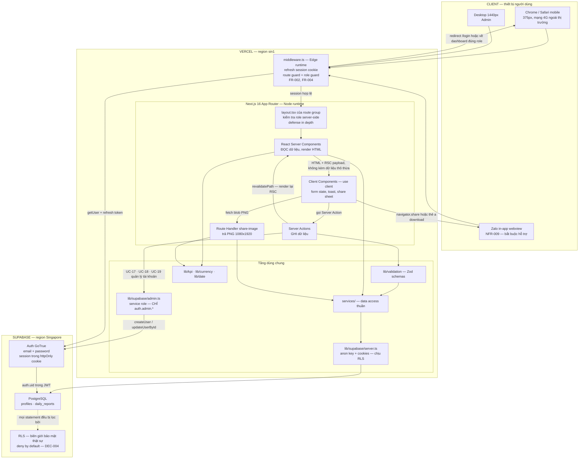
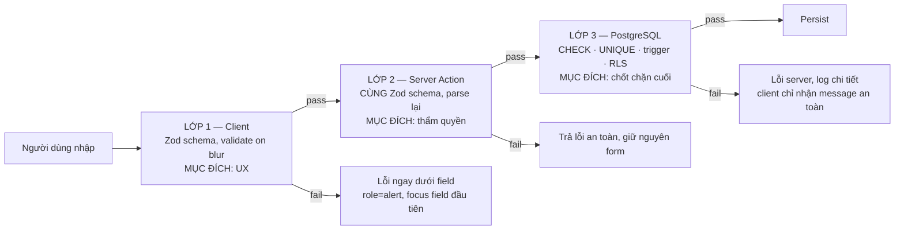
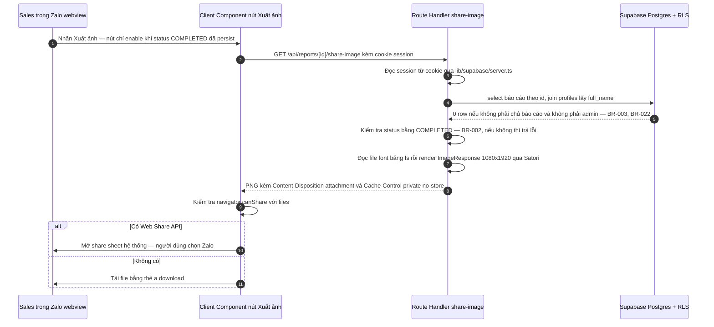
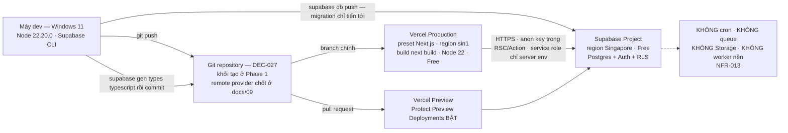

# 04 — Kiến trúc hệ thống (System Architecture)
> Status: DRAFT | Phase: 0 | Last updated: 2026-08-07
> Nguồn sự thật cấp trên: BIKEFORCE_MASTER_SPEC.md → docs/11-decisions.md → tài liệu này

---

## 0. Cách đọc tài liệu này

> **CẬP NHẬT 2026-08-07 — sau khi Phase 1 hoàn tất.** Đoạn mô tả trạng thái bên dưới được viết ở Phase 0 và **nay đã lỗi thời**; giữ lại để đối chiếu lịch sử. Trạng thái đúng ở thời điểm hiện tại:
>
> - Repository **đã có source code**: Next.js 16.3.0 App Router, `package.json` đã pin phiên bản, và **đã triển khai thật** các phần sau của tài liệu này — §5 cấu trúc thư mục, §4 ba Supabase client (`lib/supabase/{client,server,admin}.ts`), §8.1 khung `lib/kpi|currency|date` (mới có signature, thân hàm `throw`), §10.2 `.env.example`.
> - **Chưa triển khai:** §2 `middleware.ts`, §7 lớp validation Zod, §8.2 `services/`, §9 toàn bộ hệ thống sinh ảnh, §10.3 script grep bundle. Những phần đó vẫn là **hợp đồng cho code sắp viết**.
> - Kết quả kiểm chứng thật: `npm run build` exit 0 · `npm run typecheck` exit 0 · `npm run lint` exit 0. **Chưa có test nào** (unit/integration/E2E/RLS đều `N/A`).
> - **Phiên bản đã PIN** sau smoke test: `typescript@6.0.3` và `eslint@9.39.5` — **không phải** TS 7.0.2 / ESLint 10.8.0 như dự kiến ở Phase 0. Lý do đầy đủ ở `docs/11 § DEC-002 — KẾT LUẬN SMOKE TEST` (ISSUE-004 nay `CLOSED`).

**Trạng thái repository tại thời điểm viết (Phase 0 — đã lỗi thời, xem khối trên):** repository chỉ có `BIKEFORCE_MASTER_SPEC.md`, `PROMPT_FIRST_SESSION.md`, `PROMPT_NEXT_SESSION.md` và thư mục `docs/`. **Chưa có `package.json`, chưa có source code, chưa có migration, chưa phải git repository.** Do đó:

- Mọi đường dẫn file, tên hàm, tên module trong tài liệu này là **đề xuất, chưa triển khai**. Chúng là hợp đồng kiến trúc mà Phase 1–12 phải tuân theo, không phải mô tả code đang tồn tại.
- **Không có bất kỳ kết quả build / typecheck / lint / test nào để báo cáo.** Tất cả đều `N/A`.
- Phiên bản package nêu ở đây là "bản stable mới nhất đã kiểm chứng trên npm ngày 2026-08-07"; pin chính xác được chốt ở Phase 1 sau smoke test (DEC-002).

**Tài liệu này trả lời đúng 8 câu hỏi mà Master Spec §48 bắt buộc:** client/server boundaries · Supabase clients · data access · validation · business logic · image generation · deployment · secret handling. Mỗi mục có một section riêng bên dưới.

---

## 1. Nguyên tắc kiến trúc (5 nguyên tắc, mọi quyết định phải suy ra được từ đây)

| # | Nguyên tắc | Hệ quả cụ thể | Nguồn |
|---|---|---|---|
| A1 | **RLS là biên giới bảo mật thật sự.** Middleware, layout guard, kiểm tra trong Server Action chỉ là defense-in-depth và UX. | Nếu tắt hết code TypeScript kiểm tra quyền, hệ thống vẫn không được rò dữ liệu. Test RLS chạy bằng JWT thật, không qua UI. | DEC-004, BR-003, NFR-004, Spec §24 |
| A2 | **Đọc bằng Server Component, ghi bằng Server Action.** Không xây REST API riêng cho CRUD báo cáo. | Không có `/api/reports` CRUD. Route Handler duy nhất là `GET /api/reports/[id]/share-image` vì nó trả binary, không trả JSON. | DEC-003, Spec §2 "không over-engineer" |
| A3 | **Business logic tồn tại đúng một nơi.** | `lib/kpi.ts`, `lib/currency.ts`, `lib/date.ts` là nguồn duy nhất. Không component nào tự viết lại công thức `actual / target × 100`. | NFR-012, BR-011, BR-014, DEC-007, Spec §9 |
| A4 | **Derived thì không persist.** | Không có cột `achievement_percent` trong DB. Mọi `%`, mọi badge trạng thái, mọi tổng hợp toàn đội đều tính runtime. | BR-011, DEC-007, Spec §23 |
| A5 | **Chạy được trong Vercel Free + Supabase Free.** | Không cron, không queue, không Storage, không worker nền, không service thứ hai. | NFR-013, Spec §2 |

---

## 2. Runtime topology (Master Spec §48 — architecture diagram bắt buộc)



**Đọc sơ đồ trong một câu:** trình duyệt luôn đi qua `middleware.ts` ở Edge để làm mới cookie phiên và chặn route sai vai trò; sau đó Next.js chạy trên Node runtime, đọc dữ liệu bằng Server Component và ghi dữ liệu bằng Server Action, cả hai đều dùng `lib/supabase/server.ts` với anon key nên **mọi câu lệnh vẫn chịu RLS**; Client Component chỉ giữ trạng thái form, toast và mở share sheet; ảnh 9:16 do một Route Handler render server-side.

### 2.1 Vòng đời một request ghi (UC-06 — hoàn thành báo cáo cuối ngày)

1. Sales bấm **Lưu báo cáo** trong Client Component form (`features/report-evening/`).
2. Client parse dữ liệu bằng **cùng một Zod schema** để hiện lỗi inline (`inline-validation`, `error-placement`). Nếu fail → dừng, không gửi request.
3. Form submit → Server Action. Payload đi qua boundary phải serializable (số, chuỗi, `FormData`).
4. Server Action lấy session bằng `lib/supabase/server.ts` → nếu không có user → trả lỗi, **không** tiếp tục.
5. Server Action kiểm tra role + `is_active` (BR-009).
6. Server Action **parse lại** payload bằng chính Zod schema đó — đây là lần validate có thẩm quyền (NFR-006).
7. Server Action gọi `services/reports.ts` — service nhận supabase client, không tự tạo client.
8. Postgres áp `reports_update_own_open`: `sales_id = auth.uid() AND is_active_sales() AND status = 'MORNING_SUBMITTED'`. Không khớp → **0 row affected**, không phải lỗi 403 — service phải phân biệt và trả lỗi nghiệp vụ rõ ràng.
9. CHECK constraint `ck_completed_requires_actuals` và trigger `guard_report_transition()` chặn mọi chuyển trạng thái sai (BR-007, BR-008).
10. Thành công → Server Action gọi `revalidatePath('/sales/today')` và `revalidatePath('/sales/reports/[id]')`, sau đó `redirect()` sang trang đối chiếu.
11. RSC render lại với dữ liệu mới; `lib/kpi.ts` tính 4 dòng `%` tại thời điểm render (A4).
12. **Chỉ đến lúc này** nút "Xuất ảnh" mới enable, vì nó bind vào `status === 'COMPLETED'` của **dữ liệu đã persist**, không phải vào state form (BR-002, FR-017, Spec §12).

> Lỗi ở bước 4–9 phải: giữ nguyên dữ liệu form, không reset, hiện message an toàn cho người dùng, và ghi chi tiết vào log server (NFR-010, NFR-014).

---

## 3. Client / server boundaries (Master Spec §48 — mục 1)

Ranh giới được vẽ theo một câu hỏi duy nhất: **"Nếu người dùng sửa được thứ này thì hệ thống có sai không?"** Nếu có → chạy trên server.

| Mối quan tâm | Chạy ở đâu | Cơ chế cụ thể | Vì sao đúng ở đó | Ref |
|---|---|---|---|---|
| **Session refresh** | **Vercel Edge** — `middleware.ts` | `createServerClient` với cookie adapter của `@supabase/ssr`, gọi `supabase.auth.getUser()` và ghi cookie đã làm mới lên response | Cookie phải được set **trước** khi bất kỳ RSC nào chạy; middleware là điểm duy nhất trong vòng đời request nhìn thấy cả request và response. Edge runtime rẻ và gần người dùng. | FR-002, DEC-004 |
| **Data read** | **Server** — React Server Component | `lib/supabase/server.ts` → `services/*.ts` → Postgres dưới RLS | Không đẩy anon key + câu query xuống client, không waterfall request, không gửi cột thừa qua mạng, và không tăng bundle JS. Trực tiếp phục vụ LCP < 2.5s trên 4G. | NFR-001, NFR-002, A2 |
| **Data write** | **Server** — Server Action | `'use server'` + auth check + role check + Zod parse + service call + `revalidatePath` | Không cần dựng REST layer riêng; mọi lệnh ghi có một chỗ duy nhất để chèn kiểm tra bắt buộc. Client không bao giờ nắm quyền quyết định ghi. | DEC-003, NFR-006 |
| **Validation** | **Cả hai** — nhưng **quyền quyết định thuộc server** | Cùng một Zod schema import ở 2 phía; DB CHECK là chốt chặn cuối | Client validate để UX tốt; server validate để bảo vệ dữ liệu; DB validate để bảo vệ cả khi đường ghi không đi qua app. Xem §7. | Spec §25, NFR-006 |
| **KPI calc** | **Server là chính** | `lib/kpi.ts` gọi trong RSC và trong Route Handler render ảnh | Hàm thuần, không I/O, nên **được phép** import vào Client Component khi cần hiển thị lại tức thời — điều bị cấm là **viết lại công thức**, không phải chạy nó ở client. Một implementation duy nhất. | BR-004, BR-011, BR-014, NFR-012 |
| **Image render** | **Server** — Route Handler, **Node runtime** | `ImageResponse` / Satori đọc file font bằng `fs` | Node runtime bắt buộc vì cần `fs`. Chi tiết và lý do đầy đủ ở §9. | DEC-010, FR-018, NFR-003 |
| **Role guard** | **Ba lớp** | (1) `middleware.ts` — chặn sớm, tốt cho UX; (2) `layout.tsx` của route group — kiểm tra server-side, không bị bỏ qua bởi client navigation; (3) **RLS** — lớp duy nhất thực sự bảo vệ dữ liệu | Lớp 1 và 2 có thể sai/thiếu sót; lớp 3 thì không, vì nó nằm trong database. | FR-004, DEC-004, BR-003, BR-009 |
| **Form state, toast, share sheet, draft localStorage** | **Client** — `'use client'` | `useState` / `useActionState`, `navigator.share`, `localStorage` (đề xuất, chưa triển khai) | Đây là các API chỉ tồn tại trong trình duyệt. Không có logic nghiệp vụ nào ở đây. | FR-020, FR-035 |

### 3.1 Luật cứng của boundary

1. **Không** import `lib/supabase/server.ts`, `lib/supabase/admin.ts`, hay bất kỳ file nào trong `services/` vào file có `'use client'`. `lib/supabase/admin.ts` có `import 'server-only'` để bundler **fail lúc build**, không phải fail lúc chạy.
2. Mọi giá trị đi qua boundary phải serializable. Không truyền supabase client, không truyền hàm, không truyền `Date` chưa chuẩn hoá — ngày nghiệp vụ luôn là chuỗi `YYYY-MM-DD` (BR-005).
3. Client **không bao giờ** nhận nhiều dữ liệu hơn nó hiển thị. Server chỉ `select` các cột cần dùng, không `select *` (NFR-002).
4. Client **không bao giờ** là nguồn của `report_date`. Ngày nghiệp vụ do server tính bằng `getVietnamToday()` và DB xác nhận lại bằng `vn_today()` (BR-005, BR-021).

---

## 4. Ba Supabase client (Master Spec §48 — mục 2)

Ba client, ba mục đích, **không dùng lẫn**. Đây là ranh giới an ninh quan trọng thứ hai sau RLS.

| # | File (đề xuất) | Key dùng | Chạy ở đâu | Chịu RLS? | Được dùng cho | **Bị cấm** |
|---|---|---|---|---|---|---|
| 1 | `lib/supabase/client.ts` | `createBrowserClient`, `NEXT_PUBLIC_SUPABASE_ANON_KEY` | Trình duyệt, trong Client Component | **Có** | Thao tác auth phía client theo mô hình `@supabase/ssr` (đồng bộ trạng thái phiên sau khi session đổi); realtime — **không dùng ở v1** | Mọi truy vấn `daily_reports`; mọi truy vấn danh sách; mọi tính toán KPI; mọi thao tác quản trị |
| 2 | `lib/supabase/server.ts` | `createServerClient` + `cookies()`, `NEXT_PUBLIC_SUPABASE_ANON_KEY` | RSC, Server Action, Route Handler, `middleware.ts` | **Có** | **Đường dữ liệu chính của toàn hệ thống**: đọc trong RSC, ghi trong Server Action, đọc báo cáo trong route render ảnh, refresh session trong middleware | Import vào Client Component; dùng service role key; bỏ qua `cookies()` khiến mất ngữ cảnh user và RLS chạy như `anon` |
| 3 | `lib/supabase/admin.ts` | `SUPABASE_SERVICE_ROLE_KEY` + `import 'server-only'` | **Chỉ** trong Server Action của UC-17 / UC-18 / UC-19 | **KHÔNG — bypass toàn bộ RLS** | **Chỉ** `auth.admin.createUser` (FR-030) và `auth.admin.updateUserById` (đổi email, reset mật khẩu) | Xem chi tiết ngay dưới |

### 4.1 Nói thẳng về `lib/supabase/admin.ts`

**Client admin chỉ để gọi `auth.admin.*`. Nó KHÔNG BAO GIỜ chạm vào `daily_reports` — không đọc, không ghi, không đếm, không aggregate, không export, không render ảnh.** Không có ngoại lệ nào trong v1.

Lý do: service role key bypass hoàn toàn RLS. Mỗi lần nó chạm vào bảng nghiệp vụ là một lần A1 (RLS là biên giới thật) bị vô hiệu hoá, và mọi bug logic quyền lập tức trở thành lỗ rò dữ liệu toàn hệ thống. Đây là DEC-005.

Hệ quả cụ thể, phải tuân thủ khi implement:

- **UC-17 tạo tài khoản Sales:** `admin.auth.admin.createUser({ email, password, user_metadata })` → trigger `handle_new_user()` tự tạo row `profiles`. Client admin dừng ở đây.
- **UC-18 sửa hồ sơ Sales** (`full_name`, `phone`, `employee_code`): ghi vào `profiles` bằng **client số 2**, dưới policy `profiles_update_admin`. Chỉ khi phải đổi **email** trong `auth.users` mới dùng client admin (`updateUserById`), và phải giữ đồng bộ với `profiles.email` (BR-025).
- **UC-19 bật/tắt `is_active`:** ghi vào `profiles` bằng **client số 2** dưới `profiles_update_admin`. Không dùng client admin.
- **Toàn bộ Admin dashboard, danh sách báo cáo, analytics, bảng hiệu suất (FR-024 → FR-029, AF-01 → AF-07):** dùng **client số 2**. Admin đọc được toàn bộ báo cáo là vì policy `reports_select_own_or_admin` cho phép, **không** phải vì dùng service role.
- Code review phải fail nếu thấy `import ... from '@/lib/supabase/admin'` xuất hiện ngoài `features/admin-sales-management/`.

---

## 5. Cấu trúc thư mục & phân tầng (Master Spec §48 — mục 3, 5 · DEC-023)

```text
BikeForce/
├─ app/                              # Route, layout, page. Không business logic. Không truy cập DB trực tiếp.
│  ├─ (auth)/login/                  #   UC-01 — public; redirect nếu đã đăng nhập. DEC-017: /login, không /auth/login
│  ├─ (sales)/sales/                 #   UC-03..UC-11 — layout.tsx kiểm tra role SALES server-side
│  │  ├─ today/                      #     FR-007 — dashboard hôm nay, đúng 1 CTA chính theo trạng thái
│  │  ├─ today/morning/              #     FR-008..FR-012 — form đầu ngày
│  │  ├─ today/evening/              #     FR-013..FR-015 — form cuối ngày, hiện lại cam kết sáng
│  │  ├─ history/                    #     FR-021 — lịch sử, filter tháng, phân trang server-side
│  │  ├─ reports/[id]/               #     FR-022 — chi tiết + bảng đối chiếu + nút xuất ảnh
│  │  └─ account/                    #     FR-023 — hồ sơ, đổi mật khẩu, đăng xuất
│  ├─ (admin)/admin/                 #   UC-12..UC-21 — layout.tsx kiểm tra role ADMIN server-side
│  │  ├─ reports/  reports/[id]/     #     FR-025..FR-027 — list + filter + detail
│  │  ├─ analytics/                  #     FR-028 — analytics theo tháng
│  │  ├─ sales/  sales/new/  sales/[id]/  #  FR-029..FR-032 — quản lý + hiệu suất Sales
│  │  └─ account/                    #     FR-023
│  ├─ api/reports/[id]/share-image/  #   FR-018 — Route Handler duy nhất; Node runtime; BR-002, BR-022
│  ├─ layout.tsx · loading.tsx · error.tsx · not-found.tsx   # mỗi route group có đủ 4 file
│  └─ globals.css                    #   Tailwind v4 + CSS variables của design tokens
├─ components/ui/                    # Primitive KHÔNG biết nghiệp vụ: Button, Input, Card, Badge, Skeleton, Sheet…
├─ features/                         # Một nghiệp vụ = component + action + query của chính nó, đóng gói cùng chỗ
│  ├─ auth/                          #   UC-01, UC-02
│  ├─ report-morning/                #   UC-04, UC-05
│  ├─ report-evening/                #   UC-06
│  ├─ report-comparison/             #   UC-07 — bảng đối chiếu 4 chỉ tiêu, dùng chung view model với share card
│  ├─ report-share/                  #   UC-08 — DailyReportShareCard.tsx + nút chia sẻ
│  ├─ sales-history/                 #   UC-09, UC-10
│  ├─ admin-dashboard/               #   UC-12, UC-20 — AF-01, AF-02
│  ├─ admin-reports/                 #   UC-13, UC-14, UC-21 — AF-03, AF-04, AF-09
│  ├─ admin-analytics/               #   UC-15, UC-16 — AF-05, AF-06
│  └─ admin-sales-management/        #   UC-17..UC-19 — AF-07 — nơi DUY NHẤT được import lib/supabase/admin.ts
├─ lib/                              # Logic thuần + hạ tầng dùng chung. Không import từ app/ hay features/.
│  ├─ kpi.ts                         #   calculateAchievement, getAchievementStatus — BR-004, BR-014, BR-015, BR-023
│  ├─ currency.ts                    #   formatCurrencyVND, parseCurrencyInput — BR-010, DEC-008
│  ├─ date.ts                        #   getVietnamToday, formatVietnamDate, getVietnamMonthRange — BR-005, DEC-009
│  ├─ validation/                    #   Zod schemas, import được từ CẢ client lẫn server
│  ├─ supabase/client.ts · server.ts · admin.ts   # §4
│  └─ auth/                          #   helper lấy session + role ở server, dùng chung cho layout và Server Action
├─ services/                         # Data access thuần: nhận supabase client làm tham số, trả typed data
├─ types/                            # database.types.ts (supabase gen types) + domain types
├─ supabase/                         # migrations/*.sql + seed.sql (local only)
├─ e2e/                              # Playwright: mobile-375 · desktop-1440 · zalo-like
├─ public/fonts/                     # File .ttf/.woff Inter subset latin+vietnamese cho Satori (§9)
├─ docs/                             # Tài liệu Phase 0 — tài liệu này nằm ở đây
├─ middleware.ts                     # Edge — refresh session + route/role guard
├─ .env.example                      # CHỈ tên biến + placeholder (§10)
└─ .gitignore                        # .env*, .next, node_modules — DEC-027
```

### 5.1 Trách nhiệm một dòng cho mỗi tầng

| Thư mục | Trách nhiệm | Được import từ | **Không** được import |
|---|---|---|---|
| `app/` | Khai báo route, layout, boundary render, guard theo group. | `features/`, `components/`, `lib/` | — |
| `components/ui/` | Primitive không biết nghiệp vụ, chỉ nhận props. | `lib/` (chỉ util trình bày) | `services/`, `features/` |
| `features/<X>/` | Toàn bộ một nghiệp vụ: component, Server Action, query của nghiệp vụ đó. | `components/`, `lib/`, `services/` | `features/<Y>/` khác (dùng chung thì đẩy lên `lib/`) |
| `lib/` | Logic thuần (KPI, tiền, ngày), Zod schemas, supabase clients, auth helper. | Không import gì từ tầng trên | `app/`, `features/`, `services/` |
| `services/` | Truy cập dữ liệu thuần: nhận supabase client, trả typed data. Không quyết định quyền, không format. | `lib/`, `types/` | `app/`, `features/`, `components/` |
| `types/` | `database.types.ts` sinh bằng Supabase CLI + domain types. | — | tất cả |
| `supabase/` | Migration SQL + seed local. | — | tất cả |

### 5.2 Hai điều "không được" — bất di bất dịch

> **KHÔNG ĐƯỢC #1 — Business logic không được viết trong component.**
> Không component nào (server hay client) được tự tính `actual / target × 100`, tự quyết ngưỡng 80% / 100%, tự format `125.000.000 ₫`, tự suy ra "hôm nay là ngày nào ở Việt Nam", hay tự định nghĩa "ngày đạt KPI". Tất cả gọi `lib/kpi.ts`, `lib/currency.ts`, `lib/date.ts`. Vi phạm điều này là cách nhanh nhất để hai màn hình hiển thị hai con số khác nhau cho cùng một báo cáo — và thẻ ảnh gửi Zalo lệch với màn hình đối chiếu. (NFR-012, BR-011, BR-014)

> **KHÔNG ĐƯỢC #2 — Data access không được viết trong component.**
> Không component nào được gọi `supabase.from(...)` trực tiếp. Component gọi `services/*.ts`; service nhận supabase client làm tham số và trả về typed data. Lý do: (a) mọi truy vấn tập trung một chỗ để kiểm soát index, `select` cột cụ thể và phân trang (NFR-002); (b) service test được mà không cần dựng React; (c) không ai vô tình tạo supabase client mới bên trong render và làm mất ngữ cảnh cookie/RLS.

**Cách phát hiện vi phạm khi review:** tìm `supabase.from(` ngoài `services/`; tìm ký tự `%` hoặc phép chia trong file `.tsx`; tìm `toLocaleString` ngoài `lib/currency.ts`; tìm `new Date()` ngoài `lib/date.ts`.

---

## 6. Rendering strategy

Các nguyên tắc dưới đây lấy từ kết quả truy vấn `--stack nextjs "server component form action image data fetching bundle"` của skill **ui-ux-pro-max** (brief §1, lệnh số 9), kết hợp với hai rule `progressive-loading` và `submit-feedback` trong `references/quick-reference.md`. Chúng không phải sở thích cá nhân.

| Nguyên tắc | Áp dụng cụ thể trong BikeForce |
|---|---|
| **Server Components mặc định** | Mọi file trong `app/` và `features/` là RSC trừ khi có `'use client'` ở dòng đầu. Không dùng thư viện fetch phía client (không SWR, không React Query) — mọi lần đọc nằm trong RSC. Đây là đòn bẩy lớn nhất cho NFR-001 và NFR-003. |
| **`'use client'` chỉ cho form / toast / share** | Danh sách đầy đủ được phép: form đầu ngày và cuối ngày (state + inline validation + draft localStorage FR-035), toast/thông báo kết quả lưu, nút chia sẻ ảnh (`navigator.share` / `<a download>`), bottom nav cần biết route đang active, và biểu đồ trend FR-037 (SHOULD, sẽ `next/dynamic`). Ngoài danh sách này phải giải trình trong PR. |
| **Suspense + `loading.tsx` để stream** | Mỗi route group có `loading.tsx`. Trang `/admin` stream khối 12 chỉ số (FR-024) trước, danh sách cảnh báo Sales chưa báo cáo (FR-033) render sau trong `<Suspense>` riêng — người dùng thấy nội dung trong <300ms thay vì chờ query chậm nhất. Skeleton bắt buộc cho mọi khối > 300ms (`progressive-loading`). |
| **`revalidatePath` sau Server Action** | Sau khi lưu báo cáo sáng → `revalidatePath('/sales/today')`. Sau khi lưu báo cáo cuối ngày → `revalidatePath('/sales/today')` + path chi tiết báo cáo. Sau khi Admin tạo/sửa/khoá tài khoản → `revalidatePath('/admin/sales')`. Không có `revalidatePath` thì UI vẫn hiện dữ liệu cũ và người dùng bấm Lưu lần thứ hai. |
| **Pending state gắn với Server Action** | Nút submit dùng `useActionState` / `useFormStatus` để disable + spinner khi đang gửi (`loading-buttons`, `submit-feedback`) — *đề xuất, chưa triển khai*. |

**Ghi chú về caching:** mọi trang đều đọc `cookies()` để lấy phiên nên Next.js render động — không có trang nào của BikeForce được cache tĩnh dùng chung giữa các user. Đây là đặc tính mong muốn, không phải vấn đề hiệu năng: dữ liệu là riêng tư theo người dùng (BR-003). Route ảnh trả `Cache-Control: private, no-store`.

---

## 7. Validation — ba lớp (Master Spec §48 — mục 4 · Spec §25)



| Lớp | Chạy ở đâu | Bắt được gì | Vì sao **không thể bỏ** lớp này |
|---|---|---|---|
| **1 — Client** | Trình duyệt, Client Component | Số âm, chữ trong ô số, bỏ trống trường bắt buộc, vượt trần doanh thu, độ dài text | Bỏ đi thì Sales phải chờ round-trip mạng 4G mới biết gõ sai — vi phạm NFR-008 (≤60 giây, ≤6 chạm). Nhưng lớp này **không có giá trị bảo mật**: ai cũng gửi request thẳng tới Server Action được. |
| **2 — Server Action** | Vercel Node runtime | Toàn bộ lớp 1, **cộng** auth, role, `is_active`, quyền sở hữu báo cáo, ngày nghiệp vụ do server tự tính | Đây là lớp có thẩm quyền. NFR-006 yêu cầu **mọi** Server Action tự kiểm tra auth + role + Zod. Bỏ đi thì client trở thành nguồn sự thật. |
| **3 — PostgreSQL** | Supabase | `UNIQUE(sales_id, report_date)` (BR-001), `ck_report_not_future` (BR-016), `ck_completed_requires_actuals` (BR-007/BR-008), trần doanh thu (BR-017), độ dài ghi chú (BR-018), kiểu integer/bigint ≥ 0 (BR-006), trigger chặn quay lui trạng thái, RLS | Bảo vệ cả khi đường ghi **không đi qua app**: SQL editor, migration viết sai, script backfill, một client Supabase khác, hay bug trong chính lớp 2. Race condition tạo trùng báo cáo (hai tab bấm cùng lúc) **chỉ** bị chặn ở đây. |

**Cơ chế chống lệch:** lớp 1 và lớp 2 dùng **đúng một file schema** trong `lib/validation/` (ví dụ `morningReportSchema`, `eveningReportSchema` — đề xuất, chưa triển khai). Không có bản sao. Nếu đổi trần doanh thu, sửa một chỗ.

**Ràng buộc phải khớp giữa Zod và DB CHECK** (nguồn: brief §9):

| Trường | Zod | DB CHECK | BR |
|---|---|---|---|
| `planned_route` | `string().trim().min(1).max(300)` | length 1..300 | — |
| `visit_purpose` | `string().trim().max(300).optional()` | length ≤ 300 | OQ-01 |
| `target_visit_points` | `int().min(0).max(1000)` | 0..1000 | BR-006, OQ-01 |
| `target_sales_quantity` | `int().min(0).max(10000)` | 0..10000 | BR-006 |
| `target_revenue` | `int().min(0).max(100000000000)` | 0..100000000000 | BR-006, BR-017 |
| `target_customer_visits` | `int().min(0).max(1000)` | 0..1000 | BR-006 |
| `actual_route` | `string().trim().max(300).optional()` | length ≤ 300 | OQ-02 |
| `actual_*` | như bản `target_*` tương ứng | như bản `target_*` | BR-006 |
| `evening_note` | `string().trim().max(1000).optional()` | length ≤ 1000 | BR-018 |
| `report_date` | **không nhận từ client** — server tự tính | `<= vn_today()` | BR-005, BR-016, BR-021 |

Zod phải từ chối `NaN`, `Infinity`, chuỗi rác và số âm — có unit test riêng cho từng trường hợp (brief §16, Spec §25).

---

## 8. Business logic & data access (Master Spec §48 — mục 3, 5)

### 8.1 Business logic tập trung

Ba module, đúng các tên hàm Master Spec §9 yêu cầu:

```ts
// lib/kpi.ts — đề xuất, chưa triển khai
export type AchievementStatus = 'EXCEEDED' | 'NEAR' | 'MISSED' | 'PENDING';
export type AchievementResult = {
  percent: number | null;   // null CHỈ trong trường hợp target = 0 && actual > 0 (BR-015)
  status: AchievementStatus;
  display: string;          // chuỗi đã format sẵn: '80,0%' | '125,0%' | '—'
};
export function calculateAchievement(target: number, actual: number | null): AchievementResult;
export function getAchievementStatus(pct: number | null): AchievementStatus;
```

```ts
// lib/currency.ts
export function formatCurrencyVND(value: number): string;   // 125000000 → '125.000.000 ₫'
export function parseCurrencyInput(raw: string): number | null;

// lib/date.ts
export function getVietnamToday(): string;                  // 'YYYY-MM-DD' tại Asia/Ho_Chi_Minh
export function formatVietnamDate(date: string): string;    // 'Thứ Sáu, 07/08/2026'
export function getVietnamMonthRange(yyyyMM: string): { from: string; to: string };
```

Ràng buộc kiến trúc kèm theo:

- `calculateAchievement` **cho phép > 100%, không clamp** (BR-004) và **không bao giờ** trả `NaN`/`Infinity` (BR-015 — APPROVED: `target=0 & actual=0` → 100%; `target=0 & actual>0` → `percent = null` kèm số vượt tuyệt đối).
- `getVietnamToday()` dùng `Intl.DateTimeFormat('en-CA', { timeZone: 'Asia/Ho_Chi_Minh' })` — **không thêm dependency timezone** (DEC-009).
- `formatCurrencyVND` dùng `Intl.NumberFormat('vi-VN', { style: 'currency', currency: 'VND', maximumFractionDigits: 0 })`. DB **không bao giờ** lưu chuỗi đã format (BR-010, DEC-008).
- Ba module này là hàm thuần, không import supabase, không import React → unit test được trực tiếp, mục tiêu coverage `lib/**` ≥ 90%.

### 8.2 Data access

- **Chữ ký chuẩn:** `services/reports.ts` export các hàm nhận `supabase` client làm **tham số đầu tiên**, không tự tạo client. Nhờ đó cùng một service dùng được trong RSC, Server Action và Route Handler ảnh, và test được với client mang JWT của salesA / salesB / admin.
- **Kiểu dữ liệu:** sinh bằng `supabase gen types typescript --linked > types/database.types.ts`, commit vào repo, regenerate mỗi lần đổi schema.
- **Quy tắc truy vấn (NFR-002, Spec §35):** luôn liệt kê cột cụ thể, không `select *`; mọi danh sách phải `.range()` phân trang; filter và search chạy **server-side** (FR-026); join `profiles` trong cùng một truy vấn để lấy `full_name`, tránh N+1.
- **Index tương ứng** (chi tiết ở `docs/02-database-design.md`): `uq_daily_reports_sales_date` cho lookup "báo cáo hôm nay", `idx_daily_reports_date_status` cho Admin dashboard + alerts, `idx_daily_reports_sales_date_desc` cho lịch sử Sales, `idx_profiles_role_active` cho danh sách Sales active.
- **Aggregate của Admin** (FR-028, FR-029) tính bằng SQL, không kéo toàn bộ row về Node rồi cộng trong JavaScript — quy mô thiết kế là 50 Sales × 365 ngày ≈ 18k row/năm (NFR-015).
- **Service không quyết định quyền.** Service không kiểm tra role; nó chỉ chạy truy vấn dưới client được đưa vào và để RLS quyết định. Kiểm tra role nằm ở middleware / layout / Server Action (defense-in-depth) và ở RLS (thẩm quyền).

---

## 9. Image generation subsystem (Master Spec §48 — mục 6 · brief §11 · DEC-010)

### 9.1 Quyết định

**Chọn: sinh ảnh server-side bằng `ImageResponse` (`next/og`, engine Satori) tại `GET /api/reports/[id]/share-image`, chạy trên Node runtime.**

Đây là Route Handler **duy nhất** của hệ thống. Nó tồn tại vì nó trả **binary**, không trả JSON — nên không mâu thuẫn với DEC-003 ("không xây REST API riêng cho CRUD báo cáo").

### 9.2 Luồng đầy đủ



Tên file: `BikeForce_Report_<Ho-Ten>_<YYYY-MM-DD>.png` — ví dụ `BikeForce_Report_Nguyen-Van-A_2026-08-07.png` (FR-019). Phân phối theo DEC-011 và FR-020.

### 9.3 Vì sao server-side Satori thắng DOM capture **cho đúng sản phẩm này**

Đây không phải lựa chọn phổ quát — nó đúng vì 5 đặc điểm riêng của BikeForce:

1. **Zalo in-app webview là môi trường bắt buộc (NFR-009).** `html-to-image` / `html2canvas` dựa vào `foreignObject` + serialize DOM sang canvas — đây là chỗ vỡ kinh điển trên webview nhúng và Safari iOS. Người dùng thật của BikeForce mở app **từ trong Zalo**, nên đây là môi trường chính chứ không phải trường hợp biên.
2. **Tailwind v4 phát sinh màu `oklch()`.** Các thư viện capture DOM xử lý `oklch()` không ổn định; kết quả có thể là màu sai hoặc mất màu. Sinh ảnh server-side không đọc CSS của trang nên không dính vấn đề này.
3. **Chữ tiếng Việt phải chắc chắn đủ dấu.** Capture phía client yêu cầu web font đã load xong **trước** khi chụp; nếu chưa, chữ rơi về font fallback và mất dấu (ừ ẫ ợ ỹ đ). Nhúng thẳng file font ở server là **tất định**: cùng input luôn ra cùng pixel.
4. **Kích thước phải đúng 1080×1920, không phụ thuộc thiết bị.** Server render ra đúng khung cố định; capture DOM phụ thuộc devicePixelRatio, kích thước viewport và mức zoom của máy người dùng.
5. **Không thêm JS vào bundle client (NFR-003).** Thư viện capture nặng khoảng 50KB và nằm trên đường tải của người dùng đang dùng 4G ngoài thị trường. Server-side là **0 byte** phía client — client chỉ `fetch` một URL.

Cộng thêm hai điểm về bảo mật/chi phí: route đọc dữ liệu **dưới RLS** nên không thể xuất ảnh báo cáo của người khác kể cả khi đoán đúng `id` (BR-003, test IDOR ở brief §16); và ảnh được **stream trực tiếp, không lưu** — không dùng Supabase Storage (DEC-021), phù hợp NFR-013.

### 9.4 Ràng buộc của Satori — phải ghi lại vì nó ảnh hưởng cách viết component

- Satori chỉ hỗ trợ **một tập con CSS**: **flexbox có, CSS Grid không**. Mọi phần tử có nhiều hơn một con **phải** khai báo `display: flex` tường minh.
- Không có cascade CSS thật, không class Tailwind tự động — style viết inline trên từng element.
- Phải **nhúng file font** `.ttf`/`.woff` có **bộ dấu tiếng Việt đầy đủ** (Inter hoặc Be Vietnam Pro, subset `latin` + `vietnamese`), đặt trong repo tại `public/fonts/` và đọc bằng `fs` → **bắt buộc Node runtime**, không dùng Edge runtime cho route này.
- Trên Vercel phải khai báo `outputFileTracingIncludes` trong `next.config.ts` để file font được đóng gói cùng route handler — *đề xuất, chưa triển khai; xác nhận ở Phase 6*.
- Cắt text dài phải làm bằng cơ chế tương đương `-webkit-line-clamp` mà Satori hỗ trợ, không dựa vào hành vi overflow của trình duyệt.

### 9.5 Component và tính nhất quán số liệu

`features/report-share/DailyReportShareCard.tsx` — layout 1080×1920 nền tối `#0B1220`, gồm: brand BikeForce + "DAILY SALES REPORT", ngày, tên NV + mã NV, tuyến, bảng 4 dòng Cam kết / Thực đạt / %, dải KPI tổng quan, ghi chú cuối ngày, footer branding. Bảng token màu tối đã đo contrast nằm ở `docs/05-ui-ux-design.md`.

**Ràng buộc kiến trúc quan trọng:** thẻ ảnh và bảng đối chiếu trên màn hình dùng **chung một "view model"** — cùng một hàm nhận row `daily_reports` và trả ra cấu trúc đã tính sẵn qua `lib/kpi.ts`. Nếu tách đôi, số trên ảnh gửi Zalo sẽ có ngày lệch với số trên màn hình, và đó là loại bug không ai phát hiện cho tới khi có tranh cãi với Admin.

### 9.6 Fallback đã ghi nhận (không được đổi lén)

Nếu Phase 6 chứng minh Satori **không dựng nổi** layout cần thiết, phương án dự phòng là `html-to-image` (1.11.13, bản đã kiểm chứng trên npm ngày 2026-08-07) chạy client-side với: `next/dynamic({ ssr: false })` để không vào initial bundle (NFR-003), `await document.fonts.ready` trước khi chụp, và **một bảng màu hex thuần riêng cho thẻ share** (không `oklch`). Chuyển đổi này **phải** được ghi thành một DEC mới trong `docs/11-decisions.md`, không sửa lén DEC-010.

Rủi ro liên quan đã ghi nhận: **ISSUE-002** (P2 — Satori giới hạn CSS + cần font có dấu; mitigation: dựng prototype thẻ ngay đầu Phase 6) và **ISSUE-003** (P2 — Zalo webview chưa kiểm chứng thực tế Web Share API và download attachment; mitigation: test tay trên thiết bị thật ở Phase 6).

**Edge case bắt buộc test khi dựng thẻ:** tên 40+ ký tự, tuyến 300 ký tự, ghi chú 1000 ký tự, doanh thu 12 chữ số, achievement 4 chữ số (`1250,0%`), `—` khi `target = 0`, và bộ dấu tiếng Việt đầy đủ.

---

## 10. Secret handling (Master Spec §48 — mục 8 · Spec §6, §34)

### 10.1 Bảng biến môi trường

| Tên biến | Sống ở đâu | Public? | Ai dùng |
|---|---|---|---|
| `NEXT_PUBLIC_SUPABASE_URL` | Vercel env (Production + Preview + Development), `.env.local` khi dev, tên biến trong `.env.example` | **Có** — được nhúng vào client bundle theo thiết kế | `lib/supabase/client.ts`, `lib/supabase/server.ts`, `lib/supabase/admin.ts` |
| `NEXT_PUBLIC_SUPABASE_ANON_KEY` | như trên | **Có** — public-safe **vì** RLS bật deny-by-default trên mọi bảng | `lib/supabase/client.ts`, `lib/supabase/server.ts`, `middleware.ts` |
| `SUPABASE_SERVICE_ROLE_KEY` | **Chỉ** Vercel env server-side + `.env.local` của máy dev | **KHÔNG** — không bao giờ có prefix `NEXT_PUBLIC_` | **Chỉ** `lib/supabase/admin.ts` (§4.1) |
| `NEXT_PUBLIC_SITE_URL` | như hai biến public ở trên | **Có** | URL tuyệt đối khi cần (redirect auth, absolute URL trong Route Handler) |

**Anon key là public-safe là một tuyên bố có điều kiện:** nó chỉ đúng **vì** A1 — RLS bật, `force row level security`, deny-by-default, không cấp policy nào cho `anon`. Nếu ai đó tắt RLS trên một bảng, anon key lập tức trở thành lỗ hổng. Đây là lý do NFR-004 có bộ test RLS riêng.

### 10.2 Chính sách `.env.example` và `.gitignore`

`.env.example` **chỉ chứa tên biến + placeholder**, commit vào repo, không bao giờ chứa giá trị thật (Spec §38):

```bash
# .env.example — đề xuất, chưa triển khai. CHỈ placeholder, KHÔNG giá trị thật.
NEXT_PUBLIC_SUPABASE_URL=https://<your-project-ref>.supabase.co
NEXT_PUBLIC_SUPABASE_ANON_KEY=<anon-key-placeholder>
SUPABASE_SERVICE_ROLE_KEY=<service-role-key-placeholder-SERVER-ONLY>
NEXT_PUBLIC_SITE_URL=http://localhost:3000
```

`.gitignore` (đã tạo ở Phase 0 cùng `git init` — DEC-027, DEC-028) chặn `.env*` và mở ngoại lệ cho `.env.example`:

```gitignore
.env*
!.env.example
.next/
node_modules/
```

Quy tắc kèm theo: **không viết secret thật vào bất kỳ file `docs/` nào**, kể cả dạng ví dụ hay dạng che một phần (Spec §6).

### 10.3 Ba lớp chặn rò service role key (NFR-005)

1. **Compile time** — `lib/supabase/admin.ts` mở đầu bằng `import 'server-only'`. Nếu bất kỳ đường import nào kéo nó vào graph của Client Component, **build fail**, không phải chạy mới biết.
2. **Naming** — biến không có prefix `NEXT_PUBLIC_` thì Next.js **không** đưa vào client bundle. Đây là hàng rào mặc định, nhưng không được coi là đủ.
3. **CI — grep bundle** (NFR-005: "grep bundle trong CI"). Bước chạy sau `next build`, fail pipeline nếu phát hiện dấu vết:

```bash
# scripts/check-no-secret-in-bundle.sh — đề xuất, chưa triển khai. CHƯA chạy lần nào.
set -euo pipefail

if [ -z "${SUPABASE_SERVICE_ROLE_KEY:-}" ]; then
  echo "FAIL: SUPABASE_SERVICE_ROLE_KEY chưa được set trong môi trường CI"; exit 1
fi

if grep -rlF -- "$SUPABASE_SERVICE_ROLE_KEY" .next/static .next/server/app 2>/dev/null; then
  echo "FAIL: giá trị service role key xuất hiện trong bundle"; exit 1
fi

if grep -rl -- "service_role" .next/static 2>/dev/null; then
  echo "FAIL: chuỗi 'service_role' xuất hiện trong client bundle"; exit 1
fi

if grep -rl -- "NEXT_PUBLIC_SUPABASE_SERVICE" .next 2>/dev/null; then
  echo "FAIL: có biến service role bị gắn prefix NEXT_PUBLIC_"; exit 1
fi

echo "Kiểm tra hoàn tất."
```

> **Trạng thái:** script này chưa tồn tại và chưa chạy lần nào. Nó là yêu cầu bắt buộc của Phase 11 (Testing & Security), không phải kết quả đã đạt.

Bổ sung ở tầng vận hành: bật **Protect Preview Deployments** trên Vercel (app nội bộ, không để preview public); service role key chỉ set ở scope server-side; xoay key ngay nếu nghi ngờ lộ.

---

## 11. Deployment topology (Master Spec §48 — mục 7)



### 11.1 Vercel

- Framework preset **Next.js**, build `next build`, Node **22**, region **`sin1`** (Singapore).
- Env vars đặt cho cả **Production / Preview / Development**; `SUPABASE_SERVICE_ROLE_KEY` **chỉ** đánh dấu server-side.
- Bật **Protect Preview Deployments** — đây là app nội bộ, preview không được public.

### 11.2 Supabase

- Project region **Singapore** (gần Việt Nam nhất). Bật provider email/password, **tắt** "Enable email signups" (BR-012, FR-006), tắt email confirmation cho tài khoản do Admin tạo, JWT expiry để mặc định.
- Migration bằng Supabase CLI, **không sửa schema bằng tay trên dashboard**: `supabase/migrations/0001_init_enums_profiles.sql`, `0002_daily_reports.sql`, `0003_functions_triggers.sql`, `0004_rls_policies.sql`, `0005_indexes.sql`, và `supabase/seed.sql` (**local only**, không seed production).
- Types: `supabase gen types typescript --linked > types/database.types.ts`, commit và regenerate mỗi lần đổi schema.
- Admin đầu tiên: tạo user bằng Supabase Dashboard rồi `update profiles set role='ADMIN'` bằng SQL editor **một lần duy nhất** — ghi thành runbook trong `docs/09-deployment.md`, **không** code UI cho việc này.
- Rollback: migration **chỉ tiến tới**; muốn lùi phải viết migration mới.

### 11.3 Vì sao `sin1` + Singapore

Vercel `sin1` và Supabase Singapore nằm cùng khu vực nên round-trip giữa Server Action / RSC và Postgres ở mức thấp nhất có thể trong ràng buộc Free plan. Vì mọi lần đọc đều xảy ra **trên server** (§6), độ trễ này nằm thẳng trong đường tới LCP của người dùng — đặt hai thành phần lệch khu vực sẽ trực tiếp phá NFR-001.

### 11.4 Vì sao **không** cron, **không** queue, **không** Storage (NFR-013)

| Thành phần | Vì sao không cần trong v1 | Điều gì sẽ khiến ta xét lại |
|---|---|---|
| **Cron / scheduled job** | Cảnh báo "Sales chưa báo cáo" (FR-033, AF-02) là **hai truy vấn lọc tính lúc đọc** trên dữ liệu đã có, không cần job nền tính trước. Không có báo cáo định kỳ nào phải tự chạy. | AF-13 — nhắc nhở tự động qua Zalo/email. Đã xếp LATER **chính vì** nó cần cron và vượt hạn mức Vercel Free. |
| **Queue / message broker** | Mọi thao tác ghi là **một row, đồng bộ, trong một request**. Không có tác vụ dài, không có xử lý theo lô, không có tích hợp bên thứ ba cần retry bất đồng bộ. Render ảnh cũng đồng bộ trong một request. | Tích hợp ngoài có SLA không ổn định, hoặc export dữ liệu lớn cần chạy nền. |
| **Supabase Storage** | Ảnh 9:16 được **stream trực tiếp, không lưu** (DEC-021). Không lưu nghĩa là: không tốn dung lượng, không cần chính sách lifecycle/dọn rác, không sinh URL công khai có thể bị đoán, và không có bản sao dữ liệu nằm ngoài phạm vi RLS. | Nhu cầu xem lại đúng file ảnh đã gửi cho mục đích đối chiếu — sẽ kéo theo cả bài toán quyền truy cập và vòng đời file. |
| **Event bus / worker riêng** | Toàn hệ thống có 2 bảng và 21 use case CRUD-hoá. Thêm một tiến trình nữa là thêm một thứ phải deploy, giám sát và trả tiền, đổi lại không giải quyết vấn đề nào đang có. | Không có trong tầm nhìn v1. |

---

## 12. Non-goals — những thứ **cố ý không xây** (Master Spec §2)

Master Spec §2 nói thẳng: "Không over-engineer" và liệt kê những thứ **không tự xây**. Ghi lại ở đây để không ai âm thầm thêm vào sau này.

| Không xây | Vì sao | Thay bằng gì trong BikeForce |
|---|---|---|
| **Microservices** | Hệ thống có 2 bảng, 2 role, ~21 use case. Tách service chỉ tạo ranh giới mạng cần vận hành mà không đổi lại được gì. | Một ứng dụng Next.js duy nhất |
| **Queue** | Không có tác vụ dài hay bất đồng bộ nào. | Server Action đồng bộ (§11.4) |
| **Event bus** | Không có nhiều consumer, không có nhu cầu tách rời theo sự kiện. | Gọi hàm trực tiếp + `revalidatePath` |
| **Kubernetes** | Vercel Free đã cung cấp build, deploy, TLS, CDN và scale-to-zero. | Vercel + Supabase managed |
| **Tầng REST API riêng cho CRUD** | Mỗi endpoint CRUD là thêm một chỗ phải tự kiểm tra auth, role và validate — tức thêm bề mặt tấn công, không thêm giá trị. **DEC-003.** | RSC để đọc, Server Action để ghi. **Ngoại lệ duy nhất**: `GET /api/reports/[id]/share-image` — tồn tại vì trả binary, không trả JSON (§9.1) |
| **Kiến trúc enterprise không cần thiết** | CQRS, event sourcing, repository pattern nhiều lớp, DI container — chi phí bảo trì thật, lợi ích bằng 0 ở quy mô 18k row/năm (NFR-015). | Phân tầng 6 thư mục ở §5 |
| **Dark mode toàn app** | DEC-016 — v1 chỉ light, trừ thẻ share vốn dark cố định. Ghi rõ để không thành nợ kỹ thuật ngầm. | — |
| **Service worker / offline sync** | DEC-024 — PWA chỉ manifest + Add to Home Screen. | Draft localStorage (FR-035) |

---

## 13. Truy vết kiến trúc → yêu cầu

| Quyết định kiến trúc | Phục vụ |
|---|---|
| Middleware Edge refresh session + guard | FR-002, FR-004, FR-005, BR-009 |
| RSC đọc / Server Action ghi, không REST CRUD | DEC-003, NFR-001, NFR-006, Spec §2 |
| RLS deny-by-default là biên giới thật | DEC-004, BR-003, BR-019, BR-020, BR-021, NFR-004 |
| Ba Supabase client tách bạch, admin chỉ `auth.admin.*` | DEC-005, NFR-005, Spec §34 |
| `lib/kpi` · `lib/currency` · `lib/date` là nguồn duy nhất | BR-004, BR-010, BR-011, BR-014, BR-015, BR-023, BR-024, NFR-012, DEC-007, DEC-008, DEC-009 |
| Validation 3 lớp, Zod dùng chung | BR-001, BR-006, BR-007, BR-008, BR-016, BR-017, BR-018, NFR-006, Spec §25 |
| Ảnh 9:16 server-side Satori, stream không lưu | FR-017, FR-018, FR-019, FR-020, BR-002, BR-022, NFR-003, NFR-009, DEC-010, DEC-011, DEC-021 |
| `select` cột cụ thể, phân trang, filter server-side, index theo truy vấn | FR-026, NFR-002, NFR-015, Spec §35 |
| Không cron / queue / Storage; sin1 + Singapore | NFR-001, NFR-013 |
| Cấu trúc 6 tầng + 2 điều "không được" | NFR-012, DEC-023, Spec §36 |
| Server Components mặc định, `'use client'` giới hạn, Suspense + `loading.tsx` | NFR-001, NFR-003, quy tắc `progressive-loading` / `submit-feedback` của ui-ux-pro-max |

---

## OPEN QUESTIONS

> Danh sách đầy đủ 17 câu hỏi nằm ở `docs/01-business-analysis.md §OPEN QUESTIONS`. Dưới đây chỉ là các câu ảnh hưởng trực tiếp tới **kiến trúc**.

✅ **Toàn bộ 17 OPEN QUESTION đã được trả lời ngày 2026-08-07 — không câu nào làm thay đổi topology ở §2.** Riêng OQ-09 (câu duy nhất có thể đảo kiến trúc) đã được trả lời là **"Sales tự cam kết"**, nên **không** cần bảng `targets` và không cần đường ghi mới cho Admin. Ghi chú phân tích cũ giữ lại làm ngữ cảnh: tám trong chín câu BLOCKING chỉ đổi cột DB, CHECK constraint, RLS policy hoặc nội dung `lib/kpi.ts` — tức đổi **bên trong** các hộp đã vẽ, không đổi các hộp hay các mũi tên. **Ngoại lệ duy nhất là OQ-09.**

| ID | Câu hỏi rút gọn | Mức | Đề xuất mặc định | Ảnh hưởng lên kiến trúc |
|---|---|---|---|---|
| **OQ-09** | KPI là **Sales tự cam kết sáng** hay **Admin giao chỉ tiêu trước**? | ✅ **ĐÃ TRẢ LỜI** | Sales tự cam kết (đúng Master Spec §7) | **Câu duy nhất đổi kiến trúc.** Nếu Admin giao chỉ tiêu: thêm bảng `targets` (đề xuất) + bộ RLS policy mới cho bảng đó; thêm **một đường ghi mới** — Server Action của Admin trong `features/admin-sales-management/` hoặc một feature `admin-targets/` mới; form đầu ngày của Sales chuyển từ *nhập mục tiêu* sang *đọc mục tiêu đã giao và xác nhận*, tức RSC phải đọc thêm một nguồn; `lib/kpi.ts` phải biết lấy `target` từ đâu; thẻ ảnh 9:16 phải đổi nhãn. Tương ứng AF-11 (Complexity High, không MVP). |
| OQ-04 | Sales hoàn tất báo cáo rồi có được sửa không? | ✅ **ĐÃ TRẢ LỜI** | (a) Khoá ngay khi `COMPLETED` | Chỉ đổi `reports_update_own_open` USING clause + trigger `guard_report_transition()`. Nếu cho sửa sau `COMPLETED` thì **cần audit log (AF-12)** → thêm bảng + ghi log trong Server Action; vẫn không đổi topology. Liên quan ISSUE-007. |
| OQ-05 | Admin có được sửa báo cáo của Sales không? | ✅ **ĐÃ TRẢ LỜI** | Không trong v1 | Nếu có: thêm UPDATE policy cho admin trên `daily_reports` + một Server Action mới trong `features/admin-reports/` + bắt buộc audit log. **Vẫn không được dùng service role key cho việc này** (DEC-005 không đổi). |
| OQ-11 | Khi `target = 0` thì `%` hiển thị thế nào? | ✅ **ĐÃ TRẢ LỜI** | `actual=0` → 100%; `actual>0` → `—` + "Vượt kế hoạch" | Chỉ đổi `lib/kpi.ts` và kiểu `AchievementResult`. Vì A3 nên sửa một nơi là mọi màn hình + thẻ ảnh + aggregate Admin đều theo. Đây chính là giá trị của việc tập trung logic. |
| OQ-12 | Nhập trễ / nhập bù / cut-off? | ✅ **ĐÃ TRẢ LỜI** | Chỉ đúng ngày hôm nay theo giờ VN, không nhập bù | Chỉ đổi `reports_insert_own_today` WITH CHECK, `ck_report_not_future` và cách server tính `report_date`. Không đổi tầng nào. |
| OQ-13 | Có xoá báo cáo không? Soft hay hard delete? | ✅ **ĐÃ TRẢ LỜI** | v1 không xoá | Nếu soft delete: thêm cột `deleted_at` + **mọi truy vấn trong `services/` phải lọc** + policy DELETE/UPDATE mới. Tác động rộng trong `services/` nhưng không đổi topology. |
| OQ-01 / OQ-02 | "Viếng thăm" là số điểm hay văn bản? | ✅ **ĐÃ TRẢ LỜI** | Cả hai: `target_visit_points` + `visit_purpose`; `actual_visit_points` + `actual_route` | Chỉ đổi cột DB, Zod schema, form và layout thẻ 9:16. |
| OQ-08 | Có khái niệm ngày nghỉ / nghỉ phép không? | ✅ **ĐÃ TRẢ LỜI** | v1 không có | Nếu có: thêm bảng/cột + đổi truy vấn cảnh báo AF-02. Liên quan ISSUE-006 (báo động giả cho người nghỉ phép). |
| OQ-07 | Tuyến nhập tự do hay danh mục cấu hình sẵn? | ✅ **ĐÃ TRẢ LỜI** | v1 nhập tự do + gợi ý 5 tuyến gần nhất | Nếu cần thống kê theo tuyến: thêm bảng `routes` (AF-14) + một service + màn hình Admin. Thêm chiều rộng, không thêm tầng. |

**Rủi ro kiến trúc đã ghi nhận, theo dõi ở `docs/12-known-issues.md`:** ISSUE-001 **đã CLOSED** (17/17 OQ đã trả lời). Ngữ cảnh cũ: ISSUE-001 (P1 — 9 câu BLOCKING chưa có đáp án nên chưa viết được migration Phase 2), ISSUE-002 (P2 — giới hạn Satori), ISSUE-003 (P2 — Zalo webview chưa kiểm chứng), ISSUE-004 (P2 — TypeScript 7 / ESLint 10 là major mới, có thể phải lùi phiên bản), ISSUE-005 (P3 — `is_admin()` thêm một truy vấn `profiles` mỗi statement; mitigation `(select public.is_admin())` để Postgres nâng thành InitPlan, nếu vẫn chậm thì chuyển role vào custom JWT claim), ISSUE-007 (P3 — chưa có audit log).
