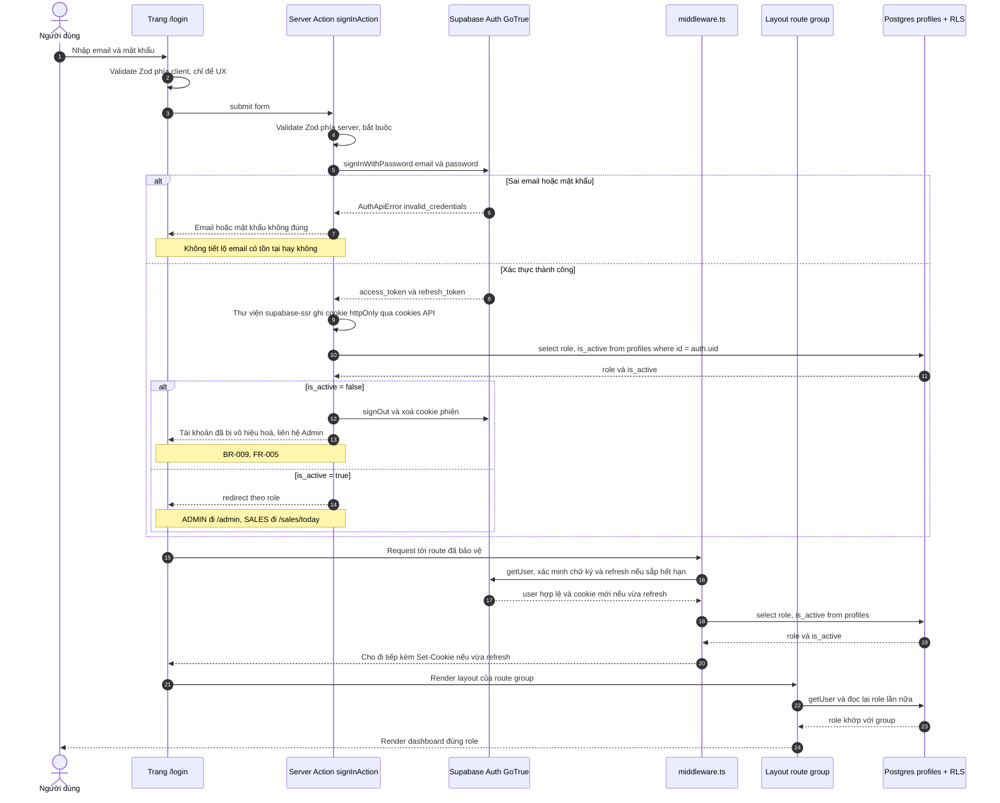
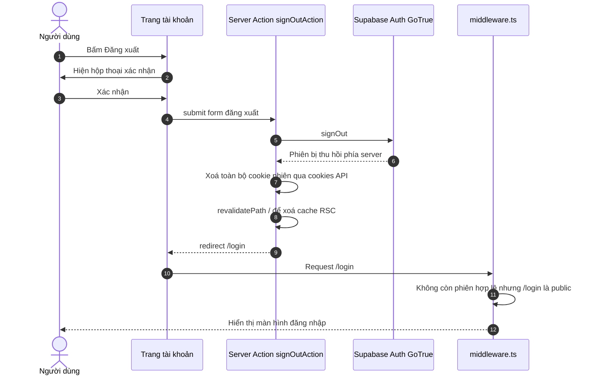
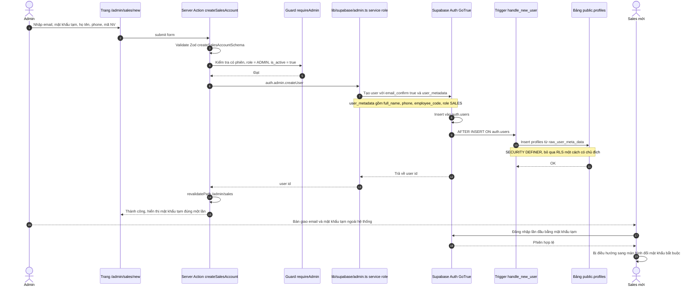
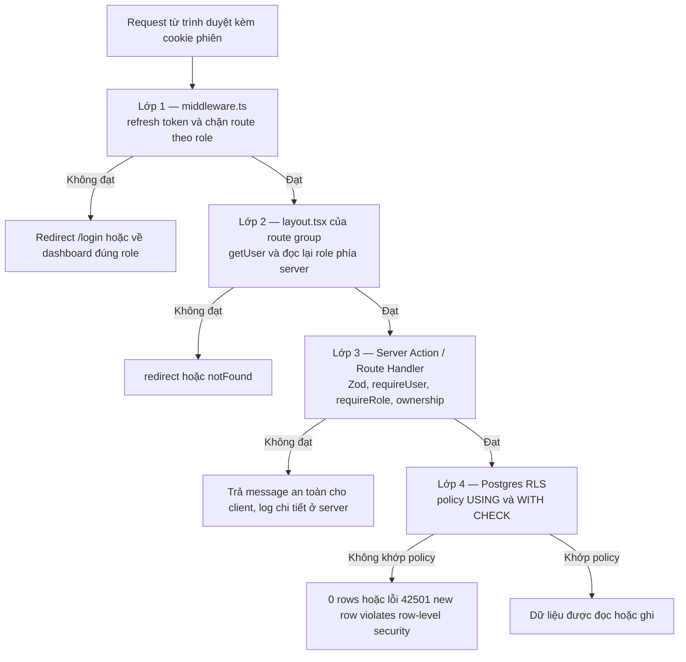
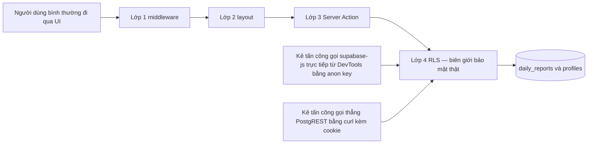
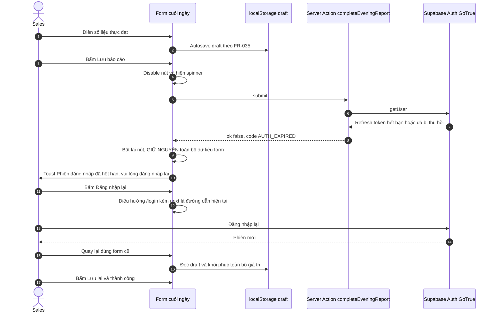

# 06 — Xác thực & Phân quyền (Auth & Permissions)
> Status: DRAFT | Phase: 0 | Last updated: 2026-08-07
> Nguồn sự thật cấp trên: BIKEFORCE_MASTER_SPEC.md → docs/11-decisions.md → tài liệu này

---

## 0. Phạm vi tài liệu

Tài liệu này trả lời đúng 6 yêu cầu của Master Spec §50: **permission matrix**, **auth flow**, **route protection**, **server protection**, **RLS**, **inactive account**, **session expiration** — cộng thêm mô hình 4 lớp phòng thủ, danh sách kịch bản tấn công IDOR và cách kiểm thử.

**Trạng thái thực tế:** repository hiện chỉ có 3 file markdown. **Chưa có bất kỳ dòng code nào, chưa có Supabase project, chưa có migration.** Mọi tên file, tên hàm, tên policy trong tài liệu này là **đề xuất, chưa triển khai** — sẽ được hiện thực hoá ở Phase 1 (foundation) và Phase 2 (Database & Auth). Không có build/typecheck/lint/test nào đã chạy.

Liên quan trực tiếp:
- FR-001, FR-002, FR-003, FR-004, FR-005, FR-006, FR-023, FR-030, FR-031, FR-032
- BR-003, BR-009, BR-012, BR-013, BR-019, BR-020, BR-021, BR-022, BR-025
- NFR-004, NFR-005, NFR-006, NFR-010, NFR-014
- UC-01, UC-02, UC-11, UC-17, UC-18, UC-19
- DEC-004, DEC-005, DEC-006
- OQ-04, OQ-05, OQ-13, OQ-16 — xem §12

---

## 1. Nguyên tắc nền tảng (đọc trước khi code)

> **Master Spec §5:** *"Không coi việc ẩn nút/menu phía frontend là security."*
> **DEC-004:** *"RLS là biên giới bảo mật thật; middleware/layout chỉ là defense-in-depth và UX."*

1. **Ẩn nút KHÔNG phải là bảo mật.** Nếu một hành động chỉ bị chặn bằng cách không render nút, coi như hành động đó **không được bảo vệ**.
2. **Mọi quyền phải quy được về một policy RLS hoặc một guard server-side có thể chỉ tên.** Nếu không chỉ được, quyền đó chưa được thiết kế xong.
3. **Deny by default.** Bảng bật `enable row level security` **và** `force row level security`; không có policy nào ⇒ không ai làm gì được (NFR-004).
4. **Server không tin client.** Mọi Server Action tự kiểm tra `auth` + `role` + `ownership` + validate Zod, kể cả khi middleware đã chặn (NFR-006).
5. **`sales_id` không bao giờ lấy từ payload của client** — luôn lấy từ `auth.uid()` phía server.
6. **Service role key không bao giờ chạm tới client** (NFR-005, DEC-005) — xem §11.
7. **Lỗi trả về client phải là message an toàn**, chi tiết kỹ thuật chỉ ghi log server (NFR-014).

---

## 2. Actor, role và định danh

| Actor | Role trong DB | Nguồn định danh | Ghi chú |
|---|---|---|---|
| Sales | `user_role = 'SALES'` | `auth.users.id` → `profiles.id` | Người dùng chính, dùng điện thoại ngoài thị trường |
| Admin | `user_role = 'ADMIN'` | `auth.users.id` → `profiles.id` | Quản lý kinh doanh, quản lý tài khoản |
| Supabase Auth (GoTrue) | — | — | Identity provider: session, JWT, password |
| Supabase Postgres + RLS | — | — | **Biên giới bảo mật thật sự** |

- Enum: `create type public.user_role as enum ('ADMIN','SALES');`
- **Không có role thứ ba trong v1** (OQ-16 — non-blocking, đề xuất mặc định: không).
- **Không có self-registration** (BR-012, FR-006). "Enable email signups" phải **tắt** trong Supabase Auth settings.
- Quan hệ 1-1 bắt buộc: mỗi `auth.users` row phải có đúng một `profiles` row, tạo bởi trigger `handle_new_user()`.
- `profiles.email` phải khớp `auth.users.email` và unique toàn hệ thống (BR-025).

**Admin đầu tiên** (bootstrap, không có UI — theo brief §17): tạo user bằng Supabase Dashboard, sau đó chạy đúng một lần trong SQL Editor: `update public.profiles set role = 'ADMIN' where email = '<admin-email-placeholder>';`. Ghi thành runbook trong `docs/09-deployment.md`, **không** code màn hình cho việc này.

---

## 3. Auth flow

### 3.1 Đăng nhập — UC-01, FR-001, FR-002, FR-004, FR-005



**Các điểm bắt buộc trong triển khai:**

| # | Quy tắc | Lý do |
|---|---|---|
| 1 | Cookie phiên do `@supabase/ssr` quản lý, **httpOnly + Secure + SameSite=Lax**, không đọc được bằng JavaScript | Chống XSS lấy token |
| 2 | Ở server luôn dùng `supabase.auth.getUser()`, **không dùng** `getSession()` | `getSession()` chỉ đọc cookie, **không xác minh chữ ký** — có thể bị giả mạo |
| 3 | Thông báo lỗi đăng nhập là **một câu duy nhất** cho cả sai email lẫn sai mật khẩu | Chống user enumeration |
| 4 | `/login` là public nhưng nếu đã có phiên hợp lệ thì redirect ngay theo role | Brief §12 |
| 5 | Sau khi đăng nhập, redirect về `next` param nếu có và nếu là **đường dẫn nội bộ bắt đầu bằng `/`** | Chống open redirect |
| 6 | Cookie phiên **có thể bị chunk** thành nhiều mảnh khi vượt giới hạn ~4096 byte của trình duyệt; thư viện tự xử lý — không tự viết logic cookie | Tránh mất phiên trên Zalo webview (NFR-009) |

### 3.2 Đăng xuất — UC-02, FR-003



**Bắt buộc:** `signOut()` phải chạy trong Server Action (không phải client-only) để cookie httpOnly thực sự bị xoá ở phía server; kèm `revalidatePath('/')` để không còn RSC cache chứa dữ liệu của người vừa đăng xuất. Có `confirmation-dialogs` theo quy tắc UX ở `docs/05-ui-ux-design.md`.

### 3.3 Tạo tài khoản Sales — UC-17, FR-030, BR-012



**Ghi chú bắt buộc:**

1. **Self-signup bị tắt ở tầng cấu hình Supabase** (BR-012, FR-006): trong Auth settings phải **tắt "Enable email signups"**. Đây là cấu hình dashboard, không phải code — phải ghi vào checklist `docs/09-deployment.md`. Chỉ tắt UI đăng ký ở frontend là **không đủ**, vì endpoint `/auth/v1/signup` vẫn mở với anon key.
2. **Không cấp INSERT policy trên `profiles` cho role `authenticated`.** Dòng `profiles` chỉ sinh ra bởi trigger `handle_new_user()` chạy `SECURITY DEFINER`. Đây là lý do bảng vẫn an toàn dù không có INSERT policy nào.
3. **`auth.admin.createUser` là con đường duy nhất dùng service role key**, chạy trong `lib/supabase/admin.ts` có `import 'server-only'` (DEC-005). Client admin **không bao giờ** được dùng để đọc/ghi `daily_reports`.
4. **`email_confirm: true`** để tài khoản do Admin tạo không cần bấm link xác nhận email (brief §17 — tắt email confirmation cho tài khoản do Admin tạo).
5. **Mật khẩu tạm hiển thị đúng một lần** trên màn hình sau khi tạo, không lưu lại, không gửi email, không ghi log. Admin bàn giao ngoài hệ thống.
6. **Buộc đổi mật khẩu ở lần đăng nhập đầu — ĐỀ XUẤT, CHƯA TRIỂN KHAI.** Schema ở `docs/02-database-design.md` hiện **không có** cột đánh dấu trạng thái này. Hai phương án khả dĩ: (a) cờ trong `auth.users.user_metadata` do Server Action tự quản lý; (b) thêm một cột boolean vào `profiles`. **Chưa chốt** — phải quyết trước khi viết migration Phase 2 và ghi thành một DEC mới trong `docs/11-decisions.md`. Liên quan ISSUE-001. Không được tự ý thêm cột khi viết migration mà không có DEC.

---

## 4. Permission matrix

Ký hiệu: **Có** = được phép · **Không** = bị từ chối · **Có\*** = được phép nhưng có điều kiện, xem cột ghi chú · **N/A** = không áp dụng cho role đó trong v1.

Cột **"Chặn ở đâu (thật sự)"** phải chỉ đúng tên policy RLS hoặc tên guard server-side. Nếu một dòng không chỉ được tên, dòng đó chưa được thiết kế xong.

| # | Capability | UC / FR / BR | ADMIN | SALES | Chặn ở đâu (thật sự) | Status |
|---|---|---|---|---|---|---|
| 1 | View own report | UC-10, FR-022 | N/A | **Có** | RLS `reports_select_own_or_admin` — `sales_id = auth.uid()` | APPROVED |
| 2 | View all reports | UC-13/UC-14, FR-025/FR-027, BR-003 | **Có** | **Không** | RLS `reports_select_own_or_admin` — nhánh `(select public.is_admin())` | APPROVED |
| 3 | Create morning report | UC-04, FR-008, BR-021 | **Không** | **Có\*** | RLS `reports_insert_own_today` + guard `requireActiveSales` trong `saveMorningReport` | **PROPOSED — OQ-05** (Admin), **OQ-12** (chỉ ngày hôm nay) |
| 4 | Edit morning report | UC-05, FR-012, BR-019 | **Không** | **Có\*** | RLS `reports_update_own_open` — `USING status = 'MORNING_SUBMITTED'` + trigger `guard_report_transition` | **PROPOSED — OQ-04, OQ-05** |
| 5 | Complete evening report | UC-06, FR-014/FR-015, BR-007/BR-008 | **Không** | **Có\*** | RLS `reports_update_own_open` + CHECK `ck_completed_requires_actuals` | **PROPOSED — OQ-05** |
| 6 | Edit after `COMPLETED` | UC-06, BR-019 | **Không** | **Không** | Không policy nào khớp: `reports_update_own_open` có `USING ... status = 'MORNING_SUBMITTED'` ⇒ báo cáo tự khoá sau khi hoàn tất | **PROPOSED — OQ-04 (blocking)** |
| 7 | Delete report | BR-013 | **Không** | **Không** | **Không cấp DELETE policy** trên `daily_reports` cho `authenticated` | **PROPOSED — OQ-13 (blocking)** |
| 8 | Export own image 9:16 | UC-08, FR-017/FR-018, BR-002 | N/A | **Có\*** | Route Handler `GET /api/reports/[id]/share-image`: đọc qua RLS + kiểm tra `status = 'COMPLETED'` | APPROVED |
| 9 | Export any image 9:16 | BR-022 | **Có** | **Không** | Cùng route handler; quyền đọc do RLS quyết định, Sales khác chủ ⇒ 0 rows ⇒ 404 | APPROVED |
| 10 | View own history | UC-09, FR-021 | N/A | **Có** | RLS `reports_select_own_or_admin` + filter `sales_id = auth.uid()` ở service layer | APPROVED |
| 11 | View team dashboard | UC-12, FR-024, AF-01/AF-02 | **Có** | **Không** | Middleware chặn `/admin/*` + layout `(admin)` + RLS `is_admin()` trên mọi truy vấn tổng hợp | APPROVED |
| 12 | Filter / search reports | UC-13, FR-025/FR-026 | **Có** | **Có\*** | ADMIN: `is_admin()` ⇒ toàn đội. SALES: chỉ filter tháng trên dữ liệu của chính mình (FR-021); RLS lọc trước, filter chỉ thu hẹp thêm | APPROVED |
| 13 | View analytics tháng | UC-15, FR-028, AF-05 | **Có** | **Không** | Middleware + layout `(admin)` + RLS `is_admin()` | APPROVED |
| 14 | View sales performance | UC-16, FR-029, AF-06 | **Có** | **Không** | Middleware + layout `(admin)` + RLS `is_admin()` (đọc cả `profiles` lẫn `daily_reports`) | APPROVED |
| 15 | Create sales account | UC-17, FR-030, BR-012 | **Có** | **Không** | Guard `requireAdmin` trong `createSalesAccount` + service role client `server-only`; **không có INSERT policy** cho `authenticated` trên `profiles` | APPROVED |
| 16 | Edit sales profile (người khác) | UC-18, FR-031 | **Có** | **Không** | RLS `profiles_update_admin` — `(select public.is_admin())` ở cả USING và WITH CHECK | APPROVED |
| 17 | Activate / deactivate account | UC-19, FR-032, BR-009 | **Có** | **Không** | RLS `profiles_update_admin` + trigger `guard_profile_self_update` chặn non-admin đổi `is_active` | APPROVED |
| 18 | Change own password | UC-11, FR-023 | **Có** | **Có** | Supabase Auth `updateUser`, chỉ tác động lên chính `auth.uid()` của phiên hiện tại — không đi qua RLS bảng `public` | APPROVED |
| 19 | Change own name / phone | UC-11 | **Có\*** | **Có\*** | RLS `profiles_update_self` + trigger `guard_profile_self_update` chặn `role`, `is_active`, `email`, `id` | **Cho phép ở tầng DB; v1 chưa có FR cấp UI** — xem ghi chú (b) |
| 20 | Change role | UC-18, OQ-16 | **Có\*** | **Không** | ADMIN: về mặt DB `profiles_update_admin` cho phép. SALES: trigger `guard_profile_self_update` chặn tuyệt đối | **PROPOSED — OQ-16**; v1 UI không expose đổi role |

**Ghi chú:**

- **(a)** Dòng 3/4/5 ghi ADMIN = **Không** theo BR-020 (*"Admin không tạo/sửa nội dung số liệu báo cáo của Sales trong v1"*). Master Spec §50 nêu ví dụ "Optional" cho Admin ở hai dòng này — brief chốt là **Không** cho v1 và treo ở **OQ-05**. Nếu OQ-05 trả lời "Có", phải bổ sung policy UPDATE cho admin **và** audit log AF-12 trước khi bật (ISSUE-007).
- **(b)** Dòng 19: policy `profiles_update_self` cho phép người dùng tự cập nhật các cột không nhạy cảm, nhưng **không có FR nào trong brief §5 định nghĩa màn hình sửa họ tên / phone cho Sales** — `/sales/account` chỉ gồm hồ sơ, đổi mật khẩu, đăng xuất (brief §12). Vì vậy v1 **không render form sửa** này. Nếu muốn khoá hẳn ở tầng DB thì phải bỏ policy `profiles_update_self`; quyết định này cần xác nhận ở Phase 2 và ghi thành DEC — **không được tự chốt khi viết migration**.
- **(c)** Dòng 1 và 8/10 ghi ADMIN = **N/A** vì Admin không tạo báo cáo trong v1 (BR-020) nên không có "báo cáo của chính mình". Về mặt policy, `reports_select_own_or_admin` vẫn khớp nhánh `is_admin()` nên không có lỗi kỹ thuật.
- **(d)** Mọi dòng "Không" đều phải có test tương ứng ở §10 — quyền bị từ chối mà không có test thì coi như chưa được bảo vệ.

---

## 5. Bốn lớp enforcement



### 5.1 Vì sao chỉ lớp 4 là biên giới thật



**Lớp 1, 2, 3 có thể bị đi vòng.** `NEXT_PUBLIC_SUPABASE_URL` và `NEXT_PUBLIC_SUPABASE_ANON_KEY` **nằm trong bundle client** — đó là thiết kế đúng, không phải rò rỉ. Bất kỳ ai mở DevTools đều có thể tạo một `createClient` mới và gọi thẳng vào Supabase, **không đi qua Next.js**. Lúc đó middleware, layout và Server Action đều **không tồn tại** trong đường đi. **Chỉ RLS còn đứng đó.**

Vì vậy: **ẩn nút KHÔNG phải là bảo mật** (Master Spec §5). Lớp 1–3 tồn tại để (a) trải nghiệm tốt — không cho người dùng đi vào trang trống rồi mới báo lỗi, (b) phòng thủ nhiều lớp — nếu một policy bị viết sai, các lớp trên vẫn giảm thiệt hại.

### 5.2 Lớp 1 — middleware route guard

**File đề xuất:** `middleware.ts` ở gốc dự án (chưa triển khai).

Nhiệm vụ, đúng thứ tự:
1. Tạo Supabase server client từ `request.cookies` bằng `@supabase/ssr`.
2. Gọi `supabase.auth.getUser()` — **đây chính là bước silent refresh** (§9).
3. Nếu **không có user** và route không public ⇒ `redirect('/login?next=<pathname>')`.
4. Nếu **có user** ⇒ đọc `role` và `is_active` từ `profiles`.
5. `is_active = false` ⇒ `signOut()` + redirect `/login` kèm thông báo (§8).
6. Sai role so với prefix route ⇒ redirect về dashboard đúng role (**không** hiện 403 để tránh lộ cấu trúc route).
7. Trả về **đúng đối tượng response** mà thư viện đã gắn cookie vào.

**Ba lỗi kinh điển phải tránh** (ghi lại để không phải debug lại ở Phase 2):

| Lỗi | Hậu quả | Cách đúng |
|---|---|---|
| Chèn code giữa `createServerClient` và `getUser()` | Phiên bị mất ngẫu nhiên, người dùng bị đăng xuất bất chợt | Không chèn gì vào giữa hai lời gọi này |
| Tạo `NextResponse` mới rồi trả về, bỏ response gốc | Cookie vừa refresh bị mất ⇒ vòng lặp refresh vô hạn | Trả đúng response mà thư viện đã ghi cookie, hoặc copy toàn bộ cookie sang response mới |
| Dùng `getSession()` thay cho `getUser()` | Chỉ đọc cookie, **không xác minh chữ ký** ⇒ có thể bị giả mạo | Ở phía server luôn dùng `getUser()` |

**Bảng route protection** (nguồn: brief §12 Page Map):

| Route | Ai được vào | Middleware làm gì | Layout kiểm tra thêm |
|---|---|---|---|
| `/` | Bất kỳ ai đã đăng nhập | Chưa đăng nhập ⇒ `/login`; đã đăng nhập ⇒ redirect theo role | — |
| `/login` | Public | Đã có phiên hợp lệ ⇒ redirect theo role | — |
| `/sales/today` | SALES | Cần phiên + `role = 'SALES'` | `app/(sales)/layout.tsx` |
| `/sales/today/morning` | SALES | Như trên | `app/(sales)/layout.tsx` |
| `/sales/today/evening` | SALES | Như trên | `app/(sales)/layout.tsx` |
| `/sales/history` | SALES | Như trên | `app/(sales)/layout.tsx` |
| `/sales/reports/[id]` | SALES (chủ report) | Như trên; **quyền trên từng `id` do RLS quyết định**, không phải middleware | `app/(sales)/layout.tsx` + `notFound()` khi query trả 0 rows |
| `/sales/account` | SALES | Như trên | `app/(sales)/layout.tsx` |
| `/admin` | ADMIN | Cần phiên + `role = 'ADMIN'` | `app/(admin)/layout.tsx` |
| `/admin/reports` | ADMIN | Như trên | `app/(admin)/layout.tsx` |
| `/admin/reports/[id]` | ADMIN | Như trên | `app/(admin)/layout.tsx` |
| `/admin/analytics` | ADMIN | Như trên | `app/(admin)/layout.tsx` |
| `/admin/sales` | ADMIN | Như trên | `app/(admin)/layout.tsx` |
| `/admin/sales/new` | ADMIN | Như trên | `app/(admin)/layout.tsx` |
| `/admin/sales/[id]` | ADMIN | Như trên | `app/(admin)/layout.tsx` |
| `/admin/account` | ADMIN | Như trên | `app/(admin)/layout.tsx` |
| `/api/reports/[id]/share-image` | SALES chủ report + ADMIN | Cần phiên; **không** phân biệt role ở middleware | Route handler tự kiểm tra: RLS đọc + `status = 'COMPLETED'` |

> **Quan trọng:** `middleware` **không** kiểm tra được quyền trên từng `[id]` — nó không biết report đó của ai. Quyền cấp dòng **chỉ** do RLS quyết định. Matcher của middleware phải **bao gồm** `/api/*` (trừ static assets `_next/static`, `_next/image`, `favicon.ico`, file ảnh) để route handler xuất ảnh cũng được refresh cookie.

### 5.3 Lớp 2 — kiểm tra role trong layout của route group

Mỗi route group có `layout.tsx` là **Server Component** tự kiểm tra lại, không tin middleware:

```ts
// app/(admin)/layout.tsx — ĐỀ XUẤT, CHƯA TRIỂN KHAI
export default async function AdminLayout({ children }: { children: React.ReactNode }) {
  const profile = await requireRole('ADMIN'); // redirect('/login') hoặc redirect('/sales/today')
  return <AdminShell profile={profile}>{children}</AdminShell>;
}
```

Lý do phải lặp lại kiểm tra dù middleware đã làm:
- Middleware chạy ở edge, có thể bị bỏ qua nếu `matcher` cấu hình sai hoặc bị sửa nhầm sau này.
- Layout là nơi **đọc dữ liệu** cho toàn bộ group; nếu role sai mà layout vẫn render thì đã lộ dữ liệu trước khi RLS kịp chặn ở query con.
- Đây là chỗ đặt `notFound()`/`redirect()` cho trải nghiệm đúng, thay vì màn hình lỗi thô.

Mỗi group cũng phải có `loading.tsx`, `error.tsx`, `not-found.tsx` (brief §12, Master Spec §33).

### 5.4 Lớp 3 — kiểm tra tường minh trong Server Action / Route Handler

**Mọi** Server Action bắt đầu bằng đúng thứ tự này (NFR-006):

```ts
// features/<X>/actions.ts — ĐỀ XUẤT, CHƯA TRIỂN KHAI
'use server';

export async function saveMorningReport(_prev: ActionState, formData: FormData): Promise<ActionState> {
  // 1) AUTH — phiên hợp lệ, đã xác minh chữ ký
  const user = await requireUser();                 // không có phiên ⇒ { ok:false, code:'AUTH_EXPIRED' }

  // 2) ROLE — đúng vai
  const profile = await requireRole('SALES');       // sai vai ⇒ { ok:false, code:'FORBIDDEN' }

  // 3) ACTIVE — BR-009
  if (!profile.is_active) return fail('ACCOUNT_DISABLED');

  // 4) VALIDATE — Zod phía server, luôn luôn
  const parsed = morningReportSchema.safeParse(Object.fromEntries(formData));
  if (!parsed.success) return failValidation(parsed.error);

  // 5) OWNERSHIP — sales_id LẤY TỪ SESSION, KHÔNG LẤY TỪ FORM
  const payload = { ...parsed.data, sales_id: user.id, report_date: getVietnamToday() };

  // 6) GHI — qua supabase server client (anon key), CHỊU RLS
  const { error } = await supabase.from('daily_reports').insert(payload);

  // 7) LỖI — log chi tiết ở server, trả message an toàn cho client (NFR-014)
  if (error) { console.error('[saveMorningReport]', error); return mapDbError(error); }

  revalidatePath('/sales/today');
  return { ok: true };
}
```

Quy tắc cứng của lớp 3:

1. **`sales_id` luôn `= user.id` lấy từ session.** Nếu form có gửi `sales_id`, **bỏ qua nó** — Zod schema không được khai báo trường này (xem §10, kịch bản 3).
2. **Server Action luôn dùng `lib/supabase/server.ts` (anon key)** để mọi thao tác vẫn chịu RLS. **Không** dùng `lib/supabase/admin.ts` cho `daily_reports` (DEC-005).
3. Chỉ 3 action được phép dùng admin client: `createSalesAccount` (UC-17), `updateSalesProfile` khi phải đổi email trong `auth.users` (UC-18), `resetSalesPassword` nếu triển khai (UC-19 phạm vi liên quan) — tất cả đều đứng sau `requireAdmin`.
4. **Route Handler `GET /api/reports/[id]/share-image`** kiểm tra tuần tự: có phiên ⇒ đọc report **qua RLS** ⇒ 0 rows thì trả **404** (không phải 403, để không xác nhận là report có tồn tại) ⇒ `status !== 'COMPLETED'` thì trả **403** kèm message theo BR-002 ⇒ mới render `ImageResponse`. Header `Cache-Control: private, no-store`.
5. **Không bao giờ trả nguyên `error.message` của Postgres cho client** — có thể lộ tên bảng/cột/constraint (NFR-014).

---

## 6. RLS — chi tiết từng policy

**Thiết lập chung cho cả hai bảng:**

```sql
alter table public.profiles       enable row level security;
alter table public.profiles       force  row level security;
alter table public.daily_reports  enable row level security;
alter table public.daily_reports  force  row level security;
```

`force row level security` bắt buộc vì nó áp policy **cả với owner của bảng** — không cho một migration hay một job chạy bằng owner vô tình đi vòng qua policy.

### 6.1 Hàm hỗ trợ

```sql
create or replace function public.vn_today()
returns date language sql stable as $$
  select (now() at time zone 'Asia/Ho_Chi_Minh')::date
$$;

create or replace function public.is_admin()
returns boolean language sql stable security definer
set search_path = public, pg_temp as $$
  select exists (
    select 1 from public.profiles
    where id = auth.uid() and role = 'ADMIN' and is_active
  )
$$;

create or replace function public.is_active_sales()
returns boolean language sql stable security definer
set search_path = public, pg_temp as $$
  select exists (
    select 1 from public.profiles
    where id = auth.uid() and role = 'SALES' and is_active
  )
$$;
```

**Hai điều bắt buộc (DEC-006):**

1. **`SECURITY DEFINER`.** Policy trên `profiles` mà gọi một hàm truy vấn chính `profiles` **sẽ đệ quy vô hạn** nếu hàm chạy `SECURITY INVOKER`. `SECURITY DEFINER` khiến truy vấn bên trong hàm không bị áp lại policy ⇒ cắt đệ quy.
2. **`set search_path = public, pg_temp`.** Không đặt thì hàm `SECURITY DEFINER` có thể bị chiếm quyền bằng cách tạo schema/hàm trùng tên trong `search_path`.
3. Trong policy phải viết **`(select public.is_admin())`** chứ không phải `public.is_admin()`. Bọc trong `select` khiến Postgres nâng thành **InitPlan**, đánh giá **một lần cho cả câu lệnh** thay vì một lần cho **mỗi dòng** — đây là khác biệt hiệu năng lớn khi Admin quét cả tháng (ISSUE-005).

### 6.2 Policy trên `public.profiles`

| Op | Policy | Biểu thức | Ngữ nghĩa tiếng Việt | Chặn được đòn nào |
|---|---|---|---|---|
| SELECT | `profiles_select_self_or_admin` | USING: `id = (select auth.uid()) OR (select public.is_admin())` | "Bạn chỉ đọc được hồ sơ của chính bạn, trừ khi bạn là Admin đang hoạt động." | Sales liệt kê toàn bộ nhân sự: email, phone, mã NV của đồng nghiệp — rò rỉ dữ liệu cá nhân |
| INSERT | *không cấp* | — | "Không ai tự tạo được hồ sơ. Hồ sơ chỉ sinh ra từ trigger `handle_new_user()` khi Admin tạo user." | Tự tạo hồ sơ role ADMIN; tự đăng ký vòng qua BR-012 |
| UPDATE | `profiles_update_self` | USING: `id = (select auth.uid())` · WITH CHECK: `id = (select auth.uid())` | "Bạn chỉ sửa được hồ sơ của chính bạn, và sau khi sửa nó vẫn phải là hồ sơ của bạn." | Sửa hồ sơ người khác; và WITH CHECK chặn thủ thuật "sửa dòng của mình thành `id` của người khác" |
| UPDATE | `profiles_update_admin` | USING + WITH CHECK: `(select public.is_admin())` | "Admin đang hoạt động sửa được mọi hồ sơ." | (Đây là policy cấp quyền, không phải chặn — nhưng `is_admin()` yêu cầu `is_active` nên Admin bị vô hiệu hoá mất quyền ngay lập tức) |
| DELETE | *không cấp* | — | "Không ai xoá được hồ sơ qua API." | Xoá tài khoản để phá dữ liệu; xoá hồ sơ khiến `daily_reports` mồ côi (đã có `ON DELETE RESTRICT` chặn thêm một lớp) |

**Trigger đi kèm — `guard_profile_self_update()` BEFORE UPDATE ON `profiles`:** chặn người không phải Admin đổi `role`, `is_active`, `email`, `id`.

> **Vì sao cần trigger dù đã có policy:** `profiles_update_self` cho phép Sales `UPDATE` **dòng của chính mình** — nhưng RLS không phân biệt **cột**. Không có trigger, Sales hoàn toàn có thể chạy `update profiles set role='ADMIN' where id = auth.uid()` và **policy sẽ cho qua** vì `id` vẫn là của họ. Trigger là thứ duy nhất chặn leo thang đặc quyền ở đây (§10, kịch bản 5).

### 6.3 Policy trên `public.daily_reports`

| Op | Policy | Biểu thức | Ngữ nghĩa tiếng Việt | Chặn được đòn nào |
|---|---|---|---|---|
| SELECT | `reports_select_own_or_admin` | USING: `sales_id = (select auth.uid()) OR (select public.is_admin())` | "Bạn chỉ đọc được báo cáo do chính bạn tạo, trừ khi bạn là Admin đang hoạt động." | **BR-003 / IDOR đọc**: Sales A đoán/nhặt `id` báo cáo của Sales B — trả **0 rows**, không phải lỗi quyền, nên không lộ cả sự tồn tại của bản ghi |
| INSERT | `reports_insert_own_today` | WITH CHECK: `sales_id = (select auth.uid()) AND (select public.is_active_sales()) AND report_date = public.vn_today() AND status = 'MORNING_SUBMITTED'` | "Bạn chỉ tạo được báo cáo mang tên chính bạn, khi tài khoản còn hoạt động, đúng ngày hôm nay theo giờ Việt Nam, và luôn bắt đầu ở trạng thái đầu ngày." | 4 đòn cùng lúc: (1) ghi báo cáo hộ/đổ vấy cho người khác; (2) tài khoản đã bị vô hiệu hoá vẫn ghi được — BR-009; (3) nhập bù ngày cũ hoặc ngày tương lai — BR-021/BR-016; (4) tạo thẳng bản ghi `COMPLETED` bỏ qua vòng đời — BR-008 |
| UPDATE | `reports_update_own_open` | USING: `sales_id = (select auth.uid()) AND (select public.is_active_sales()) AND status = 'MORNING_SUBMITTED'` · WITH CHECK: `sales_id = (select auth.uid())` | "Bạn chỉ sửa được báo cáo của chính bạn, khi tài khoản còn hoạt động, và **chỉ khi nó chưa hoàn tất**. Sau khi sửa, nó vẫn phải mang tên bạn." | Sửa báo cáo người khác; sửa số liệu **sau khi đã hoàn tất và đã gửi ảnh lên Zalo** — BR-019; đổi chủ sở hữu bản ghi bằng cách set `sales_id` mới |
| DELETE | *không cấp* | — | "Không ai xoá được báo cáo. Dữ liệu chỉ tiến tới." | Xoá báo cáo kém để làm đẹp số liệu — BR-013 |

**Cơ chế tự khoá (quan trọng, phải hiểu đúng):** `reports_update_own_open` cho phép cập nhật khi `USING` khớp — tức khi bản ghi **đang** ở `MORNING_SUBMITTED`. `WITH CHECK` **không** ràng buộc `status`, nên bản cập nhật được phép **chuyển sang `COMPLETED`**. Nhưng ngay sau đó, mọi lần `UPDATE` tiếp theo đều thất bại `USING` vì `status` đã là `COMPLETED` ⇒ **báo cáo tự khoá vĩnh viễn sau một lần hoàn tất**. Đây chính là phương án mặc định của BR-019/OQ-04(a). **Nếu OQ-04 trả lời khác thì policy này phải viết lại** — ví dụ phương án (b) cần thêm `AND report_date = public.vn_today()` vào `USING` và bỏ điều kiện `status`.

**Trigger đi kèm — `guard_report_transition()` BEFORE UPDATE ON `daily_reports`:** chặn đổi `sales_id`, chặn đổi `report_date`, chặn `COMPLETED → MORNING_SUBMITTED`.

> **Vì sao cần trigger dù đã có policy:** RLS `WITH CHECK` chỉ nhìn **giá trị sau khi sửa**, không so sánh với **giá trị trước khi sửa**. Chỉ trigger mới đọc được cả `OLD` lẫn `NEW` để phát hiện "dòng này vừa bị đổi ngày báo cáo" hoặc "vừa bị quay ngược trạng thái".

### 6.4 Bảng tóm tắt "policy nào chặn được gì"

| Rủi ro | Policy / cơ chế chặn | Business rule |
|---|---|---|
| Đọc báo cáo người khác | `reports_select_own_or_admin` | BR-003 |
| Ghi báo cáo hộ người khác | `reports_insert_own_today` WITH CHECK `sales_id = auth.uid()` | BR-003 |
| Trùng báo cáo trong một ngày | `uq_daily_reports_sales_date` UNIQUE | BR-001 |
| Nhập bù ngày cũ / ngày tương lai | `reports_insert_own_today` + CHECK `ck_report_not_future` | BR-021, BR-016 |
| Hoàn tất mà thiếu số liệu thực đạt | CHECK `ck_completed_requires_actuals` | BR-007, BR-008 |
| Quay ngược trạng thái | `guard_report_transition()` | BR-008 |
| Sửa sau khi đã hoàn tất | `reports_update_own_open` USING `status = 'MORNING_SUBMITTED'` | BR-019 |
| Xoá báo cáo | Không có DELETE policy | BR-013 |
| Tài khoản bị vô hiệu hoá vẫn ghi | `is_active_sales()` trong INSERT/UPDATE policy | BR-009 |
| Sales tự nâng quyền lên ADMIN | `guard_profile_self_update()` | Master Spec §5 |
| Xuất ảnh khi chưa `COMPLETED` | Kiểm tra trong route handler | BR-002 |

---

## 7. Bộ ba Supabase client — dùng đúng chỗ

| Client | File | Key | Chịu RLS | Dùng cho |
|---|---|---|---|---|
| Browser | `lib/supabase/client.ts` | anon | **Có** | Chỉ auth UI phía client; realtime không dùng ở v1 |
| Server | `lib/supabase/server.ts` | anon + `cookies()` | **Có** | **Đường dữ liệu chính**: RSC đọc, Server Action ghi, Route Handler xuất ảnh |
| Admin | `lib/supabase/admin.ts` | **service role** | **KHÔNG** | **Chỉ** `auth.admin.createUser` / `auth.admin.updateUserById` trong UC-17/18/19 |

**Quy tắc tuyệt đối (DEC-005):** admin client **không bao giờ** được dùng để đọc/ghi `daily_reports`. Nó bỏ qua RLS hoàn toàn — mọi bug logic trong Server Action sẽ trở thành lỗ hổng dữ liệu toàn hệ thống. File `lib/supabase/admin.ts` mở đầu bằng `import 'server-only';` để build **thất bại ngay** nếu có ai đó import nhầm vào Client Component.

---

## 8. Tài khoản bị vô hiệu hoá (`is_active = false`) — BR-009, FR-005, UC-19

### 8.1 Ba thời điểm khác nhau, ba cơ chế khác nhau

| Thời điểm | Cơ chế | Người dùng thấy gì |
|---|---|---|
| **Đang đăng nhập** | `signInAction` sau khi `signInWithPassword` thành công thì đọc `profiles.is_active`; nếu `false` ⇒ gọi ngay `signOut()`, xoá cookie, không redirect vào app | Ở lại `/login`, thấy thông báo: **"Tài khoản của bạn đã bị vô hiệu hoá. Vui lòng liên hệ Admin."** — không phải "sai mật khẩu", vì họ nhập đúng và cần biết đúng lý do |
| **Giữa phiên** (đang dùng thì bị Admin tắt) | Middleware đọc `is_active` ở **mỗi request** ⇒ phát hiện `false` ⇒ `signOut()` + `redirect('/login?reason=deactivated')` | Ở thao tác điều hướng kế tiếp bị đưa về `/login` kèm đúng thông báo trên. **Không** hiện màn hình trắng, **không** hiện lỗi kỹ thuật |
| **Khi ghi dữ liệu** | RLS: `reports_insert_own_today` và `reports_update_own_open` đều gọi `(select public.is_active_sales())` ⇒ trả `false` ⇒ INSERT bị từ chối, UPDATE khớp 0 dòng | Server Action nhận lỗi và trả message an toàn: **"Tài khoản của bạn đã bị vô hiệu hoá, không thể lưu báo cáo."** Form **không bị reset** (§9.4) |

### 8.2 Ba điểm phải hiểu đúng, không được tô hồng

1. **Supabase Auth không biết `is_active`.** Cờ này nằm ở `public.profiles`, là khái niệm của ứng dụng. GoTrue vẫn coi access token đã cấp là hợp lệ **cho tới khi hết hạn**. Nghĩa là ngay sau khi Admin bấm "Vô hiệu hoá", người đó **vẫn còn một access token hợp lệ trong tay** đến hết vòng đời token.
2. **Trong khoảng đó, người bị vô hiệu hoá vẫn ĐỌC được dữ liệu của chính mình ở tầng DB.** `reports_select_own_or_admin` và `profiles_select_self_or_admin` **không** kiểm tra `is_active` — có chủ đích, để tránh làm phức tạp policy đọc. Cái bị chặn tức thì là **ghi** (qua `is_active_sales()`) và **truy cập UI** (qua middleware ở request kế tiếp). Đây là đánh đổi có ý thức, phải ghi rõ chứ không được lờ đi.
3. **Admin bị vô hiệu hoá mất quyền Admin NGAY LẬP TỨC ở tầng DB**, vì `is_admin()` có điều kiện `and is_active`. Đây là bất đối xứng có lợi: quyền cao thì thu hồi ngay.

**Đề xuất gia cố (CHƯA CHỐT, cần một DEC mới trước khi triển khai):** khi Admin tắt `is_active`, gọi thêm `auth.admin.updateUserById` để thu hồi phiên hiện có, khiến access token mất hiệu lực ngay thay vì chờ hết hạn. Điều này mở rộng phạm vi dùng service role key so với DEC-005 nên **không được tự ý làm** — phải ghi vào `docs/11-decisions.md` trước.

### 8.3 Chuỗi thông báo bắt buộc

Chỉ dùng **một** câu duy nhất cho trạng thái này ở mọi nơi: **"Tài khoản của bạn đã bị vô hiệu hoá. Vui lòng liên hệ Admin."** Không tự chế biến thể. Không kèm mã lỗi kỹ thuật (NFR-014).

---

## 9. Hết hạn phiên (session expiration) — FR-002

### 9.1 Vòng đời token

| Thành phần | Giá trị | Ghi chú |
|---|---|---|
| Access token (JWT) | **Mặc định của Supabase** — brief §17 chốt "đặt JWT expiry mặc định", không tuỳ chỉnh | Giá trị chính xác phải **đọc lại trên dashboard khi tạo project ở Phase 12** và ghi vào `docs/09-deployment.md`. Không đoán, không hard-code trong tài liệu |
| Refresh token | Xoay vòng (rotating), dùng một lần | Mỗi lần refresh sinh refresh token mới; token cũ bị vô hiệu |
| Nơi lưu | Cookie **httpOnly + Secure + SameSite=Lax**, do `@supabase/ssr` quản lý | JavaScript **không** đọc được ⇒ XSS không lấy được token |
| Chunking | Thư viện có thể tách cookie thành nhiều mảnh nếu vượt ~4096 byte | **Không tự viết logic cookie.** Phải kiểm chứng trên Zalo in-app webview ở Phase 6 (NFR-009, ISSUE-003) |

### 9.2 Silent refresh trong middleware

`supabase.auth.getUser()` trong middleware chính là cơ chế refresh **im lặng**: nếu access token sắp hết hạn, thư viện tự đổi refresh token lấy cặp token mới và **ghi lại cookie vào response**. Người dùng không thấy gì.

Điều kiện để nó thực sự hoạt động — **cả ba phải đúng, thiếu một là hỏng**:
1. Middleware `matcher` bao phủ mọi route thật (loại trừ static assets).
2. **Không có code nào chen giữa** `createServerClient` và `getUser()`.
3. Response trả về là **đúng đối tượng** đã được thư viện gắn cookie — hoặc đã copy đủ cookie sang.

Sai điều kiện 3 sẽ dẫn tới triệu chứng khó chịu điển hình: **người dùng bị đăng xuất ngẫu nhiên sau khoảng thời gian bằng vòng đời token**, và log không có lỗi gì.

### 9.3 Khi refresh thất bại giữa lúc đang gửi form

Đây là kịch bản đau nhất với Sales đang đứng ngoài đường, mạng 4G chập chờn, vừa gõ xong báo cáo cuối ngày.



### 9.4 Quy tắc bất di bất dịch: **dữ liệu form phải sống sót**

Nguồn: Master Spec §12 (*"Nếu save thất bại: không cho export; giữ form data; hiển thị lỗi rõ; không reset form"*), Master Spec §30, NFR-010, FR-035.

| Tình huống | Bắt buộc | Cấm |
|---|---|---|
| Phiên hết hạn khi submit | Giữ nguyên mọi giá trị đã nhập; bật lại nút; hiện toast rõ ràng; có nút "Đăng nhập lại" | **Cấm** reset form. **Cấm** redirect thẳng sang `/login` làm mất dữ liệu đang gõ |
| Mất mạng khi submit | Giữ form + nút "Thử lại"; draft đã nằm sẵn trong `localStorage` | **Cấm** báo "Lưu thành công" khi chưa có phản hồi thành công từ Supabase |
| Đăng nhập lại xong | Quay về đúng route cũ qua `?next=`; khôi phục draft từ `localStorage` | **Cấm** đưa về dashboard rồi bỏ mặc người dùng gõ lại |
| Save thất bại vì bất kỳ lý do gì | Nút **"Xuất ảnh" vẫn disabled** | **Cấm** enable export khi form "trông có vẻ đầy đủ" — BR-002, Master Spec §12 |

Draft `localStorage` phải được **xoá ngay sau khi lưu thành công**, và phải gắn khoá theo `sales_id` + `report_date` để không lẫn dữ liệu giữa hai tài khoản dùng chung một máy.

### 9.5 Trạng thái "auth expired" phải có trong UI

Master Spec §33 liệt kê `auth expired` là một trạng thái bắt buộc. Thể hiện: toast/banner **không chặn màn hình**, có nút hành động, không phải màn hình lỗi toàn trang — vì màn hình lỗi toàn trang sẽ phá form đang gõ dở.

---

## 10. Kịch bản tấn công IDOR và cách kiểm thử

Master Spec §24 (*"Phải test IDOR/RLS trực tiếp, không chỉ test UI"*) và §70 (*"Sales A không thể truy cập report Sales B bằng: UI; URL; direct request; Supabase query"*).

| # | Hành vi kẻ tấn công | Kết quả mong đợi | Lớp thật sự chặn | Cách kiểm thử |
|---|---|---|---|---|
| 1 | Sales A mở `GET /sales/reports/<id-của-Sales-B>` bằng URL trực tiếp | **404 Not Found** (dùng `notFound()`), **không** phải 403 — không xác nhận bản ghi có tồn tại | **Lớp 4 — RLS** `reports_select_own_or_admin` trả 0 rows; lớp 2/3 chỉ dịch 0 rows thành `notFound()` | **E2E Playwright**: đăng nhập Sales A, điều hướng trực tiếp tới URL báo cáo của Sales B, assert 404/redirect (brief §16) |
| 2 | Sales A gọi `GET /api/reports/<id-của-Sales-B>/share-image` | **403 hoặc 404**, không trả PNG. Không lộ tên, số liệu, hay việc bản ghi tồn tại | **Lớp 4 — RLS** trong route handler; lớp 3 chuyển 0 rows thành 404 | **E2E Playwright**: `request.get()` với cookie của Sales A, assert status ∈ {403, 404} và `content-type` không phải `image/png` |
| 3 | Sales A submit Server Action `saveMorningReport` với `sales_id` giả mạo là của Sales B (sửa payload trong DevTools) | Báo cáo được ghi **cho Sales A** (vì server bỏ qua `sales_id` từ payload) — hoặc bị RLS từ chối nếu code có bug và vẫn truyền `sales_id` giả | **Lớp 3** (`sales_id` lấy từ `auth.uid()`, Zod schema không khai báo trường này) + **Lớp 4** `reports_insert_own_today` WITH CHECK | **Integration test**: gọi trực tiếp Server Action với payload thừa trường `sales_id`, assert dòng ghi ra có `sales_id = A`. **RLS test**: insert bằng JWT của A với `sales_id = B` ⇒ bị từ chối |
| 4 | Sales A mở DevTools, tạo `createClient` bằng `NEXT_PUBLIC_SUPABASE_ANON_KEY` rồi `select * from daily_reports` | Trả về **chỉ các dòng của chính Sales A**, không có dòng nào của B. `select * from profiles` chỉ trả hồ sơ của A | **Lớp 4 — RLS, duy nhất.** Lớp 1/2/3 hoàn toàn không nằm trong đường đi | **RLS test bằng JWT thật** (brief §16): dùng client Supabase với JWT của salesA, `select` toàn bảng, assert **0 dòng** thuộc salesB. **Không test qua UI** |
| 5 | Sales A chạy `update profiles set role = 'ADMIN' where id = auth.uid()` | Bị **trigger từ chối**. Sau đó `select role` vẫn là `SALES` | **Trigger `guard_profile_self_update()`** — RLS `profiles_update_self` **cho qua** vì `id` đúng là của A; trigger là thứ duy nhất chặn | **Integration/DB test** (brief §16): "trigger chặn Sales tự đổi `role`" — chạy update bằng JWT của salesA, assert lỗi và assert `role` không đổi |
| 6 | Người dùng vừa bị `is_active = false` phát lại cookie cũ vẫn còn hạn | Điều hướng UI: bị đá về `/login` ở request kế tiếp. Ghi dữ liệu: **bị từ chối**. Đọc dữ liệu của chính mình: **vẫn còn tới khi token hết hạn** — hạn chế đã biết, xem §8.2 | Ghi: **Lớp 4** `is_active_sales()`. UI: **Lớp 1** middleware | **RLS test**: đặt `is_active=false` cho salesA rồi dùng JWT cũ để `insert`/`update` ⇒ bị từ chối. **E2E**: đăng nhập, Admin tắt tài khoản, điều hướng tiếp ⇒ về `/login` kèm đúng thông báo |
| 7 | Yêu cầu xuất ảnh cho báo cáo đang ở `MORNING_SUBMITTED` (gọi thẳng route, bỏ qua nút disabled) | **403** kèm message theo BR-002; **không** sinh PNG | **Lớp 3** — route handler kiểm tra `status = 'COMPLETED'` sau khi đọc được bản ghi | **Integration/E2E**: tạo báo cáo sáng, gọi `GET /api/reports/<id>/share-image` bằng cookie của chính chủ, assert 403 và assert không có body PNG |

**Ba nguyên tắc rút ra từ bảng trên:**

1. **404 thay vì 403 cho tài nguyên không thuộc về mình.** 403 xác nhận "bản ghi này tồn tại nhưng bạn không được xem" — đó là rò rỉ thông tin. Chỉ dùng 403 khi người dùng **có quyền đọc bản ghi** nhưng hành động bị nghiệp vụ chặn (kịch bản 7).
2. **Kịch bản 4 là bài kiểm tra thật sự.** Nếu chỉ test qua UI thì mọi thứ đều "xanh" kể cả khi không có RLS. Bộ test RLS phải chạy **bằng JWT thật của 3 user** (`salesA`, `salesB`, `admin`) trên **Supabase local qua Supabase CLI** (DEC-022), không chạy trên project production.
3. **Kịch bản 3 và 5 chứng minh policy không đủ.** Policy quản dòng, không quản cột và không so sánh `OLD/NEW` — trigger mới làm được. Bỏ trigger là mở đường leo thang đặc quyền.

---

## 11. Mật khẩu và bí mật

### 11.1 Chính sách mật khẩu — **ĐỀ XUẤT, CHƯA CHỐT**

Brief và Master Spec **không quy định** độ mạnh mật khẩu. Đề xuất dưới đây phải được xác nhận khi tạo Supabase project (Phase 12) và ghi thành DEC trước khi code:

| Quy tắc đề xuất | Áp ở đâu | Lý do |
|---|---|---|
| Tối thiểu 8 ký tự | Zod schema **và** Supabase Auth setting — **hai nơi phải khớp nhau** | Nếu chỉ đặt ở Zod, đổi mật khẩu qua API vẫn lọt. Nếu chỉ đặt ở Supabase, người dùng nhận lỗi tiếng Anh thô |
| Không đặt yêu cầu ký tự đặc biệt bắt buộc | Zod | Sales gõ trên bàn phím điện thoại ngoài trời; quy tắc phức tạp làm tăng nguy cơ ghi mật khẩu ra giấy |
| Không giới hạn độ dài trên dưới 72 ký tự | Zod | Cho phép passphrase |
| Đổi mật khẩu yêu cầu nhập lại mật khẩu mới lần 2 | Form | Chống gõ nhầm rồi mất quyền truy cập |
| Mật khẩu tạm do Admin đặt: hiển thị **một lần**, không lưu, không gửi email, không ghi log | `createSalesAccount` | Giảm bề mặt rò rỉ |
| Buộc đổi mật khẩu ở lần đăng nhập đầu | **Chưa có cột lưu trạng thái** — xem §3.3 ghi chú 6 | Phải chốt cơ chế trước Phase 2 |
| Rate limit đăng nhập | Mặc định của Supabase Auth | Không tự xây; kiểm tra lại cấu hình ở Phase 12 |

Hashing mật khẩu do **Supabase Auth (GoTrue)** đảm nhiệm hoàn toàn. **Ứng dụng không bao giờ tự hash, tự lưu, hay tự so sánh mật khẩu.** Không có cột mật khẩu nào trong `public.profiles`.

### 11.2 Service role key không bao giờ chạm tới client — NFR-005, DEC-005, Master Spec §6/§34

| Biện pháp | Chi tiết |
|---|---|
| Đặt tên biến | `SUPABASE_SERVICE_ROLE_KEY` — **tuyệt đối không** có tiền tố `NEXT_PUBLIC_`. Next.js chỉ inline vào bundle client những biến có tiền tố đó; bỏ tiền tố là hàng rào đầu tiên |
| Cô lập bằng code | `lib/supabase/admin.ts` mở đầu bằng `import 'server-only';` ⇒ **build thất bại** nếu bị import vào Client Component |
| Giới hạn phạm vi dùng | Chỉ `auth.admin.*` trong UC-17/18/19. **Không bao giờ** đọc/ghi `daily_reports` bằng key này (DEC-005) |
| Không commit | `.env.local` nằm trong `.gitignore` (DEC-027). `.env.example` chỉ có **tên biến + placeholder**, không có giá trị thật |
| Không ghi vào tài liệu | Tài liệu chỉ dùng placeholder dạng `<your-service-role-key>` — Master Spec §6 |
| Cấu hình Vercel | Đặt cho cả Production/Preview/Development, đánh dấu **server-side only**; bật "Protect Preview Deployments" vì đây là app nội bộ |
| Chốt chặn CI | Bước CI **grep bundle client** (`.next/static`) tìm dấu vết service role key; phát hiện ⇒ **fail build** (NFR-005) |
| Không log | Không `console.log` object cấu hình Supabase; log lỗi phải lọc bỏ header/khoá |

**Được phép public (không phải rò rỉ):** `NEXT_PUBLIC_SUPABASE_URL` và `NEXT_PUBLIC_SUPABASE_ANON_KEY`. Anon key **được thiết kế để nằm trong client** — nó không cấp quyền gì ngoài những gì RLS cho phép. Đây chính xác là lý do RLS phải đúng: **anon key + RLS sai = toàn bộ dữ liệu bị lộ.**

---

## 12. OPEN QUESTIONS

Danh sách đầy đủ ở `docs/01-business-analysis.md §OPEN QUESTIONS`. Dưới đây chỉ là các câu **ảnh hưởng trực tiếp** tới phân quyền và RLS.

| ID | Câu hỏi (rút gọn) | Mức | Đề xuất mặc định | Ảnh hưởng lên tài liệu này |
|---|---|---|---|---|
| **OQ-04** | Sales hoàn tất báo cáo cuối ngày rồi có được sửa không? (a) không bao giờ (b) sửa trong ngày (c) sửa đến khi Admin khoá | **BLOCKING** | (a) Khoá ngay khi `COMPLETED` | Quyết định biểu thức `USING` của `reports_update_own_open`, dòng 4 và 6 của permission matrix, và nhu cầu audit log AF-12 (ISSUE-007) |
| **OQ-05** | Admin có được sửa báo cáo của Sales không? | **BLOCKING** | Không trong v1 | Quyết định có thêm policy UPDATE cho admin trên `daily_reports` hay không; dòng 3/4/5 của permission matrix (Master Spec §50 nêu "Optional" cho Admin, brief chốt "Không") |
| **OQ-13** | Xoá báo cáo: Admin có được xoá không? Soft hay hard delete? | **BLOCKING** | v1 không xoá; nếu cần thì soft delete `deleted_at` + chỉ Admin | Quyết định có DELETE policy hay không (dòng 7); nếu soft delete thì **mọi** policy SELECT phải thêm điều kiện lọc `deleted_at is null` |
| **OQ-16** | Có cần role thứ ba, ví dụ Trưởng nhóm chỉ xem team mình? | NON-BLOCKING | Không trong v1 | Nếu có: phải sửa enum `user_role`, thêm hàm kiểu `is_team_lead()`, viết lại toàn bộ policy SELECT theo phạm vi team, và thêm cột `team` vào `profiles` (liên quan OQ-15); dòng 20 của permission matrix |

**Câu hỏi liên đới (không thuộc phạm vi trực tiếp nhưng chạm vào RLS):**
- **OQ-12** — nhập bù ngày cũ. Đang được hiện thực bằng `report_date = public.vn_today()` trong `reports_insert_own_today`. Nếu đổi, policy này phải viết lại (BR-021).
- **OQ-06** — xác nhận không có self-registration. Đang được hiện thực bằng cách tắt signup ở Supabase settings **và** không cấp INSERT policy trên `profiles` (BR-012).

> Cho tới khi 3 câu BLOCKING ở trên được trả lời, **không được viết migration `0004_rls_policies.sql`** (ISSUE-001, P1). Mọi policy trong §6 đang ở trạng thái đề xuất và có thể thay đổi.

---

## 13. Truy vết (traceability)

| Mục tài liệu này | FR / BR / NFR | UC | DEC | ISSUE | Master Spec |
|---|---|---|---|---|---|
| §3.1 Đăng nhập | FR-001, FR-002, FR-005 | UC-01 | — | — | §6 |
| §3.2 Đăng xuất | FR-003 | UC-02 | — | — | §6 |
| §3.3 Tạo tài khoản | FR-006, FR-030, BR-012, BR-025 | UC-17 | DEC-005 | ISSUE-001 | §6, §20 |
| §4 Permission matrix | BR-003, BR-013, BR-019, BR-020, BR-021, BR-022 | UC-01..UC-21 | DEC-026 | ISSUE-007 | §5, §50 |
| §5 Bốn lớp | FR-004, NFR-006 | — | DEC-004 | — | §5, §34 |
| §5.2 Route protection | FR-004 | — | DEC-017 | — | §50 |
| §5.4 Server protection | NFR-006, NFR-014 | — | DEC-003 | — | §34, §51 |
| §6 RLS | BR-001..BR-003, BR-007..BR-009, BR-013, BR-016, BR-019, BR-021, NFR-004 | — | DEC-004, DEC-006 | ISSUE-005 | §23, §24 |
| §7 Ba client | NFR-005 | — | DEC-005 | — | §6 |
| §8 Inactive account | FR-005, BR-009 | UC-01, UC-19 | — | — | §6 |
| §9 Session expiration | FR-002, FR-035, NFR-010 | UC-01 | — | ISSUE-003 | §12, §30, §33 |
| §10 IDOR | BR-002, BR-003, NFR-004 | UC-08, UC-10 | DEC-022 | — | §24, §34, §70 |
| §11 Bí mật | NFR-005 | — | DEC-005, DEC-027 | — | §6, §34 |

---

## 14. Việc phải làm ở các Phase sau (không làm ở Phase 0)

| Phase | Việc |
|---|---|
| Phase 1 | Tạo `lib/supabase/{client,server,admin}.ts`, `middleware.ts` khung, `.env.example` với placeholder |
| Phase 2 | Viết `0003_functions_triggers.sql` và `0004_rls_policies.sql` **sau khi** OQ-04/OQ-05/OQ-13 được trả lời; chốt cơ chế buộc đổi mật khẩu lần đầu; dựng `requireUser` / `requireRole` / `requireAdmin` |
| Phase 10 | UC-17/18/19 với admin client; màn hình hiển thị mật khẩu tạm một lần |
| Phase 11 | Bộ test RLS bằng JWT thật của `salesA` / `salesB` / `admin`; 7 kịch bản ở §10; bước CI grep bundle client |
| Phase 12 | Tắt "Enable email signups"; xác nhận JWT expiry và chính sách mật khẩu trên dashboard; bootstrap Admin đầu tiên bằng SQL một lần |
