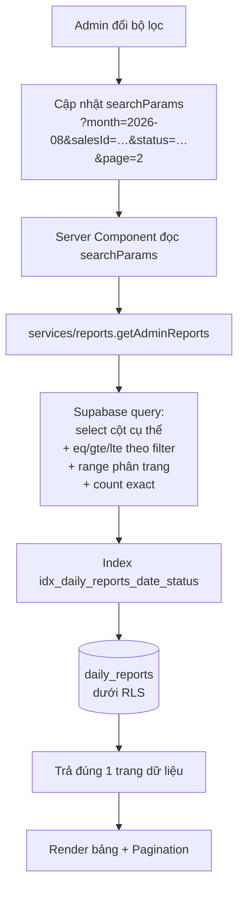

# 07 — API & Data Flow

> Status: ACTIVE | Phase: 16 | Last updated: 2026-08-11
> Nguồn sự thật cấp trên: BIKEFORCE_MASTER_SPEC.md → docs/11-decisions.md → tài liệu này
> Đáp ứng Master Spec §51.

---

## 1. Phạm vi và nguyên tắc

BikeForce **không có REST API riêng cho CRUD báo cáo** (DEC-003). Toàn bộ đường dữ liệu gồm đúng ba loại:

| Loại | Số lượng | Chạy ở đâu | Chịu RLS? | Dùng khi |
|---|---:|---|---|---|
| **Server Action** | 10 | Vercel Node runtime | Có (dùng server client) | Mọi thao tác **ghi** |
| **Route Handler** | 1 | Vercel Node runtime | Có | Chỉ khi phải trả **binary** (ảnh PNG) |
| **Query function** (`services/`) | 9 | Gọi từ Server Component | Có | Mọi thao tác **đọc** |

### 1.1 Bốn quy tắc bất di bất dịch

> **QUY TẮC 1 — Mọi hàm ghi tự kiểm tra auth + role + quyền sở hữu.**
> Không hàm nào được giả định "layout đã chặn rồi nên chắc là đúng role". Server Action là **endpoint công khai** — bất kỳ ai cũng gọi được bằng một HTTP request thủ công. Đây là guideline `Validate Server Action input` mà skill ui-ux-pro-max trả về cho stack `nextjs` ở mức `Severity: High`, và là NFR-006.

> **QUY TẮC 2 — Không bao giờ tin `sales_id` từ client.**
> `sales_id` **luôn** lấy từ `auth.uid()` phía server. Không có Server Action nào nhận `sales_id` làm tham số. Điều này chặn hoàn toàn lớp tấn công "sửa payload để ghi vào báo cáo người khác" ngay cả khi RLS có sai sót.

> **QUY TẮC 3 — Không bao giờ tin `report_date` từ client.**
> Ngày nghiệp vụ do server tính bằng `getVietnamToday()` (BR-005, DEC-009). Đồng hồ máy client có thể sai hoặc bị cố tình đổi để tạo báo cáo cho ngày khác.

> **QUY TẮC 4 — Không ném lỗi Postgres thô ra client.**
> Server Action bắt lỗi, ghi log chi tiết ở server, và trả về `ActionResult` với một mã lỗi ứng dụng cùng thông báo tiếng Việt an toàn (NFR-014). Thông báo lỗi database có thể lộ tên bảng, tên constraint và cấu trúc schema.

### 1.2 Hợp đồng trả về dùng chung

```ts
// lib/types/action-result.ts — ĐỀ XUẤT, chưa triển khai
export type ActionResult<T = void> =
  | { ok: true;  data: T }
  | { ok: false; code: ErrorCode; message: string; fieldErrors?: Record<string, string> }
```

Discriminated union, không phải `{ success, error, data }` lỏng lẻo — TypeScript bắt buộc kiểm tra `ok` trước khi chạm vào `data`, nên không thể quên xử lý nhánh lỗi.

`fieldErrors` chỉ có khi `code === 'VALIDATION_FAILED'`, khoá là tên field để UI gắn lỗi ngay dưới đúng ô (`error-placement`) và focus ô lỗi đầu tiên (`focus-management`).

### 1.3 Khung xử lý chung của mọi Server Action

```ts
// ĐỀ XUẤT, chưa triển khai — mọi Server Action đi đúng 7 bước này
'use server'

export async function someAction(input: unknown): Promise<ActionResult<T>> {
  // 1. Xác thực — chưa đăng nhập thì dừng ngay
  const supabase = await createServerClient()
  const { data: { user } } = await supabase.auth.getUser()
  if (!user) return fail('UNAUTHENTICATED')

  // 2. Lấy profile: role + is_active (BR-009)
  const profile = await getMyProfile(supabase)
  if (!profile?.is_active) return fail('INACTIVE_ACCOUNT')

  // 3. Kiểm tra role
  if (profile.role !== 'SALES') return fail('FORBIDDEN')

  // 4. Validate bằng CÙNG Zod schema mà client dùng
  const parsed = someSchema.safeParse(input)
  if (!parsed.success) return failValidation(parsed.error)

  // 5. Dữ liệu do server quyết định — không nhận từ client
  const reportDate = getVietnamToday()

  // 6. Ghi qua services/, dưới RLS
  try { ... } catch (e) { logServer(e); return mapDbError(e) }

  // 7. revalidatePath + trả kết quả
  revalidatePath('/sales/today')
  return { ok: true, data }
}
```

**Bước 1–3 là thừa về mặt lý thuyết** vì RLS đã chặn ở database. Chúng vẫn tồn tại vì: (a) cho ra thông báo lỗi tử tế thay vì "0 rows affected" khó hiểu; (b) là lớp phòng thủ nếu một policy bị viết sai; (c) tránh một round-trip database vô ích.

---

## 2. Sơ đồ luồng dữ liệu

### 2.1 Kiểu tóm tắt của Master Spec §51

```text
MorningReportForm
→ Zod (morningReportSchema, client)
→ saveMorningReport()
→ Zod (cùng schema, server)
→ auth + role + is_active
→ services/reports.insertMorningReport()
→ Supabase (RLS: reports_insert_own_today)
→ daily_reports
→ revalidatePath('/sales/today')
```

```text
EveningReportForm
→ Zod (eveningReportSchema)
→ saveEveningReport()
→ authorizeSalesWrite()  (auth + is_active + role SALES — DEC-036)
→ kiểm tra status hiện tại = MORNING_SUBMITTED (BR-007, BR-008)
→ services/reports.completeEveningReport()
→ Supabase (RLS: reports_update_own_open)
→ daily_reports.status = COMPLETED
→ revalidatePath('/sales/today')
→ redirect('/sales/today?saved=evening')            (DEC-037)
→ /sales/today đọc lại status ĐÃ PERSIST → nút ảnh đổi sang bản KẾT QUẢ (BR-002, DEC-058)
```

> Tên hàm service là **`completeEveningReport`**, không phải `completeReport` như bản phác thảo đầu tiên của mục này — khớp ví dụ đặt tên Server Action ở `AGENTS.md §3` và `SESSION_CHECKPOINT.md`.

```text
ShareButton
→ fetch('/api/reports/[id]/share-image')
→ Route Handler: auth → RLS đọc report → kiểm tra status = COMPLETED
→ ImageResponse 1080×1920 (Satori)
→ blob
→ navigator.share({ files }) hoặc <a download>
```

### 2.2 Danh sách Admin — lọc và phân trang phía server



**Vì sao lọc luôn ở server, không bao giờ ở client** (NFR-002): tải toàn bộ báo cáo về trình duyệt rồi lọc bằng JavaScript nghĩa là (a) truyền dữ liệu của **mọi** Sales về máy một người — dữ liệu vẫn nằm trong bộ nhớ trình duyệt kể cả khi UI không hiển thị; (b) tốn băng thông trên mạng di động; (c) không dùng được index; (d) chậm dần theo thời gian một cách âm thầm. Bộ lọc nằm trong URL để `state-preservation` hoạt động — quay lại là khôi phục đúng bộ lọc.

---

## 3. Catalogue — Server Actions

> Trạng thái triển khai tính tới **2026-08-07 (hết Phase 3)**:
>
> | Action | Trạng thái | File thật |
> |---|---|---|
> | `signIn` · `signOut` | ✅ **ĐÃ TRIỂN KHAI** (Phase 2) | `features/auth/actions.ts` |
> | `saveMorningReport` · `updateMorningReport` | ✅ **ĐÃ TRIỂN KHAI** (Phase 3) | `features/report-morning/actions.ts` |
> | `saveEveningReport` | ✅ **ĐÃ TRIỂN KHAI** (Phase 4) | `features/report-evening/actions.ts` |
> | `changePassword` · `updateOwnProfile` | ⏳ đề xuất — Phase 7 (UC-11) | — |
> | `createSalesAccount` · `updateSalesProfile` · `setSalesActiveStatus` | ⏳ đề xuất — Phase 10 | — |
>
> **Hai điểm bản triển khai đi khác tài liệu này — đã ghi thành DEC-034, đọc trước khi sửa:**
>
> 1. **Payload dùng `snake_case` trùng tên cột** (`planned_route`, `target_revenue`, …), **không** `camelCase` như ví dụ ở §3.5 bên dưới. Nhờ vậy output của Zod gắn thẳng vào `TablesInsert<'daily_reports'>` mà không cần tầng ánh xạ, và `fieldErrors` khớp thẳng `name` của input. `docs/08 §3.6` vốn đã viết theo `snake_case`.
> 2. **`ActionResult` thành công của luồng báo cáo mang thêm `data.notice`** — **server** quyết định câu xác nhận nào hiện ở `/sales/today`, client không suy ra từ `mode` của form. Lý do là một lỗi thật đã gặp: `revalidatePath` khiến trang form render lại ở chế độ SỬA ngay sau khi TẠO thành công.
>
> Ngoài hai điểm đó, bản triển khai bám đúng bảng bên dưới, kể cả thứ tự 7 bước của §1.3.

### 3.1 `signIn`

| Mục | Nội dung |
|---|---|
| **Loại** | Server Action |
| **File** | `features/auth/actions.ts` |
| **Input** | `{ email: string; password: string }` |
| **Zod** | `z.object({ email: z.string().trim().toLowerCase().email(), password: z.string().min(1) })` |
| **Validation** | Định dạng email; mật khẩu không rỗng. **Không** tiết lộ email có tồn tại hay không |
| **Permission** | Public |
| **Database** | `supabase.auth.signInWithPassword()`; sau đó đọc `profiles` lấy `role` + `is_active` |
| **Output** | `ActionResult<{ role: 'ADMIN' \| 'SALES' }>` → UI redirect `/admin` hoặc `/sales/today` |
| **Errors** | `INVALID_CREDENTIALS` → "Email hoặc mật khẩu không đúng." (dùng chung cho cả sai email lẫn sai mật khẩu, chống dò tài khoản) · `INACTIVE_ACCOUNT` → "Tài khoản đã bị vô hiệu hoá. Vui lòng liên hệ quản lý." **và phải `signOut()` ngay** (BR-009) · `VALIDATION_FAILED` |
| **Revalidate** | — (redirect) |

### 3.2 `signOut`

| Mục | Nội dung |
|---|---|
| **File** | `features/auth/actions.ts` |
| **Input** | — |
| **Permission** | Đã đăng nhập |
| **Database** | `supabase.auth.signOut()` → xoá cookie phiên |
| **Output** | `ActionResult<void>` → redirect `/login` |
| **Errors** | Kể cả lỗi vẫn xoá cookie và redirect — không để người dùng mắc kẹt |

### 3.3 `changePassword`

| Mục | Nội dung |
|---|---|
| **File** | `features/auth/actions.ts` |
| **Input** | `{ currentPassword: string; newPassword: string; confirmPassword: string }` |
| **Zod** | `newPassword` ≥ 8 ký tự, có chữ và số; `confirmPassword` phải khớp (`.refine`) |
| **Permission** | Đã đăng nhập + `is_active` |
| **Database** | Xác minh mật khẩu cũ bằng `signInWithPassword` (Supabase không có API verify riêng), rồi `supabase.auth.updateUser({ password })` |
| **Output** | `ActionResult<void>` + toast "Đã đổi mật khẩu" |
| **Errors** | `INVALID_CREDENTIALS` → "Mật khẩu hiện tại không đúng." · `VALIDATION_FAILED` với `fieldErrors` |
| **Revalidate** | — |

### 3.4 `updateOwnProfile`

| Mục | Nội dung |
|---|---|
| **File** | `features/auth/actions.ts` |
| **Input** | `{ fullName: string; phone?: string }` |
| **Zod** | `fullName` trim 1–100; `phone` khớp `/^[0-9+ ]{8,15}$/` hoặc bỏ trống |
| **Permission** | Đã đăng nhập + `is_active`. Chỉ sửa được **chính mình** |
| **Database** | `update profiles set full_name, phone where id = auth.uid()` — RLS `profiles_update_self` |
| **Output** | `ActionResult<Profile>` |
| **Errors** | `VALIDATION_FAILED` · `FORBIDDEN` nếu payload cố chèn `role`/`is_active`/`email` — trigger `guard_profile_self_update()` chặn ở DB, action cũng chỉ chọn đúng 2 field để ghi |
| **Revalidate** | `/sales/account`, `/admin/account` |

### 3.5 `saveMorningReport` — UC-04

| Mục | Nội dung |
|---|---|
| **File** | `features/report-morning/actions.ts` |
| **Input** | `{ plannedRoute, visitPurpose?, targetVisitPoints, targetSalesQuantity, targetRevenue, targetCustomerVisits }` — **không có** `salesId`, **không có** `reportDate` (QUY TẮC 2, 3) |
| **Zod** | `morningReportSchema` trong `lib/validation/` — dùng chung client + server. Ràng buộc khớp đúng bảng ở `docs/04 §7` |
| **Validation** | Số nguyên ≥ 0, trong trần (BR-006, BR-017); `plannedRoute` 1–300 ký tự; từ chối `NaN`/`Infinity`/số âm/chuỗi rác |
| **Permission** | Đã đăng nhập + `role = 'SALES'` + `is_active` |
| **Database** | `insert into daily_reports (sales_id = auth.uid(), report_date = vn_today(), status = 'MORNING_SUBMITTED', …)` — RLS `reports_insert_own_today` |
| **Output** | ⚠ **Không trả về gì khi thành công — action tự `redirect('/sales/today?saved=morning')`** (PHASE 14, **DEC-059**). Kiểu trả về chỉ còn nhánh lỗi: `Exclude<ActionResult<never>, { ok: true }> \| null`, giống hệt `saveEveningReport` |
| **Errors** | `DUPLICATE_REPORT` (Postgres `23505`) → "Hôm nay bạn đã có báo cáo rồi. Hãy mở báo cáo hiện có." + link (BR-001) · `VALIDATION_FAILED` · `FORBIDDEN` · `INACTIVE_ACCOUNT` · `NETWORK` |
| **Revalidate** | `/sales/today` và `/sales/today/evening`. ⚠ **Cố ý KHÔNG revalidate `/sales/today/morning`** — chính trang đang mở, và từ DEC-055 nó không còn nội dung nào để làm mới |
| **Ghi chú** | Lỗi `23505` là đường phòng thủ **thật sự** cho tình huống hai tab bấm Lưu cùng lúc — không thể chặn ở tầng ứng dụng |

### 3.6 ~~`updateMorningReport` — UC-05~~ — ĐÃ XOÁ (PHASE 14, DEC-055)

Server Action này **không còn tồn tại**, cùng với hàm service `updateMorningReport()` và toàn bộ
chế độ `edit` của form sáng. Cam kết đầu ngày khoá ngay khi gửi.

⚠ **Đừng viết lại nó.** Nếu một ngày nghiệp vụ đổi ý, phải có DEC mới, và khi đó **bắt buộc** kèm
audit log (AF-12, ISSUE-007) — đúng điều DEC-026 đã ghi từ đầu.

⚠ **Policy `reports_update_own_open` KHÔNG bị gỡ** — nó vẫn phục vụ `saveEveningReport` ở §3.7,
nay là **đường UPDATE duy nhất** của ứng dụng trên `daily_reports`.

### 3.7 `saveEveningReport` — UC-06

> ✅ **ĐÃ TRIỂN KHAI (Phase 4, 2026-08-07).** Bảng dưới đây đã được cập nhật theo bản chạy thật; hai điểm đi khác bản đề xuất ban đầu được đánh dấu ⚠ và có DEC riêng.

| Mục | Nội dung |
|---|---|
| **File** | `features/report-evening/actions.ts` |
| **Input** | `report_id` + `{ actual_route?, actual_visit_points, actual_sales_quantity, actual_revenue, actual_customer_visits, evening_note? }` — ⚠ **`snake_case`** trùng tên cột, đúng như DEC-034 đã chốt cho luồng sáng |
| **Zod** | `eveningReportSchema` trong `lib/validation/report.ts`; 4 chỉ số `actual_*` **bắt buộc** (khớp `ck_completed_requires_actuals`), `actual_route` ≤ 300, `evening_note` ≤ 1000 ký tự (BR-018) |
| **Permission** | Chủ báo cáo + `is_active` + `role = 'SALES'` + `status = 'MORNING_SUBMITTED'` (BR-007) — guard dùng chung `authorizeSalesWrite()` của `features/auth/queries.ts` (DEC-036) |
| **Database** | `services/reports.completeEveningReport()` → `update daily_reports set actual_*, evening_note, evening_submitted_at, status = 'COMPLETED' where id = $1 and sales_id = $2` — **một câu lệnh duy nhất**, vì `ck_completed_requires_actuals` đánh giá trên dòng sau khi lệnh chạy xong |
| **Output** | ⚠ **Không trả về gì khi thành công — action tự `redirect('/sales/today?saved=evening')`** (DEC-037, ISSUE-014). Kiểu trả về chỉ còn nhánh lỗi: `Exclude<ActionResult<never>, { ok: true }> \| null` |
| **Errors** | `NOT_FOUND` → "Không tìm thấy báo cáo." · `NOT_FOUND` → "Chưa có báo cáo đầu ngày cho hôm nay." (BR-007) · `CONFLICT` → "Báo cáo hôm nay đã hoàn tất rồi." (BR-019) · `VALIDATION` với `fieldErrors` · `UNKNOWN` → "Không lưu được. Kiểm tra kết nối rồi thử lại." — **form giữ nguyên dữ liệu** (NFR-010, đã kiểm chứng trên Chromium) |
| **Revalidate** | `/sales/today` và `/sales/today/morning`. ⚠ **Cố ý KHÔNG revalidate `/sales/today/evening`** — xem ISSUE-014 |
| **Ba lớp chặn `report_id`** | (1) action đối chiếu `report_id` với báo cáo của `getVietnamToday()` — chặn hoàn tất một báo cáo NGÀY CŨ còn mở (BR-021, RLS **không** chặn việc này); (2) `.eq('sales_id')` trong service; (3) RLS `reports_update_own_open` |

> **Điểm quan trọng nhất của cả tài liệu này:** nút xuất ảnh — cả **có hiện không** lẫn **hiện bản nào** — **phải** bắt nguồn từ `status` đã persist, không được suy ra từ "form đã điền đủ" hay từ state phía client. Master Spec §12 nói thẳng: *"Nút Export không được enable chỉ vì form 'trông có vẻ đầy đủ'."* DEC-058 nới điều kiện *khi nào xuất được*, **không** nới điều kiện *lấy sự thật từ đâu*.
>
> ⚠ **Bản triển khai đi CHẶT HƠN bản đề xuất, không lỏng hơn.** Đề xuất ban đầu là "UI bật nút khi nhận `status: 'COMPLETED'` từ action". Thực tế nút Xuất ảnh nằm ở `/sales/today`, và điều kiện bật của nó là `getTodayView(report).canExportImage` — tức đọc `status` **đã persist trong database** ở lần render kế tiếp. Không có đường nào cho giá trị trả về của action, hay trạng thái form, tham gia vào quyết định đó.

### 3.8 `createSalesAccount` — UC-17

| Mục | Nội dung |
|---|---|
| **File** | `features/admin-sales-management/actions.ts` — **nơi duy nhất** được import `lib/supabase/admin.ts` (DEC-005) |
| **Input** | `{ email, fullName, phone?, employeeCode?, temporaryPassword }` |
| **Zod** | email hợp lệ; `fullName` 1–100; `temporaryPassword` ≥ 8 |
| **Permission** | `role = 'ADMIN'` + `is_active` — **kiểm tra bằng server client trước**, rồi mới chạm tới admin client |
| **Database** | `adminClient.auth.admin.createUser({ email, password, email_confirm: true, user_metadata: { full_name, phone, employee_code, role: 'SALES' } })` → trigger `handle_new_user()` tạo dòng `profiles` |
| **Output** | `ActionResult<{ userId: string }>` |
| **Errors** | `EMAIL_EXISTS` → "Email này đã được sử dụng." · `EMPLOYEE_CODE_EXISTS` (`23505` trên `employee_code`) → "Mã nhân viên đã tồn tại." · `FORBIDDEN` |
| **Revalidate** | `/admin/sales` |
| **Bảo mật** | Mật khẩu tạm **không bao giờ** được ghi log. Nếu `createUser` thành công nhưng trigger lỗi thì phải xoá user vừa tạo để không còn `auth.users` mồ côi không có `profiles` |

### 3.9 `updateSalesProfile` — UC-18

| Mục | Nội dung |
|---|---|
| **File** | `features/admin-sales-management/actions.ts` |
| **Input** | `{ profileId, fullName, phone?, employeeCode? }` |
| **Permission** | `role = 'ADMIN'` + `is_active` |
| **Database** | `update profiles … where id = $1` — RLS `profiles_update_admin` |
| **Output** | `ActionResult<Profile>` |
| **Errors** | `EMPLOYEE_CODE_EXISTS` · `PROFILE_NOT_FOUND` · `FORBIDDEN` |
| **Revalidate** | `/admin/sales`, `/admin/sales/[id]` |
| **Ghi chú** | Đổi `email` phải đi qua `auth.admin.updateUserById` **và** cập nhật `profiles.email` trong cùng một thao tác, nếu không hai nơi lệch nhau (BR-025). Cân nhắc **không** cho đổi email ở v1 |

### 3.10 `setSalesActiveStatus` — UC-19

| Mục | Nội dung |
|---|---|
| **File** | `features/admin-sales-management/actions.ts` |
| **Input** | `{ profileId: string; isActive: boolean }` |
| **Permission** | `role = 'ADMIN'` + `is_active` |
| **Validation** | **Admin không được tự vô hiệu hoá chính mình** — chặn khoá hệ thống. Cân nhắc chặn luôn việc vô hiệu hoá Admin cuối cùng còn active |
| **Database** | `update profiles set is_active = $2 where id = $1` |
| **Output** | `ActionResult<void>` |
| **Errors** | `FORBIDDEN` · `CANNOT_DEACTIVATE_SELF` → "Bạn không thể tự vô hiệu hoá tài khoản của mình." |
| **Revalidate** | `/admin/sales`, `/admin/sales/[id]`, `/admin` |
| **Ghi chú** | Vô hiệu hoá **không** xoá dữ liệu. Báo cáo cũ vẫn còn và vẫn tính vào thống kê lịch sử. Phiên đang hoạt động của người bị khoá sẽ bị middleware phát hiện ở request tiếp theo và ép đăng xuất |

---

## 4. Catalogue — Route Handler

### 4.1 `GET /api/reports/[id]/share-image` — UC-08, FR-018

> ✅ **ĐÃ TRIỂN KHAI — Phase 6, 2026-08-08.** Bảng dưới đây là hợp đồng thật, đã kiểm chứng 44/44 phép kiểm. Bốn điểm cần biết trước khi sửa route này:
> 1. **Tên file là `route.tsx`**, không phải `.ts` — nó chứa JSX của thẻ ảnh.
> 2. **Chưa đăng nhập trả 401 từ `middleware.ts`**, không phải từ route handler — xem **DEC-039**/**ISSUE-015**. Route handler vẫn giữ nhánh 401 của riêng nó làm lớp thứ hai; hai nơi trả cùng một hình dạng `{ code, message }`.
> 3. Ngoài 401, middleware còn trả **403 `ACCOUNT_DISABLED`** cho tài khoản bị vô hiệu hoá giữa phiên (BR-009), trước khi route chạy.
> 4. Route đọc dữ liệu bằng **`services/reports.getReportForShare()`** và dựng chuỗi bằng **`lib/reports/share-card.ts`** — nó không tự truy vấn và không tự format gì cả.

| Mục | Nội dung |
|---|---|
| **File** | `app/api/reports/[id]/share-image/route.tsx` |
| **Runtime** | Node (cần đọc file font bằng `fs` cho Satori) |
| **Input** | Path param `id` (uuid) + query param tuỳ chọn **`?view=1`** (PHASE 14 — **DEC-061**). ⚠ `view` **không** ảnh hưởng nội dung ảnh, chỉ đổi `Content-Disposition` từ `attachment` sang `inline`. **Biến thể ảnh vẫn suy ra từ `status` đọc trong database**, client không chọn được (DEC-058) |
| **Validation** | `id` phải là uuid hợp lệ — nếu không, trả 404 luôn, không truy vấn database |
| **Permission** | 1) Có phiên đăng nhập, nếu không → **401**. 2) Đọc report qua **server client** — RLS `reports_select_own_or_admin` tự chặn: Sales chỉ thấy của mình, Admin thấy tất cả (BR-003, BR-022). 3) Nếu 0 row → **404**. ⚠ **PHASE 14 (DEC-058): bước 4 cũ — `status !== 'COMPLETED'` → 403 — ĐÃ BỊ XOÁ.** `status` nay chọn **biến thể** ảnh chứ không chặn |
| **Database** | **BỐN** truy vấn, cùng đi qua server client chịu RLS (DEC-070/071):<br>1. `getReportForShare()` — báo cáo và hồ sơ Sales.<br>2. `listMonthToDateMetrics()` — tối đa 31 dòng để dựng đường lùi doanh thu tháng.<br>3. `getAmisMetricsForShare()` — số AMIS, gồm `no_of_orders` và `return_sales` bổ sung ngày 2026-08-21.<br>4. `getMonthlyTargets()` — chỉ tiêu doanh số/doanh thu tháng do Admin giao.<br>Hai truy vấn (3) và (4) chạy song song. Chọn đúng cột cần, không `select *` |
| **Số liệu AMIS bổ sung** | `no_of_orders`, `current_amount / no_of_orders` và `return_sales` nối tiếp bảng thành ba dòng canh giữa **SL ĐH đã ghi · Giá trị trung bình 1 đơn · Giá trị hàng hóa trả hàng**. Mỗi dòng chỉ render tên + giá trị thực đạt; không render cột chỉ tiêu/% không áp dụng. Chúng không vào `KpiMetric`, không tính `%` và không tham gia BR-024. Mẫu số 0 hoặc dữ liệu không dùng được → `—`, tuyệt đối không `NaN`/`Infinity` |
| **Lũy kế tháng** | Mốc dừng do `shareMonthRange(report_date, variant)` chọn: bản **chiều** cộng tới hết ngày báo cáo; bản **sáng** cộng tới **hết ngày hôm trước** (hôm đó chưa có thực đạt). Ba con số dựng bằng `summarizeMonthToDate()` — hàm thuần ở `lib/reports/month-summary.ts`; **không** có `sum()` hay hàm SQL nào, vì "ngày đạt KPI" là BR-024 áp lên `calculateAchievement()` và BR-011 cấm persist `%`. Truy vấn hỏng → `monthly = null` → thẻ **bỏ hẳn cụm** thay vì in `0 ₫` sai sự thật |
| **Output** | `ImageResponse` PNG 1080×1920, **hai biến thể** (DEC-058). Header: `Content-Type: image/png`, `Cache-Control: private, no-store`, và `Content-Disposition: **attachment**; filename="Bao_Cao_Cuoi_Ngay_2026-08-07.png"` cho bản chiều / `"Bao_Cao_Ngay_2026-08-07.png"` cho bản sáng (FR-019, tên ngắn để Zalo không hiện họ tên dài dưới ảnh).<br>⚠ **PHASE 14 (DEC-061):** có `?view=1` thì chữ `attachment` đổi thành **`inline`** — **tên file giữ nguyên** ở cả hai chế độ. `inline` là điều kiện để trình duyệt HIỆN ảnh.<br>Từ **DEC-064**, chế độ này được gọi ở **mọi lượt xem trang** vì ảnh xem trước luôn hiện ⇒ mỗi lượt xem tốn **hai** lượt dựng ảnh (một cho ``, một cho blob nạp trước của nút Zalo). Cái giá đã cân nhắc, xem DEC-064 |
| **Errors** | `401` chưa đăng nhập · `404` không tồn tại **hoặc** không có quyền (**cố tình không phân biệt** để chống dò ID) · `500` lỗi render — log chi tiết ở server, client chỉ nhận JSON `{ code, message }`. ⚠ Nhánh `403 NOT_COMPLETED` đã bị xoá (DEC-058) |
| **Ghi chú bảo mật** | Đây là bề mặt tấn công IDOR rõ ràng nhất của hệ thống. Sau DEC-058, lớp bảo vệ là **RLS** — biên giới thật (DEC-004) — cộng với việc đầu vào từ client chỉ gồm `id` và một cờ hiển thị. ⚠ `?view=1` **không** mở bề mặt mới: nó không chạm quyền, không chọn dữ liệu, không chọn biến thể; mọi lớp kiểm tra chạy y hệt ở cả hai chế độ. Test bảo mật bắt buộc, KHÔNG đổi: Sales A gọi route với `id` của báo cáo Sales B → phải nhận **404**, không phải ảnh |

---

## 5. Catalogue — Query functions (`services/`)

> **Đã triển khai tính tới hết Phase 3:**
>
> | Hàm | File thật | Ghi chú lệch với bảng bên dưới |
> |---|---|---|
> | `getSessionProfile(supabase, userId)` | `services/profiles.ts` | Vai trò của `getMyProfile`; nhận `userId` tường minh thay vì đọc `auth.uid()` bên trong, để chạy được dưới cả ba ngữ cảnh client |
> | `getTodayReport(supabase, salesId, today)` | `services/reports.ts` | Vai trò của `getMyTodayReport`. **Không `select('*')`** — 18 cột nghiệp vụ liệt kê tường minh, bỏ `created_at`/`updated_at` |
> | `insertMorningReport` · `updateMorningReport` | `services/reports.ts` | Hàm **ghi**, không có trong bảng đọc bên dưới. Trả `ReportWriteResult` đã dịch mã lỗi Postgres sang từ vựng nghiệp vụ (`DUPLICATE` / `REJECTED` / `UNKNOWN`) nên tầng trên không bao giờ thấy `PostgrestError` thô |
> | `completeEveningReport` | `services/reports.ts` | Hàm **ghi** (Phase 4) — sáu cột đi chung MỘT câu `update` |
> | **`getReportForShare(supabase, reportId)`** | `services/reports.ts` | **Phase 6.** Vai trò của `getReportById` cho riêng thẻ ảnh: 15 cột (thêm `sales_id` ở PHASE 17 — DEC-068) + embedded `sales:profiles!inner(full_name, employee_code)`. **Cố ý KHÔNG nhận `salesId`** — lọc thêm `.eq('sales_id')` sẽ chặn nhầm Admin (BR-022); quyền do RLS quyết định hoàn toàn |
> | **`listMonthToDateMetrics(supabase, salesId, range)`** | `services/reports.ts` | **PHASE 17 (DEC-068).** 8 cột số của các ngày trong `[from, to]` của **một** Sales, tối đa 31 dòng nên không phân trang. ⚠ `salesId` ở đây **không** phải lớp bảo mật — nó chỉ nói cộng cho ai; RLS `reports_select_own_or_admin` mới là thứ chặn (có test ở `tests/rls/share-image.rls.test.ts`). Trả **`null` khi truy vấn hỏng**, khác hẳn `[]` = tháng chưa có ngày nào |
>
> Các hàm còn lại trong bảng vẫn là **đề xuất**, thuộc Phase 7 → Phase 10.

Nguyên tắc chung cho mọi hàm dưới đây: **nhận `supabase` client làm tham số** (không tự tạo — để test được và để không bao giờ lỡ tay dùng service-role client), **chọn đúng cột cần** (không `select *`), **luôn phân trang** với danh sách, và **không quyết định quyền** (quyền là việc của RLS + Server Action).

| Hàm | Input | Truy vấn | Index dùng | Output | Lỗi |
|---|---|---|---|---|---|
| `getMyProfile` | `supabase` | `select id, full_name, email, phone, employee_code, role, is_active from profiles where id = auth.uid()` | PK | `Profile \| null` | `null` nếu chưa có profile (trigger lỗi) |
| `getMyTodayReport` | `supabase` | `select * from daily_reports where sales_id = auth.uid() and report_date = <vn_today>` | `uq_daily_reports_sales_date` | `Report \| null` | — |
| `getMyReports` | `supabase, month: 'YYYY-MM', page` | `where sales_id = auth.uid() and report_date between from and to`, `order by report_date desc`, `range(offset, offset+19)`, `count: 'exact'` | `idx_daily_reports_sales_date_desc` | `{ rows: Report[]; total: number }` | — |
| `getReportById` | `supabase, id` | `select …, profiles(full_name, employee_code) where id = $1` | PK | `ReportWithSales \| null` | `null` = không tồn tại **hoặc** không có quyền (RLS) — gọi `notFound()` |
| `getAdminTodayOverview` | `supabase, date` | Ba truy vấn gộp: (a) `count profiles where role='SALES' and is_active`; (b) `count daily_reports where report_date = $1 group by status`; (c) `sum` 8 cột target/actual cùng ngày | `idx_profiles_role_active`, `idx_daily_reports_date_status` | 12 chỉ số của FR-024 | — |
| `getAdminReports` | `supabase, filters, page` | `where` động theo `date` / `dateFrom+dateTo` / `month` / `salesId` / `status` / `search` (ilike trên `profiles.full_name`), `order by report_date desc, full_name`, `range`, `count: 'exact'` | `idx_daily_reports_date_status` | `{ rows; total }` | — |
| `getAdminMonthlyAnalytics` | `supabase, month` | `sum` 8 cột target/actual trong khoảng tháng, `count` báo cáo, `count distinct sales_id`; tuỳ chọn `group by report_date` cho biểu đồ trend (FR-037) | `idx_daily_reports_date_status` | Tổng hợp tháng | — |
| `getSalesPerformance` | `supabase, from, to` | `group by sales_id` với `sum` các cột, `count` ngày đạt KPI (BR-024), join `profiles` | `idx_daily_reports_date_status` | `SalesPerformanceRow[]` | — |
| `getSalesList` | `supabase, filters, page` | `select … from profiles where role='SALES'` + lọc `is_active` + `ilike` tên/email/mã NV, phân trang | `idx_profiles_role_active` | `{ rows; total }` | — |
| `getMissingReportAlerts` | `supabase, date` | Anti-join: Sales active **chưa có** dòng `daily_reports` ngày đó; và Sales có dòng nhưng `status = 'MORNING_SUBMITTED'` | `idx_profiles_role_active`, `idx_daily_reports_date_status` | `{ noReport: Profile[]; notCompleted: Profile[] }` | — |

**Về `%` hoàn thành:** không có hàm nào trong bảng trên trả về phần trăm. Mọi truy vấn chỉ trả **số thô**; phần trăm được tính ở tầng trình bày bằng `lib/kpi.ts` (BR-011, DEC-007). Điều này đảm bảo màn hình đối chiếu và thẻ ảnh 9:16 không bao giờ ra hai con số khác nhau.

---

## 6. Bảng ánh xạ mã lỗi

### 6.1 Lỗi từ Postgres / Supabase

| Mã | Nghĩa | Xảy ra khi | Mã ứng dụng | Thông báo cho người dùng |
|---|---|---|---|---|
| `23505` | unique violation | Trùng `(sales_id, report_date)`; trùng `employee_code`; trùng `email` | `DUPLICATE_REPORT` / `EMPLOYEE_CODE_EXISTS` / `EMAIL_EXISTS` | "Hôm nay bạn đã có báo cáo rồi." / "Mã nhân viên đã tồn tại." / "Email này đã được sử dụng." |
| `23514` | check violation | Số âm, vượt trần, `report_date` tương lai, `COMPLETED` mà thiếu actual | `VALIDATION_FAILED` | "Dữ liệu không hợp lệ. Vui lòng kiểm tra lại các ô đã nhập." — **kèm log server để tìm ra lỗ thủng ở Zod**, vì lẽ ra lớp 2 đã phải bắt được |
| `23503` | foreign key violation | `sales_id` không tồn tại trong `profiles` | `FORBIDDEN` | "Không thực hiện được thao tác này." |
| `42501` | insufficient privilege | Thiếu `GRANT` | `FORBIDDEN` | "Bạn không có quyền thực hiện thao tác này." |
| `PGRST116` | 0 rows với `.single()` | RLS chặn, hoặc bản ghi không tồn tại | `REPORT_NOT_FOUND` / `PROFILE_NOT_FOUND` | "Không tìm thấy báo cáo." |
| *(0 rows affected trên UPDATE)* | RLS `USING` không khớp | Không phải chủ, hoặc đã `COMPLETED` | `REPORT_LOCKED` | "Báo cáo đã hoàn tất nên không sửa được." |

> **Lưu ý về `23514`:** nếu constraint của database bắt được lỗi mà Zod không bắt được, đó là **bug của lớp validation**, phải ghi vào `docs/12-known-issues.md`. Người dùng lẽ ra không bao giờ nên thấy lỗi này.

### 6.2 Mã lỗi ứng dụng

| Mã | HTTP tương đương | Thông báo tiếng Việt | Form có reset không? |
|---|---|---|---|
| `UNAUTHENTICATED` | 401 | "Phiên đăng nhập đã hết hạn. Vui lòng đăng nhập lại." | **Không** — giữ nguyên dữ liệu |
| `FORBIDDEN` | 403 | "Bạn không có quyền thực hiện thao tác này." | **Không** |
| `INACTIVE_ACCOUNT` | 403 | "Tài khoản đã bị vô hiệu hoá. Vui lòng liên hệ quản lý." | **Không** |
| `INVALID_CREDENTIALS` | 401 | "Email hoặc mật khẩu không đúng." | Giữ email, xoá mật khẩu |
| `VALIDATION_FAILED` | 422 | *(dùng `fieldErrors`, hiện dưới từng ô)* | **Không** |
| `DUPLICATE_REPORT` | 409 | "Hôm nay bạn đã có báo cáo rồi. Hãy mở báo cáo hiện có." | **Không** — kèm link tới báo cáo đó |
| `REPORT_NOT_FOUND` | 404 | "Không tìm thấy báo cáo." | — |
| `REPORT_LOCKED` | 409 | "Báo cáo đã hoàn tất nên không sửa được." | **Không** |
| `NO_MORNING_REPORT` | 409 | "Chưa có báo cáo đầu ngày cho hôm nay." | **Không** |
| `NOT_COMPLETED` | 403 | "Chỉ xuất ảnh được sau khi hoàn tất báo cáo cuối ngày." | — |
| `EMAIL_EXISTS` | 409 | "Email này đã được sử dụng." | **Không** |
| `EMPLOYEE_CODE_EXISTS` | 409 | "Mã nhân viên đã tồn tại." | **Không** |
| `CANNOT_DEACTIVATE_SELF` | 400 | "Bạn không thể tự vô hiệu hoá tài khoản của mình." | — |
| `NETWORK` | — | "Không lưu được. Kiểm tra kết nối rồi thử lại." | **Không** |
| `UNKNOWN` | 500 | "Đã có lỗi xảy ra. Vui lòng thử lại." | **Không** |

> **Quy tắc chung, không có ngoại lệ:** với mọi lỗi trong bảng trên, form **giữ nguyên toàn bộ dữ liệu người dùng đã nhập** (Master Spec §12, §30). Bắt Sales gõ lại 6 con số sau một lần mất sóng là cách nhanh nhất để họ bỏ dùng hệ thống.

---

## 7. Chống double-submit và race condition

| Tình huống | Cơ chế chặn | Tầng |
|---|---|---|
| Người dùng bấm Lưu hai lần liên tiếp | Nút `disabled` khi đang gửi (`loading-buttons`) | Client (UX) |
| Hai tab cùng bấm Lưu báo cáo sáng | `UNIQUE(sales_id, report_date)` → tab thứ hai nhận `23505` | **Database** |
| Hai tab cùng bấm Lưu báo cáo cuối ngày | RLS `USING status = 'MORNING_SUBMITTED'` → tab thứ hai khớp 0 row | **Database** |
| Cố quay lui `COMPLETED → MORNING_SUBMITTED` | Trigger `guard_report_transition()` | **Database** |
| Đổi ngày lúc 00:00 khi form đang mở | Server tự tính `report_date` khi submit, không dùng ngày lúc mở form | Server |

Ba dòng đánh dấu **Database** là những dòng duy nhất thật sự chặn được — cơ chế phía client chỉ giảm tần suất.

---

## OPEN QUESTIONS

Danh sách đầy đủ ở `docs/01-business-analysis.md` §OPEN QUESTIONS. Những câu ảnh hưởng trực tiếp tới tài liệu này:

| ID | Câu hỏi (rút gọn) | Đề xuất mặc định | Đổi gì ở đây |
|---|---|---|---|
| **OQ-04** | Sửa được báo cáo sau khi `COMPLETED` không? | Không | Nếu "có" → sinh thêm action `updateEveningReport`, và §3.6 bỏ điều kiện `status`; bắt buộc thêm audit log |
| **OQ-05** | Admin sửa báo cáo Sales không? | Không | Nếu "có" → sinh thêm action `adminUpdateReport` (hiện **không tồn tại**), thêm policy UPDATE cho admin, bắt buộc audit log |
| **OQ-12** | Nhập bù ngày cũ / có cut-off giờ không? | Chỉ đúng ngày hôm nay | Nếu cho nhập bù → `saveMorningReport` phải **nhận** `reportDate`, phá vỡ QUY TẮC 3 và cần một cơ chế xác thực ngày khác |
| **OQ-13** | Có xoá báo cáo không? | Không | Nếu "có" → sinh thêm action `deleteReport`/`softDeleteReport` và **mọi** query function ở §5 phải thêm điều kiện `deleted_at is null` |
| **OQ-01/02** | Viếng thăm là số hay text? | Cả hai | Đổi trực tiếp Zod schema và payload của §3.5 và §3.7 |
| OQ-09 | KPI do ai đặt? | Sales tự cam kết | Nếu Admin giao → `saveMorningReport` **biến mất** khỏi phía Sales, thay bằng một action mới của Admin ghi vào bảng `targets` |

---

## Tài liệu liên quan

| Nội dung | Tài liệu chủ |
|---|---|
| Định nghĩa cột, CHECK, index, nội dung RLS policy | `docs/02-database-design.md` |
| Sequence diagram end-to-end + luồng lỗi đầy đủ | `docs/03-workflow.md` |
| Ba Supabase client, ba lớp validation, xử lý secret | `docs/04-system-architecture.md` |
| Thông báo lỗi hiển thị ra sao trên giao diện | `docs/05-ui-ux-design.md` §12 |
| Ma trận quyền và kịch bản tấn công | `docs/06-auth-permissions.md` |
| Test case cho từng mã lỗi | `docs/08-testing-strategy.md` |

---

## CẬP NHẬT PHASE 7–11 (2026-08-10) — data flow của Sales History và toàn bộ khu vực Admin

### A. Kiểm kê đầy đủ mọi đường ghi/đọc của v1

**Server Actions (đường GHI duy nhất — DEC-003):**

| Action | File | UC / FR | Ghi chú |
|---|---|---|---|
| `saveMorningReport` | `features/report-morning/actions.ts` | UC-04, FR-008 | trả `ActionResult` kèm `data.notice` (DEC-034) |
| `saveEveningReport` | `features/report-evening/actions.ts` | UC-06, FR-013/014 | **tự `redirect()`**, chỉ trả về khi lỗi (DEC-037) |
| `signInAction` / `signOutAction` | `features/auth/actions.ts` | UC-01, UC-02 | |
| `changePasswordAction` | `features/account/actions.ts` | UC-11, FR-023 | không `redirect`, không `revalidatePath` — không có RSC nào đổi |
| `createSalesAccount` | `features/admin-sales-management/actions.ts` | UC-17, FR-030 | **nơi DUY NHẤT dùng service role**, và chỉ cho `auth.admin.createUser` |
| `updateSalesAccount` | `features/admin-sales-management/actions.ts` | UC-18, FR-031 | client **anon chịu RLS** — `profiles_update_admin` là thứ cho phép |
| `toggleSalesActive` | `features/admin-sales-management/actions.ts` | UC-19, FR-032, BR-009 | như trên |

**Route Handlers (đúng HAI cái, cả hai chỉ để TẢI FILE):**

| Route | UC / FR | Trả về | Quyết định |
|---|---|---|---|
| `GET /api/reports/[id]/share-image` | UC-08, FR-018 | `image/png` 1080×1920 | Phase 6 |
| `GET /api/admin/reports/export` | UC-21, FR-034, AF-09 | `text/csv` + `Content-Disposition` | **DEC-042** |

Cả hai bắt buộc `Cache-Control: private, no-store`, và cả hai đứng sau **ba lớp**: middleware trả 401/403 **JSON** cho `/api/*` (DEC-039) → route tự kiểm role → RLS.

**RPC đọc (Server Component gọi qua `services/admin.ts`):** năm hàm của migration 0006 + 0007 — xem `docs/02 § CẬP NHẬT PHASE 8–11`.

### B. Quy tắc mới rút ra ở Phase 11 — hằng số KHÔNG nằm trong file `'use server'`

Một file `'use server'` chỉ được export **async function** và `export type`. Export một object hằng số làm module ném lỗi **lúc chạy** trong khi build/typecheck/lint/unit test đều xanh (ISSUE-016, DEC-045).

Vì vậy chuỗi thông báo của mọi feature đều nằm ở `lib/`:

| File | Dùng bởi |
|---|---|
| `lib/auth/messages.ts` | `features/auth/` |
| `lib/reports/messages.ts` | `features/report-morning/`, `features/report-evening/` |
| `lib/account/messages.ts` | `features/account/` |
| `lib/admin/messages.ts` | `features/admin-sales-management/` |

### C. Chuẩn hoá `searchParams` — mọi bộ lọc đi qua một hàm thuần

`searchParams` là **chuỗi bất kỳ người dùng gõ được vào URL**, nên không tầng nào được tin nó. Ba hàm thuần chịu trách nhiệm, tất cả đều có unit test và **không bao giờ ném lỗi**:

| Hàm | File | Đầu vào rác cho ra |
|---|---|---|
| `parseAdminReportFilters()` | `lib/reports/admin-filters.ts` | bộ lọc rỗng / khoảng ngày mặc định; `?salesId=abc` bị chặn trước khi tới Postgres; ô tìm kiếm bị cắt ở trần độ dài |
| `parsePageParam()` | `lib/reports/pagination.ts` | trang `1` |
| `parseTrendMetric()` | `lib/reports/trend-chart.ts` | `REVENUE` |
| `getVietnamMonthRange()` | `lib/date.ts` | **`null`** — DEC-040, buộc caller xử lý |

Thứ tự ưu tiên khoảng ngày của Admin: `date` (một ngày) → `from`+`to` → `month`. Chọn ngày mới thì **bỏ** `month` cũ, nếu không người dùng nhận một kết quả rộng hơn thứ họ vừa chọn. Tên tham số thật: `date`, `from`, `to`, `month`, `salesId`, `status`, **`q`** (tìm theo tên Sales), `page`.

### D. Phân trang — luôn server-side

`REPORTS_PAGE_SIZE = 20`. Truy vấn dùng `.range(offset, offset + 19)` + `count: 'exact'`, **không** `select('*')`, và không bao giờ tải cả tập rồi cắt ở client (NFR-002). Số học phân trang tách ra `lib/reports/pagination.ts` vì lệch `±1` ở biên trang là loại lỗi không ném lỗi — nó chỉ âm thầm mất hoặc lặp một dòng.

Ba màn hình dùng chung đúng phép tính đó: `/sales/history`, `/admin/reports`, `/admin/sales`.

### E. Tìm kiếm theo tên Sales

`ilike` trên bảng nhúng (`.ilike('sales.full_name', …)`), có escape ký tự `%` và `_` của người dùng, và có trần độ dài chuỗi. Chưa dùng `pg_trgm` GIN — với ≤ 200 Sales thì `ilike` trên vài trăm dòng rẻ hơn chi phí bảo trì index (đã ghi ở `docs/10-future-roadmap.md`).

### F. Xuất CSV — ba điều bắt buộc

1. **Xuất đúng tập đang filter**, không phải toàn bảng — cùng `parseAdminReportFilters()` với màn hình danh sách, nên hai bên không thể lệch nhau.
2. **Có trần `CSV_EXPORT_MAX_ROWS`** — một Admin bấm xuất khi chưa lọc gì không được kéo cả năm dữ liệu vào bộ nhớ hàm serverless.
3. **Escape đúng chuẩn CSV** (`lib/reports/csv.ts`, có unit test): trường chứa `,`, `"`, xuống dòng đều được bọc nháy kép và nhân đôi nháy bên trong. Tên cột chỉ tiêu đọc từ `lib/reports/metric-rows.ts` — cùng nguồn với bảng đối chiếu và thẻ ảnh.

---

## CẬP NHẬT PHASE 13 (2026-08-10) — hợp đồng dữ liệu sau DEC-048/049/050

### 13.1 `morningReportSchema` — còn **5** khoá

```
planned_route · target_visit_points · target_sales_amount · target_revenue · target_customer_visits
```

- **`visit_purpose` đã bị GỠ** (DEC-048). Hai lớp chặn chồng nhau: `readMorningFormData()` không đọc
  khoá đó khỏi `FormData`, **và** `z.object` strip nó nếu ai đó gửi tay — cùng cơ chế đang chặn
  `sales_id` / `report_date` / `status` (QUY TẮC 2 & 3).
- **`target_sales_amount` thay `target_sales_quantity`**, trần **100 tỷ VND** (dùng chung
  `MAX_REVENUE_VND`), không còn trần 10.000.
- **`target_visit_points` có SÀN 10** (BR-026). `integerField()` nay nhận tham số `min` (mặc định 0)
  và đổi thông điệp theo ca: `min = 0` → *"không được là số âm"*, `min > 0` → *"tối thiểu 10"*.
  Thông điệp thứ hai hữu ích hơn hẳn khi người dùng gõ `5`.
- `docs/08 §3.6` nay khẳng định issue path là **`['target_sales_amount']`**.

### 13.2 `eveningReportSchema`

`actual_sales_amount` thay `actual_sales_quantity`, cùng trần tiền. **Cận dưới của cả bốn ô `actual_*`
vẫn là 0** — kể cả điểm viếng thăm: BR-026 đặt sàn cho **MỤC TIÊU**, không cho **KẾT QUẢ**. Một ngày
mưa chỉ ghé được 3 điểm là số liệu thật và phải nhập được, nếu không Sales sẽ buộc phải khai khống.

### 13.3 Năm hàm RPC của Admin — tên cột trả về đã ĐỔI

`admin_today_overview` · `admin_monthly_summary` · `admin_sales_performance` · `admin_daily_trend`
nay trả `target_sales_amount` / `actual_sales_amount` thay cho cặp `*_sales_quantity`.
`admin_missing_report_alerts` **không đổi** — nó không chạm cột nào bị ảnh hưởng.

⚠ **Bắt buộc `drop function` rồi `create`, không `create or replace`:** Postgres từ chối đổi **tên
cột** trong `returns table (...)` của một hàm đang tồn tại. Và `drop function` **cuốn theo mọi
`GRANT`** — thiếu bước cấp lại thì `authenticated` mất quyền execute và toàn bộ khu vực Admin chết
lặng lẽ (RLS vẫn đúng, chỉ là không gọi được hàm nào).

### 13.4 Dữ liệu cũ đi qua tầng này thế nào

`calculateAchievement()` nay nhận `target: number | null` và trả `PENDING` + `'—'` khi `null` — vì
các báo cáo có **trước** migration `0008` mang `null` ở `target_sales_amount` (OQ-19c). Cùng triết lý
với DEC-033: một ô "Hoàn thành" trống thì đọc được, còn một trang lỗi thì không.

Hệ quả đã lường trước ở tầng SQL: những dòng đó **không** được đếm vào `kpi_achieved_days`, vì phép
so sánh với `null` cho `null`. Đúng chủ ý — một ngày cũ chấm theo bộ chỉ tiêu cũ thì không thể tuyên
bố là đạt theo bộ chỉ tiêu mới.

---

## 14. CẬP NHẬT PHASE 16 — Data flow danh sách báo cáo Admin (DEC-066)

`parseAdminReportFilters(searchParams)` là điểm chuẩn hoá duy nhất. `AdminReportSearchParams` nhận thêm
`period?: 'all'`; tham số khác bị bỏ qua. Thứ tự thời gian là `date` hợp lệ → `from/to` hợp lệ → `month`
hợp lệ → `period=all` → tháng hiện tại theo `Asia/Ho_Chi_Minh`. Vì vậy URL trống vẫn tạo `dateFrom/dateTo`
cho tháng hiện tại trước khi gọi service, còn URL tất cả thời gian phải ghi tường minh `period=all`.

Luồng đọc không đổi tầng: Server Component → `features/admin-reports/queries.ts` → `services/reports.ts` →
Supabase server client chịu RLS. PostgreSQL thực hiện toàn bộ filter, count và sort
`report_date DESC, id DESC`; `.range()` chỉ trả tối đa 20 dòng. Helper thuần dựng URL chuyển tháng, bỏ từng
filter và cụm số trang; thay filter bỏ `page`, còn mọi liên kết phân trang giữ nguyên filter.

CSV vẫn dùng cùng bộ lọc đã chuẩn hoá và giữ trần 5.000 dòng. Không đổi schema. `EXPLAIN ANALYZE` với
100.002 báo cáo mô phỏng xác nhận truy vấn tháng/mới nhất dùng index hiện hữu và không cần full sort.

---

## `saveMonthlyTargetsAction` — lưu chỉ tiêu tháng (DEC-071)

`features/admin-targets/actions.ts` · gọi từ `MonthlyTargetsForm` qua `useActionState`.

| Bước | Chi tiết |
|---|---|
| Input | `month` (`YYYY-MM`) + `target_sales_amount__<salesId>` / `target_revenue__<salesId>` cho từng Sales |
| Validate tháng | `getVietnamMonthRange()` trả `null` ⇒ `VALIDATION`. Không viết regex tháng thứ hai (DEC-040) |
| Permission | `getUser()` → `getSessionProfile()` → `is_active` (BR-009) → `role === 'ADMIN'` |
| Nguồn danh sách | **`listSalesOptions()` ở server**, KHÔNG duyệt key của `FormData` — xem cảnh báo dưới |
| Validate ô | `parseMonthlyTargetInput()`; `''` ⇒ `null` (chưa giao), **không** phải `0` |
| Ghi | Một `upsert` `onConflict: 'period_month,sales_id'` cho cả tháng, client anon chịu RLS |
| Output | `ActionResult<{ notice, month }>`; lỗi ô trả `fieldErrors` khoá bằng đúng tên field |

⚠ **Dòng có ô hỏng bị loại khỏi lượt ghi**, và toàn bộ action trả `VALIDATION` — không ghi một nửa dòng,
vì đó là để lại chỉ tiêu lệch cho đúng người đang bị báo lỗi.

⚠ **Không duyệt key của `FormData`.** Làm vậy là để client quyết định ghi cho ai. Admin vốn có quyền ghi
mọi dòng nên đây không phải leo thang quyền, nhưng nó cho phép tạo chỉ tiêu cho một `profile` **không
phải Sales** — khoá ngoại chỉ đòi `profiles(id)` tồn tại nên không chặn được.

⚠ **Một `upsert`, không phải N lần `insert`/`update`.** 12 Sales là 12 round-trip, và lỗi ở dòng thứ 7
để lại một tháng ghi dở.

---

## 15. Đồng bộ dashboard doanh số cho SaleWork

Luồng chạy cục bộ: `amis-harvest.ts` lấy token/cookie → `push_amis.py` gọi
`test_amis_revenue.py` → ghi `target_amount` và `current_amount` vào
`amis_employee_metrics`. Dashboard dùng **Cơ cấu tổ chức = THỐNG ĐẠT GROUP** (`OrganizationUnitID=1`).

Mọi lần UPSERT thành công phải gửi tường minh `synced_at=now()` theo UTC. Default database chỉ chạy
khi INSERT lần đầu; không gửi cột này trong UPDATE sẽ làm ảnh giữ mốc đồng bộ cũ dù số liệu đã đổi.

Script thử hỗ trợ `python test_amis_revenue.py [NAM THANG]`. Mã `Period` phải khớp kỳ: `13` cho tháng
hiện tại, `14` cho tháng trước và `0` cho kỳ tùy chọn; cùng mã phải xuất hiện ở cả `Param.Period` và
`Param.DateData.Period`. Không được cố định `13`, vì AMIS có thể ưu tiên mã kỳ và trả dữ liệu tháng
hiện tại dù `FromDate`/`ToDate` đang chỉ sang tháng khác.

Tài khoản SaleWork `Abraham Kế Toán Bánhàng` nối với dòng AMIS `Kế Toán Bán Hàng`. Khi AMIS không
giao `TargetAmount`, pipeline lưu `null` và ảnh hiển thị `—`, không đổi thành mục tiêu `0`.

---

## 16. API báo cáo cuộc gọi AMIS — Report 70

`scripts/amis-sync/fetch_call_statistics.py` gọi endpoint nội bộ đã bắt từ trình duyệt:
`POST /crm/g1/api/report/Report/reportPaging`. Body dùng `ID=70`, `ReportDynamicID=0`,
`AnalysisType=2`, `OrganizationUnitID=1`, `IsViewEmployee=true` và danh sách cột được mã hóa Base64
đúng như trang `/crm/report/view/70/0`.

Script nhận `python fetch_call_statistics.py [NAM THANG]`, mặc định tháng hiện tại theo giờ Việt Nam;
mã kỳ là `13/14/0` tương ứng tháng này/tháng trước/tùy chọn. Xác thực đọc từ
`scripts/amis-sync/.env`; có thể làm mới riêng CRM bằng `amis-harvest.ts --crm-only`, không cần mở
luồng AMIS Kế toán.

Kết quả chuẩn hóa gồm mã/tên nhân viên, cuộc gọi đi thành công/không thành công/tổng, thời lượng gọi
đi, cuộc gọi đến và tổng thời lượng. Bốn trường được đưa ra trực tiếp theo yêu cầu SaleWork là
`total_quantity` (`QuantityOfCall`), `called_quantity` (`QuantityOfCalled`),
`not_called_quantity` (`QuantityOfNotCalledYet`) và `incoming_successful`
(`QuantityOfCallIncomingSuccessful`). Hai file cục bộ `call_statistics_raw.json` và
`call_statistics.json` bị `.gitignore` chặn, không chứa token/cookie.

### 16.1. Tự cập nhật và cộng với SaleWork

Sau khi lấy thành công, script tự UPSERT một snapshot kỹ thuật vào `salework_reports` với khóa
`__CRM70__:{period_month}:{employee_code}`. Snapshot nằm riêng với dòng SaleWork thật, bị service lọc
khỏi danh sách tài khoản, và được ghi đè khi chạy lại nên không thể cộng lặp. Không cần migration mới
cho database tích hợp hiện tại.

`npm run salework:sync` chạy tuần tự hai nguồn: đồng bộ SaleWork trước, sau đó gọi Report 70 và cập
nhật snapshot CRM. `services/salework.ts` chỉ cộng tại lúc đọc báo cáo theo ánh xạ mã nhân viên:

| Dòng trên báo cáo | SaleWork | CRM Report 70 |
|---|---|---|
| Số lượng hội thoại tương tác | `conversations` | `QuantityOfCall` |
| Số lượng cuộc gọi đã gọi | `outgoing_calls` | `QuantityOfCalled` |
| Số lượng cuộc gọi đến đã nghe | `incoming_calls` | `QuantityOfCallIncomingSuccessful` |
| Tổng thời gian đã nghe máy | `call_duration` | `TotalCallAwayTime` |

`QuantityOfNotCalledYet` được giữ trong `missed_calls` của dòng snapshot để đối soát nhưng chưa có
dòng hiển thị riêng. Với tài khoản `Giao - Kế Toán bán hàng`, mã nối CRM là `VP-TLS-003`.

### 16.2. Luồng preview dành cho Admin

`GET /admin/report-previews` gọi song song hai nguồn. Nguồn Sales truy vấn `profiles` kèm quan hệ
`daily_reports(id, report_date, status)`, sắp báo cáo giảm dần và giới hạn một dòng trên mỗi hồ sơ;
mọi dữ liệu đi qua anon client chịu RLS. Nguồn telesale dùng `getSaleWorkReport()` hiện hữu.

Khi chọn Sales, Admin chọn `variant=MORNING` hoặc `variant=EVENING` trên cùng route ảnh. Route chỉ nhận
override này khi phiên hiện tại là Admin active; báo cáo chưa hoàn tất vẫn dùng được mẫu cuối ngày và các
giá trị `actual_* = null` hiện `—`/chờ số liệu. Đường xuất ảnh bình thường của Sales không đổi và vẫn
để `status` quyết định biến thể. Khi chọn telesale, trình duyệt tải
`/api/salework/report-image?account=...` bằng cookie Admin, không đưa API key vào HTML hoặc URL.
