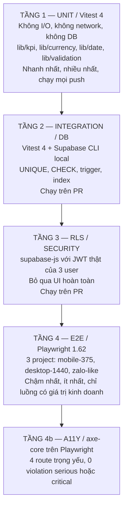
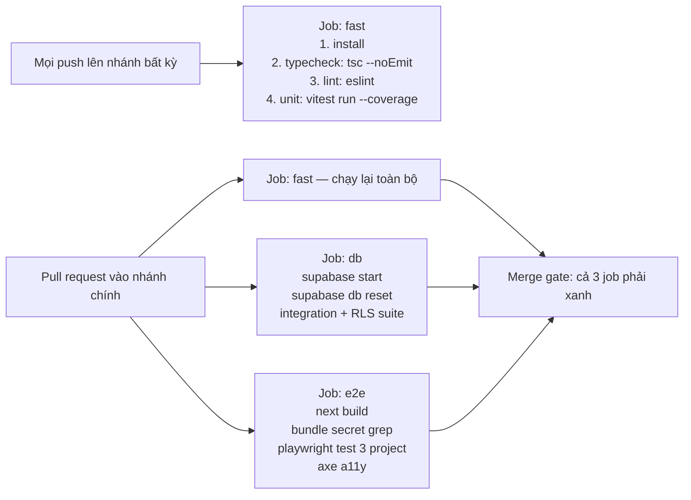

# 08 — Testing Strategy

> Status: DRAFT | Phase: 0 | Last updated: 2026-08-07
> Nguồn sự thật cấp trên: BIKEFORCE_MASTER_SPEC.md → docs/11-decisions.md → tài liệu này

---

## 0-BIS. TRẠNG THÁI THẬT TÍNH TỚI 2026-08-07 (hết Phase 3) — ĐỌC MỤC NÀY TRƯỚC

Mục `0` ngay bên dưới được viết ở Phase 0 khi repository chưa có một dòng code nào. **Nó đã lỗi thời**; giữ lại để không mất dấu lịch sử. Số liệu có thẩm quyền:

| Hạng mục | Trạng thái thật | Lệnh đã chạy |
|---|---|---|
| Build | ✅ exit 0 | `npm run build` |
| Typecheck | ✅ exit 0 | `npm run typecheck` |
| Lint | ✅ exit 0, 0 error 0 warning | `npm run lint` |
| **Unit** | ✅ **140 passed** — `auth/routes` 14 · `date` 33 · `currency` 29 · `validation/report` 47 · `reports/today-cta` 17 | `npm run test:unit` |
| **Integration (DB)** | ✅ **47 passed** | `npm run test:db` |
| **RLS** | ✅ **26 passed** | `npm run test:db` |
| **Tổng** | ✅ **213 passed / 213**, 12 test file | `npm test` |
| E2E (Playwright) | ❌ `N/A — chưa có playwright.config.ts, chưa có e2e/*.spec.ts` | — |
| A11y (axe-core) | ❌ `N/A — chưa chạy` | — |
| `EXPLAIN ANALYZE` | ❌ `N/A — chưa đo, Phase 11` | — |
| Lighthouse | ❌ `N/A — chưa chạy` | — |

**Kiểm chứng trình duyệt của Phase 3** (Chromium 375px + 1440px, script dùng-một-lần, **đã xoá, không commit**): **57 PASS / 1 FAIL**. Mục FAIL duy nhất là **NFR-008 — 7 lần chạm thay vì ≤ 6**, đã ghi thành ISSUE-013 + OQ-18 và **không** phải lỗi cài đặt. Đây **không phải** bộ E2E hồi quy; bốn dòng `N/A` ở trên giữ nguyên giá trị `N/A`.

---

## 0. TRẠNG THÁI THỰC TẾ TẠI THỜI ĐIỂM VIẾT

**Tại thời điểm viết tài liệu này, KHÔNG có bài test nào đã được chạy, vì trong repository chưa tồn tại một dòng code nào.**

Repository hiện chỉ chứa 3 file markdown (`BIKEFORCE_MASTER_SPEC.md`, `PROMPT_FIRST_SESSION.md`, `PROMPT_NEXT_SESSION.md`) cộng với thư mục `docs/` mới tạo. Không có `package.json`, không có `vitest.config.ts`, không có `playwright.config.ts`, không có `supabase/`, chưa `git init` (DEC-027).

Vì vậy, mọi trạng thái test trong tài liệu này là:

| Hạng mục | Trạng thái |
|---|---|
| Build | `N/A — chưa có code` |
| Typecheck | `N/A — chưa có code` |
| Lint | `N/A — chưa có code` |
| Unit | `N/A — chưa có code` |
| Integration / DB | `N/A — chưa có code` |
| RLS | `N/A — chưa có migration` |
| E2E | `N/A — chưa có app` |
| A11y | `N/A — chưa có UI` |
| Coverage | `N/A` |

Tài liệu này là **bản thiết kế bộ test cần viết**, không phải báo cáo kết quả. Mọi tên file, tên case, tên fixture bên dưới đều ở trạng thái **đề xuất, chưa triển khai**. Không được diễn giải bất kỳ dòng nào ở đây là "đã pass".

---

## 1. PHẠM VI & NGUYÊN TẮC

Tài liệu đáp ứng Master Spec §52 (unit tests, integration, RLS tests, E2E, security cases, mobile viewport cases, test checklist) và triển khai chi tiết Master Spec §37, §24, §25, §26, §27, §34, §35, §42.

### 1.1 Bảy nguyên tắc bắt buộc

1. **RLS là biên giới bảo mật thật (DEC-004).** Do đó bộ test RLS **không được** đi qua UI. Test phải nói chuyện trực tiếp với Postgres bằng JWT thật của từng user (Master Spec §24: *"Phải test IDOR/RLS trực tiếp, không chỉ test UI"*).
2. **Logic KPI chỉ tồn tại một nơi (NFR-012, BR-011, DEC-007).** Vì achievement không persist mà tính runtime, phần lớn rủi ro tính toán nằm ở `lib/kpi.ts`. Đây là module được test dày nhất.
3. **Test không bao giờ chạm production (DEC-022).** Toàn bộ integration/RLS chạy trên Supabase local khởi động bằng Supabase CLI (`supabase start`).
4. **Không test phụ thuộc ngày thật.** Ngày nghiệp vụ theo `Asia/Ho_Chi_Minh` (BR-005, NFR-011) là nguồn flaky lớn nhất của hệ thống này — xem §9.
5. **Không đặt mục tiêu coverage 100%** để tránh test rác (brief §16). Ngưỡng: `lib/**` ≥ 90%, tổng thể ≥ 60%.
6. **Mỗi test phải truy về một ID.** Mọi case dưới đây gắn với `BR-xxx` / `FR-xxx` / `NFR-xxx` / `UC-xx`. Case không truy được về ID nào thì phải chất vấn lại: hoặc là thiếu requirement, hoặc là test thừa.
7. **Không viết secret thật vào fixture.** Mật khẩu test là placeholder cố định trong `.env.test.example`; service role key local do `supabase start` sinh ra và chỉ đọc từ env, không hardcode.

### 1.2 Những gì tài liệu này cố ý KHÔNG bao phủ

- Load test / stress test: NFR-015 chỉ yêu cầu thiết kế đúng cho ~18k rows/năm; ở quy mô đó load test không đáng chi phí. Chỉ kiểm `EXPLAIN ANALYZE` (NFR-002).
- Test Supabase Auth nội bộ (GoTrue): đó là hệ thống bên thứ ba, không phải code của dự án.
- Test cross-browser trên thiết bị vật lý: được xử lý bằng **manual matrix** (NFR-009) chứ không phải automation — xem §6.1 và ISSUE-003.
- Visual regression / screenshot diff: v1 không dùng (không có ngân sách CI cho baseline images; DEC không mở khoản này). Ảnh 9:16 được kiểm bằng assertion về content-type + kích thước, không so pixel.

---

## 2. TESTING PYRAMID

### 2.1 Sơ đồ



### 2.2 Bảng tooling — mỗi tầng sở hữu gì và cố ý KHÔNG kiểm gì

| Tầng | Công cụ | Phiên bản | Môi trường | Tầng này SỞ HỮU | Tầng này CỐ Ý KHÔNG kiểm |
|---|---|---|---|---|---|
| Unit | `vitest` | 4.1.10 (verified latest stable on 2026-08-07; pin chính xác chốt ở Phase 1 — DEC-002) | Node, không mạng, không DB | Công thức achievement (BR-004, BR-014, BR-015), ngưỡng badge (BR-023), format tiền (BR-010, DEC-008), ngày nghiệp vụ VN (BR-005, DEC-009), Zod schema (BR-006, BR-016, BR-017, BR-018) | Không kiểm quyền, không kiểm SQL, không kiểm render UI, không kiểm Supabase client. Nếu một unit test cần mock Supabase thì logic đó đang đặt sai chỗ — phải kéo về `lib/` hoặc `services/`. |
| Integration / DB | `vitest` + Supabase CLI (`supabase start`) + `pg` | vitest 4.1.10; Supabase CLI **2.111.0**; `pg` **8.22.0** | Postgres local trong Docker, kết nối **trực tiếp bằng role `postgres`** qua `SUPABASE_DB_URL` để dựng/dọn fixture. ⚠ **Đổi so với bản Phase 0** — xem DEC-031: `service_role` **không** có DML trên hai bảng nghiệp vụ (BYPASSRLS không vượt qua GRANT), nên không dùng service-role client làm fixture được. Tài khoản test vẫn tạo qua `auth.admin.createUser` thật (đường của UC-17) | `UNIQUE(sales_id, report_date)` (BR-001), toàn bộ `CHECK` constraint, trigger `set_updated_at` / `handle_new_user` / `guard_report_transition` / `guard_profile_self_update`, hàm `vn_today()` / `is_admin()` / `is_active_sales()`, kế hoạch index (NFR-002) | Không kiểm RLS (service role bypass RLS — đó là mục đích của tầng 3). Không kiểm UI. Không kiểm Server Action. |
| RLS / Security | `@supabase/supabase-js` chạy trong Vitest | 2.112.2 | Cùng Postgres local, nhưng kết nối bằng **anon key + JWT thật** của từng user | Toàn bộ policy `profiles_*` và `reports_*`, IDOR (Master Spec §34), deny-by-default (NFR-004), tách biệt salesA/salesB/admin/inactive | Không kiểm giao diện, không kiểm redirect, không kiểm middleware. Middleware chỉ là defense-in-depth và UX (DEC-004) — nó được kiểm ở tầng E2E. |
| E2E | `@playwright/test` | 1.62.1 (verified latest stable on 2026-08-07) | App build production (`next build && next start`) trỏ vào Supabase local | Luồng nghiệp vụ đầu-cuối (UC-01…UC-21), quy tắc "save trước — export sau" (BR-002, FR-017), guard route theo role (FR-004), viewport mobile, khôi phục lỗi (NFR-010) | Không dùng E2E để kiểm công thức toán (đã có unit). Không dùng E2E để kiểm phân quyền ở tầng dữ liệu (đã có RLS). Không dùng E2E làm test hồi quy pixel. |
| A11y | `@axe-core/playwright` | phiên bản chốt ở Phase 11 (chưa verify trên npm ngày 2026-08-07) | Chạy trong project `desktop-1440` và `mobile-375` | Vi phạm WCAG máy dò được: contrast, label, vai trò ARIA, thứ tự heading (NFR-007) | Không thay thế **manual keyboard walkthrough** (§8.2). axe chỉ bắt được khoảng 30–40% vấn đề a11y thực tế; phần còn lại phải kiểm tay. |

### 2.3 Mục tiêu coverage

| Phạm vi | Ngưỡng | Lý do |
|---|---|---|
| `lib/**` | ≥ 90% statements + branches | Toàn bộ business logic tập trung ở đây (BR-011, NFR-012). Branch coverage quan trọng hơn statement vì phần lớn bug KPI nằm ở nhánh `target = 0` và `actual = null`. |
| Toàn dự án | ≥ 60% | Phần lớn `app/**` là layout/route mỏng; ép coverage cao ở đó chỉ tạo test rác. |
| `services/**` | Không đặt ngưỡng riêng | Được bao phủ gián tiếp bởi tầng Integration/RLS, nơi assertion có giá trị thật hơn. |

Coverage provider: `v8`. Loại trừ khỏi coverage: `types/database.types.ts` (generate tự động), `**/*.config.*`, `supabase/**`, `e2e/**`.

### 2.4 Cấu trúc thư mục test

`✅` = đã tồn tại và đã chạy xanh. `⏳` = chưa triển khai, thuộc phase sau.

> Số liệu dưới đây **đo lại từng file** ngày 2026-08-07 (Phase 5) bằng `npx vitest run --project <ten> <file>`.
> Ba con số từng bị ghi nhầm — `currency` 29 (thật: **36**), `constraints` 15 (thật: **16**),
> `db-functions` 11 (thật: **12**) — đã sửa. Tổng hiện tại: **unit 242 · integration 40 · rls 33 = 315**.

```text
lib/
  auth/routes.ts      lib/auth/routes.test.ts     ✅ 14 test
  kpi.ts              lib/kpi.test.ts             ✅ 46 test (Phase 5 — DEC-038 đã đóng ISSUE-008)
  currency.ts         lib/currency.test.ts        ✅ 36 test (kéo lên Phase 3 — DEC-032)
  date.ts             lib/date.test.ts            ✅ 33 test (kéo lên Phase 3 — DEC-032)
  reports/today-cta.ts  lib/reports/today-cta.test.ts  ✅ 17 test — ba trạng thái FR-007 + BR-002
  validation/
    auth.ts                                       ✅ phủ gián tiếp qua login-form + signInAction
    report.ts         lib/validation/report.test.ts   ✅ 96 test (47 Phase 3 + 49 Phase 4)
    profile.ts        lib/validation/profile.test.ts  ⏳ Phase 10
tests/
  integration/
    setup.ts                        ✅ pool `pg` + auth.admin client + chặn an toàn chỉ-local
    daily-reports.constraints.test.ts   ✅ 16 test — UNIQUE, CHECK, FK, handle_new_user
    daily-reports.triggers.test.ts      ✅  6 test — guard_report_transition, set_updated_at
    profiles.triggers.test.ts           ✅  6 test — guard_profile_self_update
    db-functions.test.ts                ✅ 12 test — vn_today, is_admin, is_active_sales, GRANT
    indexes.test.ts                     ⏳ Phase 11 — EXPLAIN ANALYZE, NFR-002
  rls/
    setup.ts                        ✅ đăng nhập salesA / salesB / admin / inactive bằng JWT thật
    daily-reports.rls.test.ts       ✅ 16 test
    profiles.rls.test.ts            ✅  7 test
    anon.rls.test.ts                ✅  3 test
    report-service.rls.test.ts      ✅  7 test (Phase 4) — `services/reports.completeEveningReport()`
                                        chạy dưới JWT THẬT. Cố ý KHÔNG ở tầng integration:
                                        role `postgres` có `rolbypassrls` nên bài test ở đó sẽ
                                        "xanh" kể cả khi policy sai hoàn toàn
e2e/                                ⏳ Phase 11 (toàn bộ)
vitest.config.mts                   ✅ 3 project: "unit", "integration", "rls"
playwright.config.ts                ⏳ Phase 11 — 3 project: mobile-375, desktop-1440, zalo-like
```

**Ba ghi chú từ việc chạy thật ở Phase 2:**

1. **Tên file là `vitest.config.mts`, không phải `.ts`.** Với `.ts`, Vite 7 cảnh báo `ESM syntax in a file loaded as CommonJS` và cho biết `configLoader: 'native'` sẽ thành mặc định ở major sau — tức là cảnh báo hôm nay là lỗi ngày mai. Đuôi `.mts` xử lý dứt điểm mà không phải đặt `"type": "module"` cho cả dự án (việc đó sẽ đụng `next.config.ts` và `postcss.config.mjs`).
2. **Vitest KHÔNG tự nạp `.env.local` ở mode `test`.** Phải gọi `loadEnv('test', rootDir, '')` của Vite trong config rồi truyền vào `test.env` của từng project. Thiếu bước này thì `SUPABASE_DB_URL` là `undefined` và toàn bộ tầng 2/3 hỏng với thông báo khó hiểu.
3. **`integration` và `rls` đặt `fileParallelism: false`** vì cùng chạm một database. Không có cơ chế tự bỏ qua khi database offline — bỏ qua im lặng sẽ khiến bộ test "xanh" mà chưa kiểm gì, đúng thứ Master Spec §42 cấm.
4. **Hai file env, hai mục đích — đây là hàng rào chống xoá nhầm dữ liệu production.**
   `.env.local` phục vụ **ứng dụng** và sẽ trỏ vào Supabase **cloud** ngay khi Phase 2 nối xong.
   `.env.test.local` phục vụ **bộ test** và luôn trỏ vào Supabase **local**; vì `loadEnv('test', …)` nạp nó **sau** `.env.local` nên nó đè lên.
   Cần thiết vì tầng 2 và 3 **xoá và ghi đè dữ liệu** — một lần `npm test` đọc nhầm cấu hình cloud là mất dữ liệu thật (DEC-022).
   **Đã kiểm chứng thật** (2026-08-07): đặt `.env.local` trỏ một URL cloud giả rồi chạy `npm run test:db` → vẫn **66/66 PASS**, tức bộ test vẫn chạy trên local. Ngoài ra `tests/integration/setup.ts` còn một chặn thứ hai: URL không phải `127.0.0.1`/`localhost` thì ném lỗi ngay, không chạy tiếp.

**Lệnh:**

```bash
npm run test        # cả 3 project
npm run test:unit   # chỉ tầng 1 — không cần Docker
npm run test:db     # tầng 2 + 3 — CẦN `npm run db:start` đang chạy
```

---

## 3. UNIT TEST CATALOGUE

Bắt buộc theo Master Spec §37 và brief §16. Không test nào ở tầng này được chạm mạng, filesystem, hay Supabase.

### 3.1 `lib/kpi.ts` — `calculateAchievement(target: number, actual: number | null, metric: KpiMetric): AchievementResult`

`AchievementResult = { percent: number | null; status: AchievementStatus; display: string; surplus: number | null }`.

`KpiMetric = 'VISIT_POINTS' | 'SALES_QUANTITY' | 'REVENUE' | 'CUSTOMER_VISITS'` — tham số thứ ba chốt ở **DEC-038**; nó chỉ dùng để dựng chuỗi số vượt tuyệt đối, không tham gia phép tính.

| File under test | Case name | Input | Expected |
|---|---|---|---|
| `lib/kpi.ts` | `target=0 & actual=0 → coi là đạt cam kết 100%` | `(0, 0)` | `{ percent: 100, status: 'EXCEEDED', display: '100,0%', surplus: null }` — BR-015 **APPROVED** (OQ-11) |
| `lib/kpi.ts` | `target=0 & actual>0 → không NaN, không Infinity, hiển thị SỐ VƯỢT tuyệt đối` | `(0, 5, 'SALES_QUANTITY')` | `{ percent: null, status: 'EXCEEDED', display: '+5 xe', surplus: 5 }`, `achievementLabel()` cho `"Vượt kế hoạch"` — BR-015 **APPROVED** (OQ-11), DEC-025, DEC-038 |
| `lib/kpi.ts` | `actual > target → cho phép vượt 100%, không clamp` | `(8, 10)` | `{ percent: 125, status: 'EXCEEDED', display: '125,0%' }` — BR-004, Master Spec §9 |
| `lib/kpi.ts` | `actual < target` | `(10, 8)` | `{ percent: 80, status: 'NEAR', display: '80,0%' }` — BR-014, Master Spec §9 |
| `lib/kpi.ts` | `actual = target` | `(10, 10)` | `{ percent: 100, status: 'EXCEEDED', display: '100,0%' }` — BR-023 |
| `lib/kpi.ts` | `actual = null → chưa có số liệu cuối ngày` | `(10, null)` | `{ percent: null, status: 'PENDING', display: '—' }` — BR-023 "Chờ số liệu"; xem cảnh báo §3.1.1 |
| `lib/kpi.ts` | `vượt rất xa vẫn không clamp, không tràn định dạng` | `(1, 125)` | `{ percent: 12500, status: 'EXCEEDED', display: '12.500,0%' }` — BR-004; `vi-VN` phân nhóm nghìn nên có dấu `.`, khớp `docs/05 §7.3` (`1.250,0%`) |
| `lib/kpi.ts` | `kết quả không bao giờ là NaN` | `(0, 0)`, `(0, 7)`, `(10, null)` | `Number.isNaN(result.percent)` là `false` với mọi input; `display` không chứa chuỗi `'NaN'` — Master Spec §9, §25 |
| `lib/kpi.ts` | `kết quả không bao giờ là Infinity` | `(0, 1)` | `Number.isFinite(result.percent) || result.percent === null` là `true`; `display` không chứa `'∞'` hay `'Infinity'` — Master Spec §9, §25 |
| `lib/kpi.ts` | `làm tròn 1 chữ số thập phân ở display, không làm tròn ở percent` | `(3, 1)` | `percent ≈ 33.3333…` (giá trị thô), `display === '33,3%'` — BR-014 |
| `lib/kpi.ts` | `dấu thập phân là dấu phẩy theo vi-VN` | `(8, 10)` | `display` chứa `','`, **không** chứa `'.'` làm dấu thập phân — DEC-008 |
| `lib/kpi.ts` | `doanh thu bigint lớn không mất chính xác ở mức hiển thị` | `(100000000000, 99999999999)` | `display === '100,0%'` (làm tròn 1 chữ số từ `99.999999999`); `percent` giữ giá trị thô — BR-017 |
| `lib/kpi.ts` | `hàm là pure, không phụ thuộc thời gian` | gọi cùng input 2 lần cách nhau bởi `vi.setSystemTime` khác | Hai kết quả bằng nhau — BR-011 |

#### 3.1.1 Hai mâu thuẫn — ✅ ĐÃ CHỐT ngày 2026-08-07 (DEC-038, ISSUE-008 CLOSED)

Giữ nguyên phần ghi nhận dưới đây làm vết lịch sử. **Cả hai đều đã được người dùng trả lời**, và câu trả lời trùng với đề xuất mặc định — nên bảng §3.1 ở trên **không phải viết lại**, chỉ bổ sung tham số `metric` và trường `surplus`:

- Brief §8 viết `percent: null` **chỉ** xảy ra ở trường hợp `target=0 && actual>0`. Nhưng trường hợp `actual = null` (chưa nhập báo cáo cuối ngày) cũng không thể có `percent` là số hợp lệ. Đề xuất giải quyết: cho phép `percent: null` ở **cả hai** trường hợp và phân biệt chúng bằng `status` (`'EXCEEDED'` vs `'PENDING'`). Ghi thành sub-bullet của **OQ-11**.
- `getAchievementStatus(null)` theo BR-023 trả `'PENDING'` ("Chờ số liệu"). Nhưng trường hợp `target=0 && actual>0` cũng có `percent === null` mà nhãn nghiệp vụ là "Vượt kế hoạch". Vì vậy `calculateAchievement` **không được** ủy quyền mù quáng cho `getAchievementStatus(percent)` ở nhánh này mà phải tự đặt `status`. Ghi thành sub-bullet của **OQ-11**.

~~Nếu OQ-11 được trả lời khác đề xuất mặc định…~~ — **không xảy ra.** OQ-11 đã trả lời đúng theo đề xuất: `percent: null` cho **cả hai** ca, phân biệt bằng `status`; và `calculateAchievement` **tự đặt** `status = 'EXCEEDED'` ở nhánh `target = 0 && actual > 0` thay vì ủy quyền cho `getAchievementStatus(null)`. Cả hai điều này đã có test khoá lại trong `lib/kpi.test.ts`.

**Ba nhóm case bổ sung ở Phase 5** (ngoài bảng §3.1, cùng file test):

| Nhóm | Nội dung |
|---|---|
| `formatMetricValue` | 4 đơn vị (`điểm` / `xe` / `khách` / VND đầy đủ), giá trị `0`, phân nhóm nghìn (`1.500 xe`), `null` → `'—'`, đầu vào hỏng → `'—'` |
| `achievementLabel` | Phân biệt `"Vượt mục tiêu"` (target thật, ≥100%) với `"Vượt kế hoạch"` (`target = 0 && actual > 0`); ba nhãn còn lại theo BR-023 |
| `isKpiAchievedDay` | BR-024 — cả 4 `EXCEEDED` → `true`; một `NEAR` hoặc một `PENDING` → `false`; hai ca `target = 0` đều tính là đạt; **không đủ 4 chỉ tiêu → `false`** |

### 3.2 `lib/kpi.ts` — `getAchievementStatus(pct: number | null): 'EXCEEDED' | 'NEAR' | 'MISSED' | 'PENDING'`

Ngưỡng theo BR-023: ≥ 100% → `EXCEEDED`; 80–99.99% → `NEAR`; < 80% → `MISSED`; chưa có actual → `PENDING`.

| File under test | Case name | Input | Expected |
|---|---|---|---|
| `lib/kpi.ts` | `dưới biên NEAR một chút` | `79.99` | `'MISSED'` — BR-023 |
| `lib/kpi.ts` | `đúng biên dưới của NEAR` | `80` | `'NEAR'` — BR-023 (biên inclusive) |
| `lib/kpi.ts` | `sát biên trên của NEAR` | `99.99` | `'NEAR'` — BR-023 |
| `lib/kpi.ts` | `đúng biên EXCEEDED` | `100` | `'EXCEEDED'` — BR-023 (biên inclusive) |
| `lib/kpi.ts` | `chưa có số liệu` | `null` | `'PENDING'` — BR-023 |
| `lib/kpi.ts` | `số 0` | `0` | `'MISSED'` — BR-023 |
| `lib/kpi.ts` | `âm không xảy ra trong nghiệp vụ nhưng phải an toàn` | `-5` | `'MISSED'` (không throw) — BR-006 chặn ở tầng nhập; hàm hiển thị không được nổ |
| `lib/kpi.ts` | `vượt xa` | `12500` | `'EXCEEDED'` — BR-004 |
| `lib/kpi.ts` | `79.999… vẫn là MISSED chứ không được làm tròn lên 80` | `79.995` | `'MISSED'` — status tính từ **giá trị thô**, không từ chuỗi đã làm tròn |
| `lib/kpi.ts` | `99.96 → badge NEAR nhưng display là 100,0%` | `99.96` | `'NEAR'`; đồng thời `calculateAchievement` cho ra `display === '100,0%'` |

Dòng cuối là bẫy thật: người dùng sẽ thấy chữ **"100,0%"** cạnh badge **"Gần đạt"**. Test này tồn tại để buộc nhóm phát triển nhìn thẳng vào mâu thuẫn đó và quyết định (a) chấp nhận, (b) tính status từ giá trị đã làm tròn, hay (c) đổi cách hiển thị. Ghi thành sub-bullet của **OQ-11**.

### 3.3 `lib/currency.ts` — `formatCurrencyVND(value: number): string`

Cài đặt: `Intl.NumberFormat('vi-VN', { style: 'currency', currency: 'VND', maximumFractionDigits: 0 })` (DEC-008, Master Spec §26).

| File under test | Case name | Input | Expected |
|---|---|---|---|
| `lib/currency.ts` | `số 0` | `0` | `'0 ₫'` |
| `lib/currency.ts` | `một nghìn — có dấu phân cách nghìn kiểu vi-VN` | `1000` | `'1.000 ₫'` |
| `lib/currency.ts` | `ví dụ chuẩn của Master Spec §26` | `125000000` | `'125.000.000 ₫'` |
| `lib/currency.ts` | `sát trần 12 chữ số — không xuống ký hiệu rút gọn` | `99999999999` | `'99.999.999.999 ₫'` |
| `lib/currency.ts` | `đúng trần BR-017` | `100000000000` | `'100.000.000.000 ₫'` |
| `lib/currency.ts` | `dùng dấu chấm làm phân cách nghìn, không dùng dấu phẩy` | `125000000` | Chuỗi kết quả **không** chứa `','` |
| `lib/currency.ts` | `không hiện phần thập phân` | `1000` | Chuỗi kết quả không chứa `',00'` — `maximumFractionDigits: 0` |
| `lib/currency.ts` | `số âm không phải dữ liệu hợp lệ nhưng hàm không được throw` | `-1000` | Trả về chuỗi (không throw). Việc chặn số âm là của Zod + DB CHECK (BR-006), không phải của formatter. |

**Cảnh báo bắt buộc khi viết assertion (đã kiểm chứng bằng Node 22.20.0 ngày 2026-08-07):** `Intl.NumberFormat('vi-VN', …)` chèn **NO-BREAK SPACE `U+00A0`** giữa số và ký hiệu `₫`, không phải space thường `U+0020`. Chuỗi thực tế là `"125.000.000 ₫"`. Nếu test viết `expect(formatCurrencyVND(125000000)).toBe('125.000.000 ₫')` bằng space thường thì **test sẽ fail dù code đúng**.

Quy ước bắt buộc cho toàn bộ dự án:

```ts
// tests/helpers/text.ts (đề xuất, chưa triển khai)
export const nbsp = (s: string) => s.replace(/ /g, ' ');
// dùng: expect(nbsp(formatCurrencyVND(125000000))).toBe('125.000.000 ₫');
```

Cùng quy ước này áp dụng cho mọi assertion E2E có so chuỗi tiền (§6, §7). Kết quả `Intl` còn phụ thuộc phiên bản ICU của Node, nên CI phải khoá Node 22 (§10) để tránh lệch giữa máy dev và CI.

### 3.4 `lib/currency.ts` — `parseCurrencyInput(raw: string): number | null`

Hợp đồng suy ra từ BR-006 (integer ≥ 0), BR-010 (lưu số nguyên VND, không lưu chuỗi đã format) và §14 brief (hiển thị định dạng nghìn khi blur, lưu số nguyên). **`parseCurrencyInput` chỉ chuyển đổi, không thẩm định nghiệp vụ** — trần BR-017 do Zod và DB CHECK gác, không phải hàm này.

| File under test | Case name | Input | Expected |
|---|---|---|---|
| `lib/currency.ts` | `số thuần` | `'125000000'` | `125000000` |
| `lib/currency.ts` | `chuỗi đã format kiểu vi-VN` | `'125.000.000'` | `125000000` |
| `lib/currency.ts` | `chuỗi có ký hiệu tiền tệ và NBSP` | `'125.000.000 ₫'` | `125000000` |
| `lib/currency.ts` | `khoảng trắng thừa hai đầu` | `'  1.000  '` | `1000` |
| `lib/currency.ts` | `chuỗi rỗng` | `''` | `null` |
| `lib/currency.ts` | `chỉ khoảng trắng` | `'   '` | `null` |
| `lib/currency.ts` | `chữ cái thuần — rác` | `'abc'` | `null` |
| `lib/currency.ts` | `số lẫn chữ — rác` | `'12abc'` | `null` |
| `lib/currency.ts` | `ký tự đặc biệt — rác` | `'1e9'` | `null` (không được hiểu là `1000000000`) |
| `lib/currency.ts` | `emoji và ký tự lạ — rác` | `'1.000₫₫₫x'` | `null` |
| `lib/currency.ts` | `số âm bị từ chối` | `'-1000'` | `null` — BR-006 |
| `lib/currency.ts` | `số thập phân bị từ chối — VND không có phần lẻ` | `'1,5'` | `null` — BR-010 |
| `lib/currency.ts` | `số thập phân kiểu Anh cũng bị từ chối` | `'1.5'` | `null` (chú ý: `'1.5'` khác `'1.500'`; case này và case kế bên phải cùng tồn tại để khoá quy tắc phân cách) |
| `lib/currency.ts` | `một nghìn rưỡi viết đúng kiểu vi-VN` | `'1.500'` | `1500` |
| `lib/currency.ts` | `vượt trần vẫn parse ra số — việc từ chối là của Zod` | `'100000000001'` | `100000000001` (KHÔNG phải `null`) — ranh giới trách nhiệm với BR-017 |
| `lib/currency.ts` | `số vượt Number.MAX_SAFE_INTEGER bị từ chối` | `'99999999999999999999'` | `null` — chống mất chính xác trước khi gửi xuống `bigint` |
| `lib/currency.ts` | `khứ hồi format rồi parse là bất biến` | với mọi `v` trong `[0, 1000, 125000000, 99999999999]`: `parseCurrencyInput(formatCurrencyVND(v))` | `=== v` |

Dòng cuối (property/round-trip) là test có giá trị cao nhất trong nhóm này: nó khoá cặp format/parse lại với nhau nên không thể sửa một bên mà quên bên kia.

### 3.5 `lib/date.ts`

Ba hàm theo brief §8: `getVietnamToday()`, `formatVietnamDate(date)`, `getVietnamMonthRange(yyyyMM)`. Cài đặt dùng `Intl.DateTimeFormat('en-CA', { timeZone: 'Asia/Ho_Chi_Minh' })`, không thêm dependency timezone (DEC-009).

#### 3.5.1 `getVietnamToday(): string` — biên ngày UTC (NFR-011, BR-005, Master Spec §27)

Việt Nam là UTC+7, không có DST. Vì vậy ngày nghiệp vụ đổi lúc **17:00Z** của ngày hôm trước.

| File under test | Case name | Input (đóng băng đồng hồ) | Expected |
|---|---|---|---|
| `lib/date.ts` | `một phút trước biên đổi ngày UTC` | `vi.setSystemTime(new Date('2026-08-06T16:59:00Z'))` | `'2026-08-06'` |
| `lib/date.ts` | `một phút sau biên đổi ngày UTC` | `vi.setSystemTime(new Date('2026-08-06T17:01:00Z'))` | `'2026-08-07'` — **phải khác kết quả dòng trên** |
| `lib/date.ts` | `đúng biên 17:00Z đã thuộc ngày mới` | `vi.setSystemTime(new Date('2026-08-06T17:00:00Z'))` | `'2026-08-07'` |
| `lib/date.ts` | `23:30 giờ VN vẫn là ngày cũ` | `vi.setSystemTime(new Date('2026-08-06T16:30:00Z'))` | `'2026-08-06'` |
| `lib/date.ts` | `00:30 giờ VN đã là ngày mới` | `vi.setSystemTime(new Date('2026-08-06T17:30:00Z'))` | `'2026-08-07'` |
| `lib/date.ts` | `nửa đêm UTC vẫn là 07:00 sáng VN cùng ngày` | `vi.setSystemTime(new Date('2026-08-07T00:00:00Z'))` | `'2026-08-07'` |
| `lib/date.ts` | `qua mốc đổi tháng` | `vi.setSystemTime(new Date('2026-08-31T17:01:00Z'))` | `'2026-09-01'` |
| `lib/date.ts` | `qua mốc đổi năm` | `vi.setSystemTime(new Date('2026-12-31T17:01:00Z'))` | `'2027-01-01'` |
| `lib/date.ts` | `năm nhuận 29/02` | `vi.setSystemTime(new Date('2028-02-28T17:01:00Z'))` | `'2028-02-29'` |
| `lib/date.ts` | `kết quả luôn đúng định dạng YYYY-MM-DD` | mọi case ở trên | khớp `/^\d{4}-\d{2}-\d{2}$/`, không có `T`, không có `Z` |
| `lib/date.ts` | `không phụ thuộc timezone của tiến trình` | chạy lại toàn bộ bảng với `process.env.TZ = 'UTC'`, `'America/New_York'`, `'Asia/Ho_Chi_Minh'`, `'Pacific/Kiritimati'` | Kết quả **giống hệt nhau** ở cả 4 lần — NFR-011 |

Dòng cuối là dòng quan trọng nhất: CI của Vercel/GitHub chạy ở UTC còn máy dev ở `Asia/Ho_Chi_Minh`. Nếu hàm vô tình rơi về `Date.prototype.getDate()` thì unit test trên máy dev sẽ xanh và CI sẽ đỏ (hoặc ngược lại). `Pacific/Kiritimati` là UTC+14 — cố tình chọn để chứng minh hàm không "ăn theo" timezone máy.

#### 3.5.2 `formatVietnamDate(date: string): string`

| File under test | Case name | Input | Expected |
|---|---|---|---|
| `lib/date.ts` | `ngày mẫu của brief` | `'2026-08-07'` | `'Thứ Sáu, 07/08/2026'` — xem cảnh báo bên dưới |
| `lib/date.ts` | `chủ nhật` | `'2026-08-09'` | `'Chủ Nhật, 09/08/2026'` |
| `lib/date.ts` | `ngày một chữ số phải có số 0 đứng đầu` | `'2026-08-01'` | khớp `/^.+, 01\/08\/2026$/` |
| `lib/date.ts` | `không lệch ngày do parse ISO theo UTC` | `'2026-08-07'` với `process.env.TZ='Pacific/Kiritimati'` | vẫn là ngày `07/08/2026`, không lùi thành `06/08` |
| `lib/date.ts` | `chuỗi rác` | `'not-a-date'` | Không throw; trả chuỗi rỗng hoặc `'—'`. Hành vi chính xác chốt ở Phase 5 và ghi vào docs/11. |

> **Sai lệch đã phát hiện và ĐÃ SỬA (2026-08-07):** bản nháp ban đầu nêu ví dụ `formatVietnamDate('2026-08-07')` → `Thứ Năm, 07/08/2026`. Đã kiểm chứng bằng `Intl.DateTimeFormat('vi-VN', { weekday: 'long', timeZone: 'Asia/Ho_Chi_Minh' })` trên Node 22.20.0: **2026-08-07 là Thứ Sáu**, không phải Thứ Năm. Ví dụ sai đã được sửa ở `docs/01-business-analysis.md`, `docs/02-database-design.md` và `docs/04-system-architecture.md`. Đây là lỗi ví dụ, không phải thay đổi quy tắc nghiệp vụ. Bài học giữ lại: **không viết thứ trong tuần vào tài liệu mà không tính bằng `Intl`.**

#### 3.5.3 `getVietnamMonthRange(yyyyMM: string): { from: string; to: string }`

| File under test | Case name | Input | Expected |
|---|---|---|---|
| `lib/date.ts` | `tháng 31 ngày` | `'2026-08'` | `{ from: '2026-08-01', to: '2026-08-31' }` |
| `lib/date.ts` | `tháng 30 ngày` | `'2026-04'` | `{ from: '2026-04-01', to: '2026-04-30' }` |
| `lib/date.ts` | `tháng 2 năm thường` | `'2026-02'` | `{ from: '2026-02-01', to: '2026-02-28' }` |
| `lib/date.ts` | `tháng 2 năm nhuận` | `'2028-02'` | `{ from: '2028-02-01', to: '2028-02-29' }` |
| `lib/date.ts` | `tháng 12 không tràn sang năm sau` | `'2026-12'` | `{ from: '2026-12-01', to: '2026-12-31' }` |
| `lib/date.ts` | `chuỗi sai định dạng` | `'2026-13'` | Không throw; hành vi chốt ở Phase 5 (đề xuất: ném lỗi có kiểu và để caller fallback về tháng hiện tại) |

Khoảng trả về được dùng cho filter tháng của FR-021 và FR-028; test phải khẳng định khoảng là **inclusive hai đầu** để truy vấn `report_date between from and to` không bỏ sót ngày cuối tháng.

### 3.6 `lib/validation/**` — Zod 4.4.3 schema

Master Spec §25 cấm: số âm, invalid date, `NaN`, `Infinity`, invalid revenue, duplicate report. Duplicate report được gác ở DB (BR-001) nên nằm ở tầng Integration, không ở đây.

| File under test | Case name | Input | Expected |
|---|---|---|---|
| `lib/validation/report.test.ts` | `từ chối số âm ở target_sales_quantity` | `{ target_sales_quantity: -1, … }` | `success: false`, issue path `['target_sales_quantity']` — BR-006 |
| `lib/validation/report.test.ts` | `từ chối số âm ở target_revenue` | `{ target_revenue: -1, … }` | `success: false` — BR-006 |
| `lib/validation/report.test.ts` | `từ chối NaN` | `{ target_revenue: NaN, … }` | `success: false` — Master Spec §25 |
| `lib/validation/report.test.ts` | `từ chối Infinity` | `{ target_revenue: Infinity, … }` | `success: false` — Master Spec §25 |
| `lib/validation/report.test.ts` | `từ chối -Infinity` | `{ target_revenue: -Infinity, … }` | `success: false` |
| `lib/validation/report.test.ts` | `từ chối số thập phân ở cột integer` | `{ target_sales_quantity: 1.5, … }` | `success: false` — BR-006 |
| `lib/validation/report.test.ts` | `từ chối chuỗi rác ở cột số` | `{ target_revenue: 'abc', … }` | `success: false` |
| `lib/validation/report.test.ts` | `chấp nhận 0 — 0 là giá trị hợp lệ` | `{ target_sales_quantity: 0, … }` | `success: true` — BR-006 nói ≥ 0, không phải > 0 |
| `lib/validation/report.test.ts` | `từ chối doanh thu vượt trần` | `{ target_revenue: 100000000001, … }` | `success: false` — BR-017 |
| `lib/validation/report.test.ts` | `chấp nhận đúng trần doanh thu` | `{ target_revenue: 100000000000, … }` | `success: true` — BR-017 (biên inclusive) |
| `lib/validation/report.test.ts` | `từ chối ngày tương lai` | `{ report_date: '2026-08-08' }` với đồng hồ đóng băng ở `2026-08-07T03:00:00Z` | `success: false` — BR-016 |
| `lib/validation/report.test.ts` | `chấp nhận đúng ngày hôm nay theo giờ VN` | `{ report_date: '2026-08-07' }`, đồng hồ `2026-08-06T17:01:00Z` | `success: true` — BR-005, BR-021 |
| `lib/validation/report.test.ts` | `từ chối ngày quá khứ ở form tạo mới` | `{ report_date: '2026-08-06' }`, đồng hồ `2026-08-07T03:00:00Z` | `success: false` — BR-021, **phụ thuộc OQ-12** |
| `lib/validation/report.test.ts` | `từ chối ngày không hợp lệ` | `{ report_date: '2026-02-30' }` | `success: false` — Master Spec §25 |
| `lib/validation/report.test.ts` | `từ chối định dạng ngày sai` | `{ report_date: '07/08/2026' }` | `success: false` |
| `lib/validation/report.test.ts` | `từ chối planned_route rỗng` | `{ planned_route: '' }` | `success: false` — CHECK length 1..300 |
| `lib/validation/report.test.ts` | `từ chối planned_route chỉ có khoảng trắng` | `{ planned_route: '   ' }` | `success: false` (schema phải `trim()` trước khi đo độ dài) |
| `lib/validation/report.test.ts` | `từ chối planned_route 301 ký tự` | `'a'.repeat(301)` | `success: false` |
| `lib/validation/report.test.ts` | `chấp nhận planned_route 300 ký tự` | `'a'.repeat(300)` | `success: true` |
| `lib/validation/report.test.ts` | `từ chối target_sales_quantity > 10000` | `10001` | `success: false` — CHECK 0..10000 |
| `lib/validation/report.test.ts` | `từ chối target_visit_points > 1000` | `1001` | `success: false` — CHECK 0..1000, OQ-01 |
| `lib/validation/report.test.ts` | `từ chối target_customer_visits > 1000` | `1001` | `success: false` — CHECK 0..1000 |
| `lib/validation/report.test.ts` | `evening_note optional — null hợp lệ` | `{ evening_note: null }` | `success: true` — BR-018 |
| `lib/validation/report.test.ts` | `từ chối evening_note 1001 ký tự` | `'a'.repeat(1001)` | `success: false` — BR-018 |
| `lib/validation/report.test.ts` | `chấp nhận evening_note 1000 ký tự có dấu tiếng Việt` | `'ừ'.repeat(1000)` | `success: true` (đo theo ký tự, không theo byte) — BR-018 |
| `lib/validation/report.test.ts` | `schema cuối ngày bắt buộc đủ 4 chỉ số actual` | thiếu `actual_revenue` | `success: false` — BR-007, `ck_completed_requires_actuals` |
| `lib/validation/report.test.ts` | `báo lỗi cho TẤT CẢ field sai, không dừng ở field đầu` | 3 field sai cùng lúc | `error.issues.length === 3` — phục vụ rule `error-summary` ở docs/05 |
| `lib/validation/report.test.ts` | `thông điệp lỗi là tiếng Việt` | `{ target_revenue: -1 }` | `issues[0].message` là chuỗi tiếng Việt do dự án đặt, không phải chuỗi mặc định tiếng Anh của Zod |
| `lib/validation/profile.test.ts` | `từ chối email sai định dạng` | `'not-an-email'` | `success: false` — BR-025 |
| `lib/validation/profile.test.ts` | `từ chối phone sai pattern` | `'abc-123'` | `success: false` — CHECK `^[0-9+ ]{8,15}$` |
| `lib/validation/profile.test.ts` | `chấp nhận phone null` | `null` | `success: true` |
| `lib/validation/profile.test.ts` | `từ chối full_name rỗng sau btrim` | `'   '` | `success: false` — CHECK length 1..100 |
| `lib/validation/profile.test.ts` | `từ chối full_name 101 ký tự` | `'a'.repeat(101)` | `success: false` |
| `lib/validation/profile.test.ts` | `schema Sales tự sửa hồ sơ KHÔNG chứa role / is_active / email` | object có `role: 'ADMIN'` | `role` bị strip hoặc `success: false` — BR-012, đối ứng trigger `guard_profile_self_update` |

---

## 4. INTEGRATION / DB TEST CATALOGUE

Chạy trên Supabase local (`supabase start`, DEC-022). Kết nối bằng **service role** để dựng và dọn fixture — ở tầng này ta cố ý bỏ qua RLS để kiểm riêng constraint và trigger. Mỗi test file tự truncate `daily_reports` (và `profiles` khi cần) trong `beforeEach` để không lệ thuộc thứ tự chạy.

Mã lỗi Postgres dùng trong assertion: `23505` unique_violation, `23514` check_violation, `23503` foreign_key_violation, `P0001` raise_exception (do trigger `raise exception` phát ra).

### 4.1 Persistence và unique constraint

| Test | Thao tác | Kỳ vọng | Truy vết |
|---|---|---|---|
| `daily-reports.constraints.test.ts` | Insert báo cáo sáng đầy đủ cho salesA hôm nay, rồi update sang `COMPLETED` với đủ 4 actual + `evening_submitted_at` | Cả hai lệnh thành công; đọc lại thấy `status = 'COMPLETED'`, `morning_submitted_at` không đổi, `evening_submitted_at` không null | FR-008, FR-015, Master Spec §37 "report persistence" |
| `daily-reports.constraints.test.ts` | Insert lần 2 cho **cùng** `(sales_id, report_date)` | Lỗi `23505`, constraint name chứa `uq_daily_reports_sales_date` | **BR-001**, Master Spec §11 |
| `daily-reports.constraints.test.ts` | Insert cùng ngày nhưng **khác** `sales_id` | Thành công | BR-001 (unique là theo cặp, không theo ngày) |
| `daily-reports.constraints.test.ts` | Insert cùng `sales_id` nhưng **khác** `report_date` | Thành công | FR-021 |
| `daily-reports.constraints.test.ts` | Insert với `sales_id` không tồn tại trong `profiles` | Lỗi `23503` | FK ON DELETE RESTRICT |
| `daily-reports.constraints.test.ts` | Xoá một `profiles` row còn báo cáo tham chiếu | Lỗi `23503` (RESTRICT chặn) | BR-013 |

### 4.2 CHECK constraints

| Test | Thao tác | Kỳ vọng | Truy vết |
|---|---|---|---|
| `daily-reports.constraints.test.ts` | Insert `report_date = vn_today() + 1` | Lỗi `23514` ở `ck_report_not_future` | **BR-016** |
| `daily-reports.constraints.test.ts` | Insert `report_date = vn_today()` | Thành công | BR-005 |
| `daily-reports.constraints.test.ts` | Update `status = 'COMPLETED'` nhưng để `actual_revenue = null` | Lỗi `23514` ở `ck_completed_requires_actuals` | **BR-007**, BR-008 |
| `daily-reports.constraints.test.ts` | Update `status = 'COMPLETED'` đủ 4 actual nhưng `evening_submitted_at = null` | Lỗi `23514` ở `ck_completed_requires_actuals` | BR-007 |
| `daily-reports.constraints.test.ts` | Insert `status = 'MORNING_SUBMITTED'` kèm `evening_submitted_at = now()` | Lỗi `23514` ở `ck_morning_has_no_evening_ts` | BR-008 |
| `daily-reports.constraints.test.ts` | Insert `target_revenue = -1` | Lỗi `23514` | **BR-006** |
| `daily-reports.constraints.test.ts` | Insert `target_revenue = 100000000001` | Lỗi `23514` | **BR-017** |
| `daily-reports.constraints.test.ts` | Insert `target_revenue = 100000000000` | Thành công (biên inclusive) | BR-017 |
| `daily-reports.constraints.test.ts` | Insert `target_sales_quantity = 10001` | Lỗi `23514` | BR-006 |
| `daily-reports.constraints.test.ts` | Insert `target_visit_points = 1001` | Lỗi `23514` | BR-006, OQ-01 |
| `daily-reports.constraints.test.ts` | Insert `planned_route = ''` | Lỗi `23514` (length 1..300) | Master Spec §7 |
| `daily-reports.constraints.test.ts` | Insert `evening_note` 1001 ký tự | Lỗi `23514` | **BR-018** |
| `daily-reports.constraints.test.ts` | Insert `evening_note` 1000 ký tự tiếng Việt có dấu | Thành công; đọc lại đúng nguyên văn, không mất dấu | BR-018, Master Spec §13 |
| `daily-reports.constraints.test.ts` | Insert `actual_route` 301 ký tự | Lỗi `23514` (length ≤ 300) | OQ-02 |
| `profiles.triggers.test.ts` | Insert 2 profile cùng `email` (khác hoa/thường) | Lỗi `23505` — cột là `citext` nên `A@x.com` và `a@x.com` là trùng | **BR-025** |
| `profiles.triggers.test.ts` | Insert 2 profile cùng `employee_code` | Lỗi `23505` | Bảng `profiles` |
| `profiles.triggers.test.ts` | Insert 2 profile cùng `employee_code = null` | Thành công (UNIQUE cho phép nhiều NULL) | Bảng `profiles` |
| `profiles.triggers.test.ts` | Insert `phone = 'abc'` | Lỗi `23514` | CHECK `^[0-9+ ]{8,15}$` |

### 4.3 Triggers

| Test | Thao tác | Kỳ vọng | Truy vết |
|---|---|---|---|
| `daily-reports.triggers.test.ts` | Update bất kỳ cột nào của `daily_reports` | `updated_at` mới > `updated_at` cũ; `created_at` không đổi | `set_updated_at()` |
| `profiles.triggers.test.ts` | Update `full_name` của một profile | `updated_at` tăng | `set_updated_at()` |
| `profiles.triggers.test.ts` | Tạo user mới qua `auth.admin.createUser` với `user_metadata` chứa `full_name`, `phone`, `employee_code` | Một row `profiles` xuất hiện với đúng `id`, `email` khớp `auth.users.email`, `role = 'SALES'`, `is_active = true` | `handle_new_user()`, BR-025, FR-030 |
| `profiles.triggers.test.ts` | Tạo user mới **không** có `full_name` trong metadata | Hành vi phải tất định (không tạo row nửa vời): hoặc lỗi rõ ràng, hoặc `full_name` fallback. Chốt ở Phase 2 và ghi vào docs/11. | `handle_new_user()` |
| `daily-reports.triggers.test.ts` | Update `status` từ `'COMPLETED'` về `'MORNING_SUBMITTED'` | Lỗi `P0001` từ `guard_report_transition()` | **BR-008**, DEC-020 |
| `daily-reports.triggers.test.ts` | Update `status` từ `'MORNING_SUBMITTED'` sang `'COMPLETED'` (đủ actual) | Thành công | BR-008 |
| `daily-reports.triggers.test.ts` | Update `sales_id` sang user khác | Lỗi `P0001` từ `guard_report_transition()` | BR-008, chống chuyển chủ sở hữu báo cáo |
| `daily-reports.triggers.test.ts` | Update `report_date` sang ngày khác | Lỗi `P0001` từ `guard_report_transition()` | BR-001, BR-005 (nếu cho đổi thì có thể lách UNIQUE) |
| `profiles.triggers.test.ts` | Non-admin update `role` của chính mình thành `'ADMIN'` | Lỗi `P0001` từ `guard_profile_self_update()` | **BR-012**, brief §16 "trigger chặn Sales tự đổi role" |
| `profiles.triggers.test.ts` | Non-admin update `is_active` của chính mình | Lỗi `P0001` | **BR-009** |
| `profiles.triggers.test.ts` | Non-admin update `email` của chính mình | Lỗi `P0001` (đổi email phải đi qua `auth.admin.updateUserById`) | BR-025, DEC-005 |
| `profiles.triggers.test.ts` | Non-admin update `id` của chính mình | Lỗi `P0001` | `guard_profile_self_update()` |
| `profiles.triggers.test.ts` | Non-admin update `full_name` và `phone` của chính mình | Thành công | FR-023, UC-11 |
| `profiles.triggers.test.ts` | Admin update `role` / `is_active` của một Sales | Thành công | FR-032, UC-19 |

### 4.4 Database functions

| Test | Thao tác | Kỳ vọng | Truy vết |
|---|---|---|---|
| `db-functions.test.ts` | `select public.vn_today()` | Bằng đúng ngày cho bởi `Intl.DateTimeFormat('en-CA', { timeZone: 'Asia/Ho_Chi_Minh' })` chạy trong Node cùng thời điểm | **BR-005**, DEC-009 — khoá DB và app vào cùng một định nghĩa ngày |
| `db-functions.test.ts` | `set timezone = 'UTC'` rồi `select public.vn_today()`, sau đó `set timezone = 'America/New_York'` rồi gọi lại | Hai kết quả **giống nhau** | NFR-011 — hàm dùng `at time zone` tường minh, không ăn theo session timezone |
| `db-functions.test.ts` | `select public.is_admin()` khi đăng nhập bằng admin | `true` | DEC-006 |
| `db-functions.test.ts` | `select public.is_admin()` khi đăng nhập bằng salesA | `false` | DEC-006 |
| `db-functions.test.ts` | `select public.is_admin()` khi admin bị set `is_active = false` | `false` | BR-009 |
| `db-functions.test.ts` | Truy vấn `profiles` dưới quyền salesA (có RLS) — kiểm không đệ quy | Trả kết quả, **không** lỗi `stack depth limit exceeded` / infinite recursion | **DEC-006**, gotcha `SECURITY DEFINER` trong brief §9 |
| `db-functions.test.ts` | `select public.is_active_sales()` với salesA active / salesA inactive | `true` / `false` | BR-009 |

### 4.5 Index và kế hoạch truy vấn (NFR-002)

Seed ~5.000 row rồi chạy `explain (analyze, format json)` và assert trên `Node Type`.

| Test | Truy vấn | Kỳ vọng | Truy vết |
|---|---|---|---|
| `indexes.test.ts` | Lookup báo cáo hôm nay của một Sales: `where sales_id = $1 and report_date = $2` | Dùng `uq_daily_reports_sales_date`, **không** `Seq Scan` | NFR-002, FR-007 |
| `indexes.test.ts` | Lịch sử Sales phân trang: `where sales_id = $1 order by report_date desc limit 20` | Dùng `idx_daily_reports_sales_date_desc`; không có bước `Sort` tốn kém | NFR-002, FR-021 |
| `indexes.test.ts` | Admin dashboard hôm nay: `where report_date = $1 and status = $2` | Dùng `idx_daily_reports_date_status` | NFR-002, FR-024 |
| `indexes.test.ts` | Danh sách Sales active: `where role = 'SALES' and is_active` | Dùng `idx_profiles_role_active` | NFR-002, AF-07 |
| `indexes.test.ts` | Không có truy vấn nào trong `services/**` dùng `select *` trên toàn bảng | Kiểm bằng lint rule hoặc grep trong CI | NFR-002 |

---

## 5. RLS TEST CATALOGUE

Đây là tầng test quan trọng nhất về mặt an toàn. Master Spec §24 yêu cầu tường minh: *"Phải test IDOR/RLS trực tiếp, không chỉ test UI."*

### 5.1 Setup (bắt buộc đọc trước khi viết assertion)

- **Môi trường:** Supabase local khởi động bằng Supabase CLI (`supabase start`). **Không bao giờ** chạy bộ test này trên project staging/production — **DEC-022**. File `tests/rls/setup.ts` phải `throw` ngay nếu `NEXT_PUBLIC_SUPABASE_URL` không trỏ về host local; đây là chốt an toàn cứng, không phải khuyến nghị.
- **Ba user thật (cộng một user thứ tư cho BR-009):** tạo trong `beforeAll` bằng service-role client qua `auth.admin.createUser`, mật khẩu lấy từ env placeholder (`TEST_USER_PASSWORD`), không hardcode.

  | Fixture | role | is_active | Vai trò trong test |
  |---|---|---|---|
  | `salesA` | `SALES` | `true` | Chủ thể chính |
  | `salesB` | `SALES` | `true` | Nạn nhân của mọi thử nghiệm IDOR |
  | `admin` | `ADMIN` | `true` | Kiểm quyền đọc toàn đội |
  | `salesInactive` | `SALES` | `false` | Kiểm BR-009 |

- **Cách đăng nhập:** mỗi actor có **một instance `createClient` riêng** dùng **anon key**, gọi `signInWithPassword`, và giữ session riêng. Tuyệt đối không dùng chung một client rồi đổi session giữa chừng — rò rỉ session giữa các test là nguồn false-positive kinh điển ở tầng này.
- **Không có service role ở đây.** Service-role client chỉ xuất hiện trong `beforeAll`/`afterAll` để dựng và dọn fixture. Mọi assertion đều chạy bằng JWT của user — DEC-005.
- **Bộ test này bỏ qua UI hoàn toàn.** Không mở trình duyệt, không gọi Server Action, không đi qua middleware. Nó trả lời đúng một câu hỏi: *nếu kẻ tấn công có anon key và một tài khoản hợp lệ rồi gọi thẳng PostgREST, họ lấy được gì?*
- **Dọn dẹp:** `afterAll` xoá toàn bộ user và dữ liệu fixture bằng service role, để lần chạy sau không dính rác.

### 5.2 Cách Postgres báo "bị chặn" — ba dạng khác nhau, đừng assert nhầm

| Tình huống | Postgres trả về | Assertion đúng |
|---|---|---|
| `SELECT` không khớp policy `USING` | **0 rows, không lỗi** | `expect(data).toHaveLength(0)` và `expect(error).toBeNull()` |
| `UPDATE`/`DELETE` không khớp policy `USING` | **0 rows affected, không lỗi** | `expect(data).toHaveLength(0)` (với `.select()` nối sau) — **không** assert `error` |
| `INSERT`/`UPDATE` khớp `USING` nhưng vi phạm `WITH CHECK` | **Lỗi `42501`** — *new row violates row-level security policy* | `expect(error?.code).toBe('42501')` |
| Không có policy nào cho thao tác đó | Với `SELECT`/`UPDATE`/`DELETE`: 0 rows. Với `INSERT`: lỗi `42501` | Theo hai dòng trên |

Nhầm lẫn phổ biến nhất: viết `expect(error).not.toBeNull()` cho một `UPDATE` bị RLS chặn. Test đó sẽ **fail dù RLS đang hoạt động đúng**, rồi ai đó sẽ "sửa" bằng cách nới policy. Bảng trên tồn tại để chặn đúng kịch bản đó.

### 5.3 Ma trận RLS — `daily_reports`

| # | Actor | Operation | Target | Expected |
|---|---|---|---|---|
| R1 | salesA | SELECT | báo cáo của salesB | **0 rows**, `error` null — BR-003, `reports_select_own_or_admin` |
| R2 | salesA | SELECT | báo cáo của chính mình | Đúng n rows đã seed cho salesA — FR-021, UC-09 |
| R3 | salesA | SELECT | `select *` không filter (dump toàn bảng) | Chỉ trả về **đúng các row của salesA**, tuyệt đối không có row nào của salesB — BR-003, Master Spec §34 IDOR |
| R4 | salesA | SELECT | báo cáo salesB **theo id cụ thể** (IDOR trực tiếp) | **0 rows** — BR-003 |
| R5 | admin | SELECT | toàn bộ `daily_reports` | Trả về tất cả row của salesA + salesB + salesInactive — FR-024, FR-025, UC-13 |
| R6 | admin | SELECT | báo cáo của một Sales bất kỳ theo id | 1 row — FR-027, UC-14 |
| R7 | salesA | INSERT | row với `sales_id = salesB.id`, `report_date = vn_today()` | Lỗi **`42501`** — `reports_insert_own_today` WITH CHECK — BR-003 |
| R8 | salesA | INSERT | row hợp lệ của chính mình, `report_date = vn_today()`, `status = 'MORNING_SUBMITTED'` | Thành công, 1 row — FR-008, UC-04 |
| R9 | salesA | INSERT | row của chính mình với `report_date = vn_today() - 1` (nhập bù hôm qua) | Lỗi **`42501`** — BR-021, **phụ thuộc OQ-12** |
| R10 | salesA | INSERT | row của chính mình với `report_date = vn_today() + 1` | Lỗi (RLS `42501` và/hoặc CHECK `23514` từ `ck_report_not_future`) — BR-016 |
| R11 | salesA | INSERT | row của chính mình với `status = 'COMPLETED'` ngay từ đầu (bỏ qua bước sáng) | Lỗi **`42501`** — policy yêu cầu `status = 'MORNING_SUBMITTED'` — **BR-007**, BR-008 |
| R12 | salesA | INSERT | row thứ hai cùng ngày cho chính mình | Lỗi **`23505`** (UNIQUE bắt trước) — BR-001 |
| R13 | salesA | UPDATE | báo cáo của salesB (đổi `actual_revenue`) | **0 rows affected**, `error` null — BR-003, BR-019 |
| R14 | salesA | UPDATE | báo cáo của chính mình đang `MORNING_SUBMITTED` → sửa target | 1 row — FR-012, UC-05, **phụ thuộc OQ-04** |
| R15 | salesA | UPDATE | báo cáo của chính mình `MORNING_SUBMITTED` → `COMPLETED` + đủ 4 actual | 1 row — FR-015, UC-06 |
| R16 | salesA | UPDATE | báo cáo của chính mình đã `COMPLETED` (sửa lần 2) | **0 rows affected** — sau khi COMPLETED thì `USING` không còn khớp nên báo cáo tự khoá — **BR-019**, **phụ thuộc OQ-04** |
| R17 | salesA | UPDATE | báo cáo của chính mình, cố đổi `sales_id` sang salesB | Lỗi **`42501`** (WITH CHECK) hoặc **`P0001`** (trigger `guard_report_transition`) — BR-008 |
| R18 | salesA | DELETE | báo cáo của chính mình | **0 rows affected** — không cấp policy DELETE — **BR-013**, **phụ thuộc OQ-13** |
| R19 | salesA | DELETE | báo cáo của salesB | **0 rows affected** — BR-003, BR-013 |
| R20 | admin | DELETE | bất kỳ báo cáo nào | **0 rows affected** — v1 không xoá — **BR-013**, **phụ thuộc OQ-13** |
| R21 | admin | UPDATE | cột số liệu (`actual_revenue`) của báo cáo salesA | **0 rows affected** — không cấp UPDATE policy cho admin trên `daily_reports` — **BR-020**, **phụ thuộc OQ-05** |
| R22 | admin | INSERT | báo cáo thay cho salesA | Lỗi **`42501`** — Admin không tạo báo cáo hộ Sales — **BR-020**, actor table brief §3, **phụ thuộc OQ-05** |
| R23 | salesInactive | INSERT | báo cáo của chính mình hôm nay | Lỗi **`42501`** — `is_active_sales()` trả `false` — **BR-009** |
| R24 | salesInactive | UPDATE | báo cáo cũ của chính mình đang `MORNING_SUBMITTED` | **0 rows affected** — BR-009 |
| R25 | salesInactive | SELECT | báo cáo của chính mình | **Trả về dữ liệu** — xem ghi chú §5.3.1 |
| R26 | anon (chưa đăng nhập) | SELECT | `daily_reports` | **0 rows** — không có policy nào cho role `anon`, deny-by-default — **NFR-004** |
| R27 | anon | INSERT | bất kỳ | Lỗi **`42501`** — NFR-004 |
| R28 | salesA | SELECT | `daily_reports` sau khi admin set `salesA.is_active = false` giữa phiên | Ghi nhận hành vi thực tế của JWT còn hiệu lực — xem §5.3.1 |

#### 5.3.1 Ghi nhận một ranh giới thiết kế (không phải kết luận là lỗ hổng)

Policy `reports_select_own_or_admin` là `sales_id = (select auth.uid()) OR (select public.is_admin())` — **không** kiểm `is_active`. Vì vậy R25 kỳ vọng dữ liệu vẫn trả về ở tầng DB. BR-009 ("tài khoản inactive không đăng nhập và không thao tác được") được thực thi ở **middleware + Supabase Auth từ chối cấp session mới**, còn RLS chỉ chặn *ghi* (qua `is_active_sales()`).

Hệ quả là: nếu một tài khoản bị vô hiệu hoá **trong lúc JWT hiện tại còn hạn**, người đó vẫn đọc được báo cáo của chính mình cho đến khi token hết hạn (R28). Test R25 và R28 tồn tại để **ghi nhận** hành vi này một cách tường minh chứ không im lặng bỏ qua. Việc có siết thêm `is_active` vào policy SELECT hay không là một quyết định cần chốt cùng đợt rà policy của **OQ-04/OQ-05** — ghi thành sub-bullet ở §OPEN QUESTIONS.

### 5.4 Ma trận RLS — `profiles`

| # | Actor | Operation | Target | Expected |
|---|---|---|---|---|
| P1 | salesA | SELECT | profile của chính mình | 1 row — `profiles_select_self_or_admin`, FR-009 |
| P2 | salesA | SELECT | profile của salesB | **0 rows** — BR-003 |
| P3 | salesA | SELECT | `select *` toàn bảng `profiles` | Đúng 1 row (của chính mình). Đây là test chống rò rỉ danh sách nhân sự — Master Spec §34 |
| P4 | admin | SELECT | toàn bộ `profiles` | Tất cả row (admin + 3 sales) — FR-030, AF-07, UC-16 |
| P5 | salesA | UPDATE | `full_name` + `phone` của chính mình | 1 row — UC-11 |
| P6 | salesA | UPDATE | `role = 'ADMIN'` của chính mình | Lỗi **`P0001`** từ trigger `guard_profile_self_update` (policy cho qua, trigger chặn) — **BR-012** |
| P7 | salesA | UPDATE | `is_active = true` của chính mình (khi bị khoá) | Lỗi **`P0001`** — BR-009 |
| P8 | salesA | UPDATE | `email` của chính mình | Lỗi **`P0001`** — BR-025 |
| P9 | salesA | UPDATE | profile của salesB | **0 rows affected** — `profiles_update_self` USING không khớp |
| P10 | salesA | INSERT | một profile mới | Lỗi **`42501`** — không cấp INSERT cho `authenticated`; chỉ trigger + service role — **BR-012**, FR-006 |
| P11 | salesA | DELETE | profile của chính mình | **0 rows affected** — không cấp DELETE |
| P12 | salesA | DELETE | profile của salesB | **0 rows affected** |
| P13 | admin | UPDATE | `full_name` của salesA | 1 row — FR-031, UC-18 |
| P14 | admin | UPDATE | `is_active = false` của salesA | 1 row — FR-032, UC-19, BR-009 |
| P15 | admin | UPDATE | `role` của salesA | 1 row — `profiles_update_admin`; hành vi này được phép nhưng cần được nhìn thấy tường minh |
| P16 | admin | INSERT | profile trực tiếp (không qua `auth.admin.createUser`) | Lỗi **`42501`** — buộc mọi tài khoản đi qua Supabase Auth để `profiles.id` luôn khớp `auth.users.id` — BR-025, DEC-005 |
| P17 | admin | DELETE | profile của salesA | **0 rows affected** — không cấp DELETE; vô hiệu hoá bằng `is_active` chứ không xoá — BR-013 |
| P18 | anon | SELECT | `profiles` | **0 rows** — NFR-004 |

### 5.5 Hai test về cấu hình RLS, không về policy

| # | Test | Kỳ vọng | Truy vết |
|---|---|---|---|
| S1 | Truy vấn `pg_tables` / `pg_class`: mọi bảng trong schema `public` | `rowsecurity = true` **và** `relforcerowsecurity = true` trên cả `profiles` lẫn `daily_reports` | **NFR-004** — nếu Phase sau thêm bảng mới mà quên bật RLS, test này đỏ ngay |
| S2 | Đếm policy trên từng bảng | Khớp đúng danh sách trong docs/02: `profiles` có 3 policy, `daily_reports` có 3 policy; **không có** policy `FOR ALL` hay `TO public` | NFR-004, DEC-004 |

S1 là test rẻ nhất và có tỷ lệ bắt lỗi cao nhất trong toàn bộ tài liệu này: nó biến "quên bật RLS trên bảng mới" từ một sự cố bảo mật thành một CI đỏ.

---

## 6. E2E SPECS (Playwright)

### 6.1 Playwright projects

`playwright.config.ts` (đề xuất, chưa triển khai) — 3 project theo brief §16:

| Project | Cấu hình | Mục đích | Spec chạy |
|---|---|---|---|
| `mobile-375` | `viewport: { width: 375, height: 667 }`, `deviceScaleFactor: 3`, `isMobile: true`, `hasTouch: true`, Chromium | Ngữ cảnh thật của Sales: một tay, ngoài trời, màn hình nhỏ nhất trong breakpoint 375/768/1024/1440 | `sales-flow`, `security`, `mobile-viewport`, `a11y` |
| `desktop-1440` | `viewport: { width: 1440, height: 900 }`, Chromium | Ngữ cảnh của Admin: sidebar thay bottom nav (DEC-018), `<table>` thật thay 4 card (DEC-019) | `admin-flow`, `security`, `a11y` |
| `zalo-like` | `viewport: { width: 375, height: 812 }`, `isMobile: true`, `hasTouch: true`, `userAgent: <placeholder>` | Xấp xỉ Zalo in-app webview — NFR-009, kênh phân phối chính của ảnh báo cáo | `sales-flow` (rút gọn tới bước export), `security` |

> **Giới hạn phải nói rõ:** `zalo-like` chỉ là Chromium đội một `userAgent` khác. Nó **không** tái hiện được các hạn chế thật của webview nhúng (Web Share API, hành vi tải file đính kèm, engine WebKit trên iOS). Chuỗi `userAgent` phải được lấy từ thiết bị thật ở Phase 6 rồi mới điền vào config — trong tài liệu này nó là **placeholder**. Xác thực thật vẫn phải làm tay trên thiết bị thật (**ISSUE-003**, NFR-009). Không được coi project này là bằng chứng "chạy tốt trên Zalo".

Thiết lập chung: `baseURL` trỏ vào server Next.js đã `next build && next start` (không dùng dev server — dev server có overlay lỗi và HMR làm sai lệch assertion), `webServer` do Playwright quản lý, `trace: 'on-first-retry'`, `retries: 1` trên CI và `0` ở local (retry ở local che giấu flakiness), `workers: 1` cho các spec ghi dữ liệu để tránh đụng UNIQUE của BR-001.

Xác thực: mỗi role đăng nhập một lần trong `globalSetup` và lưu `storageState` riêng (`e2e/.auth/salesA.json`, `salesB.json`, `admin.json`) — file này nằm trong `.gitignore`.

### 6.2 Sales flow — `e2e/sales-flow.spec.ts`

Luồng theo Master Spec §37: Login → Today → Morning Report → Save → Reopen → Evening Report → Save → Comparison → Export Image. Chạy trên `mobile-375` và `zalo-like`.

| # | Bước | Assertion |
|---|---|---|
| 1 | Mở `/` khi chưa đăng nhập | Bị chuyển tới `/login`; URL kết thúc bằng `/login` — FR-004 |
| 2 | Nhập email + mật khẩu của salesA, submit | Chuyển tới `/sales/today`; **không** vào được `/admin` — FR-001, FR-004, UC-01 |
| 3 | Trang `/sales/today` | Hiện `full_name` của salesA (lấy từ profile, không phải email) — FR-009; hiện ngày VN đúng định dạng `Thứ …, DD/MM/YYYY` — FR-007; có **đúng một** CTA chính — FR-007 |
| 4 | CTA khi chưa có báo cáo | Nội dung CTA dẫn tới việc tạo báo cáo đầu ngày; nhấn vào đi tới `/sales/today/morning` — UC-04 |
| 5 | Form đầu ngày | Trường họ tên hiển thị sẵn và **disabled/readonly** — FR-009; `report_date` mặc định bằng ngày VN hôm nay — FR-010; mọi ô số có `inputmode="numeric"` — docs/05 |
| 6 | Submit form rỗng | Hiện lỗi dưới từng field với `role="alert"`; focus nhảy về field lỗi đầu tiên; **không** có request mạng ghi dữ liệu — FR-008, docs/05 `focus-management` |
| 7 | Nhập `target_revenue` là `-1000` | Bị từ chối ở client với thông điệp tiếng Việt — BR-006 |
| 8 | Nhập `target_revenue` là `100000000001` | Bị từ chối — BR-017 |
| 9 | Nhập bộ dữ liệu hợp lệ (tuyến, `target_visit_points`, `target_sales_quantity`, `target_revenue`, `target_customer_visits`), nhấn Lưu | Nút chuyển trạng thái loading và **disabled** trong lúc gửi — docs/05 `loading-buttons`; sau đó hiện thông báo thành công — FR-008 |
| 10 | Ô doanh thu sau khi blur | Hiển thị dạng có phân cách nghìn (`125.000.000`), nhưng giá trị gửi lên là số nguyên — BR-010, DEC-008 |
| 11 | Quay lại `/sales/today` | Trạng thái đổi sang "đã báo cáo sáng"; CTA chính đổi thành hành động cuối ngày — FR-007 |
| 12 | **Reopen**: vào lại `/sales/today/morning` | Form nạp lại đúng giá trị đã lưu (không rỗng) — FR-012, UC-05, **phụ thuộc OQ-04** |
| 13 | Sửa `target_sales_quantity` rồi lưu | Lưu thành công; giá trị mới hiển thị ở `/sales/today` — FR-012 |
| 14 | Thử tạo báo cáo thứ hai cho cùng ngày (điều hướng thẳng vào form tạo mới) | UI không cho tạo trùng; nếu vẫn submit thì server trả lỗi rõ ràng, không tạo row thứ hai — **BR-001**, FR-011 |
| 15 | Vào `/sales/today/evening` | Hiện lại **toàn bộ cam kết sáng** để đối chiếu trực tiếp — **FR-013**, Master Spec §8 |
| 16 | Nhập 4 giá trị actual + `evening_note`, nhấn Lưu | Thành công; hiện thông báo lưu thành công — FR-014, FR-015, UC-06 |
| 17 | Ngay sau khi lưu | Trạng thái báo cáo là `COMPLETED`; `/sales/today` hiển thị đúng — FR-015 |
| 18 | **Comparison**: mở `/sales/reports/<id>` | Bảng đối chiếu có **đúng 4 dòng** (Viếng thăm, Doanh số, Doanh thu, Khách hàng) — Master Spec §9 |
| 19 | Kiểm nội dung bảng đối chiếu | Không có chuỗi `NaN`, `Infinity`, `∞`, `undefined`, `null` ở bất kỳ đâu trên trang — **Master Spec §9, §25** |
| 20 | Kiểm một dòng cụ thể: target 8, actual 10 | Cột hoàn thành hiển thị `125,0%` và badge "Vượt mục tiêu" kèm icon (không chỉ dựa vào màu) — BR-004, BR-023, rule `color-not-only` |
| 21 | Kiểm dòng target 10, actual 8 | Hiển thị `80,0%` và badge "Gần đạt" — BR-023 |
| 22 | Kiểm hiển thị tiền | Chuỗi khớp `formatCurrencyVND` (nhớ chuẩn hoá NBSP như §3.3) — BR-010 |
| 23 | Ở `mobile-375`, kiểm bảng đối chiếu | Render dạng **4 card**, DOM **không chứa** phần tử `<table>` cho bảng này — **DEC-019** |
| 24 | Ở `desktop-1440`, kiểm bảng đối chiếu | Render bằng `<table>` thật — DEC-019 |
| 25 | **Export**: xem nút "Xuất ảnh" khi báo cáo mới ở trạng thái `MORNING_SUBMITTED` (dùng một report fixture riêng) | Nút ở trạng thái **disabled** — **BR-002**, **FR-017**, Master Spec §12 |
| 26 | Sau khi báo cáo đã lưu thành công với `COMPLETED` | Nút "Xuất ảnh" **enabled** — BR-002, FR-017 |
| 27 | Nhấn "Xuất ảnh" và bắt response | Response từ `GET /api/reports/<id>/share-image`: `status === 200`; header `content-type` là **`image/png`**; `content-disposition` chứa `BikeForce_Report_` và kết thúc `.png` — **FR-018**, **FR-019**, DEC-010 |
| 28 | Kiểm nội dung nhị phân của response | Độ dài body > 0; 8 byte đầu khớp PNG magic number `89 50 4E 47 0D 0A 1A 0A` — FR-018 |
| 29 | Kiểm tên file trong `content-disposition` | Khớp mẫu `BikeForce_Report_<Ho-Ten>_<YYYY-MM-DD>.png`, họ tên đã bỏ dấu và nối bằng `-` — **FR-019** |
| 30 | Kiểm bundle của trang | Không có request nào tải thư viện sinh ảnh về client (ảnh sinh server-side) — **NFR-003**, DEC-010 |
| 31 | Lỗi mạng khi lưu (chặn route bằng `page.route(... abort)`) | Hiện lỗi rõ ràng; **form không bị reset**, dữ liệu người dùng còn nguyên; nút export **vẫn disabled** — **NFR-010**, Master Spec §12 |
| 32 | Sau khi lỗi, bỏ chặn và bấm lại | Lưu thành công ở lần thử lại — NFR-010 |
| 33 | Đăng xuất từ `/sales/account` | Chuyển về `/login`; quay lại `/sales/today` bằng nút Back của trình duyệt **không** khôi phục được phiên — FR-003, UC-02 |

### 6.3 Admin flow — `e2e/admin-flow.spec.ts`

Luồng theo Master Spec §37: Login → Dashboard → Reports → Filter month → Filter Sales → Detail. Chạy trên `desktop-1440` (và bản rút gọn trên `mobile-375` để kiểm bottom nav 4 mục).

| # | Bước | Assertion |
|---|---|---|
| 1 | Đăng nhập bằng `admin` | Chuyển tới `/admin`, không phải `/sales/today` — FR-004, UC-01 |
| 2 | `/admin` — dashboard hôm nay | Hiển thị **đủ 12 chỉ số** của Master Spec §16 / FR-024, mỗi chỉ số có nhãn tiếng Việt và giá trị số — AF-01 |
| 3 | Đối chiếu 3 chỉ số đếm người | "Tổng Sales active", "đã báo cáo sáng", "đã hoàn thành cuối ngày", "chưa báo cáo" khớp đúng với dữ liệu seed — FR-024 |
| 4 | Đối chiếu chỉ số % | `% đạt doanh số` và `% đạt doanh thu` khớp giá trị `calculateAchievement` tính từ tổng seed; không có `NaN`/`Infinity` — BR-014, BR-016 |
| 5 | Khối cảnh báo | Liệt kê đúng những Sales chưa báo cáo sáng và những Sales đã sáng nhưng chưa hoàn tất — FR-033, AF-02, UC-20 |
| 6 | Điều hướng tới `/admin/reports` | Danh sách hiển thị báo cáo của **nhiều** Sales (khác hẳn view của Sales) — FR-025, UC-13 |
| 7 | **Filter theo tháng** | Chọn tháng có dữ liệu → chỉ hiện báo cáo trong khoảng `getVietnamMonthRange`; chọn tháng không có dữ liệu → hiện empty state có icon + hướng dẫn + CTA, **không** phải bảng trống — FR-025, docs/05 `empty-states` |
| 8 | Filter là server-side | Sau khi đổi filter, URL chứa query param; **reload trang** vẫn giữ nguyên kết quả lọc — **FR-026**, docs/05 `state-preservation` |
| 9 | **Filter theo Sales** | Chọn salesA → mọi dòng trong danh sách đều thuộc salesA — FR-025 |
| 10 | Filter theo status | Chọn `COMPLETED` → không dòng nào có trạng thái `MORNING_SUBMITTED` — FR-025 |
| 11 | Search theo tên | Gõ một phần họ tên → kết quả thu hẹp đúng; gõ chuỗi không tồn tại → empty state — FR-025 |
| 12 | Phân trang | Trang 2 khác trang 1, không lặp dòng; số trang phản ánh tổng thật — **FR-026**, NFR-002 |
| 13 | **Detail**: mở `/admin/reports/<id>` của salesA | Hiện đầy đủ bảng đối chiếu 4 dòng + họ tên salesA + ngày — FR-027, UC-14 |
| 14 | Trên trang detail của Admin | Các ô số liệu là **read-only**, không có form sửa số liệu — **BR-020**, **phụ thuộc OQ-05** |
| 15 | Nút xuất ảnh trên detail của Admin | Có mặt và hoạt động: response `image/png` — **BR-022** |
| 16 | `/admin/analytics` | Hiển thị tổng target vs actual cho đủ 4 chỉ tiêu + % của tháng đang chọn — FR-028, AF-05, UC-15 |
| 17 | `/admin/sales` | Bảng hiệu suất có: tổng doanh số, tổng doanh thu, tổng viếng thăm, achievement trung bình, số ngày đạt KPI — FR-029, AF-06, UC-16 |
| 18 | Cột "số ngày đạt KPI" | Khớp định nghĩa "cả 4 chỉ tiêu ≥ 100%" — **BR-024**, **phụ thuộc OQ-17** |
| 19 | `/admin/sales/new` — tạo tài khoản | Nhập email, mật khẩu tạm, họ tên, phone, mã NV → tạo thành công; user mới xuất hiện trong danh sách — FR-030, UC-17, AF-07 |
| 20 | Tạo trùng email | Lỗi rõ ràng, không tạo user thứ hai — BR-025 |
| 21 | `/admin/sales/<id>` — sửa hồ sơ | Đổi `full_name` lưu thành công — FR-031, UC-18 |
| 22 | Bật/tắt `is_active` | Toggle thành công; hành động vô hiệu hoá đi qua `confirmation-dialogs` — FR-032, UC-19, BR-009 |
| 23 | Đăng nhập bằng tài khoản vừa bị vô hiệu hoá | Bị từ chối kèm **thông báo rõ ràng** ("tài khoản đã bị vô hiệu hoá"), không phải lỗi chung chung — **FR-005**, BR-009 |
| 24 | `/admin/reports` — Export CSV | Tải về file CSV; số dòng khớp với bộ lọc đang áp dụng — FR-034, AF-09, UC-21 (SHOULD HAVE) |
| 25 | Ở `mobile-375` | Bottom nav Admin có **đúng 4 mục**, mỗi mục có icon **và** label — DEC-018, docs/05 `bottom-nav-limit` |
| 26 | Ở `desktop-1440` | Sidebar hiển thị, bottom nav **ẩn**; không bao giờ thấy cả hai cùng lúc — **DEC-018** |

### 6.4 Security spec — `e2e/security.spec.ts`

Đây là bản đối chiếu ở tầng HTTP cho những gì §5 đã kiểm ở tầng SQL. Chạy trên **cả 3 project**.

| # | Kịch bản | Assertion | Truy vết |
|---|---|---|---|
| X1 | salesA đăng nhập, truy cập thẳng URL `/sales/reports/<id-của-salesB>` | Không hiển thị bất kỳ dữ liệu nào của salesB. Kết quả là 404 hoặc redirect. Nội dung trang **không chứa** họ tên salesB, tuyến của salesB, hay bất kỳ con số nào của salesB. | **BR-003**, Master Spec §37 "Sales A không đọc report Sales B", §34 IDOR |
| X2 | salesA gọi `GET /api/reports/<id-của-salesB>/share-image` | Status là **403 hoặc 404**; `content-type` **không** phải `image/png`; body không chứa dữ liệu của salesB | BR-002, BR-003, FR-018 |
| X3 | salesA gọi `GET /api/reports/<id-của-chính-mình>/share-image` khi report còn `MORNING_SUBMITTED` | Status **không** phải 200; `content-type` **không** phải `image/png` (mã lỗi chính xác chốt ở Phase 6) | **BR-002**, Master Spec §12 |
| X4 | salesA truy cập `/admin` | Redirect về `/sales/today`, không render nội dung admin dù chỉ trong một khung hình | **FR-004** |
| X5 | salesA truy cập `/admin/reports`, `/admin/analytics`, `/admin/sales`, `/admin/sales/new` | Đều bị chặn — FR-004 |
| X6 | admin truy cập `/sales/today` | Bị chặn hoặc redirect theo quy tắc đã chốt ở docs/06 (hành vi phải nhất quán ở mọi route) | FR-004 |
| X7 | Chưa đăng nhập, truy cập từng route trong danh sách được bảo vệ ở docs/03 §Page map | Tất cả redirect về `/login` | FR-004 |
| X8 | Chưa đăng nhập, gọi `GET /api/reports/<bất-kỳ-id>/share-image` | Không trả PNG; status 401/403/404 | FR-004, BR-002 |
| X9 | Đăng nhập rồi truy cập `/login` | Redirect về dashboard theo role, không hiện lại form đăng nhập | FR-002, docs/03 |
| X10 | Xoá cookie phiên rồi thao tác tiếp | Bị đẩy về `/login`, không lỗi trắng trang | FR-002, FR-003 |
| X11 | Tài khoản `is_active = false` đăng nhập | Bị từ chối, thông báo rõ ràng | **FR-005**, BR-009 |
| X12 | Quét **toàn bộ** JS mà trình duyệt tải về trên mọi route đã ghé | Không chứa giá trị `SUPABASE_SERVICE_ROLE_KEY`, không chứa chuỗi `service_role` | **NFR-005**, DEC-005, Master Spec §34 — bổ trợ cho bước grep bundle ở CI (§10) |
| X13 | Nhập `<script>alert(1)</script>` vào `planned_route` và `evening_note`, lưu, rồi mở trang chi tiết | Chuỗi được hiển thị **dưới dạng văn bản**, không có dialog, không có phần tử `<script>` mới trong DOM | Master Spec §34 XSS |
| X14 | Nhập `'; drop table daily_reports; --` vào ô tuyến | Lưu như văn bản thường; bảng vẫn tồn tại sau đó | Master Spec §34 Injection |
| X15 | Sửa `id` báo cáo trong URL thành một UUID ngẫu nhiên không tồn tại | 404 sạch, không lộ stack trace, không lộ tên bảng/cột | **NFR-014**, Master Spec §34 |
| X16 | Kiểm mọi thông điệp lỗi hiển thị cho người dùng | Không chứa SQL, tên constraint, đường dẫn file server, hay chi tiết nội bộ | **NFR-014** |
| X17 | Kiểm response header của route được bảo vệ và của `/api/reports/<id>/share-image` | Ảnh có `Cache-Control: private, no-store`; không bị cache chia sẻ giữa các user | DEC-010, brief §11 |
| X18 | salesA lưu `storageState`, admin vô hiệu hoá salesA, salesA thao tác tiếp | Thao tác **ghi** bị chặn (RLS `is_active_sales()`), UI hiển thị lỗi rõ ràng | BR-009 — đối chiếu R28 ở §5.3.1 |

---

## 7. MOBILE VIEWPORT CASES — `e2e/mobile-viewport.spec.ts`

Chạy ở `mobile-375` (375×667) trên các route: `/login`, `/sales/today`, `/sales/today/morning`, `/sales/today/evening`, `/sales/history`, `/sales/reports/<id>`, `/sales/account`, `/admin` (bản mobile của Admin).

| # | Case | Cách đo | Kỳ vọng | Truy vết |
|---|---|---|---|---|
| M1 | **Không cuộn ngang ở 375px** | `page.evaluate(() => document.documentElement.scrollWidth - document.documentElement.clientWidth)` trên từng route | `<= 0` | docs/05 `mobile-first`, cấm `horizontal-scroll` |
| M2 | Không có phần tử con nào tràn khung | Duyệt mọi phần tử, so `boundingBox().x + width` với `375` | Không phần tử nào vượt quá `375` (trừ phần tử được chủ ý ẩn) | DEC-019 |
| M3 | **Sticky CTA không bao giờ che field cuối** | Ở `/sales/today/morning` và `/sales/today/evening`: cuộn xuống đáy, lấy `boundingBox()` của input cuối cùng và của thanh CTA | `lastInput.y + lastInput.height <= ctaBar.y`; đồng thời input cuối vẫn `toBeInViewport()` | docs/05 sticky action bar, `fixed-element-offset` |
| M4 | Sticky CTA tôn trọng safe area | `getComputedStyle(ctaBar).paddingBottom` khác `'0px'` khi `env(safe-area-inset-bottom)` > 0 | Có padding đáy | docs/05 `safe-area-awareness` |
| M5 | **Bottom nav không che nội dung danh sách** | Ở `/sales/history` và `/admin/reports`: cuộn xuống hết, lấy `boundingBox()` của item cuối và của bottom nav | `lastItem.y + lastItem.height <= bottomNav.y` | docs/05 `fixed-element-offset` (`pb-20` với nav `h-16`) |
| M6 | Bottom nav luôn nhìn thấy khi cuộn | Sau khi cuộn, bottom nav vẫn `toBeInViewport()` | Đúng | DEC-018 |
| M7 | Bottom nav ≤ 5 mục, có icon **và** label | Đếm phần tử con; mỗi mục có cả `svg` lẫn text khác rỗng | Sales 3 mục, Admin 4 mục | DEC-018, `bottom-nav-limit` |
| M8 | **Input 16px không kích hoạt auto-zoom của iOS** | Với mọi `input`, `select`, `textarea`: `parseFloat(getComputedStyle(el).fontSize)` | `>= 16` — tuyệt đối không có ô nào 14px | docs/05 `readable-font-size`, brief §14 |
| M9 | Chiều cao ô nhập | `boundingBox().height` của mọi input | `>= 48` | brief §14 `min-h-[48px]` |
| M10 | **Touch target ≥ 44×44** | Với mọi phần tử tương tác thấy được (`button`, `a`, `[role="button"]`, `input[type="checkbox"]`, tab của bottom nav): đọc `boundingBox()` | `width >= 44` **và** `height >= 44` | docs/05 `touch-target-size` |
| M11 | Khoảng cách giữa các touch target | Khoảng trống giữa hai phần tử tương tác liền kề | `>= 8px` | docs/05 `touch-spacing` |
| M12 | Viewport meta **không** khoá zoom | Đọc `<meta name="viewport">` | Không chứa `user-scalable=no`; nếu có `maximum-scale` thì `>= 5` | docs/05 `viewport-meta`, NFR-007 |
| M13 | Chiều cao dùng `dvh` chứ không `vh` | Kiểm container gốc | Không có `height: 100vh` / `min-height: 100vh` | docs/05 `viewport-units` |
| M14 | Bảng đối chiếu ở mobile là card, không phải table | Ở 375px trên `/sales/reports/<id>` | Không tồn tại `<table>` cho bảng đối chiếu; có đúng 4 card | **DEC-019** |
| M15 | Ở 768px chuyển sang table thật | Đổi viewport sang 768 rồi kiểm lại | `<table>` xuất hiện | DEC-019 |
| M16 | Chữ dài thì xuống dòng, không cắt cụt | Seed một Sales có `full_name` 40+ ký tự và `planned_route` 300 ký tự | Nội dung không có `text-overflow: ellipsis` gây mất thông tin quan trọng; chiều cao khối tăng lên | docs/05 `truncation-strategy`, brief §11 edge cases |
| M17 | Số tiền 12 chữ số không phá layout | Seed `actual_revenue = 99999999999` | Không cuộn ngang (lặp lại M1); chuỗi hiển thị đầy đủ | brief §11 edge cases |
| M18 | Achievement 4 chữ số không phá layout | Seed target=1, actual=125 → `12500,0%` | Badge không tràn khỏi card | BR-004, brief §11 |
| M19 | `touch-action: manipulation` để bỏ độ trễ 300ms | Kiểm computed style trên nút chính | Có `manipulation` | docs/05 `tap-delay` |
| M20 | Sales không thấy sidebar ở 375px | Kiểm ở 375px | Sidebar không hiển thị; ở 1440px thì sidebar hiện và bottom nav ẩn | DEC-018 `adaptive-navigation` |
| M21 | `prefers-reduced-motion` được tôn trọng | Chạy lại với `reducedMotion: 'reduce'` | Không có animation nào chạy quá thời lượng gần bằng 0 | docs/05 `reduced-motion` |

---

## 8. ACCESSIBILITY TEST PLAN

Mục tiêu: **WCAG 2.2 AA** trên toàn bộ ứng dụng (**NFR-007**).

### 8.1 Tự động — `@axe-core/playwright` (`e2e/a11y.spec.ts`)

Bốn route trọng yếu theo brief §16, chạy ở cả `mobile-375` và `desktop-1440`:

| Route | Vì sao chọn | Trạng thái cần quét |
|---|---|---|
| `/login` | Cửa vào duy nhất của hệ thống; nếu hỏng thì không ai dùng được | (a) trống, (b) sau khi submit sai để lỗi hiển thị |
| `/sales/today` | Màn hình Sales mở nhiều nhất mỗi ngày | (a) chưa có báo cáo, (b) đã báo cáo sáng, (c) đã hoàn thành |
| `/sales/today/morning` | Màn hình nhập liệu — nơi tập trung rủi ro về label, lỗi, focus | (a) trống, (b) đang có lỗi validation, (c) đang gửi |
| `/admin` | Màn hình dày dữ liệu nhất; rủi ro contrast và cấu trúc heading cao nhất | (a) có dữ liệu, (b) empty state |

Tiêu chí đỗ: **0 violation ở mức `serious` và `critical`**, quét với tag `wcag2a`, `wcag2aa`, `wcag21aa`, `wcag22aa`. Violation mức `minor`/`moderate` được ghi vào docs/12 với `Status: OPEN` chứ không âm thầm bỏ qua.

Bổ sung ngoài axe (assertion thủ công trong cùng spec):

- Bảng contrast đã đo ở brief §1 phải được xác nhận lại trên DOM thật: `--color-input-border` = `#64748B` cho **mọi** viền control (không được dùng `#E2E8F0` — đó là 1.23:1, chỉ dùng cho đường phân cách trang trí).
- Mỗi badge trạng thái có **icon + text**, không chỉ màu — rule `color-not-only`, BR-023.
- Thứ tự heading tuần tự: không nhảy từ `h1` sang `h3` — `heading-hierarchy`.
- Mỗi trang có đúng một `h1`.
- Mọi ô nhập có `<label>` **nhìn thấy được**, không dùng placeholder thay label — `input-labels`.
- Thông báo lỗi có `role="alert"` và được liên kết bằng `aria-describedby` — `aria-live-errors`, `error-placement`.

### 8.2 Thủ công — keyboard walkthrough (checklist, làm ở Phase 11)

axe không phát hiện được những mục dưới đây. Người kiểm phải **rút hẳn chuột ra** và đi hết kịch bản chỉ bằng bàn phím:

1. Từ đầu trang, nhấn `Tab` lần đầu → **skip link** "Bỏ qua tới nội dung chính" xuất hiện và hoạt động (`skip-links`).
2. `Tab` đi hết `/sales/today/morning`: thứ tự focus khớp thứ tự đọc trực quan từ trên xuống, không nhảy cóc.
3. Focus ring **luôn nhìn thấy** trên mọi phần tử (2px, offset 2px, màu `--color-ring` `#1D4ED8`), kể cả trên nền màu.
4. Submit form bằng `Enter` từ ô cuối cùng.
5. Submit form lỗi → focus tự nhảy về field lỗi **đầu tiên**; trình đọc màn hình đọc được thông điệp lỗi (`focus-management`, `error-summary`).
6. Điều hướng sang route khác → focus được đặt lại về đầu nội dung, không rơi về `<body>` mất phương hướng (`focus-on-route-change`).
7. Mở hộp thoại xác nhận (ví dụ vô hiệu hoá tài khoản ở `/admin/sales/<id>`) → focus bị **giữ trong hộp thoại**; `Esc` đóng được; khi đóng thì focus trả về đúng nút đã mở nó (`confirmation-dialogs`).
8. Bottom nav: điều hướng và kích hoạt được bằng bàn phím; mục đang active có dấu hiệu **không chỉ bằng màu** (`nav-state-active`).
9. Nút Back trong header hoạt động bằng bàn phím và không phá back stack (`back-behavior`).
10. Zoom trình duyệt lên **200%** ở 375px → không cuộn ngang, không mất nội dung (WCAG 1.4.10).
11. Nút đang loading: `disabled` ngữ nghĩa thật, và trạng thái được thông báo cho trình đọc màn hình (`loading-buttons`, `submit-feedback`).
12. Bật `prefers-reduced-motion` ở cấp hệ điều hành → mọi chuyển động tắt (`reduced-motion`).

---

## 9. TEST DATA STRATEGY

### 9.1 Fixtures

| Fixture | Nội dung | Dùng ở tầng |
|---|---|---|
| `supabase/seed.sql` | 1 admin + 3 sales + ~20 report mẫu trải 30 ngày. **Chỉ local**, không bao giờ seed production (brief §9) | Dev + E2E |
| `tests/integration/fixtures.ts` | Hàm dựng dữ liệu tối thiểu cho từng test, gọi bằng service role | Integration |
| `tests/rls/setup.ts` | 4 user (`salesA`, `salesB`, `admin`, `salesInactive`) + client đã đăng nhập của từng người | RLS |
| `e2e/fixtures/auth.ts` | `storageState` cho từng role, tạo một lần trong `globalSetup` | E2E |

Nguyên tắc:

- **Mỗi test tự dựng dữ liệu nó cần**, không dựa vào dữ liệu do test khác để lại. Thứ tự chạy không được ảnh hưởng kết quả.
- Integration/RLS truncate `daily_reports` giữa các test; user thì dựng một lần trong `beforeAll` (tạo user qua GoTrue chậm).
- E2E ghi dữ liệu chạy `workers: 1` để hai worker không cùng tạo báo cáo cho một Sales trong một ngày và va vào **BR-001**.
- Dữ liệu edge case phải nằm sẵn trong seed, không chờ ai đó nhớ ra: tên 40+ ký tự, tuyến 300 ký tự, ghi chú 1000 ký tự, doanh thu 12 chữ số, một báo cáo `target = 0`, một báo cáo `actual > target` nhiều lần, và chuỗi dấu tiếng Việt đầy đủ `ừ ẫ ợ ỹ đ` (brief §11).

### 9.2 Ngày tất định — đóng băng đồng hồ

**Đây là rủi ro flaky lớn nhất của dự án này**, vì ngày nghiệp vụ theo `Asia/Ho_Chi_Minh` (BR-005) xuất hiện trong: giá trị mặc định của form (FR-010), policy `reports_insert_own_today` (BR-021), constraint `ck_report_not_future` (BR-016), filter tháng (FR-021, FR-028) và cảnh báo "chưa báo cáo" (FR-033).

| Tầng | Cách đóng băng | Ghi chú |
|---|---|---|
| Unit | `vi.useFakeTimers()` + `vi.setSystemTime(new Date('…Z'))`, dọn bằng `vi.useRealTimers()` trong `afterEach` | Bắt buộc cho **mọi** test chạm `lib/date.ts` và schema có ràng buộc ngày |
| Unit (timezone tiến trình) | Đặt `process.env.TZ` trước khi import module, chạy lại ma trận với `UTC` / `America/New_York` / `Asia/Ho_Chi_Minh` / `Pacific/Kiritimati` | Chứng minh code không ăn theo timezone máy — NFR-011 |
| E2E | `page.clock.install({ time })` / `page.clock.setFixedTime()` trước `page.goto()` | Chỉ đóng băng đồng hồ **trình duyệt** |
| Integration / RLS | **Không đóng băng được** | Xem §9.3 |

### 9.3 Vì sao test tuyệt đối không được phụ thuộc ngày thật

1. **Test hardcode ngày sẽ chết theo lịch.** Một test viết `report_date = '2026-08-07'` sẽ xanh hôm nay và đỏ vĩnh viễn từ ngày mai, vì `ck_report_not_future` và `reports_insert_own_today` đều so với `vn_today()` **thật** của database.
2. **CI chạy ở UTC, dev chạy ở UTC+7.** Một test chạy lúc 23:30 giờ VN sẽ thấy `getVietnamToday()` trả ngày X, còn `new Date().toISOString().slice(0,10)` trả ngày X−1. Test nào lẫn lộn hai nguồn ngày sẽ đỏ mỗi tối và xanh trở lại mỗi sáng — dạng flaky tệ nhất vì nó "tự khỏi".
3. **Khoảng 17:00Z là mìn hẹn giờ.** Trong đúng khoảnh khắc đó, một test có thể dựng fixture ở ngày X rồi assert ở ngày X+1. Cách duy nhất để loại bỏ là kiểm soát nguồn ngày.

**Quy tắc bắt buộc:**

- Unit test: **luôn** đóng băng đồng hồ. Không unit test nào được gọi `new Date()` không tham số.
- Integration/RLS test: **không** tự tính ngày trong JavaScript. Fixture phải lấy ngày từ chính database — `select public.vn_today()` qua service-role client — rồi dùng giá trị đó để insert. Như vậy fixture và constraint luôn cùng một nguồn sự thật, kể cả khi test chạy đúng lúc 17:00Z. Đây là quy tắc quan trọng nhất trong toàn mục §9.
- E2E test: ngày lấy từ UI hoặc từ `vn_today()`, **không bao giờ** hardcode chuỗi ngày trong assertion. Cho phép khớp bằng regex định dạng (`/^\d{2}\/\d{2}\/\d{4}$/`) khi chỉ cần kiểm định dạng.
- Test nào cần một ngày *cụ thể* (ví dụ kiểm filter tháng) phải seed dữ liệu ở **quá khứ tương đối** (`vn_today() - 5`), không phải ở một ngày lịch cố định.

---

## 10. CI PLAN

Đề xuất, **chưa triển khai** (chưa có repo git — DEC-027). Nền tảng: GitHub Actions, Node 22 khoá cứng bằng `actions/setup-node` (khoá phiên bản ICU để `Intl` không đổi kết quả giữa các lần chạy — xem §3.3).

### 10.1 Cái gì chạy khi nào



| Sự kiện | Job | Nội dung | Ngân sách thời gian mong muốn |
|---|---|---|---|
| **Mọi push** | `fast` | `npm ci` → `tsc --noEmit` → `eslint .` → `vitest run --coverage` với ngưỡng `lib/** ≥ 90%`, tổng ≥ 60% | < 3 phút |
| **Pull request** | `fast` | Như trên | < 3 phút |
| **Pull request** | `db` | `supabase start` → `supabase db reset` (áp toàn bộ migration `0001`…`0005` + `seed.sql`) → `vitest run --project=integration` → `vitest run tests/rls` | < 8 phút |
| **Pull request** | `e2e` | `next build` → **bundle secret grep** (§10.2) → `npx playwright test` cho cả 3 project → spec a11y | < 12 phút |
| **Merge vào nhánh chính** | tất cả | Bắt buộc cả 3 job xanh mới cho merge | — |

Vì sao tách như vậy: `fast` phải đủ nhanh để chạy trên mọi push mà không làm nản người viết code. `db` và `e2e` cần Docker và một bản build production nên chỉ chạy ở PR — đó cũng là điểm mà chi phí một lỗi lọt lưới bắt đầu thật sự đắt.

Artifact khi đỏ: Playwright trace + video của test fail, báo cáo axe dạng JSON, và log của `supabase start` — giữ 7 ngày.

### 10.2 Bundle grep cho service role key (NFR-005, DEC-005)

Chạy **sau** `next build`, **trước** Playwright. Đây là bước rẻ nhất trong toàn bộ CI và bảo vệ tài sản đắt nhất trong hệ thống.

```bash
# Bước 1 — không được có biến service role nào bị bơm vào bundle client
if grep -rl "SUPABASE_SERVICE_ROLE_KEY" .next/static; then
  echo "FAIL: ten bien service role xuat hien trong client bundle"; exit 1
fi

# Bước 2 — không được có chuỗi 'service_role' (claim role trong JWT)
if grep -rl "service_role" .next/static; then
  echo "FAIL: chuoi service_role xuat hien trong client bundle"; exit 1
fi

# Bước 3 — khong duoc co GIA TRI that cua key trong bundle
#          (bien lay tu CI secret, khong bao gio in ra log)
if [ -n "$SUPABASE_SERVICE_ROLE_KEY" ] && \
   grep -rlF "$SUPABASE_SERVICE_ROLE_KEY" .next/static; then
  echo "FAIL: gia tri service role key xuat hien trong client bundle"; exit 1
fi

# Bước 4 — chi cho phep dung bien co prefix NEXT_PUBLIC_ o client
if grep -rn "process\.env\." app components features \
     | grep -v "NEXT_PUBLIC_" | grep -v "server-only"; then
  echo "CANH BAO: kiem tra thu cong cac vi tri tren"
fi
```

Bổ trợ ở tầng code: `lib/supabase/admin.ts` bắt buộc mở đầu bằng `import 'server-only'` — nếu file này vô tình bị import vào một Client Component, `next build` sẽ **fail ngay lúc build** chứ không đợi tới bước grep. Grep là lớp lưới thứ hai, không phải lớp duy nhất. X12 ở §6.4 là lớp thứ ba (kiểm ở runtime, phía trình duyệt).

### 10.3 Điều CI **không** làm

- Không deploy tự động lên production. Deploy là hành động có chủ ý của con người (docs/09).
- Không chạy test trên Supabase project thật ở bất kỳ nhánh nào — **DEC-022**.
- Không nới ngưỡng coverage để cho CI xanh. Nếu ngưỡng cản đường thì phải sửa test hoặc sửa ngưỡng **có chủ đích, ghi vào docs/11**, không chỉnh lén trong một PR không liên quan.

---

## 11. TEST CHECKLIST

Quy tắc tick: chỉ đánh `[x]` khi test đã **thật sự chạy và xanh** trên máy CI. Không tick dựa trên "code trông có vẻ đúng". Toàn bộ danh sách dưới đây hiện **chưa tick vì chưa có code** (§0).

### Phase 1 — Foundation

- [ ] `vitest` cài đặt được và `vitest run` thực thi được ít nhất một test smoke
- [ ] `@playwright/test` cài đặt được và `npx playwright test --list` liệt kê được spec
- [ ] `vitest.config.ts` khai báo 2 project `unit` / `integration` và chạy được riêng lẻ
- [ ] `playwright.config.ts` khai báo đủ 3 project `mobile-375` / `desktop-1440` / `zalo-like`
- [ ] `tsc --noEmit` chạy được (kết quả ghi vào WORKLOG, không tuyên bố PASS trước khi thấy)
- [ ] `eslint` chạy được và rule cấm `any` có hiệu lực (NFR-012)
- [ ] Smoke test tương thích TypeScript 7 + ESLint 10 + Next 16 hoàn tất, kết quả ghi vào docs/11 như DEC-002 follow-up (ISSUE-004)
- [ ] `.env.test.example` tồn tại, chỉ chứa tên biến + placeholder (không secret thật)

### Phase 2 — Database & Auth

- [ ] `supabase start` khởi động được stack local và `supabase db reset` áp hết migration `0001`…`0005`
- [ ] Toàn bộ §4.1 (persistence + UNIQUE, BR-001) xanh
- [ ] Toàn bộ §4.2 (CHECK constraints: BR-006, BR-007, BR-016, BR-017, BR-018, BR-025) xanh
- [ ] Toàn bộ §4.3 (triggers: BR-008, BR-009, BR-012) xanh
- [ ] Toàn bộ §4.4 (`vn_today`, `is_admin`, `is_active_sales`, không đệ quy — DEC-006) xanh
- [ ] Ma trận RLS `daily_reports` §5.3 (R1–R28) xanh
- [ ] Ma trận RLS `profiles` §5.4 (P1–P18) xanh
- [ ] §5.5 S1 xanh: mọi bảng `public` đã `enable` **và** `force row level security` (NFR-004)
- [ ] §5.5 S2 xanh: số lượng policy khớp docs/02, không có policy `FOR ALL` / `TO public`
- [ ] E2E X4–X11 (route guard theo role + tài khoản inactive) xanh
- [ ] Chốt an toàn trong `tests/rls/setup.ts` đã được kiểm chứng: trỏ URL non-local thì bộ test **dừng ngay** (DEC-022)

### Phase 3 — Morning Report

- [ ] Toàn bộ §3.6 schema báo cáo sáng (âm / NaN / Infinity / thập phân / trần / ngày tương lai / độ dài chuỗi) xanh
- [ ] Integration: insert báo cáo sáng hợp lệ + chặn trùng ngày (BR-001) xanh
- [ ] RLS R7–R12 (insert đúng chủ, đúng ngày, đúng status) xanh
- [ ] E2E Sales flow bước 1–14 xanh trên `mobile-375`
- [ ] E2E bước 6: submit rỗng hiện lỗi với `role="alert"` và focus về field lỗi đầu tiên
- [ ] Mobile viewport M1, M8, M9, M10 xanh trên `/sales/today/morning`

### Phase 4 — Evening Report

- [ ] `ck_completed_requires_actuals` (BR-007) xanh ở cả 2 biến thể thiếu dữ liệu
- [ ] `ck_morning_has_no_evening_ts` xanh
- [ ] Trigger `guard_report_transition` chặn `COMPLETED → MORNING_SUBMITTED` (BR-008) xanh
- [ ] Trigger chặn đổi `sales_id` và `report_date` xanh
- [ ] RLS R15, R16 (chuyển sang COMPLETED một lần rồi tự khoá — BR-019) xanh
- [ ] E2E Sales flow bước 15–17 xanh; FR-013 hiển thị lại cam kết sáng được khẳng định
- [ ] E2E bước 31–32 (mất mạng khi lưu, không mất dữ liệu form — NFR-010) xanh
- [ ] Mobile viewport M3 (sticky CTA không che field cuối) xanh trên `/sales/today/evening`

### Phase 5 — KPI Engine

- [ ] §3.1 `calculateAchievement` — đủ 13 case, gồm `target=0 & actual=0` và `target=0 & actual>0`
- [ ] §3.2 `getAchievementStatus` — đủ biên 79.99 / 80 / 99.99 / 100 / null
- [ ] §3.3 `formatCurrencyVND` — 0 / 1000 / 125000000 / 99999999999 / 100000000000, có xử lý NBSP
- [ ] §3.4 `parseCurrencyInput` — gồm cả các case rác và test khứ hồi format↔parse
- [ ] §3.5.1 `getVietnamToday` — gồm 16:59Z và 17:01Z ra **hai ngày khác nhau** (NFR-011)
- [ ] §3.5.1 ma trận `process.env.TZ` 4 timezone cho cùng một kết quả
- [ ] §3.5.2 `formatVietnamDate` và §3.5.3 `getVietnamMonthRange`
- [ ] Coverage `lib/**` ≥ 90% statements và branches
- [ ] E2E bước 18–22: bảng đối chiếu không chứa `NaN` / `Infinity` / `undefined` (Master Spec §9)
- [ ] Không còn nơi nào ngoài `lib/kpi.ts` chứa công thức `actual / target` (kiểm bằng grep trong CI — NFR-012, BR-011)

### Phase 6 — 9:16 Image Export

> **Đã kiểm chứng thật ngày 2026-08-08 — 44/44 PASS** bằng script Chromium dùng-một-lần (375px + 1440px) trên `next build` + `next start` trỏ vào Supabase local, cộng **43 unit test** ở `lib/reports/share-card.test.ts` và **6 test RLS** ở `tests/rls/share-image.rls.test.ts`.
> Các mục còn `[ ]` là những mục **thật sự chưa làm được** ở phase này, không phải chưa chạy.

- [x] Nút export **không hiển thị** khi status là `MORNING_SUBMITTED` (BR-002, FR-017)
      → mạnh hơn "disabled": trạng thái chưa hoàn tất thì cả khối nút không được render
- [x] Nút export **enabled** khi status là `COMPLETED`, và bấm được ra file
- [x] Response `content-type` là **`image/png`**, status 200
- [x] Chữ ký PNG đúng, và **`IHDR` cho đúng `1080×1920`** — đo trên chính response, không tin tham số truyền vào
- [x] Tên file khớp `BikeForce_Report_<Ho-Ten>_<YYYY-MM-DD>.png` (FR-019), đã bỏ dấu tiếng Việt
- [x] Security X2: salesA gọi share-image của salesB → **404** `REPORT_NOT_FOUND`, không phải PNG
- [x] Security X3: gọi share-image khi report chưa `COMPLETED` (**bằng phiên của chính chủ**) → **403** `NOT_COMPLETED` (BR-002)
- [x] Security X17: header `Cache-Control: private, no-store`
- [x] **MỚI** — chưa đăng nhập → **401 JSON, KHÔNG redirect** (ISSUE-015, DEC-039). Phải đo bằng `maxRedirects: 0`, nếu không client đi theo redirect và thấy `200 text/html`
- [x] **MỚI** — `id` không phải uuid → 404 mà không chạm database
- [x] **MỚI** — Admin gọi đúng route đó cho báo cáo của Sales → 200 (BR-022)
- [x] NFR-003: thư viện sinh ảnh không nằm trong initial client bundle
      → `ImageResponse` chỉ được import trong Route Handler chạy ở **Node runtime**; client chỉ có `fetch` + `navigator.share`, không thêm dependency nào
- [x] Edge case ảnh (brief §11): tên 40+ ký tự, tuyến 300 ký tự, ghi chú 1000 ký tự, doanh thu 12 chữ số, `1.250,0%`, `target = 0`, dấu tiếng Việt `ừ ẫ ợ ỹ đ Đ Ệ Ỡ` + `₫`
      → 43 unit test trên view model **và** một tấm ảnh chứa tất cả, đã xem bằng mắt
- [ ] Kiểm tay trên thiết bị thật trong Zalo in-app webview: mở app, lưu báo cáo, xuất ảnh, chia sẻ (**ISSUE-003**, NFR-009) — automation `zalo-like` **không** thay thế được bước này
- [ ] Bộ E2E Playwright có commit cho luồng trên (Phase 11) — script Phase 6 là **dùng-một-lần, đã xoá**

> ⚠ **Đính chính:** dòng edge case cũ ghi `12500,0%` và `—` khi `target = 0`. Con số đúng theo `PROJECT_CHECKLIST.md § Phase 6` là **4 chữ số** (`1.250,0%`), và từ **DEC-038** thì `target = 0 && actual > 0` hiện **số vượt tuyệt đối** (`+3 điểm`) chứ không phải `—`.

### Phase 7 — Sales History

- [ ] `getVietnamMonthRange` được dùng đúng cho filter tháng (không lệch ngày đầu/cuối tháng)
- [ ] RLS R2, R3, R4: lịch sử chỉ trả về báo cáo của chính mình, kể cả khi dump toàn bảng (BR-003)
- [ ] `indexes.test.ts`: truy vấn lịch sử dùng `idx_daily_reports_sales_date_desc`, không `Seq Scan` (NFR-002)
- [ ] E2E: phân trang không lặp dòng, không sót dòng
- [ ] Mobile viewport M5 (bottom nav không che item cuối) xanh trên `/sales/history`
- [ ] Empty state khi tháng không có dữ liệu: có icon + hướng dẫn + CTA (docs/05 `empty-states`)

### Phase 8 — Admin Dashboard

- [ ] E2E Admin bước 2–5: đủ **12 chỉ số** của Master Spec §16 / FR-024 hiển thị đúng theo dữ liệu seed
- [ ] Chỉ số % không sinh `NaN` / `Infinity` khi tổng target bằng 0 (BR-015, BR-016)
- [ ] Cảnh báo chưa báo cáo sáng / chưa hoàn tất cuối ngày đúng danh sách (FR-033, AF-02)
- [ ] `indexes.test.ts`: truy vấn dashboard dùng `idx_daily_reports_date_status`
- [ ] RLS R5, R6: admin đọc được báo cáo của tất cả Sales
- [ ] axe trên `/admin` — 0 violation serious/critical, ở cả trạng thái có dữ liệu và empty (NFR-007)
- [ ] Mobile viewport M7, M20: bottom nav Admin 4 mục ở 375px, sidebar ở 1440px

### Phase 9 — Admin Reports & Filters

- [ ] E2E Admin bước 6–13: filter tháng / khoảng ngày / Sales / status + search tên
- [ ] E2E bước 8: filter là **server-side**, reload trang vẫn giữ kết quả (FR-026)
- [ ] E2E bước 12: phân trang server-side đúng
- [ ] Không truy vấn nào dùng `select *` toàn bảng (NFR-002)
- [ ] RLS R21, R22: admin **không** sửa/tạo được số liệu báo cáo (BR-020) — hoặc cập nhật lại nếu OQ-05 đổi
- [ ] E2E bước 24: export CSV khớp bộ lọc đang áp dụng (FR-034, SHOULD HAVE)
- [ ] Security X13, X14: XSS và injection qua ô tuyến / ghi chú không thực thi

### Phase 10 — Sales Management

- [ ] E2E Admin bước 19–23: tạo / sửa / bật-tắt tài khoản Sales (FR-030, FR-031, FR-032)
- [ ] Trigger `handle_new_user` tạo đúng `profiles` row từ `raw_user_meta_data` (BR-025)
- [ ] Trùng email và trùng `employee_code` bị chặn ở DB (`23505`)
- [ ] RLS P10, P16: không ai insert thẳng vào `profiles` — mọi tài khoản đi qua Supabase Auth
- [ ] RLS P6, P7, P8: Sales không tự đổi `role` / `is_active` / `email` (BR-012, BR-009, BR-025)
- [ ] E2E X11: tài khoản bị vô hiệu hoá không đăng nhập được và có **thông báo rõ ràng** (FR-005)
- [ ] `lib/supabase/admin.ts` chỉ được import từ code server (`import 'server-only'` có hiệu lực) — DEC-005

### Phase 11 — Testing & Security

- [ ] Toàn bộ unit suite §3 xanh; coverage đạt ngưỡng §2.3
- [ ] Toàn bộ integration suite §4 xanh
- [ ] Toàn bộ RLS suite §5 xanh (R1–R28, P1–P18, S1–S2)
- [ ] Toàn bộ E2E §6.2, §6.3 xanh trên `mobile-375`, `desktop-1440`, `zalo-like`
- [ ] Toàn bộ security spec §6.4 xanh (X1–X18)
- [ ] Toàn bộ mobile viewport §7 xanh (M1–M21)
- [ ] axe trên đủ 4 route × 2 viewport — 0 violation serious/critical (NFR-007)
- [ ] Manual keyboard walkthrough §8.2 hoàn tất đủ 12 mục
- [ ] Bundle secret grep §10.2 xanh ở cả 4 bước (NFR-005)
- [ ] `EXPLAIN ANALYZE` §4.5 xác nhận mọi truy vấn list dùng index (NFR-002)
- [ ] Lighthouse mobile ≥ 90, LCP < 2.5s trên 4G mô phỏng (NFR-001)
- [ ] Usability walkthrough: hoàn tất báo cáo sáng ≤ 60 giây và ≤ 6 lần chạm (NFR-008)
- [ ] Manual compatibility matrix: Chrome mobile, Safari mobile (2 phiên bản gần nhất), Zalo in-app webview (NFR-009, ISSUE-003)
- [ ] Mọi violation mức minor/moderate còn lại đã được ghi vào docs/12 với `Status: OPEN`

### Phase 12 — Deployment Preparation

- [ ] CI xanh cả 3 job (`fast`, `db`, `e2e`) trên nhánh chính
- [ ] `supabase db push` áp sạch toàn bộ migration lên môi trường staging, không cần sửa tay
- [ ] `types/database.types.ts` được regenerate và khớp schema hiện tại
- [ ] `.env.example` đầy đủ tên biến, **không có giá trị thật** (Master Spec §38)
- [ ] Xác nhận `SUPABASE_SERVICE_ROLE_KEY` trên Vercel **không** có prefix `NEXT_PUBLIC_` và chỉ ở scope server
- [ ] Xác nhận Supabase đã **tắt** "Enable email signups" (BR-012, FR-006)
- [ ] Smoke test thủ công trên bản deploy Preview: đăng nhập, tạo báo cáo sáng, hoàn tất cuối ngày, xuất ảnh
- [ ] Xác nhận không có bộ test nào trỏ vào project production (DEC-022)
- [ ] WORKLOG / SESSION_CHECKPOINT / PROJECT_CHECKLIST đã cập nhật đúng kết quả test thật (không ghi PASS cho thứ chưa chạy)

---

## 12. TRUY VẾT NGƯỢC — MỖI BUSINESS RULE ĐƯỢC TEST Ở ĐÂU

| Rule | Unit | Integration/DB | RLS | E2E |
|---|---|---|---|---|
| BR-001 unique daily report | — | §4.1 | R12 | Sales flow #14 |
| BR-002 save trước export sau | — | — | — | Sales flow #25–27, X3 |
| BR-003 Sales không đọc báo cáo người khác | — | — | R1, R3, R4, P2, P3 | X1, X2 |
| BR-004 achievement > 100%, không clamp | §3.1 | — | — | Sales flow #20 |
| BR-005 ngày nghiệp vụ VN | §3.5.1 | §4.4 `vn_today` | R9 | Sales flow #3, #5 |
| BR-006 kiểu số ≥ 0 | §3.6 | §4.2 | — | Sales flow #7 |
| BR-007 không có sáng thì không có tối | §3.6 | §4.2 `ck_completed_requires_actuals` | R11 | Sales flow #15 |
| BR-008 vòng đời trạng thái | — | §4.3 `guard_report_transition` | R16, R17 | Sales flow #17 |
| BR-009 tài khoản inactive | — | §4.4 `is_active_sales` | R23, R24, R25, R28, P7 | X11, X18 |
| BR-010 tiền là số nguyên | §3.3, §3.4 | §4.2 | — | Sales flow #10, #22 |
| BR-011 achievement không persist | §3.1 (pure) | — | — | — |
| BR-012 chỉ Admin tạo tài khoản | §3.6 profile | §4.3 `guard_profile_self_update` | P6, P10 | Admin flow #19 |
| BR-013 không xoá cứng | — | — | R18, R19, R20, P11, P17 | — |
| BR-014 công thức + làm tròn 1 số lẻ | §3.1 | — | — | Sales flow #20, #21 |
| BR-015 target = 0 | §3.1 (2 case đầu) | — | — | Sales flow #19 |
| BR-016 không nhập ngày tương lai | §3.6 | §4.2 `ck_report_not_future` | R10 | — |
| BR-017 trần doanh thu | §3.6 | §4.2 | — | Sales flow #8 |
| BR-018 ghi chú ≤ 1000 ký tự | §3.6 | §4.2 | — | — |
| BR-019 Sales chỉ sửa báo cáo mở của mình | — | — | R13, R14, R16 | Sales flow #12, #13 |
| BR-020 Admin không sửa số liệu | — | — | R21, R22 | Admin flow #14 |
| BR-021 chỉ tạo cho hôm nay | §3.6 | — | R9 | — |
| BR-022 Admin cũng xuất được ảnh | — | — | — | Admin flow #15 |
| BR-023 ngưỡng badge trạng thái | §3.2 | — | — | Sales flow #20, #21 |
| BR-024 "ngày đạt KPI" = cả 4 chỉ tiêu | — | — | — | Admin flow #18 |
| BR-025 email khớp và unique | §3.6 profile | §4.2, §4.3 `handle_new_user` | P8, P16 | Admin flow #20 |

---

## OPEN QUESTIONS

Danh sách đầy đủ ở `docs/01-business-analysis.md §OPEN QUESTIONS`. Dưới đây chỉ là những câu **trực tiếp** làm thay đổi nội dung bộ test trong tài liệu này.

| ID | Câu hỏi (rút gọn) | Đề xuất mặc định | Nếu đổi thì test nào phải viết lại |
|---|---|---|---|
| **OQ-11** | Khi `target = 0` thì % hoàn thành hiển thị thế nào? | `actual = 0` → **100%**; `actual > 0` → `—` kèm nhãn "Vượt kế hoạch". Tuyệt đối không `NaN` / `∞` | **Đổi trực tiếp giá trị Expected** của 2 dòng đầu §3.1 và ảnh hưởng các dòng kiểm `NaN`/`Infinity`. Nếu chọn phương án khác (ví dụ coi `target=0 & actual=0` là "không áp dụng" thay vì 100%), phải viết lại §3.1 và mọi assertion tổng hợp % ở Admin (E2E Admin #4, #16). Ba sub-bullet phát sinh khi viết tài liệu này: (a) `actual = null` cũng cần `percent: null`, trái với chữ "chỉ" trong brief §8 — cần nới định nghĩa và phân biệt bằng `status`; (b) `calculateAchievement` không được ủy quyền mù quáng cho `getAchievementStatus(null)` ở nhánh `target=0 & actual>0` vì hàm đó trả `'PENDING'` theo BR-023; (c) trường hợp `percent = 99.96` cho `display = '100,0%'` nhưng `status = 'NEAR'` — cần chốt lấy status từ giá trị thô hay giá trị đã làm tròn |
| **OQ-04** | Sales hoàn tất báo cáo cuối ngày rồi có được sửa không? | (a) Khoá ngay khi `COMPLETED` | **Thêm hoặc bớt nguyên dòng trong ma trận RLS §5.3.** Với phương án (a): R16 kỳ vọng **0 rows affected**. Với phương án (b) "sửa trong ngày": R16 đảo thành 1 row, và phải **thêm** dòng mới cho trường hợp sửa sang ngày hôm sau → 0 rows. Với phương án (c) "sửa đến khi Admin khoá": cần cột/trạng thái khoá mới, kéo theo cả nhóm case mới ở §4.3 và §5.3, cộng bộ test cho audit log (AF-12, ISSUE-007). Cũng ảnh hưởng E2E Sales flow #12–#13. Sub-bullet phát sinh: khi rà lại policy cho OQ-04, cần chốt luôn việc `reports_select_own_or_admin` **không** kiểm `is_active` (xem §5.3.1, case R25 và R28) — giữ nguyên hay siết thêm |
| **OQ-05** | Admin có được sửa báo cáo của Sales không? | Không trong v1 | **Thêm hoặc bớt nguyên dòng trong ma trận RLS §5.3.** Nếu câu trả lời là "có": R21 và R22 đảo kỳ vọng từ *bị chặn* sang *thành công*, cần **thêm** policy UPDATE cho admin trên `daily_reports` và **thêm** cả một nhóm test mới cho audit log (AF-12) vì sửa số liệu mà không có vết là rủi ro tranh chấp (ISSUE-007). E2E Admin #14 cũng đảo từ "read-only" sang "có form sửa" |
| OQ-12 | Có được nhập bù ngày cũ / có cut-off không? | Chỉ tạo/sửa cho đúng ngày hôm nay theo giờ VN | R9 (§5.3) và case "từ chối ngày quá khứ" ở §3.6. Nếu cho nhập bù thì `reports_insert_own_today` đổi và R9 đảo kỳ vọng |
| OQ-13 | Có xoá báo cáo không? Soft hay hard delete? | v1 không xoá | R18, R19, R20, P11, P17 (§5.3, §5.4). Nếu có soft delete thì phải thêm test "mọi truy vấn list đều lọc `deleted_at is null`" ở §4.5 |
| OQ-01 | "Mục tiêu viếng thăm" là số điểm hay mục đích chuyến đi? | Cả hai: `target_visit_points` + `visit_purpose` | Nếu bỏ `target_visit_points` thì bảng đối chiếu còn 3 dòng thay vì 4 → E2E #18 và toàn bộ case liên quan `target_visit_points` ở §3.6, §4.2 phải bỏ |
| OQ-02 | "Đã viếng thăm" là con số hay tuyến thực tế? | Cả hai: `actual_visit_points` + `actual_route` | Tương tự OQ-01, ảnh hưởng `ck_completed_requires_actuals` (§4.2) và công thức % dòng "Viếng thăm" |
| OQ-17 | "Ngày đạt KPI" là cả 4 chỉ tiêu hay chỉ doanh thu? | Cả 4 chỉ tiêu ≥ 100% | Admin flow #18 (§6.3) và bộ test cho `lib/kpi` phần tổng hợp AF-06 |

**Ba mục cần sửa ở tài liệu nguồn, phát hiện khi viết tài liệu này:**

1. Brief §8 nêu `formatVietnamDate('2026-08-07')` → `Thứ Năm, 07/08/2026`. Đã kiểm chứng: **2026-08-07 là Thứ Sáu**. Đây là lỗi ví dụ, không phải thay đổi quy tắc; cần sửa ví dụ trong brief và các docs có nhắc lại.
2. Chuỗi kết quả của `formatCurrencyVND` chứa **NO-BREAK SPACE `U+00A0`** trước `₫`, không phải space thường. Mọi ví dụ dạng `125.000.000 ₫` trong tài liệu dự án nên kèm ghi chú này để không ai viết assertion sai.
3. Ranh giới `is_active` giữa RLS và middleware (§5.3.1) chưa được nói rõ ở docs/06 — cần bổ sung, và chốt cùng đợt rà policy của OQ-04/OQ-05.
