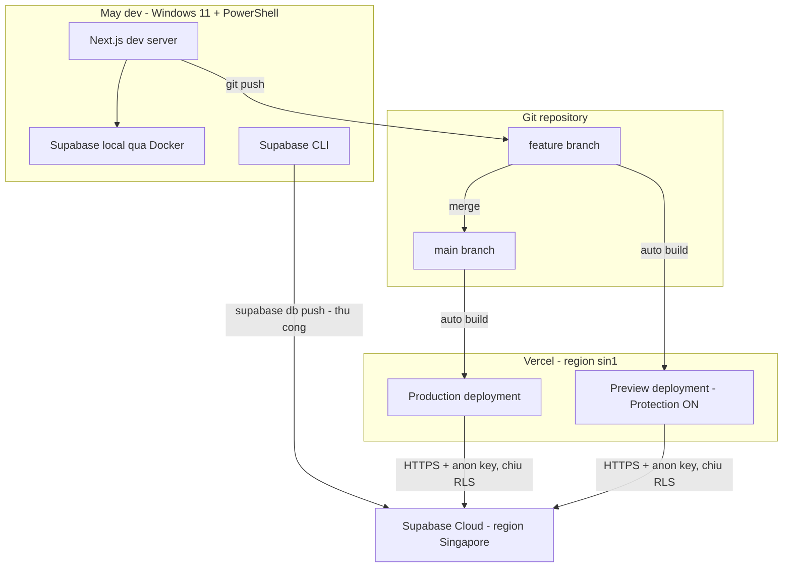
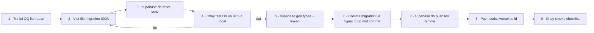
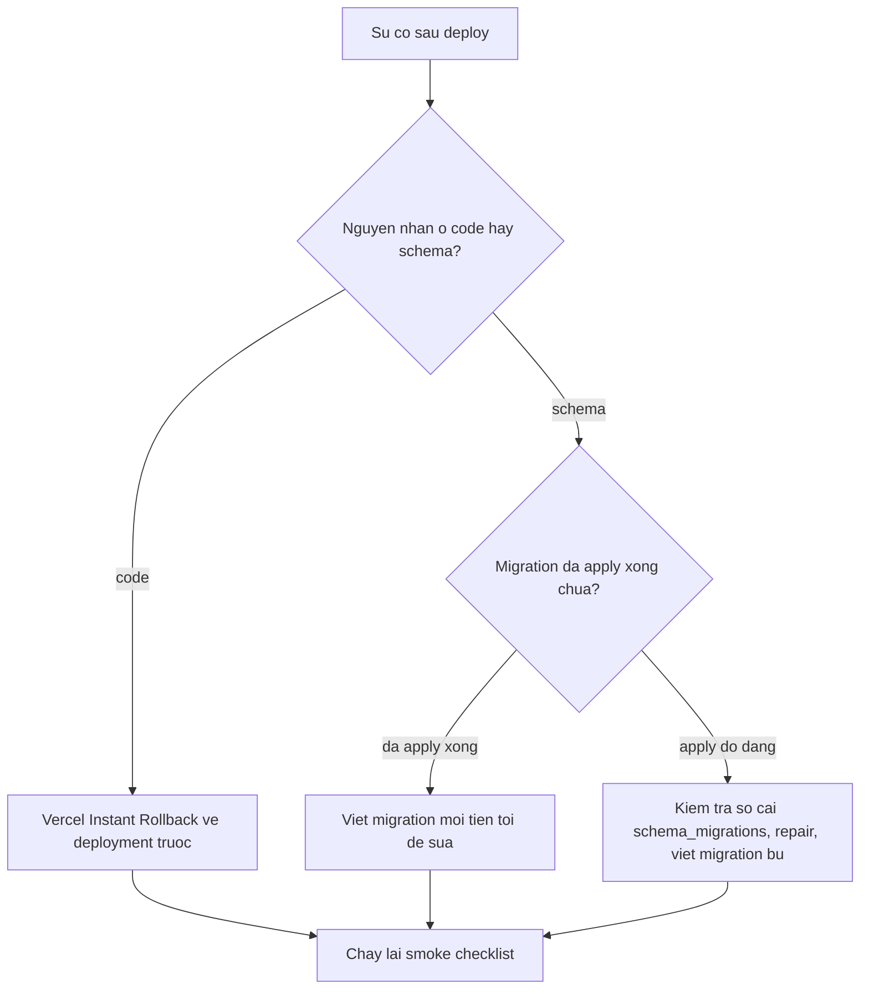

# 09 — Deployment (Supabase + Vercel)
> Status: DRAFT | Phase: 0 | Last updated: 2026-08-07
> Nguồn sự thật cấp trên: BIKEFORCE_MASTER_SPEC.md → docs/11-decisions.md → tài liệu này

---

## 0. TRẠNG THÁI THỰC TẾ TẠI THỜI ĐIỂM VIẾT TÀI LIỆU

Phải đọc mục này trước khi làm bất cứ bước nào bên dưới.

- **Chưa có gì được deploy.** Không có deployment nào trên Vercel, không có URL production.
- **Chưa có Supabase project nào được tạo.** Không có `project-ref`, không có database, không có bảng `profiles` / `daily_reports`.
- **Chưa có migration nào.** Thư mục `supabase/` chưa tồn tại. Các tên file `0001_*.sql` … `0005_*.sql` bên dưới là **kế hoạch**, chưa phải file có thật.
- **Repository chưa phải git repo** và chỉ chứa `BIKEFORCE_MASTER_SPEC.md`, `PROMPT_FIRST_SESSION.md`, `PROMPT_NEXT_SESSION.md`, cùng thư mục `docs/`. Git được khởi tạo ở Phase 1 (DEC-027).
- **Chưa có `package.json`**, do đó mọi lệnh `npm run <script>` trong tài liệu này là **đề xuất, chưa triển khai**.
- **Không có bất kỳ kết quả build / typecheck / lint / test nào.** Tất cả trạng thái kiểm thử là `N/A`, không phải `PASS`.

Tài liệu này là **runbook để thực hiện ở Phase 2 (Database & Auth) và Phase 12 (Deployment Preparation)**, không phải mô tả một hệ thống đang chạy.

---

## 1. KIẾN TRÚC TRIỂN KHAI (mục tiêu)

Theo DEC-001: Next.js 16 App Router trên Vercel Free + Supabase (Postgres / Auth / RLS) Free. Không có server riêng, không container, không cron, không queue, không object storage (DEC-021).



Ba nguyên tắc chi phối toàn bộ tài liệu này:

1. **RLS là biên giới bảo mật thật** (DEC-004, NFR-004). Cấu hình sai RLS = lỗ hổng, không phải lỗi UI.
2. **Schema chỉ đổi qua migration file** (§4). Không sửa schema bằng tay trên dashboard.
3. **Service role key không bao giờ chạm tới `daily_reports`** (DEC-005, NFR-005).

---

## 2. PREREQUISITES

| Yêu cầu | Phiên bản | Trạng thái trên máy hiện tại | Ghi chú |
|---|---|---|---|
| Node.js | 22.20.0 | **Đã kiểm chứng có sẵn** | Trùng Node 22 mà Vercel sẽ dùng — giữ đồng bộ để tránh lệch runtime |
| npm | 10.9.3 | **Đã kiểm chứng có sẵn** | Dùng `npm ci` trên CI/Vercel, `npm install` chỉ khi đổi dependency |
| git | 2.48.1 | **Đã kiểm chứng có sẵn** | Repo **đã** `git init` ở Phase 0, nhánh `main`, remote GitHub đã cấu hình (DEC-028) |
| Supabase CLI | mới nhất | **Chưa cài / chưa kiểm chứng** | Cài ở Phase 2; ghi phiên bản thực tế vào `WORKLOG.md` |
| Docker Desktop | — | **Chưa cài / chưa kiểm chứng** | Bắt buộc cho `supabase start` (Supabase local, DEC-022) |
| Tài khoản Supabase | — | **Chưa có** | Free plan |
| Tài khoản Vercel | — | **Chưa có** | Free plan (NFR-013) |
| Tài khoản Git provider | — | **Chưa có remote** | Vercel import repo từ GitHub/GitLab/Bitbucket |
| Password manager | — | — | Bắt buộc: DB password Supabase chỉ hiện **một lần** |

Kiểm tra nhanh (PowerShell):

```powershell
node --version      # ky vong v22.20.0
npm --version       # ky vong 10.9.3
git --version       # ky vong 2.48.1
supabase --version  # se loi neu chua cai
docker --version    # se loi neu chua cai
```

> **PHIÊN BẢN ĐÃ PIN sau smoke test Phase 1 (2026-08-07)** — bảng này có thẩm quyền, `package.json` khớp đúng và **không dùng dải `^`**:
> `next@16.3.0` · `react@19.2.8` · `react-dom@19.2.8` · **`typescript@6.0.3`** · `tailwindcss@4.3.3` · `@tailwindcss/postcss@4.3.3` · `@supabase/supabase-js@2.112.2` · `@supabase/ssr@0.12.4` · `zod@4.4.3` · `lucide-react@1.29.0` · `server-only@0.0.1` · **`eslint@9.39.5`** · `eslint-config-next@16.3.0` · `@playwright/test@1.62.1` · `@axe-core/playwright@4.12.1` · `vitest@4.1.10` · `@vitest/coverage-v8@4.1.10` · `@vitejs/plugin-react@6.0.5` · `supabase@2.111.0` (CLI).
>
> ⚠ **TypeScript 7.0.2 và ESLint 10.8.0 đã được thử và ĐỀU VỠ** — đây là ISSUE-004 xảy ra thật, nay `CLOSED`. TS 7 bị `typescript-eslint@8.66.0` từ chối (peer `typescript: ">=4.8.4 <6.1.0"`); ESLint 10 làm vỡ `eslint-plugin-react@7.37.5` (bản mới nhất tồn tại, chỉ hỗ trợ tới `eslint@^9.7`). Chi tiết và điều kiện xét lại: `docs/11 § DEC-002 — KẾT LUẬN SMOKE TEST`. **Đừng nâng cấp lại cho "mới" nếu chưa kiểm tra hai package thượng nguồn đó.**
>
> Ghi chú build: Next 16 dùng **Turbopack mặc định**; `create-next-app@16.3` không còn hỏi và không còn cờ `--turbopack`. Node 22 (máy dev hiện tại: v22.20.0).

---

## 3. RUNBOOK — TẠO SUPABASE PROJECT

Thực hiện **một lần**, ở Phase 2. Mỗi bước có tiêu chí xác nhận rõ ràng.

### 3.0. HƯỚNG DẪN TỪNG CÚ BẤM — màn hình "New project"

> Viết chi tiết theo yêu cầu của người dùng. Đây là bước **agent không làm thay được**.
> Bảy ô trên màn hình `supabase.com/dashboard/new/<org>`, theo đúng thứ tự từ trên xuống:

| # | Ô | Chọn gì | Vì sao |
|---|---|---|---|
| 1 | **Organization** | Org sẵn có (Free) | Không ảnh hưởng code |
| 2 | **GitHub (optional)** | ⛔ **ĐỂ TRỐNG / bỏ chọn** | Bật lên thì Supabase tự deploy schema từ GitHub. Dự án đã chốt đẩy migration bằng `supabase db push` từ máy (AGENTS.md §6). Hai hệ thống cùng đẩy migration sẽ xung đột, và tính năng này còn tự tạo preview branch ăn hạn mức Free |
| 3 | **Project name** | Tuỳ ý (`bikeforce`, `BikeForce-Bicycle-Sales-Management`…) | Chỉ là nhãn nội bộ, không đi vào code |
| 4 | **Database password** | Bấm **Generate a password** → bấm **Copy** → **lưu ngay vào password manager** | Supabase **không cho xem lại**. Cần cho `supabase db push`. **Không** dán vào chat, không commit, không ghi vào `.env*` |
| 5 | **Region** | 🇸🇬 **Southeast Asia (Singapore) `ap-southeast-1`** | **KHÔNG ĐỔI ĐƯỢC SAU KHI TẠO.** Xem §3.0.1 |
| 6 | **Enable Data API** | ✅ **Giữ tick** | `supabase-js` / PostgREST cần nó. Tắt là toàn bộ đường dữ liệu chính (DEC-003) không chạy |
| 7 | **Automatically expose new tables** | ⛔ **BỎ TICK** | Chính Supabase khuyến nghị tắt. Migration `0001`/`0002` đã `grant` tường minh đúng quyền cần thiết cho `authenticated`, và cố ý **không** cấp gì cho `anon` và `service_role` (DEC-031). Để tick nghĩa là bảng mới tự động mở cho `anon` — trái deny-by-default của NFR-004 |
| 8 | **Enable automatic RLS** | ✅ **Nên tick** | Lưới an toàn: bảng mới nào quên bật RLS sẽ được bật tự động — đúng thứ §11 CẢNH BÁO 4 của `docs/02` cảnh báo. Migration của dự án vẫn tự `enable` + `force`, cái này chỉ là lớp dự phòng. Nếu về sau `db push` báo lỗi lạ liên quan event trigger thì tắt và ghi vào `WORKLOG.md` |

Bấm **Create new project**, chờ **2–5 phút** tới khi trạng thái là `Active Healthy`.

#### 3.0.1. Vì sao bắt buộc Singapore, và vì sao KHÔNG theo nhãn `RECOMMENDED`

Nhãn `RECOMMENDED` của Supabase dựa trên vị trí máy đang bấm và sức chứa datacenter của họ, **không** dựa trên việc người dùng thật của app ở đâu. Người dùng thật của BikeForce là đội Sales ở Việt Nam, dùng 4G ngoài thị trường.

| Region | Khoảng cách tới VN | RTT thực tế | Kết luận |
|---|---|---|---|
| **Southeast Asia (Singapore)** `ap-southeast-1` | ~1.100 km | **25–45 ms** | ✅ **Chọn** |
| Northeast Asia (Tokyo) `ap-northeast-1` | ~4.000 km | 60–90 ms | Chậm gấp đôi |
| Central EU (Frankfurt) `eu-central-1` | ~9.000 km | **200–300 ms** | ❌ Lag rõ rệt |

Một lần lưu báo cáo là vài lượt đi-về database. Chọn EU thì mỗi lần bấm "Lưu", Sales chờ thêm gần **một giây** — ảnh hưởng trực tiếp NFR-001 và NFR-008. Vercel cũng được đặt ở `sin1` (§9) để hai đầu nằm cùng khu vực.

#### 3.0.2. Ngay sau khi project `Active Healthy` — 3 việc phải làm

1. **Tắt tự đăng ký (BR-012, FR-006).**
   `Authentication` (menu trái) → `Sign In / Providers` → mục **Email** → **tắt** công tắc **"Allow new users to sign up"** → **Save**.
   *Chỉ ẩn nút đăng ký ở frontend là KHÔNG đủ* — endpoint `/auth/v1/signup` vẫn mở với anon key.
   Trong cùng màn hình: **tắt "Confirm email"** (lý do ở §3.3 mục 3).

2. **Lấy 3 giá trị cấu hình.**
   `Project Settings` (bánh răng) → `API`:
   - **Project URL** → dán vào `NEXT_PUBLIC_SUPABASE_URL`
   - **anon / public** key → dán vào `NEXT_PUBLIC_SUPABASE_ANON_KEY`
   - **service_role** key (phải bấm **Reveal**) → dán vào `SUPABASE_SERVICE_ROLE_KEY`
     ⚠ **Key này bypass RLS. Không dán vào chat, không commit, không gửi qua tin nhắn.**

3. **Tạo `.env.local`.**
   ```powershell
   Copy-Item .env.example .env.local
   ```
   rồi điền 3 giá trị trên. Giữ nguyên `SUPABASE_DB_URL` trỏ về local — biến đó chỉ dùng cho test và **không** được đặt trên Vercel.

**Xác nhận trước khi đi tiếp:** mở trình duyệt ẩn danh, gọi `POST <project-url>/auth/v1/signup` kèm anon key → phải bị từ chối. Nếu tạo được tài khoản thì bước 1 chưa xong.

### 3.1. Tạo project

1. Đăng nhập Supabase Dashboard → **New project**.
2. **Name**: `bikeforce-prod` (đề xuất; tên nội bộ, không ảnh hưởng code).
3. **Region**: **Southeast Asia (Singapore)** — vùng gần Việt Nam nhất. Đây là lựa chọn ảnh hưởng trực tiếp NFR-001 (LCP < 2.5s trên 4G): mọi truy vấn từ Vercel `sin1` sang Supabase Singapore đi trong cùng khu vực, độ trễ round-trip ở mức chục ms thay vì hàng trăm ms nếu chọn US/EU.
4. **Database password**: sinh mật khẩu mạnh ngẫu nhiên.
   - **Lưu ngay vào password manager.** Supabase chỉ hiển thị mật khẩu này lúc tạo; mất thì phải reset và mọi connection string cũ hỏng.
   - **Không** ghi mật khẩu này vào `.env.local`, `.env.example`, docs, commit message, hay bất kỳ file nào trong repo. Ứng dụng **không dùng** DB password — app chỉ dùng anon key / service role key. DB password chỉ phục vụ `supabase link`, `supabase db push` và truy cập psql trực tiếp.
5. **Plan**: Free.
6. Chờ project provisioning xong (vài phút).

**Xác nhận:** project ở trạng thái `Active Healthy`, ghi lại `project-ref` (chuỗi trong URL dashboard, dạng `https://supabase.com/dashboard/project/<project-ref>`).

### 3.2. Nơi lấy key — anon key vs service role key

| Key | Vị trí trên Dashboard | Tính chất | Dùng ở đâu trong BikeForce |
|---|---|---|---|
| Project URL | Project Settings → API | Public | `NEXT_PUBLIC_SUPABASE_URL` |
| `anon` / public key | Project Settings → API | **Public-safe**, được bảo vệ bởi RLS | `NEXT_PUBLIC_SUPABASE_ANON_KEY`, dùng trong `lib/supabase/client.ts` và `lib/supabase/server.ts` |
| `service_role` key | Project Settings → API, mục secret keys — phải bấm **Reveal** | **BÍ MẬT**, **bypass toàn bộ RLS** | `SUPABASE_SERVICE_ROLE_KEY`, chỉ trong `lib/supabase/admin.ts` |

> Nếu nhãn/đường dẫn trên Dashboard khác với bảng trên tại thời điểm thực hiện, **ghi lại đường dẫn thực tế vào `WORKLOG.md`** và cập nhật tài liệu này — không đoán.

**Quy tắc tuyệt đối:** `service_role` key bypass RLS. Nếu key này lọt ra client, mọi báo cáo của mọi Sales đọc/ghi được từ trình duyệt bất kỳ → vỡ BR-003 và NFR-005. Đây là secret nguy hiểm nhất của hệ thống.

### 3.3. Cấu hình Auth

Authentication → Providers / Sign In and Up:

1. **Email provider: BẬT**, chế độ email + password (FR-001, UC-01).
2. **Tắt "Allow new users to sign up" (enable signups)** — thực thi BR-012 và FR-006: không có self-registration, chỉ Admin tạo tài khoản qua UC-17. Đây là chốt chặn ở tầng hạ tầng, độc lập với việc UI không có màn hình đăng ký. Liên quan OQ-06 (NON-BLOCKING, đề xuất mặc định: đúng, tắt signup).
3. **Tắt "Confirm email"** cho luồng tài khoản do Admin tạo. Lý do: Admin tạo tài khoản kèm mật khẩu tạm (FR-030); nếu bắt buộc xác nhận email thì Sales không đăng nhập được cho tới khi mở mail, mà v1 **không cấu hình SMTP riêng**.
   - Bổ sung ở tầng code: khi gọi `auth.admin.createUser` trong `lib/supabase/admin.ts`, truyền `email_confirm: true` để user được đánh dấu đã xác nhận ngay lúc tạo. Hai lớp này cùng bảo đảm Sales đăng nhập được ngay.
   - Hệ quả phải chấp nhận: email **không** được hệ thống mail xác minh. Tính duy nhất và tính đúng của email do DB bảo đảm (BR-025: `profiles.email` là `citext UNIQUE`, mirror `auth.users.email`, có trigger đồng bộ).
4. **JWT expiry**: giữ mặc định. Refresh token rotation giữ mặc định. Session được refresh trong `middleware.ts` (FR-002).
5. **Site URL / Redirect URLs**: đặt bằng giá trị `NEXT_PUBLIC_SITE_URL` của môi trường tương ứng (§8).
6. **Không cấu hình SMTP, không dùng magic link, không dùng "forgot password" ở v1.** UC-11 là *đổi mật khẩu khi đã đăng nhập*, không phải quên mật khẩu. Khi Sales quên mật khẩu, Admin đặt lại bằng `auth.admin.updateUserById` (UC-18/UC-19, DEC-005). Quyết định này cũng là một lý do hệ thống nằm gọn trong hạn mức Free (§13).

**Xác nhận:** thử tự đăng ký từ một trình duyệt ẩn danh bằng REST endpoint signup → phải bị từ chối.

### 3.4. Những thứ **không** bật

- **Storage**: không dùng (DEC-021 — ảnh 9:16 được stream trực tiếp từ Route Handler, không lưu file).
- **Realtime**: không dùng ở v1.
- **Edge Functions**: không dùng — toàn bộ logic server nằm trong Next.js Server Actions / Route Handler (DEC-003).
- **Cron / pg_cron**: không dùng (NFR-013; nhắc nhở tự động là AF-13, LATER).

---

## 4. MIGRATION WORKFLOW

### 4.1. Luật bất di bất dịch

1. **Mọi thay đổi schema chỉ đi qua file migration trong `supabase/migrations/`.** Không dùng Table Editor, không dùng SQL Editor trên Dashboard để tạo/sửa bảng, cột, index, policy, function, trigger.
   - **Ngoại lệ duy nhất:** một câu SQL nâng quyền admin đầu tiên ở §10 — đó là **dữ liệu**, không phải schema, và chỉ chạy đúng một lần.
2. **Migration chỉ tiến tới.** Không có `down` migration. Muốn hoàn tác thì viết migration mới (§12).
3. **Không sửa file migration đã được `db push` lên remote.** File đã apply là bất biến; sửa nó khiến local và remote lệch nhau vĩnh viễn.
4. **`supabase db reset` chỉ chạy trên local.** Lệnh này xoá sạch database. Không bao giờ chạy khi đang trỏ vào project remote.
5. **Vercel build không chạy migration.** Build command chỉ là `next build`. `db push` là hành động thủ công có chủ đích từ máy dev.

### 4.2. Danh sách file migration dự kiến

```text
supabase/
├── config.toml                              # sinh boi `supabase init`
├── migrations/
│   ├── 0001_init_enums_profiles.sql         # user_role, report_status, bang profiles
│   ├── 0002_daily_reports.sql               # bang daily_reports + CHECK constraints
│   ├── 0003_functions_triggers.sql          # set_updated_at, handle_new_user,
│   │                                        # guard_profile_self_update, guard_report_transition,
│   │                                        # vn_today, is_admin, is_active_sales
│   ├── 0004_rls_policies.sql                # enable + force RLS, toan bo policy
│   └── 0005_indexes.sql                     # index theo docs/02-database-design.md
└── seed.sql                                 # CHI local: 1 admin + 3 sales + ~20 report mau
```

Nội dung chi tiết của từng file (cột, CHECK, policy, index) nằm ở `docs/02-database-design.md` và `docs/06-auth-permissions.md`. Tài liệu này chỉ quy định **quy trình**.

**Lưu ý về tên file:** `supabase migration new <name>` sinh tên có tiền tố timestamp, không phải `0001_…`. Vì brief chốt bộ tên `0001..0005`, các file này **tạo bằng tay** với đúng tên trên. Supabase CLI sắp thứ tự migration theo phần version ở đầu tên file, nên `0001 < 0002 < …` là hợp lệ — **phải kiểm chứng lại bằng `supabase db reset` local ở Phase 2 trước khi push lên remote**.

**`seed.sql` không bao giờ chạy trên production.** Nó chỉ được `supabase db reset` áp dụng ở local.

### 4.3. Lệnh — thiết lập lần đầu

```bash
# 1. Khoi tao thu muc supabase/ trong repo (chay o project root)
supabase init

# 2. Dang nhap CLI (mo trinh duyet lay access token)
supabase login

# 3. Lien ket repo voi project remote; se hoi DB password da luu o buoc 3.1
supabase link --project-ref <YOUR-PROJECT-REF>
```

Sau `supabase init`, bổ sung vào `.gitignore`: `supabase/.temp/`, `supabase/.branches/`. **Commit** `supabase/config.toml`, `supabase/migrations/**`, `supabase/seed.sql`.

### 4.4. Lệnh — vòng lặp phát triển hằng ngày (local)

```bash
# Khoi dong stack Supabase local: Postgres + GoTrue + PostgREST + Studio (can Docker)
supabase start

# In ra API URL + anon key + service role key CUA LOCAL (khac hoan toan remote)
supabase status

# Xoa sach DB local, apply lai 0001..0005 theo thu tu, roi chay seed.sql
supabase db reset

# Dung stack khi xong viec
supabase stop
```

`supabase db reset` là **lệnh kiểm chứng chính**: nếu bộ migration chạy sạch từ database trống thì thứ tự và tính toàn vẹn của chúng là đúng. Chạy lệnh này sau **mọi** lần thêm/sửa migration, trước khi commit.

### 4.5. Lệnh — đẩy schema lên remote

```bash
# Xem truoc nhung migration nao chua co tren remote
supabase migration list

# Apply cac migration con thieu len project da link
supabase db push
```

`supabase db push` chỉ apply những migration **chưa** có trong sổ cái `supabase_migrations.schema_migrations` của remote. Nó không xoá, không rollback.

### 4.6. Quy trình chuẩn cho một lần đổi schema



**Thứ tự bắt buộc: schema trước, code sau.** Đẩy code mới lên trước khi schema có cột mới sẽ làm production lỗi ngay lập tức. Ngược lại, đẩy schema tương thích ngược trước thì code cũ vẫn chạy bình thường trong khoảng thời gian giữa hai bước — đây cũng chính là điều kiện để rollback code an toàn (§12).

---

## 5. TYPE GENERATION

TypeScript types của database được **sinh ra**, không viết tay (NFR-012).

```bash
# Sinh tu project remote da link (dung cho commit chinh thuc)
supabase gen types typescript --linked > types/database.types.ts

# Sinh tu Supabase local (dung khi dang phat trien migration, chua push)
supabase gen types typescript --local > types/database.types.ts
```

Quy tắc:

- **`types/database.types.ts` được commit vào repo.** Lý do: Vercel build không có Supabase CLI và không có quyền truy cập database; build phải chạy được chỉ với source code.
- **Regenerate sau mọi lần đổi schema**, và commit chung commit với file migration tương ứng. Migration và types lệch nhau là nguồn lỗi typecheck khó truy vết nhất trong dự án này.
- File này **chỉ được sửa bằng lệnh generate**. Domain types viết tay đặt ở file khác trong `types/` (DEC-023).
- Đề xuất script trong `package.json` (chưa triển khai): `"db:types": "supabase gen types typescript --linked > types/database.types.ts"`.

---

## 6. AUTH & RLS — KIỂM CHỨNG SAU KHI PUSH

RLS không được coi là "đã xong" chỉ vì migration `0004_rls_policies.sql` chạy thành công. Bắt buộc kiểm chứng ba lớp (NFR-004, DEC-004).

### 6.1. Kiểm tra RLS đã bật trên mọi bảng public

Chạy trong SQL Editor ở chế độ **chỉ đọc** (đây là truy vấn kiểm tra, không phải thay đổi schema):

```sql
select relname,
       relrowsecurity      as rls_enabled,
       relforcerowsecurity as rls_forced
from pg_class
where relnamespace = 'public'::regnamespace
  and relkind = 'r'
order by relname;
```

Kỳ vọng: `profiles` và `daily_reports` đều có `rls_enabled = true` **và** `rls_forced = true`. Bảng nào trong `public` mà `rls_enabled = false` là lỗ hổng, phải sửa bằng migration mới.

### 6.2. Kiểm tra danh sách policy

```sql
select tablename, policyname, cmd, roles
from pg_policies
where schemaname = 'public'
order by tablename, cmd, policyname;
```

Kỳ vọng đúng bộ policy trong `docs/06-auth-permissions.md`: `profiles_select_self_or_admin`, `profiles_update_self`, `profiles_update_admin`, `reports_select_own_or_admin`, `reports_insert_own_today`, `reports_update_own_open`. **Không có policy DELETE nào** (BR-013) và **không có policy INSERT cho `profiles`** — row profile do trigger `handle_new_user()` tạo.

### 6.3. Kiểm tra hành vi thật bằng JWT thật

Kiểm tra bằng suite RLS mô tả ở `docs/08-testing-strategy.md`, chạy trên **Supabase local** (DEC-022 — không test trên production). Kiểm tra tối thiểu: salesA đọc report của salesB → 0 rows; salesA update report salesB → 0 rows affected; salesA insert với `sales_id = salesB` → bị từ chối; delete → bị từ chối; admin đọc tất cả → có dữ liệu; user `is_active = false` → bị chặn (BR-009).

Ngoài ra §11 có một bước kiểm chứng RLS **trên production sau deploy**, thực hiện từ console trình duyệt.

---

## 7. NHỮNG THỨ TUYỆT ĐỐI KHÔNG COMMIT

`.gitignore` (thiết lập ở Phase 1, DEC-027) phải chứa tối thiểu:

```text
node_modules/
.next/
.vercel/
.env
.env.*
!.env.example
supabase/.temp/
supabase/.branches/
playwright-report/
test-results/
coverage/
```

Kiểm tra rò rỉ service role key ra client bundle (NFR-005), chạy sau `next build` trong CI:

```bash
# Chi chay o noi co bien moi truong that (CI secret). So khop GIA TRI cua key,
# khong phai ten bien - ten bien khong bao gio xuat hien trong bundle.
if [ -n "$SUPABASE_SERVICE_ROLE_KEY" ] && grep -RIlq -- "$SUPABASE_SERVICE_ROLE_KEY" .next/static; then
  echo "LEAK: service role key found in client bundle"
  exit 1
fi
```

Lớp bảo vệ tĩnh song song: `lib/supabase/admin.ts` bắt đầu bằng `import 'server-only'`. Nếu bất kỳ Client Component nào import nhầm file này, **build sẽ fail** thay vì âm thầm đóng gói secret vào bundle. Hai lớp này bổ sung cho nhau: `server-only` chặn lỗi lập trình, grep chặn mọi con đường còn lại.

### 7.1. Ngược lại — thứ BẮT BUỘC phải commit: font của thẻ ảnh 9:16 (Phase 6)

`public/fonts/Inter-Regular.ttf`, `Inter-SemiBold.ttf`, `Inter-Bold.ttf` (~320 KB mỗi file, tổng ~950 KB) **nằm trong repository và phải ở đó**. Chúng không phải asset build-time có thể tải lại lúc chạy: Satori đọc chúng bằng `fs` ở Node runtime để render PNG (DEC-010). Tải font qua mạng lúc render là đúng thứ ISSUE-002 cấm — một request hỏng nghĩa là ảnh mất dấu tiếng Việt, và lỗi đó chỉ lộ ra trên tấm ảnh đã gửi cho khách.

Ba file này **không** đi vào client bundle: giao diện web nạp Inter qua `next/font/google` như cũ (DEC-013), hoàn toàn tách biệt.

**Bắt buộc kèm theo — `next.config.ts`:**

```ts
outputFileTracingIncludes: {
  '/api/reports/[id]/share-image': ['./public/fonts/**'],
},
```

Đường dẫn font được ghép lúc chạy bằng `join(process.cwd(), 'public', 'fonts', …)`, nên bộ dò phụ thuộc của Vercel **không nhìn thấy nó**. Thiếu khai báo này thì `next build` vẫn xanh, còn hàm trên Vercel ném `ENOENT` ngay request đầu tiên — một lỗi chỉ xuất hiện sau khi deploy. Nếu sau này thêm route nào khác cũng đọc file từ đĩa, phải thêm entry tương ứng.

---

## 8. ENVIRONMENT VARIABLES

### 8.1. Bảng biến môi trường

| Biến | Nơi lấy | Public? | Dùng ở đâu | Hậu quả nếu rò rỉ |
|---|---|---|---|---|
| `NEXT_PUBLIC_SUPABASE_URL` | Supabase Dashboard → Project Settings → API → Project URL | **Có** — nhúng vào client bundle | `lib/supabase/client.ts`, `lib/supabase/server.ts`, `lib/supabase/admin.ts` | Không đáng kể. Đây là endpoint công khai; mọi truy cập vẫn phải qua Auth + RLS. |
| `NEXT_PUBLIC_SUPABASE_ANON_KEY` | Dashboard → Project Settings → API → anon/public key | **Có** — nhúng vào client bundle theo thiết kế | `lib/supabase/client.ts` (auth UI), `lib/supabase/server.ts` (RSC + Server Actions — đường dữ liệu chính, chịu RLS) | Thấp **với điều kiện RLS đúng**. Key này chỉ cho phép làm những gì policy cho phép với JWT tương ứng. Nếu RLS sai hoặc thiếu, key này trở thành cửa đọc toàn bộ dữ liệu → đây chính là lý do NFR-004 là deny-by-default. |
| `SUPABASE_SERVICE_ROLE_KEY` | Dashboard → Project Settings → API → service_role key (bấm Reveal) | **KHÔNG** — không bao giờ có tiền tố `NEXT_PUBLIC_` | **Chỉ** `lib/supabase/admin.ts`, và **chỉ** cho `auth.admin.createUser` / `auth.admin.updateUserById` trong UC-17/UC-18/UC-19 (DEC-005). Không bao giờ đụng `daily_reports`. | **Nghiêm trọng nhất.** Bypass toàn bộ RLS: đọc/sửa/xoá mọi báo cáo của mọi Sales, tạo tài khoản ADMIN tuỳ ý. Vỡ BR-003, BR-012, NFR-004, NFR-005. Nếu nghi rò rỉ → rotate key ngay trên Dashboard, cập nhật lại trên Vercel, redeploy. |
| `NEXT_PUBLIC_SITE_URL` | Tự đặt: URL chuẩn của từng môi trường (`http://localhost:3000` khi dev, domain Vercel khi production) | **Có** | Auth redirect, URL tuyệt đối, khớp với Site URL cấu hình ở §3.3 | Không đáng kể. Nhưng **đặt sai** thì luồng đăng nhập/redirect hỏng — đây là lỗi cấu hình thường gặp nhất khi lên production. |

Không có biến môi trường nào khác ở v1. Không có API key bên thứ ba, không có Zalo API (Zalo chỉ nhận file PNG, không tích hợp API).

### 8.2. Nội dung `.env.example` (commit vào repo, chỉ placeholder)

```dotenv
# BikeForce - environment variables
# Copy file nay thanh .env.local va dien gia tri that.
# .env.local KHONG BAO GIO duoc commit.

# --- Supabase: public, an toan khi lo ra client bundle ---
NEXT_PUBLIC_SUPABASE_URL=https://YOUR_PROJECT_REF.supabase.co
NEXT_PUBLIC_SUPABASE_ANON_KEY=YOUR_SUPABASE_ANON_KEY

# --- Supabase: BI MAT, SERVER-SIDE ONLY ---
# Bypass toan bo RLS. Khong them tien to NEXT_PUBLIC_.
# Chi dung trong lib/supabase/admin.ts cho auth.admin.* (UC-17/18/19).
SUPABASE_SERVICE_ROLE_KEY=YOUR_SUPABASE_SERVICE_ROLE_KEY

# --- URL chuan cua moi truong hien tai ---
NEXT_PUBLIC_SITE_URL=http://localhost:3000
```

### 8.3. Lấy giá trị cho môi trường local

Khi chạy `supabase start`, lệnh `supabase status` in ra **API URL / anon key / service_role key của instance local**. Dùng bộ giá trị đó cho `.env.local` khi phát triển. Chúng **hoàn toàn khác** bộ key của project remote — không trộn lẫn. Bộ key local là key mặc định của Supabase CLI, giống nhau trên mọi máy, nên không phải secret; nhưng vẫn giữ trong `.env.local` để `.gitignore` áp dụng thống nhất.

---

## 9. VERCEL SETUP

### 9.1. Import project

1. Repo đã nằm trên GitHub tại `LeDuyKhangZz/BikeForce-Bicycle-Sales-Management` (DEC-028) — chỉ cần cấp quyền cho Vercel truy cập.
2. Vercel Dashboard → **Add New → Project → Import Git Repository** → chọn repo BikeForce.
3. **Framework Preset**: **Next.js** (Vercel tự nhận diện; nếu không, chọn thủ công).
4. **Root Directory**: `./`.
5. **Build Command**: mặc định `next build` — **giữ mặc định**. Không thêm `supabase db push` vào build (§4.1 luật 5).
6. **Install Command**: `npm ci`.
7. **Output Directory**: mặc định.
8. **Node.js Version**: **22.x** — Project Settings → General. Khớp Node 22.20.0 trên máy dev để tránh lệch runtime.
9. **Function Region**: **`sin1` (Singapore)** — Project Settings → Functions. Đặt cùng vùng với Supabase Singapore để Server Components / Server Actions / Route Handler `share-image` không phải đi vòng qua châu lục khác. Đây là yếu tố ảnh hưởng NFR-001 lớn hơn mọi tối ưu bundle.

### 9.2. Environment variables trên Vercel

Project Settings → Environment Variables. Đặt **cả 4 biến cho cả 3 môi trường**:

| Biến | Production | Preview | Development |
|---|---|---|---|
| `NEXT_PUBLIC_SUPABASE_URL` | URL project remote | theo §9.3 | URL Supabase local |
| `NEXT_PUBLIC_SUPABASE_ANON_KEY` | anon key remote | theo §9.3 | anon key local |
| `SUPABASE_SERVICE_ROLE_KEY` | service key remote — đánh dấu **Sensitive** | theo §9.3 | service key local |
| `NEXT_PUBLIC_SITE_URL` | domain production | URL preview | `http://localhost:3000` |

Quy tắc: `SUPABASE_SERVICE_ROLE_KEY` **không bao giờ** được đặt tên có tiền tố `NEXT_PUBLIC_`, và nên bật cờ *Sensitive* của Vercel để giá trị không đọc lại được từ UI sau khi lưu.

### 9.3. Preview trỏ vào database nào — ĐỀ XUẤT, CHƯA CHỐT

Brief và Master Spec không quy định môi trường staging. Đây là **quyết định kỹ thuật**, không phải câu hỏi nghiệp vụ, nên **không** tạo `OQ` mới (Master Spec §40 chỉ ghi nhận câu hỏi ảnh hưởng business rule / database / permission / workflow). Ghi nhận ở đây và chốt bằng một mục trong `docs/11-decisions.md` ở Phase 12:

- **Phương án A (đề xuất mặc định):** Preview và Production dùng **cùng** một Supabase project. Đơn giản, chắc chắn nằm trong hạn mức Free. **Rủi ro phải chấp nhận và phải ghi rõ:** preview deployment ghi thẳng vào dữ liệu thật. Bắt buộc đi kèm §9.4 (Protection) và kỷ luật không thử nghiệm phá hoại trên preview.
- **Phương án B:** tạo project Supabase thứ hai làm staging, Preview trỏ vào đó. An toàn hơn, nhưng phải kiểm chứng hạn mức số project active của Supabase Free trước khi cam kết, và phải chạy `supabase db push` hai lần cho mỗi lần đổi schema.

Quyết định này **không chặn** Phase 0.

### 9.4. Bật Preview Deployment Protection

Project Settings → **Deployment Protection** → bật bảo vệ cho **Preview Deployments** (yêu cầu đăng nhập Vercel mới xem được).

Lý do bắt buộc: BikeForce là **app nội bộ**, chứa dữ liệu kinh doanh thật (doanh số, doanh thu, tên nhân viên). URL preview do Vercel sinh ra là công khai và đoán được nếu bị lộ. Không bật bảo vệ ⇒ mỗi lần push branch là một bản sao ứng dụng nội bộ nằm trên Internet mở. Kết hợp với phương án A ở §9.3 (preview dùng DB thật), đây là biện pháp **không được bỏ qua**.

Nếu gói Free không cho bật tính năng này tại thời điểm thực hiện: ghi nhận vào `docs/12-known-issues.md` theo đúng format Spec §56, và bù bằng cách không chia sẻ URL preview ra ngoài đội phát triển, đồng thời cân nhắc phương án B ở §9.3.

### 9.5. Domain

v1 dùng domain `*.vercel.app` do Vercel cấp — đủ cho app nội bộ. Nếu sau này gắn custom domain: cập nhật `NEXT_PUBLIC_SITE_URL` và **Site URL / Redirect URLs** trong Supabase Auth (§3.3) **trước** khi chuyển, nếu không luồng đăng nhập sẽ hỏng ngay khi domain đổi.

---

## 10. RUNBOOK — ADMIN ĐẦU TIÊN (bootstrap)

Vấn đề con-gà-quả-trứng: chỉ Admin mới tạo được tài khoản (BR-012, FR-006), nhưng ban đầu chưa có Admin nào.

**Cách làm — thực hiện đúng một lần, thủ công:**

1. Supabase Dashboard → **Authentication → Users → Add user → Create new user**.
   - Email: email thật của quản lý kinh doanh.
   - Password: mật khẩu tạm mạnh, giao trực tiếp cho người dùng, yêu cầu đổi ngay qua UC-11.
   - Bật **Auto Confirm User** (khớp §3.3 — không có SMTP nên không thể xác nhận qua email).
2. Trigger `handle_new_user()` tự tạo row tương ứng trong `public.profiles` với `role` mặc định là `'SALES'` (theo default cột, xem `docs/02-database-design.md`).
3. Mở **SQL Editor** và chạy **đúng một câu**:

```sql
update public.profiles
set role = 'ADMIN'
where email = 'admin@example.com';   -- thay bang email that vua tao o buoc 1
```

4. Kiểm chứng ngay sau đó:

```sql
select id, email, full_name, role, is_active
from public.profiles
where role = 'ADMIN';
```

Kỳ vọng: đúng **một** dòng, `is_active = true`.

5. Đăng nhập ứng dụng bằng tài khoản đó → phải vào được `/admin`. Từ đây mọi tài khoản Sales tiếp theo tạo qua UI (UC-17), không bao giờ tạo bằng SQL nữa.

**Vì sao đây cố ý KHÔNG phải một tính năng UI:**

- Bất kỳ màn hình/endpoint nào có khả năng tự phong ADMIN đều là một **đường leo thang đặc quyền** tồn tại vĩnh viễn trong sản phẩm, chỉ để phục vụ một thao tác chạy đúng một lần trong đời dự án. Đánh đổi hoàn toàn không đáng.
- Trigger `guard_profile_self_update()` **cố tình chặn** người dùng thường tự đổi `role`, `is_active`, `email`, `id`. Một UI "tự phong admin" sẽ mâu thuẫn trực tiếp với chính lớp bảo vệ đó.
- Thao tác này chạy **một lần**. Chi phí viết + test + bảo trì UI lớn hơn nhiều so với 30 giây chạy tay có runbook.
- Đây là **thay đổi dữ liệu**, không phải thay đổi schema — nên nó là ngoại lệ hợp lệ duy nhất của luật "không dùng SQL Editor" ở §4.1.

**Ghi lại vào `WORKLOG.md`:** ngày giờ thực hiện, email tài khoản admin đầu tiên (không ghi mật khẩu).

---

## 11. BUILD & DEPLOY

### 11.1. Cổng chất lượng tại local (chạy TRƯỚC khi push)

Các script sau là **đề xuất, chưa triển khai** (chưa có `package.json`):

```bash
npm run typecheck   # tsc --noEmit, TypeScript strict (NFR-012)
npm run lint        # eslint, cam `any` (NFR-012)
npm run build       # next build
npm run test        # vitest: unit + integration/DB + RLS
npm run test:e2e    # playwright: mobile-375, desktop-1440, zalo-like
```

Theo Master Spec §42, cả bốn cổng đầu phải xanh trước khi sang phase tiếp. **Tại thời điểm viết tài liệu này chưa có lệnh nào từng được chạy — mọi trạng thái là `N/A`, không phải `PASS`.**

### 11.2. Trình tự deploy

**A. Deploy chỉ có thay đổi code (không đổi schema):**

1. Chạy đủ cổng chất lượng ở §11.1 tại local.
2. `git push` lên feature branch → Vercel tự build **Preview**.
3. Mở URL preview (đã bảo vệ theo §9.4), kiểm tra tính năng vừa sửa.
4. Merge vào `main` → Vercel tự build **Production**.
5. Chạy smoke checklist §11.3 trên URL production.

**B. Deploy có thay đổi schema:**

1. Thực hiện đủ 9 bước ở sơ đồ §4.6.
2. Điểm mấu chốt: `supabase db push` (bước 7) chạy **trước** khi code mới lên Production (bước 8).
3. Migration phải **tương thích ngược** với code đang chạy: thêm cột thì để `nullable` hoặc có `default`; **không** drop/rename cột trong cùng lần deploy với code dùng cột đó. Tách thành hai lần deploy: *expand* (thêm, tương thích ngược) → deploy code → *contract* (dọn dẹp) ở lần sau. Đây là điều kiện để rollback code ở §12 an toàn.

### 11.3. Kiểm tra ngay sau mỗi lần deploy

Sau **mỗi** deploy production, tối thiểu:

- [ ] Vercel Deployment ở trạng thái `Ready`, không có lỗi trong Build Logs.
- [ ] Mở URL production, đăng nhập được.
- [ ] Mở Vercel → Logs, không có exception mới trong 5 phút đầu.
- [ ] Nếu deploy có đổi schema: `supabase migration list` cho thấy local và remote khớp nhau.

Sau deploy **lớn** (đổi schema, đổi auth, đổi RLS, hoặc release đầu tiên): chạy đủ smoke checklist §11.4.

### 11.4. Post-deploy smoke checklist

Chạy trên **thiết bị thật** với ít nhất một tài khoản SALES và một tài khoản ADMIN. Tất cả ô dưới đây **chưa được kiểm tra lần nào**.

- [ ] **Đăng nhập hoạt động** — SALES và ADMIN đều đăng nhập được, redirect đúng role về `/sales/today` và `/admin` (FR-001, FR-004, UC-01).
- [ ] **RLS chặn đọc chéo từ console trình duyệt** — đăng nhập salesA, mở DevTools Console, gọi thẳng REST API của Supabase để đọc report của salesB:

  ```js
  // Chay trong Console khi da dang nhap salesA. Chi dung placeholder, khong dan key that vao doc.
  const res = await fetch(
    `${SUPABASE_URL}/rest/v1/daily_reports?select=id,sales_id&sales_id=eq.<UUID_CUA_SALES_B>`,
    { headers: { apikey: '<ANON_KEY>', Authorization: `Bearer ${ACCESS_TOKEN_CUA_SALES_A}` } }
  );
  console.log(await res.json());   // KY VONG: []  (mang rong)
  ```

  Kỳ vọng là mảng rỗng `[]`, **không** phải lỗi 403 — RLS lọc row chứ không chặn request. Bất kỳ dòng dữ liệu nào trả về đều là vi phạm BR-003 / NFR-004 và phải rollback ngay.
- [ ] **Báo cáo đầu ngày lưu được** — tạo báo cáo sáng, reload trang, dữ liệu còn nguyên, status = `MORNING_SUBMITTED` (FR-008, FR-011, UC-04).
- [ ] **Báo cáo cuối ngày lưu được** — nhập thực đạt, lưu, status chuyển `COMPLETED`, có `evening_submitted_at` (FR-014, FR-015, UC-06).
- [ ] **Achievement hiển thị đúng** — bảng đối chiếu hiện đủ 4 chỉ tiêu, % tính đúng, cho phép > 100%, **không có `NaN` / `Infinity` / `∞`** ở bất kỳ ô nào (FR-016, BR-004, BR-014, BR-015, UC-07).
- [ ] **Export ảnh trả về PNG đúng 1080×1920 với dấu tiếng Việt đúng** — tải file về, mở lên, kiểm tra kích thước đúng 1080×1920 px, và các ký tự `ừ ẫ ợ ỹ đ Đ` hiển thị đủ dấu, không bị ô vuông hay mất dấu. Tên file đúng dạng `Bao_Cao_Ngay_<YYYY-MM-DD>.png` hoặc `Bao_Cao_Cuoi_Ngay_<YYYY-MM-DD>.png` (FR-018, FR-019, UC-08, ISSUE-002).
- [ ] **Số liệu Admin dashboard khớp** — đối chiếu 12 chỉ số ở `/admin` với dữ liệu đếm tay trong ngày; số Sales đã/chưa báo cáo phải khớp thực tế (FR-024, AF-01, AF-02, UC-12).
- [ ] **Zalo in-app browser mở được app** — gửi URL production qua Zalo, mở bằng trình duyệt trong Zalo, đăng nhập và vào được `/sales/today` (NFR-009, ISSUE-003).

Kiểm tra bổ sung nên làm cùng lúc:

- [ ] Tài khoản `is_active = false` bị chặn đăng nhập và có thông báo rõ ràng (FR-005, BR-009).
- [ ] Truy cập trực tiếp `/sales/reports/<id-cua-sales-khac>` → 404/redirect, không lộ dữ liệu (BR-003).
- [ ] `GET /api/reports/<id-cua-sales-khac>/share-image` → 403/404 (BR-002, BR-022).
- [ ] Nút "Xuất ảnh" bị disable khi báo cáo chưa `COMPLETED` (FR-017, BR-002).
- [ ] Ngày nghiệp vụ đúng múi giờ VN khi thao tác lúc 23:00–01:00 (BR-005, NFR-011).

---

## 12. ROLLBACK & XỬ LÝ SỰ CỐ



### 12.1. Rollback code — nhanh và an toàn

Vercel Dashboard → **Deployments** → chọn deployment tốt gần nhất → **Instant Rollback / Promote to Production**. Không cần rebuild, không cần revert git ngay lập tức (nhưng **phải** revert git sau đó để repo khớp với thứ đang chạy).

**Điều kiện để rollback code an toàn:** schema hiện tại phải tương thích ngược với code cũ. Đây chính là lý do §11.2.B bắt buộc migration kiểu *expand* trước, *contract* sau. Nếu vừa drop một cột mà code cũ còn dùng thì rollback code sẽ **không** cứu được hệ thống.

### 12.2. Rollback schema — không tồn tại, chỉ có tiến tới

Không có `down` migration. Muốn hoàn tác một thay đổi schema, viết migration mới với số thứ tự kế tiếp, ví dụ `0006_revert_<mo_ta>.sql`, rồi đi lại đúng quy trình §4.6.

Lý do: `down` migration hầu như không bao giờ được test thật, và với dữ liệu production thì "lùi" thường có nghĩa là mất dữ liệu không thể phục hồi. Một migration tiến tới có kiểm chứng ở local an toàn hơn nhiều.

### 12.3. Khi `supabase db push` lỗi giữa chừng

Không hoảng, không sửa file migration cũ, không chạy lại `db push` một cách mù quáng. Trình tự:

1. **Đọc kỹ thông báo lỗi**: xác định file nào, câu lệnh nào lỗi.
2. **Xác định trạng thái sổ cái**:

   ```sql
   select version, name
   from supabase_migrations.schema_migrations
   order by version;
   ```

   So với `supabase migration list` để biết migration lỗi đã được ghi nhận là "đã apply" hay chưa.
3. **Xác định trạng thái schema thật**: dùng truy vấn ở §6.1 / §6.2 và `\d+ <table>` để xem những gì đã kịp tạo. DDL trong Postgres có tính giao dịch, nhưng **không được giả định** cả file migration nằm trong một transaction; luôn kiểm tra bằng mắt.
4. **Ba tình huống:**
   - *Không có gì được apply, sổ cái không ghi nhận* → sửa file migration ở local, `supabase db reset` để kiểm chứng lại, rồi push lại. An toàn nhất.
   - *Apply dở dang, sổ cái ghi nhận là đã apply* → sổ cái sai. Sửa sổ cái bằng `supabase migration repair --status reverted <version>` (**kiểm chứng cú pháp CLI thực tế trước khi chạy trên production**), rồi xử lý như tình huống trên.
   - *Apply dở dang, sổ cái không ghi nhận, nhưng một phần đối tượng đã tồn tại* → **không** sửa file cũ. Viết migration mới dọn dẹp phần đã tạo (`drop ... if exists`) rồi tạo lại đầy đủ, hoặc viết migration bù chỉ tạo phần còn thiếu bằng `create ... if not exists`.
5. **Phòng ngừa cho lần sau:** viết DDL có `if not exists` / `if exists` ở những chỗ hợp lý, và **luôn** chạy `supabase db reset` từ database trống ở local trước khi push. Migration nào chưa chạy sạch từ trạng thái trống thì chưa được push.

### 12.4. Nghi ngờ rò rỉ `SUPABASE_SERVICE_ROLE_KEY`

1. Supabase Dashboard → Project Settings → API → **rotate service_role key**.
2. Cập nhật giá trị mới trên Vercel cho cả Production/Preview/Development.
3. Redeploy (biến môi trường chỉ có hiệu lực ở deployment mới).
4. Cập nhật `.env.local` trên các máy dev.
5. Rà lại lịch sử git xem key có từng bị commit không; nếu có, coi như key đã lộ vĩnh viễn trong lịch sử và phải rotate kể cả khi đã xoá file.
6. Ghi sự cố vào `docs/12-known-issues.md`.

---

## 13. CHI PHÍ & HẠN MỨC

### 13.1. Vì sao hệ thống nằm gọn trong Vercel Free + Supabase Free (NFR-013)

Các quyết định kiến trúc dưới đây **không phải ngẫu nhiên** — chúng chính là thứ giữ chi phí bằng 0:

| Không dùng | Quyết định liên quan | Nếu dùng thì sao |
|---|---|---|
| **Cron / scheduled job** | AF-13 (nhắc tự động) hoãn sang LATER | Cron là tính năng trả phí trên Vercel Free; nhắc nhở tự động sẽ đẩy dự án ra khỏi hạn mức |
| **Queue / background worker** | DEC-003 — chỉ Server Actions + Route Handler | Cần hạ tầng riêng |
| **Object storage** | DEC-021 — ảnh 9:16 stream trực tiếp, không lưu | Supabase Storage sẽ tiêu tốn dung lượng + băng thông; ảnh báo cáo không cần lưu lại vì tái sinh được từ dữ liệu |
| **Realtime** | Không dùng ở v1 | Tiêu tốn kết nối đồng thời |
| **Custom SMTP / email** | §3.3 — không magic link, không forgot-password | Cần dịch vụ mail bên ngoài |
| **Thư viện chart nặng** | AF-08 hoãn (SHOULD) | Tăng bundle, ảnh hưởng NFR-001, không ảnh hưởng chi phí hạ tầng nhưng ảnh hưởng hiệu năng |
| **Database ngoài Supabase** | DEC-001 | Chi phí trực tiếp |

Về khối lượng dữ liệu: NFR-015 thiết kế cho 50 Sales × 365 ngày ≈ **18.000 row/năm** trên `daily_reports`, cộng ≤ 51 row `profiles`. Đây là khối lượng rất nhỏ so với dung lượng database của gói Free — **dung lượng DB sẽ không phải là giới hạn chạm phải đầu tiên**.

### 13.2. Những giới hạn sẽ chạm phải ĐẦU TIÊN khi đội lớn lên

Xếp theo thứ tự khả năng xảy ra, kèm dấu hiệu nhận biết:

1. **Điều khoản sử dụng của Vercel gói Hobby/Free.** Gói Free của Vercel được quy định cho mục đích **phi thương mại**. BikeForce là ứng dụng nội bộ của một doanh nghiệp. **Phải đọc lại Vercel Terms trước khi go-live chính thức.** Nếu buộc phải lên gói trả phí thì đây gần như chắc chắn là **khoản chi phí đầu tiên** của dự án — trước cả khi chạm bất kỳ giới hạn kỹ thuật nào. Không giả định là được phép.
2. **Supabase Free tự động pause project khi không có hoạt động trong một khoảng thời gian.** Với app chỉ dùng ngày làm việc, một kỳ nghỉ dài có thể khiến project bị pause và sáng đầu tuần cả đội không đăng nhập được. Dấu hiệu: đăng nhập lỗi kết nối đồng loạt. Xử lý: vào Dashboard restore project; phòng ngừa: theo dõi trạng thái project trước các kỳ nghỉ dài.
3. **Thời gian thực thi function khi sinh ảnh 9:16.** Route Handler `GET /api/reports/[id]/share-image` render `ImageResponse` 1080×1920 bằng Satori — đây là tác vụ nặng CPU nhất của hệ thống. Nếu 50 Sales cùng bấm "Xuất ảnh" vào 17h30, đây là điểm nghẽn đầu tiên về hiệu năng. Cần **đo thời gian thực thi thật ở Phase 6** (chưa đo, không có số liệu). Liên quan ISSUE-002.
4. **Băng thông đầu ra.** Ước tính thô, **chưa đo**: 50 Sales × ~22 ngày làm việc × một ảnh PNG mỗi ngày. Kích thước ảnh thực tế phải đo ở Phase 6 mới biết. Với quy mô này, băng thông nhiều khả năng vẫn còn xa hạn mức, nhưng phải đo thay vì phỏng đoán.
5. **Số người dùng hoạt động hằng tháng của Supabase Auth.** Với ≤ 50 tài khoản thì còn rất xa hạn mức — chỉ trở thành vấn đề nếu quy mô nhảy lên hàng nghìn người dùng, lúc đó `is_admin()` gọi trong RLS mỗi câu lệnh cũng cần xem lại (ISSUE-005: chuyển `role` vào custom JWT claim).
6. **Số project Supabase active** — chỉ liên quan nếu chọn phương án B ở §9.3 (tạo project staging riêng).

> Không có số liệu hạn mức cụ thể nào được ghi trong tài liệu này vì hạn mức của nhà cung cấp thay đổi theo thời gian. **Đọc bảng giá chính thức của Vercel và Supabase tại thời điểm go-live** và ghi con số thực tế vào `docs/11-decisions.md`.

---

## 14. CHECKLIST TRIỂN KHAI (đồng bộ với PROJECT_CHECKLIST.md, nhóm "Deployment")

Tất cả đều **chưa thực hiện**.

**Phase 2 — Database & Auth**

- [ ] Cài Supabase CLI + Docker Desktop, ghi phiên bản vào `WORKLOG.md`
- [ ] Tạo Supabase project region Singapore, lưu DB password vào password manager
- [ ] Tắt public signup (BR-012, FR-006, OQ-06)
- [ ] Tắt email confirmation + dùng `email_confirm: true` khi Admin tạo user
- [ ] `supabase init` + `supabase link --project-ref <ref>`
- [ ] Viết `0001` … `0005` và `seed.sql`
- [ ] `supabase db reset` chạy sạch từ database trống ở local
- [ ] Chạy test DB + RLS ở local (DEC-022)
- [ ] `supabase db push` lên remote
- [ ] Kiểm chứng RLS bằng truy vấn §6.1 và §6.2
- [ ] `supabase gen types typescript --linked > types/database.types.ts` và commit
- [ ] Runbook admin đầu tiên (§10), ghi vào `WORKLOG.md`

**Phase 12 — Deployment Preparation**

- [ ] `.env.example` đúng nội dung §8.2, không có giá trị thật
- [ ] `.gitignore` chứa đủ mục §7
- [ ] Import repo vào Vercel, preset Next.js, Node 22, region `sin1`
- [ ] Đặt 4 biến môi trường cho cả Production/Preview/Development
- [ ] Bật Preview Deployment Protection (§9.4)
- [ ] Chốt phương án §9.3 và ghi vào `docs/11-decisions.md`
- [ ] Chạy cổng chất lượng local (§11.1) — build/typecheck/lint/test
- [ ] Kiểm tra bundle không chứa service role key (§7)
- [ ] Deploy production đầu tiên
- [ ] Hoàn thành smoke checklist §11.4 trên thiết bị thật, có cả Zalo in-app browser
- [ ] Đọc lại điều khoản gói Free của Vercel và Supabase, ghi kết luận vào `docs/11-decisions.md`

---

## OPEN QUESTIONS

**Không có OPEN QUESTION nào chặn việc triển khai.** Toàn bộ nội dung tài liệu này — tạo Supabase project, cấu hình Auth, quy trình migration, biến môi trường, thiết lập Vercel, runbook admin đầu tiên, rollback, hạn mức — thực hiện được ngay mà không cần chờ câu trả lời nào.

**Nhưng có một ràng buộc thứ tự bắt buộc:**

> ✅ **Đã hết blocker (2026-08-07):** người dùng đã trả lời đủ 17/17 OPEN QUESTION, nên nội dung migration đã chốt được. Vì migration chỉ tiến tới (§4.1, §12.2), vẫn phải rà lại `docs/02-database-design.md` một lần trước khi viết `0001` … `0005`. Đoạn cũ (giữ lại làm ngữ cảnh): các OQ mức BLOCKING được trả lời.** Viết sớm rồi phải sửa nghĩa là phải đẻ thêm migration vá lên production — chính xác là thứ mà kỷ luật forward-only sinh ra để tránh. Đây là nội dung của ISSUE-001 (P1).

Các OQ ảnh hưởng trực tiếp tới nội dung migration mà tài liệu này sẽ đẩy lên:

| ID | Câu hỏi rút gọn | Đề xuất mặc định | Ảnh hưởng tới deployment |
|---|---|---|---|
| OQ-01 | "Mục tiêu viếng thăm" là số điểm hay mục đích chuyến đi? | Cả hai: `target_visit_points` + `visit_purpose` | Cột trong `0002_daily_reports.sql` |
| OQ-02 | "Đã viếng thăm" là con số hay tuyến thực tế? | Cả hai: `actual_visit_points` + `actual_route` | Cột trong `0002_daily_reports.sql` |
| OQ-04 | Sửa được báo cáo sau khi `COMPLETED` không? | (a) Khoá ngay khi `COMPLETED` | Policy `reports_update_own_open` trong `0004_rls_policies.sql` |
| OQ-05 | Admin có sửa được báo cáo của Sales không? | Không trong v1 | Có/không policy UPDATE cho admin trong `0004` |
| OQ-11 | Khi `target = 0` thì % hiển thị thế nào? | `actual=0` → 100%; `actual>0` → `—` | Không đổi schema, nhưng đổi `lib/kpi` và ô "achievement hiển thị đúng" ở smoke checklist §11.4 |
| OQ-12 | Có được nhập bù ngày cũ không? | Chỉ đúng ngày hôm nay theo giờ VN | Policy `reports_insert_own_today` và CHECK `ck_report_not_future` |
| OQ-13 | Có xoá báo cáo không? Soft hay hard delete? | v1 không xoá | Có/không cột `deleted_at`, có/không policy DELETE |
| OQ-06 | Xác nhận Admin tạo tài khoản, Sales không tự đăng ký? | Đúng — tắt signup ở Supabase | Trực tiếp là bước §3.3.2 |
| OQ-08 | Có khái niệm ngày nghỉ / không đi thị trường không? | v1 không có | Ảnh hưởng chỉ số "chưa báo cáo" ở smoke checklist §11.4 (ISSUE-006) |

Danh sách OPEN QUESTION đầy đủ (OQ-01 … OQ-17) nằm ở **`docs/01-business-analysis.md` §OPEN QUESTIONS**.

---

## §12 — CẬP NHẬT PHASE 7–11 (2026-08-10): đẩy migration 0006 + 0007 lên cloud

> ✅ **ĐÃ LÀM XONG ngày 2026-08-10** bằng Cách 1 (`npx supabase db push --linked`). Cloud nay có **7/7
> migration**; cả 5 hàm `admin_*` đã tồn tại và `anon` không execute được hàm nào — kết quả kiểm
> chứng đầy đủ ở `docs/02 § CẬP NHẬT PHASE 8–11 §F`.
>
> **Mục này giữ lại làm runbook** cho lần đẩy migration tiếp theo và cho môi trường mới.

### 12.1 — Kiểm trước khi đẩy (30 giây)

Mở terminal **trong thư mục dự án** rồi chạy:

```bash
npx supabase migration list --linked
```

Cột `LOCAL` sẽ có `0006` và `0007`, cột `REMOTE` thì **chưa**. Nếu lệnh hỏi mật khẩu database, đó là mật khẩu bạn đặt lúc tạo project Supabase (không phải mật khẩu đăng nhập Supabase).

### 12.2 — Cách 1 (khuyến nghị): đẩy bằng CLI

```bash
npx supabase db push --linked
```

Màn hình sẽ liệt kê **đúng hai file** sắp áp dụng và hỏi `Do you want to push these migrations to the remote database? [Y/n]` → gõ `Y` rồi Enter.

Kỳ vọng: `Applying migration 0006_admin_aggregates.sql...` → `Applying migration 0007_admin_daily_trend.sql...` → `Finished supabase db push.`

> ⚠ **Nếu CLI không chạy được vì không có TTY để nhập mật khẩu**, dùng Cách 2. Đừng đặt mật khẩu database vào biến môi trường rồi commit nhầm.

### 12.3 — Cách 2: dán SQL trên Dashboard, từng bước bấm

1. Mở https://supabase.com/dashboard và đăng nhập.
2. Chọn project **`BikeForce_Bicycle Sales Management`** (ref `rnmywhwanpxmipqducqu`).
3. Ở thanh bên trái, bấm biểu tượng **SQL Editor** (icon giống một tờ giấy có chữ `SQL`).
4. Bấm nút **`+ New query`** ở góc trên bên trái vùng nội dung.
5. Mở file `supabase/migrations/0006_admin_aggregates.sql` trong VS Code, **chọn hết** (`Ctrl+A`), **copy** (`Ctrl+C`).
6. Quay lại tab trình duyệt, click vào ô soạn thảo lớn, **dán** (`Ctrl+V`).
7. Bấm nút **`Run`** màu xanh ở góc dưới bên phải (hoặc `Ctrl+Enter`).
8. Kỳ vọng: dải kết quả bên dưới hiện **`Success. No rows returned`**. Nếu hiện chữ đỏ, **dừng lại**, chụp màn hình và hỏi trước khi chạy tiếp.
9. Bấm **`+ New query`** một lần nữa, rồi lặp lại bước 5–8 với file `supabase/migrations/0007_admin_daily_trend.sql`.
10. Vẫn trong SQL Editor, tạo query mới và chạy câu kiểm sau để xác nhận **đủ 5 hàm**:

```sql
select proname
  from pg_proc
 where proname like 'admin\_%'
 order by 1;
```

Kỳ vọng đúng 5 dòng: `admin_daily_trend`, `admin_missing_report_alerts`, `admin_monthly_summary`, `admin_sales_performance`, `admin_today_overview`.

11. Chạy tiếp câu này để xác nhận **`anon` không gọi được** hàm nào (deny-by-default):

```sql
select p.proname, r.rolname, has_function_privilege(r.rolname, p.oid, 'execute') as can_execute
  from pg_proc p
 cross join (values ('anon'), ('authenticated')) as r(rolname)
 where p.proname like 'admin\_%'
 order by p.proname, r.rolname;
```

Kỳ vọng: mọi dòng `anon` là **`false`**, mọi dòng `authenticated` là **`true`**.

> ⚠ **Nếu chạy Cách 2**, bảng theo dõi migration của CLI trên cloud sẽ không biết hai file này đã chạy. Lần sau `db push` sẽ định chạy lại chúng — vô hại vì cả hai đều là `create or replace function` (idempotent), nhưng để sổ sách đúng thì chạy thêm:
> ```sql
> insert into supabase_migrations.schema_migrations (version, name)
> values ('0006','admin_aggregates'), ('0007','admin_daily_trend')
> on conflict do nothing;
> ```

### 12.4 — Cài đặt Authentication phải khớp DEC-041

Vẫn trên Dashboard:

1. Thanh bên trái → **Authentication** → **Sign In / Providers** (hoặc **Policies** tuỳ phiên bản giao diện) → mục **Password**.
2. Đặt **Minimum password length** = **`8`**. Con số này phải khớp `PASSWORD_MIN_LENGTH` trong `lib/validation/account.ts` — chỉ đặt ở một bên là có lỗ hổng (Zod chặn form nhưng API vẫn lọt) hoặc thông báo lỗi tiếng Anh thô lọt ra cho người dùng.
3. **Không** bật yêu cầu chữ hoa / chữ số / ký tự đặc biệt (DEC-041).
4. Xác nhận **Enable email signup** vẫn **TẮT** — BR-012, FR-006. Đã tắt từ Phase 2, chỉ cần nhìn lại cho chắc.
5. *(Tuỳ chọn, khuyến nghị)* bật **Secure password change** — GoTrue sẽ đòi phiên đăng nhập gần đây trước khi cho đổi mật khẩu. Ứng dụng đã xử lý sẵn mã lỗi `reauthentication_needed` và hiện câu tiếng Việt tương ứng.

### 12.5 — Biến môi trường trên Vercel

Ba biến bắt buộc, thêm ở **Project Settings → Environment Variables**:

| Tên | Giá trị lấy ở đâu | Environment |
|---|---|---|
| `NEXT_PUBLIC_SUPABASE_URL` | Dashboard → Project Settings → API → `Project URL` | Production + Preview |
| `NEXT_PUBLIC_SUPABASE_ANON_KEY` | cùng trang, khoá **publishable / anon** | Production + Preview |
| `SUPABASE_SERVICE_ROLE_KEY` | cùng trang, mục **secret key** | Production + Preview |

⚠ **`SUPABASE_DB_URL` KHÔNG được thêm vào Vercel.** Nó chỉ phục vụ bộ test trên máy local (DEC-022, DEC-031); ứng dụng không bao giờ đọc biến này.

⚠ **ISSUE-011 vẫn OPEN:** service role key hiện tại đã lọt vào transcript hội thoại. **Rotate trước khi deploy**: Dashboard → Project Settings → API Keys → mục secret → **`Generate new secret key`**. Dán giá trị mới thẳng vào Vercel và vào `.env.local` — **đóng `.env.local` trong VS Code trước khi dán**, hoặc dán bằng terminal, nếu không IDE lại tự đưa key vào ngữ cảnh hội thoại đúng như lần trước.

### 12.6 — Sau khi deploy, kiểm bằng tay đúng 5 điều

1. `/login` mở được, đăng nhập bằng tài khoản Admin thật → vào `/admin`, **12 chỉ số hiện số thật, không có ô nào trống hay `NaN`**.
2. `/admin/analytics` → biểu đồ trend hiện cột, bấm **"Xem số liệu dạng bảng"** ra bảng số.
3. `/admin/reports` → bấm **Xuất CSV**, file tải về mở được bằng Excel, dấu tiếng Việt đúng.
4. Đăng nhập một tài khoản Sales → `/sales/today` → hoàn tất một báo cáo → bấm **Xuất ảnh**, ảnh tải về mở được và **đúng 1080×1920**.
5. **Mở chính link đó bằng điện thoại thật, trong Zalo** — đây là ISSUE-003, mục cuối cùng còn nợ của Phase 6. Kiểm đủ ba đường ra: share sheet có Zalo không · `<a download>` có lưu được không · ảnh mở ra có đúng dấu tiếng Việt không.

---

## §13 — RUNBOOK DEPLOY THẬT, TỪNG CÚ BẤM (2026-08-10)

> Viết cho một người **chưa từng deploy** làm theo mà không phải đoán. Làm **đúng thứ tự** — bước
> sau phụ thuộc bước trước. Chỗ nào có lệnh CLI thì agent chạy được; chỗ nào phải bấm trên Dashboard
> thì chỉ có bạn làm được, và đã ghi rõ bấm vào đâu.
>
> **Trạng thái đã ĐO ngày 2026-08-10, không phải phỏng đoán:**
>
> | Hạng mục | Kết quả đo |
> |---|---|
> | `npx supabase migration list --linked` | **7/7** khớp cả `local` lẫn `remote` |
> | Số user trên cloud (`GET /auth/v1/admin/users`) | **0** ⇒ **bắt buộc** chạy Bước 4 |
> | `service_role` đọc `profiles` | **`42501 permission denied`** — đúng thiết kế DEC-031 ⇒ việc phong ADMIN **phải** làm bằng SQL Editor |
> | `.env*` trong git | chỉ có `.env.example` ⇒ **không có secret nào bị commit** |

---

### BƯỚC 0 — Đẩy code lên GitHub — ✅ **XONG 2026-08-10, agent tự chạy được**

Vercel deploy **từ GitHub**, nên code phải nằm trên đó trước.

> ⚠ **Đính chính một niềm tin cũ của dự án.** Tài liệu từ Phase 0 tới Phase 12 đều ghi "agent không
> chạy được `git push` vì môi trường không có TTY cho Git Credential Manager". **Sai** — thử thật
> ngày 2026-08-10 thì nó chạy, credential đã được cache. Xác minh bằng `git ls-remote origin
> refs/heads/main` trả về đúng commit vừa đẩy. Đây là lần **thứ hai** cùng kiểu sai này lặp lại
> (lần đầu: `supabase db push`, Entry 011). Đừng suy giới hạn của công cụ này sang công cụ kia.
>
> ⚠ **`Everything up-to-date` KHÔNG chứng minh code đã lên GitHub** — dòng đó cũng xuất hiện khi ref
> `origin/main` ở local bị cũ. Luôn xác minh bằng `git ls-remote`.

```bash
git push origin main
```

Kiểm: mở `https://github.com/LeDuyKhangZz/BikeForce-Bicycle-Sales-Management` → commit mới nhất phải
hiện ở đầu trang.

---

### BƯỚC 1 — Đặt độ dài mật khẩu tối thiểu (Dashboard, 1 phút)

Cho khớp `PASSWORD_MIN_LENGTH = 8` ở `lib/validation/account.ts` — **DEC-041**.

1. Mở https://supabase.com/dashboard → chọn project **`rnmywhwanpxmipqducqu`**.
2. Menu trái → **Authentication**.
3. Trong menu con → **Sign In / Providers** (một số bản gọi là **Policies** hoặc **Passwords**).
4. Tìm ô **Minimum password length** → sửa thành **`8`**.
5. **KHÔNG** bật `Password Requirements` (chữ hoa / chữ số / ký tự đặc biệt) — DEC-041 cố ý không
   bắt quy tắc thành phần.
6. Bấm **Save**.

**Kiểm ngay tại chỗ:** cùng trang đó, mục **Email** → **Allow new users to sign up** phải đang **TẮT**
(BR-012, FR-006). Nếu đang bật thì tắt rồi Save.

---

### BƯỚC 2 — Đổi service role key (Dashboard, 2 phút) — ISSUE-011, mức P1

Key hiện tại đã lọt vào transcript hội thoại nên **phải coi như đã lộ**.

1. Dashboard → **Project Settings** (bánh răng dưới cùng menu trái) → **API Keys**.
2. Xuống mục **Secret keys** (hoặc **service_role**).
3. Bấm **Generate new secret key** → xác nhận.
4. **Sao chép giá trị mới ngay** — nó chỉ hiện đầy đủ một lần.

⚠ **TRƯỚC KHI DÁN vào `.env.local`: đóng tab `.env.local` trong VS Code.** IDE đang mở file nào thì
tự đưa nội dung file đó vào ngữ cảnh hội thoại — đó **chính xác** là cách ISSUE-011 đã xảy ra lần
trước. An toàn nhất là dán bằng terminal:

```bash
notepad .env.local
```

Sửa đúng dòng `SUPABASE_SERVICE_ROLE_KEY=`, lưu, đóng. Key mới còn được dán lần thứ hai vào Vercel ở
Bước 5 — cứ giữ trong clipboard.

---

### BƯỚC 3 — Lấy 3 giá trị sẽ dán vào Vercel (Dashboard, 1 phút)

Dashboard → **Project Settings** → **API**. Chép ra một chỗ tạm:

| Cần lấy | Nằm ở đâu | Giá trị của project này |
|---|---|---|
| `NEXT_PUBLIC_SUPABASE_URL` | mục **Project URL** | `https://rnmywhwanpxmipqducqu.supabase.co` |
| `NEXT_PUBLIC_SUPABASE_ANON_KEY` | mục **Publishable key** / **anon public** | *(chép từ Dashboard)* |
| `SUPABASE_SERVICE_ROLE_KEY` | key **mới** vừa tạo ở Bước 2 | *(đang trong clipboard)* |

⚠ **KHÔNG** thêm `SUPABASE_DB_URL` và `SUPABASE_DB_PASSWORD` vào Vercel. Hai biến đó chỉ phục vụ bộ
test và CLI trên máy bạn; ứng dụng **không bao giờ** đọc chúng (DEC-022, DEC-031).

---

### BƯỚC 4 — Tạo tài khoản Admin đầu tiên — ✅ **XONG 2026-08-10, agent tự chạy được**

> **Đã thực hiện:** `datathongdat@gmail.com` · "Lê Duy Khang" · `role = 'ADMIN'` · `is_active = true`
> · email đã confirm. Mật khẩu tạm được sinh ngẫu nhiên 144-bit và ghi **thẳng ra file**
> `.env.admin-bootstrap` (bị `.gitignore` chặn) — **không in ra terminal**, vì mọi thứ in ra terminal
> đều lọt vào transcript hội thoại, đúng cách ISSUE-011 đã xảy ra.
>
> **Đã kiểm chứng bằng đường thật, không phải bằng niềm tin:** đăng nhập
> `POST /auth/v1/token?grant_type=password` → nhận `access_token`; rồi đọc
> `GET /rest/v1/profiles` bằng **chính JWT đó** (tức đi qua RLS thật) → trả đúng một dòng
> `ADMIN / is_active=true`. Ngoài ra `GET /auth/v1/settings` cho `disable_signup = true` (BR-012).
>
> **Việc còn lại của bạn:** đăng nhập lần đầu → `/admin/account` → **đổi mật khẩu** (UC-11) → **xoá
> file `.env.admin-bootstrap`**.
>
> **Cách agent làm được bước "nâng quyền" dù `service_role` bị cấm ghi `profiles` (DEC-031):** kết nối
> Postgres trực tiếp bằng `SUPABASE_DB_PASSWORD` dưới vai `postgres` — đúng vai mà SQL Editor của
> Dashboard vẫn dùng. Host direct `db.<ref>.supabase.co` **không phân giải được** (`ENOTFOUND`, free
> tier không còn IPv4 trực tiếp); đường đi được là **pooler** `aws-0-ap-southeast-1.pooler.supabase.com:5432`
> với user `postgres.<ref>`. Ghi lại vì lần sau cần đụng database cloud sẽ tiết kiệm được một vòng thử.

**Hướng dẫn thủ công dưới đây giữ lại cho trường hợp phải làm lại từ đầu (project mới).**

**Đo được ngày 2026-08-10 trước khi chạy: cloud đang có ĐÚNG 0 user.** Seed cố ý không được đẩy lên cloud. Không
làm bước này thì deploy xong **không ai đăng nhập được**, kể cả bạn.

Đây là bài toán con-gà-quả-trứng: chỉ Admin mới tạo được tài khoản (BR-012), nhưng ban đầu chưa có
Admin nào. Làm **đúng một lần trong đời dự án**:

1. Dashboard → **Authentication** → **Users** → nút **Add user** → **Create new user**.
2. Điền:
   - **Email**: email thật của bạn (đây sẽ là tài khoản Admin).
   - **Password**: một mật khẩu mạnh **≥ 8 ký tự**, tự nhớ lấy.
   - **Auto Confirm User**: **BẬT**. Bắt buộc — v1 không cấu hình SMTP nên không có mail xác nhận
     nào được gửi; không bật thì tài khoản kẹt ở trạng thái chưa xác nhận và không đăng nhập được.
3. Bấm **Create user**. Trigger `handle_new_user()` tự tạo dòng tương ứng trong `public.profiles`
   với `role = 'SALES'` (theo mặc định của cột).
4. Menu trái → **SQL Editor** → **New query** → dán **đúng một câu** này, thay email thật vào:

```sql
update public.profiles
set role = 'ADMIN'
where email = 'email-that-cua-ban@example.com';
```

Bấm **Run**. Kỳ vọng: `Success. 1 row(s) affected` — nếu ra `0 rows` là gõ sai email.

5. Kiểm lại bằng câu thứ hai:

```sql
select id, email, full_name, role, is_active
from public.profiles
where role = 'ADMIN';
```

Kỳ vọng: **đúng một dòng**, `is_active = true`.

> **Vì sao phải chạy SQL tay chứ không có màn hình "tạo admin":** bất kỳ endpoint nào có khả năng tự
> phong ADMIN đều là một đường leo thang đặc quyền tồn tại vĩnh viễn trong sản phẩm, chỉ để phục vụ
> một thao tác chạy một lần. Và `service_role` **cố ý không có quyền** ghi `profiles` (DEC-031) —
> đã đo lại ngày 2026-08-10, nó trả `42501 permission denied`. SQL Editor chạy dưới vai `postgres`
> nên đi qua được; đây là ngoại lệ hợp lệ **duy nhất** của luật "không sửa DB bằng tay" (§4.1).
>
> **Ghi vào `WORKLOG.md`:** ngày giờ thực hiện + email tài khoản admin. **Không ghi mật khẩu.**

---

### BƯỚC 5 — Tạo project trên Vercel (10 phút)

**5.1 — Đăng nhập và import**

1. Mở https://vercel.com → **Continue with GitHub** (đăng nhập bằng chính tài khoản GitHub đang chứa
   repo).
2. Màn hình chính → nút **Add New...** (góc trên phải) → **Project**.
3. Danh sách repo hiện ra → tìm **`BikeForce-Bicycle-Sales-Management`** → bấm **Import**.
   - Không thấy repo? Bấm **Adjust GitHub App Permissions** → cấp quyền cho repo đó → quay lại.

**5.2 — Màn hình "Configure Project"**

| Ô | Đặt gì | Ghi chú |
|---|---|---|
| **Project Name** | `bikeforce` | quyết định domain `bikeforce.vercel.app` |
| **Framework Preset** | **Next.js** | Vercel tự nhận, chỉ cần xác nhận |
| **Root Directory** | `./` | repo không có thư mục con |
| **Build Command** | *(để trống / mặc định)* | mặc định là `next build`, đúng rồi |
| **Output Directory** | *(để trống)* | Next.js tự lo |
| **Install Command** | *(để trống)* | mặc định `npm install` |
| **Node.js Version** | **22.x** | `package.json` khai `engines.node >= 22` |

**5.3 — Environment Variables (làm NGAY tại màn hình này, TRƯỚC khi bấm Deploy)**

Mở khối **Environment Variables**, thêm **ba** biến. Với mỗi biến: gõ **Key**, dán **Value**, và
đảm bảo **cả ba** môi trường `Production` / `Preview` / `Development` đều được tick:

```text
NEXT_PUBLIC_SUPABASE_URL        = https://rnmywhwanpxmipqducqu.supabase.co
NEXT_PUBLIC_SUPABASE_ANON_KEY   = <anon key ở Bước 3>
SUPABASE_SERVICE_ROLE_KEY       = <secret key MỚI ở Bước 2>
```

⚠ Kiểm lại bằng mắt: `SUPABASE_SERVICE_ROLE_KEY` **không** có tiền tố `NEXT_PUBLIC_`. Đặt sai tiền
tố là đưa khoá bypass toàn bộ RLS vào bundle mà **mọi người dùng tải về được** — hỏng ở mức không
cứu được bằng cách nào khác ngoài rotate lại.

**5.4 — Deploy**

Bấm **Deploy**. Lần đầu mất khoảng **2–4 phút**. Xong sẽ hiện màn hình chúc mừng kèm link dạng
`https://bikeforce-xxxx.vercel.app`.

Build **đỏ**? Mở tab **Building** đọc log:

- `Missing environment variable ...` → thiếu biến ở 5.3.
- `Module not found` → thiếu commit; quay lại Bước 0.
- Cảnh báo `middleware-to-proxy` là **bình thường** (ISSUE-009), không phải lỗi.

**5.5 — Đặt region về Singapore (sau khi deploy lần đầu)**

1. Vào project → tab **Settings** → mục **Functions** (bản mới: **Functions** → **Function Region**).
2. Đổi **Region** thành **Singapore — `sin1`**.
3. **Save**, rồi vào tab **Deployments** → deployment mới nhất → menu `···` → **Redeploy** để region
   mới có hiệu lực.

> Vì sao quan trọng: database Supabase nằm ở `ap-southeast-1` (Singapore). Để hàm chạy ở Mỹ thì mỗi
> truy vấn phải đi vòng nửa vòng trái đất — cộng khoảng **200–300 ms** cho **mỗi** request, đúng thứ
> NFR-001 (LCP < 2,5s trên 4G) không chịu nổi.

**5.6 — Bảo vệ bản Preview**

Đây là app **nội bộ**, không được để bản preview mở công khai.

1. **Settings** → **Deployment Protection**.
2. Bật **Vercel Authentication** cho **Preview Deployments** (chỉ người trong team Vercel mới xem được).
3. **Production** thì **để công khai** — Sales phải vào được từ điện thoại mà không có tài khoản
   Vercel. Bảo mật của Production là `/login` + RLS, không phải tường của Vercel.

---

### BƯỚC 6 — Trỏ Supabase về domain thật (Dashboard, 1 phút)

1. Chép link production của Vercel (ví dụ `https://bikeforce.vercel.app`).
2. Supabase Dashboard → **Authentication** → **URL Configuration**.
3. **Site URL** → dán link đó.
4. **Redirect URLs** → **Add URL** → dán `https://bikeforce.vercel.app/**`.
5. **Save**.

*(Tuỳ chọn, nên làm cho về sau)* Vercel → **Settings → Environment Variables** → thêm
`NEXT_PUBLIC_SITE_URL = https://bikeforce.vercel.app`. Hiện `getSiteUrl()` chưa có nơi gọi trong code
v1, nhưng đặt sẵn thì sau này không phải nhớ lại.

---

### BƯỚC 7 — Smoke test trên production (10 phút, làm trên ĐIỆN THOẠI THẬT)

Mở link production. Làm đủ **8** điều, đánh dấu từng cái:

| # | Việc | Kỳ vọng |
|---|---|---|
| 1 | Mở `/login` | Hiện logo xe đạp **cam** + chữ **BikeForce** xanh, không lỗi font tiếng Việt |
| 2 | Đăng nhập bằng Admin ở Bước 4 | Vào thẳng `/admin` |
| 3 | Xem `/admin` | **12 chỉ số hiện số thật**, không ô nào trống hay `NaN`. Đội mới nên phần lớn là `0` — đúng, không phải lỗi |
| 4 | `/admin/sales` → **Tạo tài khoản Sales** | Mật khẩu tạm hiện **đúng một lần** — chép lại ngay |
| 5 | Đăng xuất, đăng nhập bằng Sales vừa tạo | Vào `/sales/today`, hiện "Chưa báo cáo" |
| 6 | Tạo báo cáo sáng → hoàn tất báo cáo tối | Bảng đối chiếu hiện `%`, nút **Xuất ảnh** xuất hiện |
| 7 | Bấm **Xuất ảnh** | Tải về file PNG, mở ra đúng khổ dọc, **đủ dấu tiếng Việt** |
| 8 | Trình duyệt → menu → **Thêm vào màn hình chính** | Icon **xe đạp cam trên nền trắng**; mở từ icon ra **không có thanh địa chỉ** |

**Còn một việc chỉ làm được ở đây — ISSUE-003:** gửi chính link đó vào một cuộc trò chuyện Zalo, mở
bằng trình duyệt trong Zalo, rồi bấm **Xuất ảnh**. Kiểm đủ ba đường ra: share sheet có Zalo không ·
`<a download>` có lưu được không · ảnh mở ra có đúng dấu tiếng Việt không. Đây là mục cuối cùng còn
nợ của Phase 6, và **project `zalo-like` của Playwright không thay thế được** — nó chỉ đội một
`userAgent` khác, không tái hiện giới hạn API thật của webview.

---

### BƯỚC 8 — Sau khi chạy được

- Chạy **Lighthouse** trên link production (Chrome DevTools → tab Lighthouse → chế độ **Mobile**).
  Mục tiêu NFR-001: **Performance ≥ 90**, **LCP < 2,5s**. Đây là mục còn nợ của Phase 11.
- Ghi vào `WORKLOG.md`: ngày deploy, link production, email tài khoản Admin (**không ghi mật khẩu**).
- Tick các mục Phase 12 trong `PROJECT_CHECKLIST.md`.

### Chính sách rollback (NFR-013)

| Loại | Cách lùi |
|---|---|
| **Code** | Vercel → **Deployments** → chọn bản chạy tốt trước đó → `···` → **Promote to Production**. Tức thì, không cần build lại |
| **Schema** | **KHÔNG có rollback.** Migration chỉ tiến tới (§4.1, AGENTS.md §13). Muốn lùi thì viết `0008_*.sql` mới mô tả phép lùi |
| **Secret** | Rotate lại trên Supabase Dashboard rồi cập nhật ở **cả** Vercel **và** `.env.local` |

### Hạn mức Free — vì sao hệ thống nằm gọn (NFR-013)

Không cron, không queue, không Realtime, không Edge Function, **không dùng Supabase Storage** cho ảnh
(DEC-021 — ảnh 9:16 stream thẳng từ Route Handler, không lưu file nào). Đội vài chục Sales, mỗi người
2 lần ghi/ngày ⇒ vài trăm request/ngày, cách rất xa trần của Vercel Free và Supabase Free.

---

## Tự động đồng bộ AMIS + SaleWork trên Windows

Luồng đầy đủ nằm trong `npm run reports:sync`, chạy tuần tự:

1. Làm mới token/cookie AMIS bằng profile Playwright đã đăng nhập.
2. Cập nhật doanh số, chỉ tiêu và công nợ bằng `push_amis.py`.
3. Cập nhật dữ liệu SaleWork.
4. Cập nhật cuộc gọi CRM Report 70 và snapshot cộng dồn.

Chạy thử thủ công trước:

```powershell
scripts\sync-all-reports.bat
```

Cài Windows Task Scheduler chạy mỗi 60 phút (PowerShell, không cần sửa đường dẫn cứng):

```powershell
powershell -ExecutionPolicy Bypass -File scripts\install-auto-sync.ps1
```

Đổi chu kỳ, ví dụ 30 phút:

```powershell
powershell -ExecutionPolicy Bypass -File scripts\install-auto-sync.ps1 -IntervalMinutes 30
```

Task có tên `BikeForce - Auto Sync Reports`, chỉ chạy khi tài khoản Windows đang đăng nhập, cho phép
chạy bằng pin và không mở hai tiến trình đồng bộ cùng lúc. Kết quả tóm tắt ghi vào
`scripts/amis-sync/auto-sync.log`; lỗi hết phiên AMIS ghi thêm vào `alert.log`.

Nếu profile MISA hết phiên hoàn toàn, đăng nhập lại một lần bằng cửa sổ trình duyệt:

```powershell
npx.cmd tsx scripts/amis-sync/amis-harvest.ts --login
```
