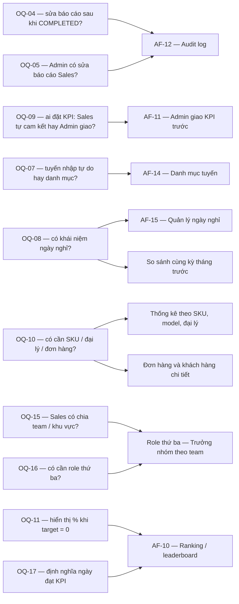
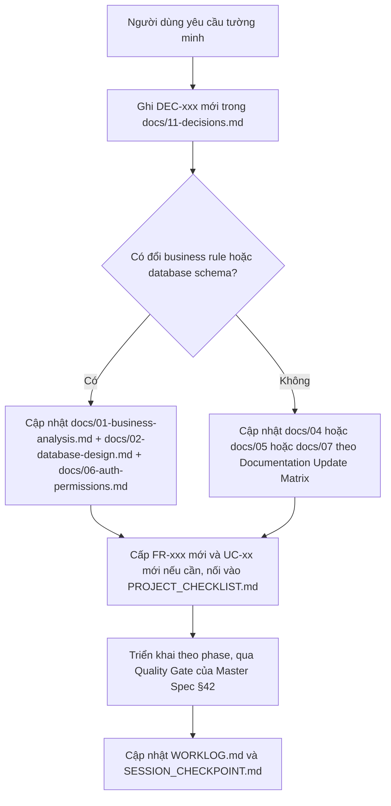

# 10 — Future Roadmap

> Status: DRAFT | Phase: 0 | Last updated: 2026-08-07
> Nguồn sự thật cấp trên: BIKEFORCE_MASTER_SPEC.md → docs/11-decisions.md → tài liệu này

---

## 1. MỤC ĐÍCH TÀI LIỆU

Tài liệu này liệt kê **mọi tính năng nằm ngoài MVP** của BikeForce v1, theo đúng format bắt buộc của Master Spec §54. Mục đích là:

1. **Chống scope creep.** Mọi ý tưởng đã được nghĩ tới đều có chỗ để ghi, nên không ai phải "nhét tạm" nó vào MVP.
2. **Ghi lại lý do hoãn**, để lần sau không phải tranh luận lại từ đầu.
3. **Ghi lại phụ thuộc thật** — phần lớn các mục dưới đây không bị hoãn vì khó, mà vì một quyết định nghiệp vụ đã chốt là "chưa cần ở v1". Sau ngày 2026-08-07, **toàn bộ 17 OPEN QUESTION đã được trả lời**, nên các phụ thuộc dưới đây không còn là "chờ đáp án" mà là **"đã quyết định hoãn"** — muốn đưa lên MVP thì phải tạo `DEC` mới và hỏi lại người dùng.

Phạm vi v1 đã chốt tại brief §2 và Master Spec §39: **Daily Sales Performance Reporting**. Không CRM, không kho, không POS, không đơn hàng, không danh mục sản phẩm.

**Tài liệu này KHÔNG phải là kế hoạch triển khai.** Xem §6 "QUY TẮC BẮT BUỘC" ở cuối.

---

## 2. CÁCH ĐỌC MỘT MỤC

Mỗi mục viết đúng 6 trường theo Master Spec §54:

```text
Feature:
Status:
Priority:
Reason:
Dependency:
Complexity:
```

Quy ước giá trị dùng trong tài liệu này:

| Trường | Giá trị hợp lệ | Ghi chú |
|---|---|---|
| `Status` | `NOT STARTED` | Toàn bộ tài liệu này hiện là `NOT STARTED`. Repository chưa có source code — chưa có gì được bắt đầu, chưa có build/typecheck/lint/test nào được chạy. |
| `Priority` | `SHOULD (v1.1 candidate)` / `LATER` / `OUT OF SCOPE` | Ba nhóm này ánh xạ trực tiếp sang Master Spec §39 (`SHOULD HAVE` / `LATER` / phần "không tự thêm vào MVP"). |
| `Complexity` | `Low` / `Medium` / `High` | Theo thang của Master Spec §69. Với các mục có ID `AF-xx`, giá trị được **giữ nguyên** từ bảng đề xuất Admin feature (brief §15) — không đánh giá lại. |
| `Dependency` | OQ-xx / DEC-xxx / AF-xx / FR-xxx / NFR-xxx / hạ tầng | Ghi phụ thuộc **thật**, không ghi "không có" nếu thực tế có. |

Mục nào đã có ID `AF-xx` trong brief §15 thì **giữ nguyên ID đó**. Mục nào chưa có ID thì cố tình **không** gán ID mới — ID chỉ được cấp khi tính năng được đưa vào phạm vi thật (kèm `DEC-xxx` và `FR-xxx` tương ứng).

---

## 3. BẢN ĐỒ PHỤ THUỘC — TẠI SAO PHẦN LỚN ROADMAP ĐANG BỊ CHẶN

Phần lớn các mục `LATER` không bị chặn vì kỹ thuật, mà vì đang chờ câu trả lời nghiệp vụ. Sơ đồ dưới đây chỉ vẽ lại quan hệ đã có sẵn trong brief §15 và §18 — không thêm phụ thuộc mới.



✅ **Cập nhật 2026-08-07:** toàn bộ 17 OPEN QUESTION đã được trả lời và `ISSUE-001` đã `CLOSED`. Sơ đồ trên vì vậy đọc theo nghĩa mới: mỗi mũi tên không còn là "đang bị chặn" mà là **"đã được quyết định là chưa làm ở v1"**. Cụ thể — OQ-09 trả lời *Sales tự cam kết* nên **AF-11 bị hoãn hẳn**; OQ-08 trả lời *không có ngày nghỉ* nên **AF-15 bị hoãn** (và sinh ra ISSUE-006 được chấp nhận); OQ-04/OQ-05 trả lời *không ai được sửa* nên **AF-12 audit log chưa cần**; OQ-07 trả lời *tuyến nhập tự do* nên **AF-14 bị hoãn**. Nay đã ước lượng được thời gian cho các mục `LATER`, nhưng **không được tự ý triển khai** mục nào nếu người dùng không yêu cầu.

---

## 4. BẢNG TỔNG HỢP

| Nhóm | ID | Tính năng | Complexity | Phụ thuộc chính |
|---|---|---|---|---|
| SHOULD | AF-08 | Trend chart theo ngày trong tháng | Medium | FR-037, UC-15, chọn thư viện chart |
| SHOULD | AF-09 | Export CSV danh sách báo cáo đang filter | Low | FR-034, UC-21, AF-03 |
| SHOULD | AF-09b | Export Excel `.xlsx` | Medium | AF-09, thư viện sinh `.xlsx` chưa chọn |
| SHOULD | AF-10 | Ranking / leaderboard Sales | Low | AF-06, OQ-11, OQ-17 |
| LATER | AF-11 | Admin giao KPI trước cho Sales | High | **OQ-09 (BLOCKING)** |
| LATER | AF-12 | Audit log thay đổi báo cáo | Medium | **OQ-04, OQ-05 (BLOCKING)**, ISSUE-007 |
| LATER | AF-13 | Nhắc nhở tự động qua Zalo / email | High | NFR-013, hạ tầng cron ngoài Vercel Free |
| LATER | AF-14 | Quản lý danh mục Tuyến | Medium | OQ-07 |
| LATER | AF-15 | Quản lý ngày nghỉ / không đi thị trường | Medium | **OQ-08 (BLOCKING)**, ISSUE-006 |
| LATER | — | PWA offline draft sync | High | DEC-024, FR-035, FR-036, NFR-010 |
| LATER | — | Dark mode toàn ứng dụng | Medium | DEC-016, NFR-007 |
| LATER | — | Role thứ ba — Trưởng nhóm theo team | High | OQ-15, OQ-16, DEC-004 |
| LATER | — | So sánh cùng kỳ tháng trước | Medium | AF-05, AF-08, **OQ-08** |
| LATER | — | Push notification | High | AF-13, NFR-013, giới hạn iOS PWA |
| LATER | — | i18n / đa ngôn ngữ | Medium | Chưa có nhu cầu thật |
| LATER | — | Index `pg_trgm` cho search tên Sales | Low | NFR-002, NFR-015, quy mô > 200 Sales |
| OUT OF SCOPE | — | Thống kê theo SKU / model xe / đại lý | High | OQ-10, Master Spec §39 |
| OUT OF SCOPE | — | Đơn hàng và khách hàng chi tiết | High | OQ-10, Master Spec §39 |
| OUT OF SCOPE | — | Ảnh / check-in có GPS | High | Master Spec §39, quyền riêng tư nhân sự |
| OUT OF SCOPE | — | Warehouse / Inventory / POS / Accounting / Delivery | High | Master Spec §39 |

---

## 5. DANH MỤC CHI TIẾT

### 5.1. SHOULD HAVE — ứng viên v1.1

> Ánh xạ Master Spec §39 `SHOULD HAVE`: *dashboard charts hữu ích; CSV/Excel; PWA; draft recovery; missing-report alerts*.
> Đây là nhóm **gần MVP nhất**: nghiệp vụ đã rõ, không cần thêm bảng mới, không cần đổi permission. Vẫn **không** được làm cho tới khi MVP đã chạy thật và người dùng yêu cầu.

---

#### AF-08 — Trend chart theo ngày trong tháng

```text
Feature:      Biểu đồ xu hướng theo ngày trong tháng trên trang /admin/analytics — vẽ target vs actual
              của 4 chỉ tiêu (visit points, sales quantity, revenue, customer visits) theo từng ngày
              của tháng đang chọn, để Admin nhìn ra tuần yếu / ngày sụt thay vì chỉ thấy tổng tháng.
              Ứng với FR-037 (Priority S) và UC-15.
Status:       NOT STARTED
Priority:     SHOULD (v1.1 candidate)
Reason:       Master Spec §18 nói rõ "Có thể có trend theo ngày nếu hữu ích" và "Không nhồi chart", nên
              đây là tính năng được cho phép nhưng không bắt buộc. Giá trị thật (phát hiện tuần yếu)
              nhưng KHÔNG chặn MVP: AF-05 Monthly Analytics đã trả lời được câu hỏi "tháng này đạt bao
              nhiêu %". Hoãn lại còn vì phải thêm một thư viện chart vào bundle, xung đột trực tiếp với
              NFR-001 (LCP < 2.5s trên 4G) và NFR-003 (thư viện nặng không nằm trong initial bundle).
Dependency:   - AF-05 Monthly Analytics phải chạy trước (nguồn dữ liệu aggregate theo tháng).
              - Quyết định chọn thư viện chart: CHƯA CHỌN. Phải import động
                (next/dynamic với ssr:false hoặc tương đương) để giữ NFR-003, và phải ghi thành DEC mới.
              - Quy tắc UI bắt buộc từ docs/05: `data-table` (mọi chart phải có bảng số liệu thay thế),
                `no-pie-overuse`, `gridline-subtle`, `empty-data-state`.
              - OQ-11 (target = 0) — quyết định cách vẽ điểm dữ liệu khi % là `—` thay vì số.
              - OQ-08 (ngày nghỉ) — quyết định vẽ ngày không đi thị trường là 0 hay là khoảng trống.
Complexity:   Medium  (theo brief §15)
```

---

#### AF-09 — Export CSV danh sách báo cáo đang filter

```text
Feature:      Nút "Xuất CSV" trên /admin/reports, xuất đúng tập kết quả đang được filter (ngày / khoảng
              ngày / tháng / Sales / status / search tên) chứ không phải toàn bộ bảng.
              Ứng với FR-034 (Priority S) và UC-21.
Status:       NOT STARTED
Priority:     SHOULD (v1.1 candidate)
Reason:       Master Spec §22 cho phép CSV và yêu cầu "ưu tiên đơn giản". CSV thuần không cần thêm bất kỳ
              dependency nào — chỉ là một Route Handler ghép chuỗi và trả về `text/csv`. Vẫn để ngoài MVP
              vì Admin đã xem và lọc được toàn bộ dữ liệu ngay trên UI (AF-03); xuất file chỉ phục vụ
              việc gửi báo cáo lên cấp trên, không phải nhu cầu vận hành hằng ngày.
Dependency:   - AF-03 Reports list + filter phải xong trước; CSV phải DÙNG LẠI đúng hàm query/filter của
                AF-03 (server-side, theo FR-026) để hai nơi không bao giờ ra hai kết quả khác nhau.
              - Route Handler phải tự kiểm tra role ADMIN (NFR-006) và chạy dưới RLS như mọi đường dữ liệu
                khác (DEC-004). Không được dùng service role key để lách RLS (DEC-005).
              - Encoding: phải xuất UTF-8 có BOM để Excel trên Windows không vỡ dấu tiếng Việt.
              - Tiền tệ: xuất số nguyên VND thô (BR-010), KHÔNG xuất chuỗi đã format bằng
                `formatCurrencyVND()` — nếu không, file mở ra sẽ không tính toán được.
              - Achievement: tính runtime bằng `lib/kpi` (BR-011), phụ thuộc OQ-11 cho trường hợp
                target = 0 (BR-015) — cột % phải xuất `—` chứ không được xuất `NaN`/`Infinity`.
Complexity:   Low  (theo brief §15)
```

---

#### AF-09b — Export Excel `.xlsx`

```text
Feature:      Xuất cùng tập dữ liệu của AF-09 ra file Excel `.xlsx` thật, có header đậm, freeze dòng
              tiêu đề, định dạng cột tiền tệ và cột phần trăm, để cấp trên mở ra dùng được ngay.
Status:       NOT STARTED
Priority:     SHOULD (v1.1 candidate)
Reason:       Master Spec §22 liệt kê Excel song song với CSV nhưng kèm điều kiện: "Nếu dependency /
              complexity cao, đưa vào SHOULD HAVE hoặc roadmap". Đúng trường hợp đó — CSV không cần
              dependency, `.xlsx` thì cần. Tách riêng khỏi AF-09 để CSV có thể ra trước mà không phải
              chờ quyết định về thư viện. Brief §15 đã ghi rõ ý này trong Reason của AF-09.
Dependency:   - AF-09 phải xong trước và phải đã tách được tầng "lấy dữ liệu" ra khỏi tầng "định dạng
                file", để AF-09b chỉ thay tầng định dạng.
              - Thư viện sinh `.xlsx`: **CHƯA CHỌN**. Không chốt ở Phase 0 vì đây là quyết định kỹ thuật
                cần đo kích thước bundle và khả năng chạy trên serverless. Khi chọn phải ghi thành
                `DEC-xxx` mới trong docs/11-decisions.md kèm số liệu bundle size thực đo.
              - Phải chạy hoàn toàn server-side (Route Handler) để không kéo thư viện vào client bundle
                — NFR-003.
              - NFR-013: file lớn có thể vượt giới hạn thời gian/bộ nhớ của Vercel Free. Phải giới hạn số
                dòng xuất tối đa và có thông báo rõ khi vượt.
Complexity:   Medium
              (Không có trong brief §15 vì AF-09b được tách ra từ AF-09; đánh giá Medium do phải thêm
              dependency + nhánh code định dạng thứ hai + ràng buộc bộ nhớ serverless.)
```

---

#### AF-10 — Ranking / leaderboard Sales

```text
Feature:      Xếp hạng Sales trên /admin/sales theo một tiêu chí do Admin chọn (doanh thu, doanh số,
              achievement trung bình, hoặc số ngày đạt KPI), kèm công tắc bật/tắt hiển thị.
Status:       NOT STARTED
Priority:     SHOULD (v1.1 candidate)
Reason:       Về kỹ thuật gần như miễn phí — chỉ là ORDER BY trên đúng tập dữ liệu aggregate mà AF-06 đã
              tính. Nhưng Master Spec §19 chỉ nói "ranking nếu hợp lý" và §19 cấm "gamification phức tạp
              trong MVP". Rủi ro thật nằm ở văn hoá đội: bảng xếp hạng công khai có thể tạo áp lực ngược,
              khuyến khích khai khống số liệu — mà v1 KHÔNG có audit log (AF-12) để phát hiện. Vì vậy
              phải là tính năng Admin bật/tắt được, không bật mặc định, và không hiển thị cho Sales.
Dependency:   - AF-06 Sales Performance table phải xong trước (nguồn số liệu).
              - OQ-17 ĐÃ TRẢ LỜI (2026-08-07): "Ngày đạt KPI" = đạt CẢ 4 chỉ tiêu >= 100% (BR-024,
                APPROVED). Tiêu chí xếp hạng vì vậy đã chốt.
              - OQ-11 ĐÃ TRẢ LỜI (2026-08-07): khi target = 0 và actual > 0 thì achievement trả
                `percent: null` kèm số vượt tuyệt đối (BR-015, APPROVED), và dòng đó bị LOẠI KHỎI
                MẪU SỐ khi tính trung bình. Nhờ vậy lỗ hổng "đặt target = 0 để leo lên đầu bảng" đã
                được bịt ngay ở tầng lib/kpi.ts — leaderboard chỉ cần dùng lại kết quả đó, không
                được tự tính lại.
              - OQ-15 (non-blocking): nếu sau này có team/khu vực thì ranking phải nhóm theo team, không
                thì so sánh Sales thành thị với Sales tỉnh là không công bằng.
              - `lib/kpi` là nơi duy nhất được tính achievement (BR-011, NFR-012) — ranking không được
                tự tính lại công thức.
Complexity:   Low  (theo brief §15)
```

---

### 5.2. LATER — chưa làm, chưa lên lịch

> Ánh xạ Master Spec §39 `LATER`. Nhóm này gồm hai loại: (a) đang chờ một OPEN QUESTION nghiệp vụ, và
> (b) đã có quyết định APPROVED loại nó khỏi v1 (DEC-016, DEC-024) — muốn làm phải sửa quyết định đó.

---

#### AF-11 — Admin giao KPI trước cho Sales

```text
Feature:      Đảo chiều luồng đặt mục tiêu: Admin giao chỉ tiêu (visit points / sales quantity / revenue /
              customer visits) cho từng Sales theo ngày hoặc theo tháng, Sales chỉ nhận và nhập kết quả
              thực đạt, không còn tự cam kết buổi sáng.
Status:       NOT STARTED
Priority:     LATER
Reason:       Đây KHÔNG phải một tính năng cộng thêm — nó thay đổi mô hình nghiệp vụ lõi. Master Spec §7
              và brief §2 định nghĩa v1 là "Sales cam kết KPI đầu ngày", toàn bộ UC-04, UC-05, UC-06,
              BR-008, BR-021 và cả bảng `daily_reports` đều dựng trên giả định đó. Nếu chuyển sang mô
              hình giao chỉ tiêu thì target không còn thuộc về báo cáo ngày nữa mà phải tách sang một
              bảng `targets` riêng, và Admin cần quyền ghi mới — điều mà BR-020 hiện đang cấm.
              Không được làm song song hai mô hình.
Dependency:   - **OQ-09 (BLOCKING)** — đề xuất mặc định là "Sales tự cam kết". Chỉ khi người dùng trả lời
                ngược lại thì AF-11 mới có nghĩa.
              - Bảng mới `targets` (chưa thiết kế) + đổi lại vòng đời trạng thái BR-008.
              - BR-020 phải được viết lại (Admin hiện không được ghi số liệu của Sales) → RLS policy mới
                trên `daily_reports` và/hoặc `targets`.
              - AF-12 Audit log: khi có hai người cùng chạm vào một con số, tranh chấp số liệu là chắc
                chắn xảy ra — audit log trở thành bắt buộc chứ không còn là tuỳ chọn.
              - Toàn bộ docs/01, docs/02, docs/03, docs/06 phải cập nhật lại.
Complexity:   High  (theo brief §15)
```

---

#### AF-12 — Audit log thay đổi báo cáo

```text
Feature:      Bảng append-only ghi lại mọi thay đổi trên `daily_reports`: ai sửa, sửa lúc nào, cột nào,
              giá trị cũ → giá trị mới. Kèm màn hình xem lịch sử thay đổi của một báo cáo.
Status:       NOT STARTED
Priority:     LATER
Reason:       Ở phương án mặc định của v1, audit log gần như KHÔNG cần: BR-019 khoá báo cáo ngay khi
              chuyển sang COMPLETED và BR-020 cấm Admin sửa số liệu của Sales, nên sau khi hoàn tất thì
              không còn ai được thay đổi gì để mà truy vết. Audit log chỉ trở thành bắt buộc nếu OQ-04
              hoặc OQ-05 trả lời theo hướng "được sửa sau khi hoàn tất". Đây chính là nội dung của
              ISSUE-007 (P3): nếu mở quyền sửa mà chưa có audit log thì số liệu đã gửi Zalo có thể bị
              đổi âm thầm — phải bổ sung audit log TRƯỚC khi bật quyền đó, không phải sau.
Dependency:   - **OQ-04 (BLOCKING)** — Sales sửa sau khi COMPLETED? Mặc định: không.
              - **OQ-05 (BLOCKING)** — Admin sửa báo cáo Sales? Mặc định: không trong v1.
              - Nếu một trong hai được mở: bảng mới + trigger `AFTER UPDATE` trên `daily_reports` +
                RLS chỉ cho Admin đọc + policy chặn UPDATE/DELETE trên chính bảng log.
              - ISSUE-007 phải chuyển trạng thái khi tính năng này được lên lịch.
              - NFR-015: log ghi theo cột sẽ tăng số dòng nhanh hơn `daily_reports` — cần chính sách lưu
                trữ/xoá theo thời gian, phải cân nhắc cùng NFR-013 (hạn mức Supabase Free).
Complexity:   Medium  (theo brief §15)
```

---

#### AF-13 — Nhắc nhở tự động qua Zalo / email

```text
Feature:      Job chạy theo giờ cố định (ví dụ nhắc buổi sáng và nhắc cuối ngày) tự động gửi tin cho
              những Sales chưa tạo báo cáo sáng hoặc đã có báo cáo sáng nhưng chưa hoàn tất cuối ngày.
Status:       NOT STARTED
Priority:     LATER
Reason:       Giá trị vận hành cao — thay thế việc Admin phải nhắc tay từng người. Nhưng v1 đã có AF-02
              Missing Report Alerts giải quyết 80% nhu cầu bằng 0 hạ tầng: Admin mở /admin là thấy ngay
              ai chưa báo cáo. Phần còn lại (tự động đẩy tin) đòi hỏi scheduler chạy nền + tích hợp
              Zalo OA API hoặc dịch vụ email — vượt ra ngoài NFR-013 (chạy trong hạn mức Vercel Free +
              Supabase Free, không cron/queue). Ngoài ra brief §3 ghi rõ Zalo trong v1 chỉ là kênh nhận
              file PNG thủ công, KHÔNG có tích hợp API — mở tích hợp là thêm một hệ thống ngoài phải
              quản lý credential, rate limit và lỗi gửi.
Dependency:   - NFR-013 phải được nới (chấp nhận chi phí hạ tầng) — cần quyết định của người dùng.
              - Hạ tầng scheduler: chưa chọn. Ứng viên gồm Supabase scheduled function hoặc cron ngoài;
                phải ghi thành DEC mới khi chọn.
              - Tài khoản Zalo OA đã duyệt và/hoặc dịch vụ gửi email + domain đã xác thực. Toàn bộ
                credential lưu server-side, không có prefix `NEXT_PUBLIC_` (brief §10).
              - **OQ-08 (BLOCKING)** — nếu không có khái niệm ngày nghỉ thì hệ thống sẽ nhắc cả người
                đang nghỉ phép. Đây là ISSUE-006 ở dạng nặng hơn: cảnh báo giả trên UI thì khó chịu, tin
                nhắn giả gửi thẳng vào Zalo cá nhân thì phản tác dụng.
              - AF-15 nên làm trước AF-13.
Complexity:   High  (theo brief §15)
```

---

#### AF-14 — Quản lý danh mục Tuyến (route master data)

```text
Feature:      Bảng `routes` do Admin quản lý; form báo cáo sáng chọn tuyến từ danh mục thay vì gõ tự do;
              mở ra khả năng thống kê hiệu quả theo tuyến.
Status:       NOT STARTED
Priority:     LATER
Reason:       Hiện `planned_route` và `actual_route` là text tự do (brief §9). Điều đó khiến câu hỏi
              "tuyến nào hiệu quả nhất" KHÔNG trả lời được, vì "Q.1 - Q.3", "Quận 1, Quận 3" và
              "quan 1 - quan 3" là ba giá trị khác nhau. Đổi sang danh mục sẽ chuẩn hoá được dữ liệu,
              nhưng đó là quyết định nghiệp vụ (ai được tạo tuyến? tuyến cũ đã nhập thì migrate thế nào?)
              chứ không phải quyết định kỹ thuật. Đề xuất mặc định của OQ-07 cho v1 là giữ nhập tự do +
              gợi ý 5 tuyến gần nhất của chính Sales — rẻ và đủ dùng cho quy mô hiện tại.
Dependency:   - OQ-07 (non-blocking) — nhập tự do hay Admin cấu hình sẵn.
              - Bảng mới `routes` + FK từ `daily_reports`, hoặc giữ text và thêm cột `route_id` nullable
                để migrate dần. Cách nào cũng phải viết migration mới (không sửa migration cũ) và
                regenerate `types/database.types.ts`.
              - Kế hoạch migrate dữ liệu tuyến text đã có sang danh mục — không thể tự động hoá hoàn toàn.
              - Màn hình quản trị mới + RLS policy cho `routes` (Admin ghi, Sales chỉ đọc).
Complexity:   Medium  (theo brief §15)
```

---

#### AF-15 — Quản lý ngày nghỉ / không đi thị trường

```text
Feature:      Cho phép đánh dấu một Sales nghỉ phép / không đi thị trường trong một ngày, để hệ thống
              không tính ngày đó là "chưa báo cáo" và loại nó khỏi mẫu số của các tỷ lệ tuân thủ.
Status:       NOT STARTED
Priority:     LATER
Reason:       Đây là nguyên nhân trực tiếp của ISSUE-006 (P3): chỉ số "Sales chưa báo cáo" trên
              /admin sẽ báo động giả cho người đang nghỉ phép, và về lâu dài Admin sẽ mất niềm tin vào
              cảnh báo — làm hỏng luôn giá trị của AF-02, tính năng vận hành quan trọng nhất. Vẫn để
              LATER vì đề xuất mặc định của OQ-08 là v1 KHÔNG có khái niệm ngày nghỉ; Admin tự biết ai
              nghỉ. Với quy mô ~50 Sales (NFR-015) điều đó còn chấp nhận được.
Dependency:   - **OQ-08 (BLOCKING)** — phải có câu trả lời trước khi thiết kế.
              - Bảng mới (ví dụ `absences`) hoặc một trạng thái báo cáo thứ ba. Lưu ý DEC-020 đã chốt
                chỉ có 2 trạng thái `MORNING_SUBMITTED` / `COMPLETED`; thêm trạng thái thứ ba là SỬA
                DEC-020, phải ghi lại chứ không được làm lặng lẽ.
              - Ai được đánh dấu nghỉ: Sales tự khai hay Admin duyệt? Đây là câu hỏi permission mới,
                chưa có OQ nào phủ — phải bổ sung vào danh sách OQ ở docs/01 trước khi triển khai.
              - Ảnh hưởng ngược lên AF-02 (đếm chưa báo cáo), AF-06 (số ngày đạt KPI, BR-024) và mục
                "so sánh cùng kỳ tháng trước" (số ngày làm việc mỗi tháng khác nhau).
Complexity:   Medium  (theo brief §15)
```

---

#### PWA offline draft sync

```text
Feature:      Service worker + hàng đợi ghi offline: Sales nhập báo cáo ở nơi không có sóng, dữ liệu nằm
              trong hàng đợi cục bộ và tự đồng bộ lên Supabase khi có mạng trở lại.
Status:       NOT STARTED
Priority:     LATER
Reason:       DEC-024 đã chốt: v1 chỉ có PWA manifest + Add to Home Screen (FR-036), KHÔNG service worker,
              KHÔNG offline sync — đúng Master Spec §29 ("Không bắt buộc offline sync trong MVP").
              Nhu cầu "không mất dữ liệu khi mạng chập chờn" đã được xử lý ở mức rẻ hơn nhiều bằng
              FR-035: draft trong localStorage + `form-autosave` + `sheet-dismiss-confirm` + giữ nguyên
              form khi request fail (NFR-010). Offline sync THẬT thì khác hẳn về bản chất: nó tạo ra một
              nguồn sự thật thứ hai trên máy người dùng, trong khi Master Spec §30 nói rõ "Server vẫn là
              source of truth". Khi đó phải trả lời: nếu bản offline và bản server xung đột thì bên nào
              thắng? BR-001 (UNIQUE sales_id + report_date) và BR-021 (chỉ nhập cho đúng ngày hôm nay)
              sẽ va chạm trực tiếp với một hàng đợi đồng bộ trễ qua nửa đêm.
Dependency:   - Sửa DEC-024 bằng một DEC mới — không được ngầm bỏ qua.
              - Chiến lược giải quyết xung đột phải được viết ra và duyệt trước khi code.
              - BR-005 / BR-021 / NFR-011: ngày nghiệp vụ theo `Asia/Ho_Chi_Minh`. Bản ghi tạo lúc 23:50
                nhưng đồng bộ lúc 00:10 thuộc về ngày nào?
              - RLS `reports_insert_own_today` yêu cầu `report_date = public.vn_today()` — chính sách này
                sẽ TỪ CHỐI mọi bản đồng bộ trễ qua ngày. Phải thiết kế lại policy, không phải nới lỏng nó.
              - NFR-010 phải được mở rộng test: hiện chỉ có E2E offline test ở mức "save thất bại không
                mất dữ liệu".
Complexity:   High
```

---

#### Dark mode toàn ứng dụng

```text
Feature:      Chế độ tối cho toàn bộ giao diện app, theo `prefers-color-scheme` và/hoặc công tắc thủ công,
              có lưu lựa chọn của người dùng.
Status:       NOT STARTED
Priority:     LATER
Reason:       DEC-016 đã chốt: v1 chỉ có light mode, ngoại lệ duy nhất là thẻ share 9:16 vốn dark cố định
              (`#0B1220`). Lý do không phải vì khó làm mà vì chi phí kiểm chứng: toàn bộ bảng màu ở
              docs/05 đã được ĐO contrast thủ công cho nền sáng (NFR-007 yêu cầu WCAG 2.2 AA — text ≥
              4.5:1, UI component ≥ 3:1). Làm dark mode nghĩa là phải đo lại TOÀN BỘ bảng token lần hai,
              gồm cả 5 badge trạng thái achievement (BR-023) và màu viền control `--color-input-border`.
              Đây là công việc thật, không phải "thêm biến CSS". Ngoài ra bối cảnh sử dụng thực tế là
              Sales ngoài trời giữa ban ngày — nền sáng có độ đọc tốt hơn dưới nắng.
Dependency:   - Sửa DEC-016 bằng một DEC mới.
              - Bộ token dark đầy đủ + bảng contrast ĐO THẬT cho từng cặp màu, bổ sung vào docs/05.
              - Kiểm lại 5 badge trạng thái BR-023 trên nền tối.
              - Bổ sung axe scan ở chế độ tối vào bộ test A11y (docs/08).
              - Lưu ý: thẻ share 9:16 KHÔNG đổi theo dark mode — nó luôn dark, để ảnh gửi Zalo luôn
                giống nhau.
Complexity:   Medium
```

---

#### Role thứ ba — Trưởng nhóm theo team

```text
Feature:      Thêm một role giữa Admin và Sales: Trưởng nhóm chỉ xem được báo cáo và số liệu của các
              Sales trong team mình, không thấy toàn công ty và không quản lý tài khoản.
Status:       NOT STARTED
Priority:     LATER
Reason:       Brief §3 ghi rõ v1 chỉ có Admin và Sales, không có Manager/Supervisor. Đề xuất mặc định của
              OQ-16 là không thêm role thứ ba trong v1, và OQ-15 là chưa chia team/khu vực. Với ~50 Sales
              (NFR-015) thì một Admin nhìn toàn đội vẫn quản được. Thêm role thứ ba là thay đổi nền tảng
              phân quyền: hiện `is_admin()` và `is_active_sales()` là hai hàm nhị phân, và mọi RLS policy
              đều viết theo dạng "của chính mình HOẶC admin". Mô hình theo team đòi hỏi phân quyền theo
              phạm vi dữ liệu, không còn là nhị phân nữa.
Dependency:   - OQ-15 (non-blocking) — phải có `team` trước, vì không có team thì "trưởng nhóm" không có
                phạm vi. Brief §18 ghi thêm cột `team` nullable vào `profiles` là rẻ; phần đắt là phần sau.
              - OQ-16 (non-blocking) — xác nhận có cần role này.
              - Thêm giá trị vào enum `user_role` + viết lại toàn bộ RLS policy trên `profiles` và
                `daily_reports` + thêm hàm helper mới kiểu `is_team_leader_of()`.
              - ISSUE-005 sẽ nặng thêm: mỗi câu lệnh đang phải truy vấn `profiles` một lần để biết role;
                thêm phạm vi team là thêm join. Có thể phải chuyển role + team vào custom JWT claim.
              - Navigation và page map (brief §12, §13) phải có nhánh thứ ba; DEC-018 (bottom nav ≤ 5 mục)
                vẫn phải được giữ.
              - Bộ test RLS ở docs/08 phải thêm ít nhất 2 user mới: leader team A, Sales team B.
Complexity:   High
```

---

#### So sánh cùng kỳ tháng trước

```text
Feature:      Trên /admin/analytics, hiển thị thêm cột/dòng so sánh với cùng kỳ tháng trước cho 4 chỉ
              tiêu, kèm mức tăng/giảm theo % và dấu hiệu xu hướng.
Status:       NOT STARTED
Priority:     LATER
Reason:       Nghe đơn giản nhưng dễ tạo ra số liệu sai lệch nếu làm ẩu, vì "cùng kỳ" không có định nghĩa
              hiển nhiên: tháng 2 có 28 ngày, tháng 8 có 31 ngày, và số ngày làm việc thực tế còn lệch
              nữa. So sánh tổng doanh thu tháng này với tháng trước mà không chuẩn hoá theo số ngày làm
              việc sẽ cho Admin một kết luận sai. Chuẩn hoá được thì lại phải biết ngày nào là ngày nghỉ
              — tức là phụ thuộc AF-15. Master Spec §18 cũng nhắc "Không nhồi chart". Vì vậy hoãn cho tới
              khi AF-15 có câu trả lời, thay vì làm một phép so sánh trông thông minh nhưng không đúng.
Dependency:   - AF-05 Monthly Analytics (FR-028) phải xong.
              - AF-08 nên xong trước nếu muốn thể hiện dạng biểu đồ chồng hai tháng.
              - **OQ-08 (BLOCKING)** và AF-15 — để định nghĩa mẫu số "số ngày làm việc".
              - Quyết định định nghĩa "cùng kỳ": cùng số thứ tự ngày trong tháng, hay cùng số ngày làm
                việc đầu tiên? Chưa có OQ nào phủ câu hỏi này — phải bổ sung vào docs/01 trước khi làm.
              - OQ-11 (BLOCKING): tháng có bản ghi target = 0 sẽ làm lệch phép so sánh %.
              - NFR-002: cần thêm một truy vấn aggregate cho khoảng ngày thứ hai; phải dùng index
                `idx_daily_reports_date_status`, không được quét toàn bảng.
Complexity:   Medium
```

---

#### Push notification

```text
Feature:      Web Push đẩy thông báo thẳng vào điện thoại Sales: nhắc tạo báo cáo sáng, nhắc hoàn tất
              cuối ngày, và báo cho Admin khi cả đội đã nộp đủ.
Status:       NOT STARTED
Priority:     LATER
Reason:       Cùng nhóm vấn đề với AF-13 nhưng khó hơn về mặt nền tảng. Web Push cần service worker
              (mà DEC-024 đã loại khỏi v1), cần quản lý push subscription cho từng thiết bị, cần VAPID
              key, và trên iOS chỉ hoạt động khi người dùng ĐÃ cài app vào màn hình chính — một điều
              kiện mà thực tế nhiều Sales sẽ không làm. Bối cảnh sử dụng lại càng làm nó kém giá trị:
              theo brief §3, Sales dùng app trong Zalo in-app webview, nơi web push gần như chắc chắn
              không hoạt động (ISSUE-003 ghi nhận rằng ngay cả Web Share API trong webview này còn chưa
              được kiểm chứng thực tế). Nhắc qua đúng kênh Sales đang dùng (AF-13) thực dụng hơn nhiều.
Dependency:   - AF-13 nên làm trước và có thể khiến push trở nên không cần thiết.
              - Sửa DEC-024 (cần service worker).
              - Bảng lưu push subscription + cơ chế dọn subscription chết.
              - NFR-013 và NFR-009: cần một dịch vụ đẩy chạy nền; cần kiểm chứng thật trên iOS Safari,
                Chrome Android và Zalo webview (ISSUE-003).
              - Quy tắc chống làm phiền: giờ gửi, tần suất tối đa, và cách người dùng tắt.
Complexity:   High
```

---

#### i18n / đa ngôn ngữ

```text
Feature:      Tách toàn bộ chuỗi hiển thị ra file ngôn ngữ và hỗ trợ chuyển đổi ngôn ngữ giao diện.
Status:       NOT STARTED
Priority:     LATER
Reason:       BikeForce là ứng dụng NỘI BỘ cho đội Sales người Việt (brief §2). Hiện không có người dùng
              nào cần ngôn ngữ khác, nên i18n chỉ tạo ra chi phí bảo trì mà không mang lại giá trị: mọi
              chuỗi phải qua một lớp trung gian, mọi PR phải nhớ cập nhật file ngôn ngữ. Ghi vào roadmap
              để nếu sau này thật sự cần thì biết phải đụng vào đâu, chứ không phải để làm sớm.
              Lưu ý phần ĐỊNH DẠNG đã được xử lý đúng ngay từ v1 và KHÔNG cần chờ i18n:
              `formatCurrencyVND()` dùng `Intl.NumberFormat('vi-VN')` (DEC-008) và `lib/date` dùng
              `Intl.DateTimeFormat` với timezone `Asia/Ho_Chi_Minh` (DEC-009).
Dependency:   - Có nhu cầu thật từ người dùng (đội ngũ không dùng tiếng Việt).
              - Chiến lược định tuyến ngôn ngữ; ảnh hưởng toàn bộ page map ở brief §12.
              - Thẻ share 9:16 (DEC-010): Satori nhúng font từ file trong repo, mỗi ngôn ngữ mới có thể
                cần thêm subset font — làm tăng kích thước repo và thời gian render.
              - Font Inter hiện chỉ subset `['latin','vietnamese']` (DEC-013) — ngôn ngữ ngoài hai subset
                này sẽ vỡ chữ.
Complexity:   Medium
```

---

#### Index `pg_trgm` cho search tên Sales

```text
Feature:      Bật extension `pg_trgm` và tạo index GIN `idx_profiles_full_name_trgm` trên
              `profiles(full_name)` để phục vụ ô search tên ở màn hình Admin.
Status:       NOT STARTED
Priority:     LATER
Reason:       Đây là mục kỹ thuật thuần, đã được ghi nhận sẵn trong thiết kế database (brief §9) như một
              việc CHƯA làm ở v1. Với quy mô thiết kế là ~50 Sales (NFR-015), một câu `ilike` quét tuần
              tự trên vài chục dòng `profiles` là hoàn toàn đủ nhanh; thêm index GIN lúc này chỉ tốn chi
              phí ghi và dung lượng mà không đo được lợi ích. Ngưỡng kích hoạt đã định sẵn: khi số Sales
              vượt khoảng 200. Ghi ra đây để sau này không ai phải "phát hiện lại" vấn đề khi màn hình
              Admin bắt đầu chậm.
Dependency:   - Quy mô dữ liệu thực tế vượt ~200 profiles.
              - Số đo `EXPLAIN ANALYZE` chứng minh câu search đang là seq scan gây chậm thật (NFR-002)
                — không thêm index theo cảm tính.
              - Migration mới (chỉ tiến tới, theo brief §17), không sửa migration cũ.
Complexity:   Low
```

---

### 5.3. OUT OF SCOPE — ngoài phạm vi sản phẩm v1

> Ánh xạ Master Spec §39 phần "Không tự thêm vào MVP ... trừ khi người dùng yêu cầu".
> Khác biệt so với nhóm `LATER`: các mục ở đây không chỉ là chưa làm, mà là **đi ngược định nghĩa sản
> phẩm**. BikeForce v1 là công cụ báo cáo hiệu suất ngày, không phải hệ thống quản trị kinh doanh.
> Muốn làm bất kỳ mục nào dưới đây thì phải định nghĩa lại sản phẩm, không phải thêm một màn hình.

---

#### Thống kê theo SKU / model xe / đại lý

```text
Feature:      Sales khai báo bán được model xe nào, số lượng bao nhiêu, cho đại lý nào; Admin thống kê
              theo SKU, theo model và theo đại lý.
Status:       NOT STARTED
Priority:     OUT OF SCOPE
Reason:       Master Spec §39 xếp "product catalog phức tạp" và "dealer CRM" vào nhóm không tự thêm vào
              MVP. Đề xuất mặc định của OQ-10 là v1 KHÔNG cần SKU/model/đại lý/đơn hàng — chỉ ghi TỔNG
              số lượng (`target_sales_quantity` / `actual_sales_quantity`) và TỔNG tiền
              (`target_revenue` / `actual_revenue`). Đây là lựa chọn có chủ đích, không phải thiếu sót:
              nó giữ thời gian nhập báo cáo trong 60 giây và 6 lần chạm (NFR-008). Thêm danh mục sản phẩm
              nghĩa là mỗi báo cáo trở thành một danh sách dòng thay vì 4 con số, kéo theo bảng sản phẩm,
              bảng đại lý, bảng dòng báo cáo — và biến BikeForce thành một hệ thống khác hẳn.
Dependency:   - OQ-10 (non-blocking) phải được trả lời NGƯỢC với đề xuất mặc định.
              - Yêu cầu tường minh từ người dùng + một DEC mới định nghĩa lại phạm vi sản phẩm.
              - Mô hình dữ liệu mới: bảng sản phẩm/model, bảng đại lý, bảng dòng chi tiết báo cáo. Toàn
                bộ docs/02 phải viết lại, không phải bổ sung.
              - Thiết kế lại UC-04 và UC-06 để không phá NFR-008.
              - Thẻ share 9:16 (DEC-010) phải thiết kế lại: layout hiện tại là bảng cố định 4 dòng, không
                chứa được danh sách sản phẩm có độ dài thay đổi.
Complexity:   High
```

---

#### Đơn hàng và khách hàng chi tiết

```text
Feature:      Quản lý từng đơn hàng và từng khách hàng: thông tin liên hệ, lịch sử mua, trạng thái đơn,
              công nợ, pipeline cơ hội.
Status:       NOT STARTED
Priority:     OUT OF SCOPE
Reason:       Đây chính là "CRM lớn" mà Master Spec §39 loại khỏi phạm vi, và brief §2 nói thẳng: v1
              "không CRM, không đơn hàng". Trong v1, khách hàng chỉ tồn tại dưới dạng ĐẾM
              (`target_customer_visits` / `actual_customer_visits`) và doanh thu chỉ là một con số tổng
              theo ngày — theo OQ-14 là giá trị đơn hàng chốt trong ngày. Không có thực thể khách hàng,
              không có thực thể đơn hàng. Thêm chúng sẽ kéo theo dữ liệu cá nhân của khách (họ tên, số
              điện thoại, địa chỉ) — tức là một lớp nghĩa vụ bảo mật và quyền riêng tư hoàn toàn mới,
              trong khi mô hình bảo mật hiện tại (RLS theo `sales_id`, DEC-004) chỉ được thiết kế cho
              dữ liệu nội bộ của nhân viên.
Dependency:   - OQ-10 và OQ-14 phải được mở lại.
              - Yêu cầu tường minh từ người dùng + DEC mới định nghĩa lại phạm vi sản phẩm.
              - Mô hình dữ liệu và mô hình phân quyền mới hoàn toàn (ai được xem khách của ai?).
              - Đánh giá nghĩa vụ pháp lý về dữ liệu cá nhân trước khi thiết kế schema.
Complexity:   High
```

---

#### Ảnh / check-in có GPS

```text
Feature:      Sales chụp ảnh tại điểm bán và/hoặc check-in kèm toạ độ GPS để chứng minh đã tới nơi;
              Admin xem lại vị trí và thời điểm check-in.
Status:       NOT STARTED
Priority:     OUT OF SCOPE
Reason:       Master Spec §39 liệt kê "GPS tracking" trong nhóm không tự thêm vào MVP. Ngoài lý do phạm
              vi còn có ba rào cản thật: (1) đây là giám sát vị trí nhân viên — một quyết định về chính
              sách nhân sự và quyền riêng tư, tuyệt đối không phải quyết định kỹ thuật mà đội phát triển
              được tự chốt; (2) cần Supabase Storage cho ảnh, trong khi DEC-021 đã chốt v1 KHÔNG dùng
              Storage và NFR-013 yêu cầu chạy trong hạn mức Free; (3) toạ độ GPS từ trình duyệt có thể
              bị giả mạo dễ dàng, nên nó tạo ra cảm giác kiểm soát chứ chưa chắc tạo ra bằng chứng thật.
              Mô hình v1 dựa trên tin cậy và đối chiếu số liệu, không dựa trên giám sát.
Dependency:   - Yêu cầu tường minh từ người dùng, kèm chính sách nhân sự đã được thống nhất với đội Sales.
              - Sửa DEC-021 (cần Storage cho ảnh) và đánh giá lại NFR-013.
              - Cột/bảng lưu toạ độ + ảnh; RLS cho bucket Storage.
              - Kiểm chứng quyền truy cập vị trí và camera trong Zalo in-app webview (ISSUE-003).
Complexity:   High
```

---

#### Warehouse / Inventory / POS / Accounting / Delivery management

```text
Feature:      Các module quản trị kinh doanh xung quanh: quản lý kho, tồn kho, bán hàng tại quầy, kế toán,
              và quản lý giao hàng.
Status:       NOT STARTED
Priority:     OUT OF SCOPE
Reason:       Master Spec §39 liệt kê nguyên văn nhóm này (warehouse, inventory, POS, accounting,
              delivery management) và kết luận: BikeForce v1 tập trung vào **Daily Sales Performance
              Reporting**. Ghi nguyên nhóm vào đây không phải để lên kế hoạch, mà để có một chỗ trả lời
              dứt điểm khi ai đó đề nghị "thêm luôn quản lý kho cho tiện". Câu trả lời mặc định là KHÔNG,
              trừ khi người dùng yêu cầu tường minh. Mỗi module trong nhóm này là một sản phẩm riêng, có
              vòng đời dữ liệu riêng và thường có sẵn phần mềm chuyên dụng tốt hơn.
Dependency:   - Yêu cầu tường minh từ người dùng cho TỪNG module, kèm DEC riêng cho từng module.
              - Nếu thật sự cần: đánh giá tích hợp với hệ thống có sẵn trước, thay vì tự xây trong
                BikeForce.
Complexity:   High
```

---

## 6. QUY TẮC BẮT BUỘC — KHÔNG TỰ TRIỂN KHAI ROADMAP

Đây là phần quan trọng nhất của tài liệu. Master Spec §54 kết luận bằng đúng một câu: **"Không tự triển khai roadmap."**

1. **Không một mục nào trong tài liệu này được triển khai nếu không có yêu cầu tường minh từ người dùng.** Việc một tính năng được mô tả kỹ ở đây KHÔNG phải là sự cho phép. Tài liệu này ghi lại những gì đã được cân nhắc và cố ý hoãn — nó là hàng rào, không phải backlog.

2. **Không được lặng lẽ "làm luôn cho tiện".** Kể cả với các mục `Complexity: Low` (AF-09, AF-10, index `pg_trgm`), việc thêm vào trong lúc làm một task khác là vi phạm phạm vi. Nếu thấy một mục quá dễ để bỏ qua, hãy đề xuất, đừng tự làm.

3. **Muốn đưa một mục lên MVP thì phải qua đủ các bước sau, theo đúng thứ tự:**



4. **`DEC-xxx` mới là điều kiện bắt buộc, không phải thủ tục hình thức.** Entry đó phải ghi đủ 6 trường theo Master Spec §55 (`Date` / `Decision` / `Reason` / `Alternatives` / `Impact` / `Status`) và phải nêu rõ nó thay thế/sửa quyết định nào. Một số mục trong tài liệu này bắt buộc phải SỬA một quyết định đã `APPROVED`:

   | Mục | Quyết định phải sửa trước |
   |---|---|
   | PWA offline draft sync | DEC-024 (PWA chỉ manifest, không service worker/offline sync) |
   | Push notification | DEC-024 (cần service worker) |
   | Dark mode toàn ứng dụng | DEC-016 (không dark mode ở v1) |
   | Ảnh / check-in có GPS | DEC-021 (không dùng Supabase Storage) |
   | AF-15 nếu thêm trạng thái thứ ba | DEC-020 (chỉ 2 trạng thái `MORNING_SUBMITTED` / `COMPLETED`) |
   | AF-11 Admin giao KPI trước | BR-020 (Admin không ghi số liệu báo cáo) và DEC-026 |

   Theo Master Spec §55: không được tự thay đổi quyết định đã `APPROVED` mà không cập nhật log, và phải hỏi người dùng nếu đó là quyết định nghiệp vụ.

5. **Không được ước lượng thời gian cho các mục đang chờ OPEN QUESTION.** Ước lượng một tính năng chưa biết nghiệp vụ là con số bịa. Xem sơ đồ ở §3.

6. **Mục được đưa vào phạm vi thì phải rời khỏi tài liệu này.** Không để một tính năng tồn tại đồng thời ở roadmap và ở `docs/01-business-analysis.md` — sẽ dẫn tới hai phiên bản mô tả lệch nhau. Khi promote, chuyển nội dung sang docs/01 (dạng `FR-xxx`) và để lại ở đây một dòng ghi rõ đã promote vào ngày nào theo `DEC-xxx` nào.

7. **Trạng thái hiện tại của repository:** chưa có source code, chưa có `package.json`; đã là git repository và đã push lên GitHub (DEC-028), nhưng nội dung mới chỉ gồm tài liệu Phase 0. Chưa có build, typecheck, lint hay test nào được chạy — tất cả đều ở trạng thái `N/A`. Vì vậy toàn bộ tài liệu này là `NOT STARTED` theo nghĩa đen, không phải theo nghĩa quy ước.

---

## 7. NHỮNG THỨ *KHÔNG* NẰM TRONG TÀI LIỆU NÀY

Để tránh nhầm lẫn khi đọc chéo với các tài liệu khác:

- **AF-01 → AF-07** (Today Overview, Missing Report Alerts, Reports list + filter, Report detail, Monthly Analytics, Sales Performance table, Sales Management) là **MVP: Yes** theo brief §15. Chúng nằm trong `docs/01-business-analysis.md` và `PROJECT_CHECKLIST.md`, không nằm ở đây.
- **FR-035** (draft cục bộ bằng localStorage) và **FR-036** (PWA manifest + Add to Home Screen) đã nằm trong kế hoạch v1 với Priority `S`. Chỉ phần *offline sync thật* mới thuộc roadmap — xem mục "PWA offline draft sync".
- **FR-020** (Web Share API với fallback `<a download>`) là Priority `S` trong v1 theo DEC-011, không phải roadmap.
- **Fallback `html-to-image`** cho ảnh 9:16 không phải một mục roadmap mà là phương án dự phòng đã ghi nhận của DEC-010, gắn với ISSUE-002. Nếu phải dùng thì ghi thành DEC mới ở Phase 6.

**Điểm cần chốt khi cập nhật docs/01 và docs/11:** brief §15 xếp **AF-02 Missing Report Alerts** là `MVP: Yes`, trong khi brief §5 xếp **FR-033** (cùng nội dung: cảnh báo Sales chưa báo cáo sáng / chưa hoàn tất cuối ngày) là Priority `S`. Hai chỗ này chưa thống nhất. Tài liệu roadmap **không tự chọn** bên nào — AF-02 hiện KHÔNG được đưa vào danh mục roadmap ở trên, và việc chốt `M` hay `S` phải được ghi thành một entry trong `docs/11-decisions.md` trước khi bắt đầu Phase 8.

---

## OPEN QUESTIONS

Các `OQ-xx` ảnh hưởng trực tiếp tới tài liệu này. Danh sách đầy đủ 17 câu ở `docs/01-business-analysis.md §OPEN QUESTIONS`.

| ID | Câu hỏi rút gọn | Mức | Đề xuất mặc định | Chặn mục nào trong roadmap |
|---|---|---|---|---|
| OQ-04 | Sales hoàn tất báo cáo cuối ngày rồi có được sửa không? | **BLOCKING** | Khoá ngay khi `COMPLETED` | AF-12 |
| OQ-05 | Admin có được sửa báo cáo của Sales không? | **BLOCKING** | Không trong v1 | AF-12 |
| OQ-07 | Tuyến nhập tự do hay Admin cấu hình danh sách sẵn? | NON-BLOCKING | v1 nhập tự do + gợi ý 5 tuyến gần nhất | AF-14 |
| OQ-08 | Có khái niệm ngày nghỉ / không đi thị trường không? | **BLOCKING** | v1 không có | AF-15, AF-13, AF-08, "So sánh cùng kỳ tháng trước" |
| OQ-09 | KPI do Sales tự cam kết hay Admin giao trước? | **BLOCKING** | Sales tự cam kết | AF-11 |
| OQ-10 | v1 có cần SKU / model xe / đại lý / đơn hàng không? | NON-BLOCKING | Không | "Thống kê theo SKU/model/đại lý", "Đơn hàng và khách hàng chi tiết" |
| OQ-11 | Khi target = 0 thì % hoàn thành hiển thị thế nào? | **BLOCKING** | `actual=0` → 100%; `actual>0` → `—` + "Vượt kế hoạch" | AF-10, AF-08, AF-09, "So sánh cùng kỳ tháng trước" |
| OQ-13 | Xoá báo cáo: Admin có được xoá không? Soft hay hard delete? | **BLOCKING** | v1 không xoá | AF-12 (soft delete cần audit trail) |
| OQ-14 | "Doanh thu" là tiền đã thu hay giá trị đơn hàng ghi nhận? | NON-BLOCKING | Giá trị đơn hàng chốt trong ngày | "Đơn hàng và khách hàng chi tiết" |
| OQ-15 | Sales có chia khu vực / team / vùng không? | NON-BLOCKING | v1 không | "Role thứ ba — Trưởng nhóm theo team", AF-10 |
| OQ-16 | Có cần role thứ ba (Trưởng nhóm chỉ xem team mình) không? | NON-BLOCKING | Không trong v1 | "Role thứ ba — Trưởng nhóm theo team" |
| OQ-17 | "Ngày đạt KPI" là đạt cả 4 chỉ tiêu hay chỉ doanh thu? | NON-BLOCKING | Cả 4 chỉ tiêu ≥ 100% | AF-10 |

Ngoài ra, hai câu hỏi sau **chưa có OQ-xx** và phải được bổ sung vào `docs/01-business-analysis.md` TRƯỚC khi triển khai mục tương ứng — tài liệu này cố ý không tự cấp ID mới:

- Ai được đánh dấu ngày nghỉ: Sales tự khai hay Admin duyệt? → chặn AF-15.
- Định nghĩa "cùng kỳ": cùng số thứ tự ngày trong tháng, hay cùng số ngày làm việc? → chặn "So sánh cùng kỳ tháng trước".

---

## THAM CHIẾU

| Tài liệu | Liên quan |
|---|---|
| `BIKEFORCE_MASTER_SPEC.md` §39 | MVP scope — nguồn của ba nhóm SHOULD HAVE / LATER / OUT OF SCOPE |
| `BIKEFORCE_MASTER_SPEC.md` §54 | Format bắt buộc của tài liệu này |
| `BIKEFORCE_MASTER_SPEC.md` §55 | Format `DEC-xxx` — bắt buộc khi promote một mục lên MVP |
| `BIKEFORCE_MASTER_SPEC.md` §62 | Documentation Update Matrix — tài liệu nào phải cập nhật khi thay đổi gì |
| `BIKEFORCE_MASTER_SPEC.md` §69 | Format đề xuất Admin feature — nguồn của thang Complexity Low/Medium/High |
| `docs/01-business-analysis.md` | FR-xxx, UC-xx, BR-xxx và danh sách OPEN QUESTIONS đầy đủ |
| `docs/02-database-design.md` | Schema hiện tại — mọi mục cần bảng mới đều tham chiếu về đây |
| `docs/06-auth-permissions.md` | RLS policy hiện tại — mọi mục đổi phân quyền đều tham chiếu về đây |
| `docs/11-decisions.md` | DEC-001 → DEC-030; nơi bắt buộc ghi khi promote bất kỳ mục nào |
| `docs/12-known-issues.md` | ISSUE-001 → ISSUE-007; ISSUE-006 và ISSUE-007 gắn trực tiếp với AF-15 và AF-12 |

---

## CẬP NHẬT 2026-08-10 — hai mục mới đẩy sang sau v1

### R-xx · Buộc đổi mật khẩu ở lần đăng nhập đầu

**Trạng thái:** cố ý **không làm ở v1** — **DEC-041**.

`docs/06 §3.3` ghi chú 6 nêu hai phương án và để ngỏ từ Phase 0. Đã đóng lại theo hướng không làm cả hai, vì:

- cờ trong `user_metadata` **không phải hàng rào thật** — client sửa được bằng `auth.updateUser()`;
- thêm cột vào `profiles` cần một migration mới cộng sửa trigger `handle_new_user()`;
- và với một đội nội bộ nơi Admin bàn giao mật khẩu **trực tiếp**, lợi ích không bù được chi phí.

**Điều kiện kích hoạt cho v2:** đội vượt quy mô bàn giao trực tiếp (khoảng 20+ Sales), **hoặc** có yêu cầu tuân thủ bắt buộc. Khi làm, phương án đúng là **cột trong `profiles`** (ví dụ `must_change_password boolean not null default false`) cộng một chặn ở middleware, **không** dùng `user_metadata`.

### R-xx · `pg_trgm` GIN index cho tìm kiếm theo tên Sales

**Trạng thái:** cố ý chưa làm.

`/admin/reports` tìm theo tên bằng `ilike` trên bảng nhúng. Với ≤ 200 Sales thì quét vài trăm dòng rẻ hơn chi phí bảo trì một GIN index.

**Điều kiện kích hoạt:** vượt **200 Sales**, hoặc `EXPLAIN ANALYZE` cho thấy truy vấn tìm kiếm trở thành nút thắt. Khi làm: `create extension pg_trgm` cộng `create index ... using gin (full_name gin_trgm_ops)` trong một migration mới, rồi **đo lại bằng `tests/integration/indexes.test.ts`** — bộ đó đã có sẵn khuôn để thêm bài.

### Ghi nhận: FR-037 đã RỜI khỏi roadmap

Biểu đồ trend theo ngày (FR-037, AF-08) từng được xem là ứng viên hoãn vì sợ kéo theo thư viện biểu đồ. **Đã làm ở Phase 9 bằng SVG viết tay, không thêm dependency nào** — xem **DEC-044**. Không còn nằm trong roadmap.
