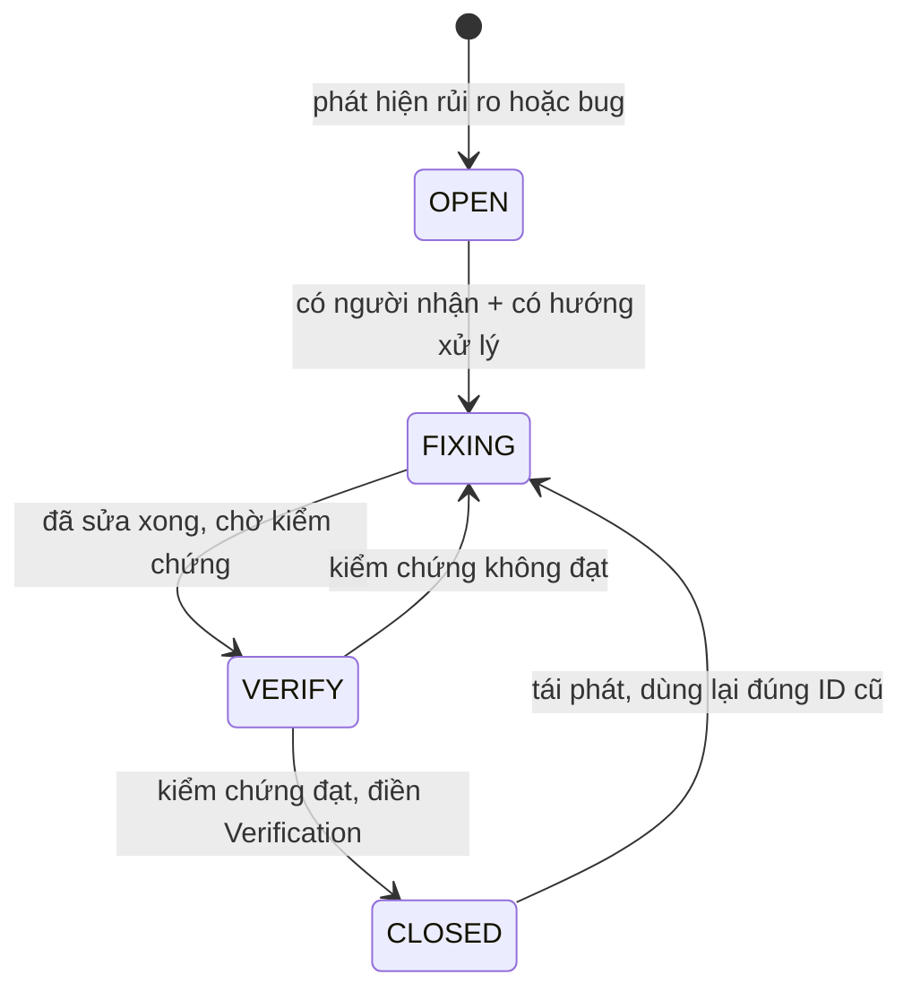

# 12 — Known Issues

> Status: ACTIVE | Phase: 16 | Last updated: 2026-08-12
> Nguồn sự thật cấp trên: BIKEFORCE_MASTER_SPEC.md → docs/11-decisions.md → tài liệu này

---

## 0. ĐỌC TRƯỚC — Đây là RỦI RO, không phải BUG đã quan sát

Tính đến `2026-08-07`, repository **chưa có bất kỳ dòng code nào**: chỉ có `BIKEFORCE_MASTER_SPEC.md`, `PROMPT_FIRST_SESSION.md`, `PROMPT_NEXT_SESSION.md` và thư mục `docs/`. Chưa có `package.json`, chưa có migration, chưa khởi tạo git repository (sẽ khởi tạo ở Phase 1 theo DEC-027).

Hệ quả bắt buộc phải nói thẳng:

- **Không có bug nào được tái hiện**, vì không có gì để chạy.
- Toàn bộ `ISSUE-001` … `ISSUE-007` dưới đây là **rủi ro đã nhận diện ở Phase 0** — những chỗ đã biết trước là sẽ vỡ hoặc sẽ chặn tiến độ nếu không xử lý.
- Trường **Actual** và **Root Cause** của hầu hết các mục ghi đúng sự thật là *chưa quan sát được*, kèm **giả thuyết** rõ ràng là giả thuyết. Không mục nào bịa ra bước tái hiện, log lỗi, hay stack trace.
- Trường **Verification** mô tả **cách sẽ kiểm chứng**, chưa mục nào được kiểm chứng. **Không mục nào được ghi là PASS.**

Khi Phase 1 trở đi phát sinh bug thật, bug đó được thêm vào đây theo đúng cùng một format (xem §5 "Cách thêm issue mới") — không tách file khác, không viết vào chỗ khác.

---

## 1. Severity legend

| Severity | Nghĩa | Ứng xử |
|---|---|---|
| **P1** | **Chặn tiến độ** hoặc **gây mất / lộ dữ liệu**. Không thể đi tiếp phase sau, hoặc dữ liệu người dùng bị sai/mất/rò rỉ. | Dừng việc đang làm, xử lý trước. Không được đóng phase khi còn P1 OPEN. |
| **P2** | **Ảnh hưởng chức năng chính, nhưng có workaround**. Người dùng vẫn hoàn thành được việc bằng đường khác, hoặc có phương án dự phòng đã ghi nhận. | Phải có mitigation ghi rõ trong `Fix:` trước khi phase liên quan được coi là DONE. |
| **P3** | **Nhỏ, hoặc chỉ là nợ kỹ thuật** — chưa ảnh hưởng người dùng ngay, nhưng sẽ đắt dần nếu để lâu. | Ghi nhận, gắn với điều kiện kích hoạt cụ thể. Không được im lặng bỏ qua. |

Quy tắc phân loại khi phân vân: nếu có khả năng **người dùng thấy số liệu sai mà không biết là sai** → P1, không phải P2. Sai thầm lặng luôn nặng hơn lỗi ồn ào.

---

## 2. Status legend

| Status | Nghĩa | Điều kiện chuyển tiếp |
|---|---|---|
| **OPEN** | Đã ghi nhận, chưa ai bắt tay xử lý. | Có người nhận + xác định được cách xử lý → `FIXING`. |
| **FIXING** | Đang sửa / đang thực hiện mitigation. | Code hoặc quyết định đã hoàn tất, chờ kiểm chứng → `VERIFY`. |
| **VERIFY** | Đã sửa, **đang chờ kiểm chứng**. Chưa được coi là xong. | Kiểm chứng đạt → `CLOSED`. Kiểm chứng không đạt → quay lại `FIXING`. |
| **CLOSED** | Đã sửa **và** đã kiểm chứng, trường `Verification:` đã điền bằng chứng cụ thể. | Nếu tái phát: **không tạo ID mới**, chuyển lại `FIXING` và ghi thêm dòng lịch sử vào chính entry đó. |



---

## 3. STANDING RULE — Không bao giờ xoá issue

Nguyên văn quy tắc từ **Master Spec §56**: *"Không xóa issue sau khi fix."*

Diễn giải bắt buộc tuân thủ:

1. **Một issue đã được tạo thì tồn tại vĩnh viễn trong file này.** Kể cả khi đã sửa xong, kể cả khi hoá ra là báo động giả, kể cả khi phạm vi v1 thay đổi làm nó không còn liên quan.
2. Sau khi fix, **chỉ đổi `Status:` sang `CLOSED` và điền `Verification:`** bằng bằng chứng cụ thể (tên test, lệnh đã chạy, kết quả đo, ngày kiểm chứng, người kiểm chứng). Không xoá dòng, không rút gọn, không gộp entry.
3. **ID không bao giờ được tái sử dụng.** `ISSUE-004` đã đóng thì số 004 chết theo nó; issue tiếp theo lấy số kế tiếp của số lớn nhất từng dùng.
4. Nếu một issue **hoá ra không phải vấn đề**, vẫn giữ entry, đặt `Status: CLOSED` và ghi trong `Root Cause:` rằng đây là báo động giả cùng lý do — để session sau không mất công điều tra lại đúng con đường đó.
5. Lý do của quy tắc này: file `docs/12-known-issues.md` là **bộ nhớ dài hạn** của dự án về những chỗ đã từng vỡ. Xoá một entry đã fix là xoá đúng phần thông tin có giá trị nhất — cảnh báo cho lần tới.

---

## 4. Index

| ID | Severity | Status | Chủ đề ngắn gọn | Phase liên quan | ID liên quan |
|---|---|---|---|---|---|
| ISSUE-001 | **P1** | **CLOSED** | OPEN QUESTION mức BLOCKING chưa được trả lời → không viết được migration. **Đã giải quyết 2026-08-07: người dùng trả lời đủ 17/17** | Phase 0 → Phase 2 | OQ-01…OQ-17, DEC-025, DEC-026, DEC-029, DEC-030 |
| ISSUE-002 | P2 | **CLOSED** | Satori (`next/og`) chỉ hỗ trợ tập con CSS + cần font có dấu tiếng Việt. **Đã dựng thật 2026-08-08: Satori dựng đủ layout `docs/05 §14`, KHÔNG cần fallback `html-to-image`** | Phase 6 | DEC-010, FR-018, UC-08 |
| ISSUE-003 | P2 | OPEN | Zalo in-app webview chưa được kiểm chứng trên thiết bị thật | Phase 6, Phase 11 | NFR-009, DEC-011, FR-020 |
| ISSUE-004 | P2 | **CLOSED** | TypeScript 7.0.2 + ESLint 10.8.0 là bản major mới, chưa xác nhận tương thích Next 16. **Đã xảy ra thật 2026-08-07: cả hai đều vỡ; pin `typescript@6.0.3` + `eslint@9.39.5`** | Phase 1 | DEC-002, NFR-012 |
| ISSUE-005 | P3 | **CLOSED** | `is_admin()` phát sinh thêm một truy vấn `profiles` mỗi câu lệnh RLS. **Đã đo bằng `EXPLAIN ANALYZE` 2026-08-10: Postgres nâng `(select public.is_admin())` thành InitPlan, đánh giá đúng 1 lần cho cả câu lệnh** | Phase 2, Phase 11 | DEC-006, NFR-002, NFR-015 |
| ISSUE-006 | P3 | **CLOSED** | Chưa có khái niệm ngày nghỉ → cảnh báo "chưa báo cáo" có thể tính cả người nghỉ. **Chủ nghiệp vụ xác nhận 2026-08-07: không xử lý gì thêm ở v1** | Phase 8 | OQ-08, AF-02, AF-15, FR-033, UC-20 |
| ISSUE-007 | P3 | OPEN | Chưa có audit log; là điều kiện tiên quyết nếu cho phép sửa sau khi `COMPLETED` | Phase 4+ (điều kiện) | OQ-04, OQ-05, BR-019, BR-020, AF-12 |
| ISSUE-008 | P3 | **CLOSED** | `docs/01` mâu thuẫn nội bộ về khi nào `AchievementResult.percent = null` — đã chốt cách đọc ở **DEC-038** (2026-08-07) | Phase 5 | BR-015, DEC-025, DEC-038, OQ-11 |
| ISSUE-009 | P3 | OPEN | Next.js 16.3 **deprecate** quy ước file `middleware.ts`, khuyến nghị đổi tên thành `proxy.ts` | Phase 2 → khi nâng Next major | DEC-004, FR-002, FR-004 |
| ISSUE-010 | P3 | OPEN | Máy phát triển chạy **nhiều stack Supabase local cùng lúc** → chọn nhầm container/port là chuyện đã xảy ra thật | Phase 2, Phase 11 | DEC-022, DEC-031 |
| ISSUE-011 | **P1** | OPEN | **Service role key đã lọt vào transcript hội thoại** khi IDE tự đồng bộ `.env.local`. Phải **rotate** | Phase 2 | NFR-005, DEC-005, DEC-031 |
| ISSUE-012 | P3 | OPEN | Sau `supabase db reset`, GoTrue + Kong không tự phục hồi → mọi lần đăng nhập nhận `502` cho tới khi restart hai container | Phase 3 → mọi phase sau | ISSUE-010, DEC-022 |
| ISSUE-013 | P3 | **CLOSED** | **NFR-008 mâu thuẫn với FR-008**: form sáng có 5 trường bắt buộc nên sàn lý thuyết là 7 lần chạm, không thể ≤ 6. Đo thật: **7 chạm / 1,8 giây**. **Đã giải quyết 2026-08-10: người dùng chọn phương án (a), NFR-008 nới thành ≤ 8 lần chạm — DEC-043** | Phase 3 | NFR-008, FR-008, UC-04, OQ-18, DEC-043 |
| ISSUE-014 | P2 | **CLOSED** | Lưu báo cáo cuối ngày thành công nhưng **mất banner xác nhận** và **draft không bị xoá** — re-render RSC của route hiện tại sau Server Action làm form unmount trước khi effect chạy. Đã sửa bằng DEC-037 | Phase 4 | FR-015, FR-035, DEC-034, DEC-037 |
| ISSUE-015 | **P1** | **CLOSED** | **MỚI** — middleware redirect **mọi** đường dẫn chưa đăng nhập về `/login`, kể cả `/api/*`. `fetch()` tự đi theo redirect ⇒ nút "Xuất ảnh" nhận HTML kèm `status 200` và lưu nó thành file `.png` hỏng. Đã sửa bằng **DEC-039** | Phase 6 | DEC-004, DEC-011, DEC-039, FR-020, NFR-014 |
| ISSUE-016 | **P1** | **CLOSED** | **MỚI** — file `'use server'` export một object hằng số ⇒ Next ném lỗi lúc nạp module, `/admin/sales/new` và `/admin/account` hiện "Đã có lỗi xảy ra". **build / typecheck / lint / 724 unit test đều XANH** — chỉ E2E bắt được. Sửa bằng **DEC-045** | Phase 10, Phase 11 | DEC-045, UC-17, FR-030, FR-023 |
| ISSUE-017 | P3 | OPEN | **MỚI** — `notFound()` trên route có `loading.tsx` trả **200** kèm giao diện "Không tìm thấy" thay vì 404, do response đã stream. **Cố ý không sửa** — tính không-phân-biệt-được của BR-003 vẫn đúng, và route API vẫn trả mã thật | Phase 7, Phase 9, Phase 10 | BR-003, BR-022, DEC-039, ISSUE-015 |
| ISSUE-018 | P2 | **CLOSED** | **MỚI** — nav active ở sidebar ghép `text-primary` lên `bg-status-info-bg` (hai cặp khác nhau) ⇒ sau DEC-046 đo được **4,32:1**, làm đỏ **9 lượt quét axe** ở `desktop-1440`. Lỗi có từ Phase 7, chỉ **lộ ra** khi đổi màu. Sửa bằng cặp đúng (**7,99:1**) | Phase 7, Phase 12 | DEC-046, NFR-007, ISSUE-016 |
| ISSUE-019 | **P2** | OPEN | function Vercel chạy ở **`iad1` (Mỹ)** còn DB ở **Singapore** ⇒ **~230 ms/lượt gọi DB**. ⚠ **Sửa bằng code KHÔNG ăn thua** — khai `preferredRegion='sin1'` ở 3 nơi, manifest build đúng **18/18 route**, deploy thành công, nhưng `x-vercel-id` vẫn `iad1` qua **6/6 lượt đo** và TTFB không đổi. **Bắt buộc đổi trên Dashboard**: Settings → Functions → Region = `sin1` → **Redeploy** | Phase 12 | NFR-001, ISSUE-021 |
| ISSUE-020 | P3 | OPEN | **MỚI** — `Minimum password length` trên cloud **vẫn là 6**, DEC-041 yêu cầu 8. Zod đã ép 8 ở tầng app nên chỉ hở với ai gọi thẳng GoTrue API cho **chính mình**. **Người dùng chấp nhận rủi ro 2026-08-10** | Phase 12 | DEC-041 |
| ISSUE-021 | P3 | OPEN | **MỚI** — `getCurrentProfile()` bị gọi **2 lần/trang** (layout + page), mỗi lần **2 lượt mạng** ⇒ **4 lượt** chỉ để hỏi "ai đây". **Đã THỬ `cache()` và phải GỠ**: nó làm **đăng nhập treo** không tất định (E2E 111→109→105, gỡ ra về **111/111**). Đọc issue trước khi thử lại | Phase 2, Phase 12 | NFR-001, ISSUE-019, DEC-004 |

| ISSUE-022 | P3 | OPEN | **MỚI 2026-08-10** — `gen types --local` đỏ vì `SUPABASE_DB_PASSWORD` của **cloud** lọt vào môi trường. Có cách đi vòng chắc chắn; ⚠ phải chuyển hướng `stderr`, nếu không dòng tiến trình bị ghi vào chính file types |
| ISSUE-023 | P3 | OPEN | **MỚI 2026-08-10** — một bài E2E CSV-403 đỏ đúng một lần trong lượt chạy kéo dài **2,8 giờ** vì máy quá tải. Đã đo tỉ lệ: **82 lượt xanh liên tiếp** sau đó ⇒ **flake**, không phải hồi quy. Không sửa gì |

| ISSUE-024 | P3 | OPEN | **MỚI 2026-08-10** — Docker Desktop chết ở tầng control plane (`docker version` → **500**), làm E2E đỏ hàng loạt và **rất dễ chẩn đoán nhầm thành hồi quy**. Chạy `docker version` TRƯỚC khi đọc diff. ⚠ **TÁI DIỄN LẦN 3 ngày 2026-08-11 — và lần này đã ĐO RA NGUYÊN NHÂN:** trần `memory=3GB` trong `~/.wslconfig` được đặt cho **2 dự án**, nhưng máy đang chạy **3 stack Supabase** (>30 container) ⇒ OOM trong WSL. **Cách sửa: `wsl --shutdown` → `Start-Process 'Docker Desktop.exe'` → TẮT các stack của dự án khác.** `Start-Service com.docker.service` luôn thất bại từ agent (cần admin) nhưng `Start-Process` thì **được** |
| ISSUE-025 | P3 | **CLOSED** | **MỚI 2026-08-10** — `next dev` của Next 16 **tự ghi thêm** khối `<!-- BEGIN:nextjs-agent-rules -->` vào cuối `AGENTS.md`, tức tài liệu điều khiển của dự án bị sửa mỗi lần chạy dev. Đã đóng bằng **`agentRules: false`** trong `next.config.ts` |
| ISSUE-026 | P3 | OPEN | **MỚI 2026-08-10** — `next dev` (Turbopack) trả **403** cho `_next/static/chunks/node_modules_next_dist_*.js` trên máy này ⇒ **trang KHÔNG hydrate**, mọi nút client "chết" trong khi giao diện trông hoàn toàn bình thường. `curl` cùng URL trả **200**. Cách đi vòng: kiểm chứng UI bằng `next build` + `next start` (đúng cách bộ E2E làm) |
| ISSUE-027 | **P1** | **CLOSED** | **MỚI 2026-08-11** — nút xuất ảnh **im lặng trên điện thoại** (`<a download>` bị webview bỏ qua mà `click()` không ném lỗi ⇒ nhánh dự phòng không chạy) và **mở share sheet vô dụng trên máy tính** (`canShare` trả `true` trên Windows, không có Zalo). Sửa bằng **DEC-060**. Lộ ra vì E2E chỉ kiểm nút `toBeVisible`, chưa từng **bấm** nút |
| ISSUE-028 | P3 | **CLOSED** | **MỚI 2026-08-11** — bài a11y `/login` đỏ-rồi-xanh vì axe quét trúng giữa hiệu ứng `animate-rise-in`, đo `#8BA9BE` thay vì `#0B4A76`. Sửa bằng `use.contextOptions.reducedMotion = 'reduce'` |
| ISSUE-029 | **P1** | **CLOSED** | **MỚI 2026-08-11** — trên điện thoại, ảnh **tải vào thư mục Tải xuống chứ không vào Thư viện ảnh**, người dùng không tìm ra file. Gốc: trang web **không có API ghi vào Thư viện ảnh** (giới hạn hệ điều hành) + nhánh dự phòng của DEC-060 trả `attachment` nên ảnh không bao giờ được HIỆN để nhấn giữ. Sửa bằng **DEC-061** + **DEC-062** |

| ISSUE-030 | P2 | **CLOSED** | **MỚI 2026-08-11** — **logo bị cắt mất đáy hai bánh xe** ở mọi nơi dùng `BrandMark`. `viewBox="0 0 101 75"` đúng KÍCH THƯỚC nhưng thiếu ĐỘ LỆCH y: hình nằm ở `y ∈ [13,07 · 87,93]` nên **12,92 đơn vị (~17% chiều cao) bị chém phẳng**, đồng thời đỉnh thừa một dải trắng bằng đúng chừng ấy. Bộ icon PWA và `app/icon.svg` **vô can** (khung 512×512 có đệm). Sửa bằng `viewBox="0 13.07 101 74.86"` + luật E2E `logo-clipped` |
| ISSUE-031 | P3 | **CLOSED** | **MỚI 2026-08-12** — thanh tìm kiếm và bộ chuyển tháng ở `/admin/reports` bị lệch dọc trên laptop. Gốc: cột tháng có thêm dòng “Tháng này” nhưng lưới cha dùng `items-end`, nên kéo cả cột tìm kiếm xuống. Thiết kế lại bằng lưới `3fr / 2fr`, đưa “Tháng này” lên hàng label, cân hai control và thêm E2E đo bounding box |

Tổng: **14 OPEN** (1 × P1 — ISSUE-011, 2 × P2 — ISSUE-003 và ISSUE-019, 11 × P3), **0 FIXING**, **0 VERIFY**, **17 CLOSED** (ISSUE-001, ISSUE-002, ISSUE-004, ISSUE-005, ISSUE-006, ISSUE-008, ISSUE-013, ISSUE-014, ISSUE-015, ISSUE-016, ISSUE-018, ISSUE-025, ISSUE-027, ISSUE-028, ISSUE-029, ISSUE-030, **ISSUE-031**).

---

## 5. Danh sách issue

### ISSUE-001

**Severity: P1**
**Status: CLOSED** — đóng ngày `2026-08-07`, xem mục Verification

**Module:**
Bàn giao Phase 0 → Phase 2. Ảnh hưởng trực tiếp: `supabase/migrations/0001_init_enums_profiles.sql`, `0002_daily_reports.sql`, `0003_functions_triggers.sql`, `0004_rls_policies.sql` (đều **đề xuất, chưa triển khai**), `docs/01-business-analysis.md`, `docs/02-database-design.md`, `docs/06-auth-permissions.md`, `docs/11-decisions.md`.

**Description:**
Các OPEN QUESTION được đánh dấu **BLOCKING** trong `docs/01-business-analysis.md §OPEN QUESTIONS` chưa có câu trả lời chính thức từ phía nghiệp vụ. Chừng nào chúng còn mở, schema không thể chốt và **không được viết migration Phase 2**, vì mỗi câu trả lời khác đi sẽ kéo theo thay đổi cột, CHECK constraint, hoặc RLS policy — tức là phải viết migration sửa chữa ngay sau khi vừa tạo.

Các câu được đánh dấu BLOCKING và thứ chúng chặn:

| OQ | Chặn cái gì cụ thể |
|---|---|
| OQ-01 | Có tồn tại cột `target_visit_points` (integer) và/hoặc `visit_purpose` (text) hay không → quyết định dòng "Viếng thăm" trong bảng đối chiếu có tính được % hay không |
| OQ-02 | Có tồn tại `actual_visit_points` và/hoặc `actual_route` hay không → mẫu số/tử số của cùng dòng đó |
| OQ-03 | Xác nhận đơn vị: doanh số = số lượng xe (integer), doanh thu = VND (bigint) → kiểu dữ liệu, CHECK range, nhãn UI |
| OQ-04 | RLS `reports_update_own_open`, `public.guard_report_transition()`, BR-019 → có khoá báo cáo khi `COMPLETED` hay không |
| OQ-05 | Có cấp UPDATE policy cho Admin trên cột số liệu hay không, BR-020 → và kéo theo ISSUE-007 |
| OQ-08 | Có bảng/cột ngày nghỉ hay không → logic "chưa báo cáo" (AF-02), kéo theo ISSUE-006 |
| OQ-09 | Sales tự cam kết hay Admin giao chỉ tiêu → nếu Admin giao thì cần bảng `targets` riêng và đổi cả workflow (AF-11) |
| OQ-11 | Hành vi khi `target = 0`, BR-015 → `lib/kpi.ts` `calculateAchievement()` và mọi chỗ hiển thị `%` |
| OQ-12 | RLS INSERT `reports_insert_own_today`, CHECK `ck_report_not_future`, BR-021 → có cho nhập bù ngày cũ hay không |
| OQ-13 | Có cột `deleted_at` hay không, BR-013 → nếu có thì **mọi** truy vấn phải thêm điều kiện lọc |

- *Ghi chú về số đếm (không phải một issue riêng, không cấp ID mới):* bảng OQ trong `docs/01-business-analysis.md` đánh dấu **10** mục là BLOCKING, trong đó **OQ-03** ghi là `BLOCKING (xác nhận)` — tức là câu xác nhận lại điều đã hiểu, không phải câu quyết định mới. Các tài liệu Phase 0 khác nói "9 câu BLOCKING" theo cách đếm loại trừ OQ-03. Cần thống nhất một con số duy nhất khi cập nhật `docs/01` sau khi người dùng trả lời; trước mắt **coi cả 10 câu là phải trả lời**, cách đếm an toàn hơn.

**Expected:**
Trước khi Phase 2 bắt đầu:
1. Mọi OQ BLOCKING có câu trả lời chính thức, ghi kèm ngày và người quyết định.
2. `DEC-025` (BR-015 / OQ-11) và `DEC-026` (BR-013/BR-019/BR-020/BR-021 ↔ OQ-04/OQ-05/OQ-12/OQ-13) chuyển từ `PROPOSED` → `APPROVED` hoặc bị thay bằng quyết định khác trong `docs/11-decisions.md`.
3. `BR-013`, `BR-015`, `BR-019`, `BR-020`, `BR-021` trong `docs/01-business-analysis.md` chuyển từ `PROPOSED` → `APPROVED`.
4. `docs/02-database-design.md` và `docs/06-auth-permissions.md` được đồng bộ theo câu trả lời.
5. Chỉ khi đó mới viết file migration đầu tiên.

**Actual:**
*(Trạng thái tại thời điểm phát hiện, giữ nguyên để có vết)* — khi issue được mở, **chưa có câu trả lời nào** cho các OQ BLOCKING; `DEC-025`, `DEC-026` ở `PROPOSED`; `BR-013/015/019/020/021` ở `PROPOSED`; chưa có migration nào trong repository.

**Cập nhật `2026-08-07`:** người dùng đã trả lời **đủ 17/17 OPEN QUESTION** trong cùng ngày. Toàn bộ nguyên nhân gây chặn đã được gỡ. Vẫn chưa có migration nào tồn tại trong repository, nhưng lý do bây giờ là **chưa tới Phase 2**, không còn là **bị chặn nghiệp vụ**.

**Root Cause:**
Không phải lỗi kỹ thuật. Master Spec cố ý để mở một số quyết định nghiệp vụ và đánh dấu chúng là cần xác nhận — §31 `REPORT LOCKING — CẦN XÁC NHẬN`, §32 `DELETE REPORT — CẦN XÁC NHẬN`, §40 `CÂU HỎI BUSINESS CẦN XÁC NHẬN`. Phase 0 đã làm đúng việc của mình là biến chúng thành danh sách `OQ-xx` có đề xuất mặc định và phân tích ảnh hưởng, nhưng **quyền trả lời thuộc về chủ nghiệp vụ**, không thuộc về người/agent viết tài liệu. Tự trả lời thay sẽ tạo ra schema sai một cách im lặng.

**Fix:**
1. Trình danh sách OQ BLOCKING cho người dùng, mỗi câu kèm đề xuất mặc định đã có sẵn để người dùng chỉ cần xác nhận hoặc bác bỏ — giảm chi phí trả lời.
2. Ghi câu trả lời vào `docs/01-business-analysis.md §OPEN QUESTIONS` dưới dạng `Answer:` + ngày, **không xoá câu hỏi gốc**.
3. Cập nhật `docs/11-decisions.md`: DEC-025, DEC-026 → `APPROVED` (hoặc thay bằng DEC mới nếu người dùng chọn khác đề xuất).
4. Đồng bộ `docs/01`, `docs/02`, `docs/03`, `docs/06` theo Documentation Update Matrix (Master Spec §62).
5. Sau đó mới chạy Phase 1 rồi Phase 2.
- **Không dùng workaround "cứ viết migration theo đề xuất mặc định rồi sửa sau".** Với `OQ-09` (Admin giao KPI) và `OQ-13` (soft delete), sửa sau nghĩa là viết lại phần lớn schema và toàn bộ query — chi phí không tuyến tính.

**Verification:**
Checklist đóng issue — **cả 6 mục đã đạt ngày `2026-08-07`**:
- [x] Mọi OQ trong `docs/01-business-analysis.md §OPEN QUESTIONS` có cột **CÂU TRẢ LỜI CHÍNH THỨC** kèm ngày; câu hỏi gốc được giữ nguyên, không xoá.
- [x] `DEC-025`, `DEC-026` (và cả `DEC-029`, `DEC-030`) trong `docs/11-decisions.md` chuyển sang `Status: APPROVED`. Bảng tra nhanh: **30/30 APPROVED, 0 PROPOSED**.
- [x] `BR-013`, `BR-015`, `BR-019`, `BR-020`, `BR-021`, `BR-024` không còn `PROPOSED` trong `docs/01` — đều `APPROVED`.
- [x] `docs/02-database-design.md`: bảng "BR enforce ở đâu" đã chuyển toàn bộ sang `APPROVED`; các chú thích `(OQ-xx)` trên cột được giữ lại **có chủ ý** để ghi vết nguồn gốc quyết định, không phải dấu hiệu còn treo.
- [x] `docs/06-auth-permissions.md`: ma trận quyền không còn dòng `PROPOSED`; mục OQ đánh dấu ✅ ĐÃ TRẢ LỜI.
- [x] `PROJECT_CHECKLIST.md`: mục "Toàn bộ 17 OPEN QUESTION đã được người dùng trả lời" đã `[x]`.

**Người xác nhận:** chủ nghiệp vụ (người dùng), qua trao đổi trực tiếp ngày `2026-08-07`.
**Ghi chú theo Master Spec §56:** issue này **không bị xoá** sau khi fix — giữ lại toàn bộ nội dung gốc làm lịch sử.

---

### ISSUE-002

**Severity: P2**
**Status: CLOSED — 2026-08-08, Satori dựng được toàn bộ layout, KHÔNG dùng fallback**

**Module:**
`app/api/reports/[id]/share-image/route.tsx` và `features/report-share/daily-report-share-card.tsx` — **cả hai nay đã tồn tại thật**. Liên quan: DEC-010, DEC-021, FR-017, FR-018, FR-019, BR-002, UC-08, Phase 6.

> ⚠ Tên file thật khác mô tả cũ ở hai chỗ, cố ý: route là **`route.tsx`** (có JSX), và component là **`daily-report-share-card.tsx`** — `AGENTS.md §3` quy định file đặt tên `kebab-case`, chỉ tên component mới `PascalCase`. Mô tả `DailyReportShareCard.tsx` trong bản ghi gốc là tên component bị viết nhầm thành tên file.

**Description:**
Quyết định DEC-010 chọn sinh ảnh 9:16 **server-side** bằng `ImageResponse` (`next/og`, dựa trên Satori). Satori **không phải trình duyệt**: nó chỉ hỗ trợ một tập con CSS. Ràng buộc đã biết trước:

- Chỉ **flexbox**, **không có CSS grid**. Mọi phần tử có nhiều hơn một con phải khai báo `display: flex` tường minh.
- Không hỗ trợ đầy đủ các thuộc tính layout nâng cao; `-webkit-line-clamp` để cắt ghi chú cuối ngày phải được thay bằng cách cắt tương đương (cắt chuỗi ở tầng dữ liệu, hoặc giới hạn chiều cao + `overflow: hidden`).
- **Font phải được nhúng thủ công**: đọc file `.ttf`/`.woff` bằng `fs` ở Node runtime và truyền vào `ImageResponse`. Font đó **bắt buộc phải có bộ dấu tiếng Việt** (subset `latin` + `vietnamese`) — nếu không, `ừ ẫ ợ ỹ đ` sẽ mất dấu hoặc rơi về glyph rỗng, và lỗi này chỉ lộ ra ở ảnh cuối cùng gửi cho khách.
- Tailwind CSS v4 phát sinh màu ở dạng `oklch()`. Thẻ share **không được** phụ thuộc vào token Tailwind mà phải dùng bảng hex tối cố định đã đo trong `docs/05-ui-ux-design.md` (`#0B1220`, `#FFFFFF`, `#CBD5E1`, `#94A3B8`, `#FBBF24`, `#4ADE80`, `#F87171`, `#60A5FA`).

Rủi ro cụ thể: layout thẻ 9:16 thiết kế ở `docs/05` có thể **không dựng được nguyên vẹn** bằng Satori và phải làm lại giữa Phase 6.

**Expected:**
`GET /api/reports/[id]/share-image` trả về PNG **đúng 1080×1920**, đúng layout dark đã thiết kế (brand + "DAILY SALES REPORT", ngày, tên NV + mã NV, tuyến, bảng 4 dòng Cam kết/Thực đạt/%, dải KPI tổng quan, ghi chú cuối ngày, footer), đủ dấu tiếng Việt, kèm `Content-Disposition: attachment; filename="BikeForce_Report_<Ho-Ten>_<YYYY-MM-DD>.png"` (FR-019) và `Cache-Control: private, no-store`.

**Actual (đo thật 2026-08-08):**
**Rủi ro KHÔNG xảy ra.** Satori dựng đủ bố cục `docs/05 §14` ngay từ prototype đầu tiên. Ảnh xuất ra đúng `1080×1920`, `~73–110 KB`, dấu tiếng Việt render chính xác (`Ừ ẫ ợ ỹ đ Đ Ệ Ỡ`, `Thứ Bảy`, `Viếng thăm`) và ký hiệu `₫` (`U+20AB`) hiển thị đúng glyph.

**Root Cause:**
**Báo động đúng nhưng không thành hiện thực** — giữ nguyên entry theo quy tắc §3. Khoảng cách giữa CSS của thiết kế và tập con Satori hẹp hơn dự đoán, vì bốn ràng buộc đã được tuân thủ **ngay từ dòng code đầu tiên** thay vì phải sửa ngược: chỉ flexbox, `display: 'flex'` ở mọi container nhiều con, chỉ hex thuần, và cắt chuỗi ở tầng dữ liệu. Phần tốn công nhất hoá ra **không** phải layout mà là **font**: Satori không đọc `woff2`, và subset `vietnamese` của Google Fonts **không** chứa chữ Latin cơ bản, nên phải lấy đúng bản `.ttf` đủ bộ ký tự.

**Fix:**
1. **Việc đầu tiên của Phase 6** là dựng prototype thẻ 9:16 với dữ liệu giả, trước khi nối vào dữ liệu thật. Nếu Satori không dựng nổi, biết ngay từ ngày đầu chứ không phải cuối phase.
2. Viết thẻ theo kỷ luật Satori ngay từ đầu: `display: flex` ở mọi container, không grid, không `oklch`, chỉ hex thuần, không `line-clamp` — cắt ghi chú ở tầng dữ liệu trước khi render.
3. Commit file font Inter (hoặc Be Vietnam Pro) subset `latin+vietnamese` vào repository, đọc bằng `fs` ở Node runtime. Không tải font qua mạng lúc render.
4. **Fallback đã ghi nhận trong DEC-010**: nếu Phase 6 chứng minh Satori không dựng nổi layout cần thiết → chuyển sang `html-to-image` client-side với `next/dynamic({ ssr: false })`, chờ `document.fonts.ready` trước khi chụp, và dùng đúng bảng hex thuần đó cho thẻ share. Việc chuyển này phải **ghi thành một DEC mới** trong `docs/11-decisions.md`, không sửa lén DEC-010.
5. Nếu phải dùng fallback, lưu ý kéo theo: thư viện sinh ảnh không được nằm trong initial bundle (NFR-003) và ISSUE-003 trở nên nặng hơn vì việc chụp DOM chạy ngay trong webview Zalo.

**Verification (ĐÃ CHẠY — 2026-08-08):**

| Hạng mục | Cách kiểm | Kết quả |
|---|---|---|
| Prototype Satori trước khi nối dữ liệu thật (bước Fix 1) | script Node dùng-một-lần, `ImageResponse` + 2 font | ✅ PNG `1080×1920`, dựng được |
| 6 edge case bắt buộc | `lib/reports/share-card.test.ts` — **43 unit test** | ✅ PASS |
| Dấu tiếng Việt + `₫` trên ảnh THẬT | fixture local có ghi chú `Ừ ẫ ợ ỹ đ Đ Ệ Ỡ`, xem ảnh xuất ra bằng mắt | ✅ đúng, không rơi font |
| Glyph coverage của font nhúng | parse bảng `cmap` của cả 3 file `.ttf` | ✅ 2849 glyph, đủ `ừ ẫ ợ ỹ đ Đ Ệ Ỡ ₫ …` |
| Kích thước PNG | đọc chunk `IHDR` của response thật | ✅ `1080×1920` ở **cả 6** lần đo |
| Header `Content-Disposition` (FR-019) | request thật qua Chromium | ✅ `attachment; filename="BikeForce_Report_Le-Duy-Khang_2026-08-08.png"` |
| `Cache-Control: private, no-store` | request thật | ✅ |
| BR-002 — báo cáo `MORNING_SUBMITTED` | đăng nhập chính chủ rồi gọi route | ✅ **403** `NOT_COMPLETED` |
| Bảo mật IDOR — salesA gọi id của salesB | request thật + 6 test RLS `tests/rls/share-image.rls.test.ts` | ✅ **404** `REPORT_NOT_FOUND`, không phân biệt với id không tồn tại |
| BR-022 — Admin xuất ảnh cho Sales | đăng nhập Admin, gọi đúng route đó | ✅ 200, ảnh đúng kích thước |
| Tên 40+ ký tự · tuyến 300 · ghi chú 1000 · doanh thu 12 chữ số · `1.250,0%` · `target = 0` | một tấm ảnh chứa **tất cả**, xem bằng mắt | ✅ tên xuống dòng không cắt, tuyến cắt ở 2 dòng, ghi chú cắt ở 4 dòng, `100tỷ` trong bảng + `99.999.999.999 ₫` ở khối dưới, `+3 điểm` + "Vượt kế hoạch" |

Tổng kiểm chứng trình duyệt: **44/44 PASS** ở 375px và 1440px.

> ⚠ **Đính chính một dòng của mô tả gốc:** phần *Expected* ở trên viết `—` cho ca `target = 0`. Từ **DEC-038** (Phase 5), ca `target = 0 && actual > 0` hiển thị **số vượt tuyệt đối có đơn vị** (`+3 điểm`), không phải `—`; `—` chỉ dành cho ca chưa có số liệu. Thẻ ảnh lấy nguyên `display` của `lib/kpi.ts` nên tự động đúng.

**Kết luận:** **KHÔNG** kích hoạt fallback `html-to-image` của DEC-010. Không có DEC mới nào cho việc này — DEC-010 giữ nguyên hiệu lực.

---

### ISSUE-003

**Severity: P2**
**Status: OPEN**

**Module:**
Luồng chia sẻ ảnh phía client trong `features/report-share/` (**đề xuất, chưa triển khai**). Liên quan: FR-020, NFR-009, DEC-011, UC-08, Playwright project `zalo-like`, Phase 6 và Phase 11.

**Description:**
Kênh phân phối thật của sản phẩm là **Zalo**, và người dùng Sales rất có khả năng mở BikeForce **ngay trong Zalo in-app webview** (bấm link trong khung chat). Ba hành vi then chốt chưa được kiểm chứng trên môi trường đó:

1. `navigator.canShare({ files })` / `navigator.share({ files })` — Web Share API level 2 với file đính kèm (DEC-011, FR-020).
2. Fallback `<a download>` — webview nhúng có thể chặn hoặc âm thầm không làm gì với thuộc tính `download`.
3. Cookie session `httpOnly` do `@supabase/ssr` đặt — hành vi lưu/gửi cookie trong webview nhúng có thể khác trình duyệt thường (đặc biệt khi webview bị reset giữa các lần mở).

NFR-009 nêu rõ Zalo in-app browser nằm trong ma trận tương thích bắt buộc, nên đây không phải "nice to have".

**Expected:**
Sales mở báo cáo `COMPLETED` trong Zalo webview → bấm "Xuất ảnh" → hoặc mở được share sheet có Zalo (đường đi lý tưởng), **hoặc** tải được file PNG về máy với thông báo rõ ràng. Không có trường hợp bấm nút mà **không có gì xảy ra** — đó là trạng thái tệ nhất vì người dùng không biết mình cần làm gì tiếp.

**Actual:**
**Chưa quan sát được — đây là rủi ro đã nhận diện ở Phase 0, chưa có code để tái hiện.** Chưa có app để mở trong Zalo, chưa có thiết bị nào được test.

**Root Cause:**
**Chưa xác định được.** Giả thuyết (ghi rõ là giả thuyết): các webview nhúng thường giới hạn Web Share API — hoặc không expose `navigator.share`, hoặc expose nhưng `canShare({files})` trả `false`, hoặc chấp nhận share text/URL nhưng không chấp nhận file. Thuộc tính `download` trên thẻ `<a>` cũng là chỗ hay bị webview bỏ qua. Chỉ thiết bị thật mới trả lời được.

**Fix:**
1. **Feature detection trước, không giả định**: chỉ hiển thị nút "Chia sẻ" khi `navigator.canShare?.({ files: [file] })` trả `true`; ngược lại hiển thị thẳng nút "Tải ảnh".
2. Chuẩn bị **đường thoát cuối cùng**: nếu cả share lẫn download đều không hoạt động, mở PNG trong tab mới kèm hướng dẫn hiển thị trên màn hình ("Nhấn giữ vào ảnh để lưu về máy"). Đây là hành vi người dùng Việt Nam đã quen, và nó không phụ thuộc API nào.
3. **Test tay trên thiết bị thật ở Phase 6**: tối thiểu 1 Android và 1 iOS, mở link qua chat Zalo thật.
4. Ghi nhận thẳng thắn: Playwright project `zalo-like` **chỉ giả lập userAgent của webview**, nó **không** tái hiện được giới hạn API thật của webview Zalo. Nó có giá trị để bắt lỗi layout, **không** thay thế được test thiết bị thật cho luồng chia sẻ. Không được coi `zalo-like` xanh là bằng chứng ISSUE-003 đã đóng.

**Verification:**
Ma trận test tay phải điền đầy đủ ở Phase 6 (**chưa thực hiện**, bảng dưới là khuôn mẫu, chưa có dữ liệu):

| Thiết bị / OS | Phiên bản Zalo | `canShare({files})` | `navigator.share()` | `<a download>` | Đường thoát "nhấn giữ" | Ngày test |
|---|---|---|---|---|---|---|
| Android (chờ điền) | — | — | — | — | — | — |
| iOS (chờ điền) | — | — | — | — | — | — |

Bổ sung: kiểm tra session còn sống sau khi đóng/mở lại webview; kiểm tra `/login` hoạt động trong webview. Đóng issue khi cả hai dòng ma trận có kết quả thật và có ít nhất một đường đi thành công trên mỗi nền tảng.

---

### ISSUE-004

**Severity: P2**
**Status: CLOSED (2026-08-07, Phase 1)**

**Module:**
Toolchain / `package.json` (**chưa tồn tại**), cấu hình ESLint và TypeScript. Liên quan: DEC-001, DEC-002, NFR-012, Phase 1.

**Description:**
Các phiên bản đã kiểm tra là **latest stable trên npm ngày 2026-08-07**: `next@16.3.0`, `react@19.2.8`, `typescript@7.0.2`, `eslint@10.8.0`, `tailwindcss@4.3.3`. Trong đó **TypeScript 7** và **ESLint 10** đều là bước nhảy major. Rủi ro: `eslint-config-next` của Next 16, plugin `@typescript-eslint`, và trình biên dịch TypeScript 7 có thể chưa khớp peer dependency với nhau, làm `next lint` hoặc `tsc --noEmit` không chạy được — trong khi NFR-012 yêu cầu **TypeScript strict** và **cấm `any` bằng lint** ngay từ đầu.

Nếu phát hiện muộn (sau khi đã viết nhiều feature), chi phí lùi phiên bản cao hơn nhiều so với phát hiện ở ngày đầu Phase 1.

**Expected:**
Ngay sau `create-next-app`, cả ba lệnh nền tảng đều chạy được trên dự án rỗng: build, typecheck (`tsc --noEmit` với `strict: true`), và lint (với rule cấm `any`). Sau đó mới pin phiên bản chính xác vào `package.json`.

**Actual:**
**Chưa quan sát được — đây là rủi ro đã nhận diện ở Phase 0, chưa có code để tái hiện.** Chưa có `package.json`, chưa cài dependency nào, chưa chạy lệnh nào. **Không có kết quả build/typecheck/lint nào tồn tại — không được ghi là PASS ở bất kỳ đâu.**

**Root Cause:**
**Chưa xác định được.** Giả thuyết (ghi rõ là giả thuyết): peer dependency range của `eslint-config-next` / `@typescript-eslint` chưa mở cho `eslint@10` hoặc `typescript@7`, hoặc TypeScript 7 thay đổi hành vi/loại bỏ tuỳ chọn `tsconfig` mà preset của Next đang dùng. Không thể xác nhận nếu chưa cài thật.

**Fix:**
1. **Smoke test là việc đầu tiên của Phase 1**, trước khi viết bất kỳ dòng code feature nào: `create-next-app` → chạy build, typecheck, lint trên dự án rỗng.
2. Nếu vỡ: lùi về **TypeScript 5.x LTS** (và/hoặc ESLint 9) theo đúng phương án dự phòng đã ghi trong **DEC-002**.
3. **Ghi kết quả smoke test vào `docs/11-decisions.md` như phần bổ sung của DEC-002** (phiên bản nào được pin, vì sao), và vào `WORKLOG.md` của ngày làm Phase 1.
4. Chỉ pin phiên bản chính xác **sau** khi smoke test xong. Trước đó, tài liệu chỉ được nói "verified latest stable on 2026-08-07", không được nói "đã dùng".
5. Không tự ý nới lỏng `strict` hoặc tắt rule cấm `any` để cho lint chạy được — đó là đánh đổi sai, vi phạm NFR-012. Nếu buộc phải chọn, lùi phiên bản chứ không hạ tiêu chuẩn.

**Verification:**
✅ **ĐÃ KIỂM CHỨNG BẰNG LỆNH THẬT — 2026-08-07, Phase 1.** Rủi ro này **đã xảy ra thật**, ở **cả hai** package nghi ngờ.

Nội dung gốc của issue ở trên được **giữ nguyên không sửa** theo STANDING RULE §3. Kết quả thật:

1. **Giả thuyết ở § Root Cause là ĐÚNG cả hai vế.** Không phải lỗi cấu hình, mà là peer dependency chặn cứng ở thượng nguồn:
   - `typescript-eslint@8.66.0` peer `typescript: ">=4.8.4 <6.1.0"` → **TS 7.0.2 bị từ chối** ngay lúc load module (`typescript-eslint does not support TS 7.0`, exit 2).
   - `eslint-plugin-react@7.37.5` peer `eslint: "... || ^9.7"` → **ESLint 10.8.0 làm vỡ rule loader** (`contextOrFilename.getFilename is not a function`, exit 2). `7.37.5` là bản **mới nhất tồn tại**, nên không override nào cứu được.
2. **Phát hiện ngoài dự kiến:** `create-next-app@16.3.0` vốn **không** cài TS 7 / ESLint 10 — template chính thức pin `"typescript": "^5"` và `"eslint": "^9"`. Giả định ngược lại trong `SESSION_CHECKPOINT.md` cũ là sai và đã được sửa.
3. **Phiên bản đã pin:** `typescript@6.0.3` + `eslint@9.39.5`. Chọn TS **6.0.3** thay vì 5.x LTS vì 6.0.3 là bản stable nằm trong peer range `<6.1.0` — lý do đầy đủ ở `docs/11-decisions.md § DEC-002 — KẾT LUẬN SMOKE TEST`.
4. **Ba lệnh nền tảng đã chạy và xanh** (trên project đã có code Phase 1):
   `npm run typecheck` → exit 0 · `npm run lint` → exit 0 (0 error, 0 warning) · `npm run build` → exit 0.
5. **Không hạ tiêu chuẩn để cho qua** (đúng yêu cầu số 5 của § Fix): `tsconfig.json` giữ `"strict": true` **và** thêm `noUncheckedIndexedAccess: true`; `@typescript-eslint/no-explicit-any` đặt mức **`error`** (mạnh hơn mặc định `warn`); không rule nào bị tắt.
6. Kết quả và phiên bản đã ghi vào `docs/11-decisions.md` (DEC-002) và `WORKLOG.md` Entry 003.

**Theo dõi tiếp (không chặn tiến độ):** nâng lên ESLint 10 / TS 7 chỉ khi `eslint-plugin-react` ra bản hỗ trợ ESLint 10 **và** `typescript-eslint` hỗ trợ TS ≥ 7.1 (typescript-eslint#10940). Khi đó tạo **DEC mới**, không sửa đè DEC-002.

---

### ISSUE-005

**Severity: P3**
**Status: CLOSED — đo thật 2026-08-10 (Phase 11)**

**Module:**
`supabase/migrations/0003_functions_triggers.sql` và `0004_rls_policies.sql` (**đề xuất, chưa triển khai**) — hàm `public.is_admin()`, `public.is_active_sales()` và toàn bộ RLS policy trên `profiles`, `daily_reports`. Liên quan: DEC-004, DEC-006, NFR-002, NFR-015, Phase 2 và Phase 11.

**Description:**
Mọi RLS policy trong thiết kế đều gọi `public.is_admin()`, mà hàm này thực hiện `exists(select 1 from profiles where id = auth.uid() and role = 'ADMIN' and is_active)`. Nghĩa là **mỗi câu lệnh có RLS đều kèm thêm một lần tra bảng `profiles`**. Kèm theo đó là hai cạm bẫy đã biết:

- Nếu `is_admin()` **không** phải `SECURITY DEFINER`, policy trên `profiles` sẽ tự truy vấn `profiles` → **infinite recursion**, Postgres báo lỗi và mọi truy vấn hỏng.
- Nếu trong policy viết `public.is_admin()` trần thay vì `(select public.is_admin())`, Postgres đánh giá hàm **cho từng row** thay vì nâng thành InitPlan đánh giá một lần cho cả câu lệnh — chi phí tăng tuyến tính theo số row quét.

Ở quy mô v1 (NFR-015: 50 Sales × 365 ngày ≈ 18k row/năm) chi phí này gần như không đáng kể — vì vậy đây là **P3, nợ kỹ thuật**, không phải lỗi hiệu năng đang xảy ra.

**Expected:**
Truy vấn danh sách báo cáo của Admin (`/admin/reports`, có filter + phân trang server-side theo FR-026) dùng index `idx_daily_reports_date_status` và **không** phát sinh một lần tra `profiles` cho mỗi row (NFR-002).

**Actual:**
**Chưa quan sát được — đây là rủi ro đã nhận diện ở Phase 0, chưa có code để tái hiện.** Chưa có Supabase project, chưa có bảng, chưa chạy `EXPLAIN ANALYZE` lần nào.

**Root Cause:**
Đây là **nguyên nhân cấu trúc, đã biết trước**, không phải bug chờ điều tra: RLS cần biết role của người dùng; role được lưu trong bảng `profiles`; vì vậy policy trên chính `profiles` buộc phải truy vấn `profiles`. Cách duy nhất cắt vòng lặp là `SECURITY DEFINER` (bỏ qua RLS bên trong hàm), và cách duy nhất tránh đánh giá theo từng row là để Postgres nâng lời gọi thành InitPlan.

**Fix:**
1. **Đã nằm sẵn trong thiết kế (DEC-006), phải thực hiện đúng, không được đơn giản hoá:**
   - `public.is_admin()` khai báo `stable security definer set search_path = public, pg_temp`.
   - Trong policy **luôn** viết `(select public.is_admin())`, không bao giờ viết `public.is_admin()` trần.
   - Áp dụng cùng kỷ luật đó cho `(select auth.uid())` và `public.is_active_sales()`.
2. Nếu về sau đo được là vẫn chậm ở quy mô lớn hơn: chuyển `role` vào **custom JWT claim** (custom access token hook của Supabase) và đọc từ `auth.jwt()` — khi đó policy không cần tra `profiles` nữa.
3. Nếu chọn phương án JWT claim, phải ghi thành **DEC mới** và tài liệu hoá hệ quả: đổi role không có hiệu lực cho tới khi token được refresh, nên UC-19 (kích hoạt/vô hiệu hoá tài khoản) cần cân nhắc thêm bước huỷ session. **Không đổi sang JWT claim ở v1 khi chưa có số đo chứng minh cần thiết** — tối ưu sớm ở đây đắt hơn lợi ích.

**Verification:**
Kế hoạch kiểm chứng (**chưa chạy**):
- `EXPLAIN ANALYZE` truy vấn danh sách báo cáo của Admin dưới JWT admin thật trên Supabase local (DEC-022): kỳ vọng thấy **InitPlan** cho `is_admin()`, không phải SubPlan chạy lại theo từng row; kỳ vọng thấy index scan trên `idx_daily_reports_date_status`.
- Test RLS phải chứng minh không xảy ra lỗi recursion khi `select` trên `profiles` bằng cả JWT admin lẫn JWT sales.
- Ghi số đo vào `docs/08-testing-strategy.md` như một phần của bộ test NFR-002.
- Đóng issue khi có số đo thật chứng minh chi phí chấp nhận được ở quy mô NFR-015.

---

**Verification (2026-08-10) — ĐÃ ĐO, không còn là giả thuyết:**

`tests/integration/indexes.test.ts` dựng **2.700 dòng** `daily_reports` tổng hợp, `analyze`, rồi chạy `EXPLAIN (ANALYZE)` **dưới vai `authenticated`** (bắt buộc — role `postgres` có `rolbypassrls` nên policy không tham gia kế hoạch, và bài test sẽ "xanh" một cách vô nghĩa).

Kế hoạch thật của Admin đọc danh sách báo cáo một tháng:

```text
Limit (actual rows=20 loops=1)
  InitPlan 1
    ->  Result (actual rows=1 loops=1)
  InitPlan 2
    ->  Result (actual rows=1 loops=1)
  ->  Index Scan using idx_daily_reports_date_status on daily_reports (actual rows=20 loops=1)
        Index Cond: ((report_date >= '2017-03-01') AND (report_date <= '2017-03-31'))
        Filter: ((sales_id = (InitPlan 1).col1) OR (InitPlan 2).col1)
```

Ba điều đọc được, và cả ba đều là điều DEC-006 dự đoán:

1. `(select public.is_admin())` **được nâng thành InitPlan** — `actual rows=1 loops=1`, tức đánh giá **đúng một lần cho cả câu lệnh**, không phải mỗi dòng. Đây chính là rủi ro mà issue này ghi nhận, và nó **không xảy ra**.
2. Policy **không phá kế hoạch**: truy vấn vẫn đi qua `idx_daily_reports_date_status`, không có `Seq Scan`.
3. `Filter` giữ đúng hình dạng `own OR admin` của `reports_select_own_or_admin`.

**Hai câu hỏi bỏ ngỏ trong `0005_indexes.sql` cũng đã có câu trả lời:**

- `idx_daily_reports_sales_date_desc` **KHÔNG dư thừa** — nó thắng `uq_daily_reports_sales_date` cho truy vấn lịch sử của FR-021 (`Index Scan using idx_daily_reports_sales_date_desc`, không có node `Sort`). **Không drop.**
- `idx_profiles_role_active` **phủ được** truy vấn đếm Sales active (kiểm bằng `enable_seqscan = off`). Ở quy mô vài chục dòng, planner chọn `Seq Scan` là hợp lý — bài test cố ý **không** khẳng định "planner luôn chọn index", vì đó là khẳng định sai ở quy mô này.

14 bài `EXPLAIN` này chạy trong `npm test` từ nay về sau, nên một policy hay một truy vấn viết hỏng ở phase sau sẽ làm chúng đỏ.

---

### ISSUE-006

**Severity: P3**
**Status: CLOSED** — đóng ngày `2026-08-07` theo quyết định của chủ nghiệp vụ, xem mục Verification

**Module:**
AF-02 Missing Report Alerts trên `/admin` (**đề xuất, chưa triển khai**). Liên quan: FR-033, UC-20, OQ-08, AF-15, Phase 8.

**Description:**
Theo đề xuất mặc định của **OQ-08**, v1 **không có** khái niệm ngày nghỉ / nghỉ phép / không đi thị trường. Do đó cảnh báo "Sales chưa báo cáo" chỉ có thể được tính bằng cách: lấy mọi `profiles` có `role = 'SALES'` và `is_active = true`, trừ đi những người đã có row `daily_reports` với `report_date = public.vn_today()`.

Tập kết quả đó **bao gồm cả** người đang nghỉ phép, nghỉ lễ, nghỉ ốm, hoặc đơn giản là hôm nay không có lịch đi thị trường. Admin sẽ thấy họ trong danh sách "chưa báo cáo" và có thể đốc thúc nhầm người. Nếu chuyện này lặp lại, hệ quả thật không phải kỹ thuật mà là **niềm tin vào cảnh báo giảm dần** — Admin bắt đầu bỏ qua toàn bộ danh sách, làm mất luôn giá trị của AF-02, vốn được đánh giá là tính năng có giá trị vận hành cao nhất.

**Expected:**
Cảnh báo chỉ trỏ vào người **thực sự quên báo cáo** trong một ngày họ đáng lẽ phải báo cáo.

**Actual:**
**Chưa quan sát được — đây là rủi ro đã nhận diện ở Phase 0, chưa có code để tái hiện.** Chưa có `/admin`, chưa có truy vấn alert, chưa có người dùng thật.

**Root Cause:**
Đây là **hệ quả của quyết định phạm vi**, không phải lỗi triển khai. Mô hình dữ liệu hiện tại **không có chỗ nào để biểu đạt** ý "hôm nay tôi không đi thị trường": `daily_reports` chỉ có hai trạng thái `MORNING_SUBMITTED` và `COMPLETED` (DEC-020), và không có row nào nghĩa là "chưa báo cáo" — không phân biệt được với "không cần báo cáo". Nguyên nhân gốc nằm ở OQ-08 chưa được trả lời, chứ không nằm ở câu SQL.

**Fix:**
**Không làm gì.** Chủ nghiệp vụ đã xem xét và quyết định ngày `2026-08-07`: **không xử lý gì quanh việc này ở v1** — không thêm bảng/cột ngày nghỉ, và **không** thêm ràng buộc đặc biệt nào cho nhãn hay cách hiển thị của khối cảnh báo AF-02. Khối cảnh báo cứ triển khai bình thường theo FR-033.

Nếu sau này thực tế vận hành cho thấy cần: kích hoạt **AF-15** (Quản lý ngày nghỉ) từ `docs/10-future-roadmap.md`, và việc đó phải ghi thành **DEC mới** kèm cập nhật `docs/02`, `docs/06` theo Master Spec §62.

**Verification:**
Đóng theo tiêu chí (a) mà chính issue này đặt ra khi mở: *"OQ-08 được xác nhận là 'không cần'"*.
- [x] **OQ-08 đã được trả lời `KHÔNG` ngày 2026-08-07** — ghi ở `docs/01-business-analysis.md § OPEN QUESTIONS` và DEC-030 (`APPROVED`).
- [x] Chủ nghiệp vụ xác nhận thêm, cũng ngày `2026-08-07`, rằng **không cần biện pháp giảm thiểu nào** — kể cả ràng buộc về từ ngữ trên UI. Mọi ràng buộc phái sinh trước đó đã được gỡ khỏi `docs/01`, `docs/11`, `CLAUDE.md`, `SESSION_CHECKPOINT.md`, `WORKLOG.md`, `PROJECT_CHECKLIST.md`.
- [x] Không còn mục checklist hay yêu cầu triển khai nào gắn với issue này.

**Người xác nhận:** chủ nghiệp vụ (người dùng), trao đổi trực tiếp ngày `2026-08-07`.
**Ghi chú theo Master Spec §56:** issue **không bị xoá** — giữ nguyên Description / Root Cause gốc làm lịch sử, chỉ đổi `Status` và điền Verification.

---

### ISSUE-007

**Severity: P3**
**Status: OPEN**

**Module:**
`public.daily_reports` (**đề xuất, chưa triển khai**), RLS policy `reports_update_own_open`, trigger `public.guard_report_transition()`, AF-12 (roadmap). Liên quan: OQ-04, OQ-05, BR-019, BR-020, BR-002, DEC-026, Phase 4 trở đi (theo điều kiện).

**Description:**
v1 **không có audit log**. Ở phương án mặc định điều này chấp nhận được, vì báo cáo bị khoá ngay khi chuyển sang `COMPLETED`: policy `reports_update_own_open` có `USING ... AND status = 'MORNING_SUBMITTED'`, nên sau khi hoàn tất thì không còn row nào khớp điều kiện UPDATE, báo cáo tự khoá; và Admin không được cấp quyền UPDATE trên các cột số liệu (BR-020).

Rủi ro nằm ở nhánh còn lại: **nếu OQ-04 được trả lời là (b) hoặc (c), hoặc OQ-05 được trả lời là "Admin được sửa"**, thì số liệu đã hoàn tất trở nên sửa được mà **không có bất kỳ dấu vết nào** về ai sửa, sửa lúc nào, từ giá trị nào sang giá trị nào.

Điều làm rủi ro này nghiêm trọng hơn vẻ ngoài của nó: theo BR-002 và Master Spec §12 (save trước — export sau), ảnh PNG **đã được gửi lên Zalo** trước khi ai đó sửa. Sau khi sửa, **ảnh trong nhóm chat và số trong database nói hai điều khác nhau**, và không ai chứng minh được cái nào đúng. Đây chính là kịch bản tranh chấp số liệu mà audit log sinh ra để giải quyết.

Xếp P3 vì ở cấu hình mặc định của v1 điều này **không thể xảy ra**; nó chỉ trở thành vấn đề khi quyền sửa được mở.

**Expected:**
Mọi thay đổi số liệu sau khi báo cáo đạt `COMPLETED` phải truy vết được đầy đủ: **ai** thay đổi, **khi nào**, **giá trị cũ → giá trị mới**, và bản ghi truy vết đó **không sửa/xoá được bởi bất kỳ role nào**.

**Actual:**
**Chưa quan sát được — đây là rủi ro đã nhận diện ở Phase 0, chưa có code để tái hiện.** Chưa có bảng nào, chưa có ai sửa gì.

**Root Cause:**
Chưa quyết định được phạm vi (OQ-04, OQ-05) nên chưa thiết kế bảng lịch sử. Trong schema hiện tại **không có cột hay bảng nào lưu giá trị trước khi sửa**: `updated_at` (do trigger `public.set_updated_at()` cập nhật) chỉ cho biết *"đã có thay đổi"*, không cho biết *"đổi cái gì"* và không cho biết *"do ai"*.

**Fix:**
1. **Giữ nguyên khoá cứng ở v1** — tức giữ đề xuất mặc định OQ-04 (a) "khoá ngay khi `COMPLETED`" và OQ-05 "Admin không sửa". Đây là cách rẻ nhất để không cần audit log.
2. **Nếu người dùng chọn cho phép sửa** (bất kể nhánh nào của OQ-04/OQ-05), thì **AF-12 là điều kiện tiên quyết, không phải việc làm sau**. Trình tự bắt buộc:
   - Tạo bảng `report_audit_log` dạng **append-only**: không cấp policy UPDATE, không cấp policy DELETE cho bất kỳ role nào.
   - Ghi bằng trigger `AFTER UPDATE ON public.daily_reports`, lưu tối thiểu: `report_id`, `changed_by` (`auth.uid()`), `changed_at`, và giá trị cũ/mới của các cột số liệu.
   - **Chỉ sau khi bảng và trigger đã có và đã test**, mới nới RLS policy cho phép UPDATE.
3. Ghi việc này thành **DEC mới** trong `docs/11-decisions.md`, cập nhật `docs/02-database-design.md` (schema) và `docs/06-auth-permissions.md` (policy) theo Master Spec §62.
4. Cân nhắc thêm khi mở quyền sửa: nếu số liệu thay đổi sau khi đã xuất ảnh, UI nên cảnh báo người dùng rằng ảnh đã gửi không còn khớp — nhưng đây là quyết định nghiệp vụ, không tự quyết.

**Verification:**
Kế hoạch kiểm chứng, **chỉ áp dụng nếu quyền sửa được mở** (hiện chưa áp dụng ở v1):
- Test RLS phải chứng minh: không role nào (`SALES`, `ADMIN`, `authenticated`) UPDATE hoặc DELETE được row trong `report_audit_log`.
- Test integration: sửa một `daily_reports` đã `COMPLETED` → sinh **đúng một** dòng audit, chứa đúng `changed_by`, và đúng cặp giá trị cũ/mới.
- Test: xoá bảng khỏi đường đi (giả lập trigger hỏng) → thao tác UPDATE phải **thất bại**, không được âm thầm bỏ qua audit.
- Nếu v1 giữ khoá cứng: kiểm chứng bằng test RLS chứng minh salesA **không** UPDATE được report của chính mình khi `status = 'COMPLETED'` (0 rows affected), và Admin **không** UPDATE được cột số liệu của bất kỳ report nào. Khi đó ISSUE-007 chuyển `CLOSED` với ghi chú "không áp dụng ở v1 vì báo cáo bị khoá — mở lại nếu OQ-04/OQ-05 thay đổi".

---

### ISSUE-008

**Severity: P3**
**Status: CLOSED** *(2026-08-07 — người dùng đã chốt cách đọc, xem DEC-038)*

**Module:**
`docs/01-business-analysis.md` (tài liệu, không phải code) → sẽ ảnh hưởng `lib/kpi.ts`. Liên quan: BR-015, DEC-025, OQ-11, Phase 5.

**Description:**
Hai chỗ trong cùng một tài liệu nói khác nhau về việc **khi nào** `AchievementResult.percent` được phép bằng `null`:

- `docs/01-business-analysis.md` (mục mô tả `AchievementResult`): *"`percent: null` **chỉ** xảy ra ở trường hợp `target = 0 && actual > 0` (BR-015)"*.
- `docs/01-business-analysis.md` §"Hệ quả cho việc cài đặt `lib/kpi.ts` (Phase 5)", bảng 4 dòng: dòng **"chưa có `actual`"** cũng ghi `percent` = `null`, status `PENDING`, hiển thị `—`.

Chữ "**chỉ**" ở chỗ thứ nhất loại trừ đúng trường hợp mà chỗ thứ hai cho phép. Phát hiện khi viết khung `lib/kpi.ts` ở Phase 1.

**Expected:**
Một quy tắc duy nhất, không mơ hồ, cho `percent: null` — vì Phase 5 phải viết unit test biên đúng theo nó (`actual = null` là một case bắt buộc trong `PROJECT_CHECKLIST.md § Phase 5`).

**Actual:**
Hai phát biểu mâu thuẫn cùng tồn tại. **Chưa gây bug** vì `lib/kpi.ts` hiện mới chỉ là khung (thân hàm `throw`, chưa có logic).

**Root Cause:**
Nhiều khả năng do soạn thảo: bảng ở §"Hệ quả cho việc cài đặt" được **thêm sau** khi người dùng trả lời OQ-11 (Entry 002), còn câu "chỉ xảy ra khi…" là văn bản có từ trước và không được rà lại. Đây là **giả thuyết**, chưa xác nhận.

**Fix:**
Cách đọc hợp lý nhất — **chưa được chốt, không được tự áp dụng**: `percent: null` mang nghĩa "không tồn tại một con số phần trăm có ý nghĩa", đúng cho **cả hai** trường hợp (`target = 0 && actual > 0` → vượt kế hoạch; `actual = null` → chưa có số liệu), và hai trường hợp này phân biệt nhau bằng `status` (`EXCEEDED` vs `PENDING`) chứ không bằng `percent`. Nếu đúng vậy thì chỉ cần bỏ chữ "**chỉ**" ở phát biểu thứ nhất.

Trình tự bắt buộc ở **đầu Phase 5**, trước khi viết thân `calculateAchievement()`:
1. Chốt cách đọc, sửa `docs/01-business-analysis.md` cho khớp ở **cả hai** chỗ.
2. Chốt luôn hạng mục còn treo của DEC-025: `AchievementResult` mang thêm **số vượt tuyệt đối + đơn vị** bằng cách nào (thêm tham số đơn vị vào `calculateAchievement()`, hay trả số vượt thô để tầng hiển thị tự format). `docs/11 § DEC-025` ghi rõ *"chốt cách cài đặt ở Phase 5"*.
3. Cập nhật `AchievementResult` trong `lib/kpi.ts` và ghi chú TODO tương ứng ở đầu file.

**Không** được đổi bản chất BR-015 — rule đã `APPROVED`; đây chỉ là làm rõ câu chữ mô tả kiểu dữ liệu, không phải đổi nghiệp vụ (Master Spec §71).

**Verification:**
**ĐÃ CHẠY THẬT ngày 2026-08-07 (Phase 5) — đạt cả 3 mục:**

1. ✅ `docs/01-business-analysis.md` chỉ còn **một** phát biểu về `percent: null` và nó khớp với bảng 4 dòng ở §"Hệ quả cho việc cài đặt `lib/kpi.ts`". Chữ "**chỉ**" đã bị bỏ; đoạn mô tả `AchievementResult` nay nói rõ `null` đúng cho **cả hai** ca, phân biệt bằng `status`.
2. ✅ `lib/kpi.test.ts` — **46 test, 46 PASS** (`npx vitest run --project unit lib/kpi.test.ts`). Phủ đủ 4 dòng của bảng, gồm `actual = null` → `{ percent: null, status: 'PENDING', display: '—', surplus: null }`, và cả hai ca `target = 0`.
3. ✅ Không test nào cho ra `NaN` / `Infinity`: có một bài quét lưới **8 target × 9 actual × 4 metric = 288 tổ hợp** (gồm cả `NaN`, `±Infinity`, số âm) và khẳng định `percent` luôn là `null` hoặc hữu hạn, `surplus` luôn là `null` hoặc hữu hạn, và `display` không bao giờ chứa `'NaN'` / `'Infinity'` / `'∞'` / `'undefined'`.

**Kiểm chứng thêm trên trình duyệt thật** (Chromium 375px + 1440px, Supabase local, script dùng-một-lần đã xoá): **36/36 PASS**, trong đó ba tình huống của `docs/05 §7.3` đều đúng — chưa có số liệu → `'—'` + "Chờ số liệu"; `target = 0 && actual = 0` → `'100,0%'` + "Vượt mục tiêu"; `target = 0 && actual > 0` → `'+7 xe'` + "Vượt kế hoạch". Không trang nào chứa `NaN` / `Infinity` / `∞` trong text đã render.

**Cách đọc chính thức** (DEC-038): `percent: null` nghĩa là *không tồn tại một con số phần trăm có ý nghĩa*, đúng cho **cả hai** ca; `status` (`EXCEEDED` vs `PENDING`) là thứ phân biệt chúng. Bản chất BR-015 **không đổi**.

---

### ISSUE-009

**Severity: P3**
**Status: OPEN**

**Module:**
`middleware.ts` (gốc dự án). Liên quan: DEC-004, FR-002, FR-004, Phase 2.

**Description:**
Next.js 16.3.0 **deprecate quy ước file `middleware.ts`** và khuyến nghị đổi tên thành `proxy.ts`. Mỗi lần `npm run build` đều in cảnh báo:

```text
⚠ The "middleware" file convention is deprecated. Please use "proxy" instead.
  To migrate automatically, run:
  npx @next/codemod@canary middleware-to-proxy .
```

Trong bản build, layer này đã được liệt kê dưới tên mới: `ƒ Proxy (Middleware)`.

**Expected:**
Build sạch, không có cảnh báo deprecation; và tên file trong repo khớp với tên mà framework khuyến nghị.

**Actual:**
Build **exit 0 và chạy đúng** — cảnh báo, không phải lỗi. Toàn bộ 32 kiểm chứng luồng auth trên trình duyệt thật đều PASS với `middleware.ts`.

**Root Cause:**
Next.js 16 đổi tên quy ước để phản ánh đúng vai trò (proxy cạnh request) và tách khỏi kỳ vọng "middleware kiểu Express". Đây là thay đổi tên, **không** đổi ngữ nghĩa.

**Fix:**
**Cố ý HOÃN, không sửa ở Phase 2.** Lý do:

1. Cả 17 tài liệu điều khiển đều gọi tên `middleware.ts` — `CLAUDE.md §6`, `AGENTS.md §6`, `docs/04`, `docs/06 §5.2` (bảng route protection và ba lỗi kinh điển), `PROJECT_CHECKLIST.md § Phase 2`. Đổi tên file giữa Phase 2 mà không sweep hết là tạo ra mâu thuẫn docs ↔ code, đúng thứ `CLAUDE.md §9` cấm.
2. Cảnh báo không ảnh hưởng chức năng và không ảnh hưởng người dùng cuối.

**Điều kiện kích hoạt:** khi nâng Next lên major tiếp theo (17.x), **hoặc** khi cảnh báo chuyển thành lỗi. Khi đó chạy `npx @next/codemod@canary middleware-to-proxy .` **và** cập nhật đồng bộ 5 tài liệu nêu ở mục 1, kèm một `DEC` mới.

**Verification:**
Kế hoạch kiểm chứng (**chưa chạy** — hoãn theo điều kiện trên):
- `npm run build` không còn dòng cảnh báo nào.
- Chạy lại đủ bộ kiểm chứng luồng auth (chưa đăng nhập → `/login?next=`, sai vai → dashboard đúng vai, đăng xuất, `is_active=false` giữa phiên) và tất cả phải PASS như hiện tại.
- `grep -r "middleware.ts" docs/ *.md` không còn kết quả lạc hậu.

---

### ISSUE-010

**Severity: P3**
**Status: OPEN**

**Module:**
Môi trường phát triển cục bộ (Supabase CLI + Docker). Liên quan: DEC-022, DEC-031, Phase 2, Phase 11.

**Description:**
Máy phát triển đang chạy **ba stack Supabase local cùng lúc**, mỗi stack một bộ cổng riêng:

| Project | Kong (API) | Postgres |
|---|---:|---:|
| **BikeForce** | 54321 | **54322** |
| `cq-tntt-manager` | 54421 | 54422 |
| `Polymind_Chinese` | 55321 | 55322 |

Mọi lệnh chọn container theo kiểu `docker ps --filter name=supabase_db` rồi lấy phần tử đầu tiên đều **không xác định** — thứ tự trả về của Docker không có bảo đảm.

**Expected:**
Mọi thao tác kiểm chứng schema phải chạm đúng database của BikeForce.

**Actual:**
**Đã xảy ra thật ngày 2026-08-07.** Một truy vấn kiểm tra `information_schema.role_table_grants` đã trúng container `supabase_db_cq-tntt-manager` và trả về bảng của một dự án hoàn toàn khác (`students`, `classes`, `committees`, …), suýt dẫn tới kết luận sai về quyền của `service_role` trên `public.profiles`. Phát hiện được vì kết quả có những bảng không hề tồn tại trong BikeForce.

**Root Cause:**
Lọc container theo tiền tố tên chung `supabase_db` thay vì theo tên đầy đủ của project, cộng với việc `docker ps` không bảo đảm thứ tự.

**Fix:**
Mitigation **đã áp dụng** ở Phase 2:

1. Bộ test **không** dùng `docker exec` — nó kết nối bằng `SUPABASE_DB_URL` đọc từ `.env.local`, tức là địa chỉ và cổng tường minh.
2. `tests/integration/setup.ts` có **chặn an toàn**: nếu `NEXT_PUBLIC_SUPABASE_URL` hoặc `SUPABASE_DB_URL` không trỏ `127.0.0.1`/`localhost` thì ném lỗi ngay, không chạy tiếp (DEC-022 — không bao giờ test trên production).
3. Quy tắc thao tác tay: luôn lấy cổng từ `npx supabase status` chạy **trong thư mục dự án**, hoặc gọi `docker exec` bằng **tên container đầy đủ** `supabase_db_BikeForce_Bicycle_Sales_Management_Syste`.

**Verification:**
Đã kiểm chứng 2026-08-07: sau khi chuyển sang tên container đầy đủ, truy vấn `information_schema.role_table_grants` trên schema `public` chỉ trả về đúng **2 bảng** (`profiles`, `daily_reports`) thay vì 50+ bảng của dự án khác. Bộ test `npm run test:db` chạy qua `SUPABASE_DB_URL` cho **66/66 PASS**.

Còn để `OPEN` vì mitigation là **quy ước thao tác**, không phải hàng rào kỹ thuật đầy đủ: một lệnh `docker exec` viết ẩu trong tương lai vẫn có thể trúng nhầm container.

---

### ISSUE-011

**Severity: P1**
**Status: OPEN**

**Module:**
`.env.local` (không commit) + project Supabase cloud `rnmywhwanpxmipqducqu`. Liên quan: NFR-005, DEC-005, DEC-031, Phase 2.

**Description:**
Sau khi người dùng điền giá trị thật vào `.env.local`, IDE **tự đồng bộ nội dung file đã sửa vào ngữ cảnh hội thoại**. Vì vậy **service role key** (dạng `sb_secret_...`) đã nằm trong transcript, dù cả tài liệu lẫn hướng dẫn đều nói rõ "không dán vào chat".

**Expected:**
Service role key chỉ tồn tại ở đúng hai nơi: `.env.local` trên máy (đã bị `.gitignore` chặn) và biến môi trường server-side trên Vercel.

**Actual:**
Key nằm thêm trong một transcript hội thoại. `.gitignore` vẫn hoạt động đúng — key **không** vào git, đã kiểm bằng `git check-ignore -v .env.local` → khớp `.gitignore:10:.env.*`.

**Root Cause:**
Không phải lỗi của `.gitignore` hay của quy trình commit. Nguyên nhân là **một kênh rò rỉ mà tài liệu chưa lường tới**: tính năng tự đồng bộ file đang mở của IDE. `docs/06 §11.2` liệt kê 7 biện pháp bảo vệ service role key (đặt tên biến, `server-only`, giới hạn phạm vi, không commit, không ghi vào docs, cấu hình Vercel, grep CI) — **không biện pháp nào chặn được kênh này**.

**Fix:**
1. **Rotate key ngay.** Dashboard → `Project Settings` → `API Keys` → mục secret → **`Generate new secret key`** (hoặc `Rotate`) → dán giá trị mới vào `.env.local`, ghi đè giá trị cũ.
2. Nếu đã đặt biến trên Vercel thì cập nhật lại ở cả 3 scope (Production / Preview / Development).
3. **Bổ sung vào `docs/06 §11.2`** biện pháp thứ 8: *khi điền secret vào `.env.local`, đóng file trong IDE trước, hoặc điền bằng terminal* — để tính năng đồng bộ của IDE không chạm tới.

**Bán kính thiệt hại — nhỏ hơn thông thường, và đây là công của DEC-031:**
Key này **bypass RLS** nhưng **không bypass GRANT**, mà migration `0001`/`0002` cố ý **không cấp DML** cho `service_role`. Đã kiểm chứng trên chính cloud: `anon` nhận `42501 permission denied` trên cả hai bảng, và `service_role` cũng không có `SELECT/INSERT/UPDATE/DELETE`. Vì vậy key rò rỉ **không đọc hay sửa được** `profiles` và `daily_reports`. Cái nó còn làm được là `auth.admin.*`: liệt kê `auth.users`, tạo/xoá tài khoản, đổi mật khẩu. Vẫn đủ nghiêm trọng để xếp **P1** và phải rotate.

**Verification:**
Kế hoạch kiểm chứng (**chưa chạy** — chờ người dùng rotate):
- Gọi `GET /auth/v1/admin/users` bằng key **cũ** ⇒ phải nhận `401`.
- Gọi cùng endpoint bằng key **mới** ⇒ `200`.
- `git log -S "sb_secret" --all` ⇒ **0 kết quả** (xác nhận key chưa từng vào lịch sử git).
- `docs/06 §11.2` đã có biện pháp thứ 8.

---

### ISSUE-012

**Severity: P3**
**Status: OPEN**

**Module:**
Môi trường phát triển — Supabase CLI local + Docker. Liên quan: ISSUE-010, DEC-022, Phase 3.

**Description:**
Sau khi chạy `npx supabase db reset`, hai container `supabase_auth_*` (GoTrue) và `supabase_kong_*` **không tự phục hồi**: mọi request đăng nhập trả `502` từ Kong, và server log của ứng dụng ghi `An invalid response was received from the upstream server`, sau đó là `Database error querying schema`.

**Expected:**
`db reset` xong là đăng nhập được ngay bằng tài khoản seed.

**Actual:**
`GET /auth/v1/health` → `502`. Bản thân container GoTrue báo `healthy`, nên nhìn `docker ps` sẽ tưởng mọi thứ bình thường. Đã tốn một vòng chẩn đoán sai hướng ở Phase 3 vì điều này.

**Root Cause:**
Hai nguyên nhân chồng lên nhau:
1. `db reset` tạo lại container Postgres ⇒ GoTrue giữ pool kết nối trỏ tới instance cũ.
2. Kong cache DNS/địa chỉ upstream ⇒ khi GoTrue được tạo lại với IP khác, Kong vẫn gọi địa chỉ cũ.

**Fix:**
Chạy sau mỗi lần `db reset` (đã kiểm chứng thật, khôi phục `200` trong dưới 15 giây):

```bash
docker restart supabase_auth_<project> supabase_rest_<project>
sleep 8
docker restart supabase_kong_<project>
```

Lấy đúng tên container bằng `docker ps --filter "name=supabase_auth"` — **trong thư mục dự án** để không đụng hai stack Supabase khác trên máy (ISSUE-010).

**Ghi chú thêm:** trên máy này `npx supabase db reset` **treo ở bước "Restarting containers"** và không tự thoát, dù migration + seed đã apply xong. Kiểm bằng
`docker exec supabase_db_<project> psql -U postgres -d postgres -t -c "select count(*) from public.daily_reports;"` → thấy `22` là seed đã chạy xong, có thể ngắt lệnh.

**Verification:**
- `curl -o /dev/null -w "%{http_code}" http://127.0.0.1:54321/auth/v1/health` → `200`.
- Đăng nhập bằng `sales.a@bikeforce.local` trên `next start` → vào được `/sales/today`. **Đã chạy thật 2026-08-07.**

---

### ISSUE-013

**Severity: P3**
**Status: CLOSED — người dùng chọn phương án (a) ngày 2026-08-10, xem DEC-043**

**Module:**
`/sales/today/morning` — NFR-008, FR-008, UC-04. Liên quan: `docs/01 §OPEN QUESTIONS`, Phase 3.

**Description:**
NFR-008 đặt mục tiêu *"Hoàn tất báo cáo sáng ≤ 60 giây, ≤ 6 lần chạm"*. Đo thật trên Chromium ở 375px: **thời gian đạt (1,8 giây), số lần chạm KHÔNG đạt — 7 lần**.

**Expected:** ≤ 6 lần chạm.
**Actual:** 7 lần chạm, phân rã như sau:

| # | Thao tác |
|---|---|
| 1 | Chạm CTA "Tạo báo cáo đầu ngày" ở `/sales/today` |
| 2 | Chạm ô Tuyến ghé thăm |
| 3 | Chạm ô Mục tiêu điểm viếng thăm |
| 4 | Chạm ô Mục tiêu doanh số |
| 5 | Chạm chip `+10tr` của ô Doanh thu |
| 6 | Chạm ô Mục tiêu số lượng khách hàng |
| 7 | Chạm nút "Lưu báo cáo đầu ngày" |

*(Chưa tính số lần gõ trên bàn phím số — nếu tính cả gõ phím thì con số lớn hơn nhiều.)*

**Root Cause:**
Không phải lỗi cài đặt. FR-008 quy định **5 trường bắt buộc**; sàn lý thuyết của luồng là `1 (mở form) + 5 (chạm từng ô) + 1 (lưu) = 7`. **NFR-008 ≤ 6 không thể đạt cùng lúc với FR-008 nếu "chạm" nghĩa là một lần chạm màn hình.** Đây là mâu thuẫn giữa hai requirement, không phải chỗ để tối ưu code.

Ba thứ đã làm và có hiệu quả thật, nhưng không đủ để xuống 6: chip cộng nhanh `+1tr/+5tr/+10tr` (đổi 8 lần gõ phím thành 1 lần chạm), `inputMode="numeric"`, `enterKeyHint="next"`.

**Fix:** **CHƯA ÁP DỤNG — chờ người dùng chọn.** Ba phương án:

| # | Phương án | Đánh đổi |
|---|---|---|
| (a) | Nới NFR-008 thành **≤ 8 lần chạm**, giữ nguyên 5 trường | Không mất dữ liệu nghiệp vụ nào. Cần sửa `docs/01` + tạo DEC mới |
| (b) | Định nghĩa lại "chạm" = **số ô phải nhập** (5), không tính mở form và nút lưu | Chỉ là đổi cách đo, nhưng phải ghi rõ để lần đo sau không lệch |
| (c) | Bỏ bớt một trường bắt buộc khỏi form sáng | **Thay đổi nghiệp vụ** — đụng FR-008 và schema. Không được tự làm |

Cho tới khi có quyết định, mục *"Walkthrough xác nhận hoàn tất báo cáo sáng ≤ 60 giây và ≤ 6 lần chạm"* trong `PROJECT_CHECKLIST.md` Phase 3 **để nguyên `[ ]`**.

**Verification:**
Script kiểm chứng dùng-một-lần đã đếm số lần chạm và đo thời gian thật trên Chromium 375px (2026-08-07): **7 chạm / 1,8 giây**. Sau khi chốt phương án, phải đo lại và ghi số mới vào `WORKLOG.md`.

---

**Resolution (2026-08-10) — DEC-043:**

Người dùng chọn **phương án (a)**: nới NFR-008 thành **≤ 8 lần chạm**, **giữ nguyên 5 trường bắt buộc** của FR-008.

- Con số đo được (**7 chạm / 1,8 giây**) nay **đạt** cả hai vế.
- **Không có thay đổi code nào** — form giữ nguyên 5 trường; ba biện pháp giảm thao tác đã có (chip cộng nhanh `+1tr/+5tr/+10tr`, `inputMode="numeric"`, `enterKeyHint="next"`) giữ nguyên.
- `docs/01 § NFR-008` đã sửa; `docs/01 § OQ-18` chuyển sang ĐÃ TRẢ LỜI; mục walkthrough NFR-008 ở `PROJECT_CHECKLIST.md § Phase 3` nay tick được, đóng Phase 3 ở **14/14**.

Hai phương án còn lại bị loại vì: (b) định nghĩa lại "chạm" là sửa cách đo cho khớp con số; (c) bỏ bớt trường bắt buộc là **thay đổi nghiệp vụ thật**, kéo theo migration mới và bốn tài liệu, chỉ để làm đẹp một con số.

---

### ISSUE-014

**Severity: P2**
**Status: CLOSED — đã sửa trong cùng Phase 4 (DEC-037)**

**Module:**
`features/report-evening/*`, `app/(sales)/sales/today/evening/page.tsx`. Liên quan: DEC-034, DEC-037, FR-015, FR-035.

**Description:**
Sau khi lưu báo cáo cuối ngày **thành công**, người dùng bị đưa về `/sales/today` **không có** `?saved=evening`, nên **không thấy câu xác nhận** "Đã hoàn tất báo cáo hôm nay"; đồng thời **draft localStorage của form cuối ngày không bị xoá**.

Trạng thái dữ liệu vẫn đúng (`status = 'COMPLETED'`, đủ 4 cột `actual_*`, có `evening_submitted_at`) — đây là lỗi **phản hồi cho người dùng**, không phải lỗi ghi dữ liệu. Nhưng nó vi phạm FR-035 ("xoá draft sau khi lưu thành công") và làm người dùng không chắc mình đã lưu được hay chưa, đúng thứ `docs/05 §8` cấm.

**Expected:** quay về `/sales/today?saved=evening`, hiện banner xác nhận, draft bị xoá.
**Actual:** quay về `/sales/today`, không banner, draft còn nguyên.

**Root Cause:**
Sau mỗi Server Action, Next render lại RSC của **route hiện tại**. Lần render lại đó của `/sales/today/evening` thấy `status` vừa thành `'COMPLETED'` nên chạy `redirect(SALES_TODAY_PATH)` — điều hướng **phía server**, không mang query param. Nó làm `EveningReportForm` unmount **trước khi** `useEffect` bắt `state.ok` kịp commit, nên `router.replace()` và `clearDraft()` không bao giờ chạy.

**Cùng họ với ISSUE của DEC-034:** cả hai đều là "re-render route hiện tại sau Server Action phá vỡ giả định client được chạy nốt".

Đã thử bỏ `revalidatePath('/sales/today/evening')` — **không cứu được**, vì Next re-render route hiện tại dù có revalidate hay không.

**Fix (ĐÃ ÁP DỤNG — DEC-037):**
1. `saveEveningReport` **tự `redirect()`** tới `/sales/today?saved=evening`. Điều hướng do server phát ra, deterministic, không còn cuộc đua.
2. Dọn draft chuyển sang `features/report-evening/discard-evening-draft.tsx` — client component không render gì, gắn trên `/sales/today` khi trạng thái là `COMPLETED`.
3. Khoá localStorage của draft gom về `lib/reports/draft-keys.ts` để ba nơi không gõ lệch chuỗi (DEC-035).

**Verification:**
Script kiểm chứng dùng-một-lần trên Chromium 375px + 1440px (2026-08-07):
**trước khi sửa 59/62 PASS** (đỏ đúng 3 mục: URL `?saved=`, banner xác nhận, xoá draft) → **sau khi sửa 62/62 PASS**.
Hồi quy luồng đầu ngày sau refactor: **11/11 PASS**.

⚠ **Bài học cho các phase sau:** mọi Server Action kết thúc bằng "đổi trạng thái khiến chính route hiện tại redirect" đều dính lỗi này. Nếu route hiện tại có thể tự redirect sau khi dữ liệu đổi, **hãy để Server Action tự `redirect()`** thay vì trả `ok: true` cho client điều hướng. Phase 6 (xuất ảnh) và Phase 10 (bật/tắt `is_active`) đều có dạng đó.

---

### ISSUE-015

**Severity: P1**
**Status: CLOSED — đã sửa trong cùng Phase 6 (DEC-039)**

**Module:**
`middleware.ts`, `lib/auth/routes.ts`, `features/report-share/share-image-button.tsx`. Liên quan: DEC-004, DEC-011, DEC-039, FR-020, NFR-014, `docs/06 §5.2`, `docs/07 §4.1`.

**Description:**
`middleware.ts` phủ cả `/api/*` (cố ý — để refresh cookie phiên cho route ảnh), nhưng nhánh "chưa đăng nhập" của nó **redirect mọi đường dẫn** về `/login?next=…`. Với một route trả **dữ liệu** thì đó là câu trả lời sai hình dạng:

1. `fetch()` **tự đi theo redirect** — hành vi mặc định của Fetch API, server không tắt được.
2. Client nhận HTML của trang đăng nhập với `status = 200`, `response.ok === true`.
3. Nút "Xuất ảnh" đi vào nhánh thành công, đóng gói HTML đó thành `Blob` và lưu ra file `.png`.

Kết quả: Sales tải về một tấm "ảnh" không mở được, **không có thông báo lỗi nào**, rồi gửi nó lên Zalo cho khách. Xếp **P1** vì nó tạo ra một sản phẩm hỏng nhưng trông như đã thành công — đúng loại lỗi tệ nhất theo `docs/05 §8`.

**Expected:** `GET /api/reports/<id>/share-image` khi chưa đăng nhập → **401** kèm JSON `{ code, message }` như `docs/07 §4.1` đã quy định.
**Actual (đo 2026-08-08):** **307** `location: /login?next=%2Fapi%2Freports%2F…`, và client đi theo redirect thì thấy **200 + `text/html`**.

**Root Cause:**
Middleware được viết ở Phase 2, khi dự án **chưa có route API nào** — mọi đường dẫn lúc đó đều là trang, nên "chưa đăng nhập ⇒ redirect" là đúng cho 100% trường hợp. Route Handler duy nhất của dự án (DEC-003) chỉ xuất hiện ở Phase 6, và không có gì trong hệ thống buộc phải xem lại giả định cũ. Bản thân route handler **có** trả 401 đúng — nó chỉ không bao giờ được chạy tới.

**Cách nó lộ ra:** một phép kiểm trong script kiểm chứng Phase 6 báo `chưa đăng nhập → 401` **FAIL, nhận 200**. Thoạt nhìn giống một lỗ hổng nghiêm trọng (ảnh phát cho người lạ), nên đã kiểm lại bằng `curl` trần trước khi kết luận — và `curl` không đi theo redirect nên phơi ra `307` thật. **Bài học phụ:** khi một phép kiểm bảo mật báo đỏ, hãy đo lại bằng công cụ **không** tự đi theo redirect trước khi tin vào con số.

**Fix (ĐÃ ÁP DỤNG — DEC-039):**
1. `isApiPath(pathname)` — hàm thuần ở `lib/auth/routes.ts`, có unit test.
2. `middleware.ts` trả **401 `UNAUTHENTICATED`** (chưa đăng nhập) và **403 `ACCOUNT_DISABLED`** (BR-009) dạng JSON cho route API, qua `jsonPreservingCookies()` — vẫn mang theo cookie vừa refresh, giống nhánh redirect.
3. Lớp phòng thủ thứ hai ở client: `share-image-button.tsx` từ chối mọi response có `content-type` khác `image/png`, kể cả khi `response.ok === true`.

**Verification (2026-08-08):**
- `curl` trần, không cookie: **`401`** (trước khi sửa: `307`).
- Chromium, `maxRedirects: 0`: **401**, body `{"code":"UNAUTHENTICATED",…}`, `content-type` **không** phải `text/html` — 3/3 PASS.
- `lib/auth/routes.test.ts` — 2 test mới cho `isApiPath`, gồm cả case bẫy `/apiary` và `/sales/api` **không** được nhận nhầm.
- Hồi quy: trang thường chưa đăng nhập **vẫn** redirect về `/login` như cũ (bộ test auth 375px/1440px của Phase 2 không đổi hành vi).

---

### ISSUE-016

**Severity: P1**
**Status: CLOSED — sửa 2026-08-10 bằng DEC-045**

**Module:**
`features/admin-sales-management/actions.ts` và `features/account/actions.ts` — hai file `'use server'`. Ảnh hưởng thật tới `/admin/sales/new`, `/admin/sales/[id]`, `/admin/account`, `/sales/account`. Liên quan: DEC-045, UC-11, UC-17, UC-18, UC-19, FR-023, FR-030…FR-032, Phase 10, Phase 11.

**Description:**
Cả hai file khai báo `'use server'` ở dòng đầu **và** export một object hằng số (`SALES_ADMIN_MESSAGES`, `CHANGE_PASSWORD_MESSAGES`). Next.js không cho phép điều đó và ném ngay khi **nạp module**:

```
Error: A "use server" file can only export async functions, found object.
```

Hậu quả với người dùng: mở `/admin/sales/new` thì thấy màn hình lỗi *"Đã có lỗi xảy ra · Không tải được nội dung · Mã lỗi: 3659088964@E352"* thay vì form tạo tài khoản. **Toàn bộ UC-17 không dùng được.**

**Vì sao nó sống sót qua mọi cửa kiểm cũ — đây mới là phần đáng ghi nhớ:**

| Cửa kiểm | Kết quả | Lý do bỏ lọt |
|---|---|---|
| `npm run typecheck` | ✅ exit 0 | Đây là quy định của **framework**, không phải của hệ thống kiểu. TypeScript không biết `'use server'` nghĩa là gì |
| `npm run lint` | ✅ 0 error | `eslint-config-next` không có rule cho luật này |
| `npm run build` | ✅ exit 0, 18 route | Lỗi xảy ra lúc **nạp module ở runtime**, không phải lúc biên dịch |
| `npm test` (724 case) | ✅ toàn xanh | Không có test nào nạp một Server Action qua đúng đường của Next |

Nghĩa là bốn cửa kiểm quen thuộc **không phát hiện được nhóm lỗi này về nguyên tắc**, chứ không phải vì viết thiếu test. Chỉ có thứ chạy ứng dụng thật mới thấy.

**Cách nó lộ ra:**
Bài E2E `UC-17: tạo tài khoản Sales` của Phase 11, ngay lượt chạy **đầu tiên**. Đây là giá trị cụ thể đầu tiên mà bộ E2E trả về, và nó xuất hiện trước cả khi bộ E2E chạy xong lần nào.

**Expected:**
`/admin/sales/new` render form; `createSalesAccount` chạy và trả `ActionResult`.

**Actual (trước khi sửa):**
Error boundary của route group `(admin)` bắt lỗi và hiện "Đã có lỗi xảy ra".

**Fix (ĐÃ ÁP DỤNG — DEC-045):**
1. `SALES_ADMIN_MESSAGES` → `lib/admin/messages.ts` (MỚI).
2. `CHANGE_PASSWORD_MESSAGES` → `lib/account/messages.ts` (MỚI).
3. Hai file `actions.ts` import ngược lại, và mang một chú thích cảnh báo tại đúng chỗ hằng số từng nằm — để lần sau không ai "dọn dẹp" bằng cách chuyển ngược vào.
4. Quy tắc chung ghi vào DEC-045 và `AGENTS.md`.

**Verification (2026-08-10):**
- `npx playwright test --project=mobile-375` — bài UC-17 chuyển từ FAIL sang PASS, và đi tiếp được tới bước kiểm email trùng (BR-025).
- Bộ E2E đầy đủ 3 project: **99/99 PASS**.
- `npm run typecheck` / `npm run lint` / `npm run build` / `npm test` (**729/729**) đều xanh sau khi sửa.

**Phòng ngừa:**
Bộ E2E của Phase 11 **phải chạm ít nhất một Server Action của mỗi feature**. Hiện đã có: `saveMorningReport`, `updateMorningReport`, `saveEveningReport`, `createSalesAccount`, `changePasswordAction`. Feature mới thêm Server Action mà không có bài E2E chạm tới nó là một lỗ hổng cùng loại đang chờ.

---

### ISSUE-017

**Severity: P3**
**Status: OPEN — hành vi đã hiểu rõ, cố ý không sửa**

**Module:**
`app/(sales)/sales/reports/[id]/page.tsx`, `app/(admin)/admin/reports/[id]/page.tsx`, `app/(admin)/admin/sales/[id]/page.tsx` — mọi trang gọi `notFound()`. Liên quan: BR-003, BR-022, DEC-019, `docs/05 §12`, Phase 7, Phase 9, Phase 10.

**Description:**
`notFound()` trong một page nằm dưới route group có `loading.tsx` cho ra **HTTP 200** kèm giao diện "Không tìm thấy nội dung", chứ không phải **404**. Nguyên nhân: `loading.tsx` tạo một biên Suspense ở tầng layout, nên Next stream phần vỏ trang ra trước; tới lúc `notFound()` được ném thì header đã gửi đi và mã trạng thái không đổi được nữa.

**Đã đo, không phải suy đoán (2026-08-10):**

| Đường dẫn | Mã trạng thái | Giao diện |
|---|---|---|
| `/sales/reports/<uuid-không-tồn-tại>` | **200** | "Không tìm thấy nội dung" |
| `/sales/reports/<uuid-của-Sales-khác>` | **200** | "Không tìm thấy nội dung" — **giống hệt** |
| `/duong-dan-khong-ton-tai` (ngoài route group) | **404** | trang 404 gốc |
| `GET /api/reports/<id>/share-image` chưa đăng nhập | **401 JSON** | — |
| `GET /api/admin/reports/export` bằng phiên Sales | **403 JSON** | — |

**Vì sao KHÔNG sửa:**

1. **Thứ BR-003 thật sự đòi hỏi vẫn nguyên vẹn.** Yêu cầu là "không tồn tại" và "không có quyền" phải **không phân biệt được**, để trang không thành kênh dò ID (`docs/05 §12` dòng 9). Cả hai đều cho `200` cộng đúng một giao diện — tính chất đó vẫn đúng, chỉ là ở mã 200 thay vì 404. Có một bài E2E khoá đúng tính chất này.
2. **Không có dữ liệu nào rò rỉ.** Trang không render một byte nào của báo cáo người khác; RLS trả `null` trước khi có gì để render.
3. **Nơi mã trạng thái THỰC SỰ quan trọng vẫn đúng.** Client duy nhất đọc mã để phân nhánh là `share-image-button.tsx` gọi route API — và Route Handler không stream nên vẫn trả 401/403/404 thật (ISSUE-015, DEC-039).
4. **Cách sửa duy nhất là bỏ `loading.tsx`**, tức đánh đổi một mã trạng thái lấy trạng thái tải của **mọi** trang trong route group — trong khi `PROJECT_CHECKLIST.md § Phase 8` yêu cầu rõ "skeleton cho phần tải > 300ms".

**Điều kiện kích hoạt (khi nào phải xem lại):**
- Nếu v2 có client nào `fetch()` một **trang** (không phải route API) và phân nhánh theo mã trạng thái;
- hoặc nếu cần SEO / giám sát ngoài đếm 404 — hiện không, vì đây là ứng dụng nội bộ sau đăng nhập;
- hoặc nếu Next.js đổi hành vi này ở bản major sau.

**Phép đo giữ lại để chốt nguyên nhân:** bài E2E *"đường dẫn không tồn tại ngoài route group vẫn trả 404 thật"*. Nếu một ngày bài đó cũng thành 200 thì nguyên nhân đã khác, và issue này phải viết lại chứ không phải nới thêm.

---

## 6. Cách thêm issue mới

Áp dụng cho mọi session sau. Mục tiêu: file này phải đọc được như một dòng thời gian nhất quán, không phải một đống ghi chú rời.

### 6.1. Khi nào phải thêm

Theo Documentation Update Matrix (Master Spec §62): **có bug mới → cập nhật `docs/12-known-issues.md`**. Ngoài ra thêm entry khi:

- Phát hiện một rủi ro cụ thể, có thể mô tả bằng câu "nếu X thì Y sẽ hỏng", chứ không phải một lo lắng chung chung.
- Quality gate sau một phase (Master Spec §42) phát hiện lỗi mà **không** sửa ngay trong phase đó.
- Một quyết định trong `docs/11-decisions.md` tạo ra nợ kỹ thuật đã biết trước — ghi issue P3 và trỏ về DEC tương ứng.

**Không** tạo issue cho: ý tưởng tính năng (→ `docs/10-future-roadmap.md`), câu hỏi nghiệp vụ chưa có lời đáp (→ mục `OQ-xx` trong `docs/01-business-analysis.md`), hay lựa chọn kỹ thuật (→ `DEC-xxx` trong `docs/11-decisions.md`).

### 6.2. Cấp ID

- Lấy **số lớn nhất từng dùng + 1**. Tại thời điểm `2026-08-07`, số lớn nhất là `007` → issue tiếp theo là `ISSUE-008`.
- **Không tái sử dụng** ID của issue đã `CLOSED`.
- **Không renumber** các issue cũ vì bất kỳ lý do gì — ID được tham chiếu từ `SESSION_CHECKPOINT.md`, `WORKLOG.md` và các docs khác.

### 6.3. Khuôn mẫu bắt buộc (Master Spec §56 — copy nguyên xi)

```text
ISSUE-00X

Severity: P1 / P2 / P3
Status: OPEN / FIXING / VERIFY / CLOSED

Module:
Description:
Expected:
Actual:
Root Cause:
Fix:
Verification:
```

### 6.4. Quy tắc điền từng trường

| Trường | Phải chứa | Không được |
|---|---|---|
| `Severity` | Đúng một trong P1/P2/P3 theo legend §1 | Bỏ trống, hoặc tự chế mức mới |
| `Status` | Đúng một trong OPEN/FIXING/VERIFY/CLOSED theo legend §2 | Ghi "đang xem xét", "chờ" hay trạng thái tự chế |
| `Module` | Đường dẫn file/route/bảng cụ thể. Nếu chưa tồn tại, ghi rõ **"(đề xuất, chưa triển khai)"** | Ghi chung chung kiểu "backend", "frontend" |
| `Description` | Hiện tượng cụ thể + điều kiện xảy ra | Mô tả cảm tính, không thể kiểm chứng |
| `Expected` | Hành vi đúng, gắn với `FR-xxx` / `BR-xxx` / `NFR-xxx` cụ thể | Kỳ vọng mơ hồ kiểu "nên chạy tốt" |
| `Actual` | Hành vi thật đã quan sát, kèm cách tái hiện. **Nếu chưa quan sát được thì ghi thẳng như vậy** | **Bịa ra bước tái hiện, log, hay stack trace chưa từng thấy** |
| `Root Cause` | Nguyên nhân đã xác minh. Nếu chỉ là giả thuyết, **ghi rõ đó là giả thuyết** | Đoán mò rồi trình bày như sự thật |
| `Fix` | Cách sửa cụ thể, hoặc mitigation + điều kiện kích hoạt | Ghi "sẽ sửa sau" mà không có điều kiện gì |
| `Verification` | Cách kiểm chứng cụ thể: tên test, lệnh, số đo, thiết bị | **Ghi bất kỳ trạng thái test/build nào là PASS khi chưa chạy** |

Quy tắc chung: **không để trống trường nào**. Nếu chưa biết, viết ra là chưa biết và vì sao chưa biết — đó là thông tin, còn ô trống thì không.

### 6.5. Khi đóng một issue

1. Chuyển `Status:` → `VERIFY` khi đã sửa, **chưa** phải `CLOSED`.
2. Chạy đúng bước đã ghi trong `Verification:`, rồi **điền kết quả thật** vào chính trường đó: tên test, ngày, người kiểm chứng, số đo.
3. Chỉ khi kiểm chứng đạt mới chuyển `Status:` → `CLOSED`.
4. **Không xoá entry** (§3). Không rút gọn nội dung cũ.
5. Cập nhật kèm theo: bảng Index ở §4, mục `## Known Issues` trong `SESSION_CHECKPOINT.md`, và entry ngày tương ứng trong `WORKLOG.md`.
6. Nếu issue tái phát: giữ nguyên ID, chuyển về `FIXING`, và **thêm** một dòng lịch sử vào entry (ngày tái phát + bối cảnh) thay vì tạo ID mới.

---

### ISSUE-018

**Severity: P2**
**Status: CLOSED — phát hiện và sửa trong cùng phiên 2026-08-10**

**Module:**
`features/navigation/main-nav.tsx` (mục điều hướng đang sáng ở **sidebar**). Liên quan: DEC-046, DEC-014, NFR-007, `docs/05 §4.2` và `§4.4`, Phase 7 (nơi lỗi ra đời), Phase 13.

**Description:**
Mục nav đang sáng ở sidebar ghép `text-primary` lên `bg-status-info-bg` — **hai token thuộc hai cặp nền/chữ khác nhau**. `docs/05 §4.4` định nghĩa `status-info-bg` đi cùng `status-info-fg`; `text-primary` được đo trên `card` và `background`, **không** trên nền badge.

Sau khi DEC-046 đổi `--color-primary` từ chàm `#1E40AF` sang azure `#1273B8`, phép ghép đó đo được **4,32:1** — thiếu **0,18** so với ngưỡng AA 4,5:1 — và làm **đỏ 9 lượt quét axe** ở project `desktop-1440`.

**Đã đo, không phải suy đoán (2026-08-10, `@axe-core/playwright` 4.12):**

| Cặp màu | Ngữ cảnh | Đo được | Kết luận |
|---|---|---:|---|
| `#1273B8` trên `#E0F0FB` | nav active ở **sidebar** (≥1024px) | **4,32:1** | **Trượt** AA — 9 bài đỏ |
| `#1273B8` trên `#FFFFFF` | nav active ở **bottom tab** (<1024px) | **5,04:1** | Đạt — mobile **không** dính |
| `#0B4A76` trên `#E0F0FB` | cặp đúng của `status-info` | **7,99:1** | Đạt AAA — bản sửa |
| `#1E40AF` trên `#DBEAFE` | phép ghép chéo **cũ**, trước DEC-046 | ~8,7:1 | "May mà đạt" |

**Nguyên nhân gốc — điểm đáng ghi lại nhất:**
Phép ghép chéo này **đã sai về nguyên tắc từ Phase 7**, không phải do DEC-046 tạo ra. Nó chỉ không bị bắt vì màu chàm cũ đủ tối để vô tình vượt ngưỡng trên mọi nền nhạt. **Đổi bảng màu không tạo ra lỗi mới — nó làm LỘ một lỗi có sẵn.**

**Fix (đã áp dụng):**
Dùng đúng cặp `bg-status-info-bg` + `text-status-info-fg` cho nhánh sidebar; nhánh bottom tab giữ `text-primary` vì nó nằm trên nền card trắng và đo được 5,04:1. Xác minh: chạy lại `a11y.spec.ts` + `pwa.spec.ts` trên `desktop-1440` → **14/14 pass**, rồi full `npm run e2e` → **111/111**.

**Hai bài học đưa thẳng vào quy trình:**

1. **Đo token so với `card`/`background` là CHƯA ĐỦ.** Phải đo cả những cặp **thực tế chồng lên nhau trong DOM**. Một bảng màu "toàn bộ đạt AA" vẫn có thể sinh ra cặp trượt ngay khi hai token được ghép lại.
2. **Không có 30 lượt quét axe của Phase 11 thì lỗi này ra thẳng production.** Nó chỉ hiện ở ≥1024px, mà người viết code thường nhìn ở một bề rộng. Đây là lần thứ hai bộ E2E bắt được thứ mà build/typecheck/lint/toàn bộ unit test đều bỏ qua — lần đầu là ISSUE-016.

**Phòng ngừa:** đã ghi cảnh báo tại chỗ trong `components/ui/badge.tsx` (bảng `TONE_CLASS`) và trong `features/navigation/main-nav.tsx`, cấm ghép `text-` của cặp này lên `bg-` của cặp khác.
---

### ISSUE-019

**Severity: P2**
**Status: OPEN — cần một thao tác trên Vercel Dashboard, không phải lỗi code**

**Module:**
Cấu hình Vercel (Settings → Functions → Region). Liên quan: NFR-001, `docs/09 §13` Bước 5.5, Phase 12.

**Description:**
Serverless function của bản deploy production đang chạy ở **`iad1` (Washington DC, Mỹ)** trong khi database Supabase nằm ở **`ap-southeast-1` (Singapore)**. Mỗi lượt gọi database vì thế phải đi vòng nửa vòng trái đất.

**Đã đo trên production ngày 2026-08-10, không phải suy đoán:**

Header `x-vercel-id` có dạng `<edge>::<function>::<id>`:

```
X-Vercel-Id: hkg1::iad1::d82tz-1786348187688-273b5317134e
             ^^^^  ^^^^
             edge  function  <- Ở MỸ
```

| Loại request | TTFB (3 lượt) | Ghi chú |
|---|---|---|
| `/icons/icon-192.png` (tĩnh) | 0,263 · 0,243 · 0,248 s | không chạm function |
| `/manifest.webmanifest` (tĩnh) | 0,243 · 0,239 · 0,232 s | không chạm function |
| `/api/admin/reports/export` → 401 | 0,229 · 0,235 · 0,234 s | có chạy function, **không** chạm DB |
| `/login` (SSR + **1** lần `getUser()`) | 0,472 · 0,464 · 0,453 s | **có** chạm DB |

**Chênh lệch ~230 ms giữa hai dòng cuối là chi phí của ĐÚNG MỘT lượt đi-về giữa function (Mỹ) và database (Singapore).** Hai dòng đó khác nhau đúng một điều: có gọi Supabase hay không.

**Vì sao đáng sửa:** mỗi màn hình gọi database nhiều hơn một lần — `/admin` gọi 5 RPC tổng hợp, các màn hình Sales gọi 1–3 truy vấn. Chi phí này **nhân lên theo số lượt gọi tuần tự**, và NFR-001 đặt ngưỡng **LCP < 2,5s trên 4G** cho người dùng dùng điện thoại ngoài thị trường — nơi độ trễ mạng vốn đã cao.

**⚠ ĐÃ THỬ SỬA BẰNG CODE VÀ THẤT BẠI — đo ngày 2026-08-10, ghi để không ai mất công lần nữa:**

Khai `export const preferredRegion = 'sin1'` ở `app/layout.tsx` **và** ở cả hai Route Handler. Kết quả từng bước:

| Bước | Kết quả |
|---|---|
| `next build` sinh `.next/server/functions-config-manifest.json` | **18/18 route** mang `["sin1"]` ✅ |
| Deploy lên Vercel (commit `9935dff`) | **success**, lên Production lúc 08:45 ✅ |
| `x-vercel-id` trên production, 6 lượt | **`hkg1::iad1::…` cả 6 lượt** ❌ |
| TTFB `/login` | **~0,46 s — KHÔNG ĐỔI** ❌ |

Giải thích nhiều khả năng nhất (**chưa xác minh trực tiếp**, ghi rõ đây là suy luận): Vercel chỉ áp dụng `preferredRegion` cho **Edge Runtime**. Mọi route của dự án chạy **Node runtime** — page mặc định Node, hai Route Handler khai `runtime = 'nodejs'` tường minh — nên vùng chạy do **cài đặt Project** quyết định, và cài đặt đó **thắng** khai báo trong code.

Ba dòng `preferredRegion` **được giữ lại** vì chúng khai báo ý định ngay trong repo và sẽ có tác dụng nếu sau này có route Edge, **nhưng chú thích tại chỗ đã ghi rõ là không đủ**. Đừng đọc ba dòng đó rồi tưởng issue này đã xong.

**Fix — chỉ có một đường, và nó nằm trên Dashboard:**

**Fix:** Vercel → project → **Settings** → **Functions** → **Function Region** → chọn **Singapore (`sin1`)** → **Save** → vào tab **Deployments**, bản mới nhất → `···` → **Redeploy** (đổi region **không** tự áp dụng cho bản đã build).

**Kiểm chứng sau khi sửa:** `curl -s -D - -o /dev/null <url>/login | grep -i x-vercel-id` → phần giữa phải là `sin1`. Và TTFB của `/login` phải tụt về xấp xỉ mức của route API 401 (~0,24 s), vì lúc đó lượt đi-về tới database chỉ còn trong cùng vùng.

---

### ISSUE-020

**Severity: P3**
**Status: OPEN — người dùng CHẤP NHẬN rủi ro ngày 2026-08-10 ("kệ nó đi, không quan trọng")**

**Module:**
Supabase Dashboard → Authentication → Password → `Minimum password length`. Liên quan: DEC-041, Phase 12.

**Description:**
DEC-041 chốt mật khẩu tối thiểu **8** ký tự. `lib/validation/account.ts` **đã ép đủ 8** ở tầng ứng dụng (Zod), nhưng cài đặt tương ứng trên Supabase Dashboard **vẫn là 6** — lớp phòng thủ thứ hai chưa được dựng.

**Đã đo hai lần bằng hai đường độc lập (2026-08-10):**

| Phép thử | Kết quả |
|---|---|
| `POST /auth/v1/admin/users` với mật khẩu `abc123` | **thành công** — user được tạo (đã xoá ngay) |
| `PUT /auth/v1/user` đổi mật khẩu của một user thật thành `abc123` — đường **chắc chắn** đi qua chính sách | **HTTP 200, chấp nhận** |

Cả hai user thử nghiệm đã được dọn sạch; sau đó `auth.users` trở lại đúng số user thật.

**Ảnh hưởng thật sự — có giới hạn:**
Mọi đường đặt mật khẩu **trong sản phẩm** đều đi qua Zod nên vẫn đủ 8: Admin tạo tài khoản (UC-17) sinh mật khẩu tạm ngẫu nhiên, và Sales đổi mật khẩu (UC-11) bị `passwordSchema` chặn. Lỗ hổng chỉ mở với ai gọi **thẳng GoTrue API** bằng anon key, bỏ qua giao diện — tức người đã có tài khoản và cố ý tự đặt mật khẩu yếu **cho chính mình**. Không có đường leo thang quyền, không ảnh hưởng người dùng khác.

**Fix (1 phút, khi nào muốn):** Supabase → **Authentication** → **Sign In / Providers** → mục **Password** → **Minimum password length** = `8` → **Save**. **Không** bật `Password Requirements` — DEC-041 cố ý không bắt quy tắc thành phần.

**Điều kiện phải làm ngay (không được chấp nhận rủi ro nữa):** nếu v1 mở thêm bất kỳ đường đặt mật khẩu nào **không đi qua Zod** — ví dụ bật "forgot password" của Supabase, hoặc dùng magic link — thì tầng ứng dụng không còn che được nữa và cài đặt này trở thành lớp bảo vệ duy nhất.
---

### ISSUE-021

**Severity: P3**
**Status: OPEN — đã THỬ sửa bằng `cache()` ngày 2026-08-10 và phải GỠ RA. Chi phí còn nguyên nhưng đã nhỏ đi nhiều sau ISSUE-019**

**Module:**
`features/auth/queries.ts` → `getCurrentProfile()`. Liên quan: NFR-001, DEC-004, ISSUE-019, `docs/06 §5.3`, Phase 2 (nơi hàm ra đời), Phase 12.

**Description:**
`getCurrentProfile()` tốn **hai lượt đi-về mạng**: `getUser()` gọi máy chủ Auth xác minh chữ ký JWT, rồi `getSessionProfile()` truy vấn database.

Mô hình 4 lớp của `docs/06 §5.3` **cố ý** gọi nó **hai lần** mỗi lần render — một lần ở `app/(sales|admin)/layout.tsx`, một lần nữa ở chính `page.tsx`. Tổng: **bốn lượt đi-về tuần tự** chỉ để trả lời "người này là ai", trước khi truy vấn dữ liệu thật bắt đầu.

**Vì sao chỉ lộ ra ở production:** trên máy local database nằm trong Docker cùng máy, mỗi lượt ~1 ms ⇒ bốn lượt là 4 ms, không ai thấy. Trước khi sửa ISSUE-019 mỗi lượt tốn ~230 ms ⇒ riêng phần xác thực ngốn **~0,9 s**.

---

#### ⛔ ĐÃ THỬ `cache()` CỦA REACT — HỎNG, ĐÃ GỠ. Đây là phần quan trọng nhất của issue này.

Bọc `getCurrentProfile` bằng `cache()` để gộp bốn lượt còn hai. **Nó làm ĐĂNG NHẬP TREO, không tất định.**

| Lượt chạy `npm run e2e` | Kết quả | Thời gian |
|---|---|---|
| Trước khi bọc | **111/111** | 5,2 phút |
| Sau khi bọc, lượt 1 | 109/111 | 6,0 phút |
| Sau khi bọc, lượt 2 (chạy sạch) | **105/111** | 6,6 phút |
| **Sau khi GỠ RA** | **111/111** | **4,1 phút** |

Mọi bài đỏ đều rơi vào **cùng một chỗ**: helper `signIn()` hết giờ 20 giây. Ảnh chụp lúc đỏ cho thấy form kẹt ở **"Đang đăng nhập…"**, hai ô nhập **disabled** ⇒ **Server Action không bao giờ trả về**. Đây chính là điểm loại bỏ giả thuyết "rate limit của GoTrue": rate limit **trả lỗi ngay**, nó không treo.

**Cơ chế:** `signInAction` kết thúc bằng `redirect()`, nên Next **render trang đích ngay trong cùng request POST**. Trang đích gọi `requireRole()` → chính hàm này. `cache()` ghi nhớ **promise**; khi promise ấy dính vào một render pass bị huỷ thì lần `await` sau không bao giờ settle.

**Bằng chứng phụ, khá thuyết phục:** sau khi gỡ, bộ E2E không những xanh trở lại mà còn **nhanh hơn 1,1 phút so với trước khi bọc** — đúng dấu hiệu của việc trước đó có bài đang chờ promise treo cho tới lúc hết giờ.

**Điều kiện nếu ai đó muốn thử lại — đọc kỹ trước khi động tay:**
1. **Phải tránh đường `action → redirect → render`.** Ví dụ: chỉ memo hoá cho nhánh `requireProfile()`, để `/login`, `app/page.tsx` và route handler CSV dùng bản không memo.
2. **Phải chạy `npm run e2e` NHIỀU LƯỢT.** Một lượt xanh **không chứng minh được gì** với lỗi không tất định — chính sai lầm này đã suýt cho `cache()` lọt qua cổng chất lượng.
3. Phần thắng lớn về hiệu năng **đã lấy được ở chỗ khác** (ISSUE-019 giảm mỗi lượt từ ~230 ms xuống cùng vùng database), nên phần còn lại của issue này **không đáng đánh đổi rủi ro treo đăng nhập**.

---

**Bài học rút ra, ghi để không lặp lại:**

1. **Defense-in-depth nhân số lượt gọi mạng lên theo số lớp.** Khi thiết kế một guard chạy ở nhiều lớp, phải quyết định ngay từ đầu là nó có memo hoá theo request hay không — cái giá không hiện ra ở local mà chỉ hiện ra ở production.
2. **Với lỗi không tất định, "chạy lại thấy xanh" KHÔNG phải bằng chứng.** Phải so **tỉ lệ qua nhiều lượt**. Lượt E2E đầu tiên sau khi bọc `cache()` báo `84 passed` và đã bị diễn giải nhầm thành "phần lớn là did-not-run, không phải regression" — kết luận đó sai, và chỉ lộ ra khi chạy thêm hai lượt nữa.
3. **Trạng thái giao diện lúc đỏ là dữ liệu chẩn đoán, không phải rác.** Chính chi tiết "nút còn ghi *Đang đăng nhập…* và ô nhập bị disabled" mới phân biệt được **treo** với **bị từ chối** — hai nguyên nhân hoàn toàn khác nhau.
---

### ISSUE-022

**Severity: P3**
**Status: OPEN — có cách đi vòng chắc chắn, chưa cần sửa gốc**

**Module:**
`npx supabase gen types typescript --local`. Liên quan: `package.json` script `db:types`, ISSUE-010, Phase 13.

**Description:**
Lệnh sinh types cho database **local** thất bại với `password authentication failed for user "postgres"`, dù `supabase db reset` ngay trước đó chạy hoàn toàn bình thường trên cùng stack.

Nguyên nhân: biến `SUPABASE_DB_PASSWORD` — vốn được đặt cho **Supabase cloud** (dùng khi `db push`) — lọt vào môi trường của lệnh và được CLI dùng để nối tới **container local**, nơi mật khẩu là `postgres`. Lỗi hiện ra ở tầng kết nối nên rất dễ chẩn đoán nhầm sang ISSUE-010 ("chọn nhầm stack").

**Cách đi vòng đã kiểm chứng (2026-08-10):**

```bash
SUPABASE_DB_PASSWORD=postgres npx supabase gen types typescript --local 2>/dev/null > types/database.types.ts
```

**Hai điều bắt buộc nhớ, cả hai đều đã cắn một lần trong phiên này:**

1. **Phải chuyển hướng `stderr` đi chỗ khác.** CLI in tiến trình (`Connecting to db 5432`) ra `stderr`; gộp nó vào `stdout` sẽ ghi thẳng dòng chữ đó vào đầu `types/database.types.ts` và làm hỏng file — TypeScript báo hàng chục lỗi cú pháp ở dòng 1, trông không liên quan gì tới nguyên nhân thật.
2. **Script `db:types` trong `package.json` truyền `--db-url` tường minh** nên **không** dính lỗi này. Chỉ dạng `--local` mới dính.

**Fix gốc (khi nào muốn):** đổi tên biến cloud thành `SUPABASE_CLOUD_DB_PASSWORD` trong `.env.local` và truyền tường minh khi `db push`, để không còn biến nào tên trùng với thứ CLI tự đọc.

---

### ISSUE-023

**Severity: P3**
**Status: OPEN — đã đo tỉ lệ, kết luận là FLAKE do máy quá tải, KHÔNG phải hồi quy**

**Module:**
`e2e/security.spec.ts:123` — *"Sales gọi route xuất CSV → 403"*, project `zalo-like`. Liên quan: Phase 11, Phase 13, `WORKLOG.md` Entry 015 mục Errors 2.

**Description:**
Trong lượt chạy `npm run e2e` đầy đủ của Phase 13, đúng **một** bài đỏ: `110 passed / 1 failed`. Điểm bất thường quan trọng hơn con số: lượt đó mất **2,8 giờ** thay vì ~4 phút thường lệ, vì máy đang chạy song song nhiều lượt Playwright khác của phiên soát giao diện.

**Đã đo tỉ lệ trước khi kết luận — đúng bài học Entry 015:**

| Phép đo | Kết quả |
|---|---|
| Chạy riêng bài đó, `--project=zalo-like` | **1 passed** (25,7 s) |
| `security.spec.ts --repeat-each=3`, cả **ba** project | **81 passed / 81** (1,9 phút) |

Tổng cộng **82 lượt xanh liên tiếp** sau lần đỏ duy nhất. `security.spec.ts` là spec **chỉ đọc** nên `--repeat-each` dùng được ở đây — khác `sales-flow.spec.ts`, nơi BR-001 và BR-019 làm lượt lặp thứ hai tất yếu đỏ.

**Lượt thứ hai, một bài KHÁC lại đỏ:** `admin-flow.spec.ts:178` — *"Admin KHÔNG vào được khu vực Sales"*, cũng `zalo-like`. Ảnh chụp lúc đỏ cho thấy form kẹt ở **"Đang đăng nhập…"** với ô nhập **disabled** — đúng dấu vân tay của **ISSUE-021**: Server Action chưa trả về, chứ không phải bị từ chối.

Đây là **chi phí đã biết** của ISSUE-021 (bốn lượt đi-về xác thực tuần tự cho mỗi lần render) thỉnh thoảng chạm trần chờ 20 giây, chứ không phải một hồi quy mới:

| Phép đo | Kết quả |
|---|---|
| Chạy riêng bài đó, `--repeat-each=6` | **6 passed / 6** |
| **Một lượt `npm run e2e` ĐẦY ĐỦ, không tranh tài nguyên** | **111 passed / 111** trong **4,0 phút** |

**Kết luận:** hai lần đỏ là **hai bài khác nhau**, cả hai đều xảy ra khi máy quá tải, và một lượt chạy sạch cho **111/111**. Đây là **flake**, không phải hồi quy. **Không sửa gì.**

**Đã loại trừ giả thuyết "nút Đăng xuất mới ở header gây treo":** `HeaderSignOut` là client component không truy vấn gì; lượt chạy sạch **sau khi** thêm nó vẫn 111/111.

**Điều kiện phải mở lại:** nếu bài này đỏ thêm một lần nữa trong một lượt chạy **không** bị tranh tài nguyên, thì giả thuyết "flake" bị bác và phải điều tra thật.

**Bài học ghi lại:** đừng chạy bộ soát giao diện song song với `npm run e2e` — cả hai đều tự `next build` rồi `next start`, và tranh nhau đúng CPU lẫn cùng một database local.

---

### ISSUE-024

**Severity: P3**
**Status: OPEN — không phải bug của sản phẩm; ghi lại vì nó rất dễ bị chẩn đoán nhầm thành hồi quy**

**Module:**
Docker Desktop trên máy phát triển. Liên quan: ISSUE-010, ISSUE-012, ISSUE-023, toàn bộ `tests/integration`, `tests/rls`, `e2e/`.

**Description:**
Sau nhiều giờ chạy tải nặng trong một phiên (khoảng 8 lượt `npm run e2e` đầy đủ, mỗi lượt tự `next build` + `next start`, cộng một `supabase db reset`), **Docker Desktop chết ở tầng control plane**: mọi lệnh gọi Engine API trả `500 Internal Server Error`.

```
docker version → 500 Internal Server Error for API route .../v1.51/version
docker info    → 500
docker logs    → 500
```

**Vì sao RẤT dễ chẩn đoán nhầm:**

| Dấu hiệu | Điều dễ kết luận sai | Sự thật |
|---|---|---|
| Cổng `54321`/`54322` **vẫn mở** | "Supabase vẫn sống, vậy là lỗi code" | Container còn bám cổng nhưng GoTrue không phục vụ được |
| **34 bài E2E đỏ** cùng lúc | "vừa sửa gì đó gây hồi quy" | Cùng cây mã đó vài phút trước chạy `ui-quality` **10/10** và `npm test` **745/745** |
| Toàn bộ bài đỏ nằm ở **`zalo-like`** | "lỗi riêng của project đó" | `zalo-like` chạy **cuối cùng** — stack chết giữa chừng rồi không hồi phục |
| Mọi bài đỏ đều là **`signIn` hết giờ** | "ISSUE-021 nặng thêm" | Chỉ là hệ quả: không có GoTrue thì đăng nhập không bao giờ xong |

**Cách phân biệt trong 5 giây — làm việc này TRƯỚC khi đọc diff:**

```bash
docker version      # 500 ⇒ môi trường hỏng, DỪNG, đừng sửa code
```

**Khắc phục (người dùng đã làm thật, 2026-08-10):** khởi động lại Docker Desktop → `npx supabase stop` → `npx supabase start` → **restart 3 container theo ISSUE-012**. Sau đó `npm test` trở lại **745/745** ngay.

⚠ **PowerShell 5.1 không có toán tử `&&`** — chuỗi lệnh khắc phục phải tách thành từng dòng, hoặc dùng `;`. Người dùng đã vấp đúng chỗ này khi chạy `sleep 8 && docker restart …`.

**Phòng ngừa:** không chạy hai lượt Playwright song song (ISSUE-023), và nếu một phiên đã chạy quá nhiều lượt E2E thì restart Docker **trước** lượt xác nhận cuối thay vì sau khi nó đỏ.

---

### ISSUE-025

**Severity: P3**
**Status: CLOSED** — đóng ngày `2026-08-10`, xem mục Verification

**Module:**
`next.config.ts`, `AGENTS.md`. Ảnh hưởng: mọi phiên có chạy `npm run dev`.

**Description:**
Next.js 16 có tính năng "agent files": `next dev` **tự ghi thêm** một khối vào cuối `AGENTS.md`
mỗi lần khởi động, và in ra dòng `✓ Generated AGENTS.md for AI agents`.

```
<!-- BEGIN:nextjs-agent-rules -->
# This is NOT the Next.js you know
…
<!-- END:nextjs-agent-rules -->
```

Nội dung khối đó tự nó vô hại. Vấn đề nằm ở chỗ khác: với dự án này `AGENTS.md` là **tài liệu điều
khiển** (`CLAUDE.md §7a`) — nguồn quy tắc kỹ thuật mà mọi phiên phải đọc trước khi viết code. Để một
công cụ tự ghi vào đó nghĩa là:

- cứ chạy `npm run dev` là working tree bẩn thêm một file, và người ta dần quen tay `git checkout`
  hoặc commit kèm mà không đọc;
- tài liệu mang nội dung **không ai duyệt**, tiếng Anh, chen giữa bộ quy tắc tiếng Việt đã chốt;
- chính khối đó khuyên "committing it with your work keeps the tree clean" — tức là mời gọi đưa nội
  dung không duyệt vào lịch sử Git.

**Phát hiện thế nào:** `git status` sau lần `npm run dev` đầu tiên của phiên cho thấy `M AGENTS.md`
trong khi phiên chưa hề chạm tới file đó.

**Fix:**
`agentRules: false` trong `next.config.ts`, kèm chú thích giải thích vì sao. Nội dung Next muốn thêm
không mất đi — nó vẫn nằm ở `node_modules/next/dist/docs/` và đọc trực tiếp được khi cần.

**Verification:**
`git checkout -- AGENTS.md` rồi chạy lại `next dev`; `git status` sạch, và dòng
`✓ Generated AGENTS.md` không còn xuất hiện trong log. `npm run typecheck` vẫn xanh (khoá
`agentRules` hợp lệ trong `NextConfig` của 16.3.0).

---

### ISSUE-026

**Severity: P3**
**Status: OPEN — lỗi môi trường, không phải lỗi sản phẩm**

**Module:**
`next dev` (Turbopack) trên máy phát triển hiện tại. Ảnh hưởng: **mọi lần kiểm chứng UI bằng dev
server**.

**Description:**
Trên máy này, `next dev` trả **403** cho một chunk lõi của chính Next:

```
GET /_next/static/chunks/node_modules_next_dist_20wefz_._.js → 403
```

**Hệ quả nguy hiểm hơn bản thân con số 403: trang KHÔNG hydrate.** Giao diện trông hoàn toàn bình
thường — CSS đủ, chữ đủ, ảnh đủ — nhưng **không một `onClick` nào chạy**. Cụ thể trong phiên
2026-08-10: nút Đăng xuất bấm không mở panel, nút hiện mật khẩu bấm không đổi `type`.

**Vì sao RẤT dễ chẩn đoán nhầm thành lỗi code:**

| Dấu hiệu | Điều dễ kết luận sai | Sự thật |
|---|---|---|
| Trang render đẹp, đúng bố cục mới | "phần render ổn, vậy lỗi ở `useState`" | Cả cây React client chưa hề khởi động |
| **Đăng nhập vẫn chạy được** | "JS chạy bình thường mà" | Server Action có progressive enhancement — `<form action={…}>` POST được **không cần JS** |
| `curl` cùng URL trả **200** | "chunk vẫn phục vụ tốt" | Chỉ trình duyệt mới nhận 403 |
| Xoá `.next` rồi chạy lại | "chắc do cache" | **Không đổi** — vẫn 403 |

**Cách phân biệt trong 10 giây:** mở một control **thuần client** (nút hiện mật khẩu ở `/login`) và
xem `type` của ô có đổi không. Không đổi ⇒ chưa hydrate ⇒ **đừng sửa code**.

**Cách đi vòng (đã dùng thật):** kiểm chứng UI bằng `next build` + `next start` — đúng cách
`playwright.config.ts` dựng server cho bộ E2E. Trên bản đó hydration chạy đúng ngay lần đầu.

**Chưa làm:** truy nguyên gốc rễ. Nghi ngờ liên quan tới việc thư mục dự án nằm trong **OneDrive**
(khoá file) hoặc tới việc hai `next dev` từng cùng chạy trên một `.next`. Chưa xác minh, và **không
chặn tiến độ** vì đã có cách đi vòng chắc chắn.

---

### ISSUE-027

**Severity:** P1 | **Status:** **CLOSED** (sửa bằng DEC-060, 2026-08-11)
**Phát hiện:** người dùng, trên bản deploy production, ngày 2026-08-11.

**Triệu chứng — hai vế, cùng một gốc:**

1. **Điện thoại:** bấm nút xuất ảnh thì **không có gì xảy ra**. Không ảnh, không lỗi, không hướng dẫn.
2. **Máy tính:** hiện **share sheet của Windows**, trong đó **không có Zalo** — tức mở đúng một bảng vô dụng ở nơi người dùng chỉ cần lưu file.

**Nguyên nhân gốc (đọc kỹ, vì nó là một dạng bẫy hay lặp lại):**

Bản cũ của `share-image-button.tsx` xếp ba đường ra theo thứ tự share → `<a download>` → mở tab mới,
và đặt đường thứ ba trong **`catch` của `anchor.click()`**:

```ts
try { anchor.click(); } catch { window.open(objectUrl); setHint(...); }   // SAI
```

`anchor.click()` **không bao giờ ném lỗi**. Khi trình duyệt lặng lẽ **bỏ qua** thuộc tính `download`
— iOS Safari với `blob:`, webview Zalo, một số webview Android — lệnh vẫn "thành công", nên đường
thứ ba không bao giờ chạy và người dùng không nhận được gì.

Tệ hơn: **không thể phát hiện ca này bằng feature detection.** `'download' in anchor` vẫn trả `true`
trên iOS Safari dù nó không tôn trọng thuộc tính đó với `blob:`.

Vế thứ hai đơn giản hơn: `navigator.canShare({files})` trả **`true` trên Chrome Windows**, nên bản
cũ ưu tiên share sheet ở đúng nơi nó vô dụng nhất.

**Cách sửa (DEC-060):**

| Ngữ cảnh | Đường đi |
|---|---|
| `pointer: coarse` (điện thoại) | share sheet → nếu hỏng thì **điều hướng thật** tới route ảnh |
| `pointer: fine` (máy tính có chuột) | tải bằng blob + `<a download>`, kèm dòng xác nhận |
| Mọi ngữ cảnh | link `<a>` "Mở ảnh trực tiếp" luôn hiện, **không cần JavaScript** |

Điều hướng thật không thể im lặng: server đã đặt `Content-Disposition: attachment` nên trình duyệt
buộc phải tải file hoặc hiện bảng chọn của nó.

**Vì sao bộ test không bắt được — phần đáng giá nhất của issue này:**

Bộ E2E chỉ kiểm nút **có hiện** không (`toBeVisible`), còn ảnh thì gọi thẳng route bằng
`page.request.get()`. **Không bài nào bấm nút**, nên toàn bộ `handleExport()` chưa từng chạy một
lần trong CI — 121 bài xanh mà nhánh quan trọng nhất của tính năng chưa được chạm tới.

> **Luật rút ra, áp cho mọi nút sau này:** `toBeVisible()` chỉ chứng minh nút **tồn tại**, không
> chứng minh nút **làm được việc**. Nút nào gọi Web API của trình duyệt (`navigator.share`,
> `download`, clipboard, camera, notification) **bắt buộc** phải có một bài E2E bấm thật.

**Hàng rào đã dựng:** `e2e/share-image.spec.ts` — 4 bài × 3 project (9 chạy, 3 skip theo kiểu con
trỏ): bấm thật và bắt sự kiện `download`; khoá "máy tính KHÔNG dùng share sheet"; khoá "thiết bị
cảm ứng gửi đúng file PNG > 1KB vào share sheet"; khoá sự tồn tại của link không-cần-JS.

**Còn lại:** kiểm trên thiết bị thật (ISSUE-003) — máy không thay người được ở khâu này.

---

### ISSUE-028

**Severity:** P3 | **Status:** **CLOSED** (sửa bằng `contextOptions.reducedMotion`, 2026-08-11)

**Triệu chứng:** bài a11y `/login` đỏ trên project `mobile-375` với `color-contrast` mức **serious**,
rồi xanh ở lượt chạy sau. axe báo `text-heading` có màu `#8BA9BE` (2,29:1) và `muted-foreground` là
`#ADB7C1` (1,89:1) — **không phải** giá trị nào trong bảng DEC-046.

**Nguyên nhân:** `/login` bọc nội dung trong `animate-rise-in` (opacity 0→1 trong 260ms, DEC-053).
Bài test quét ngay sau khi nút "Đăng nhập" hiện ra, nên có lượt axe đo **giữa chừng hiệu ứng** —
`#0B4A76` ở khoảng 50% opacity trên nền `#F4F7FA` cho ra đúng `#8BA9BE`.

**Vì sao đáng sửa dù chỉ là P3:** một bài đỏ-rồi-xanh dạy người đọc **bỏ qua kết quả đỏ**. Đó là
thứ đắt hơn nhiều so với bản thân lỗi.

**Cách sửa:** `use.contextOptions.reducedMotion = 'reduce'` trong `playwright.config.ts`. Trình duyệt
gửi `prefers-reduced-motion: reduce`, và `app/globals.css` đã tôn trọng cờ này từ DEC-053 (rút mọi
animation về 0,01ms), nên mọi phép đo màu chạy trên **trạng thái cuối**.

⚠ **Không phải che lỗi.** Màu cuối cùng vẫn đúng bảng đã đo (`#0B4A76` trên `#F4F7FA` = **8,66:1**),
và WCAG không yêu cầu đủ tương phản ở từng khung hình của một hiệu ứng chuyển tiếp. Cấu hình này
còn trung thực hơn: người bật "giảm chuyển động" là người dùng thật.

⚠ **Ở Playwright 1.62, `reducedMotion` nằm trong `contextOptions`**, không phải trực tiếp trong
`use` — đặt sai chỗ là lỗi biên dịch, và `next build` bắt được trước cả Playwright.


## OPEN QUESTIONS

Các `OQ-xx` ảnh hưởng **trực tiếp** tới tài liệu này. Danh sách đầy đủ, có phân tích ảnh hưởng và mức độ chặn, nằm ở `docs/01-business-analysis.md §OPEN QUESTIONS` — mục dưới đây chỉ tóm tắt.

| OQ | Câu hỏi rút gọn | Đề xuất mặc định | Issue bị ảnh hưởng |
|---|---|---|---|
| OQ-04 | Sales hoàn tất báo cáo cuối ngày rồi có được sửa không? | (a) Khoá ngay khi `COMPLETED` | ISSUE-001, ISSUE-007 |
| OQ-05 | Admin có được sửa báo cáo của Sales không? | Không trong v1; nếu buộc phải sửa thì cần audit log (AF-12) | ISSUE-001, ISSUE-007 |
| OQ-08 | Có khái niệm ngày nghỉ / nghỉ phép / không đi thị trường không? | v1 không có | ISSUE-001, ISSUE-006 |
| OQ-11 | Khi `target = 0` thì `%` hoàn thành hiển thị thế nào? | `actual = 0` → 100%; `actual > 0` → `—` + "Vượt kế hoạch"; tuyệt đối không `NaN`/`∞` | ISSUE-001, ISSUE-002 (edge case snapshot) |
| OQ-12 | Có được nhập trễ / nhập bù ngày cũ không? Có giờ cắt không? | Chỉ đúng ngày hôm nay theo giờ VN, không giới hạn giờ, không nhập bù | ISSUE-001 |
| OQ-13 | Có được xoá báo cáo không? Soft hay hard delete? | v1 không xoá; nếu cần thì soft delete + chỉ Admin | ISSUE-001, ISSUE-007 |

Ngoài ra `ISSUE-001` bao trùm **toàn bộ** các OQ mức BLOCKING, kể cả những câu không liệt kê trong bảng trên (`OQ-01`, `OQ-02`, `OQ-03`, `OQ-09`), vì chừng nào chúng còn mở thì migration Phase 2 vẫn chưa được viết.

---

### ISSUE-029

**Severity:** P1 | **Status:** **CLOSED** (sửa bằng DEC-061 + DEC-062, 2026-08-11)
**Phát hiện:** người dùng, trên bản deploy production, ngày 2026-08-11 — **ngay sau khi DEC-060 đã
sửa xong ISSUE-027**.

**Triệu chứng (nguyên văn người dùng):**

> "ở điện thoại, nút lưu hình ảnh báo cáo không lưu về thư viện ở android hay ứng dụng ảnh ở ios mà
> thấy nó tải về xong nó tự động lưu ở đâu đó giờ tôi kiếm không ra"

**File thật sự nằm ở đâu:** thư mục **Tải xuống** của máy —
`/storage/emulated/0/Download/` trên Android, `Tệp (Files) → Tải xuống` trên iOS. Tên file đúng
FR-019: `BikeForce_Report_<Ten>_<YYYY-MM-DD>.png` (bản sáng là `BikeForce_CamKet_…`).

**Nguyên nhân gốc — hai tầng, tầng dưới KHÔNG sửa được bằng code:**

1. **Tầng nền tảng (không sửa được):** trang web **không có bất kỳ API nào** ghi vào Thư viện ảnh
   Android hay app Ảnh của iOS. Đây là giới hạn của hệ điều hành, không phải thiếu sót của
   BikeForce. Chỉ tồn tại **hai** đường vào thư viện, cả hai đều cần một thao tác tay của con người:
   bảng chia sẻ → "Lưu ảnh", hoặc **nhấn giữ vào một tấm ảnh đang hiển thị** → "Lưu ảnh".
2. **Tầng sản phẩm (sửa được, và đã sửa):** khi bảng chia sẻ không dùng được, DEC-060 điều hướng
   thật sang route ảnh. Route trả `Content-Disposition: attachment` ⇒ trình duyệt **tải file rồi
   thôi**: không hiện ảnh, nên không nhấn giữ được, nên không có đường nào vào thư viện. Link "Mở
   ảnh trực tiếp" cũng trỏ vào chính route đó nên chỉ mở ra một tab trắng rồi tải thêm một file nữa.

**Vì sao bộ test không bắt được — bài học nối tiếp ISSUE-027:**

DEC-060 đã bổ sung E2E **bấm thật** vào nút, và những bài đó **xanh** trong lúc lỗi này đang tồn
tại. Chúng kiểm đúng thứ DEC-060 đặt ra — "không nhánh nào im lặng" — và nhánh dự phòng quả thật có
tạo ra một file. Cái chúng không hỏi là câu người dùng thật sự quan tâm: **file đó có tới được nơi
người dùng cần không.** "Đã tải về" và "đã lưu vào thư viện" là hai mệnh đề khác nhau, và bộ test
chỉ khoá mệnh đề thứ nhất.

**Cách sửa:** DEC-061 (route có chế độ `?view=1` trả `inline`; nhánh dự phòng **hiện ảnh trong
trang** kèm câu hướng dẫn nhấn giữ) + DEC-062 (giao diện điện thoại tách thành **hai nút** đúng hai
ý định: *Gửi qua Zalo* và *Lưu vào thư viện ảnh*).

**Verification (2026-08-11):**
- E2E mới, **3 project**: nhánh không có share sheet phải **hiện `` trỏ vào `?view=1`**, phải
  hiện câu "Nhấn giữ vào ảnh bên dưới", và **không được rời trang**.
- E2E ở tầng HTTP: route mặc định trả `attachment`, có `?view=1` trả `inline`.
- Nhìn tận mắt ảnh chụp 375px cả hai trạng thái (trước và sau khi bấm).
- ⚠ **Còn một vế chưa kiểm được ở đây:** thao tác "Lưu ảnh" khi nhấn giữ là chức năng **của trình
  duyệt thật trên máy thật** — Playwright không mô phỏng được. Vế này gộp chung với ISSUE-003 (kiểm
  trên điện thoại thật + Zalo).

---

### ISSUE-030

**Severity:** P2 | **Status:** **CLOSED** (sửa 2026-08-11)
**Phát hiện:** người dùng, trên bản deploy production, ngày 2026-08-11 — bằng **ảnh chụp màn hình
điện thoại**, không phải bằng một phép đo nào.

**Triệu chứng (nguyên văn người dùng):**

> "sửa lại logo của trang web hiện tại đang bị cắt"

Kèm ba ảnh: màn hình `/login`, header `/sales/today`, và sidebar Admin. Ở cả ba, **đáy hai bánh xe
của logo bị chém phẳng** — nhìn ra ngay khi biết mà tìm, và trông "sai sai" ngay cả khi không biết.

**Nguyên nhân gốc — `viewBox` đúng kích thước nhưng sai gốc toạ độ:**

`components/ui/brand-mark.tsx` ghi `viewBox="0 0 101 75"`. Đo trên DOM thật (`getBBox()` nới thêm
nửa bề rộng nét `8.45 / 2 = 4.225`, vì `stroke-linecap="round"` thò ra đủ chừng ấy ở mọi đầu mút):

| Cạnh | Mép hình | Mép `viewBox` cũ | Kết quả |
|---|---|---|---|
| trên | `y = 13,075` | `y = 0` | thừa **13,08** đơn vị trắng |
| dưới | `y = 87,921` | `y = 75` | **cắt mất 12,92 đơn vị (~17% chiều cao)** |
| trái | `x = 0,006` | `x = 0` | khít |
| phải | `x = 101,005` | `x = 101` | khít (lệch 0,005 — sai số làm tròn) |

Nói cách khác: **kích thước `101 × 75` là đúng**, chỉ thiếu độ lệch `y = 13,07`. Khung nhìn bị tụt
lên 13 đơn vị so với hình.

**Vì sao lỗi sống sót qua cả Phase 13 — ba lớp bảo vệ đều mù đúng chỗ này:**

1. **Bộ icon vô can nên không có dấu hiệu đối chiếu.** `app/icon.svg` và bốn file
   `public/icons/*.png` đặt cùng bộ toạ độ vào khung `512 × 512` **có đệm đều bốn phía**, nên chúng
   hiển thị đủ hình. Chỉ riêng bản inline lấy khung **khít**, và chỉ ở đó độ lệch mới có nghĩa.
2. **Không phép đo nào của dự án hỏi câu này.** `e2e/ui-quality.spec.ts` đo tương phản, cỡ chạm,
   tràn ngang, cỡ chữ. Hình bị `viewBox` cắt **không vi phạm cái nào**: không lỗi console, không
   cảnh báo build, không vi phạm axe, layout vẫn đúng từng pixel — SVG chỉ lặng lẽ vẽ thiếu.
3. **`aspect-ratio` vẫn "hợp lý".** `101 / 75` và `101 / 74,86` lệch nhau 0,2%, nên bố cục không hề
   nhảy. Không có triệu chứng phụ nào để lần ra.

Đây đúng là bài học **DEC-053/DEC-054** lặp lại lần thứ ba: *"không vi phạm" ≠ "đúng"*. Bốn nhóm
luật đo được đều xanh trong suốt thời gian logo bị cắt.

**Cách sửa:**

1. `viewBox="0 13.07 101 74.86"` — giữ nguyên toàn bộ `d=`, chỉ dời khung nhìn. Không đụng tới trình
   sinh, không đụng tới bộ icon (chúng vốn đã đúng).
2. Thêm luật **`logo-clipped`** vào `e2e/ui-quality.spec.ts` (luật thứ năm): lấy `getBBox()` của
   `svg[data-brand-mark]`, nới nửa bề rộng nét, bắt buộc nằm **trọn** trong `viewBox`, dung sai
   `0,05` đơn vị user. Kèm bộ đếm `marks > 0` để "0 vi phạm" không thể là xanh oan.

**Verification (2026-08-11):**
- Đo trên DOM thật, cả `375px` và `1440px`, trên `next build` + `next start`: **cả 3 logo trọn hình**
  (lockup `/login` ở hai khổ + hoa văn nền 416px).
- Nhìn tận mắt ảnh chụp `/login` ở `375px` và `1440px` — hai bánh xe tròn đủ.
- Ảnh so sánh trước/sau ở 5 cỡ (28 · 32 · 48 · 200px và lockup): bản cũ chém đáy rõ rệt ở mọi cỡ.
- `npm run typecheck` · `npm run lint` · `npm run build` (21 route) · `vitest --project unit`
  **590/590** — tất cả exit 0.
- ⚠ Bộ E2E đầy đủ **chưa chạy lại** trong phiên này (cần Supabase local + tài khoản seed); luật
  `logo-clipped` đã được chạy thật bằng đúng đoạn mã đó trên DOM của `/login`.


---

### ISSUE-031

**Severity:** P3 | **Status:** **CLOSED** (sửa 2026-08-12)

**Module:** `/admin/reports` · `features/admin-reports/report-filter-bar.tsx`

**Description:** Người dùng báo giao diện điện thoại đã đẹp nhưng thanh tìm kiếm và lọc theo tháng trên
laptop bị méo, kèm ảnh 1230px cho thấy ô tìm kiếm tụt thấp hơn bộ chuyển tháng và để lại khoảng trắng lớn.

**Expected:** Hai control chính trên desktop nằm cùng hàng, cùng chiều cao, khoảng cách có nhịp rõ; bản
điện thoại vẫn xếp dọc, touch target tối thiểu 44px và không tràn ngang.

**Actual:** Cột tháng gồm label + control + dòng “Tháng này”, còn cột tìm kiếm chỉ có label + input. Lưới
cha dùng `md:items-end`, nên cột thấp hơn bị căn theo đáy của cột cao hơn và toàn bộ ô tìm kiếm bị kéo xuống.

**Root Cause:** Sai mô hình căn chỉnh: căn đáy hai **cột có số hàng khác nhau**, thay vì căn hai control
tương ứng. Đây không phải lỗi của `Input`, breakpoint hay dữ liệu.

**Fix:** Dùng lưới desktop `3fr / 2fr`; đưa trạng thái/lối về “Tháng này” lên cùng hàng label tháng; thêm
icon Search vào trong input, phân vùng hai nút tháng, cân CTA và tách nhóm hành động bằng viền nhẹ. Không đổi
logic GET, filter server-side hoặc component nâng cao.

**Verification (2026-08-12):**
- nhìn trực tiếp bản production build preview ở 1440×900 và 375×812: desktop cân hàng, mobile không tràn;
- E2E mới đo bounding box đã đỏ thật ở chênh lệch 2px, sửa xong chạy lại **1/1 passed** trên
  `desktop-1440`; cùng luồng `mobile-375` cũng **1/1 passed**; vị trí và chiều cao hai control desktop
  đều lệch không quá 1px;
- `npm run typecheck` exit 0; ESLint hai file sửa exit 0; `npm run build` exit 0, 20 route.

---

### ISSUE-003 — cập nhật 2026-08-11 (DEC-064)

**Triệu chứng người dùng báo trên production:**

> *"các trình duyệt khác thì bình thường nhưng nếu mở link ngay trong zalo sẽ không thể tải ảnh hay
> chuyển ảnh qua zalo"*

**Kết luận kỹ thuật — đây KHÔNG phải lỗi sửa được bằng code của trang.** Trình duyệt trong Zalo là
một **WebView nhúng**; ứng dụng chủ quyết định nó được làm gì, và nó cắt cùng lúc cả ba cơ chế mà
tính năng dựa vào:

| Cơ chế | Vì sao chết trong WebView |
|---|---|
| `navigator.share()` | WKWebView (iOS) không phơi Web Share; Android WebView cũng vậy trừ khi app chủ bật |
| Tải file (`attachment`, `<a download>`) | Android WebView **bỏ qua hoàn toàn** nếu app chủ không cài `DownloadListener` |
| Nhấn giữ ảnh → "Lưu ảnh" | Menu ngữ cảnh là của app chủ; nhiều in-app browser tắt hẳn |

**Đã làm (DEC-064) — hai đường vòng có thật, hiện ra đúng lúc và chỉ khi cần:**

1. **"Sao chép ảnh để dán vào Zalo"** — clipboard `image/png`. Giữ người dùng **ở trong Zalo**, dán
   thẳng vào khung chat. Chỉ render khi trình duyệt thật sự có `ClipboardItem`.
2. **Hướng dẫn "Mở trong trình duyệt" / "Mở trong Safari"** — chắc chắn chạy, đúng như người dùng đã
   xác nhận.

Phát hiện bằng **capability** (`typeof navigator.share !== 'function'` trên máy cảm ứng), không sniff
`userAgent`. Ảnh xem trước cũng có `onError` để nếu webview chặn cả việc hiển thị thì vẫn nói ra chứ
không để người dùng nhìn một ô vỡ.

**Status: vẫn OPEN, nhưng đổi bản chất.** Phần "sản phẩm phải làm gì" đã xong; phần còn lại là
**kiểm trên thiết bị thật** — hai đường vòng trên chạy được tới đâu trong Zalo Android và Zalo iOS
thì chỉ máy thật trả lời được. Playwright không mô phỏng nổi WebView của một ứng dụng bên thứ ba.


---

### ISSUE-024 — cập nhật 2026-08-11: **đã tìm ra nguyên nhân đo được**

Hai lần trước chỉ ghi được triệu chứng ("chạy nhiều giờ thì Docker chết"). Lần tái diễn thứ ba đã đo
ra nguyên nhân, và nó **không phải "chạy lâu"** mà là **thiếu RAM trong WSL2**:

| Con số đo được lúc Docker chết (2026-08-11) | Giá trị |
|---|---|
| RAM máy | 15,7 GB — **chỉ còn trống 2,3 GB** |
| Trần RAM của WSL2 trong `~/.wslconfig` | **`memory=3GB`** |
| Ghi chú ngay trong file đó | *"14 container Supabase của **2 dự án**"* |
| Thực tế đang chạy | **3 stack Supabase** — BikeForce + `cq-tntt-manager` + `Polymind_Chinese`, **hơn 30 container** |

**Cơ chế:** trần 3GB được đặt cho **2 dự án**. Khi máy mở thêm stack thứ ba, ba bộ Postgres + Kong +
GoTrue + Realtime + Storage chen trong đúng 3GB đó, cộng thêm `next build` lặp lại của mỗi lượt
`npm run e2e` và trình duyệt Playwright. Container bị OOM-kill từ bên trong VM ⇒ Docker Engine sập
tầng điều khiển ⇒ `com.docker.service` chuyển sang **Stopped** ⇒ mọi lệnh Docker trả **500**.

**Vì sao nó luôn giống một hồi quy:** nó chết **giữa** một lượt E2E dài, nên bảng kết quả trông như
"code vừa sửa làm đỏ hàng loạt bài". Lần này nó làm đỏ một bài a11y của `/admin/reports` — một trang
**không hề bị đụng tới** trong phiên.

**Cách xử lý đã dùng, theo thứ tự (agent làm được hết, KHÔNG cần quyền admin):**

```powershell
# 1) Tắt sạch Docker Desktop rồi hạ hẳn VM của WSL — trả RAM về Windows
Get-Process -Name "Docker Desktop","com.docker.backend","com.docker.build" | Stop-Process -Force
wsl --shutdown

# 2) Bật lại (KHÔNG dùng Start-Service com.docker.service — cần admin, sẽ thất bại)
Start-Process "C:\Program Files\Docker\Docker\Docker Desktop.exe"

# 3) Chờ engine lên thật, đừng đoán
until docker version --format '{{.Server.Version}}' >/dev/null 2>&1; do sleep 5; done

# 4) DỌN NGUYÊN NHÂN: tắt các stack Supabase của dự án khác
docker ps -a --format "{{.Names}}" | Select-String "<ten-du-an-khac>" | ForEach-Object { docker stop $_ }
```

⚠ **Bước 4 là bước quan trọng nhất** — bỏ nó thì Docker sẽ chết lại giữa lượt E2E kế tiếp. Ghi chú
trong `.wslconfig` nói "2 dự án"; nếu máy mở stack thứ ba thì **hoặc** tắt bớt, **hoặc** nâng trần
`memory` — nhưng nâng trần thì Windows chỉ còn ~2GB, nên **tắt bớt là lựa chọn đúng**.

⚠ `Start-Service com.docker.service` **luôn thất bại từ agent** (`Cannot open com.docker.service
service`) vì cần quyền admin. Nhưng **khởi động Docker Desktop bằng `Start-Process` thì được** — nó
tự lo phần dịch vụ. Ghi chú cũ ("agent KHÔNG khởi động lại được ⇒ phải nhờ người dùng") **đã hết
hiệu lực**: đường đúng là qua `Start-Process`, không phải qua `Start-Service`.
