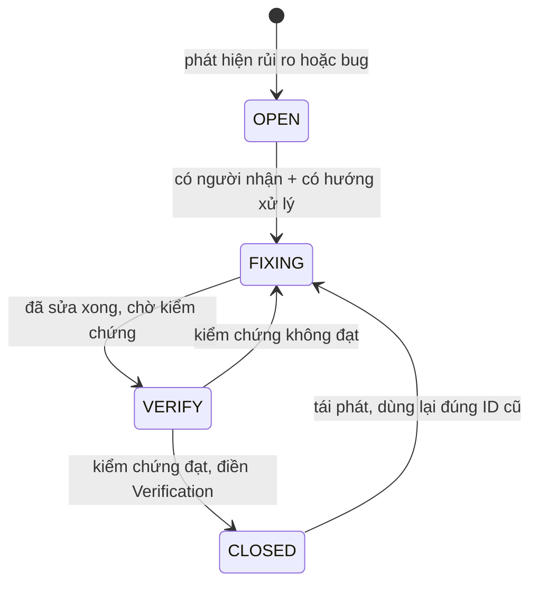

# 12 — Known Issues

> Status: ACTIVE | Phase: 0 | Last updated: 2026-08-07
> Nguồn sự thật cấp trên: BIKEFORCE_MASTER_SPEC.md → docs/11-decisions.md → tài liệu này

---

## 0. ĐỌC TRƯỚC — Đây là RỦI RO, không phải BUG đã quan sát

Tính đến `2026-08-07`, repository **chưa có bất kỳ dòng code nào**: chỉ có `BIKEFORCE_MASTER_SPEC.md`, `PROMPT_FIRST_SESSION.md`, `PROMPT_NEXT_SESSION.md` và thư mục `docs/`. Chưa có `package.json`, chưa có migration, chưa khởi tạo git repository (sẽ khởi tạo ở Phase 1 theo DEC-027).

Hệ quả bắt buộc phải nói thẳng:

- **Không có bug nào được tái hiện**, vì không có gì để chạy.
- Toàn bộ `ISSUE-001` … `ISSUE-007` dưới đây là **rủi ro đã nhận diện ở Phase 0** — những chỗ đã biết trước là sẽ vỡ hoặc sẽ chặn tiến độ nếu không xử lý.
- Trường **Actual** và **Root Cause** của hầu hết các mục ghi đúng sự thật là *chưa quan sát được*, kèm **giả thuyết** rõ ràng là giả thuyết. Không mục nào bịa ra bước tái hiện, log lỗi, hay stack trace.
- Trường **Verification** mô tả **cách sẽ kiểm chứng**, chưa mục nào được kiểm chứng. **Không mục nào được ghi là PASS.**

Khi Phase 1 trở đi phát sinh bug thật, bug đó được thêm vào đây theo đúng cùng một format (xem §5 "Cách thêm issue mới") — không tách file khác, không viết vào chỗ khác.

---

## 1. Severity legend

| Severity | Nghĩa | Ứng xử |
|---|---|---|
| **P1** | **Chặn tiến độ** hoặc **gây mất / lộ dữ liệu**. Không thể đi tiếp phase sau, hoặc dữ liệu người dùng bị sai/mất/rò rỉ. | Dừng việc đang làm, xử lý trước. Không được đóng phase khi còn P1 OPEN. |
| **P2** | **Ảnh hưởng chức năng chính, nhưng có workaround**. Người dùng vẫn hoàn thành được việc bằng đường khác, hoặc có phương án dự phòng đã ghi nhận. | Phải có mitigation ghi rõ trong `Fix:` trước khi phase liên quan được coi là DONE. |
| **P3** | **Nhỏ, hoặc chỉ là nợ kỹ thuật** — chưa ảnh hưởng người dùng ngay, nhưng sẽ đắt dần nếu để lâu. | Ghi nhận, gắn với điều kiện kích hoạt cụ thể. Không được im lặng bỏ qua. |

Quy tắc phân loại khi phân vân: nếu có khả năng **người dùng thấy số liệu sai mà không biết là sai** → P1, không phải P2. Sai thầm lặng luôn nặng hơn lỗi ồn ào.

---

## 2. Status legend

| Status | Nghĩa | Điều kiện chuyển tiếp |
|---|---|---|
| **OPEN** | Đã ghi nhận, chưa ai bắt tay xử lý. | Có người nhận + xác định được cách xử lý → `FIXING`. |
| **FIXING** | Đang sửa / đang thực hiện mitigation. | Code hoặc quyết định đã hoàn tất, chờ kiểm chứng → `VERIFY`. |
| **VERIFY** | Đã sửa, **đang chờ kiểm chứng**. Chưa được coi là xong. | Kiểm chứng đạt → `CLOSED`. Kiểm chứng không đạt → quay lại `FIXING`. |
| **CLOSED** | Đã sửa **và** đã kiểm chứng, trường `Verification:` đã điền bằng chứng cụ thể. | Nếu tái phát: **không tạo ID mới**, chuyển lại `FIXING` và ghi thêm dòng lịch sử vào chính entry đó. |



---

## 3. STANDING RULE — Không bao giờ xoá issue

Nguyên văn quy tắc từ **Master Spec §56**: *"Không xóa issue sau khi fix."*

Diễn giải bắt buộc tuân thủ:

1. **Một issue đã được tạo thì tồn tại vĩnh viễn trong file này.** Kể cả khi đã sửa xong, kể cả khi hoá ra là báo động giả, kể cả khi phạm vi v1 thay đổi làm nó không còn liên quan.
2. Sau khi fix, **chỉ đổi `Status:` sang `CLOSED` và điền `Verification:`** bằng bằng chứng cụ thể (tên test, lệnh đã chạy, kết quả đo, ngày kiểm chứng, người kiểm chứng). Không xoá dòng, không rút gọn, không gộp entry.
3. **ID không bao giờ được tái sử dụng.** `ISSUE-004` đã đóng thì số 004 chết theo nó; issue tiếp theo lấy số kế tiếp của số lớn nhất từng dùng.
4. Nếu một issue **hoá ra không phải vấn đề**, vẫn giữ entry, đặt `Status: CLOSED` và ghi trong `Root Cause:` rằng đây là báo động giả cùng lý do — để session sau không mất công điều tra lại đúng con đường đó.
5. Lý do của quy tắc này: file `docs/12-known-issues.md` là **bộ nhớ dài hạn** của dự án về những chỗ đã từng vỡ. Xoá một entry đã fix là xoá đúng phần thông tin có giá trị nhất — cảnh báo cho lần tới.

---

## 4. Index

| ID | Severity | Status | Chủ đề ngắn gọn | Phase liên quan | ID liên quan |
|---|---|---|---|---|---|
| ISSUE-001 | **P1** | OPEN | OPEN QUESTION mức BLOCKING chưa được trả lời → không viết được migration | Phase 0 → Phase 2 | OQ-01…OQ-13, DEC-025, DEC-026 |
| ISSUE-002 | P2 | OPEN | Satori (`next/og`) chỉ hỗ trợ tập con CSS + cần font có dấu tiếng Việt | Phase 6 | DEC-010, FR-018, UC-08 |
| ISSUE-003 | P2 | OPEN | Zalo in-app webview chưa được kiểm chứng trên thiết bị thật | Phase 6, Phase 11 | NFR-009, DEC-011, FR-020 |
| ISSUE-004 | P2 | OPEN | TypeScript 7.0.2 + ESLint 10.8.0 là bản major mới, chưa xác nhận tương thích Next 16 | Phase 1 | DEC-002, NFR-012 |
| ISSUE-005 | P3 | OPEN | `is_admin()` phát sinh thêm một truy vấn `profiles` mỗi câu lệnh RLS | Phase 2, Phase 11 | DEC-006, NFR-002, NFR-015 |
| ISSUE-006 | P3 | OPEN | Chưa có khái niệm ngày nghỉ → cảnh báo "chưa báo cáo" có thể báo động giả | Phase 8 | OQ-08, AF-02, AF-15, FR-033, UC-20 |
| ISSUE-007 | P3 | OPEN | Chưa có audit log; là điều kiện tiên quyết nếu cho phép sửa sau khi `COMPLETED` | Phase 4+ (điều kiện) | OQ-04, OQ-05, BR-019, BR-020, AF-12 |

Tổng: **7 OPEN** (1 × P1, 3 × P2, 3 × P3), **0 FIXING**, **0 VERIFY**, **0 CLOSED**.

---

## 5. Danh sách issue

### ISSUE-001

**Severity: P1**
**Status: OPEN**

**Module:**
Bàn giao Phase 0 → Phase 2. Ảnh hưởng trực tiếp: `supabase/migrations/0001_init_enums_profiles.sql`, `0002_daily_reports.sql`, `0003_functions_triggers.sql`, `0004_rls_policies.sql` (đều **đề xuất, chưa triển khai**), `docs/01-business-analysis.md`, `docs/02-database-design.md`, `docs/06-auth-permissions.md`, `docs/11-decisions.md`.

**Description:**
Các OPEN QUESTION được đánh dấu **BLOCKING** trong `docs/01-business-analysis.md §OPEN QUESTIONS` chưa có câu trả lời chính thức từ phía nghiệp vụ. Chừng nào chúng còn mở, schema không thể chốt và **không được viết migration Phase 2**, vì mỗi câu trả lời khác đi sẽ kéo theo thay đổi cột, CHECK constraint, hoặc RLS policy — tức là phải viết migration sửa chữa ngay sau khi vừa tạo.

Các câu được đánh dấu BLOCKING và thứ chúng chặn:

| OQ | Chặn cái gì cụ thể |
|---|---|
| OQ-01 | Có tồn tại cột `target_visit_points` (integer) và/hoặc `visit_purpose` (text) hay không → quyết định dòng "Viếng thăm" trong bảng đối chiếu có tính được % hay không |
| OQ-02 | Có tồn tại `actual_visit_points` và/hoặc `actual_route` hay không → mẫu số/tử số của cùng dòng đó |
| OQ-03 | Xác nhận đơn vị: doanh số = số lượng xe (integer), doanh thu = VND (bigint) → kiểu dữ liệu, CHECK range, nhãn UI |
| OQ-04 | RLS `reports_update_own_open`, `public.guard_report_transition()`, BR-019 → có khoá báo cáo khi `COMPLETED` hay không |
| OQ-05 | Có cấp UPDATE policy cho Admin trên cột số liệu hay không, BR-020 → và kéo theo ISSUE-007 |
| OQ-08 | Có bảng/cột ngày nghỉ hay không → logic "chưa báo cáo" (AF-02), kéo theo ISSUE-006 |
| OQ-09 | Sales tự cam kết hay Admin giao chỉ tiêu → nếu Admin giao thì cần bảng `targets` riêng và đổi cả workflow (AF-11) |
| OQ-11 | Hành vi khi `target = 0`, BR-015 → `lib/kpi.ts` `calculateAchievement()` và mọi chỗ hiển thị `%` |
| OQ-12 | RLS INSERT `reports_insert_own_today`, CHECK `ck_report_not_future`, BR-021 → có cho nhập bù ngày cũ hay không |
| OQ-13 | Có cột `deleted_at` hay không, BR-013 → nếu có thì **mọi** truy vấn phải thêm điều kiện lọc |

- *Ghi chú về số đếm (không phải một issue riêng, không cấp ID mới):* bảng OQ trong `docs/01-business-analysis.md` đánh dấu **10** mục là BLOCKING, trong đó **OQ-03** ghi là `BLOCKING (xác nhận)` — tức là câu xác nhận lại điều đã hiểu, không phải câu quyết định mới. Các tài liệu Phase 0 khác nói "9 câu BLOCKING" theo cách đếm loại trừ OQ-03. Cần thống nhất một con số duy nhất khi cập nhật `docs/01` sau khi người dùng trả lời; trước mắt **coi cả 10 câu là phải trả lời**, cách đếm an toàn hơn.

**Expected:**
Trước khi Phase 2 bắt đầu:
1. Mọi OQ BLOCKING có câu trả lời chính thức, ghi kèm ngày và người quyết định.
2. `DEC-025` (BR-015 / OQ-11) và `DEC-026` (BR-013/BR-019/BR-020/BR-021 ↔ OQ-04/OQ-05/OQ-12/OQ-13) chuyển từ `PROPOSED` → `APPROVED` hoặc bị thay bằng quyết định khác trong `docs/11-decisions.md`.
3. `BR-013`, `BR-015`, `BR-019`, `BR-020`, `BR-021` trong `docs/01-business-analysis.md` chuyển từ `PROPOSED` → `APPROVED`.
4. `docs/02-database-design.md` và `docs/06-auth-permissions.md` được đồng bộ theo câu trả lời.
5. Chỉ khi đó mới viết file migration đầu tiên.

**Actual:**
Đây là mục **duy nhất** trong tài liệu này có thể khẳng định trạng thái thực tế, vì nó nói về trạng thái tài liệu chứ không về hành vi phần mềm: tính đến `2026-08-07`, **chưa có câu trả lời nào** cho các OQ BLOCKING. `DEC-025` và `DEC-026` vẫn ở `PROPOSED`. `BR-013/015/019/020/021` vẫn ở `PROPOSED`. Chưa có migration nào tồn tại trong repository.

**Root Cause:**
Không phải lỗi kỹ thuật. Master Spec cố ý để mở một số quyết định nghiệp vụ và đánh dấu chúng là cần xác nhận — §31 `REPORT LOCKING — CẦN XÁC NHẬN`, §32 `DELETE REPORT — CẦN XÁC NHẬN`, §40 `CÂU HỎI BUSINESS CẦN XÁC NHẬN`. Phase 0 đã làm đúng việc của mình là biến chúng thành danh sách `OQ-xx` có đề xuất mặc định và phân tích ảnh hưởng, nhưng **quyền trả lời thuộc về chủ nghiệp vụ**, không thuộc về người/agent viết tài liệu. Tự trả lời thay sẽ tạo ra schema sai một cách im lặng.

**Fix:**
1. Trình danh sách OQ BLOCKING cho người dùng, mỗi câu kèm đề xuất mặc định đã có sẵn để người dùng chỉ cần xác nhận hoặc bác bỏ — giảm chi phí trả lời.
2. Ghi câu trả lời vào `docs/01-business-analysis.md §OPEN QUESTIONS` dưới dạng `Answer:` + ngày, **không xoá câu hỏi gốc**.
3. Cập nhật `docs/11-decisions.md`: DEC-025, DEC-026 → `APPROVED` (hoặc thay bằng DEC mới nếu người dùng chọn khác đề xuất).
4. Đồng bộ `docs/01`, `docs/02`, `docs/03`, `docs/06` theo Documentation Update Matrix (Master Spec §62).
5. Sau đó mới chạy Phase 1 rồi Phase 2.
- **Không dùng workaround "cứ viết migration theo đề xuất mặc định rồi sửa sau".** Với `OQ-09` (Admin giao KPI) và `OQ-13` (soft delete), sửa sau nghĩa là viết lại phần lớn schema và toàn bộ query — chi phí không tuyến tính.

**Verification:**
Checklist đóng issue (chưa mục nào đạt):
- [ ] Mọi OQ BLOCKING trong `docs/01-business-analysis.md` có mục `Answer:` + ngày.
- [ ] `DEC-025`, `DEC-026` trong `docs/11-decisions.md` không còn `Status: PROPOSED`.
- [ ] `BR-013`, `BR-015`, `BR-019`, `BR-020`, `BR-021` không còn `PROPOSED` trong `docs/01`.
- [ ] Bảng cột trong `docs/02-database-design.md` khớp 1-1 với câu trả lời (không còn dòng nào chú thích `(OQ-xx)`).
- [ ] Bảng RLS policy trong `docs/06-auth-permissions.md` khớp với câu trả lời OQ-04/OQ-05/OQ-12/OQ-13.
- [ ] `PROJECT_CHECKLIST.md`: mục "OPEN QUESTION đã được trả lời" chuyển `[x]`.

Khi cả 6 mục đạt → `Status: CLOSED`, ghi ngày và người xác nhận vào chính mục Verification này.

---

### ISSUE-002

**Severity: P2**
**Status: OPEN**

**Module:**
`app/api/reports/[id]/share-image/route.ts` và `features/report-share/DailyReportShareCard.tsx` — **cả hai đều là đề xuất, chưa triển khai**. Liên quan: DEC-010, DEC-021, FR-017, FR-018, FR-019, BR-002, UC-08, Phase 6.

**Description:**
Quyết định DEC-010 chọn sinh ảnh 9:16 **server-side** bằng `ImageResponse` (`next/og`, dựa trên Satori). Satori **không phải trình duyệt**: nó chỉ hỗ trợ một tập con CSS. Ràng buộc đã biết trước:

- Chỉ **flexbox**, **không có CSS grid**. Mọi phần tử có nhiều hơn một con phải khai báo `display: flex` tường minh.
- Không hỗ trợ đầy đủ các thuộc tính layout nâng cao; `-webkit-line-clamp` để cắt ghi chú cuối ngày phải được thay bằng cách cắt tương đương (cắt chuỗi ở tầng dữ liệu, hoặc giới hạn chiều cao + `overflow: hidden`).
- **Font phải được nhúng thủ công**: đọc file `.ttf`/`.woff` bằng `fs` ở Node runtime và truyền vào `ImageResponse`. Font đó **bắt buộc phải có bộ dấu tiếng Việt** (subset `latin` + `vietnamese`) — nếu không, `ừ ẫ ợ ỹ đ` sẽ mất dấu hoặc rơi về glyph rỗng, và lỗi này chỉ lộ ra ở ảnh cuối cùng gửi cho khách.
- Tailwind CSS v4 phát sinh màu ở dạng `oklch()`. Thẻ share **không được** phụ thuộc vào token Tailwind mà phải dùng bảng hex tối cố định đã đo trong `docs/05-ui-ux-design.md` (`#0B1220`, `#FFFFFF`, `#CBD5E1`, `#94A3B8`, `#FBBF24`, `#4ADE80`, `#F87171`, `#60A5FA`).

Rủi ro cụ thể: layout thẻ 9:16 thiết kế ở `docs/05` có thể **không dựng được nguyên vẹn** bằng Satori và phải làm lại giữa Phase 6.

**Expected:**
`GET /api/reports/[id]/share-image` trả về PNG **đúng 1080×1920**, đúng layout dark đã thiết kế (brand + "DAILY SALES REPORT", ngày, tên NV + mã NV, tuyến, bảng 4 dòng Cam kết/Thực đạt/%, dải KPI tổng quan, ghi chú cuối ngày, footer), đủ dấu tiếng Việt, kèm `Content-Disposition: attachment; filename="BikeForce_Report_<Ho-Ten>_<YYYY-MM-DD>.png"` (FR-019) và `Cache-Control: private, no-store`.

**Actual:**
**Chưa quan sát được — đây là rủi ro đã nhận diện ở Phase 0, chưa có code để tái hiện.** Chưa có route handler, chưa có component thẻ, chưa có file font trong repository.

**Root Cause:**
**Chưa xác định được**, vì chưa dựng prototype. Giả thuyết (ghi rõ là giả thuyết): khoảng cách giữa CSS mà thiết kế UI dùng tự nhiên (grid, `line-clamp`, biến màu `oklch` của Tailwind v4) và tập con CSS mà Satori thực sự dựng được. Chỉ prototype mới trả lời được khoảng cách đó rộng đến đâu.

**Fix:**
1. **Việc đầu tiên của Phase 6** là dựng prototype thẻ 9:16 với dữ liệu giả, trước khi nối vào dữ liệu thật. Nếu Satori không dựng nổi, biết ngay từ ngày đầu chứ không phải cuối phase.
2. Viết thẻ theo kỷ luật Satori ngay từ đầu: `display: flex` ở mọi container, không grid, không `oklch`, chỉ hex thuần, không `line-clamp` — cắt ghi chú ở tầng dữ liệu trước khi render.
3. Commit file font Inter (hoặc Be Vietnam Pro) subset `latin+vietnamese` vào repository, đọc bằng `fs` ở Node runtime. Không tải font qua mạng lúc render.
4. **Fallback đã ghi nhận trong DEC-010**: nếu Phase 6 chứng minh Satori không dựng nổi layout cần thiết → chuyển sang `html-to-image` client-side với `next/dynamic({ ssr: false })`, chờ `document.fonts.ready` trước khi chụp, và dùng đúng bảng hex thuần đó cho thẻ share. Việc chuyển này phải **ghi thành một DEC mới** trong `docs/11-decisions.md`, không sửa lén DEC-010.
5. Nếu phải dùng fallback, lưu ý kéo theo: thư viện sinh ảnh không được nằm trong initial bundle (NFR-003) và ISSUE-003 trở nên nặng hơn vì việc chụp DOM chạy ngay trong webview Zalo.

**Verification:**
Kế hoạch kiểm chứng (**chưa chạy**):
- Snapshot 6 edge case bắt buộc: tên 40+ ký tự, tuyến 300 ký tự, ghi chú 1000 ký tự, doanh thu 12 chữ số, achievement 4 chữ số (`1250,0%`), `—` khi `target = 0` (BR-015).
- Kiểm tra thủ công dấu tiếng Việt trên ảnh xuất ra: `ừ ẫ ợ ỹ đ` hiển thị đúng, không rơi font.
- Kiểm tra kích thước file PNG đúng `1080×1920`.
- Kiểm tra header `Content-Disposition` sinh đúng tên file theo FR-019.
- Kiểm tra BR-002: gọi route với report `status = 'MORNING_SUBMITTED'` → bị từ chối.
- Kiểm tra bảo mật: salesA gọi `GET /api/reports/<id-của-salesB>/share-image` → 403/404 (thuộc bộ test E2E security ở `docs/08-testing-strategy.md`).

---

### ISSUE-003

**Severity: P2**
**Status: OPEN**

**Module:**
Luồng chia sẻ ảnh phía client trong `features/report-share/` (**đề xuất, chưa triển khai**). Liên quan: FR-020, NFR-009, DEC-011, UC-08, Playwright project `zalo-like`, Phase 6 và Phase 11.

**Description:**
Kênh phân phối thật của sản phẩm là **Zalo**, và người dùng Sales rất có khả năng mở BikeForce **ngay trong Zalo in-app webview** (bấm link trong khung chat). Ba hành vi then chốt chưa được kiểm chứng trên môi trường đó:

1. `navigator.canShare({ files })` / `navigator.share({ files })` — Web Share API level 2 với file đính kèm (DEC-011, FR-020).
2. Fallback `<a download>` — webview nhúng có thể chặn hoặc âm thầm không làm gì với thuộc tính `download`.
3. Cookie session `httpOnly` do `@supabase/ssr` đặt — hành vi lưu/gửi cookie trong webview nhúng có thể khác trình duyệt thường (đặc biệt khi webview bị reset giữa các lần mở).

NFR-009 nêu rõ Zalo in-app browser nằm trong ma trận tương thích bắt buộc, nên đây không phải "nice to have".

**Expected:**
Sales mở báo cáo `COMPLETED` trong Zalo webview → bấm "Xuất ảnh" → hoặc mở được share sheet có Zalo (đường đi lý tưởng), **hoặc** tải được file PNG về máy với thông báo rõ ràng. Không có trường hợp bấm nút mà **không có gì xảy ra** — đó là trạng thái tệ nhất vì người dùng không biết mình cần làm gì tiếp.

**Actual:**
**Chưa quan sát được — đây là rủi ro đã nhận diện ở Phase 0, chưa có code để tái hiện.** Chưa có app để mở trong Zalo, chưa có thiết bị nào được test.

**Root Cause:**
**Chưa xác định được.** Giả thuyết (ghi rõ là giả thuyết): các webview nhúng thường giới hạn Web Share API — hoặc không expose `navigator.share`, hoặc expose nhưng `canShare({files})` trả `false`, hoặc chấp nhận share text/URL nhưng không chấp nhận file. Thuộc tính `download` trên thẻ `<a>` cũng là chỗ hay bị webview bỏ qua. Chỉ thiết bị thật mới trả lời được.

**Fix:**
1. **Feature detection trước, không giả định**: chỉ hiển thị nút "Chia sẻ" khi `navigator.canShare?.({ files: [file] })` trả `true`; ngược lại hiển thị thẳng nút "Tải ảnh".
2. Chuẩn bị **đường thoát cuối cùng**: nếu cả share lẫn download đều không hoạt động, mở PNG trong tab mới kèm hướng dẫn hiển thị trên màn hình ("Nhấn giữ vào ảnh để lưu về máy"). Đây là hành vi người dùng Việt Nam đã quen, và nó không phụ thuộc API nào.
3. **Test tay trên thiết bị thật ở Phase 6**: tối thiểu 1 Android và 1 iOS, mở link qua chat Zalo thật.
4. Ghi nhận thẳng thắn: Playwright project `zalo-like` **chỉ giả lập userAgent của webview**, nó **không** tái hiện được giới hạn API thật của webview Zalo. Nó có giá trị để bắt lỗi layout, **không** thay thế được test thiết bị thật cho luồng chia sẻ. Không được coi `zalo-like` xanh là bằng chứng ISSUE-003 đã đóng.

**Verification:**
Ma trận test tay phải điền đầy đủ ở Phase 6 (**chưa thực hiện**, bảng dưới là khuôn mẫu, chưa có dữ liệu):

| Thiết bị / OS | Phiên bản Zalo | `canShare({files})` | `navigator.share()` | `<a download>` | Đường thoát "nhấn giữ" | Ngày test |
|---|---|---|---|---|---|---|
| Android (chờ điền) | — | — | — | — | — | — |
| iOS (chờ điền) | — | — | — | — | — | — |

Bổ sung: kiểm tra session còn sống sau khi đóng/mở lại webview; kiểm tra `/login` hoạt động trong webview. Đóng issue khi cả hai dòng ma trận có kết quả thật và có ít nhất một đường đi thành công trên mỗi nền tảng.

---

### ISSUE-004

**Severity: P2**
**Status: OPEN**

**Module:**
Toolchain / `package.json` (**chưa tồn tại**), cấu hình ESLint và TypeScript. Liên quan: DEC-001, DEC-002, NFR-012, Phase 1.

**Description:**
Các phiên bản đã kiểm tra là **latest stable trên npm ngày 2026-08-07**: `next@16.3.0`, `react@19.2.8`, `typescript@7.0.2`, `eslint@10.8.0`, `tailwindcss@4.3.3`. Trong đó **TypeScript 7** và **ESLint 10** đều là bước nhảy major. Rủi ro: `eslint-config-next` của Next 16, plugin `@typescript-eslint`, và trình biên dịch TypeScript 7 có thể chưa khớp peer dependency với nhau, làm `next lint` hoặc `tsc --noEmit` không chạy được — trong khi NFR-012 yêu cầu **TypeScript strict** và **cấm `any` bằng lint** ngay từ đầu.

Nếu phát hiện muộn (sau khi đã viết nhiều feature), chi phí lùi phiên bản cao hơn nhiều so với phát hiện ở ngày đầu Phase 1.

**Expected:**
Ngay sau `create-next-app`, cả ba lệnh nền tảng đều chạy được trên dự án rỗng: build, typecheck (`tsc --noEmit` với `strict: true`), và lint (với rule cấm `any`). Sau đó mới pin phiên bản chính xác vào `package.json`.

**Actual:**
**Chưa quan sát được — đây là rủi ro đã nhận diện ở Phase 0, chưa có code để tái hiện.** Chưa có `package.json`, chưa cài dependency nào, chưa chạy lệnh nào. **Không có kết quả build/typecheck/lint nào tồn tại — không được ghi là PASS ở bất kỳ đâu.**

**Root Cause:**
**Chưa xác định được.** Giả thuyết (ghi rõ là giả thuyết): peer dependency range của `eslint-config-next` / `@typescript-eslint` chưa mở cho `eslint@10` hoặc `typescript@7`, hoặc TypeScript 7 thay đổi hành vi/loại bỏ tuỳ chọn `tsconfig` mà preset của Next đang dùng. Không thể xác nhận nếu chưa cài thật.

**Fix:**
1. **Smoke test là việc đầu tiên của Phase 1**, trước khi viết bất kỳ dòng code feature nào: `create-next-app` → chạy build, typecheck, lint trên dự án rỗng.
2. Nếu vỡ: lùi về **TypeScript 5.x LTS** (và/hoặc ESLint 9) theo đúng phương án dự phòng đã ghi trong **DEC-002**.
3. **Ghi kết quả smoke test vào `docs/11-decisions.md` như phần bổ sung của DEC-002** (phiên bản nào được pin, vì sao), và vào `WORKLOG.md` của ngày làm Phase 1.
4. Chỉ pin phiên bản chính xác **sau** khi smoke test xong. Trước đó, tài liệu chỉ được nói "verified latest stable on 2026-08-07", không được nói "đã dùng".
5. Không tự ý nới lỏng `strict` hoặc tắt rule cấm `any` để cho lint chạy được — đó là đánh đổi sai, vi phạm NFR-012. Nếu buộc phải chọn, lùi phiên bản chứ không hạ tiêu chuẩn.

**Verification:**
Kế hoạch kiểm chứng (**chưa chạy**):
- Chạy build / typecheck / lint trên dự án vừa khởi tạo và **ghi lại nguyên văn kết quả** (kể cả khi lỗi) vào `WORKLOG.md`.
- Ghi bộ phiên bản cuối cùng được pin vào `docs/09-deployment.md` và `docs/11-decisions.md`.
- Xác nhận `tsconfig.json` có `"strict": true` và cấu hình ESLint có rule cấm `any`.
- Đóng issue khi ba lệnh chạy được trên baseline rỗng **và** phiên bản đã được pin **và** DEC-002 đã có phần kết luận.

---

### ISSUE-005

**Severity: P3**
**Status: OPEN**

**Module:**
`supabase/migrations/0003_functions_triggers.sql` và `0004_rls_policies.sql` (**đề xuất, chưa triển khai**) — hàm `public.is_admin()`, `public.is_active_sales()` và toàn bộ RLS policy trên `profiles`, `daily_reports`. Liên quan: DEC-004, DEC-006, NFR-002, NFR-015, Phase 2 và Phase 11.

**Description:**
Mọi RLS policy trong thiết kế đều gọi `public.is_admin()`, mà hàm này thực hiện `exists(select 1 from profiles where id = auth.uid() and role = 'ADMIN' and is_active)`. Nghĩa là **mỗi câu lệnh có RLS đều kèm thêm một lần tra bảng `profiles`**. Kèm theo đó là hai cạm bẫy đã biết:

- Nếu `is_admin()` **không** phải `SECURITY DEFINER`, policy trên `profiles` sẽ tự truy vấn `profiles` → **infinite recursion**, Postgres báo lỗi và mọi truy vấn hỏng.
- Nếu trong policy viết `public.is_admin()` trần thay vì `(select public.is_admin())`, Postgres đánh giá hàm **cho từng row** thay vì nâng thành InitPlan đánh giá một lần cho cả câu lệnh — chi phí tăng tuyến tính theo số row quét.

Ở quy mô v1 (NFR-015: 50 Sales × 365 ngày ≈ 18k row/năm) chi phí này gần như không đáng kể — vì vậy đây là **P3, nợ kỹ thuật**, không phải lỗi hiệu năng đang xảy ra.

**Expected:**
Truy vấn danh sách báo cáo của Admin (`/admin/reports`, có filter + phân trang server-side theo FR-026) dùng index `idx_daily_reports_date_status` và **không** phát sinh một lần tra `profiles` cho mỗi row (NFR-002).

**Actual:**
**Chưa quan sát được — đây là rủi ro đã nhận diện ở Phase 0, chưa có code để tái hiện.** Chưa có Supabase project, chưa có bảng, chưa chạy `EXPLAIN ANALYZE` lần nào.

**Root Cause:**
Đây là **nguyên nhân cấu trúc, đã biết trước**, không phải bug chờ điều tra: RLS cần biết role của người dùng; role được lưu trong bảng `profiles`; vì vậy policy trên chính `profiles` buộc phải truy vấn `profiles`. Cách duy nhất cắt vòng lặp là `SECURITY DEFINER` (bỏ qua RLS bên trong hàm), và cách duy nhất tránh đánh giá theo từng row là để Postgres nâng lời gọi thành InitPlan.

**Fix:**
1. **Đã nằm sẵn trong thiết kế (DEC-006), phải thực hiện đúng, không được đơn giản hoá:**
   - `public.is_admin()` khai báo `stable security definer set search_path = public, pg_temp`.
   - Trong policy **luôn** viết `(select public.is_admin())`, không bao giờ viết `public.is_admin()` trần.
   - Áp dụng cùng kỷ luật đó cho `(select auth.uid())` và `public.is_active_sales()`.
2. Nếu về sau đo được là vẫn chậm ở quy mô lớn hơn: chuyển `role` vào **custom JWT claim** (custom access token hook của Supabase) và đọc từ `auth.jwt()` — khi đó policy không cần tra `profiles` nữa.
3. Nếu chọn phương án JWT claim, phải ghi thành **DEC mới** và tài liệu hoá hệ quả: đổi role không có hiệu lực cho tới khi token được refresh, nên UC-19 (kích hoạt/vô hiệu hoá tài khoản) cần cân nhắc thêm bước huỷ session. **Không đổi sang JWT claim ở v1 khi chưa có số đo chứng minh cần thiết** — tối ưu sớm ở đây đắt hơn lợi ích.

**Verification:**
Kế hoạch kiểm chứng (**chưa chạy**):
- `EXPLAIN ANALYZE` truy vấn danh sách báo cáo của Admin dưới JWT admin thật trên Supabase local (DEC-022): kỳ vọng thấy **InitPlan** cho `is_admin()`, không phải SubPlan chạy lại theo từng row; kỳ vọng thấy index scan trên `idx_daily_reports_date_status`.
- Test RLS phải chứng minh không xảy ra lỗi recursion khi `select` trên `profiles` bằng cả JWT admin lẫn JWT sales.
- Ghi số đo vào `docs/08-testing-strategy.md` như một phần của bộ test NFR-002.
- Đóng issue khi có số đo thật chứng minh chi phí chấp nhận được ở quy mô NFR-015.

---

### ISSUE-006

**Severity: P3**
**Status: OPEN**

**Module:**
AF-02 Missing Report Alerts trên `/admin` (**đề xuất, chưa triển khai**). Liên quan: FR-033, UC-20, OQ-08, AF-15, Phase 8.

**Description:**
Theo đề xuất mặc định của **OQ-08**, v1 **không có** khái niệm ngày nghỉ / nghỉ phép / không đi thị trường. Do đó cảnh báo "Sales chưa báo cáo" chỉ có thể được tính bằng cách: lấy mọi `profiles` có `role = 'SALES'` và `is_active = true`, trừ đi những người đã có row `daily_reports` với `report_date = public.vn_today()`.

Tập kết quả đó **bao gồm cả** người đang nghỉ phép, nghỉ lễ, nghỉ ốm, hoặc đơn giản là hôm nay không có lịch đi thị trường. Admin sẽ thấy họ trong danh sách "chưa báo cáo" và có thể đốc thúc nhầm người. Nếu chuyện này lặp lại, hệ quả thật không phải kỹ thuật mà là **niềm tin vào cảnh báo giảm dần** — Admin bắt đầu bỏ qua toàn bộ danh sách, làm mất luôn giá trị của AF-02, vốn được đánh giá là tính năng có giá trị vận hành cao nhất.

**Expected:**
Cảnh báo chỉ trỏ vào người **thực sự quên báo cáo** trong một ngày họ đáng lẽ phải báo cáo.

**Actual:**
**Chưa quan sát được — đây là rủi ro đã nhận diện ở Phase 0, chưa có code để tái hiện.** Chưa có `/admin`, chưa có truy vấn alert, chưa có người dùng thật.

**Root Cause:**
Đây là **hệ quả của quyết định phạm vi**, không phải lỗi triển khai. Mô hình dữ liệu hiện tại **không có chỗ nào để biểu đạt** ý "hôm nay tôi không đi thị trường": `daily_reports` chỉ có hai trạng thái `MORNING_SUBMITTED` và `COMPLETED` (DEC-020), và không có row nào nghĩa là "chưa báo cáo" — không phân biệt được với "không cần báo cáo". Nguyên nhân gốc nằm ở OQ-08 chưa được trả lời, chứ không nằm ở câu SQL.

**Fix:**
Mitigation cho v1 (không cần đổi schema):
1. **Đặt nhãn mô tả, không phán xét.** Hiển thị "Chưa có báo cáo hôm nay" thay vì "Vi phạm", "Trễ hạn", hay "Không tuân thủ". Nhãn mô tả sự kiện thì đúng trong mọi trường hợp; nhãn phán xét thì sai ngay khi người đó đang nghỉ phép.
2. **Không dùng chỉ số này để tính tỷ lệ tuân thủ, xếp hạng, hay đánh giá cá nhân** ở v1. Nó là danh sách nhắc việc cho Admin, không phải số liệu nhân sự.
3. Cho Admin thấy rõ con số này được tính từ đâu (tooltip hoặc dòng chú thích: "Tính trên các tài khoản Sales đang hoạt động, chưa có báo cáo cho ngày hôm nay").
4. Nếu **OQ-08 được trả lời là "có"**: kích hoạt **AF-15** (Quản lý ngày nghỉ / không đi thị trường) từ `docs/10-future-roadmap.md`, thêm bảng hoặc cột tương ứng và loại trừ khỏi truy vấn alert. Việc này phải ghi thành **DEC mới** và cập nhật `docs/02`, `docs/06` theo Master Spec §62.

**Verification:**
Kế hoạch kiểm chứng (**chưa thực hiện**):
- Rà lại toàn bộ nhãn UI của khối alert ở `/admin` khi làm Phase 8, đối chiếu với mục 1 và 3 ở trên.
- Sau khi hệ thống chạy thật khoảng một tuần, hỏi Admin trực tiếp: trong danh sách "chưa báo cáo" mỗi ngày, bao nhiêu người thực sự là quên? Nếu tỷ lệ báo động giả cao đến mức Admin ngừng dùng danh sách → kích hoạt AF-15 và mở lại OQ-08.
- Đóng issue khi hoặc (a) OQ-08 được xác nhận là "không cần" và Admin chấp nhận nhãn mô tả, hoặc (b) AF-15 đã triển khai và alert đã loại trừ ngày nghỉ.

---

### ISSUE-007

**Severity: P3**
**Status: OPEN**

**Module:**
`public.daily_reports` (**đề xuất, chưa triển khai**), RLS policy `reports_update_own_open`, trigger `public.guard_report_transition()`, AF-12 (roadmap). Liên quan: OQ-04, OQ-05, BR-019, BR-020, BR-002, DEC-026, Phase 4 trở đi (theo điều kiện).

**Description:**
v1 **không có audit log**. Ở phương án mặc định điều này chấp nhận được, vì báo cáo bị khoá ngay khi chuyển sang `COMPLETED`: policy `reports_update_own_open` có `USING ... AND status = 'MORNING_SUBMITTED'`, nên sau khi hoàn tất thì không còn row nào khớp điều kiện UPDATE, báo cáo tự khoá; và Admin không được cấp quyền UPDATE trên các cột số liệu (BR-020).

Rủi ro nằm ở nhánh còn lại: **nếu OQ-04 được trả lời là (b) hoặc (c), hoặc OQ-05 được trả lời là "Admin được sửa"**, thì số liệu đã hoàn tất trở nên sửa được mà **không có bất kỳ dấu vết nào** về ai sửa, sửa lúc nào, từ giá trị nào sang giá trị nào.

Điều làm rủi ro này nghiêm trọng hơn vẻ ngoài của nó: theo BR-002 và Master Spec §12 (save trước — export sau), ảnh PNG **đã được gửi lên Zalo** trước khi ai đó sửa. Sau khi sửa, **ảnh trong nhóm chat và số trong database nói hai điều khác nhau**, và không ai chứng minh được cái nào đúng. Đây chính là kịch bản tranh chấp số liệu mà audit log sinh ra để giải quyết.

Xếp P3 vì ở cấu hình mặc định của v1 điều này **không thể xảy ra**; nó chỉ trở thành vấn đề khi quyền sửa được mở.

**Expected:**
Mọi thay đổi số liệu sau khi báo cáo đạt `COMPLETED` phải truy vết được đầy đủ: **ai** thay đổi, **khi nào**, **giá trị cũ → giá trị mới**, và bản ghi truy vết đó **không sửa/xoá được bởi bất kỳ role nào**.

**Actual:**
**Chưa quan sát được — đây là rủi ro đã nhận diện ở Phase 0, chưa có code để tái hiện.** Chưa có bảng nào, chưa có ai sửa gì.

**Root Cause:**
Chưa quyết định được phạm vi (OQ-04, OQ-05) nên chưa thiết kế bảng lịch sử. Trong schema hiện tại **không có cột hay bảng nào lưu giá trị trước khi sửa**: `updated_at` (do trigger `public.set_updated_at()` cập nhật) chỉ cho biết *"đã có thay đổi"*, không cho biết *"đổi cái gì"* và không cho biết *"do ai"*.

**Fix:**
1. **Giữ nguyên khoá cứng ở v1** — tức giữ đề xuất mặc định OQ-04 (a) "khoá ngay khi `COMPLETED`" và OQ-05 "Admin không sửa". Đây là cách rẻ nhất để không cần audit log.
2. **Nếu người dùng chọn cho phép sửa** (bất kể nhánh nào của OQ-04/OQ-05), thì **AF-12 là điều kiện tiên quyết, không phải việc làm sau**. Trình tự bắt buộc:
   - Tạo bảng `report_audit_log` dạng **append-only**: không cấp policy UPDATE, không cấp policy DELETE cho bất kỳ role nào.
   - Ghi bằng trigger `AFTER UPDATE ON public.daily_reports`, lưu tối thiểu: `report_id`, `changed_by` (`auth.uid()`), `changed_at`, và giá trị cũ/mới của các cột số liệu.
   - **Chỉ sau khi bảng và trigger đã có và đã test**, mới nới RLS policy cho phép UPDATE.
3. Ghi việc này thành **DEC mới** trong `docs/11-decisions.md`, cập nhật `docs/02-database-design.md` (schema) và `docs/06-auth-permissions.md` (policy) theo Master Spec §62.
4. Cân nhắc thêm khi mở quyền sửa: nếu số liệu thay đổi sau khi đã xuất ảnh, UI nên cảnh báo người dùng rằng ảnh đã gửi không còn khớp — nhưng đây là quyết định nghiệp vụ, không tự quyết.

**Verification:**
Kế hoạch kiểm chứng, **chỉ áp dụng nếu quyền sửa được mở** (hiện chưa áp dụng ở v1):
- Test RLS phải chứng minh: không role nào (`SALES`, `ADMIN`, `authenticated`) UPDATE hoặc DELETE được row trong `report_audit_log`.
- Test integration: sửa một `daily_reports` đã `COMPLETED` → sinh **đúng một** dòng audit, chứa đúng `changed_by`, và đúng cặp giá trị cũ/mới.
- Test: xoá bảng khỏi đường đi (giả lập trigger hỏng) → thao tác UPDATE phải **thất bại**, không được âm thầm bỏ qua audit.
- Nếu v1 giữ khoá cứng: kiểm chứng bằng test RLS chứng minh salesA **không** UPDATE được report của chính mình khi `status = 'COMPLETED'` (0 rows affected), và Admin **không** UPDATE được cột số liệu của bất kỳ report nào. Khi đó ISSUE-007 chuyển `CLOSED` với ghi chú "không áp dụng ở v1 vì báo cáo bị khoá — mở lại nếu OQ-04/OQ-05 thay đổi".

---

## 6. Cách thêm issue mới

Áp dụng cho mọi session sau. Mục tiêu: file này phải đọc được như một dòng thời gian nhất quán, không phải một đống ghi chú rời.

### 6.1. Khi nào phải thêm

Theo Documentation Update Matrix (Master Spec §62): **có bug mới → cập nhật `docs/12-known-issues.md`**. Ngoài ra thêm entry khi:

- Phát hiện một rủi ro cụ thể, có thể mô tả bằng câu "nếu X thì Y sẽ hỏng", chứ không phải một lo lắng chung chung.
- Quality gate sau một phase (Master Spec §42) phát hiện lỗi mà **không** sửa ngay trong phase đó.
- Một quyết định trong `docs/11-decisions.md` tạo ra nợ kỹ thuật đã biết trước — ghi issue P3 và trỏ về DEC tương ứng.

**Không** tạo issue cho: ý tưởng tính năng (→ `docs/10-future-roadmap.md`), câu hỏi nghiệp vụ chưa có lời đáp (→ mục `OQ-xx` trong `docs/01-business-analysis.md`), hay lựa chọn kỹ thuật (→ `DEC-xxx` trong `docs/11-decisions.md`).

### 6.2. Cấp ID

- Lấy **số lớn nhất từng dùng + 1**. Tại thời điểm `2026-08-07`, số lớn nhất là `007` → issue tiếp theo là `ISSUE-008`.
- **Không tái sử dụng** ID của issue đã `CLOSED`.
- **Không renumber** các issue cũ vì bất kỳ lý do gì — ID được tham chiếu từ `SESSION_CHECKPOINT.md`, `WORKLOG.md` và các docs khác.

### 6.3. Khuôn mẫu bắt buộc (Master Spec §56 — copy nguyên xi)

```text
ISSUE-00X

Severity: P1 / P2 / P3
Status: OPEN / FIXING / VERIFY / CLOSED

Module:
Description:
Expected:
Actual:
Root Cause:
Fix:
Verification:
```

### 6.4. Quy tắc điền từng trường

| Trường | Phải chứa | Không được |
|---|---|---|
| `Severity` | Đúng một trong P1/P2/P3 theo legend §1 | Bỏ trống, hoặc tự chế mức mới |
| `Status` | Đúng một trong OPEN/FIXING/VERIFY/CLOSED theo legend §2 | Ghi "đang xem xét", "chờ" hay trạng thái tự chế |
| `Module` | Đường dẫn file/route/bảng cụ thể. Nếu chưa tồn tại, ghi rõ **"(đề xuất, chưa triển khai)"** | Ghi chung chung kiểu "backend", "frontend" |
| `Description` | Hiện tượng cụ thể + điều kiện xảy ra | Mô tả cảm tính, không thể kiểm chứng |
| `Expected` | Hành vi đúng, gắn với `FR-xxx` / `BR-xxx` / `NFR-xxx` cụ thể | Kỳ vọng mơ hồ kiểu "nên chạy tốt" |
| `Actual` | Hành vi thật đã quan sát, kèm cách tái hiện. **Nếu chưa quan sát được thì ghi thẳng như vậy** | **Bịa ra bước tái hiện, log, hay stack trace chưa từng thấy** |
| `Root Cause` | Nguyên nhân đã xác minh. Nếu chỉ là giả thuyết, **ghi rõ đó là giả thuyết** | Đoán mò rồi trình bày như sự thật |
| `Fix` | Cách sửa cụ thể, hoặc mitigation + điều kiện kích hoạt | Ghi "sẽ sửa sau" mà không có điều kiện gì |
| `Verification` | Cách kiểm chứng cụ thể: tên test, lệnh, số đo, thiết bị | **Ghi bất kỳ trạng thái test/build nào là PASS khi chưa chạy** |

Quy tắc chung: **không để trống trường nào**. Nếu chưa biết, viết ra là chưa biết và vì sao chưa biết — đó là thông tin, còn ô trống thì không.

### 6.5. Khi đóng một issue

1. Chuyển `Status:` → `VERIFY` khi đã sửa, **chưa** phải `CLOSED`.
2. Chạy đúng bước đã ghi trong `Verification:`, rồi **điền kết quả thật** vào chính trường đó: tên test, ngày, người kiểm chứng, số đo.
3. Chỉ khi kiểm chứng đạt mới chuyển `Status:` → `CLOSED`.
4. **Không xoá entry** (§3). Không rút gọn nội dung cũ.
5. Cập nhật kèm theo: bảng Index ở §4, mục `## Known Issues` trong `SESSION_CHECKPOINT.md`, và entry ngày tương ứng trong `WORKLOG.md`.
6. Nếu issue tái phát: giữ nguyên ID, chuyển về `FIXING`, và **thêm** một dòng lịch sử vào entry (ngày tái phát + bối cảnh) thay vì tạo ID mới.

---

## OPEN QUESTIONS

Các `OQ-xx` ảnh hưởng **trực tiếp** tới tài liệu này. Danh sách đầy đủ, có phân tích ảnh hưởng và mức độ chặn, nằm ở `docs/01-business-analysis.md §OPEN QUESTIONS` — mục dưới đây chỉ tóm tắt.

| OQ | Câu hỏi rút gọn | Đề xuất mặc định | Issue bị ảnh hưởng |
|---|---|---|---|
| OQ-04 | Sales hoàn tất báo cáo cuối ngày rồi có được sửa không? | (a) Khoá ngay khi `COMPLETED` | ISSUE-001, ISSUE-007 |
| OQ-05 | Admin có được sửa báo cáo của Sales không? | Không trong v1; nếu buộc phải sửa thì cần audit log (AF-12) | ISSUE-001, ISSUE-007 |
| OQ-08 | Có khái niệm ngày nghỉ / nghỉ phép / không đi thị trường không? | v1 không có | ISSUE-001, ISSUE-006 |
| OQ-11 | Khi `target = 0` thì `%` hoàn thành hiển thị thế nào? | `actual = 0` → 100%; `actual > 0` → `—` + "Vượt kế hoạch"; tuyệt đối không `NaN`/`∞` | ISSUE-001, ISSUE-002 (edge case snapshot) |
| OQ-12 | Có được nhập trễ / nhập bù ngày cũ không? Có giờ cắt không? | Chỉ đúng ngày hôm nay theo giờ VN, không giới hạn giờ, không nhập bù | ISSUE-001 |
| OQ-13 | Có được xoá báo cáo không? Soft hay hard delete? | v1 không xoá; nếu cần thì soft delete + chỉ Admin | ISSUE-001, ISSUE-007 |

Ngoài ra `ISSUE-001` bao trùm **toàn bộ** các OQ mức BLOCKING, kể cả những câu không liệt kê trong bảng trên (`OQ-01`, `OQ-02`, `OQ-03`, `OQ-09`), vì chừng nào chúng còn mở thì migration Phase 2 vẫn chưa được viết.
